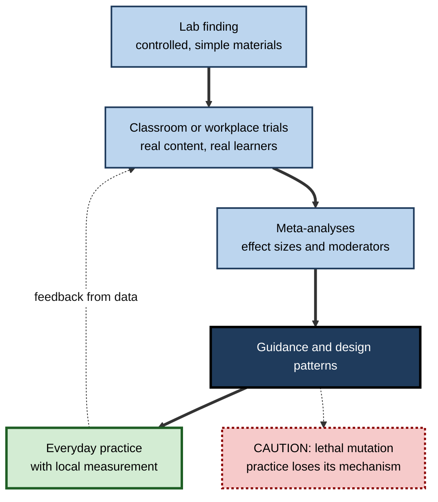
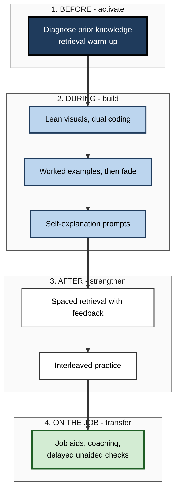

# C.12. Applied Cognitive Psychology in Education

> **In one sentence:** Applied cognitive psychology in education takes what is known about attention, memory, understanding and reasoning, tests it in real classrooms and workplaces, and turns it into teaching and training practices that reliably help people learn.
>
> **Why it matters:** Billions are spent on education and corporate training, yet much of it ignores well-established findings about how learning works. Professionals who can translate cognitive science into design — and judge which findings survive the trip from lab to real life — build training that people remember and use.
>
> **Level span:** Novice → Expert · **Reading time:** ~19 min · **Builds on:** All earlier notes in this subtopic

---

## The Learning Ladder

| Level | Badge | After this level you can... |
|---|---|---|
| 1 | NOVICE | Explain what it means to apply cognitive psychology to teaching and training. |
| 2 | FOUNDATIONS | Name the best-supported principles and the low-value habits they replace. |
| 3 | PRACTITIONER | Redesign a lesson, workshop or onboarding module using cognitive principles. |
| 4 | ADVANCED | Judge evidence quality, boundary conditions and the lab-to-classroom gap, including recent meta-analytic nuances. |
| 5 | EXPERT / PRO | Lead evidence-informed learning programmes, evaluate AI tutors and build a culture of measurement. |

---

## Level 1 · Novice — The Big Picture

Imagine two training courses on the same topic. In the first, people listen to a long, polished presentation, re-read the slides, highlight key points and take a quiz straight away. In the second, people get a short explanation with a clear diagram, try to recall the key ideas from memory, practise mixed problems over several weeks, and get feedback each time. People enjoy the first more. People remember and use the second far more.

**Applied cognitive psychology in education** is the work of figuring out why the second course works better — using what we know about memory, attention and understanding — and making that kind of design normal.

An analogy: cognitive psychology is like nutrition science; education is cooking. Knowing that protein builds muscle does not tell you how to cook a good meal for a school canteen. Applied work is the translation: recipes that respect the science *and* work in a real kitchen with real budgets and real eaters.

You have already experienced it:

- Flashcards that make you recall the answer before flipping. **Retrieval practice.**
- A language app that brings back words just before you forget them. **Spacing.**
- A teacher who showed a fully solved example before asking you to try. **Worked examples.**

The key idea for a beginner: **how something is taught changes how well it is learned, and cognitive psychology tells us which ways work best.**

---

## Level 2 · Foundations — Core Concepts

### The principles with the strongest support

In 2013 John Dunlosky and colleagues rated ten common study techniques. **Practice testing** and **distributed practice** received "high utility" ratings; **highlighting**, **re-reading** and **summarisation** (as typically done) received "low utility". Later work and organisations such as the Deans for Impact and Institute of Education Sciences practice guides converged on a compact set of principles:

| Principle | What it means | Cognitive mechanism |
|---|---|---|
| **Retrieval practice** | Recall information from memory rather than re-reading | Retrieval strengthens and reorganises memory traces |
| **Spacing** | Spread practice over time instead of cramming | Forgetting between sessions makes re-learning more durable |
| **Interleaving** | Mix related problem types in practice | Forces choosing the right method; sharpens category boundaries |
| **Worked examples** | Study solved problems before solving alone | Reduces working-memory load for novices |
| **Dual coding** | Combine words with relevant visuals | Two linked representations support understanding and recall |
| **Elaboration and self-explanation** | Ask "why?" and "how does this connect?" | Builds links to prior knowledge and situation models |
| **Concrete examples** | Illustrate abstract ideas with varied cases | Anchors abstractions; variety supports transfer |
| **Feedback** | Timely information about correctness and why | Corrects errors and guides next attempts |

Many of these are taught in depth in sibling subtopics and in the study-strategies topic. This note focuses on **how they are applied and evaluated** in real settings.

### Key terms

| Term | Plain meaning |
|---|---|
| **Applied cognitive psychology** | Using cognitive findings to solve real-world problems. |
| **Translational research** | Research that moves findings from the lab into practice and tests them there. |
| **Ecological validity** | How well a study's conditions reflect real-world settings. |
| **Effect size** | How large an effect is, independent of sample size. |
| **Boundary condition** | A circumstance in which an effect weakens or disappears. |
| **Fidelity** | Whether a practice is implemented as intended. |
| **Evidence-informed practice** | Combining research evidence with professional judgement and local data. |

**Figure C.12-1 — From lab finding to everyday practice.**

*How to read it:* the thick path is translation from lab to practice; the dotted loop is local data informing new trials; the dotted-border box warns that principles can be distorted in implementation.

---

## Level 3 · Practitioner — Putting It to Work

### Redesigning a training session in six moves

1. **Start with retrieval.** Open with 3–5 low-stakes questions on last session's content, answered from memory.
2. **Explain with a lean visual.** One clear diagram, words placed next to the parts they describe, no decorative clutter.
3. **Show a worked example, then fade it.** Solve one fully, then a partly solved one, then let learners solve alone.
4. **Prompt self-explanation.** "Why does this step work? How is this like last week's case?"
5. **Practise mixed problems.** After initial learning, interleave the new type with earlier types.
6. **Schedule spaced follow-ups.** Short retrieval quizzes or tasks at roughly one day, one week and one month, with feedback.

### Worked example — a sales enablement programme

| | Before | After |
|---|---|---|
| **Structure** | Two-day bootcamp: product slides, role-play on day two, certification quiz at the end. | Half-day kickoff, then 20-minute weekly sessions for six weeks. |
| **Learning activities** | Listening, re-reading product sheets. | Each session opens with recall of objection-handling responses; mixed role-plays across products; annotated recordings of top performers as worked examples. |
| **Check** | Immediate quiz with notes. | Unaided scenario test at week eight; manager-observed calls. |
| **Outcome** | High satisfaction; reps revert to old pitch within a month. | Slightly lower satisfaction early; objection-handling quality and win rate on targeted products improve. |

### Common mistakes at this level

- **"Quiz" as assessment only.** Retrieval works as a *learning* activity; keep it low-stakes and frequent.
- **Massing everything into one event** because it is easier to schedule.
- **Over-decorated slides.** Irrelevant images and animations add load without adding learning.
- **Abandoning a method because learners rate it as harder.** Effortful methods often feel worse and work better.

---

## Level 4 · Advanced — Mechanisms, Models & Evidence

### Effect sizes are smaller and more variable in the wild

Lab studies often use word lists and short delays; real learning involves complex content, motivation and busy lives. Recent meta-analyses show both robustness and nuance:

- Retrieval practice benefits learners of many ages and subjects in real classrooms; reviews summarising classroom studies report consistent benefits, with feedback adding further gains.
- A 2025 meta-analysis of mathematics learning found a robust small-to-medium benefit of **spacing** over massed practice, but the **testing effect** for mathematics was smaller and its confidence interval included zero — possibly because maths requires learning procedures and problem types rather than retrieving facts.
- A 2025 meta-analysis comparing retrieval practice with **elaborative** study found only a small overall advantage for retrieval, which became substantial when **feedback** was provided; without feedback, elaboration was competitive.
- Interleaving helps most when categories or problem types are confusable; it can be unnecessary for very different material.

The lesson is not that principles fail, but that **effect size depends on material, learner knowledge, feedback and implementation**.

### Boundary conditions practitioners must know

| Principle | Works best when | Weakens when |
|---|---|---|
| Retrieval practice | Learners can retrieve some answers; feedback is given | Material is completely new and retrieval fails without support |
| Spacing | Retention over weeks or months matters | Only a same-day test matters |
| Worked examples | Learners are novices | Learners are already skilled (expertise reversal) |
| Interleaving | Problem types are similar and easily confused | Types are very different or not yet understood |
| Dual coding | Visuals carry essential structure | Visuals are decorative or duplicate text read aloud |
| Discovery learning | Learners have strong prior knowledge | Novices with minimal guidance |

### The lab-to-practice gap and "lethal mutations"

Education researchers use the phrase **lethal mutation** for practices that keep a principle's name but lose its mechanism: "retrieval practice" turned into open-book quizzes, "spacing" turned into a single reminder email, "dual coding" turned into adding stock photos. Implementation fidelity — keeping the active ingredient — is as important as choosing the right principle.

### Myths that persist in schools and organisations

Surveys repeatedly find that large majorities of teachers and many trainers endorse neuromyths: learning styles matching, left- and right-brain learners, "we use 10% of our brains", and claims that short bursts of coordination exercises improve brain integration. Training in the science of learning reduces some myths, though not all.

### What recent research added: AI tutors

Generative AI tutors are the newest application area. A 2025 field experiment with high-school students showed that unrestricted access to a chatbot raised practice performance but lowered later unaided exam performance, while a version designed to give hints rather than answers avoided most of the harm. Other trials of carefully designed AI tutors — built on cognitive principles such as prompting retrieval, guiding step by step and requiring the learner's own attempt — have reported learning gains. The emerging consensus: **AI tutors help when designed around how learning works and harm when they make thinking unnecessary.**

**Figure C.12-2 — Principles mapped to the moments of a learning journey.**

*How to read it:* each stage of a learning journey has principles that fit it best; thick arrows mark the transitions between stages.

---

## Level 5 · Expert / Pro — Professional Mastery

### Leading evidence-informed learning programmes

| Area | Pro practice |
|---|---|
| **Needs analysis** | Start from the job performance gap, not from content; decide what must be in memory versus in tools |
| **Design standards** | Build principles into templates: every module opens with retrieval, uses worked examples, ends with spaced follow-ups |
| **Evaluation** | Measure delayed, unaided performance and on-the-job behavior; use comparison groups or staggered rollouts |
| **Implementation fidelity** | Audit live sessions and e-learning for lethal mutations |
| **Capability building** | Train designers and facilitators in the science of learning and in reading evidence |
| **Tooling** | Use spaced-retrieval platforms, scenario simulators and analytics that track retention, not just completion |
| **AI policy** | Configure AI assistants as tutors (hints, questions, critique) for learning contexts; allow full assistance only where learning is not the goal |

### Evaluating claims and products

When a vendor or internal team proposes a new learning product, the expert asks:

1. Which cognitive mechanism is it supposed to use?
2. Is there evidence from realistic settings, not just lab studies or testimonials?
3. What is the comparison — business as usual or a strong alternative?
4. Are outcomes measured after a delay and without support?
5. Can we run a small trial with our own learners and metrics?

### Professional scenario

**Role:** Chief learning officer at a global bank introducing an AI tutor for new risk analysts.
**Situation:** A pilot showed that analysts using the AI completed exercises much faster and rated the experience highly; leadership wants to scale it.
**What the pro does:** Notes that faster completion with AI help is performance, not learning. Re-runs the pilot with three groups — no AI, AI giving answers, AI configured to give hints and ask questions after each analyst attempt — and a delayed, unaided case assessment four weeks later. The hint-based configuration matches or beats the no-AI group with less instructor time; the answer-giving configuration scores lowest. The bank scales the hint-based design, keeps answer mode for experienced analysts' production work, and adds spaced retrieval quizzes to the onboarding path.

### Expert-level judgement

- **Principles are robust; effect sizes are local.** Always measure in your context.
- **Protect the active ingredient** of each principle during implementation.
- **Expect lower satisfaction for effective methods** and explain why to learners and stakeholders.
- **Decide deliberately what people must know** versus what tools can hold.
- **Treat AI as a design choice:** the same model can build or erode learning depending on configuration.

---

## Myths vs. Evidence

| Myth | What the evidence shows |
|---|---|
| "Re-reading and highlighting are effective study methods." | They are rated low utility; retrieval and spacing work better. |
| "If learners enjoyed it, they learned." | Satisfaction is weakly related to learning; effective methods often feel harder. |
| "Every principle works equally well for every subject." | Effects vary; for example the testing effect appears weaker in mathematics than spacing. |
| "Discovery learning is always better than direct instruction." | Novices learn more with explicit guidance and worked examples. |
| "Adding images always helps." | Only relevant visuals help; decorative ones can distract. |
| "AI tutors automatically improve learning." | Answer-giving tools can harm unaided performance; hint-based designs perform better. |

## Practitioner Toolkit

**Lesson or module design checklist**

- [ ] Opens with low-stakes retrieval of prior content.
- [ ] Uses one lean visual with words beside the parts they describe.
- [ ] Includes a worked example that fades into independent practice.
- [ ] Prompts learners to explain why.
- [ ] Includes interleaved practice after initial learning.
- [ ] Schedules spaced follow-ups with feedback.
- [ ] Measures delayed, unaided performance.
- [ ] AI tools (if any) give hints and questions before answers.

**Evaluation plan template**

| Question | Measure | When | Comparison |
|---|---|---|---|
| Did they learn? | Unaided scenario test | 4–8 weeks after | Previous cohort or control group |
| Do they use it? | Observation, work samples | 1–3 months | Baseline |
| Did it matter? | Business metric linked to the skill | Quarter | Staggered rollout |

## Self-Check

1. **[NOVICE]** What does it mean to apply cognitive psychology to education?
2. **[NOVICE]** Name two study habits that feel productive but work poorly.
3. **[FOUNDATIONS]** Name five principles with strong evidence.
4. **[FOUNDATIONS]** What is a boundary condition? Give an example.
5. **[PRACTITIONER]** Redesign a one-hour lecture using at least four principles.
6. **[ADVANCED]** What did recent meta-analyses show about the testing effect in mathematics and retrieval versus elaboration?
7. **[ADVANCED]** What is a lethal mutation? Give an example.
8. **[EXPERT / PRO]** How would you evaluate an AI tutor before scaling it?
9. **[EXPERT / PRO]** Why might an effective programme receive lower satisfaction scores, and how do you handle that?

### Answer Key

1. Using findings about memory, attention and understanding to design and test teaching and training in real settings.
2. Re-reading and highlighting (also cramming).
3. Retrieval practice, spacing, interleaving, worked examples, dual coding, self-explanation, concrete examples, feedback.
4. A condition under which an effect weakens; for example worked examples help novices but can hinder experts.
5. For example: open with retrieval questions, explain with one lean diagram, show and fade a worked example, prompt self-explanation, end with interleaved practice and schedule spaced follow-ups.
6. Spacing showed a robust benefit in maths but the testing effect was small and uncertain; retrieval beat elaboration only slightly overall, substantially when feedback was given.
7. A practice that keeps the principle's name but loses its mechanism — such as open-book "retrieval" quizzes.
8. Compare configurations against a no-AI group using delayed, unaided assessments; check that it requires learner attempts and gives hints before answers.
9. Effective methods are effortful and feel less fluent; warn learners in advance and report delayed performance alongside satisfaction.

## Key Takeaways

- Applied cognitive psychology **translates** memory and learning science into teaching and training that works.
- **Retrieval, spacing, interleaving, worked examples, dual coding, self-explanation and feedback** are the core toolkit.
- **Effect sizes vary** with material, learners, feedback and implementation; measure locally.
- Guard against **lethal mutations** that keep the label but lose the mechanism.
- **Satisfaction is not learning;** use delayed, unaided and on-the-job measures.
- **AI tutors** help when designed around cognition and harm when they remove thinking.

## Glossary

| Term | Meaning |
|---|---|
| Boundary condition | A circumstance in which an effect weakens or disappears. |
| Distributed practice | Spreading study or practice over time. |
| Dual coding | Combining verbal and visual representations. |
| Ecological validity | Similarity of study conditions to real-world settings. |
| Effect size | Standardised measure of the size of an effect. |
| Evidence-informed practice | Using research with professional judgement and local data. |
| Fidelity | Implementing a practice as designed. |
| Interleaving | Mixing different problem types in practice. |
| Lethal mutation | A distorted implementation that loses the active ingredient. |
| Retrieval practice | Learning by recalling information from memory. |
| Translational research | Moving findings from lab to practice and testing them there. |
| Worked example | A step-by-step solved problem used for learning. |
