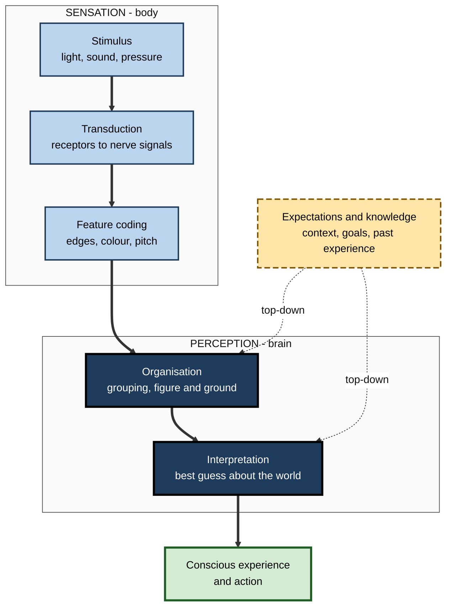
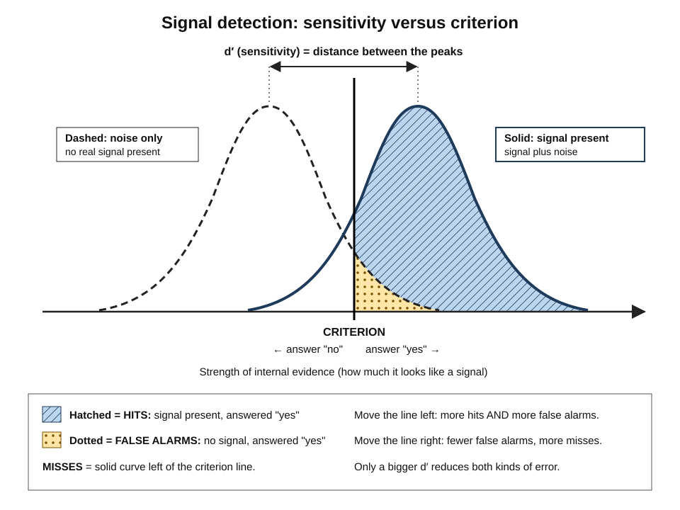
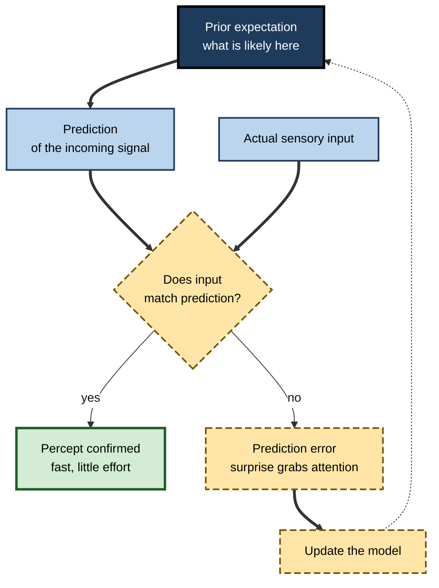

# C.2. Sensation vs. Perception

> **In one sentence:** Sensation is your body picking up raw signals such as light, sound and pressure; perception is your brain turning those signals into a meaningful world of objects, words and events.
>
> **Why it matters:** Everything you learn, notice or decide starts with perception — and perception is an educated guess, not a camera recording. Professionals who understand this design clearer dashboards, safer alarms, better inspections and fairer judgements, and they stop trusting "I saw it with my own eyes" more than it deserves.
>
> **Level span:** Novice → Expert · **Reading time:** ~17 min · **Builds on:** Foundations of cognitive psychology

---

## The Learning Ladder

| Level | Badge | After this level you can... |
|---|---|---|
| 1 | NOVICE | Explain the difference between sensing something and perceiving it, with everyday examples. |
| 2 | FOUNDATIONS | Use the terms transduction, threshold, adaptation, bottom-up and top-down processing correctly. |
| 3 | PRACTITIONER | Design a screen, report or alert so that the important signal is perceived quickly and correctly. |
| 4 | ADVANCED | Explain signal detection theory, Gestalt organisation and the predictive (Bayesian) view of perception. |
| 5 | EXPERT / PRO | Tune detection systems, inspections and human-AI review workflows using perceptual science. |

---

## Level 1 · Novice — The Big Picture

Your eyes, ears, skin, nose and tongue are like microphones and cameras. They pick up energy from the world — light waves, air vibrations, pressure, chemicals. That pickup is **sensation**. But a microphone does not know it is hearing your name, and a camera does not know it is filming your friend. Something has to *interpret* the signal. That interpretation is **perception**.

An analogy: sensation is a stream of raw pixels arriving at a computer; perception is the software that says "this is a face, it is smiling, it is Priya". Most of the hard work is done by the software, and it is so fast and automatic that you never notice it working.

You have already experienced the gap between the two:

- You read "teh" as "the" without noticing the typo. **Your eyes sensed the wrong letters; your brain perceived the word it expected.**
- At a noisy party you still hear your own name across the room. **Your brain picked a meaningful signal out of a sea of sound.**
- You stopped noticing the hum of the air conditioner after a few minutes. **Your senses adapted to a constant signal.**

The key idea for a beginner: **you do not see the world directly; you see your brain's best interpretation of it.** That interpretation is usually excellent — and sometimes confidently wrong.

---

## Level 2 · Foundations — Core Concepts

### From signal to meaning

1. **Stimulus.** Energy in the environment (light reflected from a page).
2. **Transduction.** Sensory receptors convert that energy into electrical signals in nerve cells. In the eye, photoreceptors in the retina do this.
3. **Sensory coding.** Signals carry information about features: brightness, colour, pitch, edges, motion.
4. **Perceptual organisation.** The brain groups features into objects and separates figure from background.
5. **Recognition and meaning.** The organised object is matched to knowledge ("that is the word *profit*"), which is where perception hands over to pattern recognition and concepts.
6. **Action.** You respond — read on, click, brake.

**Figure C.2-1 — Bottom-up signals meet top-down expectations.**

*How to read it:* thick arrows are the bottom-up flow from the world; dotted arrows show top-down expectations shaping what you perceive.

### Key terms

| Term | Plain meaning |
|---|---|
| **Sensation** | Detection of physical energy by sensory receptors. |
| **Perception** | Organisation and interpretation of sensory signals into meaningful experience. |
| **Transduction** | Conversion of physical energy into nerve signals. |
| **Absolute threshold** | The weakest signal a person can detect reliably (conventionally, half the time). |
| **Just-noticeable difference (JND)** | The smallest change in a signal that a person can notice. |
| **Weber's law** | The JND is a roughly constant *proportion* of the original signal: a small change is noticed on a small base, but needs to be bigger on a large base. |
| **Sensory adaptation** | Reduced response to an unchanging signal. |
| **Bottom-up processing** | Perception driven by the incoming signal. |
| **Top-down processing** | Perception shaped by knowledge, expectations and goals. |
| **Perceptual constancy** | Seeing objects as stable in size, shape and colour despite changing images on the retina. |

### Gestalt principles of organisation

Early 20th-century Gestalt psychologists (Max Wertheimer, Wolfgang Köhler, Kurt Koffka) described how the brain automatically groups elements. Their principles remain the backbone of visual design.

| Principle | What the brain does | Design use |
|---|---|---|
| **Proximity** | Groups items that are close together | Put labels next to the values they describe |
| **Similarity** | Groups items that look alike | Use one style for all clickable elements |
| **Common region** | Groups items inside a shared boundary | Card layouts for related information |
| **Continuity** | Follows smooth lines and curves | Align columns so the eye can track rows |
| **Closure** | Fills gaps to see whole shapes | Simple icons can be incomplete outlines |
| **Figure–ground** | Separates an object from its background | Strong contrast for the primary action |

---

## Level 3 · Practitioner — Putting It to Work

Every report, slide, dashboard and alert you build is a perception problem. The question is not "is the information there?" but "will the right person *perceive* the right thing in the time they have?"

### The five-step perceptual design check

1. **Name the one signal.** What must the viewer notice first? ("Region West is below target.")
2. **Make it pop pre-attentively.** **Pre-attentive attributes** are features the visual system detects in a fraction of a second without searching: a different colour, size, orientation or position. Use one strong attribute for the key signal and keep everything else quiet.
3. **Group with Gestalt.** Use proximity and common region so related items read as one unit.
4. **Do not rely on colour alone.** Roughly one man in twelve has some form of colour-vision deficiency, and printed or projected colour is unreliable. Add labels, shapes or patterns.
5. **Test with a five-second look.** Show the design to someone for five seconds, hide it, and ask what they noticed. If they did not name your signal, redesign.

### Worked example — an operations dashboard

| | Before | After |
|---|---|---|
| **Layout** | Twelve gauges in a grid, each with a traffic-light colour. | One headline number per region, sorted by gap to target. |
| **Signal** | Two red gauges among many orange ones; red and green indistinguishable to some viewers. | The only below-target region is bold, labelled "BELOW TARGET", and placed first. |
| **Five-second test** | Viewers recall "lots of colours". | Viewers recall "West is behind". |

### Common mistakes at this level

- **Signal overload.** If everything is highlighted, nothing is.
- **Colour-only meaning.** Fails for colour-blind viewers, greyscale printing and poor projectors.
- **Fighting expectations.** Putting "Cancel" where people expect "Confirm" causes errors because top-down expectations win.
- **Ignoring adaptation.** A warning banner that is always visible soon becomes invisible.

---

## Level 4 · Advanced — Mechanisms, Models & Evidence

### Signal detection theory

**Signal detection theory (SDT)** was developed in the 1950s for radar operators and was brought into psychology by David Green and John Swets. It answers a crucial question: when someone says "yes, I see it", how much of that is good perception and how much is willingness to say yes?

SDT separates two independent quantities:

- **Sensitivity (d′, "d-prime")** — how well the person can tell signal from noise. It improves with better equipment, clearer displays and expertise.
- **Response criterion (c)** — how much evidence the person needs before saying "yes". It shifts with incentives, instructions and the cost of each kind of error.

Every detection decision has four possible outcomes:

| | Signal present | Signal absent |
|---|---|---|
| **Say "yes"** | Hit | False alarm |
| **Say "no"** | Miss | Correct rejection |

*Figure C.2-2 — Signal detection theory.* The dashed curve is the spread of internal evidence when there is only noise; the solid curve is the spread when a signal is present. Their separation is sensitivity. The vertical line is the criterion: everything to its right is answered "yes". Moving the criterion trades misses for false alarms; only better sensitivity reduces both. Schematic.

The professional lesson: **you cannot reduce both misses and false alarms by telling people to "be more careful".** That only moves the criterion. To reduce both, you must raise sensitivity — better images, clearer contrast, training with feedback, or a second independent check.

### Perception as inference

Hermann von Helmholtz argued in the 19th century that perception involves "unconscious inference". Modern **Bayesian** accounts formalise this: the brain combines **prior** expectations with the **likelihood** of the incoming evidence to reach the most probable interpretation. When the signal is clear, it dominates; when the signal is weak or ambiguous, priors dominate.

**Predictive processing** extends the idea: the brain continually predicts its sensory input and mainly passes forward the **prediction error** — the part that was not expected. This explains why expected things are processed quickly and surprises grab attention. It is one of the most influential frameworks in current cognitive neuroscience; recent work (2025) is refining what prediction errors encode and debating how far the framework can be tested, so treat it as a strong, still-contested theory rather than settled fact.

**Figure C.2-3 — Perception as prediction and correction.**

*How to read it:* the dotted arrow closes the loop — every surprise updates the expectations used for the next moment.

### Classic phenomena and what they teach

- **Illusions** such as the Müller-Lyer lines show that perception applies rules (here, depth cues) even when they mislead. Knowing an illusion is an illusion rarely makes it go away.
- **Change blindness** and **inattentional blindness** show that people often miss large, unexpected changes or objects when attention is elsewhere. In a widely cited study, most experienced radiologists searching CT scans for lung nodules failed to notice an image of a gorilla inserted into the scans. Attention as such is covered in its own subtopic; the perceptual point is that seeing requires looking *for*.
- **Perceptual learning**: with practice and feedback, sensitivity itself improves — radiologists, sommeliers and quality inspectors genuinely perceive differences novices cannot. This is a central ingredient of expertise.

### Boundary conditions

- Top-down effects are strongest when the signal is degraded, brief or ambiguous.
- Many claimed effects of mood or motivation on low-level perception ("heavy backpacks make hills look steeper") have been challenged as effects on judgement or reporting rather than on perception itself — an active debate.
- Perception is multisensory: vision and hearing influence each other, as in the McGurk effect, where seeing lips form one sound changes the sound you hear.

---

## Level 5 · Expert / Pro — Professional Mastery

### Designing detection systems

Many professional tasks are signal detection in disguise: security screening, code review, fraud monitoring, content moderation, medical imaging, audit sampling, model-output review. Experts design them deliberately.

| Design lever | Effect in SDT terms | Example |
|---|---|---|
| Better display or tooling | Raises sensitivity | Higher-contrast imaging; diff views that highlight changed lines |
| Training with immediate feedback | Raises sensitivity | Inspectors see known defects with answers |
| Changing incentives or instructions | Moves criterion | "Flag anything uncertain" increases hits and false alarms |
| Adjusting signal prevalence | Moves criterion | Very rare targets are missed more often — the **prevalence effect** |
| Independent double reading | Raises system sensitivity | Two radiologists or two reviewers, combined rules |
| Alarm thresholds | Moves criterion for the whole team | Fewer, more meaningful alerts reduce **alarm fatigue** |

### Human-AI review in the perception frame

AI systems increasingly pre-screen images, transactions and code. The human then reviews. Two perceptual risks follow. First, if the AI flags almost everything correctly, true problems become rare for the human, and the prevalence effect predicts more human misses. Second, a visible AI label acts as a strong top-down prior: people tend to see what the label says. Good designs show the evidence first, sometimes hide the AI's verdict until the human has formed a judgement, and periodically insert known test cases to measure human sensitivity.

### Professional scenario

**Role:** Engineering manager responsible for on-call alerting.
**Situation:** Engineers receive dozens of alerts per shift; most are harmless. A real outage was missed because its alert looked like all the others.
**What the pro does:** Treats it as a criterion and sensitivity problem. Deletes or merges low-value alerts, so remaining alerts carry more information. Separates "page now" from "review tomorrow" by channel, sound and wording, not colour alone. Adds context (impact, affected users) to raise sensitivity. Tracks hits, misses and false alarms monthly, so the team can see that fewer alerts produced *more* caught incidents.

### Expert-level judgement

- **"Be careful" is not a fix.** Improve sensitivity or deliberately set the criterion based on the costs of each error.
- **Expect adaptation.** Rotate or refresh persistent warnings and keep alerts rare.
- **Perception is trainable.** Feedback-rich exposure to many cases builds expert perception faster than lectures do.
- **Respect diversity of perceivers.** Colour-vision differences, low vision, hearing loss and sensory sensitivities are common; accessible design is better design for everyone.

---

## Myths vs. Evidence

| Myth | What the evidence shows |
|---|---|
| "The eye works like a camera and the brain stores the picture." | Perception is constructive; the brain builds a best-guess model and stores interpretations, not images. |
| "If it was there, I would have seen it." | Inattentional and change blindness show people routinely miss large unexpected things. |
| "Telling inspectors to try harder reduces errors." | Exhortation mostly shifts the criterion; it trades misses for false alarms. |
| "Humans have exactly five senses." | We also sense balance, body position, temperature, pain and internal body states. |
| "Knowing about an illusion stops it." | Most visual illusions persist even when you know how they work. |
| "Red always means danger to everyone." | Colour meaning is learned and culture-dependent, and many people cannot distinguish red from green. |

## Practitioner Toolkit

**Perceptual design checklist**

- [ ] I can state the one thing the viewer must notice first.
- [ ] That signal uses one strong pre-attentive attribute; everything else is quiet.
- [ ] Meaning is carried by text, shape or position as well as colour.
- [ ] Related items are grouped by proximity or a shared region.
- [ ] Warnings are rare enough not to be ignored.
- [ ] I ran a five-second test with someone outside the project.

**Detection system review template**

| Task | Hits | Misses | False alarms | Main lever to try (sensitivity or criterion) |
|---|---|---|---|---|
| | | | | |

## Self-Check

1. **[NOVICE]** What is the difference between sensation and perception?
2. **[NOVICE]** Give an everyday example of sensory adaptation.
3. **[FOUNDATIONS]** What does Weber's law predict about noticing a price change of 5 on a 20 item versus a 2,000 item?
4. **[FOUNDATIONS]** Define bottom-up and top-down processing.
5. **[PRACTITIONER]** Name two fixes for a dashboard that uses only red and green.
6. **[ADVANCED]** In signal detection theory, what is the difference between sensitivity and criterion?
7. **[ADVANCED]** How does predictive processing explain why surprises grab attention?
8. **[EXPERT / PRO]** Why might AI pre-screening make human reviewers miss more true problems?
9. **[EXPERT / PRO]** Your inspectors miss defects. Why will "be more careful" probably not help, and what would?

### Answer Key

1. Sensation is the detection of physical energy by receptors; perception is the brain's organisation and interpretation of those signals.
2. No longer noticing a constant background noise or the feel of clothing.
3. The change is noticeable on the small item but not on the large one, because the JND is proportional to the base value.
4. Bottom-up is driven by incoming signals; top-down is shaped by expectations, knowledge and goals.
5. Add text labels or icons, use position or shape, and use colour pairs that remain distinct in greyscale.
6. Sensitivity is the ability to tell signal from noise; criterion is how much evidence is needed to respond "yes".
7. Expected input generates little prediction error; unexpected input generates large error that is passed forward and draws processing.
8. True problems become rare for the human (prevalence effect) and AI labels bias perception toward the AI's verdict.
9. It mostly shifts the criterion. Improve sensitivity: better lighting or displays, training with feedback, double reading, and inserting known test items.

## Key Takeaways

- **Sensation** detects energy; **perception** interprets it — and most of the work is interpretation.
- Perception combines **bottom-up signals** with **top-down expectations**; it is a best guess, not a recording.
- **Gestalt principles** and **pre-attentive attributes** are practical tools for clear design.
- **Signal detection theory** separates sensitivity from willingness to say "yes"; exhortation shifts the criterion only.
- **Predictive processing** is a leading, still-debated account of perception as prediction plus error correction.
- Design for real perceivers: avoid colour-only meaning, keep alerts rare, and train perception with feedback.

## Glossary

| Term | Meaning |
|---|---|
| Absolute threshold | Weakest detectable signal. |
| Alarm fatigue | Desensitisation to frequent alerts, leading to missed real ones. |
| Change blindness | Failing to notice a change in a scene. |
| Criterion | Amount of evidence required before responding "signal present". |
| d-prime (d′) | Index of sensitivity in signal detection theory. |
| Gestalt principles | Rules by which the brain groups elements into wholes. |
| Inattentional blindness | Failing to see an unexpected object while attending to something else. |
| Pre-attentive attribute | A visual feature detected almost instantly without search. |
| Prevalence effect | Higher miss rates when targets are rare. |
| Signal detection theory | A framework separating detection ability from response bias. |
| Transduction | Conversion of physical energy into neural signals. |
| Weber's law | The noticeable difference is proportional to the base magnitude. |
