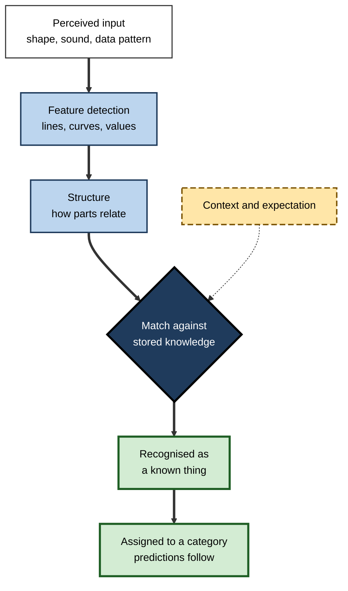
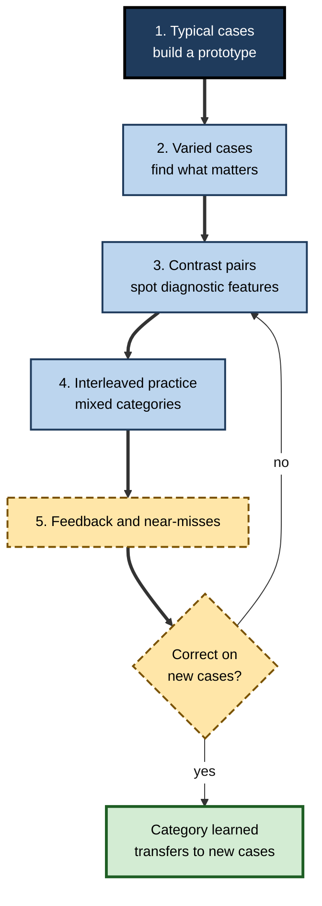
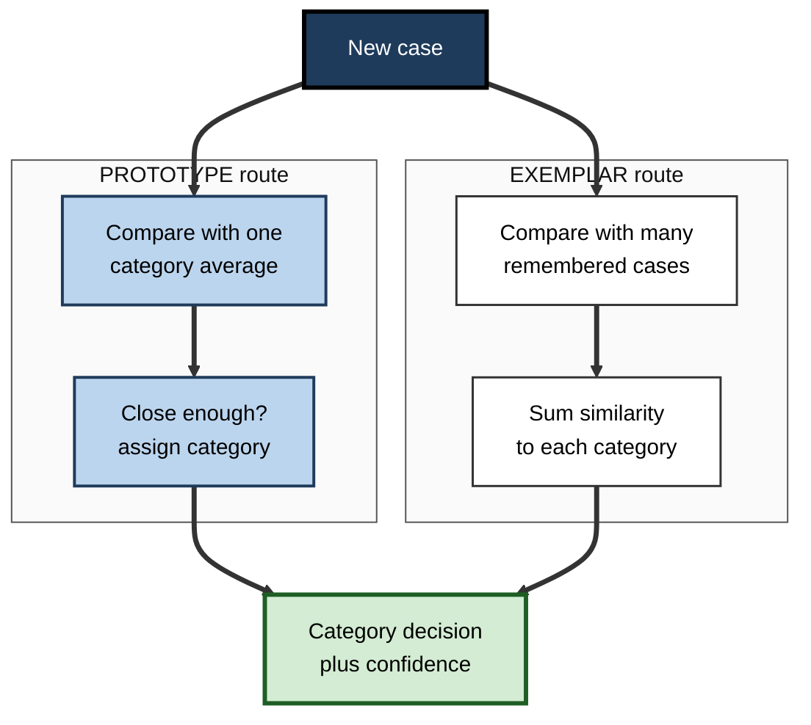

# C.3. Pattern Recognition and Categorization

> **In one sentence:** Pattern recognition is how the mind matches what you perceive to something you already know, and categorization is how it sorts things into groups so that knowing one member tells you about the others.
>
> **Why it matters:** Recognising patterns and sorting cases correctly is the engine of professional judgement — diagnosing a fault, spotting fraud, triaging a ticket, reading a market. Knowing how categories form, and how they mislead, lets you build expertise faster, design better taxonomies, and avoid stereotyping people and problems.
>
> **Level span:** Novice → Expert · **Reading time:** ~17 min · **Builds on:** Sensation and perception

---

## The Learning Ladder

| Level | Badge | After this level you can... |
|---|---|---|
| 1 | NOVICE | Explain what pattern recognition and categories are and why the mind needs them. |
| 2 | FOUNDATIONS | Describe template, feature and structural theories of recognition and the idea of a basic level. |
| 3 | PRACTITIONER | Learn a new professional category set faster using varied, contrasting and interleaved examples. |
| 4 | ADVANCED | Compare classical, prototype, exemplar and theory-based views of categories and how AI vision differs from human vision. |
| 5 | EXPERT / PRO | Design taxonomies, labelling schemes and training sets, and guard against category-driven bias. |

---

## Level 1 · Novice — The Big Picture

Look at a handwritten "A", a printed "A" and an "A" in a fancy logo. The shapes differ, yet you instantly see the same letter. That act of matching something you see to something you know is **pattern recognition**.

Now think of a chihuahua and a Great Dane. They look very different, yet you call both "dog" and expect both to bark, eat and need walks. Putting things into groups like this is **categorization**, and the groups are **categories**. Categories save enormous effort: once you know something is a dog, you know dozens of things about it without checking each one.

An analogy: your mind is like a well-run warehouse. New items arrive (things you perceive). Pattern recognition reads their label; categorization puts them on the right shelf, next to similar items. Because you know what is on each shelf, you can predict what a new item will be like.

You have already done this today:

- You recognised a colleague from behind by the way they walk. **Pattern recognition from partial information.**
- You decided an email was spam before reading it fully. **Fast categorization from a few features.**
- You labelled a new app "basically a to-do list". **Using a category to predict what it does.**

The key idea for a beginner: **recognising and categorising let you treat new things as familiar — which is powerful and occasionally wrong.**

---

## Level 2 · Foundations — Core Concepts

### Three classic theories of recognition

| Theory | Core idea | Strength | Weakness |
|---|---|---|---|
| **Template matching** | Compare the input to a stored exact copy | Works for fixed formats such as barcodes and printed account numbers | Fails with any change in size, angle, font or handwriting |
| **Feature analysis** | Detect parts (lines, curves, angles) and combine them; Oliver Selfridge's 1959 "Pandemonium" model is the classic | Explains why confusable letters share features; neurons tuned to features exist in visual cortex | Features alone ignore how the parts are arranged |
| **Structural description** | Recognise objects from parts *and their relations*; Irving Biederman's recognition-by-components theory proposed a small set of simple 3D shapes ("geons") | Explains recognition from new viewpoints and from line drawings | Struggles with fine distinctions such as individual faces |

In practice, recognition uses all three kinds of information plus context: the same smudge is read as "H" in "THE" and "A" in "CAT".

**Figure C.3-1 — How recognition combines signals and knowledge.**

*How to read it:* thick arrows are the main path; the dotted arrow shows context biasing the match.

### What makes a category

Psychologist Eleanor Rosch showed in the 1970s that natural categories are not tidy boxes with strict definitions. Instead:

- **Graded membership (typicality).** A robin is a "better" bird than a penguin. People verify typical members faster and name them first.
- **Family resemblance.** Members share overlapping features, but no single feature is shared by all — as with the many things called "games".
- **Basic level.** There is a preferred middle level of abstraction — "chair" rather than "furniture" or "office swivel chair". It is the level children learn first and adults name fastest, because it is the most informative level for the least effort.
- **Hierarchy.** Categories nest: superordinate (furniture) → basic (chair) → subordinate (swivel chair). Experts shift their basic level downward: a bird-watcher's quickest label is "warbler", not "bird".

### Key terms

| Term | Plain meaning |
|---|---|
| **Pattern recognition** | Matching sensory input to stored knowledge so it is identified. |
| **Category** | A group of things treated as equivalent for some purpose. |
| **Categorization** | Deciding which category something belongs to. |
| **Prototype** | The average or most typical member of a category. |
| **Exemplar** | A specific remembered example of a category. |
| **Typicality** | How representative a member is of its category. |
| **Basic level** | The most commonly used, most informative level of a category hierarchy. |
| **Family resemblance** | Overlapping similarities among members without one shared defining feature. |

---

## Level 3 · Practitioner — Putting It to Work

Much professional learning is category learning: types of customer objection, kinds of software bug, classes of financial risk, patterns in an X-ray. Research on category learning gives a clear method.

### The contrast-and-mix method for learning categories

1. **Start with a few clear, typical cases** of each category, so a prototype forms.
2. **Add varied cases.** Include unusual members that still belong ("this is also a memory leak, even though it shows up as slow responses"). Variety teaches which features matter and which do not.
3. **Put confusable categories side by side.** Ask "what distinguishes these two?" Contrast focuses attention on diagnostic features.
4. **Interleave practice.** Once basics are in place, mix cases from several categories rather than practising one category at a time. Studies of learning artists' painting styles, bird species and medical images show interleaving often improves later classification of *new* examples — though it can feel harder.
5. **Practise with feedback and near-misses.** Include cases that look like a category but are not, and give immediate, specific feedback.

**Figure C.3-2 — The contrast-and-mix category learning cycle.**

*How to read it:* the main path builds from typical to mixed practice; misses on new cases send you back to contrasting the confusable categories.

### Worked example — a support team learning ticket categories

| | Before | After |
|---|---|---|
| **Training** | A slide per category with its definition; agents practise all "billing" tickets, then all "access" tickets. | Two typical tickets per category, then varied ones, then mixed batches including "looks like billing but is access" cases. |
| **Feedback** | Weekly audit scores. | Instant feedback with the deciding feature named. |
| **Result** | Accurate on training batches, frequent misroutes on live tickets. | Slightly slower in training, markedly fewer misroutes on live tickets after a month. |

### Common mistakes at this level

- **Teaching only definitions.** Real categories are learned from examples; definitions alone rarely transfer.
- **Only typical examples.** Learners then miss atypical members — the "unusual presentation" that experts catch.
- **Blocked practice only.** Feels fluent, but learners never practise *choosing* the category.
- **Forgetting near-misses.** Without non-examples, learners over-include.

---

## Level 4 · Advanced — Mechanisms, Models & Evidence

### Four views of what a category is

| View | How membership is decided | Explains well | Struggles with |
|---|---|---|---|
| **Classical (definitional)** | Necessary and sufficient features ("a triangle has three sides") | Formal, legal and mathematical categories | Typicality, fuzzy boundaries |
| **Prototype** | Similarity to a summary average | Typicality effects, quick judgements, recognising never-seen typical items | Knowledge of variability; atypical but known members |
| **Exemplar** (Douglas Medin, Robert Nosofsky) | Similarity to many stored examples | Sensitivity to specific cases and to variability; often fits lab data better than prototypes | Memory demands; why some features matter more |
| **Theory-based (knowledge)** | Fit with causal explanations ("whales are mammals because of how they reproduce") | Why deep features override appearance | Hard to formalise and test |

Current evidence suggests people use mixtures: prototypes early in learning and for large, loosely structured categories; exemplars as experience grows; rules where categories are well defined; and causal theories when stakes or expertise are high. Neuroimaging and patient studies support partly separate systems for rule-based and similarity-based category learning.

### Categorical perception

Categories reach back into perception. Speech sounds that vary smoothly in acoustic terms are heard as sharply different phonemes ("ba" versus "pa"), and differences within a category are harder to detect than equal differences across a boundary. Training on new categories can sharpen perception of their boundaries — part of why experts genuinely "see" differences novices cannot.

### Faces: a special case

Face recognition relies heavily on **configural** processing — the spacing and relations between features — which is why upside-down faces are disproportionately hard to recognise. People are generally far better at recognising familiar faces than at matching unfamiliar ones; matching a stranger to a photo ID is surprisingly error-prone even for trained staff, with large individual differences, including a small group of "super-recognisers".

### Human versus machine pattern recognition

Deep neural networks now match or exceed human accuracy on many image benchmarks, and their internal representations predict some aspects of human visual similarity judgements. But they differ in telling ways. Standard image networks lean heavily on **texture**, whereas people rely mainly on **shape**; recent work shows that training choices inspired by child development (for example zooming in on objects) or sparse coding push networks toward a more human-like shape bias. Networks can also be fooled by tiny, deliberate changes invisible to people (adversarial examples). Researchers have even rebuilt prototype and exemplar models on top of deep networks, finding they fit human category judgements better than standard classifiers. The pro takeaway: **AI and humans may agree on the label while using different evidence**, which matters when you decide where each can be trusted.

**Figure C.3-3 — Prototype versus exemplar decisions.**

*How to read it:* both routes start from the same case; the prototype route uses one summary, the exemplar route uses many stored examples. Real people use both.

### Boundary conditions and open debates

- Interleaving helps most when categories are similar and hard to tell apart; for very different categories, blocked practice can be as good or better.
- Basic-level advantages shift with expertise and culture.
- Whether "prototype" and "exemplar" are truly different mechanisms, or ends of one continuum, is still debated.

---

## Level 5 · Expert / Pro — Professional Mastery

### Designing categories for others

Professionals often *create* categories: product taxonomies, incident severity levels, risk ratings, competency frameworks, data labels for machine learning. Cognitive research suggests design rules:

| Design rule | Why |
|---|---|
| Name categories at the users' basic level | Fastest, most informative level for that audience |
| Give each category a typical example *and* a near-miss | Builds prototype and boundary at once |
| Keep the number of top-level categories small | Choosing among many options is slow and error-prone |
| Prefer causal or functional definitions for high-stakes categories | Appearance-based categories misfire on atypical cases |
| Measure agreement between independent labellers | Low agreement means the categories, not the people, are unclear |
| Revisit categories as the domain changes | Old categories quietly force new cases into the wrong boxes |

### Categories, people and bias

The same efficient machinery produces **stereotypes**: generalising from a category ("engineers", "older workers", "Gen Z") to an individual. Stereotypes persist because category-based prediction is fast and sometimes roughly right on average, while being unfair and often wrong for the person in front of you. In hiring and performance reviews, structured criteria and work samples reduce reliance on category-driven first impressions.

### Professional scenario

**Role:** Data science lead building a fraud-detection model with human review.
**Situation:** Investigators label transactions; inter-labeller agreement is low, and the model is learning noise.
**What the pro does:** Treats it as a category-design problem. Runs a workshop where investigators sort real cases and explain their reasons; discovers two categories are defined by appearance ("unusual amount") rather than mechanism ("account takeover" versus "first-party fraud"). Redefines categories causally, writes a typical case and a near-miss for each, and trains labellers with interleaved, feedback-rich batches. Agreement rises, the model improves, and investigators report that new fraud patterns are now easier to spot because they think in mechanisms.

### Expert-level judgement

- **Expertise is better categories.** Experts sort problems by deep principle; novices by surface features (see the expertise note).
- **Watch for category lock-in.** A strong first categorisation ("it's a network issue") can blind a team to evidence for another.
- **Check AI's evidence, not only its label.** Where humans use shape and causal knowledge and models use texture or correlated cues, failures will differ.

---

## Myths vs. Evidence

| Myth | What the evidence shows |
|---|---|
| "Every category has a clear definition." | Most everyday categories have fuzzy boundaries and graded membership. |
| "We recognise things by comparing them to stored pictures." | Recognition uses features, structure and context, not exact templates. |
| "Practising one type at a time is the best way to learn types." | For confusable categories, interleaved practice usually improves later classification of new cases. |
| "Stereotypes are just ignorance." | They are a by-product of normal categorization; reducing their impact needs structure, not just good intentions. |
| "If AI and humans give the same label, they see the same thing." | Image models often rely on texture or spurious cues where people rely on shape and meaning. |
| "Trained staff can reliably match strangers to ID photos." | Unfamiliar-face matching is error-prone, with large individual differences. |

## Practitioner Toolkit

**Category learning checklist**

- [ ] For each category I have at least two typical examples.
- [ ] I have unusual-but-valid examples.
- [ ] I have near-misses that look similar but belong elsewhere.
- [ ] Confusable categories are practised side by side.
- [ ] Practice is interleaved once the basics are known.
- [ ] Feedback names the deciding feature.

**Template — category card**

| Category name | One-line causal definition | Typical example | Unusual valid example | Near-miss (and why not) |
|---|---|---|---|---|
| | | | | |

## Self-Check

1. **[NOVICE]** What is the difference between pattern recognition and categorization?
2. **[NOVICE]** Why are categories useful?
3. **[FOUNDATIONS]** Why does template matching fail for handwriting?
4. **[FOUNDATIONS]** What is the basic level, and how does expertise change it?
5. **[PRACTITIONER]** Describe how you would train new analysts to tell two similar risk types apart.
6. **[ADVANCED]** Contrast prototype and exemplar theories.
7. **[ADVANCED]** What is the texture-versus-shape difference between many image networks and people?
8. **[EXPERT / PRO]** Labellers disagree on categories for training data. What do you investigate first?
9. **[EXPERT / PRO]** How can category thinking produce unfair decisions about people, and what reduces this?

### Answer Key

1. Recognition identifies what something is by matching it to memory; categorization assigns it to a group so that predictions follow.
2. They let you predict unseen properties of new items and save effort.
3. Handwriting varies in size, slant and shape; exact templates cannot cover the variation.
4. The default, most informative level ("chair"); experts shift it downward to more specific categories.
5. Typical cases of each, then varied ones, side-by-side contrasts, interleaved mixed practice and immediate feedback with near-misses.
6. Prototype: compare to one summary average. Exemplar: compare to many stored examples and sum similarity.
7. Many networks rely on surface texture; people rely mainly on overall shape.
8. Whether category definitions are clear and based on mechanism; provide typical cases and near-misses, then re-measure agreement.
9. Applying group generalisations to individuals; structured criteria and work samples reduce reliance on category-driven impressions.

## Key Takeaways

- **Pattern recognition** matches input to memory; **categorization** groups things so knowledge transfers.
- Recognition combines **features, structure and context**, not rigid templates.
- Natural categories have **typicality, family resemblance and a basic level**.
- People use **prototypes, exemplars, rules and causal theories** in combination.
- Learn categories with **varied examples, contrasts, interleaving, near-misses and feedback**.
- AI and humans can reach the same label **using different evidence** — check before trusting.
- The same machinery that powers expertise also produces **stereotypes**; structure decisions about people.

## Glossary

| Term | Meaning |
|---|---|
| Basic level | The default, most informative level of categorization. |
| Categorical perception | Perceiving differences across a category boundary more easily than within it. |
| Configural processing | Recognising based on spatial relations between parts, crucial for faces. |
| Exemplar model | Theory that categorization compares new items to stored examples. |
| Family resemblance | Overlapping similarities across category members. |
| Feature analysis | Recognition by detecting component features. |
| Geons | Simple 3D shapes proposed as building blocks of object recognition. |
| Interleaving | Mixing different categories or problem types within practice. |
| Prototype | The central or average member of a category. |
| Shape bias | Tendency to categorize objects by shape rather than texture or colour. |
| Template matching | Recognition by comparison with exact stored copies. |
| Typicality | Degree to which a member represents its category. |
