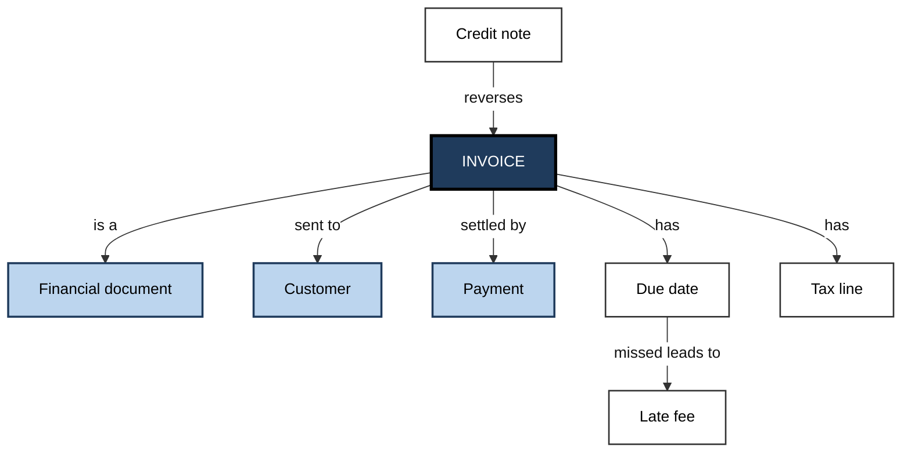
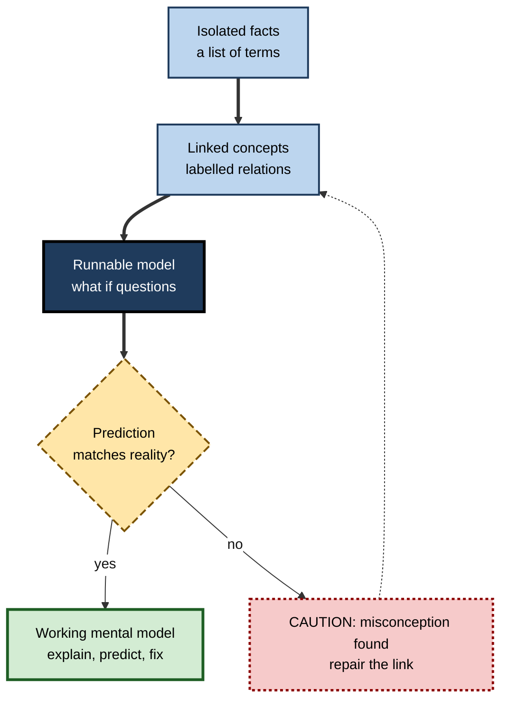
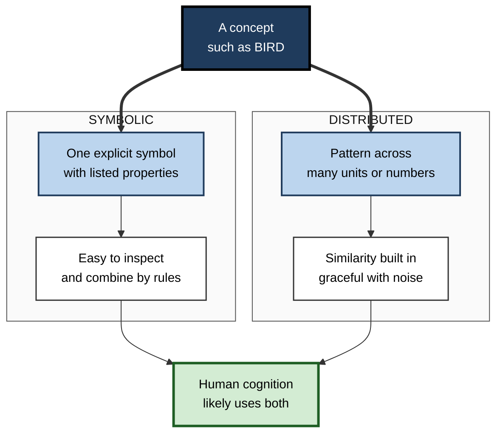

# C.4. Concepts and Mental Representations

> **In one sentence:** A mental representation is the form in which the mind holds information — as images, word-like statements, networks of linked ideas or working models — and a concept is the mental representation of a kind of thing, such as "invoice", "risk" or "dog".
>
> **Why it matters:** How knowledge is represented decides what you can do with it. Two people can know the same facts, but the one with richer, better-connected concepts and mental models will explain, predict, troubleshoot and teach far better. Good documentation, domain models, training and AI knowledge systems all depend on representing knowledge well.
>
> **Level span:** Novice → Expert · **Reading time:** ~17 min · **Builds on:** Pattern recognition and categorization

---

## The Learning Ladder

| Level | Badge | After this level you can... |
|---|---|---|
| 1 | NOVICE | Explain what a concept and a mental representation are, with examples. |
| 2 | FOUNDATIONS | Distinguish images, propositions, semantic networks and mental models. |
| 3 | PRACTITIONER | Map and strengthen your own concepts in a new domain, and find misconceptions. |
| 4 | ADVANCED | Explain the imagery debate, spreading activation, grounded cognition and distributed (vector) representations. |
| 5 | EXPERT / PRO | Design shared representations for teams — domain models, glossaries, diagrams, knowledge graphs — and judge AI "understanding". |

---

## Level 1 · Novice — The Big Picture

Close your eyes and picture your front door. Now answer: which side is the handle on? You probably "looked" at an inner picture to answer. Now answer a different question: is a door a kind of furniture? You did not need a picture; you checked what you *know about* doors. Both answers came from **mental representations** — information stored in a form the mind can use — but in different forms.

A **concept** is your mental representation of a kind of thing. Your concept of "meeting" includes that it has people, a purpose, a time, often an agenda, and sometimes too many slides. Concepts let you recognise new meetings, predict what will happen, and talk about meetings with others.

An analogy: a city can be represented as a photograph from above, as a street list, as a subway map, or as a tour guide's story. Each representation makes some questions easy and others hard. The subway map is useless for walking directions; the street list cannot show you what the city looks like. The mind also keeps several kinds of "maps".

You have already used different representations:

- You mentally rotated a sofa to see if it fits through a door. **Image-like representation.**
- You knew that "all managers are employees" means a manager is an employee. **Statement-like representation.**
- You predicted that adding more people to a late project might slow it further. **A mental model of how the system works.**

The key idea for a beginner: **knowing is not just storing facts; it is holding them in a form that lets you think with them.**

---

## Level 2 · Foundations — Core Concepts

### The main formats of mental representation

| Format | What it is like | Good for | Example |
|---|---|---|---|
| **Analog / imagery** | Preserves spatial or perceptual structure, like a picture | Spatial reasoning, imagining, design | Picturing a floor plan |
| **Propositional** | Abstract statements of relations, like "OWNS(customer, account)" | Logic, language meaning, precise facts | "The contract renews annually" |
| **Semantic network** | Concepts as nodes linked by relations | Associations, fast retrieval of related ideas | invoice → payment → due date |
| **Schema / script** | A packaged structure for a typical situation with slots | Filling gaps, predicting what comes next | The "restaurant" or "sprint review" script |
| **Mental model** | A runnable simulation of how a system behaves | Prediction, troubleshooting, "what if" | Imagining how a queue grows under load |
| **Procedural** | Condition–action rules, "if X then do Y" | Skills that run automatically | Shortcut keys, driving |

Schemas are a large topic of their own and get a separate subtopic; here they appear as one format among several.

**Figure C.4-1 — A small semantic network for a business concept.**

*How to read it:* each box is a concept; each labelled arrow is a relation. Activating "invoice" makes linked concepts quicker to retrieve.

### Key terms

| Term | Plain meaning |
|---|---|
| **Mental representation** | Information held in the mind in a usable form. |
| **Concept** | The mental representation of a category or idea, including what you know about it. |
| **Proposition** | The smallest unit of meaning that can be true or false. |
| **Mental imagery** | Perception-like representation without the actual stimulus. |
| **Semantic network** | A web of concepts connected by meaningful links. |
| **Spreading activation** | Activating one concept partially activates linked concepts. |
| **Mental model** | An internal working model of how something works, used to predict and explain. |
| **Misconception** | A stable but incorrect concept or model, often built from everyday experience. |

---

## Level 3 · Practitioner — Putting It to Work

### Build and test your concept map of a new domain

1. **List the core concepts.** Write the 10–20 terms that people in the domain use constantly (for cloud computing: region, availability zone, instance, load balancer, autoscaling...).
2. **Link them with labelled relations.** Draw arrows and write the relation on each ("is part of", "causes", "is a type of", "protects against"). Unlabelled lines hide fuzzy understanding.
3. **Run your model.** Pose "what if" questions: "If one availability zone fails, what happens to traffic?" Talk through the chain.
4. **Check against reality.** Compare your predictions with documentation, an expert or a small experiment.
5. **Hunt misconceptions.** Where your prediction failed, find the wrong link or missing concept and repair it.
6. **Re-draw from memory a week later.** Retrieval strengthens the network and reveals what did not stick.

**Figure C.4-2 — From fact list to working mental model.**

*How to read it:* knowledge becomes useful when it can be run to make predictions; failed predictions loop back to repair the network.

### Worked example — a new product manager learning payments

| | Before | After |
|---|---|---|
| **Representation** | A glossary of 40 payment terms memorised as definitions. | A concept map with labelled links: authorisation → capture → settlement → payout; chargeback reverses settlement. |
| **Test question** | "Why did the merchant get paid but then lose the money a month later?" — cannot answer. | Traces the chain: settled payment → customer dispute → chargeback → reversal. |
| **Misconception found** | Believed "authorised" meant "paid". | Repaired: authorisation only reserves funds; capture and settlement move money. |

### Common mistakes at this level

- **Collecting definitions instead of relations.** Definitions alone do not support reasoning.
- **Keeping unlabelled links.** A line between two terms often hides "I'm not sure how these relate".
- **Never testing the model.** A model that is never used to predict cannot be checked.
- **Assuming shared meaning.** The same word ("customer", "release", "done") often means different things to different teams.

---

## Level 4 · Advanced — Mechanisms, Models & Evidence

### The imagery debate

In 1971 Roger Shepard and Jacqueline Metzler showed that the time people take to decide whether two 3D shapes are the same rises steadily with the angle between them — as if people mentally rotate an image. Stephen Kosslyn's later studies found that scanning longer distances across a memorised map takes longer. These results support **analog** representations. Zenon Pylyshyn countered that people may simply be using tacit knowledge of how long things *would* take, with the underlying code being propositional. Neuroimaging later showed that visual imagery engages many of the same brain areas as seeing, which most researchers take as support for depictive representations — while agreeing that imagery is also shaped by knowledge.

A recent twist: **aphantasia**, the reported absence of voluntary visual imagery, shows large individual differences in imagery. Many people with aphantasia perform normally on tasks that seem to "require" imagery, suggesting alternative strategies.

### Semantic networks and spreading activation

Allan Collins and Ross Quillian (1969) modelled knowledge as a hierarchy of concepts with properties stored at the most general level. Collins and Elizabeth Loftus (1975) refined this into **spreading activation**: activating a concept partially activates related concepts, making them faster to retrieve. **Semantic priming** — recognising "nurse" faster after "doctor" — is the classic evidence and is among the reliable findings in cognitive psychology, unlike many social priming claims that did not replicate.

### Grounded and embodied representations

**Grounded cognition** (associated with Lawrence Barsalou) argues that concepts are partly built from re-activated perceptual, motor and emotional experience, not only abstract symbols. Understanding "kick" engages motor regions involved in leg action, for example. The strength of these effects and whether they are necessary for understanding are debated; a sibling note covers embodied cognition.

### Mental models

Philip Johnson-Laird proposed that people reason by building **mental models** — small-scale simulations of possibilities — rather than applying formal logic. Donald Norman applied the idea to design: users form mental models of how a device works, and errors happen where the user's model diverges from the system's real behavior. Mental models are typically incomplete, unstable and often "good enough" for routine use while failing in unusual cases.

### Distributed representations and AI

Connectionist models and modern AI represent concepts as **vectors** — long lists of numbers in which similar meanings lie close together (embeddings). Meaning is *distributed* across many units rather than stored in one symbol. These representations capture a remarkable amount of human similarity structure, and large language models trained only on text encode surprisingly rich conceptual relations.

Whether this amounts to concepts in the human sense is an open question. Human concepts are grounded in perception, action and goals, support causal reasoning and are flexibly combined; language models' representations are learned from text statistics, and they can fail on causal, physical or compositional questions in ways people would not. A balanced 2026 view: **vector representations are a powerful model of some aspects of human conceptual knowledge, not a complete account of it.**

**Figure C.4-3 — Symbolic versus distributed representations.**

*How to read it:* the same concept can be represented two ways, each with different strengths; most researchers think minds combine them.

### Conceptual change

Misconceptions — such as believing heavier objects fall faster, or that seasons are caused by distance from the Sun — are remarkably resistant because they are coherent mental models built from everyday experience. Research on **conceptual change** shows that adding correct facts is not enough; learners need to see the old model fail, compare it with the new one, and use the new model repeatedly. Older intuitive models are often suppressed rather than erased, which is why even experts can briefly slip back under time pressure.

---

## Level 5 · Expert / Pro — Professional Mastery

### Designing shared representations

Teams think with shared representations. Senior professionals deliberately design them:

| Shared representation | Cognitive function | Practice |
|---|---|---|
| **Ubiquitous language / glossary** | Aligns concepts across roles | Domain-driven design teams agree one meaning per term and use it in code, docs and meetings |
| **Domain model diagrams** | Externalise the semantic network | Entities and labelled relations reviewed with business experts |
| **Architecture and system diagrams** | Externalise mental models | Show behavior under failure, not only boxes |
| **Knowledge graphs and ontologies** | Machine-readable concepts and relations | Power search, retrieval for AI assistants, compliance mapping |
| **Worked cases and incident write-ups** | Build schemas and causal models | Post-incident reviews that explain mechanism, not just timeline |

### Professional scenario

**Role:** Solution architect joining a merger of two companies' order systems.
**Situation:** Both sides use the word "order", but integration keeps failing.
**What the pro does:** Runs concept-mapping sessions with each team. Discovers that one company's "order" is a confirmed sale, the other's is any customer request including quotes. Proposes distinct terms ("quote", "order", "fulfilment"), a shared domain diagram with labelled relations, and a glossary enforced in API names. Defects in integration tests drop because the teams now hold compatible concepts, not just compatible data formats.

### AI-era implications

- **Retrieval-augmented AI assistants depend on how knowledge is represented.** Well-structured documents, consistent terms and explicit relations make AI answers better.
- **Fluent AI explanations can bypass concept building.** Reading an explanation feels like understanding; drawing the concept map yourself and testing it builds the representation.
- **Judge "understanding" by transfer.** Whether for a person or a model, ask it to apply the concept to a new, unusual case and explain why.

### Expert-level judgement

- **Choose the representation for the task.** Spatial problems need diagrams; logical constraints need explicit statements; dynamic systems need runnable models or simulations.
- **Make the invisible model visible.** Most team conflicts about "facts" are conflicts between unspoken mental models.
- **Expect misconceptions to return under pressure;** design checklists and reviews for those moments.

---

## Myths vs. Evidence

| Myth | What the evidence shows |
|---|---|
| "Knowledge is a list of facts in your head." | Knowledge is organised in linked concepts, schemas and models; organisation determines usefulness. |
| "Everyone pictures things vividly." | Imagery vividness varies widely; some people report none and still reason well. |
| "Correcting a misconception just needs the right fact." | Misconceptions are coherent models; change needs confronting, comparing and practising the new model. |
| "If people use the same word, they mean the same thing." | Teams often hold different concepts behind identical terms. |
| "Language models understand concepts exactly like people do." | They capture much similarity structure but differ on grounding, causality and robustness. |
| "Priming effects are all unreliable." | Social behavior priming often failed to replicate; semantic priming in word recognition is robust. |

## Practitioner Toolkit

**Concept-map checklist**

- [ ] I listed the 10–20 core concepts of the domain.
- [ ] Every link has a written relation label.
- [ ] I can run the map to answer three "what if" questions.
- [ ] I checked predictions against an expert, document or test.
- [ ] I recorded misconceptions I found and how I fixed them.
- [ ] I re-drew the map from memory after a delay.

**Template — term alignment table for teams**

| Term | Our meaning | Their meaning | Agreed meaning | Example | Non-example |
|---|---|---|---|---|---|
| | | | | | |

## Self-Check

1. **[NOVICE]** What is a mental representation?
2. **[NOVICE]** Give one example of an image-like and one of a statement-like representation.
3. **[FOUNDATIONS]** What is spreading activation?
4. **[FOUNDATIONS]** How does a mental model differ from a list of facts?
5. **[PRACTITIONER]** Why should links in a concept map be labelled?
6. **[ADVANCED]** What did mental rotation experiments suggest, and what was the counter-argument?
7. **[ADVANCED]** Why are misconceptions hard to change?
8. **[EXPERT / PRO]** Two teams use the same term differently. How would you fix it?
9. **[EXPERT / PRO]** In what ways do language-model representations resemble and differ from human concepts?

### Answer Key

1. Information held in the mind in a form that can be used for thinking.
2. Picturing a room layout (image-like); "the contract renews annually" (statement-like).
3. Activating one concept partially activates related ones, making them easier to retrieve.
4. A mental model can be run to predict and explain behavior; a list cannot.
5. Labels make the relation explicit and expose fuzzy understanding.
6. Response time grew with rotation angle, suggesting analog images; critics argued tacit knowledge with propositional codes could produce the same pattern.
7. They are coherent models built from experience; new facts get absorbed into the old model unless it is shown to fail.
8. Map each team's concept, agree distinct terms, document with examples and non-examples, and enforce them in code and docs.
9. Similar: capture similarity structure and many relations. Different: learned from text, weakly grounded, can fail on causal and novel compositional cases.

## Key Takeaways

- **Concepts** are mental representations of kinds; **representations** come in several formats.
- **Images, propositions, networks, schemas, mental models and procedures** each make different tasks easy.
- **Spreading activation** in semantic networks explains fast, associative retrieval.
- **Mental models** are runnable and predictive — and usually incomplete.
- **Misconceptions** are coherent models; change requires seeing them fail.
- **Vector representations** in AI capture some, not all, of human conceptual knowledge.
- Professionals **externalise and align** representations: glossaries, domain models, diagrams, knowledge graphs.

## Glossary

| Term | Meaning |
|---|---|
| Analog representation | A representation preserving perceptual or spatial structure. |
| Aphantasia | Reported absence of voluntary visual imagery. |
| Concept | Mental representation of a category or idea. |
| Conceptual change | Restructuring of an existing mental model. |
| Distributed representation | Meaning encoded as a pattern across many units. |
| Embedding | A numerical vector representing meaning in AI systems. |
| Grounded cognition | View that concepts rely on perceptual, motor and emotional systems. |
| Mental model | An internal simulation of how something works. |
| Proposition | A unit of meaning that can be true or false. |
| Semantic network | Concepts linked by labelled relations. |
| Semantic priming | Faster processing of a word after a related word. |
| Ubiquitous language | A shared vocabulary used consistently across a team and its software. |
