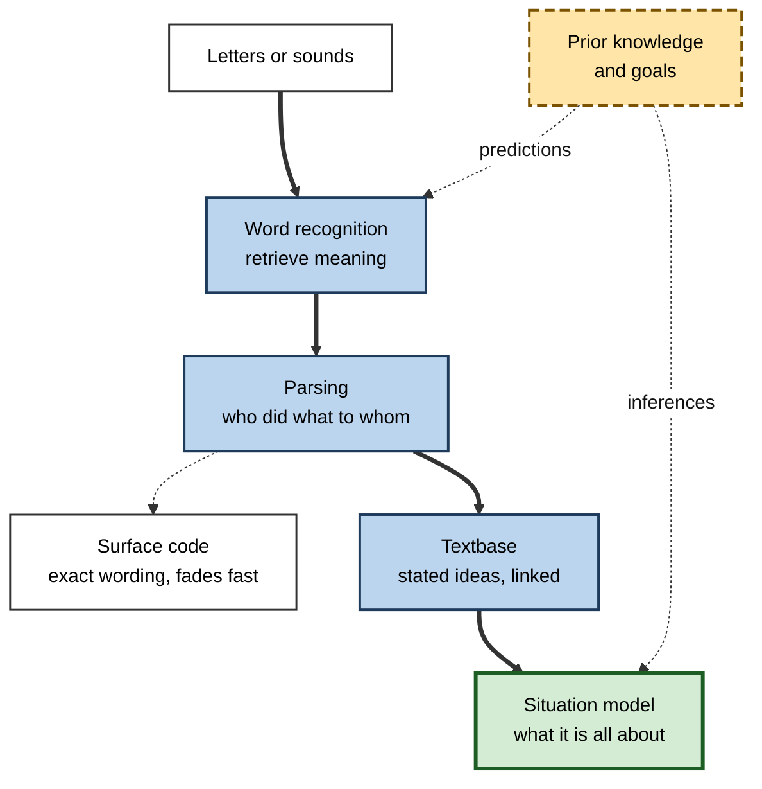
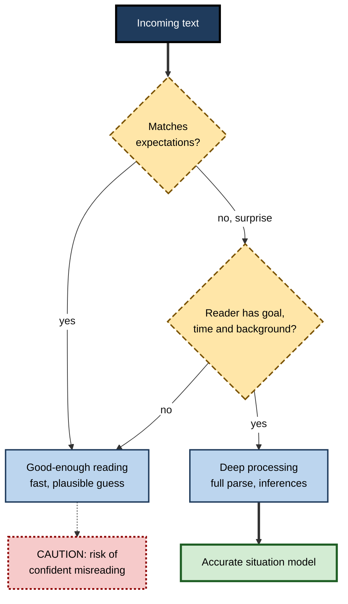

# C.5. Language Processing and Comprehension

> **In one sentence:** Language processing is how the mind turns sounds or marks on a page into words, sentences and meaning, and comprehension is the end result — a mental picture of the situation the words describe.
>
> **Why it matters:** Most professional knowledge arrives as language: documents, emails, specifications, contracts, chat, prompts to AI. Understanding how people actually read and listen lets you write so others understand on the first pass, read difficult material more effectively, and spot when "I read it" did not mean "I understood it".
>
> **Level span:** Novice → Expert · **Reading time:** ~18 min · **Builds on:** Concepts and mental representations

---

## The Learning Ladder

| Level | Badge | After this level you can... |
|---|---|---|
| 1 | NOVICE | Explain the difference between reading words and understanding meaning. |
| 2 | FOUNDATIONS | Name the levels of language and the three levels of text representation. |
| 3 | PRACTITIONER | Write and restructure documents so readers build the right situation model quickly. |
| 4 | ADVANCED | Explain word recognition, parsing, prediction, good-enough processing and the simple view of reading. |
| 5 | EXPERT / PRO | Design communication, documentation and AI interactions for comprehension, and evaluate claims about AI "understanding language". |

---

## Level 1 · Novice — The Big Picture

Read this sentence: "The manager told the analyst she would be promoted." Who is getting promoted? You probably chose one person instantly — without noticing that the sentence does not actually say. Your mind filled the gap using expectations. That is the heart of **language comprehension**: the words are only clues; your mind builds the meaning.

An analogy: words are like flat-pack furniture instructions. The printed steps (the words) matter, but the result (understanding) only exists once you assemble the pieces, using your own tools and background knowledge. Two readers with the same instructions can build different furniture.

You have already seen this:

- You read a paragraph, reached the end, and realised you had no idea what it said. **Your eyes processed the words; comprehension did not happen.**
- A colleague's email said "Let's discuss the issue", and you assumed a different issue than they meant. **The words were clear; the situation each of you imagined was not the same.**
- You understood a joke only after a second. **You had to revise your first interpretation.**

The key idea for a beginner: **understanding language means building a mental model of what the words are about — and that depends as much on the reader as on the text.**

---

## Level 2 · Foundations — Core Concepts

### The levels of language

| Level | Unit | Example question |
|---|---|---|
| **Phonology / orthography** | Sounds or letters | Is that "ship" or "chip"? |
| **Morphology** | Meaningful word parts | "Un-deploy-able" = not able to be deployed |
| **Lexicon** | Words and their meanings | Which meaning of "bank" or "release"? |
| **Syntax** | Sentence structure | Who did what to whom? |
| **Semantics** | Literal meaning | What does the sentence state? |
| **Pragmatics** | Meaning in context | "Can you send the file?" is a request, not a question about ability |
| **Discourse** | Connected text | How does this sentence relate to the previous one? |

### Three levels of what you remember from a text

Walter Kintsch's **construction–integration model** (developed with Teun van Dijk) distinguishes three levels of representation a reader builds:

1. **Surface code** — the exact words and phrasing. Fades within seconds to minutes.
2. **Textbase** — the ideas the text explicitly states, as connected propositions. Lets you summarise.
3. **Situation model** — a mental model of the situation the text describes, integrated with prior knowledge. Lets you apply, predict and infer. This is what "understanding" really means.

**Figure C.5-1 — From marks on a page to a situation model.**

*How to read it:* thick arrows are the main route to understanding; dotted arrows show prior knowledge feeding predictions and inferences. The surface code branches off and fades.

### Key terms

| Term | Plain meaning |
|---|---|
| **Comprehension** | Building a coherent mental representation of what language means. |
| **Lexical access** | Retrieving a word's meaning from memory. |
| **Parsing** | Working out the grammatical structure of a sentence. |
| **Inference** | Filling in information the text does not state. |
| **Situation model** | The reader's mental model of the described situation. |
| **Coherence** | How well ideas connect into a unified whole. |
| **Pragmatics** | How context and intention shape meaning. |
| **Decoding** | Turning written symbols into words. |

---

## Level 3 · Practitioner — Putting It to Work

Readers build situation models fastest when the text does the connecting work for them. That is the cognitive basis of plain-language writing.

### The comprehension-first writing method

1. **Lead with the situation.** State the purpose and the bottom line first ("Decision needed by Friday: approve the vendor switch"). Readers use early information to build the frame that later details fit into.
2. **Use the reader's words.** Familiar, frequent words are recognised faster. Define unavoidable jargon once.
3. **One idea per sentence, actor before action.** "The team deployed the fix" is parsed faster than "The deployment of the fix was carried out by the team".
4. **Make links explicit.** Use connectives — *because*, *so*, *however*, *as a result*. Missing links force readers to infer, and readers with less background infer wrongly.
5. **Keep terms consistent.** If you call it "customer" in one paragraph and "client" in the next, readers wonder if they differ.
6. **Use structure as a map.** Headings, numbered steps and tables show the shape of the content before reading.
7. **Test with a cold reader.** Ask someone outside the project to read once and explain back what they would do. Their explanation reveals their situation model.

### Worked example — an incident update

| | Before | After |
|---|---|---|
| **Text** | "Following investigation of anomalous latency metrics observed subsequent to the configuration rollout, remediation has been effected and monitoring continues." | "Bottom line: the slowdown is fixed. Cause: Tuesday's configuration change overloaded the database. We rolled it back at 14:10. Pages now load normally. Next: we will re-apply the change with a limit, on Thursday." |
| **Reader effort** | Parse nominalisations; infer cause and timeline. | Situation model given directly: what, why, now, next. |
| **Cold-reader explanation** | "Something was fixed, I think?" | Accurate in one pass. |

### Reading hard material — briefly

When *you* are the reader: preview headings to form a frame, pause after sections to explain them in your own words, and ask "what situation does this describe, and what would follow from it?" Detailed reading strategies belong to the study-skills topic; the cognitive point is that **self-explanation builds the situation model, while re-reading mostly refreshes the surface code**.

### Common mistakes at this level

- **Mistaking jargon for precision.** Precise and plain are compatible; dense nominalisations slow everyone.
- **Burying the point.** Readers who do not know the purpose build the wrong frame.
- **Assuming shared background.** Experts leave out steps that are obvious only to them.
- **Equating "read" with "understood".** Checking requires the reader to explain or apply.

---

## Level 4 · Advanced — Mechanisms, Models & Evidence

### Word recognition

In **lexical decision** experiments, people decide as fast as possible whether a letter string is a word. Robust findings include the **frequency effect** (common words are recognised faster), the **semantic priming** effect (a related word speeds recognition), and context effects. Eye-tracking research (notably by Keith Rayner) shows skilled readers fixate most words, about a quarter of a second each, skip short predictable ones, and move their eyes back (regress) when confused. Reading speed is limited mainly by word recognition and comprehension, not by eye movements — which is why "speed reading" methods that promise large gains without comprehension loss are not supported by evidence.

### Parsing and garden paths

Sentences such as "The old man the boats" or "The horse raced past the barn fell" lead readers down a **garden path**: the first, most likely structure turns out to be wrong and must be revised, which shows up as longer reading times and regressions. These sentences show that people build structure incrementally, word by word, committing early rather than waiting for the end.

### Prediction and surprisal

Comprehension is strongly predictive. Words that are predictable from context are read faster and produce smaller brain responses; an unexpected word produces a characteristic brain signal (the N400 component in EEG) whose size tracks how unexpected the word is. **Surprisal** — a measure of how improbable a word is given its context — predicts reading times well. Language models compute exactly this quantity, which made them a major tool in psycholinguistics.

A notable recent finding: surprisal from *larger* language models predicts human reading times and brain responses *worse* than surprisal from more modest models. Researchers attribute this partly to large models being "too good" — predicting rare words and facts that people do not anticipate. A 2026 review argued that to model human linguistic prediction, models must be made less superhuman. The lesson for professionals: **AI language ability and human language processing overlap, but are not the same thing.**

### Good-enough processing

Fernanda Ferreira and colleagues showed that people often build **shallow, "good-enough" representations** rather than complete, accurate parses. Asked "How many animals of each kind did Moses take on the ark?", many people answer "two" — missing that it was Noah (the **Moses illusion**). After passive sentences like "The dog was bitten by the man", some readers report the more plausible interpretation. Comprehension is efficient but can be wrong when text is unexpected, ambiguous or skimmed — exactly the conditions of busy work reading.

**Figure C.5-2 — When comprehension goes deep and when it stays shallow.**

*How to read it:* readers default to good-enough processing; deep processing needs a trigger plus the goal, time and background to act on it.

### The simple view of reading

Philip Gough and William Tunmer's **simple view of reading** (1986) states that reading comprehension is the product of **decoding** (turning print into words) and **language comprehension** (understanding spoken language). If either is near zero, reading comprehension fails. For skilled adult readers, differences in comprehension are driven mainly by vocabulary, background knowledge and inference skill — which is why domain knowledge is the single best predictor of understanding a technical text.

### Second language and multilingual workplaces

Processing in a second language is typically slower and more effortful, with less capacity left for inference and nuance. Idioms, sarcasm and implied requests are especially vulnerable. This is not a matter of intelligence; it is a cognitive load issue with direct consequences for global teams.

---

## Level 5 · Expert / Pro — Professional Mastery

### Designing for comprehension at scale

| Context | Cognitive risk | Professional practice |
|---|---|---|
| Policies and contracts | Dense syntax, nominalisations, unclear actors | Plain-language standards; summaries of obligations up front |
| Technical documentation | Missing steps, expert blind spot | Task-based structure; test with new joiners |
| Global teams | Second-language load, idioms | Short sentences, explicit requests, written follow-ups |
| Safety-critical communication | Good-enough misreading | Standard phrases, read-backs (as in aviation), checklists |
| AI prompts and outputs | Ambiguous instructions; fluent but wrong outputs | Explicit goals, examples, constraints; verify claims, not tone |

### Professional scenario

**Role:** Compliance lead rolling out a new data-handling policy to 4,000 staff in 20 countries.
**Situation:** Last year's policy had a 98% "read and acknowledged" rate, yet audits found frequent violations.
**What the pro does:** Treats acknowledgement as a surface-code metric. Rewrites the policy around five situations staff actually face, each with "what to do" in plain language. Adds three short scenario questions per situation that require applying the rule, not recalling it. Pilots with non-native speakers and new joiners, revising wherever explanations go wrong. Reports scenario accuracy and audit findings, not acknowledgement rates.

### Language, AI and understanding

Large language models produce fluent text and capture much of the statistical structure of language. Research continues to show both striking parallels with human processing (prediction, sensitivity to syntax) and differences (superhuman memory for rare facts, brittleness on some inferences, no grounded situation in the human sense). Two professional implications follow. First, **fluency is not evidence of accuracy** — in AI output or in human writing. Second, **reading AI summaries can replace building your own situation model**; for material you must truly understand, summarise or explain it yourself before comparing with the AI.

### Expert-level judgement

- **Write for the situation model, not the surface code.** Ask "what will the reader be able to *do* after reading?"
- **Assume good-enough reading** for anything busy people skim; make critical details impossible to miss.
- **Background knowledge beats reading tricks.** Building domain vocabulary improves comprehension more than generic strategies.
- **Measure comprehension by application,** not by acknowledgement or time-on-page.

---

## Myths vs. Evidence

| Myth | What the evidence shows |
|---|---|
| "Speed reading lets you triple your speed with full understanding." | Speed is limited by word recognition and comprehension; big gains come with comprehension loss. |
| "If someone read it, they understood it." | Readers often form shallow, good-enough representations or misread unexpected content. |
| "Comprehension is a general skill you either have or not." | Comprehension depends heavily on background knowledge of the specific topic. |
| "Complex vocabulary makes writing sound more expert and credible." | Needlessly complex wording tends to make writers seem less intelligent and slows readers. |
| "Bigger AI language models are better models of how humans read." | Surprisal from the largest models fits human reading times worse than from more modest ones. |
| "People remember the exact words they read." | Exact wording fades quickly; people retain the gist and the situation model. |

## Practitioner Toolkit

**Plain-comprehension checklist for any important document**

- [ ] The purpose and bottom line are in the first two sentences.
- [ ] Actors come before actions; few nominalisations.
- [ ] Each paragraph has one idea; links use explicit connectives.
- [ ] Terms are consistent; jargon is defined once.
- [ ] Steps are numbered; comparisons are in tables.
- [ ] A cold reader explained it back correctly.

**Cold-reader test script**

1. "Read this once at your normal speed."
2. "Without looking, tell me what this is about and what you would do next."
3. "What, if anything, was confusing?"
4. Revise wherever their explanation differs from your intent.

## Self-Check

1. **[NOVICE]** Why can you read every word of a paragraph and still not understand it?
2. **[NOVICE]** What is an inference? Give an example.
3. **[FOUNDATIONS]** Name Kintsch's three levels of text representation.
4. **[FOUNDATIONS]** What is pragmatics?
5. **[PRACTITIONER]** Rewrite "Approval of the budget by finance is required prior to commencement" in plain language.
6. **[ADVANCED]** What do garden-path sentences show about parsing?
7. **[ADVANCED]** What is good-enough processing, and when is it most risky?
8. **[EXPERT / PRO]** Why did larger language models fit human reading times less well?
9. **[EXPERT / PRO]** How would you measure whether a policy was understood?

### Answer Key

1. Word recognition can proceed without building a coherent situation model, especially when attention or background knowledge is lacking.
2. Filling in unstated information — reading "She grabbed an umbrella" and inferring it was raining.
3. Surface code, textbase, situation model.
4. How context and the speaker's intention shape meaning beyond the literal words.
5. "Finance must approve the budget before we start."
6. People build sentence structure word by word and commit early, revising when the structure fails.
7. Building a shallow but plausible interpretation; risky when text is unexpected, ambiguous or skimmed under time pressure.
8. They predict rare words and facts better than people do, so their expectations are less human-like.
9. Scenario questions requiring application, cold-reader explanations, and audit or behavior outcomes — not acknowledgement rates.

## Key Takeaways

- Comprehension means building a **situation model**; words are clues, not the meaning itself.
- Language is processed at many levels, from **letters to pragmatics and discourse**.
- Readers are **predictive and incremental** — fast when text matches expectations, slower when surprised.
- **Good-enough processing** makes busy readers vulnerable to confident misreading.
- **Background knowledge** is the strongest driver of comprehension in adults.
- Write **purpose first, actor before action, explicit links, consistent terms**, and test with a cold reader.
- AI language ability **overlaps with but differs from** human processing; fluency is not accuracy.

## Glossary

| Term | Meaning |
|---|---|
| Construction–integration model | Kintsch's model of how readers build and integrate text representations. |
| Decoding | Converting written symbols into recognised words. |
| Garden-path sentence | A sentence whose likely initial parse proves wrong. |
| Good-enough processing | Forming shallow but adequate interpretations. |
| Lexical decision | A task deciding quickly whether a letter string is a word. |
| Moses illusion | Failing to notice a semantic error in a question. |
| N400 | An EEG brain response that grows with how unexpected a word is. |
| Nominalisation | Turning a verb into a noun ("decide" to "decision"), often making text harder. |
| Simple view of reading | Reading comprehension equals decoding times language comprehension. |
| Situation model | Mental model of the situation described by a text. |
| Surprisal | How unexpected a word is given its context. |
| Textbase | The network of ideas explicitly stated in a text. |
