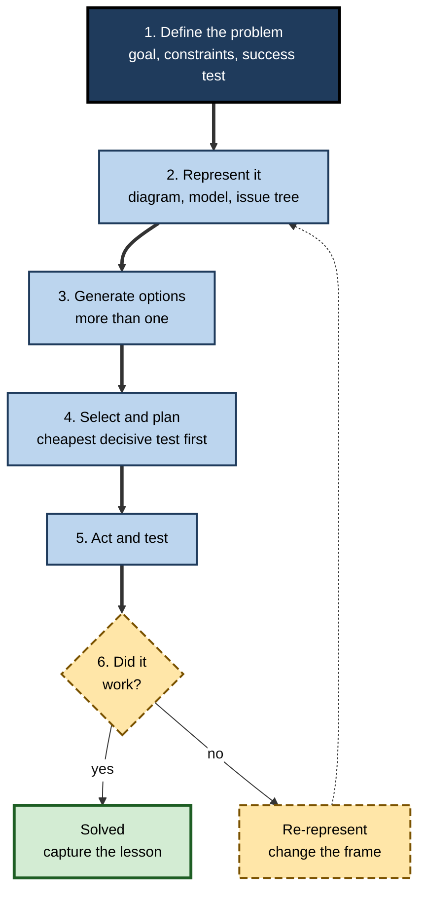
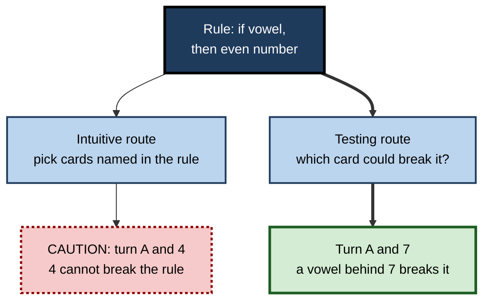

# C.6. Problem Solving and Reasoning

> **In one sentence:** Problem solving is getting from where you are to where you want to be when the route is not obvious, and reasoning is drawing conclusions from information — both of which follow patterns that cognitive psychology has mapped in detail.
>
> **Why it matters:** Debugging code, diagnosing a client's business, fixing a supply-chain failure, arguing a case — professional value is largely problem solving and reasoning. Knowing how these processes work, and how they reliably go wrong, makes you faster, less error-prone and better at teaching others to think.
>
> **Level span:** Novice → Expert · **Reading time:** ~18 min · **Builds on:** Concepts and mental representations

---

## The Learning Ladder

| Level | Badge | After this level you can... |
|---|---|---|
| 1 | NOVICE | Describe what makes something a "problem" and give examples of good and bad problem-solving habits. |
| 2 | FOUNDATIONS | Use the ideas of problem space, heuristics, well- and ill-defined problems, and deductive versus inductive reasoning. |
| 3 | PRACTITIONER | Apply a structured problem-solving cycle and break fixation when stuck. |
| 4 | ADVANCED | Explain insight, analogical transfer, the Wason task, belief bias and mental-model theories of reasoning. |
| 5 | EXPERT / PRO | Build team problem-solving practices and decide how AI should and should not share the thinking. |

---

## Level 1 · Novice — The Big Picture

A **problem** exists whenever you have a goal and no immediately obvious way to reach it. Finding your car keys is a problem. So is reducing customer churn, or working out why a report shows the wrong totals. **Problem solving** is the mental work of finding the route.

**Reasoning** is a close cousin: drawing conclusions from what you know. "All our enterprise clients have a dedicated manager. Acme is an enterprise client. So Acme has a dedicated manager" is reasoning. So is "Every outage this month followed a deployment, so deployments may be causing them".

An analogy: solving a problem is like navigating a maze in fog. You can see only a few steps ahead. You can wander randomly, follow a rule such as "always keep your hand on the left wall", or climb a ladder and look at the whole maze. Good problem solvers spend more time getting a view of the maze — understanding the problem — before they start walking.

You have already experienced:

- Staring at a problem for an hour, taking a walk, and suddenly seeing the answer. **That is incubation and insight.**
- Trying the same failed fix again and again. **That is fixation — getting stuck on one approach.**
- Solving a new problem because it "felt like" one you had solved before. **That is analogical transfer.**

The key idea for a beginner: **how you represent a problem determines how easily you can solve it.**

---

## Level 2 · Foundations — Core Concepts

### The problem space

Allen Newell and Herbert Simon (1972) described problem solving as a search through a **problem space**: an **initial state**, a **goal state**, the **operators** (allowed moves) that change states, and **constraints**. Solving means finding a sequence of operators that reaches the goal.

Because most problem spaces are huge, people use **heuristics** — rules of thumb that usually work — rather than trying everything (an **algorithm**, a procedure guaranteed to find a solution if one exists).

| Heuristic | How it works | Work example |
|---|---|---|
| **Means–ends analysis** | Find the biggest difference between now and the goal; pick a move that reduces it; set sub-goals | "We need a launch in 6 weeks; the biggest gap is legal approval — start that first" |
| **Working backward** | Start from the goal and ask what must be true just before it | Planning an event from the date backward |
| **Hill climbing** | Take any step that seems to get closer | Tuning a parameter up while results improve — can get stuck at a local peak |
| **Decomposition** | Split into sub-problems | Issue trees in consulting; breaking a feature into tasks |
| **Analogy** | Reuse the solution of a similar solved problem | Applying a known caching pattern to a new service |

### Well-defined versus ill-defined problems

| | Well-defined | Ill-defined |
|---|---|---|
| Goal | Clear | Vague or contested ("improve culture") |
| Operators | Known | Open-ended |
| Success check | Obvious | Requires judgement |
| Example | Fix a failing unit test | Decide the company's AI strategy |

Most important workplace problems are ill-defined. A large part of solving them is **problem finding** — defining the goal and constraints well enough that search can begin.

### Kinds of reasoning

| Type | Direction | Certainty | Example |
|---|---|---|---|
| **Deductive** | From general rules to a specific conclusion | Certain if premises are true and logic valid | All invoices over 10k need two approvals; this is 12k; it needs two |
| **Inductive** | From specific cases to a general conclusion | Probable, never certain | Five sprints overran when scope changed mid-sprint, so mid-sprint changes cause overruns |
| **Abductive** | From an observation to the best explanation | Plausible; must be tested | The site is slow and the database CPU is at 100%, so the database is probably the bottleneck |

**Figure C.6-1 — The structured problem-solving cycle.**

*How to read it:* the main path runs top to bottom; when a solution fails, the dotted loop returns to representation, not straight back to trying another fix.

### Key terms

| Term | Plain meaning |
|---|---|
| **Problem space** | All possible states of a problem and moves between them. |
| **Heuristic** | A mental shortcut that usually, but not always, works. |
| **Algorithm** | A step-by-step procedure that guarantees a solution if one exists. |
| **Insight** | A sudden restructuring of a problem that reveals the solution. |
| **Fixation** | Being stuck on one approach or one way of seeing a problem. |
| **Functional fixedness** | Seeing objects only in their usual function. |
| **Analogical transfer** | Applying the structure of a known solution to a new problem. |
| **Deduction / induction / abduction** | Reasoning from rules, from cases, and to the best explanation. |

---

## Level 3 · Practitioner — Putting It to Work

### Five ways to break fixation

1. **Re-state the goal in a different way.** "Reduce support tickets" versus "help users succeed without contacting us" opens different solutions.
2. **List assumptions and challenge each.** Write "We assume..." for every constraint; ask which are truly fixed.
3. **Change the representation.** Turn text into a diagram, a timeline, a table or a physical model.
4. **Look for an analogy from a different field.** Ask "where else has a problem with this *structure* been solved?"
5. **Take a real break.** Incubation effects — improvement after time away from a problem — have support in meta-analyses, especially for creative problems, though the size varies across studies.

### Worked example — a recurring data-pipeline failure

| | Before | After |
|---|---|---|
| **Representation** | "The nightly job is flaky." Engineers restart it each morning. | Failures plotted on a timeline against other events: all coincide with a weekly backup window. |
| **Reasoning** | Inductive guess: "it is random". | Abductive hypothesis: resource contention during backups; deductive test: move the job one hour and predict zero failures. |
| **Outcome** | Weeks of repeated restarts. | Hypothesis confirmed in two weeks; permanent fix scheduled. |

### Common mistakes at this level

- **Jumping to solutions** before defining the problem and the success test.
- **Generating a single option.** The first idea anchors everything that follows.
- **Confirming instead of testing.** Looking only for evidence that supports your favourite cause.
- **Repeating failed fixes.** A failed attempt is information about the representation.

---

## Level 4 · Advanced — Mechanisms, Models & Evidence

### Insight and representation

Gestalt psychologists showed that some problems are solved not by step-by-step search but by **restructuring**. In Karl Duncker's candle problem (1945), people must fix a candle to a wall using a box of tacks; the solution — using the box as a shelf — is harder when the box is presented full of tacks, because it is seen as a container (**functional fixedness**). In Abraham Luchins's water-jar problems (1942), people who learned a complicated formula kept using it even when a simpler one worked (**mental set**). Both show that prior experience can block as well as help.

Research on insight suggests it involves a change in representation that often follows an impasse, accompanied by an "aha" feeling. That feeling is informative but not proof: confident insights are usually but not always correct.

### Analogical transfer — powerful but rarely spontaneous

Mary Gick and Keith Holyoak (1980) gave people a story about an army that captured a fortress by splitting up and converging from many roads, then posed Duncker's radiation problem (destroy a tumour without damaging healthy tissue). The analogous solution — many weak rays converging — was rarely used spontaneously, but most people used it once given a hint to apply the story. Later work showed that **comparing two analogous cases** helps people extract the shared structure, making spontaneous transfer much more likely. Transfer as a general topic has its own subtopic; the key point here is that people notice **surface** similarity easily and **structural** similarity with difficulty.

### Deductive reasoning and its traps

- **The Wason selection task (1966).** Shown four cards (A, K, 4, 7) and the rule "if a card has a vowel on one side, it has an even number on the other", most people turn A and 4; the logically correct choice is A and 7. Performance improves dramatically when the same logic is framed in familiar social rules ("if drinking beer, must be over 18"), showing that reasoning depends heavily on content.
- **Belief bias.** People accept invalid arguments with believable conclusions and reject valid ones with unbelievable conclusions.
- **Mental models.** Johnson-Laird's theory holds that people reason by imagining possibilities consistent with the premises; errors occur when they fail to consider all the models — especially those representing what is false.

Dual-process accounts — fast intuitive versus slow deliberate thinking — are covered in a sibling note; most reasoning errors above are cases where a quick, plausible answer is not checked.

**Figure C.6-2 — Why people fail the Wason task.**

*How to read it:* the thin path is the common matching response; the thick path asks what would disprove the rule, which is the logically correct approach.

### What recent research added: reasoning with AI

Generative AI changes where human reasoning effort goes. A 2025 survey of 319 knowledge workers, describing nearly a thousand real tasks, found that higher confidence in the AI was associated with *less* critical thinking, while higher confidence in one's own expertise was associated with *more*. Workers reported shifting effort from producing answers to verifying, integrating and stewarding AI output. Other studies link frequent AI use with lower critical-thinking scores, mediated by cognitive offloading, though these are correlational. Work published in 2026 describes "confidence without competence" in AI-assisted knowledge work. The emerging consensus: **AI can do much of the search through a problem space, but people must still define the problem, check the reasoning and own the conclusion** — and those skills need practice to stay sharp.

---

## Level 5 · Expert / Pro — Professional Mastery

### Team problem-solving practices with a cognitive rationale

| Practice | Cognitive mechanism addressed |
|---|---|
| Written problem statement before any solution discussion | Prevents premature anchoring on the first idea |
| Hypothesis-driven issue trees (consulting) | Decomposition plus explicit, testable hypotheses |
| "Five whys" and causal diagrams in post-incident reviews | Pushes from surface symptoms to mechanism; beware stopping at a single cause |
| Pre-mortems ("imagine it failed — why?") | Generates disconfirming scenarios people otherwise neglect |
| Red teams and devil's advocates | Counteracts confirmation and belief bias |
| Pair programming and rubber-duck debugging | Explaining forces explicit representation, exposing gaps |
| Library of solved cases with abstract principles | Supports structural, not just surface, analogies |

### Professional scenario

**Role:** Senior consultant leading a three-week diagnostic for a retailer losing margin.
**Situation:** The client is convinced the cause is online discounting, and the junior team has started building a discount model.
**What the pro does:** Stops the build for half a day. Writes the problem as a question with a success test ("Which drivers explain at least 80% of the margin decline since last year?"). Builds a hypothesis tree with five branches — pricing, mix, cost of goods, returns, logistics — and asks for the cheapest decisive test for each. Assigns one person to argue *against* the discount hypothesis. Within a week, returns and logistics costs explain more of the decline than discounting. The team uses AI to draft analyses quickly but each conclusion is traced to data by a named person.

### Expert-level judgement

- **Spend disproportionate time on problem definition.** Experts define and represent longer; novices start solving sooner.
- **Seek disconfirmation deliberately.** Ask "what result would prove me wrong?" before running any test.
- **Teach problem solving through worked examples and comparisons,** not general "think critically" exhortations; general thinking skills transfer poorly without domain knowledge.
- **Decide the human role in AI-assisted reasoning explicitly:** framing, constraint-setting, verification and accountability.

---

## Myths vs. Evidence

| Myth | What the evidence shows |
|---|---|
| "Good problem solvers just think harder." | Good problem solvers represent problems better, mainly through domain knowledge. |
| "Logic training makes people reason well everywhere." | Abstract logic training transfers weakly; content and familiarity strongly shape reasoning. |
| "People naturally see analogies between problems." | Spontaneous structural transfer is rare; comparing cases and hints help a lot. |
| "Insight comes out of nowhere, so it can't be supported." | Breaks, re-representation and varied perspectives raise the chance of insight. |
| "Brainstorming in groups always produces more ideas." | Individuals generating ideas first, then pooling, typically produce more and better ideas than open group brainstorming. |
| "Using AI for analysis automatically improves reasoning quality." | High trust in AI is linked to less critical checking; quality depends on human verification. |

## Practitioner Toolkit

**Problem definition template**

| Field | Answer |
|---|---|
| Problem as a question | |
| Success test (how we will know it is solved) | |
| Constraints (truly fixed) | |
| Assumptions (to challenge) | |
| At least three hypotheses or options | |
| Cheapest decisive test for each | |
| What would prove our favourite idea wrong? | |

**When-stuck checklist**

- [ ] I re-stated the goal in a different way.
- [ ] I listed and challenged assumptions.
- [ ] I changed the representation (diagram, table, timeline).
- [ ] I looked for a structural analogy from another field.
- [ ] I took a genuine break before trying again.
- [ ] I explained the problem aloud to someone (or something) else.

## Self-Check

1. **[NOVICE]** What makes a situation a "problem" in the psychological sense?
2. **[NOVICE]** What is fixation?
3. **[FOUNDATIONS]** Name the four parts of a problem space.
4. **[FOUNDATIONS]** Distinguish deductive, inductive and abductive reasoning with work examples.
5. **[PRACTITIONER]** You keep failing to fix a bug. Name three ways to break fixation.
6. **[ADVANCED]** What did the Gick and Holyoak studies show about analogy?
7. **[ADVANCED]** Why do most people fail the abstract Wason task?
8. **[EXPERT / PRO]** What does recent research suggest about AI use and critical thinking at work?
9. **[EXPERT / PRO]** Design a 30-minute meeting structure that reduces anchoring on the first solution.

### Answer Key

1. A goal exists with no immediately obvious way to reach it.
2. Getting stuck on one approach or way of seeing the problem.
3. Initial state, goal state, operators and constraints.
4. Deductive: rule to case ("invoices over 10k need two approvals, so this one does"). Inductive: cases to rule ("five overruns followed scope changes"). Abductive: best explanation ("CPU is maxed, so the database is likely the bottleneck").
5. Re-state the goal, challenge assumptions, change representation, seek analogies, take a break, explain it aloud.
6. People rarely use an analogous solution spontaneously but do when hinted; comparing analogous cases improves transfer.
7. They select cards that match the rule rather than cards that could falsify it.
8. Higher trust in AI is linked with less critical thinking; effort shifts to verification; skills may weaken without practice.
9. For example: 5 minutes writing the problem and success test individually; 5 minutes silent individual idea generation; 10 minutes pooling and clustering; 5 minutes pre-mortem on top options; 5 minutes choosing decisive tests.

## Key Takeaways

- Problem solving is **search through a problem space**, guided by heuristics.
- **Representation** is decisive — re-representing often beats trying harder.
- **Fixation and mental set** show experience can block as well as help.
- **Analogical transfer** works but rarely happens spontaneously; compare cases to extract structure.
- Reasoning is **content-dependent** and prone to **belief bias** and matching errors.
- In the AI era, humans must **define, verify and own** reasoning; high AI trust predicts less checking.

## Glossary

| Term | Meaning |
|---|---|
| Abduction | Inference to the best explanation. |
| Belief bias | Judging arguments by the believability of their conclusions. |
| Decomposition | Breaking a problem into sub-problems. |
| Fixation | Persisting with an unproductive approach. |
| Functional fixedness | Inability to see new uses for familiar objects. |
| Hill climbing | A heuristic that takes any step that seems to improve the state. |
| Incubation | Setting a problem aside, after which solving improves. |
| Insight | Sudden restructuring that reveals a solution. |
| Means–ends analysis | Reducing the largest difference between current and goal states. |
| Mental set | Tendency to repeat a previously successful method. |
| Problem space | The states and moves available in a problem. |
| Wason selection task | A classic test of conditional reasoning. |
