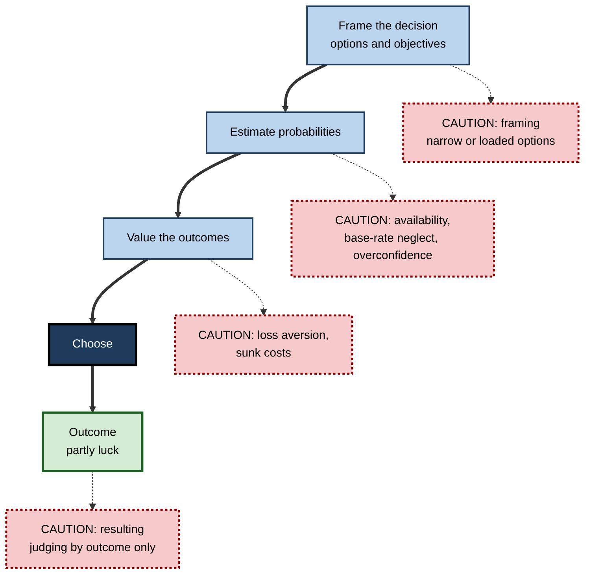
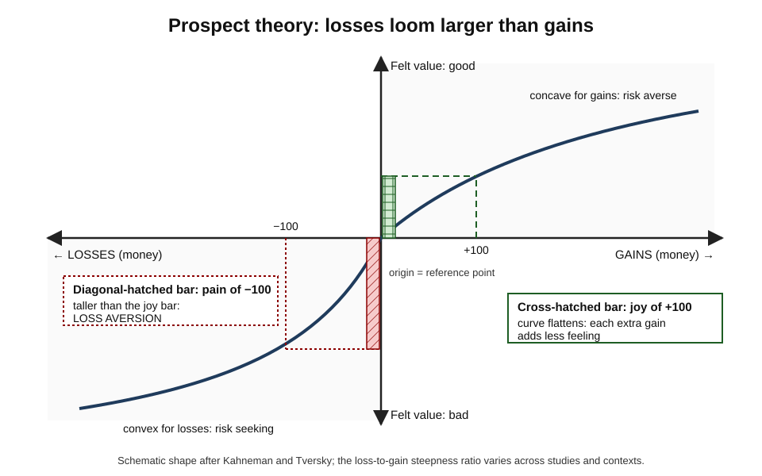
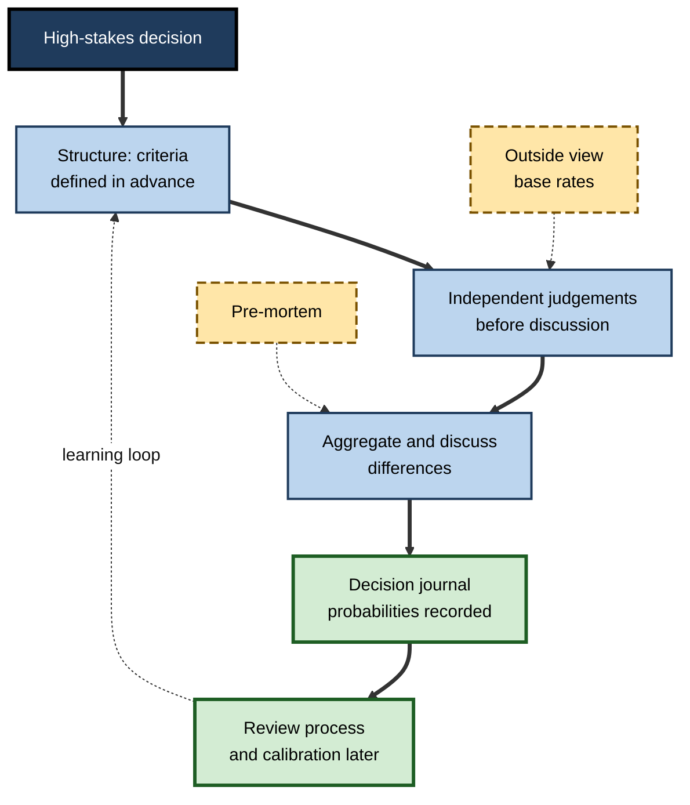

# C.7. Decision Making Under Uncertainty

> **In one sentence:** Decision making under uncertainty is choosing between options when you cannot know for sure how things will turn out — and cognitive psychology shows the systematic ways people do this well and badly.
>
> **Why it matters:** Hiring, investing, launching, pricing, estimating, diagnosing — every important professional decision is made without certainty. Knowing how judgement works lets you separate good decisions from lucky outcomes, design decision processes that reduce bias and noise, and avoid being steered by framing.
>
> **Level span:** Novice → Expert · **Reading time:** ~19 min · **Builds on:** Problem solving and reasoning

---

## The Learning Ladder

| Level | Badge | After this level you can... |
|---|---|---|
| 1 | NOVICE | Explain the difference between a good decision and a good outcome. |
| 2 | FOUNDATIONS | Use the terms risk, uncertainty, expected value, heuristics, framing and loss aversion. |
| 3 | PRACTITIONER | Run a structured decision with base rates, explicit probabilities and a pre-mortem. |
| 4 | ADVANCED | Explain prospect theory, heuristics-and-biases versus ecological rationality, noise, and the current replication status of key findings. |
| 5 | EXPERT / PRO | Design organisational decision processes, forecasting practices and AI-assisted decisions that are calibrated and auditable. |

---

## Level 1 · Novice — The Big Picture

Imagine you decide to take an umbrella because the forecast says 70% chance of rain. It stays dry. Was it a bad decision? No — it was a good decision with a lucky outcome. **A decision is judged by the information and reasoning available at the time, not only by how it turned out.** Poker players call the mistake of judging by results "resulting".

**Uncertainty** means you cannot know the outcome in advance. Sometimes you know the odds (a dice roll, a well-studied failure rate) — this is called **risk**. Often you do not even know the odds (a new market, a new technology) — this is **ambiguity** or deep uncertainty.

An analogy: decisions are like bets. Even a great poker player loses many hands. What makes them great is making bets that pay off over many hands. In a career, you make thousands of decisions; the goal is a good process that wins on average.

You have already experienced:

- Feeling worse about losing 50 than you felt good about finding 50. **That is loss aversion.**
- Thinking flying is more dangerous than driving after seeing a crash on the news. **That is the availability heuristic.**
- Choosing a "90% fat-free" product over one with "10% fat". **That is a framing effect.**

The key idea for a beginner: **uncertainty is unavoidable, so focus on deciding well, not on being right every time.**

---

## Level 2 · Foundations — Core Concepts

### The normative benchmark

Economists' classic model is **expected value**: multiply each possible outcome by its probability and add them up; choose the option with the highest total. **Expected utility theory** (formalised by John von Neumann and Oskar Morgenstern in 1944) replaces money with **utility** — subjective value — to allow for risk aversion. These are **normative** models: they describe how an ideally rational agent *should* decide. Cognitive psychology asks how people *actually* decide — a **descriptive** question.

### Bounded rationality and heuristics

Herbert Simon argued in the 1950s that people have limited time, information and computing power, so they **satisfice** — choose the first option that is good enough — rather than optimise. Amos Tversky and Daniel Kahneman's **heuristics and biases** programme (from 1974) identified mental shortcuts that are efficient but produce predictable errors:

| Heuristic | How it works | Typical bias | Work example |
|---|---|---|---|
| **Availability** | Judge frequency by how easily examples come to mind | Overweight vivid, recent events | Overestimating the risk of a dramatic security breach versus routine misconfigurations |
| **Representativeness** | Judge probability by resemblance to a stereotype | Ignore base rates; conjunction fallacy | "She talks like a founder, so the startup will succeed" |
| **Anchoring and adjustment** | Start from a number and adjust | Insufficient adjustment | First salary figure mentioned shapes the final offer |
| **Affect** | Judge by feelings toward the option | Risks and benefits seen as opposites | A loved project seen as both low-risk and high-return |

### Key terms

| Term | Plain meaning |
|---|---|
| **Risk** | Uncertainty with known probabilities. |
| **Ambiguity** | Uncertainty with unknown probabilities. |
| **Expected value** | Probability-weighted average outcome. |
| **Base rate** | How common something is in the relevant population. |
| **Heuristic** | A mental shortcut. |
| **Bias** | A systematic deviation from an accurate or rational judgement. |
| **Noise** | Unwanted *variability* in judgements that should be identical. |
| **Framing effect** | Different choices from the same options described differently. |
| **Loss aversion** | Losses weigh more than equal gains. |
| **Calibration** | How well stated confidence matches actual accuracy. |

**Figure C.7-1 — Where a decision can go wrong.**

*How to read it:* the thick path is any decision; each dotted-border box is the characteristic error at that stage.

---

## Level 3 · Practitioner — Putting It to Work

### A structured decision routine for important choices

1. **Write the decision and the objectives.** "Choose a CRM vendor; objectives: adoption by sales, total 3-year cost, integration risk."
2. **Widen the options.** Add at least one option you were not considering, including "do nothing" and "do both".
3. **Take the outside view first.** Find the **base rate**: how do projects like this usually go? (Large IT implementations commonly overrun budget and schedule.) Then adjust for what is genuinely different about your case. Kahneman and Dan Lovallo call this **reference-class forecasting**.
4. **Put numbers on uncertainty.** Estimate probabilities and ranges ("70% chance go-live slips by more than a month"), not "likely".
5. **Run a pre-mortem.** Gary Klein's technique: imagine it is a year later and the decision failed; everyone writes independently why. This surfaces risks that optimism hides.
6. **Decide and record.** Write down the decision, the reasoning, the probabilities and what would change your mind. This is a **decision journal**.
7. **Review the process, not just the outcome,** when results come in.

### Worked example — a product launch go/no-go

| | Before | After |
|---|---|---|
| **Framing** | "Launch on 1 March or not?" | Options: launch to all, launch to 10% of users, delay four weeks. |
| **Estimate** | "The team feels confident." | Base rate: past launches had a 40% chance of a major bug in week one; this one has more test coverage, estimate 25%. |
| **Pre-mortem** | None. | Surfaces untested payment edge cases in two regions. |
| **Decision** | Full launch; major bug hits all users. | 10% staged launch with a rollback plan; bug found and fixed with limited impact. |

### Common mistakes at this level

- **Vague probability words.** "Likely" can mean anything from 55% to 90% to different people.
- **Ignoring base rates** in favour of a compelling story.
- **Honouring sunk costs.** Money already spent is gone whatever you decide next.
- **Judging the decision by the outcome** and learning the wrong lesson.

---

## Level 4 · Advanced — Mechanisms, Models & Evidence

### Prospect theory

Kahneman and Tversky's **prospect theory** (1979; refined in 1992 as cumulative prospect theory) is the most influential descriptive model of risky choice. Its key claims:

1. **Reference dependence.** People evaluate outcomes as gains or losses relative to a reference point (often the status quo or an expectation), not as final wealth.
2. **Loss aversion.** Losses loom larger than equal-sized gains.
3. **Diminishing sensitivity.** The difference between 0 and 100 feels larger than between 1,000 and 1,100, for gains and losses alike — producing risk aversion for gains and risk seeking for losses.
4. **Probability weighting.** Small probabilities are overweighted (lotteries, insurance) and moderate-to-high probabilities underweighted.

*Figure C.7-2 — The prospect theory value function.* The curve is steeper for losses (left) than for gains (right) and flattens as amounts grow. Equal-sized gain and loss produce unequal feelings. Schematic shape; the steepness ratio varies between studies and contexts.

**Replication status.** A 2020 study across 19 countries and 13 languages, with over 4,000 participants, replicated the core patterns of the original 1979 prospect-theory problems in roughly 90% of the theoretically central contrasts. The *size* of loss aversion is debated: one 2024 meta-analysis estimated losses weigh roughly twice as much as gains, while another, modelling all parameters jointly, estimated a considerably smaller ratio, and some researchers argue loss aversion disappears for small, routine stakes. The mature view: **loss aversion is real and context-dependent; "losses are exactly twice as painful" is not a law of nature.**

### Two views of heuristics

| | Heuristics and biases (Kahneman, Tversky) | Ecological rationality (Gerd Gigerenzer) |
|---|---|---|
| View of heuristics | Shortcuts that cause systematic errors | Adaptive tools that exploit environment structure |
| Benchmark | Probability theory and logic | Success in real environments |
| Example | Availability inflates rare risks | "Take the best" cue often predicts as well as complex models with less data |
| Practical prescription | Debias, slow down, use structure | Teach good heuristics and better information formats (e.g., natural frequencies) |

The two views agree more than their debates suggest: heuristics work well in stable environments with valid cues and feedback, and fail in novel, noisy or deliberately manipulated ones. One robust, practical finding from the ecological camp: presenting probabilities as **natural frequencies** ("8 out of 1,000 people") rather than percentages greatly improves people's (including doctors') Bayesian reasoning.

### Noise — the neglected half of error

Kahneman, Olivier Sibony and Cass Sunstein's *Noise* (2021) emphasised that judgement errors include not only **bias** (systematic shift) but **noise** (scatter). Different underwriters quote very different premiums for the same case; the same judge may sentence differently in the morning and afternoon. Noise audits — giving many professionals the same cases — often reveal far more variability than leaders expect. Remedies include structured guidelines, independent judgements aggregated, and simple rules or models.

### Calibration and forecasting

People are typically **overconfident**: their 90% confidence intervals contain the truth far less than 90% of the time. Philip Tetlock's forecasting tournaments showed that some people ("superforecasters") are consistently better calibrated, and that training in probabilistic reasoning, teaming and aggregating forecasts measurably improves accuracy. Accuracy is scored with the **Brier score** — the mean squared error between probabilities and outcomes.

### Nudges and choice architecture — an evidence update

Changing how options are presented (defaults, ordering, reminders) can shift choices; automatic enrolment in pensions is the best-documented success. But the average effect of nudges is contested. A large 2022 meta-analysis reported a moderate average effect; a re-analysis the same year found no clear evidence of an average effect after correcting for publication bias, and a 2025 second-order meta-analysis similarly found that a small pooled effect shrank to near zero once bias was adjusted for. Defaults remain among the more robust interventions. The pro lesson: **test nudges locally; do not assume a published effect will transfer.**

**Figure C.7-3 — Reducing bias and noise in an organisational decision.**

*How to read it:* the thick path is the decision process; long-dash boxes are techniques injected at specific stages; the dotted loop is organisational learning.

---

## Level 5 · Expert / Pro — Professional Mastery

### Decision hygiene in organisations

| Practice | What it targets | Evidence strength |
|---|---|---|
| Structured interviews with predefined scoring | Noise and bias in hiring | Strong; among the best predictors of job performance |
| Independent estimates before meetings | Anchoring, conformity, noise | Strong (wisdom-of-crowds research) |
| Reference-class forecasting | Planning fallacy | Good; widely used for infrastructure and IT projects |
| Pre-mortems | Overconfidence, unseen risks | Plausible mechanism, moderate evidence |
| Decision journals and calibration tracking | Hindsight bias, overconfidence | Good in forecasting research |
| Simple models or checklists alongside experts | Noise | Strong; simple models often match or beat unaided expert judgement |

### AI in decisions

AI systems now produce risk scores, forecasts and recommendations. Cognitive research on **automation bias** shows people over-rely on automated advice, especially under time pressure, while others show **algorithm aversion** — abandoning a model after seeing it err once, even when it outperforms humans. Good designs ask for the human's independent judgement first, show the model's uncertainty, track the accuracy of both over time, and assign clear accountability. Language-model "advisers" bring a new risk: confident, fluent explanations that sound calibrated but are not.

### Professional scenario

**Role:** Head of credit risk at a lender.
**Situation:** Experienced underwriters override the scoring model frequently; leadership suspects bias but has no evidence.
**What the pro does:** Runs a noise audit: 30 underwriters independently price the same 20 real applications. The spread is far wider than anyone predicted. Introduces structured criteria, independent assessments for large loans, and a rule that overrides must record the specific reason and a probability. After six months, compares override outcomes with model-only outcomes. Overrides with documented, specific reasons outperform; vague overrides underperform and are curtailed.

### Expert-level judgement

- **Separate decision quality from outcome quality** in reviews and incentives.
- **Measure noise, not only bias;** it is often bigger and easier to reduce.
- **Use numbers for uncertainty** and score yourself over time.
- **Distrust single famous effects;** check replication and local fit before building policy on them.
- **Design the human–AI split explicitly,** including who decides when they disagree.

---

## Myths vs. Evidence

| Myth | What the evidence shows |
|---|---|
| "A bad outcome means it was a bad decision." | Outcomes include luck; judge decisions by information and process at the time. |
| "Experts are free of bias." | Experts show many of the same biases and often substantial noise; structure helps them too. |
| "Losses are always exactly twice as painful as gains." | Loss aversion is robust but its size varies widely with context and stakes. |
| "Nudges reliably change behavior." | Average nudge effects shrink substantially after correcting for publication bias; defaults are the more robust case. |
| "Heuristics are just errors." | In stable environments with valid cues, simple heuristics can perform as well as complex models. |
| "More information always improves decisions." | Beyond a point, extra information raises confidence more than accuracy. |

## Practitioner Toolkit

**Decision journal template**

| Field | Entry |
|---|---|
| Decision and date | |
| Options considered (at least three) | |
| Base rate / outside view | |
| Key probabilities (numbers) | |
| Pre-mortem risks | |
| Choice and main reason | |
| What would change my mind | |
| Review date | |
| Outcome and process review | |

**Before-you-decide checklist**

- [ ] I widened the options beyond "yes or no".
- [ ] I found the base rate for this kind of decision.
- [ ] I stated probabilities as numbers.
- [ ] Others judged independently before discussion.
- [ ] We ran a pre-mortem.
- [ ] I recorded the decision and reasoning.

## Self-Check

1. **[NOVICE]** Why can a good decision have a bad outcome?
2. **[NOVICE]** What is the difference between risk and ambiguity?
3. **[FOUNDATIONS]** Explain availability and anchoring with work examples.
4. **[FOUNDATIONS]** What is the difference between bias and noise?
5. **[PRACTITIONER]** How does a pre-mortem work and why does it help?
6. **[ADVANCED]** Name the four key claims of prospect theory.
7. **[ADVANCED]** What is the current state of evidence on loss aversion and on nudges?
8. **[EXPERT / PRO]** How would you detect and reduce noise in a team's judgements?
9. **[EXPERT / PRO]** How should an AI risk score be presented to human decision makers?

### Answer Key

1. Outcomes depend partly on chance; a well-reasoned bet can still lose.
2. Risk has known probabilities; ambiguity has unknown probabilities.
3. Availability: overestimating a dramatic recent outage type. Anchoring: an initial budget figure shaping all later estimates.
4. Bias is a systematic shift in one direction; noise is random scatter between or within judges.
5. Imagine the decision has failed and list reasons independently; it legitimises dissent and surfaces risks optimism hides.
6. Reference dependence, loss aversion, diminishing sensitivity, probability weighting.
7. Loss aversion replicates qualitatively but its size varies; average nudge effects are contested and shrink after publication-bias correction, with defaults more robust.
8. Run a noise audit with identical cases; introduce structured criteria, independent judgements and aggregation, and simple rules.
9. Collect the human's independent judgement first, show uncertainty, track accuracy of both, and define accountability for disagreements.

## Key Takeaways

- Judge decisions by **process and information**, not by outcome alone.
- People use **heuristics** that are efficient but produce predictable **biases**.
- **Prospect theory** — reference points, loss aversion, diminishing sensitivity, probability weighting — broadly replicates; magnitudes vary.
- **Noise** is a major, often bigger, source of error than bias.
- **Base rates, numeric probabilities, independent judgements and pre-mortems** improve decisions.
- **Nudge effects** are smaller and less reliable than early claims; test locally.
- Design **human–AI decisions** to avoid both automation bias and algorithm aversion.

## Glossary

| Term | Meaning |
|---|---|
| Algorithm aversion | Abandoning an algorithm after seeing it err, even if it outperforms people. |
| Automation bias | Over-reliance on automated advice. |
| Brier score | Accuracy score for probability forecasts. |
| Choice architecture | The design of how options are presented. |
| Conjunction fallacy | Judging a combination of events as more likely than one of them alone. |
| Ecological rationality | Fit between a heuristic and the structure of the environment. |
| Natural frequencies | Probabilities expressed as counts, such as 8 out of 1,000. |
| Planning fallacy | Underestimating time and cost of one's own plans. |
| Pre-mortem | Imagining failure in advance to identify risks. |
| Prospect theory | A descriptive model of choice under risk built on reference points and loss aversion. |
| Reference-class forecasting | Predicting from outcomes of similar past cases. |
| Satisficing | Choosing the first option that is good enough. |
