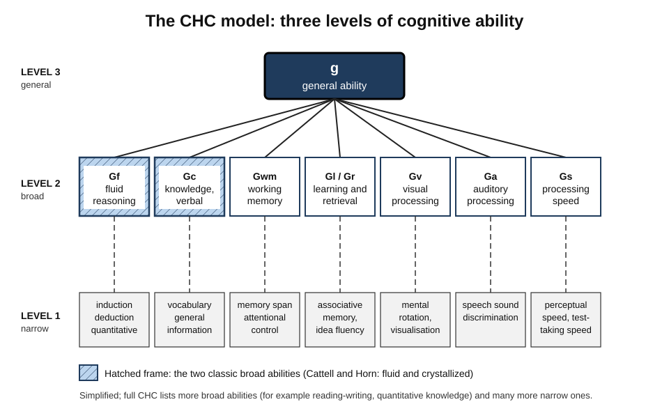
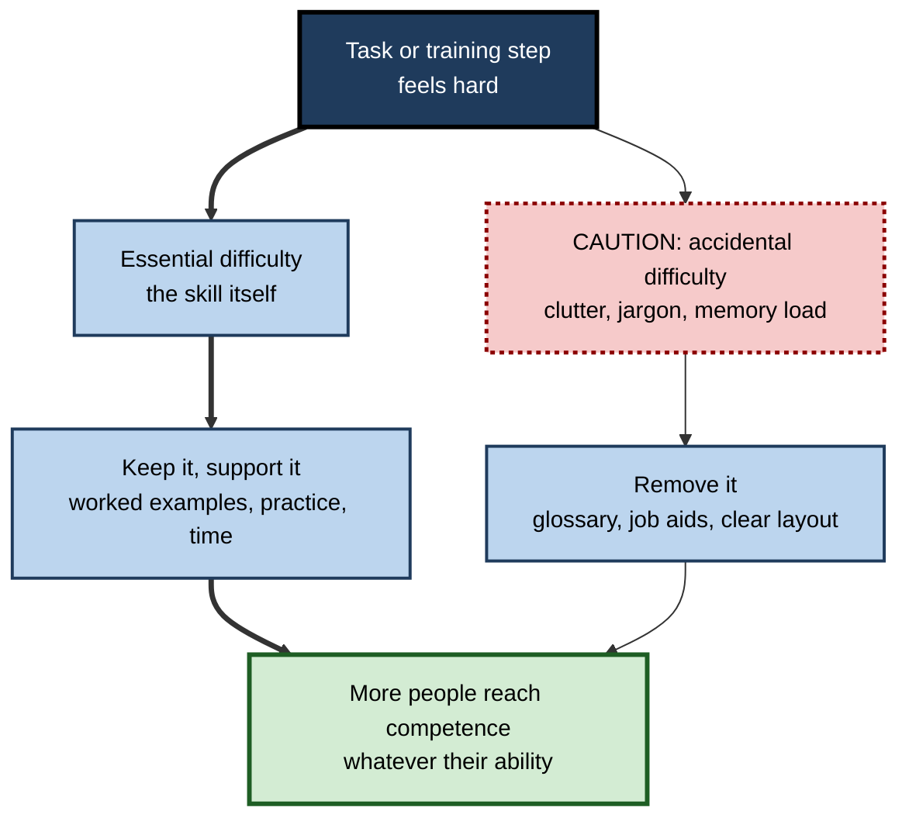

# C.8. Intelligence and Cognitive Ability

> **In one sentence:** Intelligence is the general capacity to reason, learn quickly, understand complex ideas and solve new problems, and cognitive abilities are the measurable components of that capacity, such as reasoning, verbal knowledge, memory and processing speed.
>
> **Why it matters:** Cognitive ability is one of the most studied and best-replicated topics in psychology. It predicts learning speed and, to a meaningful but smaller degree than once believed, job performance. Professionals who understand what it is — and what it is not — make fairer hiring decisions, design training that works for everyone, and resist both "IQ is destiny" and "IQ is meaningless".
>
> **Level span:** Novice → Expert · **Reading time:** ~19 min · **Builds on:** Problem solving and reasoning

---

## The Learning Ladder

| Level | Badge | After this level you can... |
|---|---|---|
| 1 | NOVICE | Explain what psychologists mean by intelligence and why it is not a single fixed label. |
| 2 | FOUNDATIONS | Describe g, fluid and crystallized intelligence, the CHC model and how IQ scores work. |
| 3 | PRACTITIONER | Interpret ability scores responsibly and design learning that reduces unnecessary cognitive demands. |
| 4 | ADVANCED | Explain heritability, education effects, the Flynn effect and its reversal, and the updated evidence on job performance. |
| 5 | EXPERT / PRO | Use cognitive ability evidence ethically in selection, development and AI-era job design. |

---

## Level 1 · Novice — The Big Picture

People differ in how quickly they pick up new ideas, how well they reason through unfamiliar problems, and how much they know. Psychologists group these differences under the word **intelligence**. A widely quoted definition, signed by 52 researchers in 1994, describes it as "a very general mental capability that, among other things, involves the ability to reason, plan, solve problems, think abstractly, comprehend complex ideas, learn quickly and learn from experience".

An analogy: think of a car's engine power. More power helps on almost any road — city, highway, hill. But a powerful engine does not make you a good driver, does not tell you the route, and matters less on a road you have driven a thousand times. Intelligence is similar: it helps most with **new, complex** problems and helps less once you have deep knowledge and practice.

You have already noticed:

- A friend who never studied a subject picks it up remarkably fast. **That is fluid reasoning and learning speed.**
- An older colleague who instantly knows the right answer from experience. **That is crystallized knowledge.**
- Someone who aced school tests but struggles at a job that needs persistence and people skills. **Intelligence is one factor among several.**

The key idea for a beginner: **intelligence is real and measurable, matters most for novel and complex tasks, and is far from the whole story of success.**

---

## Level 2 · Foundations — Core Concepts

### The positive manifold and g

In 1904 Charles Spearman noticed that people who do well on one kind of mental test tend to do well on others — vocabulary, arithmetic, puzzles, memory. This pattern of all-positive correlations is called the **positive manifold**. Spearman explained it with a **general factor, g**, shared by all tests, plus specific factors for each. More than a century later, g is still one of the most robust findings in psychology.

### Fluid and crystallized intelligence

Raymond Cattell and John Horn distinguished:

- **Fluid intelligence (Gf)** — reasoning and problem solving with new material, independent of prior knowledge. Example: working out the rule in an unfamiliar pattern puzzle.
- **Crystallized intelligence (Gc)** — accumulated knowledge and skills, especially verbal and cultural. Example: vocabulary, knowing how financial statements fit together.

The two follow different life-course paths (see the cognitive aging note): Gf tends to peak in early adulthood; Gc continues to grow well into middle and later life.

### The CHC model

Today's most widely used structure, the **Cattell–Horn–Carroll (CHC) model**, combines Cattell and Horn's work with John Carroll's 1993 reanalysis of hundreds of datasets. It is a three-level hierarchy: g at the top, around ten broad abilities in the middle, and many narrow abilities at the bottom.

*Figure C.8-1 — The CHC hierarchy (simplified).* The top box is g. The middle row shows the most commonly measured broad abilities. Dashed lines link broad abilities to example narrow abilities in the bottom row. Many tests and frameworks use slightly different lists; this is a teaching simplification.

### How IQ scores work

An **IQ test** samples many kinds of tasks and compares a person's performance with a large reference group of the same age (the **norm group**). Scores are scaled so the average is **100** and the standard deviation is **15**: about two-thirds of people score between 85 and 115, and about 95% between 70 and 130. IQ is a **relative** score — your standing compared with others — not an absolute amount of "brain power".

### Key terms

| Term | Plain meaning |
|---|---|
| **Intelligence** | General capacity to reason, learn and solve novel problems. |
| **g (general factor)** | The shared component that explains why mental test scores correlate positively. |
| **Fluid intelligence (Gf)** | Reasoning with new information. |
| **Crystallized intelligence (Gc)** | Accumulated knowledge and verbal skill. |
| **CHC model** | A hierarchical model: g, broad abilities, narrow abilities. |
| **IQ** | A standardised score comparing test performance with an age-matched norm group. |
| **Reliability** | How consistent a test's scores are. |
| **Validity** | Whether a test measures what it claims and predicts what it should. |
| **Heritability** | The proportion of score *differences in a population* associated with genetic differences. |

---

## Level 3 · Practitioner — Putting It to Work

Most professionals will never administer an IQ test. But they constantly design tasks, training and roles that make cognitive demands, and some will read ability-test results in hiring.

### Designing work and learning that respects cognitive ability differences

1. **Separate the essential difficulty from the accidental difficulty.** The essential difficulty is the concept or skill itself; accidental difficulty comes from poor explanations, clutter, unexplained jargon and memory-heavy procedures. Removing accidental difficulty helps everyone, and helps lower-ability learners most.
2. **Build on prior knowledge.** Crystallized knowledge compensates strongly for fluid ability. Pre-teach key concepts and vocabulary.
3. **Use worked examples before independent problems.** They reduce the reasoning load for novices.
4. **Externalise memory.** Checklists, templates and good tools free working memory for reasoning.
5. **Allow time and repetition.** Learning speed differs; with enough well-designed practice, most people reach competence in most professional skills.
6. **Measure outcomes, not just speed.** Fast learners and slower learners often converge on similar final performance in routine tasks.

**Figure C.8-2 — Where task difficulty comes from, and what to do about it.**

*How to read it:* the thick path keeps and supports the real challenge; the thin path strips out difficulty that adds nothing but cognitive load.

### Reading an ability-test result responsibly

- Treat a score as an **estimate with error**, not a fixed number — a range of several points either side is normal.
- Look at **what the test was validated for** and on whom.
- Never use a single score as the only basis for a high-stakes decision.

### Worked example — onboarding analysts with mixed backgrounds

| | Before | After |
|---|---|---|
| **Design** | Two-day "firehose" of tools, jargon and data models; quiz on day three. | Glossary sent in advance; worked examples of the three most common analyses; checklists for data pulls; spaced practice over two weeks. |
| **Result pattern** | Strong performance from a few fast learners; others fall behind and stay behind. | Spread of week-four performance narrows; overall average rises. |
| **Interpretation** | "Some people are just not analytical." | Much of the early gap was accidental difficulty, not ability. |

### Common mistakes at this level

- **Treating IQ as fixed destiny** for an individual.
- **Treating ability as irrelevant** and designing work that only the fastest learners can survive.
- **Confusing knowledge with ability.** Not knowing something yet is not a lack of intelligence.
- **Over-reading small score differences.** A few points is within measurement error.

---

## Level 4 · Advanced — Mechanisms, Models & Evidence

### Genes, environment and education

Twin and adoption studies estimate that the **heritability** of intelligence in adulthood in high-income countries is substantial — often in the range of about half or more — and that it **increases from childhood to adulthood**. Heritability is frequently misunderstood: it describes *variation in a population* in a given environment, not how much of one person's intelligence is "from genes", and high heritability does not mean a trait cannot be changed.

Environment clearly matters. A 2018 meta-analysis by Stuart Ritchie and Elliot Tucker-Drob, covering over 600,000 participants, found that each additional year of education raises cognitive test scores by roughly **1 to 5 IQ points**, with effects lasting into old age. Education is the most consistent and durable intervention yet found for raising measured intelligence. By contrast, commercial "brain training" and working memory training show improvement on the trained tasks with little transfer to general intelligence.

### The Flynn effect and its reversal

James Flynn documented large rises in IQ test scores across the 20th century — roughly three points per decade in many countries — too fast to be genetic. Likely causes include better nutrition, health, schooling and more abstract thinking demands. Since the 1990s several countries, including Norway, Denmark and Finland, have shown **stagnation or reversal**. Norwegian military data showed the decline occurs *within families* (younger brothers scoring lower than older brothers), pointing to environmental causes. A 2025 reanalysis of Norwegian conscript data found that earlier gains were driven mainly by specific tasks such as figure-matrix reasoning and did not fully reflect a rise in underlying g; an Austrian study reported rising scores alongside a weakening of the positive manifold. The debate on causes — changes in education, reading, media and test content — is open.

### Cognitive ability and job performance — an important update

For decades, a 1998 meta-analysis by Frank Schmidt and John Hunter, reporting a corrected validity of about .51, made general mental ability "the best single predictor of job performance". In 2022, Paul Sackett and colleagues showed that earlier corrections for range restriction were often inappropriate and re-estimated the validity at about **.31**; analysis of 21st-century studies suggests an even lower value, around **.22**. In their updated ranking, **structured interviews** and job-knowledge and work-sample tests predicted as well as or better than cognitive ability tests. Debate continues — a 2026 synthesis still found ability tests among the useful predictors, and validity is higher for learning-heavy outcomes such as training success — but the old "ability beats everything" narrative is no longer the consensus.

**Figure C.8-3 — What predicts job performance: the updated picture.**

```mermaid
%%{init: {'theme':'base','themeVariables':{'fontFamily':'Arial, Helvetica, sans-serif','fontSize':'15px','primaryColor':'#FFFFFF','primaryTextColor':'#111111','primaryBorderColor':'#222222','lineColor':'#333333','secondaryColor':'#F2F2F2','tertiaryColor':'#FFFFFF','clusterBkg':'#FAFAFA','clusterBorder':'#555555','edgeLabelBackground':'#FFFFFF','titleColor':'#111111'}}}%%
flowchart TD
    classDef core    fill:#1F3B5C,stroke:#000000,stroke-width:3px,color:#FFFFFF
    classDef key     fill:#BCD5EE,stroke:#1F3B5C,stroke-width:2px,color:#000000
    classDef good    fill:#D3ECD3,stroke:#1E5E24,stroke-width:3px,color:#000000
    classDef muted   fill:#E6E6E6,stroke:#666666,stroke-width:1px,stroke-dasharray:2 4,color:#222222
    classDef caution fill:#F6CACA,stroke:#8B0000,stroke-width:2.5px,stroke-dasharray:3 3,color:#000000

    JP["Job performance"]
    SI["Structured interviews<br/>among the strongest"]
    WS["Job knowledge and<br/>work-sample tests"]
    GMA["General cognitive ability<br/>useful, smaller than once claimed"]
    CON["Conscientiousness<br/>modest, consistent"]
    UI["Unstructured interviews<br/>weaker"]
    YE["CAUTION: years of experience<br/>weak predictor alone"]

    SI ==> JP
    WS ==> JP
    GMA --> JP
    CON --> JP
    UI -.-> JP
    YE -.-> JP

    class JP core
    class SI,WS good
    class GMA,CON key
    class UI muted
    class YE caution
```

*How to read it:* thick arrows mark the strongest predictors in recent meta-analyses; thin arrows moderate ones; dotted arrows weak ones. Exact rankings vary by job and study.

### Theories beyond g

- **Multiple intelligences** (Howard Gardner, 1983) proposed separate intelligences such as musical, bodily-kinesthetic and interpersonal. The idea is popular in education but has weak empirical support as a theory of distinct intelligences; many of the proposed "intelligences" are better described as talents or skills, and measures of them tend to correlate with g.
- **Triarchic / successful intelligence** (Robert Sternberg) adds practical and creative intelligence; measurement and evidence remain debated.
- **Emotional intelligence** has ability-based versions with some predictive value and self-report versions that overlap heavily with personality.
- **Process overlap theory** (Kristof Kovacs and Andrew Conway) suggests g emerges because different tests draw on overlapping executive processes, rather than reflecting one single underlying ability — an active research direction.

### Boundary conditions

- Ability predicts **learning new, complex material** better than performance on well-practised routine tasks.
- Ability matters less when tasks are well supported by tools, procedures and teams.
- Test scores are affected by test familiarity, language, anxiety and motivation — factors that matter especially when testing people from different backgrounds.

---

## Level 5 · Expert / Pro — Professional Mastery

### Ethical, evidence-based use in organisations

| Use | Good practice | Risk |
|---|---|---|
| Hiring | Combine structured interviews, work samples and, where justified, validated ability tests; check job relevance | **Adverse impact**: average group differences in test scores can exclude qualified candidates from some groups; legal and fairness obligations apply |
| Development | Use ability information, if at all, to tailor support and pacing | Labelling people as "high potential" or "low potential" on one score |
| Training design | Reduce accidental difficulty; provide worked examples and job aids | Designing only for the fastest learners |
| Role design in the AI era | Analyse which tasks still require novel reasoning versus judgement, verification and relationships | Assuming AI makes human reasoning irrelevant |

### AI and the changing value of cognitive abilities

Generative AI is strong at many tasks that load on crystallized knowledge and routine verbal reasoning. Early field studies across writing, consulting and customer support found that AI assistance often **narrowed performance gaps**, helping lower performers most on tasks within the AI's capabilities — while some studies found experts benefit more on tasks requiring judgement at the frontier of AI capability. The implication for professionals: the value shifts toward **framing problems, judging quality, verifying output and integrating knowledge** — abilities that still draw on fluid reasoning and deep domain knowledge.

### Professional scenario

**Role:** Talent acquisition lead at a technology company.
**Situation:** The company screens all graduates with a timed reasoning test, rejecting the bottom half. A fairness review shows the screen reduces the diversity of hires, and hiring managers say many rejected candidates performed well elsewhere.
**What the pro does:** Reviews current validity evidence and the company's own data on test scores versus performance after one year. Finds a weak relationship for most roles. Replaces the hard cut-off with a structured, job-relevant work sample and a structured interview, keeping a reasoning test only for roles where local data show it predicts training success, and weighting it rather than using it as a gate. Monitors both prediction and adverse impact each hiring cycle.

### Expert-level judgement

- **Hold two truths at once:** cognitive ability is real and predictive; it explains a minority of variance in most job outcomes.
- **Prefer job-relevant, structured evidence** over abstract tests where possible.
- **Treat environment as powerful:** education, good design and support change measured and practical ability.
- **Revisit old certainties.** The 2022 recalibration of validity shows that even "settled" applied numbers deserve scrutiny.

---

## Myths vs. Evidence

| Myth | What the evidence shows |
|---|---|
| "IQ is fixed at birth." | Scores change with education and environment; each year of schooling adds a measurable amount. |
| "IQ measures nothing real." | g is among the most replicated findings in psychology and predicts educational and occupational outcomes. |
| "Cognitive ability is the best predictor of job performance by far." | Updated meta-analyses put its validity lower; structured interviews and work samples predict as well or better. |
| "There are eight independent intelligences." | Multiple intelligences lack strong empirical support as distinct intelligences; many correlate with g. |
| "High heritability means you cannot change it." | Heritability describes population variation in a given environment, not fixedness. |
| "Brain-training games raise your IQ." | They improve trained tasks; transfer to general intelligence is minimal. |

## Practitioner Toolkit

**Fair-use checklist for any ability assessment**

- [ ] The ability is demonstrably relevant to the role (job analysis).
- [ ] The test is validated for this use and population.
- [ ] We monitor adverse impact and have alternatives.
- [ ] Scores are combined with structured, job-relevant evidence.
- [ ] Measurement error is considered; no hard cut-offs on small differences.
- [ ] Candidates receive clear information and accommodations.

**Accidental-difficulty audit for training**

| Training step | Essential difficulty | Accidental difficulty found | Fix (worked example, glossary, job aid, layout) |
|---|---|---|---|
| | | | |

## Self-Check

1. **[NOVICE]** In plain words, what is intelligence?
2. **[NOVICE]** Why does intelligence matter more for new problems than for routine ones?
3. **[FOUNDATIONS]** What is the positive manifold, and how does g explain it?
4. **[FOUNDATIONS]** Distinguish fluid and crystallized intelligence.
5. **[PRACTITIONER]** What is accidental difficulty, and why does reducing it matter?
6. **[ADVANCED]** What does heritability mean, and what does it not mean?
7. **[ADVANCED]** What did the 2022 re-analysis change about cognitive ability and job performance?
8. **[EXPERT / PRO]** What is adverse impact, and how would you manage it?
9. **[EXPERT / PRO]** How might generative AI change which cognitive abilities matter most at work?

### Answer Key

1. A general capacity to reason, learn and solve new problems.
2. Routine tasks rely on practised knowledge and procedures; new tasks require reasoning from scratch.
3. Scores on different mental tests all correlate positively; g is a general factor shared by all of them.
4. Fluid: reasoning with new material. Crystallized: accumulated knowledge and verbal skill.
5. Difficulty caused by poor design rather than the content itself; removing it helps everyone, especially those with less prior knowledge or lower fluid ability.
6. The share of score differences in a population associated with genetic differences in that environment; it does not mean an individual's score is fixed or unchangeable.
7. It lowered the estimated validity from about .51 to about .31 (lower still in recent data) and ranked structured interviews and work samples as equal or stronger predictors.
8. Lower selection rates for some groups caused by a selection method; manage by job-relevance checks, alternative valid methods, weighting rather than cut-offs, and monitoring.
9. Value shifts from recalling knowledge toward problem framing, judging and verifying output, and integrating knowledge.

## Key Takeaways

- **g** — the general factor behind the positive manifold — is real and robust.
- **Fluid** and **crystallized** abilities differ in content and in how they change with age.
- The **CHC model** organises abilities into g, broad and narrow levels.
- **Education raises measured intelligence;** brain-training games largely do not.
- The **Flynn effect** has stalled or reversed in several countries; causes are debated.
- Cognitive ability predicts job performance **less strongly than once claimed**; structured methods predict as well or better.
- Use ability evidence **ethically, with job relevance and fairness monitoring**.

## Glossary

| Term | Meaning |
|---|---|
| Adverse impact | Substantially lower selection rates for a protected group. |
| CHC model | Cattell–Horn–Carroll hierarchy of cognitive abilities. |
| Crystallized intelligence | Knowledge and skills accumulated through experience. |
| Flynn effect | Rise in IQ test scores across generations. |
| Fluid intelligence | Ability to reason with novel information. |
| g | General cognitive ability factor. |
| Heritability | Proportion of population variance linked to genetic variance. |
| IQ | Age-normed test score with mean 100 and standard deviation 15. |
| Norm group | Reference sample used to scale test scores. |
| Positive manifold | All-positive correlations among cognitive tests. |
| Range restriction | Reduced variability in a sample that distorts correlations. |
| Validity coefficient | Correlation between a predictor and an outcome. |
