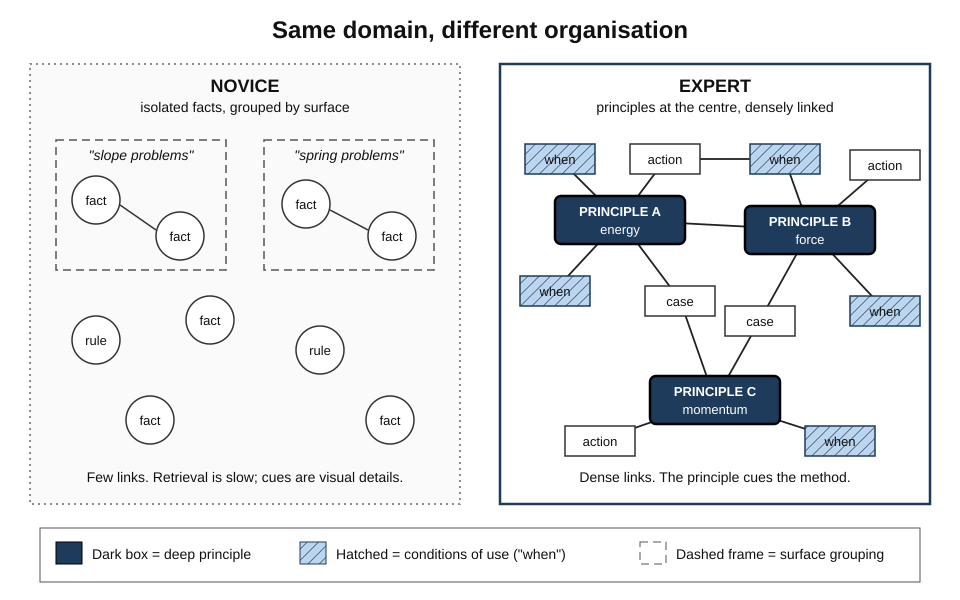
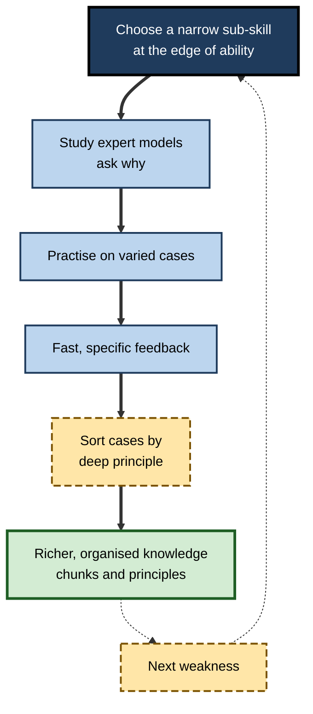
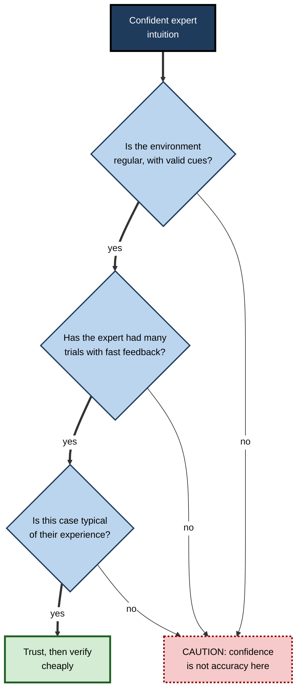

# C.9. Expertise and Novice-Expert Differences

> **In one sentence:** Expertise is consistently superior performance on the representative tasks of a domain, and it comes mainly from large, well-organised knowledge built through years of practice with feedback — not from a bigger brain or a special trick.
>
> **Why it matters:** Becoming an expert is the long game of every career, and turning novices into competent performers is the core job of every manager, mentor and L&D team. Knowing what actually changes in an expert's mind tells you how to practise, how to coach, when to trust intuition, and why brilliant experts are often poor teachers.
>
> **Level span:** Novice → Expert · **Reading time:** ~19 min · **Builds on:** Pattern recognition, concepts, problem solving

---

## The Learning Ladder

| Level | Badge | After this level you can... |
|---|---|---|
| 1 | NOVICE | Describe what makes an expert different from a beginner in everyday terms. |
| 2 | FOUNDATIONS | Explain chunking, deep versus surface representations, and automaticity. |
| 3 | PRACTITIONER | Design your own practice and use expert models deliberately to speed up learning. |
| 4 | ADVANCED | Evaluate the deliberate-practice debate, routine versus adaptive expertise, and when expert intuition can be trusted. |
| 5 | EXPERT / PRO | Build expertise in others, capture expert knowledge, and handle expertise in AI-augmented work. |

---

## Level 1 · Novice — The Big Picture

Watch an experienced nurse walk into a ward: within seconds she senses which patient is getting worse. Watch a senior engineer read a stack trace: in a moment he points to the likely cause. A novice looking at the same information sees a confusing mass of details. The expert is not thinking faster in general — **the expert is seeing something different**, because years of experience have organised the details into meaningful patterns.

An analogy: a novice in a new city reads every street sign and checks the map at every corner. A long-time resident just walks, noticing only what is unusual — a closed road, a new shop. The resident's knowledge does the work automatically, leaving attention free for what matters.

You have already experienced this:

- Typing used to need your full attention; now you think about *what* to write. **Automaticity frees the mind.**
- You can glance at a spreadsheet in your field and know something is off. **Pattern recognition built from experience.**
- An expert explained something and skipped "obvious" steps you did not know. **The expert blind spot.**

The key idea for a beginner: **expertise is mostly knowledge — huge amounts of it, organised for use — built by practice with feedback.**

---

## Level 2 · Foundations — Core Concepts

### What experts do differently

A classic 1988 summary by Michelene Chi, Robert Glaser and Marshall Farr, refined by decades of later work, lists characteristic expert advantages. Experts:

1. **Excel mainly in their own domain.** A chess master's memory advantage does not extend to random phone numbers.
2. **Perceive large meaningful patterns.** They see "a fork" or "a memory leak", not individual pieces.
3. **Are fast and make few errors** on routine tasks, because much processing is automatic.
4. **Have superior memory for domain material** — through chunking and retrieval structures, not bigger memory capacity.
5. **Represent problems at a deep level** (by principle), while novices use surface features.
6. **Spend more time analysing a problem** qualitatively before acting on hard or new problems.
7. **Monitor their own performance well** — they know when they are wrong.

### Chunking: the chess studies

Adriaan de Groot, and later William Chase and Herbert Simon (1973), showed chess positions to players for five seconds and asked them to reconstruct them. Masters recalled game positions far better than novices — but when pieces were placed randomly, their advantage largely disappeared. Masters were not storing more pieces; they were storing **chunks** — familiar groups of pieces that meant something. Chase and Simon estimated that masters hold tens of thousands of such patterns in long-term memory.

### Deep versus surface: the physics studies

In 1981 Chi, Paul Feltovich and Glaser asked physics novices and experts to sort problems into groups. Novices grouped by **surface features** ("problems with inclined planes", "problems with springs"). Experts grouped by **deep principles** ("conservation of energy", "Newton's second law"). Because the right solution method follows the principle, the expert's grouping leads straight to the solution.

*Figure C.9-1 — Novice versus expert knowledge organisation.* Left: the novice holds isolated facts grouped by surface features, with few links. Right: the expert's knowledge is organised around a small number of deep principles, densely linked to conditions of use and actions. Schematic.

### Key terms

| Term | Plain meaning |
|---|---|
| **Expertise** | Consistently superior performance on representative tasks of a domain. |
| **Chunk** | A meaningful group of information stored and retrieved as one unit. |
| **Automaticity** | Performing a skill with little conscious attention. |
| **Deep structure** | The underlying principle that determines how to solve a problem. |
| **Surface features** | Visible details that may not matter for the solution. |
| **Deliberate practice** | Effortful practice designed to improve specific weaknesses, with feedback. |
| **Expert blind spot** | Experts' difficulty seeing what novices do not know. |
| **Adaptive expertise** | Flexible expertise that handles novel situations and invents new procedures. |

---

## Level 3 · Practitioner — Putting It to Work

### A practice plan that builds expertise

1. **Pick a narrow sub-skill at the edge of your ability.** "Write SQL" is too broad; "write correct window-function queries for running totals" is practisable.
2. **Get or make expert models.** Study worked examples from experts and ask them *why* — what they noticed, what they ignored.
3. **Practise on many varied cases.** Expertise is built from exposure to hundreds or thousands of cases, especially unusual ones.
4. **Get fast, specific feedback.** Feedback is the engine; without it, practice may just automate mistakes.
5. **Sort by principle.** After solving, classify each problem by the deep principle it uses. This builds expert-like organisation.
6. **Explain to someone.** Teaching exposes gaps and links ideas.
7. **Repeat, spaced over time,** shifting focus as weaknesses move.

**Figure C.9-2 — The expertise-building loop.**

*How to read it:* each pass through the thick path adds organised knowledge; the dotted loop moves practice to the next weakness.

### Worked example — a junior auditor learning to spot risky journal entries

| | Before | After |
|---|---|---|
| **Practice** | Reviews whatever entries arrive, no feedback until the annual review. | Weekly batch of 40 past entries, half later found problematic; immediate comparison with senior auditor's judgement and reasons. |
| **Organisation** | Remembers rules by account type (surface). | Sorts cases by mechanism: revenue manipulation, cut-off errors, management override. |
| **After three months** | Flags many entries, misses the subtle ones. | Flags fewer, catches more; can explain the mechanism behind each flag. |

### Common mistakes at this level

- **Equating years with expertise.** Ten years of repeating the same thing without feedback can produce one year of learning ten times.
- **Practising only what you are good at.** Comfortable practice feels productive but adds little.
- **Copying expert actions without their reasons.** Actions without the cues that trigger them do not transfer.
- **Skipping the basics.** Experts' fluency rests on automatic fundamentals.

---

## Level 4 · Advanced — Mechanisms, Models & Evidence

### The deliberate-practice debate

K. Anders Ericsson, Ralf Krampe and Clemens Tesch-Römer's 1993 study of violinists found that the best performers had accumulated far more hours of solitary **deliberate practice**, and Ericsson argued that such practice is the main cause of expert performance. Popular books turned this into a "10,000-hour rule" — a number Ericsson himself disputed.

Later meta-analyses complicated the picture. Brooke Macnamara, David Hambrick and Frederick Oswald's 2014 meta-analysis found that deliberate practice explained about 26% of performance differences in games, 21% in music, 18% in sports, 4% in education and under 1% in professions. A 2016 sports meta-analysis found that among elite athletes, accumulated practice explained only about 1% of differences. Ericsson's supporters responded that many studies did not measure true deliberate practice — individualised, coach-designed, feedback-rich — and so underestimated its effect.

The current balanced view: **practice of the right kind is necessary for expertise and is the factor you can control, but it is not sufficient, and its explanatory power varies a lot by domain.** Starting age, prior abilities, working memory, motivation, quality of coaching and opportunity all contribute.

### When can you trust expert intuition?

Daniel Kahneman (a sceptic of intuition) and Gary Klein (a champion of it) published a joint paper in 2009 that found common ground. Expert intuition is trustworthy when two conditions hold:

1. **The environment is regular enough** — there are valid cues that actually predict outcomes (a firefighter reading a building, a chess position).
2. **The expert has had extensive practice with fast, clear feedback** to learn those cues.

Where environments are unpredictable (long-range stock picking, political forecasting) or feedback is slow and ambiguous, confident intuitions are often no better than chance. Klein's **recognition-primed decision** model describes how experts in valid environments recognise a situation as typical, generate a workable action and mentally simulate it, instead of comparing many options.

**Figure C.9-3 — Should you trust this expert's intuition?**

*How to read it:* only intuitions that pass all three gates deserve trust; confidence alone is never a gate.

### Routine versus adaptive expertise

Giyoo Hatano and Kayoko Inagaki (1986) distinguished **routine experts**, who are fast and accurate on familiar tasks, from **adaptive experts**, who also understand *why* procedures work and can invent new ones when conditions change. Adaptive expertise grows from varied practice, understanding principles, and tackling unfamiliar problems — and matters most where technology and markets change quickly.

### The costs of expertise

- **Expert blind spot / curse of knowledge.** Experts underestimate how hard things are for novices and skip steps. Pamela Hinds showed experts predicted novice task times less accurately than intermediates did.
- **Expertise reversal effect.** Instruction that helps novices (detailed worked examples) can hinder experts, who learn better from problems; and vice versa.
- **Entrenchment.** Deep routines can make experts slower to adapt when rules change; expertise can also produce overconfidence outside the domain.

### Stage models — with caution

The Dreyfus model describes five stages (novice, advanced beginner, competent, proficient, expert), moving from rule-following to intuitive, context-sensitive performance. It is widely used in nursing and professional frameworks and is a helpful vocabulary, but it is a descriptive model with limited direct experimental testing.

---

## Level 5 · Expert / Pro — Professional Mastery

### Building expertise in others

| Practice | Mechanism | Example |
|---|---|---|
| **Cognitive task analysis** | Elicits the cues, judgements and strategies experts cannot easily verbalise | Interviewing senior engineers about specific past incidents, not general rules |
| **Case libraries with expert commentary** | Many varied cases plus the reasons experts used | Annotated sales calls; annotated code reviews |
| **Simulation and decision games** | High-volume practice with feedback in safe conditions | Incident response drills; tactical decision games |
| **Apprenticeship with think-aloud** | Makes invisible expert reasoning visible | Pairing; senior narrates while working |
| **Graduated autonomy** | Increases challenge as competence grows | From shadowing to supervised to independent on-call |
| **Feedback infrastructure** | Shortens the feedback loop | Dashboards showing outcomes of each analyst's past calls |

### Expertise in AI-augmented work

AI tools change the expertise picture in three ways. First, they act as **instant expert models** — useful as worked examples, risky as substitutes for practice. Second, field studies have found AI assistance often helps **novices most** on tasks within the AI's competence, compressing early learning curves; but people who rely on AI may miss the very practice that builds chunks and intuition. Third, supervising AI output requires **expertise to detect errors** — fluent, plausible mistakes are visible only to someone who knows the domain deeply. Organisations therefore face a "missing rung" risk: if junior work is automated, where will the next generation of experts get their thousands of cases? Thoughtful teams deliberately reserve some tasks for unaided practice and use AI as a coach that explains and questions.

### Professional scenario

**Role:** Director of a cybersecurity operations centre.
**Situation:** Senior analysts are retiring; new analysts take two years to become reliable; AI triage tools now handle most routine alerts, so juniors see fewer cases.
**What the pro does:** Runs cognitive task analysis with senior analysts on twenty memorable incidents, extracting the cues they noticed first. Builds a case library and a weekly simulation in which juniors triage historical incidents *without* AI, then compare with expert reasoning. Uses the AI tool live, but requires juniors to write their own hypothesis before viewing the AI's. Tracks time-to-independence and miss rates on seeded test alerts.

### Expert-level judgement

- **Expertise is domain-specific.** Do not assume skill transfers to adjacent areas; check.
- **Design for feedback.** Where feedback is slow, create it: simulations, reviews, prediction logs.
- **Mind the blind spot.** Test your explanations on real novices.
- **Protect the practice pipeline** in the AI era.

---

## Myths vs. Evidence

| Myth | What the evidence shows |
|---|---|
| "10,000 hours makes anyone an expert." | Practice is necessary but explains a variable, often modest share of differences; quality matters more than hours. |
| "Experts have better general memory." | Their memory advantage is largely limited to meaningful material in their domain. |
| "Experts always make better teachers." | The expert blind spot makes many experts underestimate novice difficulty. |
| "Gut feeling of experienced people should be trusted." | Only in regular environments with valid cues and rapid feedback. |
| "Years of experience equal expertise." | Experience without feedback can plateau early; experience alone is a weak predictor of performance. |
| "Talent is irrelevant; it is all practice." | Abilities, starting age, coaching and opportunity also contribute. |

## Practitioner Toolkit

**Deliberate practice planner**

| Field | Entry |
|---|---|
| Sub-skill (narrow, at the edge of ability) | |
| Expert model or worked example | |
| Practice cases (varied, include unusual) | |
| Feedback source and speed | |
| Deep principles to sort cases by | |
| Next review date | |

**Expert interview prompts (cognitive task analysis)**

- [ ] "Tell me about a specific time this was hard."
- [ ] "What did you notice first?"
- [ ] "What would a novice have missed?"
- [ ] "What did you expect to happen next?"
- [ ] "What would have made you do something different?"
- [ ] "How did you know it was working?"

## Self-Check

1. **[NOVICE]** What is the main thing that makes experts different?
2. **[NOVICE]** What is automaticity, and why does it help?
3. **[FOUNDATIONS]** What did the chess studies with random positions show?
4. **[FOUNDATIONS]** How do novices and experts sort physics problems differently?
5. **[PRACTITIONER]** Design one week of deliberate practice for a sub-skill in your job.
6. **[ADVANCED]** Summarise the deliberate-practice debate.
7. **[ADVANCED]** When can expert intuition be trusted?
8. **[EXPERT / PRO]** What is the "missing rung" risk of AI, and how would you mitigate it?
9. **[EXPERT / PRO]** Why should training for experts differ from training for novices?

### Answer Key

1. Large amounts of well-organised domain knowledge built through practice with feedback.
2. Performing with little conscious attention; it frees attention for higher-level thinking.
3. Masters' memory advantage depends on meaningful patterns (chunks); with random positions it largely disappears.
4. Novices by surface features; experts by underlying principles.
5. Answers vary; should include a narrow sub-skill, expert models, varied cases, fast feedback and sorting by principle.
6. Ericsson argued deliberate practice is the main cause of expertise; meta-analyses found it explains a variable, sometimes small share; supporters argue many studies mismeasured it. Consensus: necessary, not sufficient.
7. When the environment has valid cues and the expert has had extensive practice with fast, clear feedback, and the case is typical.
8. Automating junior work removes the cases that build expertise; mitigate with case libraries, simulations, unaided practice and AI used as a coach.
9. The expertise reversal effect: support that helps novices can hinder experts, who learn better from challenging problems.

## Key Takeaways

- Expertise is mostly **organised domain knowledge**: chunks, principles, automatic routines.
- Experts **see deep structure**; novices see surface features.
- **Deliberate practice with feedback** is necessary and controllable, but not the whole story.
- Trust expert intuition only in **regular environments with fast feedback**.
- Aim for **adaptive**, not just routine, expertise.
- Experts suffer a **blind spot** for novice difficulty; training should adapt to expertise level.
- AI can accelerate novices but threatens the **practice pipeline**; protect it deliberately.

## Glossary

| Term | Meaning |
|---|---|
| Adaptive expertise | Expertise that flexibly handles novel problems. |
| Automaticity | Skill execution with little conscious control. |
| Chunk | A meaningful unit of grouped information. |
| Cognitive task analysis | Methods to elicit experts' implicit knowledge and cues. |
| Deep structure | The principle governing a problem's solution. |
| Deliberate practice | Structured, effortful practice targeting weaknesses with feedback. |
| Dreyfus model | Five-stage descriptive model of skill acquisition. |
| Expert blind spot | Experts' difficulty perceiving novices' needs. |
| Expertise reversal effect | Instruction effective for novices becoming ineffective for experts. |
| Recognition-primed decision | Expert decision by recognising a typical situation and simulating an action. |
| Routine expertise | Fast, accurate performance on familiar tasks. |
| Surface features | Visible but non-essential problem details. |
