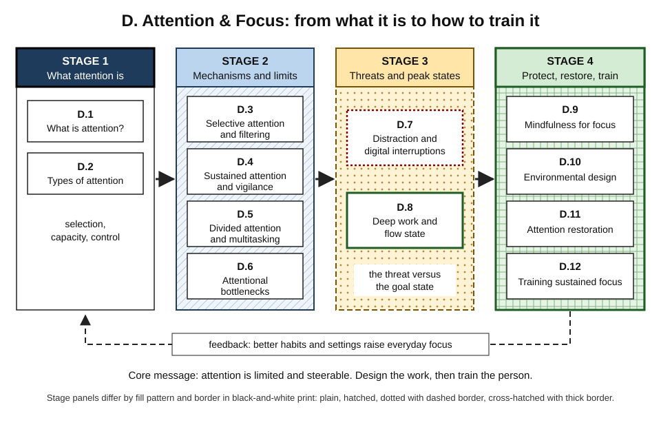
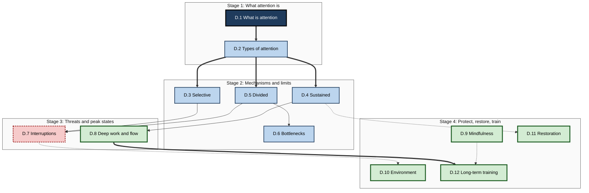
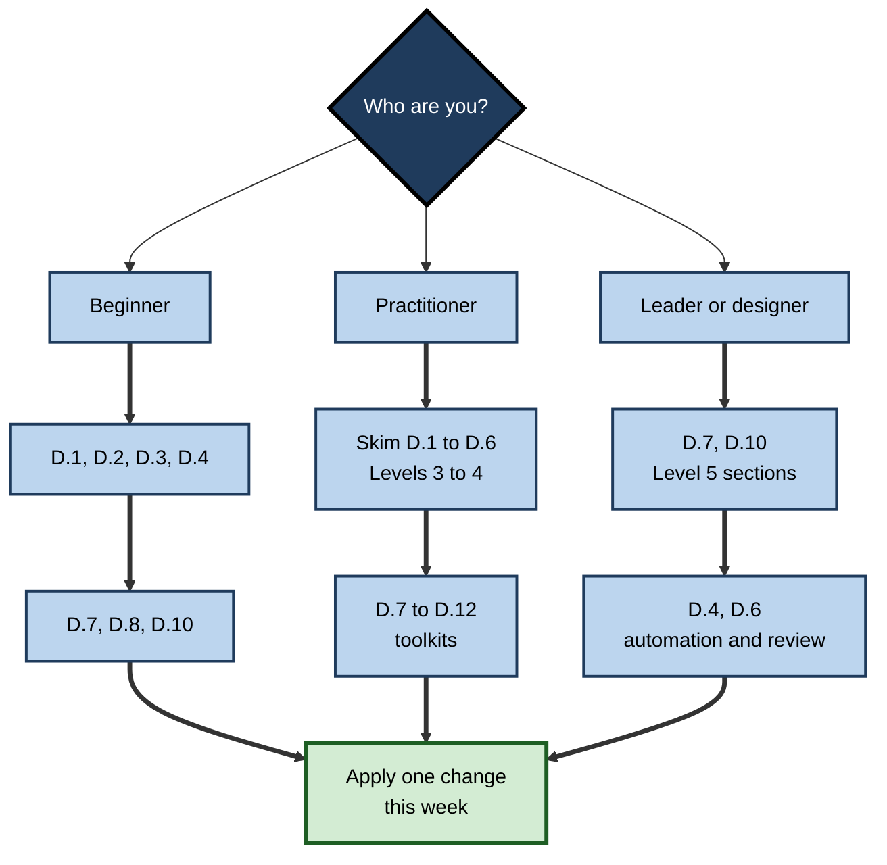

# D. Attention & Focus

> **What this subtopic is about:** The science of attention — how the brain selects what to process, why focus is limited and fades, what breaks it, what peak focus looks like — and the evidence-based ways to protect, restore and train it at work and in learning.
>
> **Who it is for:** Anyone who learns or does knowledge work, from students and new professionals to managers, learning designers and leaders who shape how others work · **Notes in this subtopic:** 12 · **Level span:** Novice → Expert

---

## Overview

Attention is the doorway to everything else in learning science. Before information can be held in working memory, stored in long-term memory or organised into schemas, it has to be attended to. Attention is also the resource that modern work strains most: knowledge workers now face interruptions every couple of minutes during core hours, and measured attention on any one screen has fallen to under a minute on average.

This subtopic treats attention as a **family of limited, steerable processes**. It starts with what attention is and its types (D.1–D.2), moves to the mechanisms and hard limits that govern it — selection, sustained vigilance, multitasking and bottlenecks (D.3–D.6) — then examines the biggest everyday threat (digital interruption, D.7) and the most valuable state (deep work and flow, D.8). It finishes with four evidence-based levers: mindfulness, environmental design, restoration and long-term training (D.9–D.12).

*Figure D-1 — Overview of the subtopic.* Four stages from understanding to action. The dashed feedback line shows that better environments, recovery and practice raise everyday focus, which in turn makes each stage easier to apply.

Throughout, the notes separate well-replicated findings (the vigilance decrement, task-switch costs, the irrelevant speech effect, inattentional blindness) from contested or overstated ones (the "goldfish attention span", ego depletion, the strong "brain drain" claim, brain-training far transfer, neural claims about flow).

---

## Why It Matters

- **Learning depends on it.** Divided or absent attention at encoding sharply reduces what is remembered; no study technique works on material that was never attended to.
- **Quality depends on it.** Errors in reviews, audits, code and clinical checks cluster when attention is fragmented, fatigued or monitoring rare events.
- **Value depends on it.** The most valuable professional output — analysis, design, strategy, writing — comes from sustained, uninterrupted concentration.
- **Organisations shape it.** Most attention problems are created by meeting culture, communication norms, office design and tooling, so leaders and designers have more leverage than individuals.
- **AI changes it.** Generative AI can absorb low-value attention demands, but it also widens the input that humans must review and can erode the practice of unaided focus. Directing attention well is becoming a core professional skill.

---

## What You Will Learn

| # | Note | Core question it answers | Primary level |
|---|---|---|---|
| D.1 | What is Attention? | What is attention, and why is it limited? | Novice → Foundations |
| D.2 | Types of Attention | Which kinds of attention exist, and which does a task demand? | Foundations |
| D.3 | Selective Attention and Filtering | How does the brain choose what to process and filter the rest? | Foundations → Advanced |
| D.4 | Sustained Attention and Vigilance | Why does focus fade over time, and how do we design around it? | Practitioner → Advanced |
| D.5 | Divided Attention and Multitasking | When can we do two things at once, and what does switching cost? | Practitioner |
| D.6 | Attentional Bottlenecks | Where does processing narrow to one thing at a time? | Advanced |
| D.7 | Distraction and Digital Interruptions | What do interruptions really cost, and how do we reduce them? | Practitioner → Expert |
| D.8 | Deep Work and Flow State | How do we create the conditions for peak concentration? | Practitioner → Expert |
| D.9 | Mindfulness for Better Focus | What can mindfulness training realistically do for attention? | Practitioner → Advanced |
| D.10 | Environmental Design for Attention | How do space, tools and norms make focus the default? | Practitioner → Expert |
| D.11 | Attention Restoration Techniques | How do we recover focus once it is worn down? | Practitioner → Advanced |
| D.12 | Training Sustained Focus Over Time | Which long-term training approaches actually work? | Advanced → Expert |

---

## Concept Map

**Figure D-2 — How the twelve notes relate.**

*How to read it:* thick arrows are the main conceptual dependencies; thin arrows show where a mechanism explains a threat; dotted arrows show which strategy answers which problem.

---

## Recommended Learning Path

1. **Start with D.1 and D.2** — everyone, including professionals, should share the vocabulary.
2. **Read D.3, D.4 and D.5** in order — they explain most everyday focus failures.
3. **D.6** is the most technical note; beginners can skim Levels 1–3 and return later.
4. **D.7 and D.8** are the practical heart: what breaks focus and what peak focus requires.
5. **Pick from D.9–D.11** based on your biggest problem: mind wandering (D.9), noisy or interrupt-heavy surroundings (D.10), end-of-day fatigue (D.11).
6. **Finish with D.12**, which pulls everything into a long-term plan.

**Figure D-3 — Paths for different readers.**

*How to read it:* choose your row and follow the thick arrows; every path ends with a concrete change.

A professional who already knows the basics can skim Levels 1–2 of each note and go straight to Levels 4–5, the Myths tables and the toolkits.

---

## The Big Ideas in Brief

**D.1 What is Attention?** Attention is the brain's selection system: it gives a small slice of input and thought deep processing and lets the rest fade. It is limited, pulled bottom-up by salience and pushed top-down by goals, served by alerting, orienting and executive networks, and it gates learning. The "goldfish attention span" is a myth; what has changed is how often we switch.

**D.2 Types of Attention.** Focused, sustained, selective, alternating and divided attention are distinct and can be strong or weak independently. Diagnose which type a task demands before choosing a fix. Attention tests show robust group effects but are noisy for judging individuals.

**D.3 Selective Attention and Filtering.** The filter enhances the target and suppresses the rest, but it leaks — your name and salient alerts break through. Inattentional blindness is normal, even for experts. Load theory shows perceptual load protects against distraction while cognitive load increases it. Remove distractors rather than resisting them, and guard against alarm fatigue.

**D.4 Sustained Attention and Vigilance.** Performance on monotonous monitoring tasks declines with time — the vigilance decrement. Theories now stress shifting control and motivation as well as fatigue. Sleep loss multiplies lapses. Automation and AI often leave humans with the hardest vigilance task: supervising systems that rarely fail.

**D.5 Divided Attention and Multitasking.** For thinking tasks, multitasking is mostly switching, with costs at each switch. Tasks combine well only when one is automatic or they use different resources. Media-multitasking harms are small and correlational; phone use while driving is clearly harmful. Batch, separate roles, and serialise human judgement.

**D.6 Attentional Bottlenecks.** The mind is wide at input and narrow at decision. The psychological refractory period and the attentional blink reveal serial limits. Serialise decisions, space critical signals, externalise open loops, and remove decisions with defaults. Teams have human bottlenecks too, which AI-generated volume can overload.

**D.7 Distraction and Digital Interruptions.** Interruptions cost far more than their duration: resumption lag, errors, attention residue and drift. Many are self-interruptions. Triage notifications, batch communication, signal focus and park tasks with a note. Phone-presence effects are smaller than first claimed. Team norms deliver the biggest gains.

**D.8 Deep Work and Flow State.** Deep work is protected, distraction-free concentration; flow is the absorbed state that can arise when goals are clear, feedback is immediate and challenge matches skill. You can build the runway but not force take-off. Flow neuroscience is unsettled; fixed "90-minute cycles" are weakly supported.

**D.9 Mindfulness for Better Focus.** Mindfulness trains the attend–wander–notice–return cycle. Meta-analyses show small, component-specific effects on attention, strongest against passive controls. Short, consistent practice and micro-resets fit work; it is not a cure for a distracting workplace.

**D.10 Environmental Design for Attention.** Environment beats willpower. Work across physical, digital and social layers using removal, friction, defaults and norms. Intelligible background speech is among the most disruptive sounds; open-plan offices need real quiet zones.

**D.11 Attention Restoration Techniques.** Directed attention tires and recovers when attention is engaged effortlessly. Real nature exposure shows small-to-moderate benefits, more consistently at 30 minutes or more; simulated nature is weaker. Micro-breaks restore energy; sleep is the strongest restorer; evening detachment supports next-day focus.

**D.12 Training Sustained Focus Over Time.** Focus grows through real-task practice, gradual progression, habits, a supportive environment, health and expertise. Brain-training apps show little far transfer. In the AI era, deliberately preserve unaided deep engagement.

---

## Novice-to-Pro Progression

| Level | What competence looks like here |
|---|---|
| **NOVICE** | Knows attention is limited, recognises distraction and drift, makes simple changes such as moving the phone away and turning off notifications. |
| **FOUNDATIONS** | Uses the vocabulary — selective, sustained, divided, switch cost, vigilance decrement, attention residue — and can explain everyday focus failures with it. |
| **PRACTITIONER** | Runs a personal focus system: audit, notification triage, batching, deep-work blocks, real breaks, parking notes, environment set-up. |
| **ADVANCED** | Evaluates evidence critically: knows which effects are robust, which are contested (ego depletion, brain drain, flow neuroscience, brain training), and the mechanisms behind each. |
| **EXPERT / PRO** | Designs attention-aware teams, workplaces, tools, alerting systems, training and AI workflows; measures focus at team level, ethically and transparently. |

---

## Where This Shows Up at Work

| Context | Attention issue | Relevant notes |
|---|---|---|
| Software engineering | Interruptions, flow, code review vigilance, reviewing AI-generated code | D.4, D.7, D.8 |
| Operations and security monitoring | Rare-signal vigilance, alarm fatigue, alert design | D.3, D.4, D.6 |
| Consulting and professional services | Fragmented days, review bottlenecks, deep analytical work | D.6, D.7, D.8 |
| Sales and customer service | Talking while typing, concurrent chats | D.2, D.5 |
| Healthcare, aviation, process control | Vigilance, alarm flooding, shift fatigue, recovery | D.4, D.6, D.11 |
| Learning and development | Designing distraction-free learning, realistic claims about focus training | D.9, D.10, D.12 |
| Workplace and product design | Office acoustics, digital defaults, notification design, ethical salience | D.3, D.10 |
| Leadership | Meeting culture, response norms, protecting maker time | D.7, D.8, D.10 |

---

## Capstone Exercises

1. **Personal attention audit (Novice–Practitioner).** Log intended versus actual attention every 30 minutes for one working day. Tag each pull as external or internal, identify the attention type involved, and design one environmental and one habit change. Repeat the audit after two weeks and compare.
2. **Twelve-week focus plan (Practitioner).** Measure your baseline focus block, then run the progressive plan with implementation intentions and weekly tracking. Report planned versus actual focused minutes, self-interruptions, and what changed in the quality of your work.
3. **Alert and review redesign (Advanced).** Take a real alerting system, dashboard or review process. Apply selective attention, vigilance and bottleneck principles: reduce false alarms, assign one pop-out signal per meaning, add independent checks, cap review session length. Estimate the effect on missed issues.
4. **Team attention charter (Expert).** With a team, agree response-time norms, focus windows, an urgent channel, meeting defaults and an AI interruption budget. Define three team-level metrics (for example, uninterrupted blocks per week, after-hours messages, cycle time). Run a six-week pilot and present results honestly, including limits.
5. **Evidence critique (Advanced–Expert).** Pick a popular focus claim — a brain-training app, a "flow hack", a mindfulness-for-productivity programme or a phone policy. Summarise what the best evidence shows, its effect size and limits, and write a one-page recommendation for a leadership audience.

---

## Key Takeaways

- Attention is a **limited, steerable selection system** and the **gateway to learning**.
- It comes in **several types** with different failure modes — diagnose before fixing.
- **Selection leaks, vigilance fades, multitasking is switching, decisions queue** — these are features of human attention, not personal failings.
- **Interruptions cost far more than their duration**; environment and team norms are the strongest levers.
- **Deep work and flow** require protected time, clear goals, fast feedback and matched challenge.
- **Mindfulness, restoration and long-term practice** help, with **honest, modest** effect sizes.
- Many popular claims — goldfish spans, willpower batteries, brain-training transfer — are **myths or overstated**.
- In the **AI era**, humans remain the attention bottleneck; design workflows that respect it and preserve unaided focus.
