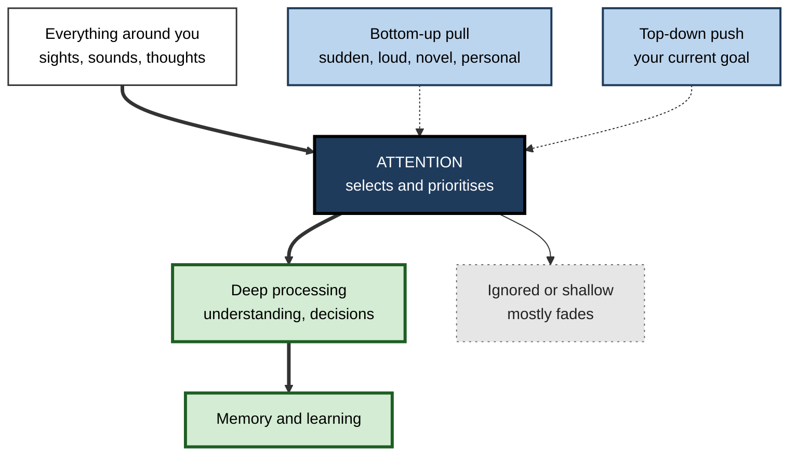
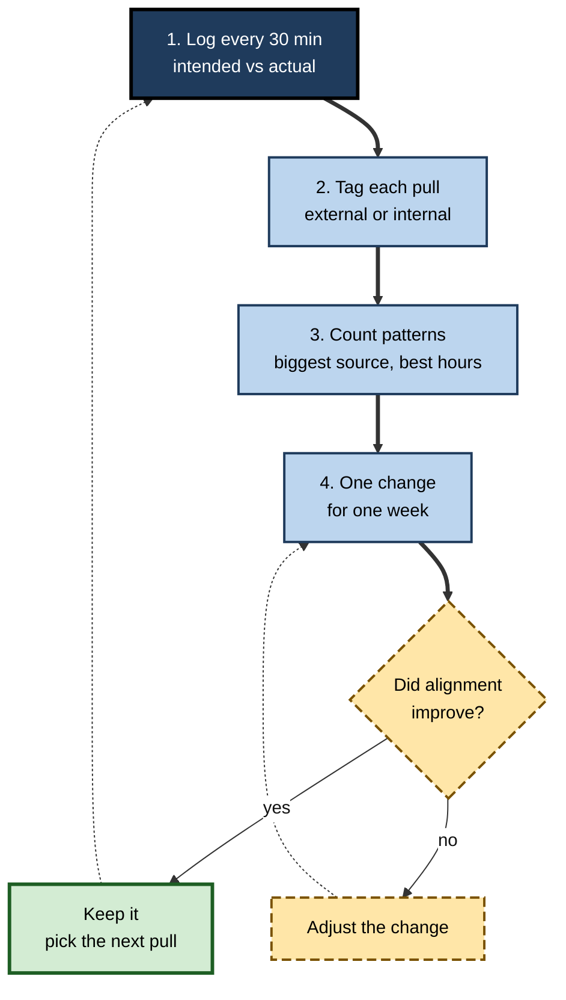

# D.1. What is Attention?

> **In one sentence:** Attention is the brain's way of choosing a small part of everything you could notice or think about, and giving that part extra processing while the rest fades into the background.
>
> **Why it matters:** Nothing gets learned, decided or built well unless it first gets attended to. People who understand what attention really is stop blaming "willpower" for every lapse and start designing their work, tools and teams so that attention goes where it pays off.
>
> **Level span:** Novice → Expert · **Reading time:** ~17 min · **Builds on:** nothing — start here

---

## The Learning Ladder

| Level | Badge | After this level you can... |
|---|---|---|
| 1 | NOVICE | Explain in plain words what attention is and why you cannot attend to everything at once. |
| 2 | FOUNDATIONS | Use the core vocabulary — selection, capacity, control, bottom-up and top-down — and the spotlight metaphor correctly. |
| 3 | PRACTITIONER | Run a simple attention audit on your own day and turn it into one concrete change. |
| 4 | ADVANCED | Explain the main scientific models, the brain networks involved, and how attention gates learning and memory. |
| 5 | EXPERT / PRO | Treat attention as a scarce organisational resource: design work, products and AI-assisted workflows that respect it, and measure the effect. |

---

## Level 1 · Novice — The Big Picture

Right now your senses are taking in far more than you notice: the pressure of the chair, the hum of a fan, the colour of the wall, the words on this line. You are aware of only a tiny slice of it. The process that picks that slice is **attention** — the brain's selection system that decides what gets processed deeply and what gets ignored.

A good everyday analogy is a **theatre spotlight** on a dark stage. Many actors are on stage, but only the one in the beam is clearly visible. You can move the beam, widen it to cover more actors (each less brightly), or narrow it to see one in sharp detail. You cannot light the whole stage at full brightness at once.

You have already experienced attention at work many times:

- At a noisy party you follow one friend's voice, yet you suddenly hear your own name spoken across the room. Your attention was filtering — and the filter still let important things through.
- You drove home and arrived with almost no memory of the journey. Your attention was elsewhere, while well-practised habits did the driving.
- You read a whole page of a report and realised you took in nothing, because your mind had wandered to a meeting. Your eyes moved; your attention did not.

The key idea for a beginner: **attention is limited, and whatever you attend to is what your brain works on and remembers.** What you ignore mostly does not get learned.

---

## Level 2 · Foundations — Core Concepts

### Three jobs attention does

Most researchers agree that "attention" is not one thing but a family of related functions. Three jobs come up again and again:

1. **Selection** — picking which information gets priority (this voice, not that one; this line of code, not the chat window).
2. **Capacity management** — sharing limited processing power between tasks, and protecting the main task from overload.
3. **Control** — keeping attention on a goal over time, resisting distraction, and switching on purpose when the goal changes.

### Bottom-up and top-down

Attention is pulled in two directions all day:

- **Bottom-up (stimulus-driven, exogenous) attention** is grabbed automatically by things that are sudden, loud, bright, moving or personally relevant — a notification banner, a flashing light, your name.
- **Top-down (goal-driven, endogenous) attention** is directed on purpose by what you are trying to do — scanning a spreadsheet for negative numbers, listening for the client's real objection.

Focus, in everyday language, is mostly top-down attention winning the competition against bottom-up capture for long enough to get something done.

**Figure D.1-1 — Attention as a gate between the world and the mind.**

*How to read it:* thick arrows are the main path from the world to memory; dotted arrows are the two forces that steer the gate. Only what passes the gate is processed deeply.

### The spotlight, the zoom lens and the filter

Researchers use metaphors to describe attention. Each captures something true:

- **Spotlight** — attention can be moved across space, even without moving your eyes (Michael Posner's cueing experiments in the 1970s and 1980s showed people respond faster to targets at a cued location).
- **Zoom lens** — the beam can widen or narrow; wider coverage means less detail per item.
- **Filter** — attention screens out most input before or during deeper processing (the classic early theories of the 1950s).
- **Bottleneck** — some stages of processing can only handle one thing at a time, so tasks queue.

### Key terms

| Term | Plain meaning |
|---|---|
| **Attention** | The set of processes that select some information for deeper processing and suppress the rest. |
| **Focus** | Everyday word for sustained, goal-directed attention on one task. |
| **Overt attention** | Attention that goes where your eyes or head point. |
| **Covert attention** | Attention shifted without moving your eyes — "out of the corner of your eye". |
| **Exogenous attention** | Attention captured automatically by a stimulus. |
| **Endogenous attention** | Attention directed voluntarily by goals. |
| **Capacity** | The limited amount of processing attention can support at once. |
| **Mind wandering** | Attention drifting from the task to unrelated thoughts. |

---

## Level 3 · Practitioner — Putting It to Work

The most useful practical consequence: **attention is spent, not stored.** Every notification you check, every tab you glance at, every half-heard conversation draws from the same limited budget you need for the work that matters. You cannot "have more" attention by wanting it; you can only spend it better.

### The one-day attention audit — a five-step method

1. **Pick a normal working day** and a simple log (paper or a note).
2. **Every 30 minutes, record three things:** what you intended to work on, what you were actually attending to at that moment, and what pulled you away if they differ.
3. **Tag each pull** as *external* (message, person, noise) or *internal* (a worry, an idea, boredom, the urge to check something).
4. **At day's end, count the patterns.** Which source pulled you most? At what times was intention and attention most aligned?
5. **Choose one change** aimed at the biggest pull, try it for a week, and repeat the audit.

**Figure D.1-2 — The attention audit loop.**

*How to read it:* the thick path is one audit cycle; dotted arrows are the loops you repeat as habits change.

### Worked example — a product manager's afternoons

| | Before | After |
|---|---|---|
| **Pattern found** | 14 of 16 afternoon log entries show "checking chat" or "half-listening in a meeting" while trying to write a spec. | Same person, two weeks later. |
| **Change** | None — believed the problem was "low motivation after lunch". | Moves spec writing to 9:00–11:00 when the log showed best alignment; sets chat to "do not disturb" in that block. |
| **Result** | Specs slip a sprint; written in fragments, with gaps. | Specs drafted in two morning blocks; reviewers report fewer missing edge cases. |

The lesson: the log turned a vague self-criticism ("I can't focus") into a specific, fixable attention problem (schedule and capture).

### Common mistakes at this level

- **Treating attention as a character trait.** Most lapses are predictable responses to the environment and the task, not proof of a weak will.
- **Confusing looking with attending.** Eyes on the page is not attention on the meaning.
- **Ignoring internal pulls.** Worries and unfinished tasks capture attention as reliably as a phone does.
- **Trying to fix everything at once.** One targeted change, tested for a week, beats a ten-rule productivity system abandoned in three days.

---

## Level 4 · Advanced — Mechanisms, Models & Evidence

### A short history of the idea

William James wrote in 1890 that "everyone knows what attention is" — the taking possession by the mind of one out of several possible objects or trains of thought. The modern science began in the 1950s, when Colin Cherry's "cocktail party" listening experiments and Donald Broadbent's filter model framed attention as a channel of limited capacity. Debates over *where* the filter sits (early, late or flexible) shaped the next decades. Daniel Kahneman's 1973 book recast attention as **mental effort** — a pool of capacity allocated according to arousal and priorities. From the 1980s, Posner's work on orienting and Anne Treisman's feature integration theory connected attention to perception, and brain imaging from the 1990s mapped attention onto distinct networks.

### Attention as several networks

Michael Posner and colleagues proposed an influential model with three partly separate networks:

| Network | What it does | Everyday example |
|---|---|---|
| **Alerting** | Reaching and keeping a ready, wakeful state. | Being primed for the starting gun; the late-afternoon slump. |
| **Orienting** | Selecting a location or channel of input. | Turning to where a sound came from; scanning a dashboard. |
| **Executive control** | Resolving conflict between competing responses and goals. | Not clicking the notification while writing; reading the colour, not the word, in a Stroop test. |

A second influential model, from Maurizio Corbetta and Gordon Shulman (2002), distinguishes a **dorsal attention network** (top-down, goal-directed selection) and a **ventral attention network** (bottom-up "circuit breaker" that reorients you to unexpected, relevant events). Both models are widely used; neither is the final word, and current work emphasises dynamic interaction between these networks and the brain's **default mode network**, which is active during mind wandering.

### How attention selects: biased competition

A useful mechanistic account is **biased competition** (Robert Desimone and John Duncan, 1995). Objects in the visual field compete for neural representation. Top-down goals and bottom-up salience add "bias" to some competitors, so they win and get enhanced processing, while losers are suppressed. Many researchers now describe the outcome as a **priority map** — a combined ranking of locations or items by salience, goals and past reward.

### Why attention matters for learning

Attention gates **encoding** — the process of getting information into memory. Information processed under divided or absent attention is generally remembered far worse, while the effect of distraction at the moment of *retrieval* is usually smaller. Attention and **working memory** (the mental workspace for holding and manipulating information) are tightly linked: what you attend to is what enters the workspace, and what is held in the workspace steers attention. The details of working memory belong to its own subtopic; the point here is that attention is the doorway.

### Attention is not the same as consciousness

People often equate "what I attend to" with "what I am aware of". The relationship is close but not identical. Attention can be drawn by stimuli you never consciously report (masked cues still shift responses), and you can be vaguely aware of a scene's gist without attending to its details. For practical purposes, assume that unattended information leaves only weak, short-lived traces.

### Evidence strength and open debates

- **Well established:** attention is capacity-limited; selection improves processing of attended items; divided attention harms encoding; bottom-up capture by salient and personally relevant stimuli is robust.
- **Actively debated:** whether attention is best described as a limited "resource" at all, or as a set of control settings and priorities; how much of the vigilance and fatigue literature reflects depleted capacity versus shifting motivation. The large multi-lab replication failures of "ego depletion" — the idea that self-control draws on a single fuel tank that runs dry — have made researchers cautious about simple "attention as fuel" stories.
- **Popular claims that fail:** the idea that humans now have an "attention span shorter than a goldfish" has no credible scientific basis. What *is* well measured is that attention on screens has become more fragmented: Gloria Mark's observational studies of knowledge workers found the average time on one screen before switching fell from about two and a half minutes in the mid-2000s to under a minute (around 47 seconds) in recent years. That describes behaviour in an interrupt-rich environment, not a shrunken brain capacity.

---

## Level 5 · Expert / Pro — Professional Mastery

### Attention as an economic resource

Herbert Simon observed in 1971 that a wealth of information creates a poverty of attention. Organisations increasingly treat collective attention as a budget. Workplace telemetry reported in Microsoft's 2025 Work Trend Index found knowledge workers interrupted roughly every two minutes during core hours by meetings, email and chat. Every ping, meeting and dashboard is a withdrawal from a shared account.

Experts apply three principles:

| Principle | What it means in practice |
|---|---|
| **Design for the default** | People will attend to whatever is most salient and easiest. Make the important thing the salient thing — in documents, dashboards and onboarding. |
| **Protect the scarce state** | Deep, uninterrupted attention is rarer and more valuable than raw hours. Guard it with team norms, not individual heroics. |
| **Measure attention, not presence** | Hours online, response speed and meeting attendance say little about where attention went. Look at outcome quality, rework and cycle time. |

### AI-era implications

Generative AI changes the attention picture in two directions. It can *remove* low-value attention demands (summarising long threads, drafting routine replies), freeing capacity for judgement. It can also *create* new demands: checking AI output requires careful, sustained attention, and survey research with knowledge workers (Microsoft and Carnegie Mellon, 2025) found that higher confidence in AI was associated with less reported critical thinking about its output. The professional move is to spend freed-up attention deliberately on verification, synthesis and decisions — not to let it drain into more channels and pings.

### Professional scenario

**Role:** Head of engineering for a 60-person product group.
**Situation:** Delivery is slipping and a survey shows engineers feel "constantly busy but rarely productive". Calendar data reveals fragmented days: few blocks over 90 minutes are free of meetings.
**What the pro does:** Frames the problem as attention fragmentation rather than effort. Introduces two meeting-free mornings per week, moves status updates to asynchronous written posts, and sets a team norm that chat is not for urgent issues (a paging rota is). Tracks cycle time, escaped defects and a monthly two-question focus survey. After a quarter, the share of uninterrupted 2-hour blocks rises substantially and defects fall; the head reports both, while noting that other changes in the quarter could have contributed.

### Ethical limits

Attention can be harvested as well as protected. Products optimised purely for engagement exploit bottom-up capture — variable rewards, red badges, infinite feeds. Professionals designing internal tools, learning platforms or customer products should ask whether a design **helps users attend to what they intended**, or competes with their goals. Monitoring individual attention through webcams or keystroke tracking raises serious privacy and trust issues and tends to measure visible activity rather than real focus.

---

## Myths vs. Evidence

| Myth | What the evidence shows |
|---|---|
| "Humans now have an attention span shorter than a goldfish." | No credible study supports this widely repeated statistic. Attention is task-dependent; what has changed measurably is how often people switch between screens. |
| "Attention is just willpower." | Attention depends heavily on task design, environment, sleep, interest and interruptions — not only on effort. |
| "If I am looking at it, I am attending to it." | Eyes can rest on a page while attention wanders; mind wandering during reading is common and degrades comprehension. |
| "Good multitaskers attend to many things at once." | For demanding tasks, people mostly switch rapidly between them, paying a cost at each switch. |
| "Attention is one single ability." | It is a family of functions — alerting, orienting, executive control, sustained and selective attention — that can be strong or weak independently. |
| "Self-control is a fuel tank that empties with use." | Large preregistered multi-lab studies largely failed to replicate the classic ego depletion effect; fatigue and motivation shifts are better-supported explanations. |

## Practitioner Toolkit

**Attention basics checklist**

- [ ] I can name the task that deserves my best attention today.
- [ ] I know my own best attention hours from at least one audit.
- [ ] My most demanding task is scheduled in those hours.
- [ ] The biggest external pull (app, person, channel) has a rule attached to it.
- [ ] I write down internal pulls (worries, ideas) instead of acting on them immediately.
- [ ] I check outcomes, not hours, to judge whether my focus improved.

**Template — attention audit log**

| Time | Intended task | Actually attending to | Pull (external / internal) | Note |
|---|---|---|---|---|
| 09:00 | | | | |
| 09:30 | | | | |

**Rule of thumb:** before adding any new channel, report or meeting, ask "whose attention does this spend, and what will it displace?"

## Self-Check

1. **[NOVICE]** In your own words, what is attention?
2. **[NOVICE]** Why does the spotlight analogy fit attention?
3. **[FOUNDATIONS]** What is the difference between bottom-up and top-down attention? Give a workplace example of each.
4. **[FOUNDATIONS]** What is covert attention?
5. **[PRACTITIONER]** What are the five steps of the attention audit, and why tag pulls as internal or external?
6. **[ADVANCED]** Name Posner's three attention networks and what each does.
7. **[ADVANCED]** Explain biased competition in two sentences.
8. **[ADVANCED]** Why does divided attention harm learning more at encoding than at retrieval?
9. **[EXPERT / PRO]** How would you tell leadership that a team's problem is attention fragmentation rather than effort, and what would you measure?
10. **[EXPERT / PRO]** Name one way generative AI can free attention and one way it can consume it.

### Answer Key

1. The set of processes that select a small part of available information for deeper processing while suppressing the rest.
2. Like a spotlight, attention lights one region clearly, can be moved and resized, and cannot light everything at full strength at once.
3. Bottom-up is automatic capture by salient stimuli (a pop-up alert); top-down is goal-driven direction (scanning a log file for a specific error code).
4. Shifting attention to a location or item without moving your eyes.
5. Log intended vs actual every 30 minutes, tag pulls, count patterns, make one change, review. Tagging shows whether the fix is environmental (external) or needs a different strategy such as capturing worries (internal).
6. Alerting (readiness), orienting (selecting a location or channel), executive control (resolving conflict between competing responses and goals).
7. Items compete for limited neural representation. Goals and salience bias the competition, so winners are enhanced and losers suppressed.
8. Encoding requires attention to build a strong memory trace; retrieval of an existing trace is more automatic, so distraction costs less there.
9. Show calendar and interruption data (fragmented blocks), link it to outcome metrics, run a bounded experiment (protected focus blocks), and track cycle time, quality and a short focus survey.
10. Frees: summarising long threads or drafting routine text. Consumes: output must be checked carefully, and overconfidence can lead to shallow verification.

## Key Takeaways

- Attention is a **selection system**: it picks a small slice of input and thought for deep processing.
- It is **limited** and **spent, not stored**; every demand competes for the same budget.
- Attention is pulled **bottom-up** by salience and pushed **top-down** by goals; focus is goals winning for long enough.
- It is a **family of functions** (alerting, orienting, executive control), served by distinct but interacting brain networks.
- Attention **gates learning**: unattended information is poorly encoded.
- Measured screen-switching has become much more frequent, but the "goldfish" claim is a myth.
- Professionals **design environments and norms** that protect attention instead of relying on willpower.

## Glossary

| Term | Meaning |
|---|---|
| Alerting network | Brain system for achieving and maintaining a ready state. |
| Attention | Processes that select some information for priority processing and suppress the rest. |
| Biased competition | Model in which stimuli compete for representation and goals or salience bias the winner. |
| Bottom-up attention | Automatic capture of attention by salient stimuli; also called exogenous. |
| Covert attention | Shifting attention without moving the eyes. |
| Default mode network | Brain network active during rest and mind wandering. |
| Encoding | Getting information into memory. |
| Executive control | Resolving conflict between competing responses or goals. |
| Mind wandering | Drift of attention to task-unrelated thoughts. |
| Orienting network | Brain system that selects a location or channel of input. |
| Priority map | Combined ranking of items by salience, goals and past reward that guides selection. |
| Top-down attention | Goal-directed control of attention; also called endogenous. |
