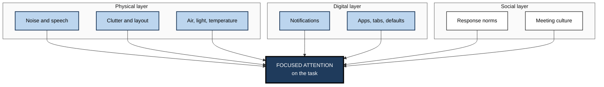
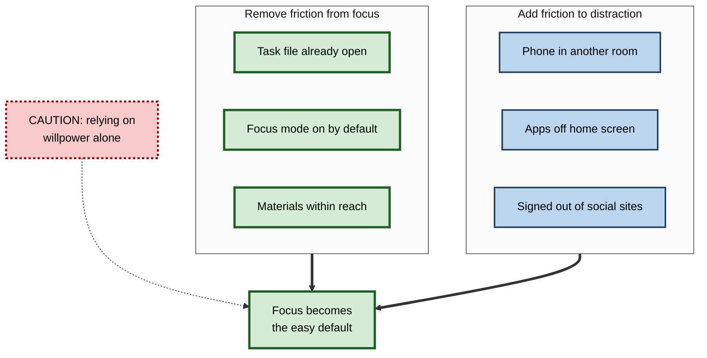

# D.10. Environmental Design for Attention

> **In one sentence:** Environmental design for attention means arranging your physical space, digital tools and social surroundings so that focusing is the easy default and distraction takes extra effort.
>
> **Why it matters:** Willpower is unreliable; environments act on you all day, every day. Small changes to space, screens and team norms often improve focus more than any amount of trying harder — and they scale from one person to an entire organisation.
>
> **Level span:** Novice → Expert · **Reading time:** ~18 min · **Builds on:** selective attention; distraction and interruptions

---

## The Learning Ladder

| Level | Badge | After this level you can... |
|---|---|---|
| 1 | NOVICE | Explain why environment beats willpower and make three quick changes to your workspace. |
| 2 | FOUNDATIONS | Name the three layers of attention environment (physical, digital, social) and the main levers in each. |
| 3 | PRACTITIONER | Run an environment audit and redesign a workspace and device set-up for focused work. |
| 4 | ADVANCED | Explain the evidence on noise, speech, clutter, air quality, lighting, open-plan offices and friction-based design. |
| 5 | EXPERT / PRO | Design workplaces, digital workplaces and learning environments that support attention at scale, and evaluate them. |

---

## Level 1 · Novice — The Big Picture

Imagine trying to diet with a bowl of sweets on your desk. You might resist for a while, but every glance costs a little effort, and eventually you give in. Now imagine the sweets are in a cupboard down the hall. Suddenly, not eating them takes no effort at all.

Attention works the same way. A phone on the desk, a chat window open, colleagues chatting next to you, a cluttered screen — each one is a bowl of sweets for your attention. **Environmental design** means moving the sweets down the hall: arranging your surroundings so that focusing is the easy path and distraction takes extra steps.

You have already experienced this when you got more done in a quiet library than at home, or when you finally finished a report on a flight with no Wi-Fi.

Three quick changes anyone can make today:

1. Put your phone in another room (or a bag across the room) during focused work.
2. Close every window and tab that is not part of the current task.
3. Find or create one place that is used only for focused work.

The key idea: **don't rely on resisting distractions — remove them, or make them harder to reach.**

---

## Level 2 · Foundations — Core Concepts

### Three layers of the attention environment

| Layer | What it includes | Main levers |
|---|---|---|
| **Physical** | Noise, speech, lighting, temperature, air, clutter, layout, devices within reach | Quiet zones, sound masking, visual clean-up, device placement, daylight and fresh air |
| **Digital** | Notifications, apps, tabs, home screens, defaults, tool layouts | Notification settings, focus modes, blockers, single-purpose set-ups, clean desktops |
| **Social** | Colleagues' expectations, meeting culture, response norms, visible status | Agreed focus times, response-time norms, status signals, meeting rules |

### Key principles

- **Remove rather than resist.** Every resisted distraction consumes control.
- **Friction.** Adding small steps (log-outs, phone in another room, apps off the home screen) sharply reduces impulsive use; removing friction makes desired behaviour more likely.
- **Defaults.** People tend to stick with default settings; make focus-friendly settings the default.
- **Cues and context.** Environments become linked with behaviours. A place used only for focused work becomes a cue for focus; a place used for everything cues everything.

**Figure D.10-1 — The three layers of the attention environment.**

*How to read it:* every box pushes on attention; good design makes each push support the task rather than compete with it.

### Key terms

| Term | Plain meaning |
|---|---|
| **Choice architecture** | Designing how options are presented so that good choices are easier. |
| **Friction** | Small effort or delay that makes a behaviour less likely. |
| **Default** | What happens if you do nothing. |
| **Context cue** | A feature of a place or situation that triggers a habit. |
| **Irrelevant sound effect** | Impairment of thinking tasks caused by background sound you are trying to ignore, especially speech. |
| **Sound masking** | Adding steady background sound to make nearby speech less intelligible. |
| **Activity-based working** | Office design with different zones for different kinds of work. |

---

## Level 3 · Practitioner — Putting It to Work

### The environment audit — five steps

1. **List your top three distractions** from a week of observation (or from an attention audit).
2. **Assign each to a layer:** physical, digital or social.
3. **Choose a lever for each:** remove it, add friction to it, change the default, or change the norm.
4. **Create a dedicated focus set-up:** a place, a device configuration and a time that are reserved for deep work.
5. **Test for two weeks,** then keep what worked and fix what didn't.

### Practical levers by layer

| Layer | Lever | Example |
|---|---|---|
| Physical | Remove | Phone in another room; second monitor turned off when not needed. |
| Physical | Shield | Noise-reducing headphones, quiet room booking, facing a wall rather than a walkway. |
| Physical | Tidy | Clear desk of unrelated papers and objects. |
| Physical | Air and light | Open a window or take breaks outside when rooms feel stuffy; work near daylight where possible. |
| Digital | Default | Focus mode scheduled automatically during deep-work blocks. |
| Digital | Friction | Social and news apps off the phone home screen; sign out after use; website blockers during focus hours. |
| Digital | Separation | Separate browser profile or desktop for focused work with only task tools. |
| Social | Signal | Status "focusing until 11:00"; calendar block visible to the team. |
| Social | Norm | Agreed response times; "headphones on = do not interrupt unless urgent". |

**Figure D.10-2 — Friction design: make focus easy and distraction effortful.**

*How to read it:* both groups feed the outcome along thick arrows; willpower alone (dotted) is the weakest route.

### Worked example — a remote analyst at a kitchen table

| | Before | After |
|---|---|---|
| **Physical** | Works at the kitchen table; household noise; phone beside laptop. | Small desk in a quieter corner facing a wall; phone charges in the hallway; headphones with steady background sound. |
| **Digital** | Email, chat and news open all day; notifications on. | Focus mode 9:00–11:30 automatically; separate browser profile with only analysis tools; chat batched. |
| **Social** | Household and colleagues assume she is always available. | Shared calendar shows focus blocks; family agreement about the closed-door signal. |
| **Result** | Feels constantly behind. | Reports far fewer self-interruptions; finishes weekly analysis a day earlier. |

### Common mistakes at this level

- **Buying gear instead of changing defaults.** Expensive headphones do less than turning off notifications.
- **One environment for everything.** Mixing leisure, email and deep work in the same set-up blurs the cues.
- **Ignoring speech.** Nearby intelligible conversation is one of the most disruptive sounds for reading and writing.
- **Unilateral rules.** Focus norms work only when the team agrees to them.

---

## Level 4 · Advanced — Mechanisms, Models & Evidence

### Noise and speech

The **irrelevant sound effect** (also called the irrelevant speech effect) is among the most robust findings in applied cognitive psychology: background sound — especially speech — impairs tasks that involve keeping things in order in memory, such as reading, writing and mental arithmetic, *even when people try to ignore it and do not report being bothered*. Research by Dylan Jones, William Macken and colleagues suggests that sounds with changing, segmented structure (like speech) interfere with the brain's ordering processes, while steady sounds interfere much less. **Intelligibility** is a key factor: the more understandable the speech, the more disruptive it is. This underpins office acoustic standards that aim to reduce speech intelligibility at a distance, often with sound masking.

Music is more mixed: instrumental music may be neutral or even helpful for some routine tasks and some people, but music with lyrics tends to harm reading and writing performance. The once-famous "Mozart effect" (that listening to Mozart makes you smarter) did not hold up to replication beyond a small, short-lived arousal effect.

### Open-plan offices

Open-plan offices were promoted to increase collaboration. A widely cited field study by Ethan Bernstein and Stephen Turban (2018) tracked employees moving into open-plan spaces and found that face-to-face interaction *decreased* sharply while electronic messaging increased — people withdrew to protect their attention. Reviews of office research consistently link open-plan layouts with more noise complaints, more perceived distraction and lower satisfaction for concentration work. **Activity-based working** — mixing quiet zones, collaboration areas and phone booths — is a common response, but its benefits depend on actually enforcing quiet zones and having enough of them.

### Visual clutter

Neuroscience studies of visual attention show that multiple items in view compete for neural representation (biased competition), and that clutter reduces the efficiency of processing any one item. Practical evidence on desk tidiness is thinner and more mixed, but reducing visual competitors on *screens* — extra windows, sidebars, badges — follows directly from well-established attention science.

### Air quality, temperature and light

- **Air quality:** controlled experiments, including a well-known study by Joseph Allen and colleagues (2016), found that office workers scored higher on decision-making tests in conditions with lower carbon dioxide and pollutant levels and higher ventilation. Effect sizes vary across studies and some findings at typical indoor levels are debated, but good ventilation is a low-risk, sensible improvement.
- **Temperature:** performance tends to decline when rooms are noticeably too warm or too cold; the comfortable range varies across people.
- **Light:** exposure to daylight and bright light during the day supports alertness and healthy sleep timing; poor lighting increases fatigue.

### Phones and device placement

Moving a phone out of sight and reach is widely recommended. As covered in research on digital interruptions, meta-analyses show the effect of mere presence is smaller than initially reported (mainly a small effect on working memory), but out-of-reach placement also removes friction-free checking, which is where much of the real cost comes from.

### Friction, defaults and context

Behavioural science consistently finds that small amounts of friction and well-chosen defaults change behaviour more than information or intention alone. Habit research (for example, by Wendy Wood and colleagues) shows that many behaviours are triggered by context cues; changing the context — a new place, a separate device profile — disrupts old habits and lets new ones form.

### Evidence summary

| Claim | Status |
|---|---|
| Intelligible background speech harms reading and writing | Very robust |
| Open-plan offices increase distraction and can reduce face-to-face talk | Well supported, with variation by design |
| Better ventilation supports cognitive performance | Supported; size at typical levels debated |
| Lyrics harm reading and writing | Generally supported |
| "Mozart effect" boosts intelligence | Not supported |
| Friction and defaults change behaviour | Well supported across domains |

---

## Level 5 · Expert / Pro — Professional Mastery

### Designing workplaces for attention

| Design area | Professional practice |
|---|---|
| **Acoustic zoning** | Separate quiet focus areas from collaboration areas; use sound masking and absorbent materials; provide enough enclosed booths for calls. |
| **Ratio planning** | Match the share of focus spaces to the share of focus work, not to tradition. |
| **Visible norms** | Signage and team agreements for quiet zones; booking systems that make focus rooms easy to get. |
| **Air and light** | Ventilation monitoring (CO2 sensors as a proxy), access to daylight. |
| **Remote and hybrid** | Stipends or guidance for home workspaces; "focus days" at home and "collaboration days" in the office. |

### Designing the digital workplace

Professionals responsible for collaboration platforms treat attention as a design constraint:

- **Organisation-wide defaults:** notification digests and quiet hours on by default; badges off for low-priority channels.
- **Channel architecture:** few, clearly named channels with explicit purposes and an "urgent" path.
- **AI features with an interruption budget:** AI summaries and agents should reduce, not add to, the number of pings; batch AI-generated updates into digests.
- **Measurement:** aggregate data on focus time, after-hours messaging and meeting load, with privacy protections.

### Designing learning environments

For training and study, the same principles apply: phone-free learning sessions, minimal on-screen clutter in e-learning, no autoplay distractions, and spaces where learners will not be interrupted. Instructional designers remove "seductive details" (interesting but irrelevant material) because they divert attention from the core content.

### Professional scenario

**Role:** Workplace experience manager for a 500-person office.
**Situation:** After a move to open-plan, surveys show concentration complaints have doubled and meeting-room bookings for solo work are rising.
**What the pro does:** Measures noise and speech levels, observes how space is used, and surveys the share of time spent on focus work. Converts part of the floor into an enclosed quiet zone with clear rules, adds phone booths and sound masking, and installs CO2 monitors. Pairs this with a team agreement on chat response times. Six months later, concentration complaints fall and solo use of meeting rooms declines; the manager reports results with the caveat that other changes occurred over the same period.

### Ethical limits

Environment design can drift into control — monitoring screens, restricting personal devices beyond what is necessary, or nudging people without their knowledge. Good practice is transparent, consultative and focused on giving people *more* control over their attention, not less.

---

## Myths vs. Evidence

| Myth | What the evidence shows |
|---|---|
| "I can tune out background conversation." | Intelligible speech impairs reading and writing even when ignored and even when people say they are not bothered. |
| "Open-plan offices boost collaboration." | Field evidence shows face-to-face interaction can fall as people protect their focus. |
| "Listening to Mozart makes you smarter." | The effect did not replicate beyond small, temporary arousal effects. |
| "Willpower is the main factor in focus." | Friction, defaults and context have large, reliable effects on behaviour. |
| "A messy desk is a sign of genius." | Evidence is mixed; what is clear is that visual competitors on screen reduce processing efficiency. |
| "Phone face-down is as good as phone away." | Out of sight and reach removes the easy checking habit, which face-down does not. |

## Practitioner Toolkit

**Environment checklist**

- [ ] Phone out of sight and reach during deep work.
- [ ] Focus mode scheduled automatically.
- [ ] Separate digital profile or desktop for focused work.
- [ ] No intelligible speech nearby, or masking in place.
- [ ] Room ventilated; daylight where possible.
- [ ] Distracting apps off the home screen; signed out of social sites.
- [ ] Focus status visible to colleagues; team norm agreed.

**Template — environment redesign plan**

| Distraction | Layer | Lever (remove, friction, default, norm) | Action | Review date |
|---|---|---|---|---|
| | | | | |

## Self-Check

1. **[NOVICE]** Why is removing a distraction better than resisting it?
2. **[NOVICE]** Name three quick changes that improve your focus environment.
3. **[FOUNDATIONS]** What are the three layers of the attention environment?
4. **[FOUNDATIONS]** What is friction, and how can you use it?
5. **[PRACTITIONER]** Describe the five steps of the environment audit.
6. **[ADVANCED]** What is the irrelevant sound effect, and why is speech especially disruptive?
7. **[ADVANCED]** What did field research find about open-plan offices and face-to-face interaction?
8. **[EXPERT / PRO]** How would you design a digital workplace's defaults to protect attention?
9. **[EXPERT / PRO]** What ethical limits apply to environmental design for attention?

### Answer Key

1. Resisting consumes limited control every time; removal eliminates the competition entirely.
2. Phone in another room, close unrelated tabs and windows, a dedicated focus place (also: focus mode, headphones).
3. Physical, digital, social.
4. Small effort or delay that makes a behaviour less likely; add it to distractions (sign out, move apps) and remove it from focus (files ready, defaults on).
5. List top distractions, assign layers, choose levers, create a dedicated focus set-up, test for two weeks and adjust.
6. Background sound impairs memory-dependent tasks even when ignored; changing, intelligible speech interferes with ordering processes most.
7. Face-to-face interaction fell sharply and electronic messaging rose after moves to open-plan.
8. Digests and quiet hours on by default, badges off for low-priority channels, clear channel purposes and urgent path, AI updates batched, aggregate measurement.
9. Be transparent and consultative; avoid surveillance and covert nudging; aim to increase people's control over their attention.

## Key Takeaways

- **Environment beats willpower**: remove distractions instead of resisting them.
- Work on **three layers**: physical, digital and social.
- **Intelligible speech** is among the most disruptive sounds for thinking work.
- **Friction and defaults** are powerful, cheap tools.
- Open-plan offices need **real quiet zones** to support concentration.
- At scale, design **acoustics, digital defaults and norms** together — transparently.

## Glossary

| Term | Meaning |
|---|---|
| Activity-based working | Office design with zones for different work modes. |
| Choice architecture | Design of how choices are presented. |
| Context cue | Feature of an environment that triggers a habit. |
| Default | What happens if no action is taken. |
| Friction | Small effort or delay that discourages a behaviour. |
| Irrelevant sound effect | Impairment from ignored background sound, especially speech. |
| Seductive details | Interesting but irrelevant material that diverts learners' attention. |
| Sound masking | Steady background sound that reduces speech intelligibility. |
| Speech intelligibility | How understandable speech is at a given distance. |
