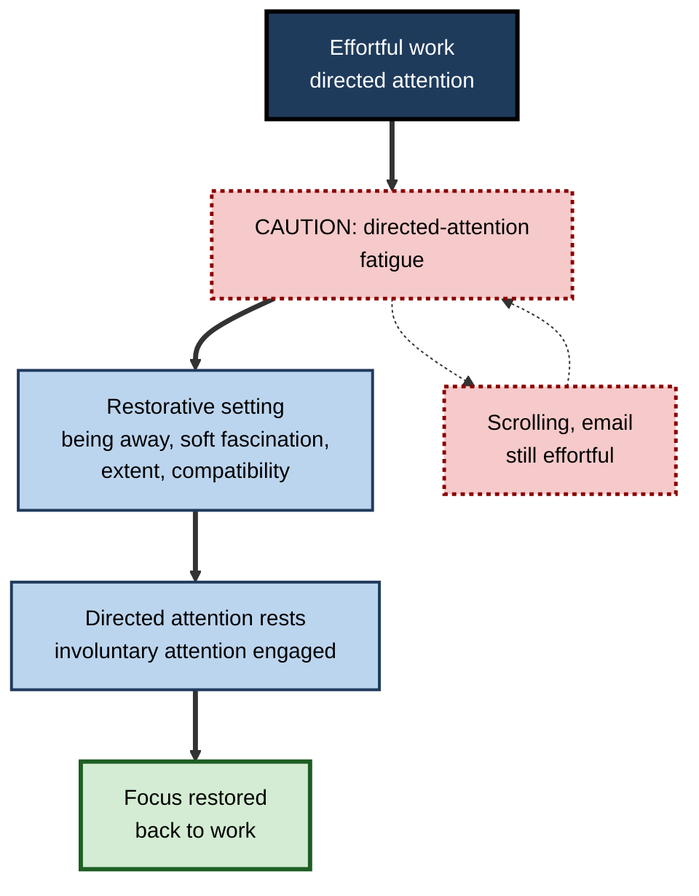
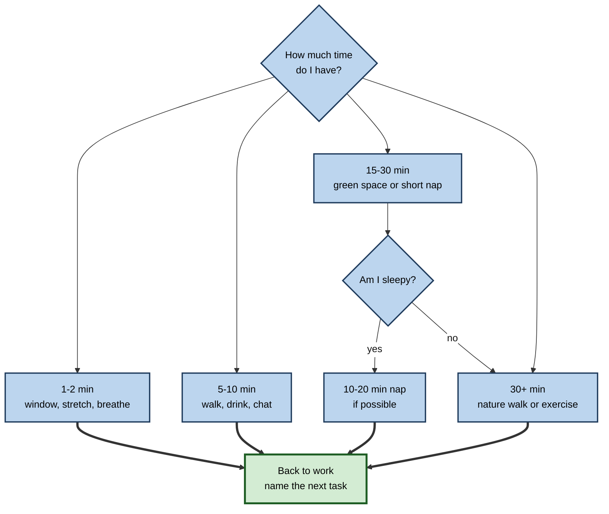

# D.11. Attention Restoration Techniques

> **In one sentence:** Attention restoration techniques are ways of recovering your ability to focus after it has been worn down — mainly by resting the kind of effortful attention that work demands, through breaks, nature, movement, sleep and genuine detachment.
>
> **Why it matters:** Focus is not a fixed daily allowance you burn through; it fluctuates and can be partly restored. Professionals who recover well sustain better quality across the day and the week, and organisations that build recovery into work see fewer errors and less burnout.
>
> **Level span:** Novice → Expert · **Reading time:** ~18 min · **Builds on:** sustained attention and vigilance; environmental design for attention

---

## The Learning Ladder

| Level | Badge | After this level you can... |
|---|---|---|
| 1 | NOVICE | Explain why focus gets tired and name breaks that actually restore it. |
| 2 | FOUNDATIONS | Describe attention restoration theory, directed-attention fatigue and the four qualities of restorative environments. |
| 3 | PRACTITIONER | Choose a restoration technique to fit the time available and build a daily recovery rhythm. |
| 4 | ADVANCED | Summarise the evidence on nature exposure, micro-breaks, exercise, naps and detachment, including what failed to replicate. |
| 5 | EXPERT / PRO | Design recovery into team schedules, shifts, learning programmes and workplaces, and evaluate the effect. |

---

## Level 1 · Novice — The Big Picture

After a long morning of spreadsheets, your attention feels "used up": you reread sentences, make small mistakes and drift toward your phone. Then you go for a twenty-minute walk in a park, and when you return, the work seems clearer. Something was restored.

**Attention restoration** means recovering the capacity to focus. The type of attention that tires most is **directed attention** — the effortful, deliberate kind you use to concentrate on something not naturally gripping while ignoring everything else.

An analogy: a muscle used for holding something steady. Holding still for a long time tires it; switching to a different, easy movement lets it recover. A good break does not mean "do nothing"; it means **stop using the tired kind of attention** and do something that engages you effortlessly.

You have already experienced this when a walk, a shower or a chat with a friend helped you see a problem freshly, and when scrolling your phone during a break left you feeling *more* tired, not less.

The key idea: **the best breaks rest the effortful kind of attention. Scrolling usually doesn't; walking, nature, movement and real detachment usually do.**

---

## Level 2 · Foundations — Core Concepts

### Attention restoration theory

Rachel and Stephen Kaplan developed **attention restoration theory (ART)** in the late 1980s and 1990s. It proposes:

1. Directed attention requires effort to inhibit distractions, and that capacity **fatigues** with prolonged use (**directed-attention fatigue**).
2. Some environments — especially natural ones — engage **involuntary attention** gently, through **soft fascination** (clouds, leaves moving, water), letting directed attention rest and recover.

The Kaplans identified four qualities of a **restorative environment**:

| Quality | Meaning | Example |
|---|---|---|
| **Being away** | Psychological distance from everyday demands. | A park, a different room, a walk without your phone. |
| **Soft fascination** | Gently interesting, without demanding effort. | Trees, water, sky, a garden. |
| **Extent** | Feels like a coherent "whole world" you can explore. | A trail, a large garden, a landscape. |
| **Compatibility** | Fits what you want to do right now. | Somewhere you actually like being. |

### A second account: stress reduction

Roger Ulrich's **stress reduction theory** offers a complementary view: natural settings reduce physiological stress quickly, which supports recovery of attention and mood. Ulrich's 1984 hospital study found that surgical patients with a window view of trees had shorter post-operative stays than those facing a brick wall — an influential, though single, study.

**Figure D.11-1 — How restoration works according to ART.**

*How to read it:* the thick path is genuine restoration; the dotted loop shows how demanding "breaks" keep the fatigue going.

### Key terms

| Term | Plain meaning |
|---|---|
| **Directed attention** | Effortful, deliberate attention that requires suppressing distractions. |
| **Involuntary attention** | Attention drawn effortlessly by interesting stimuli. |
| **Directed-attention fatigue** | Reduced capacity for directed attention after prolonged use. |
| **Soft fascination** | Gentle, effortless interest, as in watching water or leaves. |
| **Restorative environment** | A setting that supports recovery of attention. |
| **Micro-break** | A short break, typically up to about ten minutes, within the workday. |
| **Psychological detachment** | Mentally switching off from work during non-work time. |

---

## Level 3 · Practitioner — Putting It to Work

### Choosing a technique by the time you have

| Time available | Technique | Why it helps |
|---|---|---|
| **1–2 minutes** | Look out of a window at distant trees or sky; stand, stretch, breathe slowly. | Brief soft fascination and physical change; resets posture and arousal. |
| **5–10 minutes** | Walk, ideally outdoors; get a drink away from the screen; chat about something non-work. | Movement and being away; social connection. |
| **15–30 minutes** | Walk in a park or green space; short nap of 10–20 minutes when drowsy. | Nature exposure; sleep pressure relief without heavy grogginess. |
| **30+ minutes** | Longer nature walk, exercise, a hobby that absorbs you. | Stronger and more consistent cognitive benefits reported for longer nature exposure. |
| **Evening and weekend** | Real detachment: no work email; activities that relax or give a sense of mastery; enough sleep. | Daily and weekly recovery; sleep is the foundation of next-day attention. |

### A daily recovery rhythm — five steps

1. **Plan breaks between focus blocks,** not only when exhausted. Recovery works better before deep depletion.
2. **Leave the screen.** Make at least one break per half-day screen-free and, where possible, outdoors.
3. **Choose effortless engagement** — something gently interesting rather than demanding or highly stimulating.
4. **Protect lunch as a real break** at least a few days a week.
5. **Close the day deliberately** with a shutdown note so your mind can detach in the evening.

**Figure D.11-2 — Picking a restoration technique.**

*How to read it:* start with the time available; every route ends by naming the next task before resuming.

### Worked example — a financial analyst during quarter-end

| | Before | After |
|---|---|---|
| **Pattern** | Eats lunch at the desk scrolling news; works through afternoon slump with extra coffee. | Short walk outside at lunch most days; 5-minute screen-free break every 60–90 minutes. |
| **Evening** | Checks work email until bedtime. | Shutdown note at 18:30; no work email after that except on-call nights. |
| **Effect** | Late-afternoon reconciliation errors common; sleep poor during quarter-end. | Fewer late-day errors caught in review; reports feeling less "fried" by Thursday. |

### Common mistakes at this level

- **Phone breaks.** Social media and news keep attention busy and emotionally engaged; several studies suggest phone-based breaks are less restorative than other breaks.
- **Waiting until exhausted.** Recovery is easier and faster when breaks come before deep fatigue.
- **Skipping lunch to "save time".** It typically costs more in afternoon quality than it saves.
- **Over-caffeinating instead of resting.** Caffeine raises alertness but does not replace sleep or reduce the build-up of errors from fatigue.

---

## Level 4 · Advanced — Mechanisms, Models & Evidence

### Nature exposure: what the evidence shows

ART inspired many experiments. A classic study by Marc Berman, John Jonides and Stephen Kaplan (2008) found that a walk in an arboretum improved performance on a backward digit-span task more than a walk in a busy urban area. Since then the evidence has grown and become more nuanced:

- A **2025 systematic review and meta-analysis** in the Journal of Environmental Psychology, covering 80 studies and 273 outcomes, found **small-to-moderate benefits** of natural over built settings for working memory, cognitive flexibility and attentional control, with **more consistent benefits for exposures of 30 minutes or longer**.
- A **conceptual replication plus meta-analysis** (14 studies, about 600 participants) found that **simulated nature** — photos or videos — did **not reliably restore executive attention** as measured by the Attention Network Test. Pictures of nature are not a reliable substitute for being in it, at least for that component.
- Reviews of ART have criticised the theory for vagueness about which attention processes are restored and for inconsistent measures. Newer studies use EEG markers; one found an enhanced error-related brain response (a marker of performance monitoring) after a 40-minute nature walk but not after an urban walk.
- **Virtual-reality nature** is being tested, with a 2025 meta-analysis in higher-education students suggesting benefits for mental health and well-being; effects on attention specifically remain less clear.

Summary: **real nature exposure has small-to-moderate, reasonably consistent benefits; longer exposure helps; simulated nature is weaker and less consistent.**

### Micro-breaks

A 2022 meta-analysis of micro-breaks (breaks of up to about ten minutes) by Patricia Albulescu and colleagues found that they reliably **increased vigour and reduced fatigue**. Effects on **performance** were smaller and depended on the task: clearer for routine or clerical tasks, less so for demanding cognitive tasks, and longer breaks tended to help performance more. Micro-breaks are a reliable tool for well-being and sustaining energy; they are not a guaranteed performance booster.

### Movement and exercise

Meta-analyses of **acute exercise** report small positive effects on cognitive performance shortly after moderate exercise, including executive functions. Even short walks help mood and alertness. Very intense exercise can temporarily impair performance before recovery.

### Sleep and naps

Sleep is the strongest restorer of attention. Sleep loss sharply increases attentional lapses, and people underestimate their impairment. **Short naps** (roughly 10–20 minutes) can improve alertness with little grogginess; longer naps can bring deeper sleep and a period of **sleep inertia** on waking. In safety-critical industries, planned naps during long shifts are an established fatigue countermeasure.

### Psychological detachment and recovery experiences

Work psychologist Sabine Sonnentag and colleagues identified four **recovery experiences** associated with better next-day energy and well-being: **psychological detachment** (not thinking about work), **relaxation**, **mastery** (learning or challenge outside work) and **control** (choosing how to spend your time). Detachment is the most consistently linked to well-being; constant connectivity undermines it.

### What about "ego depletion"?

ART's "fatigue" is sometimes conflated with ego depletion — the idea that self-control draws on a limited, depletable resource. Large preregistered multi-lab replications largely failed to reproduce classic ego-depletion effects. This does not refute ART, but it suggests caution about simple "fuel tank" metaphors. Restoration may work partly through mood, motivation, arousal and stress reduction, not only through refilling a resource.

### Strength of evidence

| Technique | Evidence |
|---|---|
| Sleep and naps | Very strong for alertness and lapses |
| Real nature exposure | Small-to-moderate, fairly consistent; longer is better |
| Simulated nature images | Weak and inconsistent for executive attention |
| Micro-breaks | Reliable for vigour and fatigue; performance effects modest and task-dependent |
| Acute moderate exercise | Small positive cognitive effects |
| Psychological detachment | Consistently linked to well-being and next-day energy (mostly correlational) |

---

## Level 5 · Expert / Pro — Professional Mastery

### Designing recovery into work

| Level | Practice |
|---|---|
| **Schedule** | Default meetings of 25 and 50 minutes to create buffers; no back-to-back blocks of more than two hours. |
| **Shift work** | Planned rest breaks, rotation for monitoring roles, fatigue risk management, nap facilities where safety-critical. |
| **Workplace** | Access to green space or nature views; outdoor walking routes; quiet rest areas. |
| **Culture** | Leaders take visible breaks and lunch; after-hours messaging norms that protect detachment. |
| **Learning programmes** | Spaced sessions with breaks rather than full-day marathons; outdoor or movement-based breaks between sessions. |

### Measuring recovery

Professionals track error rates by time of day, after-hours message volume, meeting density, survey items on fatigue and detachment, and absence and turnover. A recovery initiative that increases break-taking but leaves after-hours email unchanged is unlikely to move well-being.

### AI-era implications

AI tools can either free time for recovery or fill it with more output to review. They can also erode detachment if they make work available everywhere (summaries on phones, agent notifications at night). Pro practice: configure AI digests to arrive within working hours and treat "AI frees time" as an opportunity to protect breaks, not just to add tasks.

### Professional scenario

**Role:** Operations manager in a hospital pharmacy.
**Situation:** Medication-checking errors cluster late in long shifts; staff skip breaks during busy periods.
**What the pro does:** Introduces protected 10-minute breaks every two hours with cover from a float pharmacist, a rule that breaks are taken away from the workstation (an outdoor courtyard is available), and rotation between checking and less demanding tasks. Reviews error data by hour of shift over three months; late-shift errors fall, and the change is maintained as standard practice with continued monitoring.

### Ethical limits

Restoration should not become another performance demand ("optimise your recovery") or a substitute for reasonable workloads. If people need constant recovery techniques to cope, the workload or design is the problem.

---

## Myths vs. Evidence

| Myth | What the evidence shows |
|---|---|
| "Any break restores focus." | Breaks that keep attention effortfully engaged — email, scrolling — restore less than walks, nature or genuine rest. |
| "Looking at a nature picture works as well as a walk outside." | Simulated nature does not reliably restore executive attention; real exposure, especially 30+ minutes, is more consistent. |
| "Micro-breaks always boost performance." | They reliably boost energy and reduce fatigue; performance effects are modest and task-dependent. |
| "Caffeine can replace sleep." | Caffeine raises alertness temporarily but cannot remove the attention costs of sleep loss. |
| "Willpower is a fuel tank you refill with sugar or rest." | Multi-lab replications largely failed to support classic ego depletion; mood, motivation and stress matter too. |
| "Answering a few emails in the evening is harmless." | Lack of psychological detachment is consistently linked with poorer recovery. |

## Practitioner Toolkit

**Daily recovery checklist**

- [ ] Break planned between every focus block.
- [ ] At least one screen-free break per half-day, outdoors if possible.
- [ ] Real lunch break at least three days this week.
- [ ] A 30+ minute nature walk or exercise at least twice this week.
- [ ] Shutdown note written; work notifications off in the evening.
- [ ] Enough sleep — protected like a meeting.

**Template — break menu (keep it visible)**

| Time I have | My go-to restorative option |
|---|---|
| 2 minutes | |
| 10 minutes | |
| 30 minutes | |
| Evening | |

## Self-Check

1. **[NOVICE]** Why does scrolling your phone often fail to restore focus?
2. **[NOVICE]** Name two breaks that genuinely help.
3. **[FOUNDATIONS]** What is directed-attention fatigue?
4. **[FOUNDATIONS]** Name the four qualities of a restorative environment.
5. **[PRACTITIONER]** What would you do with a 10-minute break between two focus blocks?
6. **[ADVANCED]** What did the 2025 meta-analysis find about nature exposure and duration?
7. **[ADVANCED]** What does the evidence say about simulated nature?
8. **[ADVANCED]** What are the effects of micro-breaks on well-being versus performance?
9. **[EXPERT / PRO]** Name three ways an organisation can build recovery into work.
10. **[EXPERT / PRO]** How can AI tools undermine recovery, and how would you prevent it?

### Answer Key

1. It keeps directed attention and emotional engagement busy, so the tired system does not rest.
2. A walk outdoors, looking at nature, stretching, a short nap, a non-work chat.
3. Reduced capacity for effortful, distraction-suppressing attention after prolonged use.
4. Being away, soft fascination, extent, compatibility.
5. Leave the screen, walk (ideally outdoors), get a drink, then name the next task before resuming.
6. Small-to-moderate benefits for working memory, cognitive flexibility and attentional control, more consistent for exposures of 30 minutes or longer.
7. It does not reliably restore executive attention as measured by the Attention Network Test.
8. They reliably increase vigour and reduce fatigue; performance gains are modest and depend on task type and break length.
9. Default shorter meetings with buffers, protected breaks with cover, access to green space, after-hours messaging norms, rotation in monitoring roles.
10. By making work reachable everywhere and filling freed time with more output; prevent by scheduling AI digests in working hours and protecting freed time for breaks.

## Key Takeaways

- **Directed attention tires**; good breaks rest it by engaging attention effortlessly.
- **Real nature exposure** has small-to-moderate benefits; **30+ minutes** is more reliable; pictures are weaker.
- **Micro-breaks** reliably restore energy; performance effects are modest.
- **Sleep** is the strongest restorer; short naps help when drowsy.
- **Psychological detachment** in the evening supports next-day focus.
- Organisations should **build recovery into schedules and culture**, not leave it to individuals.

## Glossary

| Term | Meaning |
|---|---|
| Attention restoration theory | Kaplans' theory that restorative environments let directed attention recover. |
| Directed attention | Effortful, distraction-suppressing attention. |
| Directed-attention fatigue | Depleted capacity for directed attention. |
| Involuntary attention | Effortless attention drawn by interesting stimuli. |
| Micro-break | Short break of up to about ten minutes. |
| Psychological detachment | Mentally switching off from work. |
| Recovery experiences | Detachment, relaxation, mastery and control during non-work time. |
| Restorative environment | Setting that supports recovery of attention. |
| Sleep inertia | Grogginess after waking, especially from deep sleep. |
| Soft fascination | Gentle, effortless interest. |
| Stress reduction theory | Ulrich's theory that nature reduces stress quickly. |
