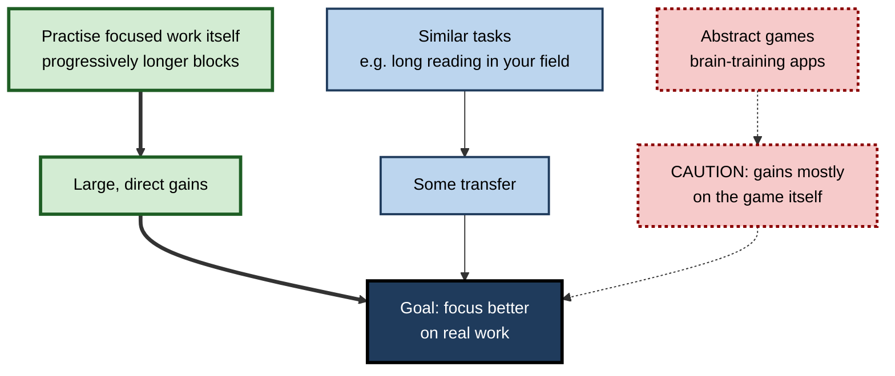
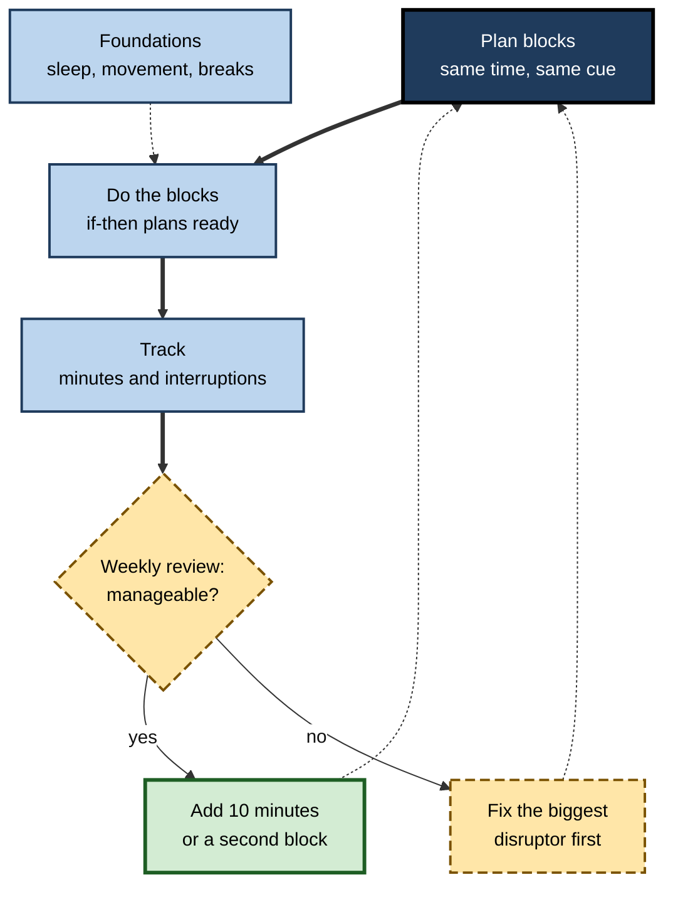

# D.12. Training Sustained Focus Over Time

> **In one sentence:** Training sustained focus means gradually building your ability to concentrate for longer and more reliably — mostly through better habits, environments, health and domain expertise, rather than through "brain-training" games.
>
> **Why it matters:** Sustained focus is a career-long asset that compounds: it speeds learning, raises work quality and makes deep work possible. Knowing which training approaches actually work — and which are marketing — saves years of wasted effort and money.
>
> **Level span:** Novice → Expert · **Reading time:** ~19 min · **Builds on:** all earlier notes in this subtopic, especially sustained attention, deep work and mindfulness

---

## The Learning Ladder

| Level | Badge | After this level you can... |
|---|---|---|
| 1 | NOVICE | Explain that focus can improve over time and name the approaches that work best. |
| 2 | FOUNDATIONS | Distinguish near and far transfer and the main training routes: habits, environment, health, practice, expertise. |
| 3 | PRACTITIONER | Run a 12-week focus-building plan with progressive blocks, tracking and adjustment. |
| 4 | ADVANCED | Evaluate evidence on brain training, video games, mindfulness, exercise, habit formation, expertise and stimulants. |
| 5 | EXPERT / PRO | Design focus-building programmes for teams and learners, measure them credibly, and adapt them for the AI era. |

---

## Level 1 · Novice — The Big Picture

Many people say "I just can't focus anymore." The good news: the ability to sustain focus is not fixed. People who could barely read for ten minutes can, over months, work for ninety minutes on a hard problem. The less exciting news: the most reliable improvements come from ordinary things done consistently — sleep, fewer interruptions, gradually longer focus sessions, and getting better at the work itself — not from apps that promise to "train your brain".

An analogy: building endurance for running. You do not become a marathon runner by playing a running video game. You run a little more each week, sleep well, eat sensibly and remove obstacles. Focus is similar: you build it by doing focused work, gradually more, in conditions that support it.

You have already experienced this when a subject you once found impossible to concentrate on became easier as you understood it better — your attention improved because your expertise did.

The key idea: **focus grows through practice in the real task, supported by habits, environment and health. Shortcuts mostly disappoint.**

---

## Level 2 · Foundations — Core Concepts

### Near and far transfer

The central question for any attention-training method is **transfer**: does getting better at the training improve anything else?

- **Near transfer** — improvement on tasks very similar to the training task.
- **Far transfer** — improvement on different tasks or real-life performance (for example, focusing at work).

Most training improves the trained task. Far transfer is rare and hard to achieve. This is why **training in the real activity** — focused work itself — tends to beat abstract exercises.

### Five routes to stronger sustained focus

| Route | What it involves | Strength of evidence for real-world focus |
|---|---|---|
| **Foundations** | Sleep, physical activity, managing stress | Strong for sleep; moderate for exercise |
| **Environment** | Reducing interruptions, friction, defaults | Strong (indirectly, through fewer interruptions) |
| **Habits and practice** | Regular, progressively longer focus blocks; implementation intentions | Moderate; well-supported mechanisms, few direct trials |
| **Attention practices** | Mindfulness, some forms of meditation | Small, component-specific effects |
| **Domain expertise** | Knowing the material deeply | Strong — experts attend more efficiently within their domain |

**Figure D.12-1 — Transfer distance: why real-task practice wins.**

*How to read it:* the thick path (practising the real activity) delivers most; the dotted path (abstract games) barely reaches the goal.

### Key terms

| Term | Plain meaning |
|---|---|
| **Transfer** | Improvement on something other than what was trained. |
| **Near transfer** | Improvement on closely similar tasks. |
| **Far transfer** | Improvement on dissimilar tasks or real life. |
| **Progressive overload** | Gradually increasing demand as capacity grows (borrowed from physical training). |
| **Implementation intention** | An if–then plan: "When X happens, I will do Y." |
| **Habit** | A behaviour triggered automatically by a context cue after repetition. |
| **Brain training** | Commercial or research programmes of cognitive exercises intended to improve general abilities. |

---

## Level 3 · Practitioner — Putting It to Work

### The 12-week focus-building plan

| Weeks | Focus block length | Main emphasis |
|---|---|---|
| 1–2 | Find your baseline (e.g., 20–30 minutes) | Environment set-up; daily block at the same time; log interruptions |
| 3–4 | Baseline + 10 minutes | Implementation intentions for common distractions; shutdown notes |
| 5–6 | Baseline + 20 minutes | Add a second daily block on some days; short mindfulness practice before blocks |
| 7–8 | 60–75 minutes | Increase task challenge to stay engaged; real breaks between blocks |
| 9–10 | 75–90 minutes | Two deep blocks most days; review sleep and exercise |
| 11–12 | Consolidate | Keep what works; set a sustainable weekly target |

The block lengths are a practical heuristic, not research-derived numbers. The principle — **start where you are and increase gradually** — is the important part. Adjust upward only when your current length feels consistently manageable.

### Steps inside each week

1. **Schedule** the blocks at the same time each day, attached to an existing routine (a context cue).
2. **Write implementation intentions** for your top distractions: "If I feel the urge to check chat, I will write it on my urge list and continue."
3. **Track** three numbers per block: planned minutes, actual focused minutes, number of self-interruptions.
4. **Review weekly:** what broke focus most? Fix one thing.
5. **Protect the foundations:** sleep window, movement, at least one restorative break per day.

**Figure D.12-2 — The weekly focus-training loop.**

*How to read it:* the thick path is one week; dotted arrows show how the review feeds next week's plan, with foundations supporting every block.

### Worked example — a junior lawyer building research stamina

| | Week 1 | Week 12 |
|---|---|---|
| **Block length** | 25 minutes before first self-interruption, on average. | Two 80-minute blocks most days. |
| **Environment** | Email open; phone on desk. | Focus mode 9:00–12:00; phone in locker. |
| **Habits** | No plan; starts whenever. | Starts at 9:00 after coffee; if-then plan for email urges. |
| **Expertise** | New to the practice area; much effort spent on unfamiliar terms. | Knows the core statutes and cases; reads faster and spots relevant points sooner. |
| **Result** | Research memos take two days. | Memos take a day; partner notes better issue spotting. |

Note that part of the improvement is **expertise**: as the domain becomes familiar, the same text requires less effort to attend to.

### Common mistakes at this level

- **Jumping to three-hour blocks.** Overreaching leads to failure and abandonment.
- **Buying an app instead of doing the work.** Brain-training scores rise; work focus often does not.
- **Ignoring sleep.** No training plan offsets chronic sleep restriction.
- **Tracking nothing.** Without data, you cannot see slow progress — and slow progress is normal.
- **Training on easy material only.** Focus needs to be built on the kind of work you actually do.

---

## Level 4 · Advanced — Mechanisms, Models & Evidence

### Brain training and far transfer

Commercial brain-training programmes claimed broad cognitive benefits. A major 2016 review led by Daniel Simons examined the evidence cited by brain-training companies and concluded that training reliably improves performance on the trained tasks, sometimes on closely related tasks, but there is little convincing evidence of improvement in everyday cognitive performance. Meta-analyses of working-memory training by Giovanni Sala, Fernand Gobet and others similarly found near transfer but negligible far transfer once study quality and placebo effects are controlled. In 2016, the US Federal Trade Commission settled with a major brain-training company over unsupported advertising claims.

### Action video games

A notable exception to the poor-transfer pattern: meta-analyses (for example, Benoit Bediou, Daphne Bavelier and colleagues, 2018) report that action video game players perform better on perceptual and top-down attention tasks, and that some intervention studies show gains from action-game training. Debate continues about the size of causal training effects, publication bias and expectation effects, and about transfer to workplace focus. These games train fast visual attention, not necessarily sustained focus on slow, demanding work.

### Mindfulness

As covered in the mindfulness note, meta-analyses show small, component-specific effects on attention (for example, orienting and executive control), strongest against passive controls. Mindfulness is a reasonable *supporting* practice in a focus-training plan rather than the main engine.

### Exercise and fitness

Single bouts of moderate exercise produce small, short-term cognitive benefits. Evidence that long-term aerobic training improves cognition in healthy young and middle-aged adults is mixed; benefits appear more consistently in older adults and for general health, which indirectly supports attention through sleep and mood.

### Habit formation and implementation intentions

- In a study of everyday habit formation, Phillippa Lally and colleagues (2010) found that the time for a new behaviour to become automatic varied widely, with a median of around two months and a range from a few weeks to most of a year. Expect a focus routine to take months, not days, to feel automatic.
- **Implementation intentions** ("if–then" plans), studied extensively by Peter Gollwitzer and Paschal Sheeran, have a meta-analytic effect of medium size on goal attainment and are specifically useful for shielding goals from distractions.

### Expertise changes attention

Eye-tracking research comparing experts and novices (in medicine, aviation, sport, chess) shows that experts direct attention faster to task-relevant information and spend less on irrelevant areas. Knowledge organises attention: experts know what matters, so they need less effortful searching. This is a strong argument for treating focus training and skill training as one project.

### Stimulants, supplements and neurotechnology

- **Prescription stimulants** are effective treatments for diagnosed ADHD under medical supervision. In healthy adults, evidence for meaningful cognitive enhancement is weak and inconsistent, with risks including misuse, sleep disruption and overconfidence.
- **Supplements** marketed for focus generally lack strong evidence beyond the effects of caffeine.
- **Neurofeedback and brain stimulation** (for example tDCS) show some laboratory effects, including on vigilance under high demand in some studies, but results are inconsistent and not established as practical training tools.

### Cognitive offloading and the AI era

Generative AI raises a new question: if tools read, summarise and draft for us, do we lose the practice that builds sustained focus? Field evidence on learning (for example, a 2025 study in which students using an unrestricted AI tutor performed worse when it was removed) and survey research on knowledge workers suggest that heavy reliance can reduce independent effort. Some 2025 EEG studies reported lower engagement during AI-assisted essay writing, but these were small, early and partly unpublished, so conclusions are premature. The prudent position: **keep regular practice of unaided, sustained engagement** with demanding material, and use AI after a first unaided attempt.

### Evidence summary

| Approach | Real-world focus benefit |
|---|---|
| Sleep, reduced interruptions | Strong |
| Practice in the real task + expertise | Strong (mechanisms well supported) |
| Implementation intentions, habits | Moderate |
| Mindfulness | Small, component-specific |
| Exercise | Small acute; mixed long-term in younger adults |
| Action video games | Gains on fast visual attention; workplace transfer unclear |
| Brain-training apps | Little far transfer |
| Stimulants in healthy adults | Weak evidence, real risks |

---

## Level 5 · Expert / Pro — Professional Mastery

### Designing focus-building programmes for teams

| Component | Design |
|---|---|
| **Environment first** | Before training individuals, cut team interruption load: focus time, response norms, meeting hygiene. |
| **Cohort practice** | Shared focus sessions (in person or virtual "co-working" with cameras optional) with a start and end ritual. |
| **Progression** | Individuals set baseline and grow block length gradually; no fixed targets imposed. |
| **Skill integration** | Pair focus building with deliberate practice in the core skill, so expertise grows alongside attention. |
| **Foundations** | Education on sleep and recovery; policies that protect evenings. |
| **Measurement** | Team-level focus blocks, self-reported focus, cycle time and quality; individual data kept private. |

### Coaching individuals

Effective coaches treat focus problems diagnostically: Is the issue the environment (interruptions), the task (unclear goals, wrong challenge level), the person's state (sleep, stress, health), skill (lack of expertise), or a possible clinical condition (ADHD, depression, anxiety)? Each needs a different response, and suspected clinical conditions warrant referral, not productivity tips.

### Learning and development implications

L&D teams should avoid buying brain-training products for employees based on far-transfer claims. Better investments: designing training that demands and builds sustained engagement (case work, projects, spaced practice), reducing interruptions during learning time, and teaching employees how to structure focus routines.

### AI-era professional stance

- **Preserve the muscle:** schedule regular unaided deep reading, writing or problem solving.
- **Use AI to remove friction, not engagement:** let it fetch, format and check; do the core thinking.
- **Train review vigilance:** reviewing AI output is a sustained-attention task; build it into practice with feedback on missed errors.

### Professional scenario

**Role:** Head of learning at a professional services firm.
**Situation:** Leadership wants to license a brain-training app for all 3,000 staff to "improve focus".
**What the pro does:** Presents the evidence on far transfer. Proposes instead a 12-week voluntary focus programme: cohort focus sessions, a guide to progressive blocks and implementation intentions, a team-level interruption audit with managers, and integration with technical skills curricula. Pilots it with four teams against comparison teams, measuring focus blocks, self-reported focus and quality indicators. Shares results, including where effects were small.

---

## Myths vs. Evidence

| Myth | What the evidence shows |
|---|---|
| "Brain-training games make you focus better at work." | Training improves the trained tasks; far transfer to everyday performance is weak. |
| "Some people are just born unable to focus, and that's that." | Focus varies but improves with habits, environment, health and expertise; clinical conditions are treatable. |
| "It takes 21 days to form a habit." | Habit formation time varies widely; a median of around two months was found in one study. |
| "Smart drugs give healthy people super-focus." | Evidence for meaningful enhancement in healthy adults is weak; risks are real. |
| "You can go from 20 to 120 minutes of focus in a week." | Gradual progression is more sustainable; overreaching leads to abandonment. |
| "AI makes focus skills obsolete." | Reviewing and directing AI demands sustained attention; reliance can erode practice. |

## Practitioner Toolkit

**Focus-training checklist**

- [ ] Baseline block length measured.
- [ ] Daily block scheduled at a consistent time and cue.
- [ ] If–then plans written for top three distractions.
- [ ] Minutes and self-interruptions tracked per block.
- [ ] Weekly review done; one fix chosen.
- [ ] Sleep and movement protected.
- [ ] Skill practice integrated with focus blocks.
- [ ] Unaided deep work maintained alongside AI use.

**Template — weekly focus log**

| Day | Planned minutes | Focused minutes | Self-interruptions | Main disruptor | Sleep (hours) |
|---|---|---|---|---|---|
| Mon | | | | | |
| Tue | | | | | |
| Wed | | | | | |
| Thu | | | | | |
| Fri | | | | | |

## Self-Check

1. **[NOVICE]** Can sustained focus improve over time? What helps most?
2. **[NOVICE]** Why is a brain-training game unlikely to fix work focus?
3. **[FOUNDATIONS]** Define near and far transfer.
4. **[FOUNDATIONS]** Name the five routes to stronger sustained focus.
5. **[PRACTITIONER]** How should focus block length change over a 12-week plan, and when should you increase it?
6. **[PRACTITIONER]** Write an implementation intention for a common distraction.
7. **[ADVANCED]** What did major reviews conclude about brain-training far transfer?
8. **[ADVANCED]** How does expertise change attention?
9. **[EXPERT / PRO]** What would you recommend instead of licensing a brain-training app for staff?
10. **[EXPERT / PRO]** How should professionals protect their focus skills while using AI heavily?

### Answer Key

1. Yes. Sleep, reduced interruptions, gradually longer practice in real tasks, habits and growing expertise help most.
2. It mainly improves performance on the game itself; far transfer to everyday tasks is weak.
3. Near transfer: improvement on closely similar tasks. Far transfer: improvement on dissimilar tasks or real-life performance.
4. Foundations (sleep, exercise, stress), environment, habits and practice, attention practices, domain expertise.
5. Start at baseline and increase gradually (for example, by about 10 minutes) only when the current length feels consistently manageable.
6. "If I feel the urge to open email during a focus block, I will write it on my urge list and return to the paragraph."
7. Training improves the trained tasks and sometimes close variants, but there is little convincing evidence of far transfer to everyday cognition.
8. Experts direct attention faster to relevant information and waste less on irrelevant areas, because knowledge tells them what matters.
9. A focus programme combining interruption reduction, cohort focus sessions, progressive blocks, implementation intentions, skill integration and credible measurement.
10. Keep regular unaided deep work, use AI after a first unaided attempt, use it to remove friction rather than engagement, and practise vigilant review.

## Key Takeaways

- Sustained focus **can be built**, mainly through **real-task practice, habits, environment, health and expertise**.
- **Far transfer** from abstract brain training is weak; train on the work itself.
- Use **progressive blocks**, **if–then plans** and **simple tracking**; expect months, not days.
- **Expertise organises attention**: learning your domain is focus training.
- Treat stimulants, supplements and neurotech claims with **scepticism**; refer suspected clinical issues.
- In the AI era, **deliberately preserve unaided deep engagement**.

## Glossary

| Term | Meaning |
|---|---|
| Action video game | Fast-paced game demanding rapid visual attention and responses. |
| Brain training | Cognitive exercises intended to improve general abilities. |
| Cognitive offloading | Using tools to do mental work you could do yourself. |
| Far transfer | Improvement on dissimilar tasks or real-world performance. |
| Habit | Behaviour triggered automatically by a context cue. |
| Implementation intention | If–then plan linking a situation to a response. |
| Near transfer | Improvement on tasks similar to the trained one. |
| Neurofeedback | Training using real-time feedback of brain activity. |
| Progressive overload | Gradually increasing demand as capacity grows. |
| tDCS | Transcranial direct current stimulation, a weak electrical brain stimulation method. |
| Transfer | Improvement beyond the trained task. |
