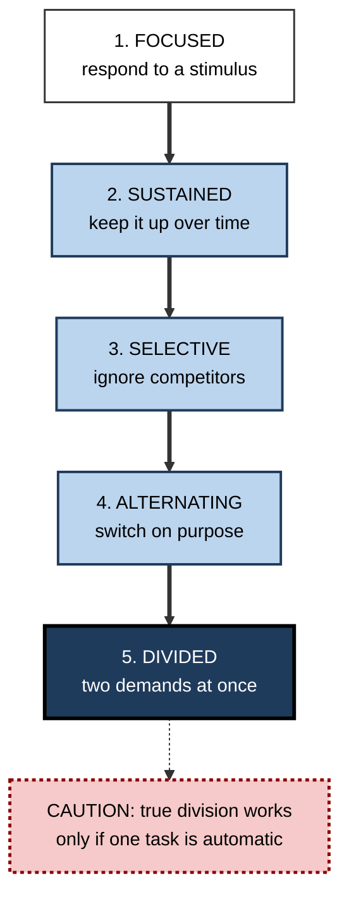
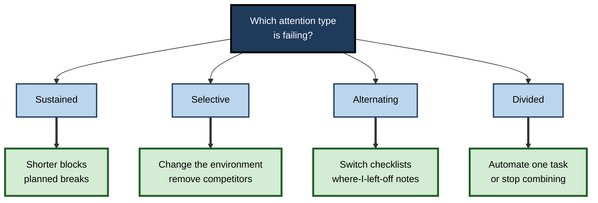

# D.2. Types of Attention

> **In one sentence:** Attention comes in several kinds — focusing on one thing, keeping it up over time, ignoring distractions, switching between tasks, and handling two at once — and each kind can be strong or weak on its own.
>
> **Why it matters:** When you know *which* type of attention a task demands, you can choose the right strategy, design better work and training, and stop treating every focus problem as the same problem.
>
> **Level span:** Novice → Expert · **Reading time:** ~16 min · **Builds on:** what attention is (selection, capacity, control)

---

## The Learning Ladder

| Level | Badge | After this level you can... |
|---|---|---|
| 1 | NOVICE | Name the everyday types of attention and give an example of each from your own life. |
| 2 | FOUNDATIONS | Use the clinical hierarchy of attention types and the main contrasts (voluntary vs automatic, overt vs covert, external vs internal). |
| 3 | PRACTITIONER | Profile the attention demands of a real job task and match strategies to each type. |
| 4 | ADVANCED | Compare the clinical, network and object-of-selection taxonomies and explain how each type is measured. |
| 5 | EXPERT / PRO | Use attention profiles to design roles, training, interfaces and assessments, while avoiding over-interpretation of tests. |

---

## Level 1 · Novice — The Big Picture

"Pay attention" sounds like one instruction, but it can mean very different things. A lifeguard needs to keep watching the water for an hour. A student in a busy café needs to ignore the conversation at the next table. A nurse needs to switch between patients without mixing up their charts. A driver needs to steer while listening to directions. These are all attention, but they are different *types* of attention.

A helpful analogy is physical fitness. Strength, endurance, flexibility and balance are all "fitness", but a marathon runner and a gymnast train different things. Being good at one does not guarantee being good at another. Attention works the same way.

You have already experienced the different types:

- **Focused:** reacting instantly when someone calls your name.
- **Sustained:** reading a long contract carefully to the end.
- **Selective:** following a podcast on a noisy train.
- **Alternating:** cooking dinner while helping a child with homework, shifting back and forth.
- **Divided:** chatting while walking — both at once, because walking is automatic.

The key idea for a beginner: **when focus fails, first ask which kind of attention the task needed.** The fix depends on the answer.

---

## Level 2 · Foundations — Core Concepts

### The clinical hierarchy

A widely used framework in clinical neuropsychology and rehabilitation, developed by McKay Moore Sohlberg and Catherine Mateer, describes five levels of attention, from most basic to most demanding:

| Type | What it is | Everyday example | Work example |
|---|---|---|---|
| **Focused** | Responding to a specific stimulus. | Turning when a phone rings. | Noticing an alert on a monitoring screen. |
| **Sustained** | Keeping attention on a task over time. | Watching a whole film. | Reviewing a long pull request without skimming. |
| **Selective** | Attending to one source while ignoring others. | Hearing one friend in a noisy room. | Writing while colleagues talk nearby. |
| **Alternating** | Switching attention between tasks on purpose. | Reading a recipe, then stirring, then reading. | Moving between a client call and a CRM entry. |
| **Divided** | Handling two or more demands at the same time. | Walking and talking. | Taking notes while listening in a meeting. |

The hierarchy is a practical teaching and rehabilitation tool, not a strict law of nature. Higher levels generally depend on lower ones: you cannot alternate well if you cannot sustain attention on each task.

**Figure D.2-1 — The attention hierarchy: from simplest to most demanding.**

*How to read it:* each level builds on the one above it; the dotted arrow flags the main limit of divided attention.

### Other useful contrasts

| Contrast | Side A | Side B |
|---|---|---|
| **Control** | Voluntary (endogenous) — you choose it. | Automatic (exogenous) — it grabs you. |
| **Where it points** | Overt — eyes and head follow. | Covert — shifts without eye movement. |
| **What it selects** | External — sights, sounds, screens. | Internal — memories, plans, thoughts. |
| **Unit of selection** | Spatial — a location. | Feature-based (a colour) or object-based (a whole object). |
| **Breadth** | Narrow — detail on one thing. | Broad — gist of a whole scene. |

**Internal attention** deserves special mention. Marvin Chun and colleagues (2011) argued that attention selects not only among things in the world but also among thoughts and memories — choosing which item in working memory to work on, or which plan to pursue. Much knowledge work is internal attention: holding a design in mind, reasoning through an argument.

### Key terms

| Term | Plain meaning |
|---|---|
| **Focused attention** | Quick response to a specific stimulus. |
| **Sustained attention** | Maintaining attention on one task over time; called **vigilance** when targets are rare. |
| **Selective attention** | Prioritising one input while suppressing others. |
| **Alternating attention** | Deliberately shifting between tasks with different demands. |
| **Divided attention** | Responding to two or more demands simultaneously. |
| **Internal attention** | Selecting among thoughts, memories and plans rather than external input. |
| **Attentional breadth** | How wide or narrow the current focus is. |

---

## Level 3 · Practitioner — Putting It to Work

The practical skill is to **profile a task's attention demands** and then match tactics to the type. Different types fail for different reasons and need different fixes.

### Attention profiling — five steps

1. **List the task's moments.** Break a job (for example, a support-desk shift) into its recurring moments.
2. **Label each moment** with its dominant attention type: focused, sustained, selective, alternating or divided.
3. **Rate the difficulty** of each moment for you (easy, medium, hard).
4. **Match a tactic** to each hard moment using the table below.
5. **Re-check after two weeks** whether errors or effort dropped.

| Type that is hard | Typical failure | Matching tactic |
|---|---|---|
| Focused | Missed signals | Make signals more salient; reduce competing alerts. |
| Sustained | Drift, lapses after a while | Shorter blocks, planned breaks, rotation, interest. |
| Selective | Noise and chatter intrude | Change environment; noise-reducing headphones; physical separation. |
| Alternating | Slow restarts, wrong context | Checklists at switch points; written "where I left off" notes. |
| Divided | Errors on both tasks | Make one task automatic first, or stop combining them. |

**Figure D.2-2 — Choosing a tactic by attention type.**

*How to read it:* start at the top, choose the failing type, and follow the thick arrow to the first tactic to try.

### Worked example — a customer-support agent

| | Before | After profiling |
|---|---|---|
| **Complaint** | "I can't concentrate on this job." | Profiling shows two hard moments. |
| **Hard moment 1** | Typing ticket notes while still on a call (divided) leads to errors in notes. | Uses a short template filled in right *after* the call, during a 60-second wrap-up. |
| **Hard moment 2** | Jumping between chat customers (alternating) causes replies in the wrong window. | Limits concurrent chats from four to two during complex cases; pins customer names in each window header. |
| **Outcome** | Frequent corrections, feeling scattered. | Fewer note errors and wrong-window replies; less end-of-shift fatigue reported. |

### Common mistakes at this level

- **One-size-fits-all fixes.** Noise-cancelling headphones help selective attention; they do nothing for a sustained-attention slump at 3 p.m.
- **Overrating divided attention.** Most "divided" work is really fast alternating, with costs at every switch.
- **Ignoring internal attention.** Planning and reasoning need protection from interruption just as much as reading does.
- **Assuming a person is "bad at attention".** Most people show different strengths across types.

---

## Level 4 · Advanced — Mechanisms, Models & Evidence

### Three taxonomies, three purposes

| Taxonomy | Origin | Organised by | Best used for |
|---|---|---|---|
| **Clinical hierarchy** | Sohlberg and Mateer, rehabilitation | Task demand level | Assessment and rehabilitation planning; job analysis |
| **Network model** | Posner and Petersen, cognitive neuroscience | Brain systems: alerting, orienting, executive | Explaining individual differences and brain mechanisms |
| **Object of selection** | Cognitive psychology | Space, features, objects, time, internal representations | Experimental research and interface design |

They are complementary lenses. A "sustained attention" problem in the clinical sense often involves the alerting network and executive control in the network sense.

### How each type is measured

| Type | Classic task | What it captures |
|---|---|---|
| Focused / alerting | Simple reaction time; cued reaction time | Speed of response and benefit of warning cues |
| Sustained | Psychomotor Vigilance Task (PVT); Sustained Attention to Response Task (SART); continuous performance tests | Lapses, slowing and errors over minutes |
| Selective | Stroop task; Eriksen flanker task; dichotic listening; visual search | Cost of ignoring conflicting or irrelevant input |
| Alternating | Task-switching paradigm; Trail Making Test part B | Extra time and errors when switching rules |
| Divided | Dual-task paradigms | Performance drop when tasks are combined |
| Network model | Attention Network Test (ANT) | Separate scores for alerting, orienting, executive control |

### Boundary conditions and caveats

- **Task impurity.** No test measures one type in isolation. A Stroop score involves reading skill, processing speed and motivation as well as selective attention.
- **Reliability paradox.** Many classic attention tasks produce robust *group* effects but have only modest reliability as measures of *individual* differences, because the very consistency that makes the effect robust leaves little stable variation between people. Be careful using single test scores to rank individuals.
- **Network independence is partial.** Early studies suggested the three Posner networks were largely independent; later work shows they interact substantially.
- **Context changes the type.** The same task can be sustained attention for a novice and nearly automatic for an expert, which frees capacity for divided attention.

### What recent research added

Meta-analytic work in 2024–2025 on mindfulness training illustrates why the type distinction matters: some reviews found gains on certain attention components (for example orienting, or executive control in long-term practitioners) but not on others such as alerting or mind wandering. Similarly, a 2025 meta-analysis linking heavy media multitasking to attention found a small positive association with self-reported attention problems, with weaker or null links on performance tasks. Lumping all attention into one score hides these differences.

---

## Level 5 · Expert / Pro — Professional Mastery

### Designing roles and work around attention types

Experienced managers and human-factors specialists analyse jobs by their attention profile, then design to reduce the most fragile demands:

| Role | Dominant demand | Design response |
|---|---|---|
| Security operations analyst | Sustained (rare alerts) | Alert tuning to cut false positives; rotation; shift length limits |
| Trading desk | Selective and divided | Screen layout by priority; audio cues for critical events only |
| Product designer | Internal sustained | Protected maker time; minimal context switching |
| Project manager | Alternating | Templates, checklists and status hand-off notes at each switch |
| Air traffic or control room | Sustained plus divided | Automation for routine monitoring; strict break schedules; team cross-checks |

### Training and assessment

In learning and development, attention profiles help sequence training: let learners automate component skills (via practice) before asking them to combine tasks. In hiring, beware of brief "attention tests" sold as aptitude screens; the reliability caveats above mean single scores can mislead, and work-sample tests are usually more valid for the actual job.

### Interface and AI design

Interfaces can be designed for the attention type they demand. Monitoring dashboards should support **focused** attention with salient, rare alerts rather than constant colour changes. Tools used during **alternating** work should restore context on return (recent items, unsaved state, a short "you were doing" summary). AI assistants can help with alternating attention by producing a quick recap of a thread when you return, but if they also generate new streams of suggestions, they can add to divided-attention load.

### Professional scenario

**Role:** Learning designer building a new-hire programme for a contact centre.
**Situation:** New agents struggle in their first month; quality reviews show errors cluster when agents talk and type simultaneously.
**What the pro does:** Profiles the job: the hardest moment is divided attention (talking plus system navigation). Restructures training so agents first practise system navigation alone until it is fluent, then practise calls with a simplified screen, and only then combine both under realistic load. Adds a post-call wrap-up step. Measures error rates in weeks 2, 4 and 8 against the previous cohort and finds a lower early error rate.

### Expert judgement

- Diagnose the **type** before prescribing the fix.
- Prefer **reducing demand** (design) over **increasing effort** (exhortation).
- Treat attention test scores as **group-level evidence**, not individual verdicts.

---

## Myths vs. Evidence

| Myth | What the evidence shows |
|---|---|
| "Some people just have good attention, full stop." | People differ across types; strong selective attention does not guarantee strong sustained attention. |
| "Divided attention is a skill you can train to do anything at once." | True simultaneous performance works mainly when one task is highly automatic; otherwise it is rapid switching. |
| "A quick online attention test tells you your attention ability." | Many attention tasks have modest individual reliability; single scores are noisy. |
| "Attention is only about what you see and hear." | Attention also selects among internal thoughts, memories and plans. |
| "If mindfulness improves attention, it improves all of it." | Recent meta-analyses show gains on some components and not others. |

## Practitioner Toolkit

**Attention profile checklist**

- [ ] I listed the recurring moments of the task.
- [ ] I labelled each moment's dominant attention type.
- [ ] I rated my difficulty on each.
- [ ] I chose a matching tactic for every hard moment.
- [ ] I set a date to review errors or effort.

**Template — task attention profile**

| Task moment | Attention type | Difficulty (E/M/H) | Tactic | Review date |
|---|---|---|---|---|
| | | | | |

## Self-Check

1. **[NOVICE]** Name the five types of attention in the clinical hierarchy.
2. **[NOVICE]** Give an everyday example of selective attention.
3. **[FOUNDATIONS]** What is the difference between alternating and divided attention?
4. **[FOUNDATIONS]** What is internal attention?
5. **[PRACTITIONER]** Which tactic would you try for a sustained-attention problem, and why does it differ from a selective-attention fix?
6. **[ADVANCED]** Name one classic task for measuring selective attention and one for sustained attention.
7. **[ADVANCED]** What is the reliability paradox, and why does it matter for hiring?
8. **[EXPERT / PRO]** How would you sequence training for a job that requires divided attention?
9. **[EXPERT / PRO]** How should a monitoring dashboard be designed for focused attention?

### Answer Key

1. Focused, sustained, selective, alternating, divided.
2. Following one conversation in a noisy restaurant, or reading in a busy café.
3. Alternating means switching between tasks; divided means handling them at the same time.
4. Selecting among thoughts, memories and plans rather than external stimuli.
5. Shorter blocks and planned breaks, because the problem is decline over time; selective fixes target competing inputs instead.
6. Selective: Stroop or flanker task. Sustained: Psychomotor Vigilance Task or SART.
7. Tasks with robust group effects often have little stable between-person variation, so individual scores are unreliable; single test scores should not drive hiring decisions.
8. Train component skills to fluency separately, then combine under simplified conditions, then under realistic load.
9. Few, salient, meaningful alerts, minimal constant motion, and low false-alarm rates.

## Key Takeaways

- Attention is a **family of types**: focused, sustained, selective, alternating and divided.
- Each type can be **strong or weak independently**; diagnose the type before fixing.
- **True divided attention** mostly requires one task to be automatic.
- Attention also selects **internal** content — thoughts and plans — which needs protection too.
- Clinical, network and object-of-selection taxonomies are **complementary lenses**.
- Attention test scores are **noisy for individuals**; use work samples for decisions.

## Glossary

| Term | Meaning |
|---|---|
| Alternating attention | Deliberately shifting between tasks with different demands. |
| Attention Network Test | Task giving separate scores for alerting, orienting and executive control. |
| Divided attention | Responding to two or more demands at once. |
| Focused attention | Responding to a specific stimulus. |
| Internal attention | Selection among thoughts, memories and plans. |
| Psychomotor Vigilance Task | Simple reaction-time test sensitive to lapses and sleep loss. |
| Reliability paradox | Robust group effects paired with poor reliability for individual differences. |
| Selective attention | Prioritising one input while suppressing others. |
| Stroop task | Naming the ink colour of colour words; measures interference control. |
| Sustained attention | Maintaining attention on a task over time. |
| Task impurity | The fact that no test measures a single cognitive function in isolation. |
