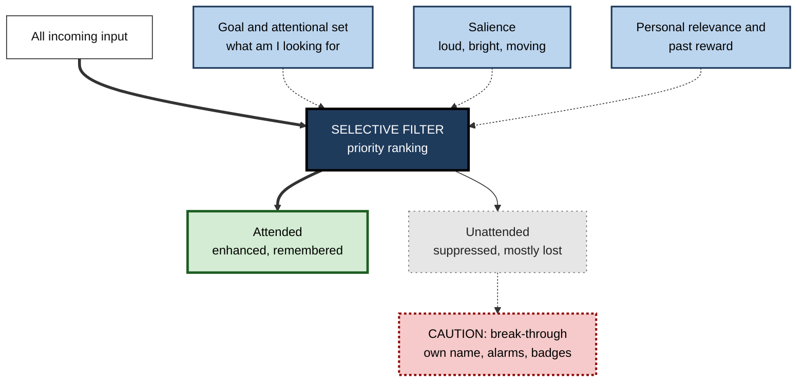
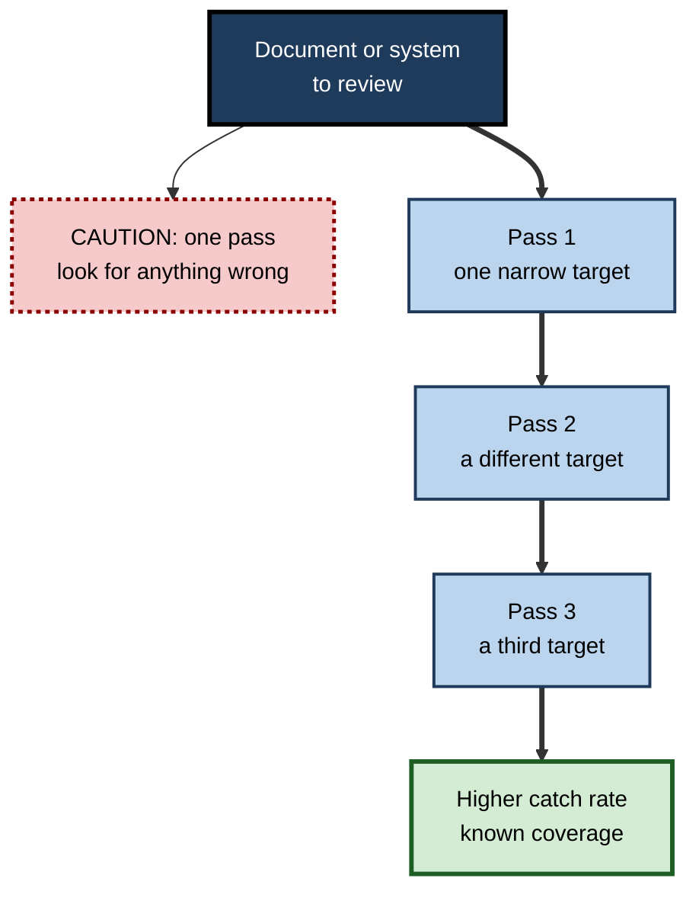
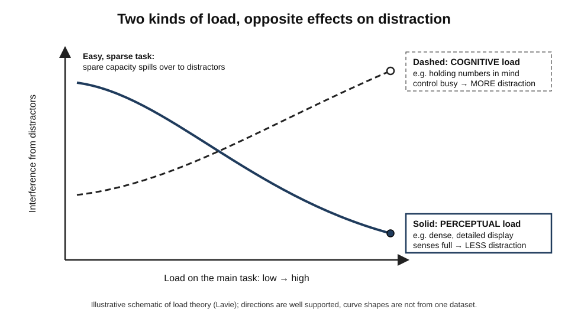

# D.3. Selective Attention and Filtering

> **In one sentence:** Selective attention is your brain's ability to focus on what matters right now and turn down everything else — like following one voice in a crowded room.
>
> **Why it matters:** Every workplace is full of competing signals. People who understand how the brain filters can arrange their tasks and surroundings so the filter works for them, and can design documents, dashboards and products that put the right signal through.
>
> **Level span:** Novice → Expert · **Reading time:** ~18 min · **Builds on:** what attention is; types of attention

---

## The Learning Ladder

| Level | Badge | After this level you can... |
|---|---|---|
| 1 | NOVICE | Explain the cocktail party effect and why you miss things you are not looking for. |
| 2 | FOUNDATIONS | Describe early and late selection, attenuation, attentional capture and inattentional blindness. |
| 3 | PRACTITIONER | Use load and salience to protect a focused task and to make important signals stand out. |
| 4 | ADVANCED | Explain filter theories, load theory, feature integration and the neural mechanisms of suppression, with their evidence. |
| 5 | EXPERT / PRO | Design information environments — alerts, interfaces, reviews — around the strengths and blind spots of selective attention. |

---

## Level 1 · Novice — The Big Picture

At a busy party, dozens of conversations happen at once, yet you can follow your friend's story. You are not hearing less — your ears pick up everything. Your brain is **selecting** one stream and turning down the others. Psychologists call this **selective attention**, and the party situation is so famous it has a name: the **cocktail party effect**.

The filter is not a solid wall. If someone across the room says your name, you often notice instantly. Important or personally meaningful information can slip through.

The flip side is surprising. When you concentrate on one thing, you can completely miss something obvious. In a famous 1999 experiment by Daniel Simons and Christopher Chabris, viewers counting basketball passes often failed to notice a person in a gorilla suit walking through the scene. Roughly half of viewers missed it in the original study. This is called **inattentional blindness**: failing to see something in plain view because attention was elsewhere.

An analogy: selective attention is like a radio tuned to one station. The tuning makes that station clear, but the other stations are still broadcasting — and occasionally a strong one bleeds through.

You have already experienced this when you searched a room for your keys and looked straight past them, or when you were so absorbed in your phone that you did not hear a question asked twice.

The key idea: **focus has a price. What you select gets better; what you don't select gets worse, sometimes invisible.**

---

## Level 2 · Foundations — Core Concepts

### Where does the filter sit?

The classic debate of the 1950s–1960s was about *when* unattended information is filtered out:

| Theory | Who and when | Claim | Problem it ran into |
|---|---|---|---|
| **Early selection** | Donald Broadbent, 1958 | Unattended input is blocked based on physical features (pitch, location) before its meaning is processed. | People notice their own name in an "ignored" channel, so some meaning gets through. |
| **Attenuation** | Anne Treisman, 1960s | Unattended input is turned down, not blocked; highly important words (your name, "fire") still break through. | Hard to specify exactly what "turned down" means. |
| **Late selection** | J. Anthony and Diana Deutsch, 1963 | All input is processed for meaning; selection happens just before response or memory. | Unattended material is often remembered very poorly. |

Modern research suggests the answer depends on the situation — which is where **load theory** comes in (Level 4).

### Capture and control

**Attentional capture** is when something grabs your attention against your intentions — a pop-up, a moving ad, a loud noise. Capture depends on **salience** (how much something stands out) and on your **attentional set** (what you are currently looking for). If you are searching for red items, red distractors capture you more easily. Research also shows that things that were **rewarded** in the past keep capturing attention even when they are no longer useful — one reason the red notification badge is so hard to ignore.

**Figure D.3-1 — How the filter decides what gets through.**

*How to read it:* input flows through the filter (thick arrows); three dotted influences set its priorities; some unattended input still breaks through.

### Key terms

| Term | Plain meaning |
|---|---|
| **Selective attention** | Prioritising one source of information while suppressing others. |
| **Cocktail party effect** | Following one conversation among many, and noticing your name in an ignored one. |
| **Inattentional blindness** | Failing to notice a visible, unexpected object because attention is engaged elsewhere. |
| **Change blindness** | Failing to notice a change in a scene, especially across a brief interruption. |
| **Attentional capture** | Involuntary shift of attention to a salient stimulus. |
| **Attentional set** | The features you are currently prepared to look for. |
| **Salience** | How much something stands out from its surroundings. |
| **Distractor** | Information that competes with the target and must be ignored. |

---

## Level 3 · Practitioner — Putting It to Work

Two practical levers follow from the science: **load** and **salience**.

- **Load:** a task that fully engages your perception (dense, detailed, visually rich) leaves less spare capacity for distractors. A task that is perceptually easy but mentally demanding (thinking, remembering) can leave you *more* vulnerable to distraction, because the control you would use to ignore distractors is busy.
- **Salience:** whatever stands out wins. Make the important signal stand out, and remove things that stand out without being important.

### Five steps to protect a focused task

1. **Name the target.** Write the one thing you are attending to in the next block (for example, "find inconsistencies in the Q3 revenue model").
2. **Remove salient competitors.** Close tabs, hide badges, silence chat, flip the phone face down or put it in another room.
3. **Raise target salience.** Highlight what you are scanning for; use filters, search or conditional formatting so the target pops out.
4. **Use a task with the right load.** If you are being distracted during a thinking task, engage the senses with the material: work on paper, sketch, read aloud, or step through the problem visually.
5. **Plan a second pass for what you'll miss.** Inattentional blindness means you will miss things outside your search target; schedule a separate check with a different focus.

### Worked example — reviewing a contract

| | Before | After |
|---|---|---|
| **Set-up** | Lawyer reviews a 40-page contract in a shared office with email open. | Same lawyer, same contract. |
| **Method** | Reads straight through looking for "anything wrong". | Pass 1: only liability clauses, highlighted in a search. Pass 2: only dates and amounts. Pass 3: definitions. Email closed, office door shut. |
| **Result** | Catches drafting errors but misses a changed indemnity cap. | Each pass has a narrow attentional set; the indemnity change is found in pass 1. |

A narrow search target makes the right things pop out — but only those things, which is why several targeted passes beat one vague one.

**Figure D.3-2 — Multi-pass review beats one vague pass.**

*How to read it:* the dotted-border box is the common vague approach; the thick path shows sequential narrow passes.

### Common mistakes at this level

- **"I'll just ignore it."** Ignoring costs control; removing the distractor is cheaper than resisting it.
- **Searching for "anything".** Without a target set, attention drifts to whatever is salient, not whatever is important.
- **Assuming you would have noticed.** Inattentional blindness is common in experts too, including radiologists who missed an unexpected image inserted into scans they were reading.
- **Making everything stand out.** A document with everything bold has no salience left.

---

## Level 4 · Advanced — Mechanisms, Models & Evidence

### Load theory: resolving the early–late debate

Nilli Lavie's **load theory** (from the mid-1990s onward) proposes that both early and late selection happen, depending on **load**:

- **High perceptual load** (many items, fine discriminations) uses up perceptual capacity, so distractors are not perceived much at all — an early-selection outcome.
- **Low perceptual load** leaves spare capacity that "spills over" to distractors automatically, so they are processed and can interfere — a late-selection outcome.
- **High cognitive load** (holding things in working memory, executive demands) has the *opposite* effect: it weakens active control, so distractors interfere *more*.

*Figure D.3-3 — Load theory.* Solid line: as perceptual load rises, distractor interference falls. Dashed line: as cognitive (working-memory) load rises, interference rises. The directions are well supported; the curves are schematic, not plotted from one dataset.

Load theory is well supported in laboratory tasks and has been extended to inattentional blindness (more unnoticed events under high perceptual load). Some critics argue "load" is hard to define independently of its effects, and results depend on how dilution and display features are controlled.

### Feature integration and visual search

Anne Treisman and Garry Gelade's **feature integration theory** (1980) distinguished **feature search** — finding a red item among green ones, which "pops out" quickly regardless of the number of items — from **conjunction search** — finding a red X among red Os and green Xs, which requires serial attention and slows as items increase. Later models (such as Jeremy Wolfe's **guided search**) refined this: attention is guided by a priority map combining features, goals and scene knowledge. Practical consequence: **unique single features (one colour, one shape) pop out; combinations do not.**

### Suppression as an active process

Filtering is not just failing to process; the brain actively suppresses. Neural studies show reduced responses to ignored stimuli and increased oscillations in the alpha band over regions processing ignored locations, which many researchers interpret as a gating mechanism. There is also evidence for **learned suppression**: distractors that repeatedly appear in the same location or colour become easier to ignore over time, though this learning is specific to the trained distractor.

### Interference tasks

- **Stroop effect** (John Ridley Stroop, 1935): naming the ink colour of a colour word is slower when word and colour conflict. Reading is so automatic that it cannot be fully filtered.
- **Flanker effect** (Eriksen and Eriksen, 1974): responses are slower when neighbouring items suggest a different response.
Both are among the most reliable effects in psychology at the group level and are used to study executive control.

### Strength of evidence

| Claim | Status |
|---|---|
| Unattended information is processed less and remembered worse | Very well established |
| Some meaning leaks through the filter (own name, threat) | Established; frequency varies and the classic own-name effect occurs only for a minority of listeners in some replications |
| Load theory directions | Well supported, with debate about defining load |
| Inattentional blindness | Robust and widely replicated; rates vary greatly with task and expectation |
| Reward history biases capture | Well supported in lab; real-world implications plausible |

---

## Level 5 · Expert / Pro — Professional Mastery

### Designing for the filter

Professionals who design dashboards, reports, alerts and learning materials apply selective-attention science directly:

| Principle | Application |
|---|---|
| **One pop-out feature per meaning** | Use a single distinctive colour or shape for "needs action"; do not reuse it for decoration. |
| **Reduce salience noise** | Remove animations, banners and badges that compete without informing. |
| **Fight alarm fatigue** | Every false alarm trains people to filter that channel out. Tune thresholds so alerts are rare and meaningful. |
| **Set the attentional set** | Tell readers what to look for first (an executive summary, a question at the top of a review). |
| **Plan for blind spots** | Pair primary checks with independent checks with a different focus — second-reviewer rules, automated tests, checklists. |

### Selective attention in safety and quality

In healthcare, aviation and software operations, **alarm fatigue** is a recognised hazard: when most alerts are irrelevant, people learn to suppress the whole channel. The professional response is not "pay more attention" but **alert hygiene** — fewer, more specific, actionable alerts, with ownership and regular review.

In code review, inattentional blindness explains why reviewers focused on logic miss security issues. Mature teams split review concerns (correctness, security, performance) between people, checklists or automated tools.

### AI-era implications

Generative AI tools change what attention is filtering. A fluent, confident AI summary can become the new attentional set, so reviewers see what the summary highlighted and miss what it left out. Treat AI summaries as one pass, not the only pass; when stakes are high, review the source with a target the summary did not set.

### Professional scenario

**Role:** Site reliability lead for a payments platform.
**Situation:** On-call engineers receive hundreds of alerts per week; a real outage was missed because its alert looked like dozens of routine ones.
**What the pro does:** Audits alerts and removes or merges those with no action attached; reserves the highest-severity channel and a distinctive tone for customer-impacting signals only; adds a weekly review of every page. Alert volume drops sharply, and time to acknowledge critical alerts falls. The lead explains the change to leadership as reducing filter-out, not increasing vigilance.

### Ethical limits

Attention capture can be used against users: dark patterns that make "cancel" low-salience and "upgrade" high-salience exploit the filter. Professionals should use salience to support users' goals, not override them.

---

## Myths vs. Evidence

| Myth | What the evidence shows |
|---|---|
| "If something important happened in front of me, I'd notice." | Inattentional blindness is common, even among experts, when attention is engaged elsewhere. |
| "Ignoring distractions is just discipline." | Ignoring consumes control; removing or reducing distractors works better, especially under high cognitive load. |
| "More alerts make us safer." | Excessive alerts cause alarm fatigue; people filter out the entire channel. |
| "Highlighting everything helps readers." | Salience is relative; when everything stands out, nothing does. |
| "We always hear our name in an ignored conversation." | Only some people notice it some of the time; the filter is leaky, not transparent. |

## Practitioner Toolkit

**Focused-task protection checklist**

- [ ] I wrote down the single target for this block.
- [ ] Salient competitors (badges, tabs, phone) are removed, not resisted.
- [ ] My target is made to stand out (search, filter, highlight).
- [ ] If distracted during a thinking task, I made the material more engaging to the senses.
- [ ] I planned a separate pass for things outside the target.

**Template — multi-pass review plan**

| Pass | Single target | Tool or method | Done |
|---|---|---|---|
| 1 | | | |
| 2 | | | |
| 3 | | | |

## Self-Check

1. **[NOVICE]** What is the cocktail party effect?
2. **[NOVICE]** What is inattentional blindness? Give an example.
3. **[FOUNDATIONS]** Contrast Broadbent's early selection with Treisman's attenuation theory.
4. **[FOUNDATIONS]** What makes something capture attention?
5. **[PRACTITIONER]** Why is removing a distractor better than resisting it?
6. **[ADVANCED]** According to load theory, how do perceptual and cognitive load differ in their effect on distraction?
7. **[ADVANCED]** Why does a red item pop out among green ones, but a red X among red Os and green Xs does not?
8. **[EXPERT / PRO]** What is alarm fatigue, and how would you reduce it?
9. **[EXPERT / PRO]** How can an AI summary create a blind spot in a review?

### Answer Key

1. Following one conversation among many, and still noticing your name spoken in an ignored conversation.
2. Failing to notice a visible, unexpected object because attention is elsewhere — for example, missing the gorilla while counting passes.
3. Early selection blocks unattended input based on physical features before meaning; attenuation turns it down so important words can still break through.
4. Salience (contrast, motion, sudden onset), match with your attentional set, personal relevance and past reward.
5. Resisting uses executive control, which is limited and weaker under cognitive load; removal eliminates the competition.
6. High perceptual load reduces distractor processing; high cognitive load increases distractor interference.
7. A single unique feature is detected in parallel; a conjunction requires serial attention to combine features.
8. People learn to ignore an alert channel that is mostly irrelevant. Reduce volume, make alerts actionable, reserve distinctive signals for critical events, review regularly.
9. The summary sets your attentional set, so you look for what it highlighted and miss what it omitted.

## Key Takeaways

- Selective attention **enhances the target and suppresses the rest** — with real costs for what is suppressed.
- The filter is **leaky**: personally relevant and salient input can break through.
- **Inattentional blindness** is normal; plan independent checks.
- **Load theory**: perceptual load protects from distraction; cognitive load makes you more vulnerable.
- **Remove distractors rather than resist them.**
- Design with **one meaningful pop-out signal** and guard against **alarm fatigue**.

## Glossary

| Term | Meaning |
|---|---|
| Alarm fatigue | Reduced response to alerts caused by frequent irrelevant alerts. |
| Attentional capture | Involuntary shift of attention to a salient stimulus. |
| Attentional set | Features one is currently prepared to detect. |
| Attenuation theory | Unattended input is weakened, not blocked. |
| Change blindness | Failure to notice changes in a scene. |
| Conjunction search | Search for a combination of features; slower and serial. |
| Early selection | Filtering before meaning is analysed. |
| Feature integration theory | Theory that attention binds separate features into objects. |
| Inattentional blindness | Failure to see unexpected visible objects when attention is elsewhere. |
| Late selection | Filtering after meaning is analysed. |
| Load theory | Theory that perceptual and cognitive load determine distractor processing. |
| Pop-out | Rapid detection of an item that differs by a single feature. |
| Salience | Degree to which a stimulus stands out. |
