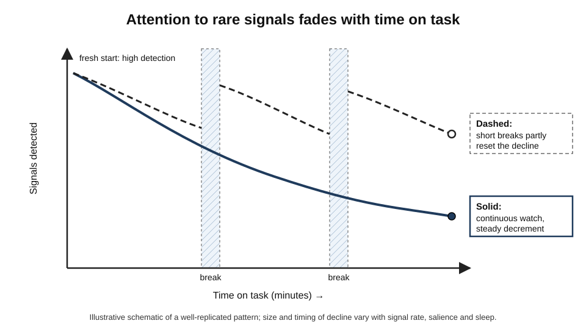
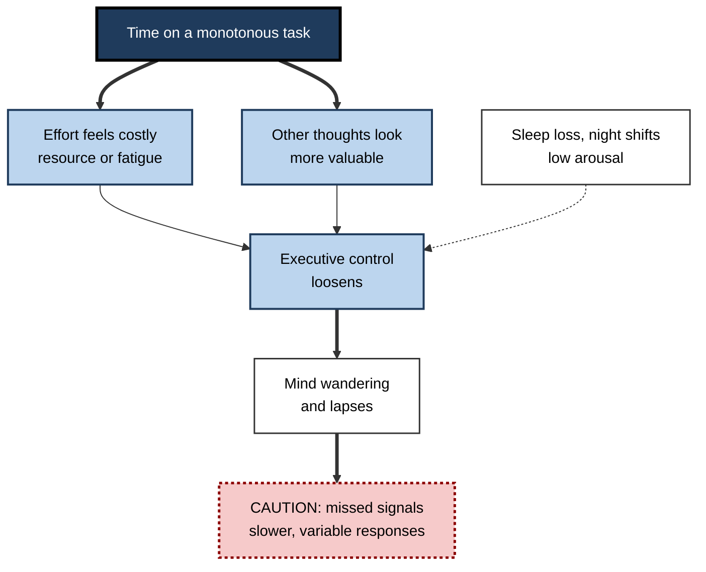
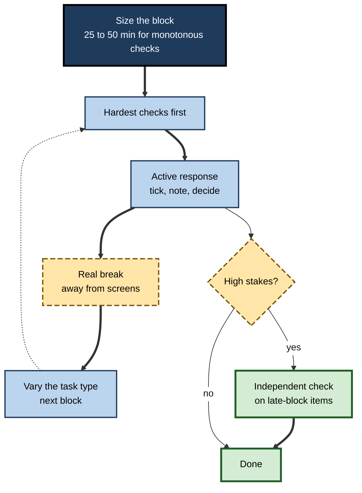

# D.4. Sustained Attention and Vigilance

> **In one sentence:** Sustained attention is keeping your mind on one task over time, and vigilance is the special, harder case of staying alert for rare but important signals — both reliably weaken the longer you go without a change.
>
> **Why it matters:** Long reviews, monitoring, studying, quality checks and long meetings all depend on sustained attention. Knowing why and when it fades lets you schedule, design breaks and build systems that catch what tired human attention will miss.
>
> **Level span:** Novice → Expert · **Reading time:** ~18 min · **Builds on:** what attention is; types of attention

---

## The Learning Ladder

| Level | Badge | After this level you can... |
|---|---|---|
| 1 | NOVICE | Explain why focus fades during long, monotonous tasks and recognise the signs in yourself. |
| 2 | FOUNDATIONS | Define sustained attention, vigilance, the vigilance decrement, lapses and mind wandering. |
| 3 | PRACTITIONER | Structure long tasks with blocks, breaks, variety and checks to hold performance up. |
| 4 | ADVANCED | Compare resource, underload, resource-control and opportunity-cost theories, and the evidence on sleep, motivation and breaks. |
| 5 | EXPERT / PRO | Design monitoring roles, shift patterns, automation and review processes that account for the limits of human vigilance. |

---

## Level 1 · Novice — The Big Picture

Imagine watching a security camera feed of an empty car park for an hour, waiting for anything unusual. For the first few minutes you are sharp. Then your mind starts drifting: lunch plans, an email you forgot. If something happened forty minutes in, there is a real chance you would miss it — not because you are lazy, but because human attention is not built to stay locked on an unchanging, low-event task.

That ability to keep attention on a task over time is **sustained attention**. When the task is watching for rare signals — a fault on a production line, a suspicious bag on an airport X-ray, an alert in a monitoring system — psychologists call it **vigilance**.

An analogy: sustained attention is like holding a heavy bag at arm's length. Anyone can do it for a short while. Holding it steady for an hour is a different matter, and the arm drops a little at a time before you notice.

You have already experienced this when you read the first chapter of a dry report carefully and skimmed the last chapter, or when you "came to" in a long meeting and realised you had no idea what was decided in the last ten minutes.

The key idea: **focus naturally fades over time on monotonous tasks. Plan for the fade instead of blaming yourself for it.**

---

## Level 2 · Foundations — Core Concepts

### The vigilance decrement

The scientific study of vigilance began during the Second World War, when radar operators watching screens for enemy submarines missed more signals as their shifts went on. Norman Mackworth built a laboratory version in 1948: the **Mackworth clock**, a pointer that ticks steadily around a dial and occasionally makes a double jump. Observers had to report the double jumps. Detection fell noticeably within the first half hour. This decline in performance with time on task is the **vigilance decrement**, one of the most replicated findings in attention research.

*Figure D.4-1 — The vigilance decrement.* Solid line: continuous watch — detection falls with time on task. Dashed line: the same task with short breaks — performance partly recovers after each break. The pattern is well replicated; the curves are schematic.

### What fading attention looks like

| Sign | What is happening |
|---|---|
| **Slower responses** | Reaction times drift upward and become more variable. |
| **Lapses** | Brief moments of no response — "zoning out" for a second or two. |
| **Misses** | Real signals go undetected. |
| **Mind wandering** | Thoughts drift to unrelated topics; you may not notice until later. |
| **Shift in caution** | Some observers become more conservative, reporting fewer signals overall. |

### Mind wandering

**Mind wandering** — attention drifting from the task to unrelated thoughts — is very common. In a large experience-sampling study by Matthew Killingsworth and Daniel Gilbert (2010), people reported thinking about something other than what they were doing in nearly half of the moments sampled. Mind wandering is not always bad (it supports planning and creativity), but during tasks that need sustained attention it predicts errors and weaker comprehension.

**Figure D.4-2 — Why sustained performance drops.**

*How to read it:* time on task feeds two drivers that loosen control; dotted arrow is a background factor that makes everything worse.

### Key terms

| Term | Plain meaning |
|---|---|
| **Sustained attention** | Keeping attention on a task over minutes to hours. |
| **Vigilance** | Sustained attention for rare, unpredictable signals. |
| **Vigilance decrement** | Decline in detection or speed with time on task. |
| **Lapse** | A brief failure to respond, often lasting a second or more. |
| **Mind wandering** | Thoughts drifting to task-unrelated content. |
| **Time on task** | How long someone has been performing a task without a break. |
| **Hit / miss / false alarm** | Correctly detected signal / undetected signal / reporting a signal that was not there. |

---

## Level 3 · Practitioner — Putting It to Work

The goal is not to fight the decrement with willpower but to **design around it**.

### The sustained-focus protocol — six steps

1. **Size the block.** For monotonous checking work, start with blocks of roughly 25–50 minutes; for engaging, varied work, longer blocks are often fine. Adjust from your own observation.
2. **Front-load the hardest checking.** Put the highest-stakes review at the start of a block, when attention is freshest.
3. **Make it active.** Turn passive watching into doing: tick items off, annotate, answer a question per page, summarise each section in a sentence.
4. **Vary the task.** Rotate between different kinds of checking (numbers, then text, then logic) so the same detectors are not running continuously.
5. **Take real breaks.** Short, genuine diversions — standing, walking, looking away from screens — restore performance better than switching to email.
6. **Add an independent check.** For anything high-stakes, assume the end of the block was weaker and add a second reviewer, a checklist or an automated test.

**Figure D.4-3 — The sustained-focus protocol for a long checking task.**

*How to read it:* the thick path is one block; the dotted arrow loops into the next block; high-stakes work adds an independent check.

### Worked example — an audit associate testing transactions

| | Before | After |
|---|---|---|
| **Task** | Tests 300 invoices against purchase orders in one four-hour stretch. | Same 300 invoices. |
| **Method** | Passive scanning, email open alongside. | Four 45-minute blocks; each invoice gets a tick-box checklist entry; 10-minute walk between blocks; email closed during blocks. |
| **Quality check** | None. | Senior re-tests a random sample from the *last* 15 minutes of each block. |
| **Outcome** | Senior review later finds most exceptions missed came from the final hour. | Fewer misses overall, and late-block misses are caught by the targeted sample. |

### Common mistakes at this level

- **Marathon sessions.** Long uninterrupted checking guarantees a weaker final stretch.
- **"Breaks" that are not breaks.** Switching to chat or news keeps attention busy and can add attention residue.
- **Relying on feeling alert.** People are poor judges of their own lapses, especially when sleep-deprived.
- **Monotony by design.** Identical, passive steps invite mind wandering; build in active responses.

---

## Level 4 · Advanced — Mechanisms, Models & Evidence

### Why does vigilance decline? Four families of theory

A 2026 review in the cognition literature summarised the state of the field: no single framework fully accounts for the vigilance decrement, and research now consists of competing and complementary explanations.

| Theory | Core claim | Supporting evidence | Weak points |
|---|---|---|---|
| **Resource depletion** (Warm, Parasuraman, Matthews and colleagues) | Vigilance is hard mental work that drains limited resources. | Vigilance tasks feel effortful and raise subjective workload; brain blood-flow measures decline with time on task. | "Resource" is hard to define; performance can be restored quickly by reward or a short break. |
| **Underload / mindlessness** (Robertson and colleagues, 1997) | Monotony causes disengagement and automatic, mindless responding. | Errors on the SART rise when responding becomes routine; boredom predicts lapses. | Does not explain why vigilance feels effortful. |
| **Resource-control** (Thomson, Besner and Smilek, 2015) | Resources stay constant, but executive control over them weakens, so attention drifts to mind wandering, the default state. | Mind wandering rises with time on task; decrement and control decline together. | Mechanism of control decline still debated. |
| **Opportunity cost / motivational** (Kurzban and colleagues, 2013; strategic allocation, 2024) | The brain continually weighs the value of staying on task against alternatives; the decrement is a cost–benefit decision. | Reward can reduce the decrement; interest and motivation reduce the cost of mind wandering. | Hard to test directly; may underplay true fatigue. |

The current direction of travel is toward integrated, motivation-sensitive accounts: sustained attention declines partly because effort feels increasingly costly and alternative thoughts become more attractive, and partly because of real changes in arousal and fatigue.

### Moderators that reliably matter

- **Signal rate:** rarer signals produce lower detection and larger decrements.
- **Event rate:** faster background events (more non-signals to check) increase load and decrement.
- **Signal salience:** faint, brief or ambiguous signals are missed more over time.
- **Sleep and circadian timing:** sleep loss sharply increases lapses on the Psychomotor Vigilance Task. Classic sleep-restriction studies found that two weeks of about six hours a night produced lapse levels comparable to a full night without sleep — while participants rated themselves only slightly sleepy.
- **Motivation and reward:** reward anticipation can reduce the decrement in laboratory tasks.
- **Brief breaks and diversions:** short task-unrelated breaks have been found to reduce or reset the decrement.

### The ego-depletion caution

The popular idea that self-control and attention draw on a single "willpower battery" took a major hit when large preregistered multi-lab replications (one with 23 labs and over 2,000 participants) failed to find the classic ego-depletion effect. Other preregistered work found a small effect on attention-control errors after effortful tasks. The fair summary: **sustained effort can produce small performance costs, but the simple "battery runs flat" model is not well supported**. Fatigue, boredom, shifting motivation and sleep are better explanations of why focus fades.

### Measuring sustained attention

| Measure | Captures |
|---|---|
| Psychomotor Vigilance Task (PVT) | Lapses and slowing; very sensitive to sleep loss |
| Sustained Attention to Response Task (SART) | Failures to withhold a routine response (mindless errors) |
| Continuous performance tests | Misses and false alarms over long runs; used clinically |
| Thought probes | Self-reported mind wandering at random moments |
| Reaction time variability | Fluctuating engagement, often a sensitive early sign |

---

## Level 5 · Expert / Pro — Professional Mastery

### Designing roles around human vigilance

| Domain | Vigilance risk | Professional response |
|---|---|---|
| Airport security screening | Rare threats among many safe bags | Image projection of fictional threats to keep detection practised and measure performance; rotation limits |
| Radiology and pathology | Small findings in high-volume reading | Reading-session limits, double reading for screening, AI as second reader |
| Security operations centres | Rare true alerts among many false | Alert tuning, triage automation, shift length limits, team handovers |
| Manufacturing quality inspection | Defects become rare as processes improve | Automated inspection with human review of flagged items; rotation |
| Driving with partial automation | Monitoring a system that rarely fails | Driver-monitoring systems; designs that keep the human actively engaged |

### The automation paradox

As automation handles routine monitoring, humans are left supervising systems that rarely fail — the **worst possible vigilance task**: rare signals, low engagement, long durations. This is often called the **out-of-the-loop problem**. Lisanne Bainbridge's 1983 "ironies of automation" captured it: automating the easy parts leaves humans with the hardest, rarest parts, while depriving them of the practice needed to handle them. In the AI era, the same irony applies to reviewing AI-generated code, summaries and decisions: if the AI is usually right, sustained critical review is very hard to maintain.

Pro responses include:

- **Keep humans active**, not passive: require decisions, predictions or annotations rather than approvals.
- **Inject known test cases** to measure and maintain detection (as with threat image projection).
- **Calibrate trust** by showing the system's uncertainty and track record.
- **Limit time on monitoring duty** and rotate.

### Professional scenario

**Role:** Engineering manager whose team now reviews AI-generated pull requests.
**Situation:** Most AI changes are fine, so reviewers start approving quickly; two subtle bugs reach production in a month.
**What the pro does:** Recognises a vigilance problem. Caps review sessions at about an hour, requires reviewers to write one sentence stating what the change does and one risk they checked (turning passive approval into active response), seeds occasional known-defect changes in a training environment to calibrate reviewers, and adds automated property tests for the riskiest modules. Tracks escaped defects per month; they fall over the next quarter.

### Ethical limits

Holding workers to sustained-vigilance targets without breaks, rotation or adequate sleep is both unsafe and unfair. Blame for vigilance failures often falls on individuals when the system design made failure likely.

---

## Myths vs. Evidence

| Myth | What the evidence shows |
|---|---|
| "Committed professionals don't lose focus." | The vigilance decrement occurs in trained, motivated people; it is a property of human attention, not character. |
| "If I feel alert, I'm performing fine." | Sleep-restricted people underestimate their impairment; lapses increase before people feel very sleepy. |
| "Willpower is a battery that runs down." | Multi-lab replications largely failed to support classic ego depletion; fatigue and motivation explain more. |
| "Checking email is a break." | It keeps attention busy; genuine diversions restore more. |
| "Automation removes the need for human attention." | It often changes the human role into a harder vigilance task. |

## Practitioner Toolkit

**Sustained-focus checklist**

- [ ] Block length set for this task type (start at 25–50 minutes for monotonous checking).
- [ ] Hardest checks placed at the start of the block.
- [ ] Every item requires an active response (tick, note, decision).
- [ ] Task types rotated across blocks.
- [ ] Real breaks scheduled, away from screens.
- [ ] Independent check added for high-stakes work.
- [ ] Enough sleep last night — or the stakes reduced if not.

**Template — block plan for a long review**

| Block | Time | Content | Active response | Break activity |
|---|---|---|---|---|
| 1 | | | | |
| 2 | | | | |

## Self-Check

1. **[NOVICE]** What is the difference between sustained attention and vigilance?
2. **[NOVICE]** Name two signs that your sustained attention is fading.
3. **[FOUNDATIONS]** What is the vigilance decrement, and where was it first studied?
4. **[FOUNDATIONS]** What is a lapse?
5. **[PRACTITIONER]** Why does making a task active help sustain attention?
6. **[ADVANCED]** Contrast resource-depletion and opportunity-cost explanations of the decrement.
7. **[ADVANCED]** What did large replications show about ego depletion, and what does that mean for "willpower" explanations?
8. **[EXPERT / PRO]** What is the automation paradox, and how does it apply to reviewing AI output?
9. **[EXPERT / PRO]** Name three design measures for a role that monitors for rare events.

### Answer Key

1. Sustained attention is keeping focus on any task over time; vigilance is sustained attention for rare, unpredictable signals.
2. Slower or variable responses, lapses, missed details, mind wandering.
3. Decline in detection or speed with time on task; first studied in wartime radar operators and in Mackworth's 1948 clock task.
4. A brief failure to respond, often a second or more of "zoning out".
5. Active responses keep executive control engaged and reduce mindless, automatic responding and mind wandering.
6. Resource theories say effort drains a limited capacity; opportunity-cost theories say the brain re-weighs whether continuing is worth it versus alternatives.
7. Large preregistered multi-lab replications failed to find the classic effect; simple "battery" accounts are weak, so fatigue, motivation and boredom are better explanations.
8. Automation leaves humans monitoring rare failures, the hardest vigilance task, with less practice. Reviewing mostly-correct AI output is the same problem.
9. Alert tuning to reduce false alarms, rotation and session limits, injected test signals, active-response designs, automation as second reader.

## Key Takeaways

- Sustained attention **declines with time on task** — the vigilance decrement is robust.
- **Rare signals, monotony, sleep loss and night work** make it worse; **breaks, variety, reward and active responses** help.
- Theories now emphasise **control and motivation**, not only a draining resource; the simple willpower battery is **not well supported**.
- People **misjudge their own lapses**; design checks instead of trusting feelings.
- **Automation and AI** can create harder vigilance tasks; keep humans actively engaged.

## Glossary

| Term | Meaning |
|---|---|
| Continuous performance test | Long task used to assess sustained attention, often clinically. |
| Ego depletion | Contested idea that self-control draws on a limited resource that runs out. |
| False alarm | Reporting a signal when none occurred. |
| Lapse | Brief failure to respond. |
| Mackworth clock | Classic vigilance task with occasional double jumps of a pointer. |
| Mind wandering | Thoughts drifting to unrelated content. |
| Opportunity cost model | Theory that effort declines as alternatives seem more valuable. |
| Out-of-the-loop problem | Reduced awareness and skill when supervising automation. |
| Psychomotor Vigilance Task | Simple reaction-time test highly sensitive to lapses. |
| Resource-control theory | Theory that executive control over attention weakens with time on task. |
| SART | Sustained Attention to Response Task; measures mindless responding. |
| Vigilance decrement | Decline in performance with time on a monitoring task. |
