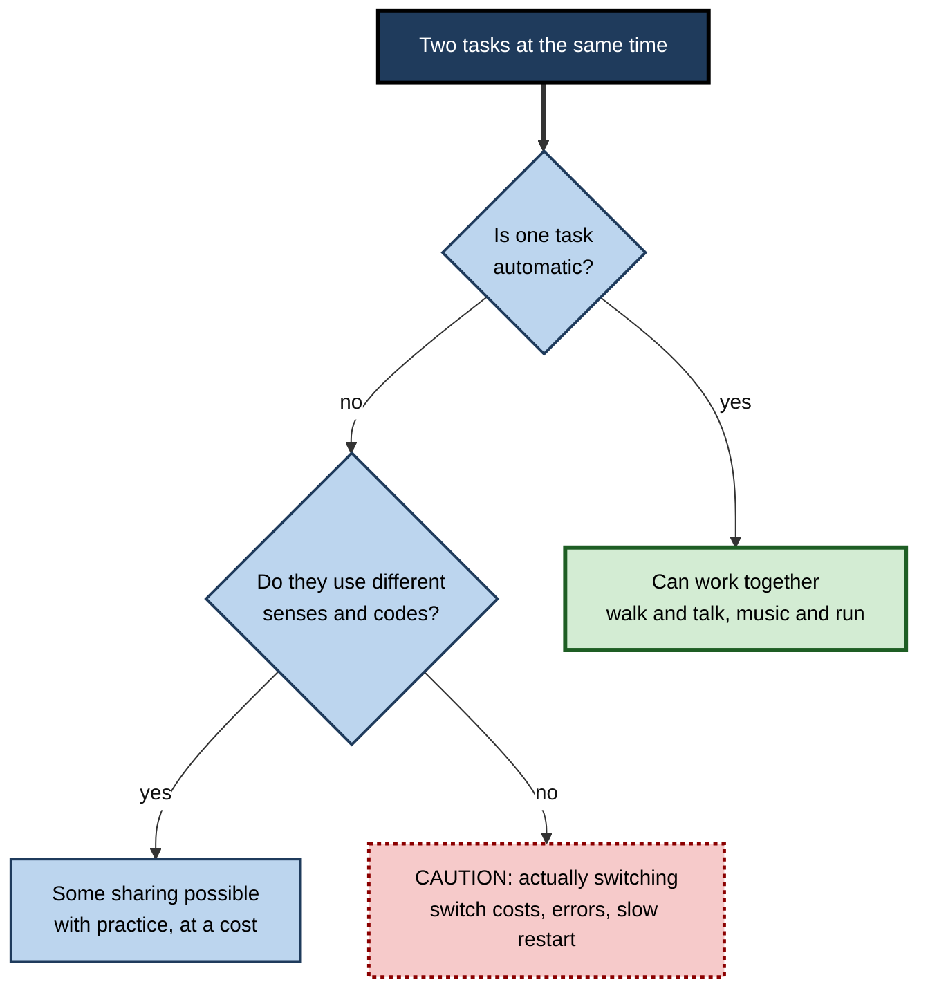
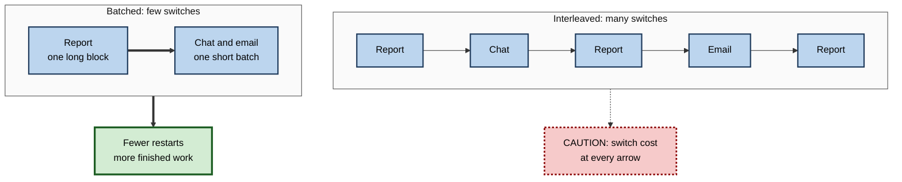

# D.5. Divided Attention and Multitasking

> **In one sentence:** Divided attention is trying to handle two or more things at once, and for anything that needs real thought, "multitasking" usually means switching quickly back and forth — paying a hidden cost in time and errors at every switch.
>
> **Why it matters:** Modern work invites constant multitasking — meetings plus chat, calls plus CRM, code plus notifications. Knowing when combining tasks works and when it quietly degrades quality lets you choose deliberately and design work that does not depend on an ability humans do not have.
>
> **Level span:** Novice → Expert · **Reading time:** ~18 min · **Builds on:** types of attention; selective attention

---

## The Learning Ladder

| Level | Badge | After this level you can... |
|---|---|---|
| 1 | NOVICE | Explain why doing two thinking tasks at once rarely works, and when it does. |
| 2 | FOUNDATIONS | Use the terms dual-task interference, task switching, switch cost and automaticity. |
| 3 | PRACTITIONER | Decide which tasks can safely be combined and restructure your day to reduce switching. |
| 4 | ADVANCED | Explain multiple resource theory, task-switching mechanisms, and the evidence on media multitasking and phone use while driving. |
| 5 | EXPERT / PRO | Design workflows, meeting norms, tools and roles that minimise harmful multitasking and support necessary concurrency. |

---

## Level 1 · Novice — The Big Picture

Can you walk and talk at the same time? Of course. Can you write an important email while following a detailed conversation? Try it and one of them suffers — usually both. The difference is that walking is **automatic** for adults; it barely needs attention. Writing and listening both need the same thinking machinery, so they compete.

When people say they are "multitasking", they usually mean one of two things:

1. **True dual-tasking** — doing two things at the same moment (walking while talking).
2. **Task switching** — rapidly alternating between tasks (email, then spreadsheet, then chat, then email).

An analogy: a single-lane bridge. Cars from both directions can use it, but only one at a time. If traffic keeps alternating, everyone slows down, because each switch needs a pause to clear the bridge. Your mind's "thinking bridge" works similarly.

You have already experienced this when you missed your motorway exit while deep in a phone conversation, or realised that a document you wrote during a meeting needed heavy editing afterwards — and you could not remember what was decided in the meeting either.

The key idea: **two automatic tasks can share attention; two thinking tasks mostly take turns, and every turn costs something.**

---

## Level 2 · Foundations — Core Concepts

### Dual-task interference

When two tasks are performed together, performance on one or both usually drops compared with doing each alone. This is **dual-task interference**. How much depends on three things:

- **Similarity:** tasks using the same senses, the same kind of mental code (words vs. images) or the same response (both needing your hands) clash more.
- **Difficulty:** harder tasks leave less to share.
- **Practice:** well-practised, automatic tasks need little attention and combine more easily.

### Task switching and switch costs

When people alternate between tasks, they are slower and make more errors on the first trial after a switch than on a repeated trial — a **switch cost**. Switch costs appear even when the switch is predictable and you have time to prepare, though preparation reduces them. A related cost, the **mixing cost**, shows that even repeat trials are slower when you are in a block where switches *could* happen: keeping two tasks "ready" is itself expensive.

**Figure D.5-1 — What actually happens when you "multitask".**

*How to read it:* answer two questions; only automatic or very different tasks combine well. Most knowledge-work multitasking lands in the dotted-border box.

### Key terms

| Term | Plain meaning |
|---|---|
| **Divided attention** | Responding to two or more demands at once. |
| **Multitasking** | Everyday word for doing several tasks concurrently, usually by switching. |
| **Dual-task interference** | Drop in performance when tasks are combined. |
| **Task switching** | Alternating between tasks with different rules or goals. |
| **Switch cost** | Extra time and errors right after switching tasks. |
| **Mixing cost** | Slowing caused by keeping multiple tasks ready, even without switching. |
| **Automaticity** | Performing a skill with little attention, through extensive practice. |
| **Media multitasking** | Using several media streams at once (video, chat, browsing). |

---

## Level 3 · Practitioner — Putting It to Work

### The combine-or-separate decision — five steps

1. **List your concurrent habits.** For example: email during meetings, chat while coding, podcasts while studying, calls while driving.
2. **Classify each task** as automatic (walking, routine data entry you have done thousands of times) or controlled (anything requiring judgement, language, learning or problem solving).
3. **Check channel overlap.** Do both tasks use language? Both need eyes on a screen? Both need your hands?
4. **Decide:**
   - automatic plus controlled with little overlap → usually fine;
   - controlled plus controlled → separate them;
   - any safety-critical task → never combine with a controlled task.
5. **Batch the rest.** Group similar small tasks (all replies, all approvals) into blocks so you pay one switch instead of twenty.

### Worked example — a sales manager's pipeline review

| | Before | After |
|---|---|---|
| **Habit** | Updates CRM notes during client calls, answers team chat in the gaps. | Takes three handwritten keywords during the call; updates CRM in a 5-minute wrap-up after each call; team chat checked at set times. |
| **Effect noticed** | Missed buying signals; CRM notes thin; next-steps unclear to the team. | More follow-up questions asked on calls; CRM notes complete; fewer "what happened on that call?" messages. |
| **Why** | Listening, writing and chat all use language; constant switching. | Listening gets full attention; writing happens in its own block. |

**Figure D.5-2 — Interleaved versus batched work.**

*How to read it:* each arrow inside a box is a switch; the interleaved row pays many switch costs, the batched row pays one.

### Common mistakes at this level

- **"I'm a good multitasker."** People who rate themselves highly at multitasking are often not better at it — some studies find the opposite.
- **Assuming hands-free equals safe.** The problem with phone calls while driving is mainly cognitive, not manual.
- **Taking notes on a laptop with everything open.** Off-task browsing in lectures and meetings hurts comprehension — and has been shown to distract people sitting nearby.
- **Batching nothing.** Answering every message as it arrives turns a day into hundreds of switches.

---

## Level 4 · Advanced — Mechanisms, Models & Evidence

### Why tasks interfere: three models

| Model | Idea | Implication |
|---|---|---|
| **Single capacity** (Kahneman, 1973) | One general pool of effort shared among tasks. | Any two hard tasks interfere. |
| **Multiple resource theory** (Christopher Wickens, 1980s onward) | Separate resource pools defined by stage (perception vs. response), modality (visual vs. auditory), code (verbal vs. spatial) and visual channel (focal vs. ambient). Tasks that draw on different pools interfere less. | Pilots can hear a radio call while watching instruments better than they can read text while watching instruments. |
| **Central bottleneck** (Harold Pashler and others) | A central response-selection stage handles one decision at a time. | Even different-modality tasks queue when both need a decision. |

These are compatible: multiple resources explain why some pairs combine better, and a central bottleneck explains why decision-making tasks still queue. (The bottleneck itself is covered in its own note.)

### What happens in a task switch

Researchers such as Robert Rogers and Stephen Monsell (1995) showed that switch costs have two parts: a **preparable** part (reconfiguring your "task set" — rules, goals, response mappings) that shrinks if you have time to prepare, and a **residual** part that remains even with ample preparation, often attributed to interference from the previous task's lingering settings. In real work, switches are not between simple rules but between whole contexts — codebases, clients, documents — so the reconfiguration is much larger.

### Media multitasking: what the evidence shows

In 2009, Eyal Ophir, Clifford Nass and Anthony Wagner reported that heavy media multitaskers performed worse at filtering irrelevant information and, surprisingly, at task switching. The finding was hugely influential but replications have been mixed. Recent meta-analyses give a more nuanced picture:

- A 2025 three-level meta-analysis (33 studies, over 36,000 participants) found a small positive correlation (around r = 0.19) between media multitasking and attention problems.
- The association is clearest for **self-reported** attention problems; associations with **performance-based** cognitive control tests are small and often non-significant.
- Heavy media multitaskers also tend to favour immediate rewards and a present-focused time perspective.
- The data are mostly correlational: people with weaker attention control may simply multitask more, rather than multitasking causing weaker control.

### Phones and driving

Research led by David Strayer and colleagues using driving simulators showed that phone conversations impair driving even when hands-free: drivers miss more signs and react more slowly, because the conversation takes cognitive attention, not just a hand. A small minority — around 2.5 percent in one well-known study — showed no measurable dual-task cost and were labelled **supertaskers**. They are rare, and most people who believe they are one are not.

### Can practice remove interference?

Extensive practice can reduce dual-task costs substantially for specific task pairs, and laboratory studies have shown near-perfect time-sharing after long training on simple tasks. But the gains are specific to the trained combination and do not create a general "multitasking skill".

### Learning while multitasking

Divided attention during study weakens encoding, which reduces later memory. Laptop multitasking studies in classrooms (Faria Sana, Tina Weston and Nicholas Cepeda, 2013) found lower comprehension for students who multitasked and for peers who could see their screens. For learning, the evidence consistently favours single-tasking.

---

## Level 5 · Expert / Pro — Professional Mastery

### Designing for concurrency without multitasking

Some roles genuinely require handling several streams: incident commanders, air traffic controllers, emergency physicians, trading desk leads. Professionals in these roles do not rely on raw divided attention; they **restructure the work**:

| Technique | How it reduces load |
|---|---|
| **Role separation** | One person communicates, another fixes, another records (incident command structure). |
| **Externalising state** | Boards, timelines and checklists hold task state so working memory does not have to. |
| **Standardised phraseology** | Fixed communication formats make one task closer to automatic. |
| **Modality design** | Critical alerts delivered by sound when eyes are busy, following multiple resource principles. |
| **Hand-off rituals** | Structured summaries when switching attention or shifts. |

### Meeting and communication norms

At team level, harmful multitasking is usually a symptom of norms: meetings where half the attendees work on laptops, chat channels that expect instant replies. Effective norms include smaller meetings with clear roles, explicit "laptops closed unless taking shared notes" agreements for decision meetings, and asynchronous updates for status reporting.

### AI and multitasking

AI assistants can either reduce or multiply switching. They help when they absorb a concurrent stream — summarising a meeting you could not attend, drafting routine replies in a batch. They hurt when they add another live channel of suggestions, pop-ups and chats to monitor. Running several AI agents in parallel can feel productive while the human reviewer becomes the bottleneck, switching between outputs and reviewing each superficially. A practical rule: **parallelise the machine work; serialise the human judgement.**

### Professional scenario

**Role:** Incident commander for a major service outage.
**Situation:** Previous incidents went badly because the most senior engineer tried to debug, update executives and coordinate the team simultaneously.
**What the pro does:** Applies incident command structure. The commander does not debug. A communications lead posts timed updates to stakeholders; a scribe keeps the timeline; two engineers investigate separate hypotheses. The commander's attention alternates on a fixed cadence between team check-ins and decisions, using the shared timeline to restore context. Post-incident reviews show faster decisions and clearer communication.

---

## Myths vs. Evidence

| Myth | What the evidence shows |
|---|---|
| "I'm good at multitasking." | Self-rated multitasking ability is a poor predictor of actual performance; true supertaskers are rare. |
| "Hands-free phone calls are safe while driving." | The main impairment is cognitive; hands-free conversation still slows reactions and reduces awareness. |
| "Multitasking makes me more productive." | For controlled tasks it adds switch costs and errors; it often feels productive because it feels busy. |
| "Heavy media multitasking has been proven to damage attention." | Associations are small and mostly correlational; causality is unclear. |
| "Women are naturally better multitaskers." | Evidence for a consistent sex difference is weak and inconsistent. |
| "Practice makes you a general multitasker." | Practice reduces costs for specific task pairs, not in general. |

## Practitioner Toolkit

**Combine-or-separate checklist**

- [ ] Is one task fully automatic for me?
- [ ] Do the tasks use different senses and different codes?
- [ ] Is either task safety-critical? (If yes, do not combine.)
- [ ] Am I trying to learn or decide something? (If yes, single-task.)
- [ ] Can I batch similar small tasks instead of interleaving them?

**Template — daily batching plan**

| Batch | Time window | Tasks included | Channels closed during deep blocks |
|---|---|---|---|
| Messages | 11:30, 15:30 | email, chat replies | |
| Approvals | 16:30 | expenses, reviews | |

## Self-Check

1. **[NOVICE]** Why can you walk and talk but not write and listen well at once?
2. **[NOVICE]** What two different things do people mean by "multitasking"?
3. **[FOUNDATIONS]** What is a switch cost? What is a mixing cost?
4. **[FOUNDATIONS]** What makes two tasks interfere more?
5. **[PRACTITIONER]** How would you decide whether to take notes on a laptop during a decision meeting?
6. **[ADVANCED]** Explain Wickens' multiple resource theory with one practical example.
7. **[ADVANCED]** What does the 2025 meta-analysis say about media multitasking and attention, and what is the key limitation?
8. **[ADVANCED]** Why are hands-free calls still risky while driving?
9. **[EXPERT / PRO]** How does incident command structure handle the need to do many things at once?
10. **[EXPERT / PRO]** What does "parallelise the machine work; serialise the human judgement" mean?

### Answer Key

1. Walking is automatic and uses little attention; writing and listening both need language processing and control, so they compete.
2. True simultaneous dual-tasking and rapid task switching.
3. Switch cost: extra time and errors right after changing tasks. Mixing cost: slowing from keeping several tasks ready even on repeat trials.
4. Similar modalities, codes or responses; high difficulty; low practice.
5. If the meeting requires attention and decisions, take minimal handwritten notes or assign a scribe, and write up afterwards; close other apps.
6. Tasks draw on separate pools (stage, modality, code, visual channel); auditory radio calls combine with visual instrument scanning better than reading text does.
7. A small positive correlation (around r = 0.19) with attention problems, clearest for self-report; limitation: mostly correlational, so direction of cause is unclear.
8. The conversation uses cognitive attention, reducing awareness and slowing reactions regardless of hands.
9. It separates roles (command, communication, investigation, recording) and externalises state on a shared timeline.
10. Let tools run work in parallel, but have humans review and decide one thing at a time with full attention.

## Key Takeaways

- For controlled tasks, **multitasking is mostly task switching**, with costs at each switch.
- Tasks combine well only if **one is automatic** or they use **different resources**.
- **Switch and mixing costs** are real even for predictable switches.
- Media-multitasking harms are **small and mostly correlational**; driving-and-phone harms are **clear**.
- **Batching** and **role separation** beat heroic multitasking.
- In the AI era, **parallelise machines, serialise human judgement.**

## Glossary

| Term | Meaning |
|---|---|
| Automaticity | Performing a skill with little attention after extensive practice. |
| Central bottleneck | A processing stage that handles one decision at a time. |
| Dual-task interference | Performance drop when two tasks are done together. |
| Incident command structure | Role-based coordination system for emergencies. |
| Media multitasking | Simultaneous use of several media streams. |
| Mixing cost | Slowing from maintaining multiple task sets. |
| Multiple resource theory | Model with separate attention resources by stage, modality, code and visual channel. |
| Supertasker | Rare individual who shows little or no dual-task cost. |
| Switch cost | Extra time and errors after changing tasks. |
| Task set | The rules, goals and response mappings configured for a task. |
| Task switching | Alternating between tasks with different rules. |
