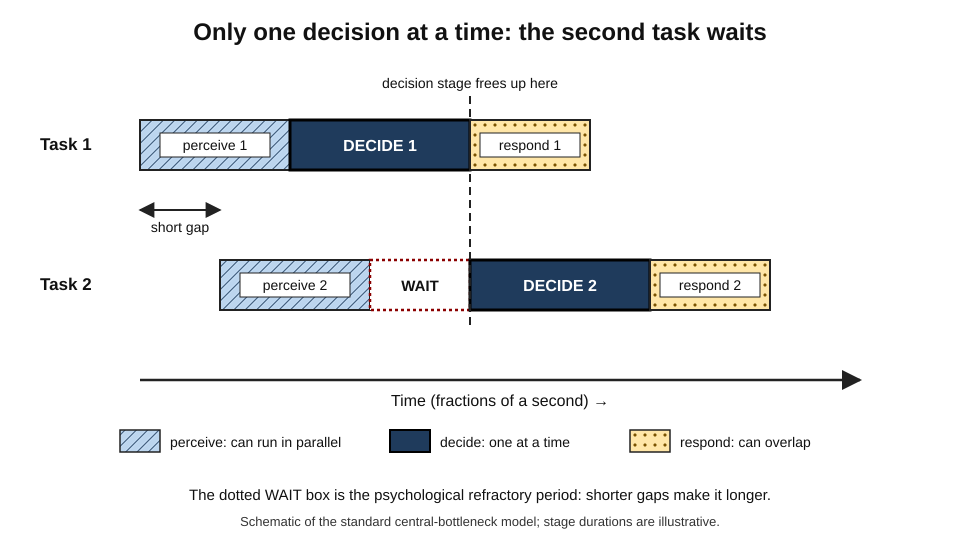
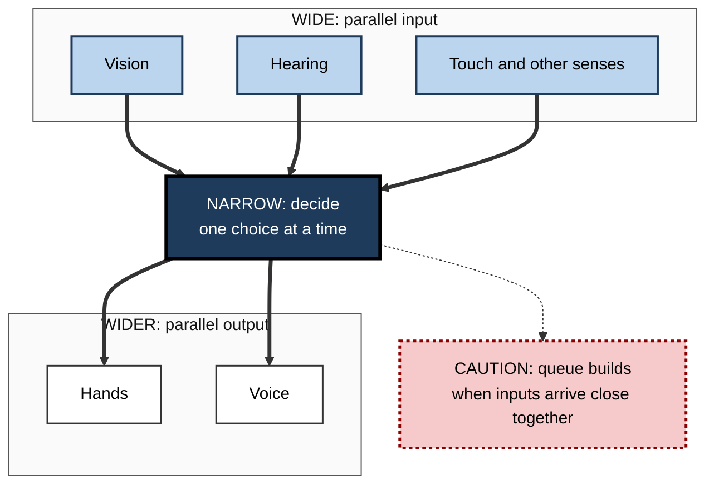
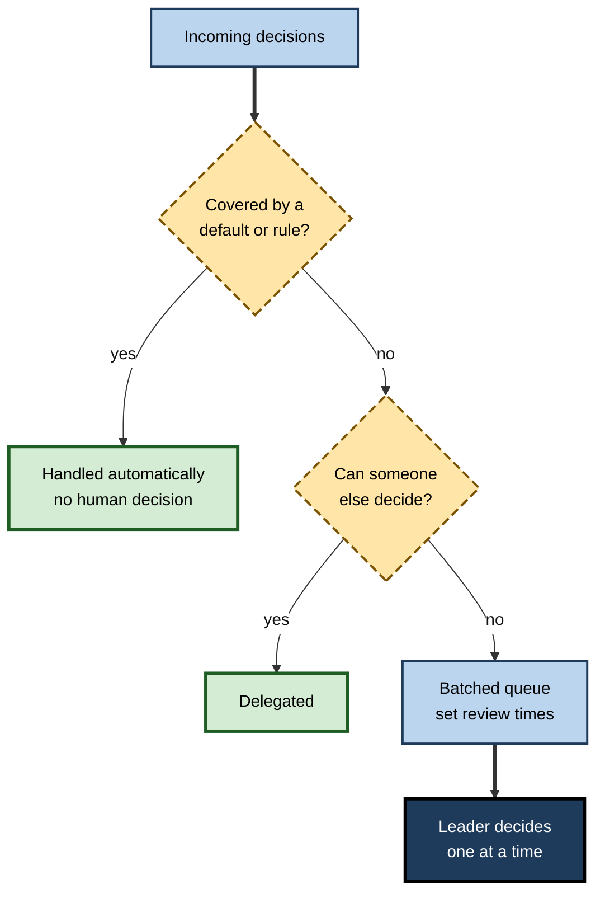

# D.6. Attentional Bottlenecks

> **In one sentence:** An attentional bottleneck is a narrow point in the mind's processing where only one thing (or a very few things) can pass at a time, so everything else has to wait its turn.
>
> **Why it matters:** Bottlenecks explain why quick decisions collide, why you miss the second of two fast events, and why piling more inputs on people slows everything down. Professionals who understand them design work, interfaces and teams so that the narrow point is never overloaded.
>
> **Level span:** Novice → Expert · **Reading time:** ~17 min · **Builds on:** selective attention; divided attention and multitasking

---

## The Learning Ladder

| Level | Badge | After this level you can... |
|---|---|---|
| 1 | NOVICE | Explain what a bottleneck is and spot one in everyday life. |
| 2 | FOUNDATIONS | Name the main attentional bottlenecks: response selection, the attentional blink, and limited capacity for holding items. |
| 3 | PRACTITIONER | Sequence decisions and information so they do not collide, and recognise when you are the bottleneck. |
| 4 | ADVANCED | Explain the psychological refractory period, central bottleneck versus capacity-sharing accounts, and the neural evidence. |
| 5 | EXPERT / PRO | Apply bottleneck thinking to interface design, decision workflows, team structure and human review of AI output. |

---

## Level 1 · Novice — The Big Picture

Think of a bottle full of water. Turn it upside down and the water does not all rush out at once — it squeezes through the narrow neck. However big the bottle, the neck sets the pace.

Your mind has necks like this. You can see and hear a lot in parallel, but some steps — especially **deciding what to do** — handle only one thing at a time. When two things arrive at that step together, one waits.

You have already experienced this when:

- Two people asked you different questions at the same moment, and you answered one while the other question "hung" until you were free.
- You were braking for a red light and someone asked whether to turn left — the answer came half a second late.
- Two notifications flashed up in quick succession and you remember the first but not the second.

The key idea: **the mind is wide at the input and narrow in the middle. Feeding it faster does not make the narrow part wider; it makes the queue longer.**

---

## Level 2 · Foundations — Core Concepts

### Where the necks are

Researchers have found several distinct points where processing narrows:

| Bottleneck | What is limited | Everyday sign |
|---|---|---|
| **Response selection** (central bottleneck) | Choosing what action to take; roughly one choice at a time. | A second quick decision is delayed when it follows close behind a first. |
| **Attentional blink** | Consciously registering a second target that appears very soon after a first. | Missing the second of two quick flashes, headlines or alerts. |
| **Holding capacity** | Keeping a few items active in mind at once (working memory). | Losing track after four or five numbers or open threads. |
| **Selection filter** | How much input gets deep processing. | Ignored conversations leave little trace. |

### The psychological refractory period

When two tasks each need a quick response and the second arrives soon after the first, the response to the second is delayed. The shorter the gap, the longer the delay. This delay is called the **psychological refractory period (PRP)**, first described by A. T. Welford in the 1950s and studied in depth by Harold Pashler and colleagues in the 1990s. The leading explanation is that the decision stage for the second task cannot start until the decision stage for the first has finished.

*Figure D.6-1 — The central bottleneck.* Each task has three stages: perceive, decide, respond. Perception and response can overlap across tasks, but the "decide" stage handles one task at a time, so Task 2 sits in a waiting gap. Schematic, based on the standard central-bottleneck model.

### The attentional blink

In experiments where items flash on a screen about ten per second, people who correctly spot one target often miss a second target appearing roughly 200–500 milliseconds later. This **attentional blink** was described by Jane Raymond, Kimron Shapiro and Karen Arnell in 1992. Curiously, a second target appearing *immediately* after the first is often caught ("lag-1 sparing"); the miss window comes just after.

### Key terms

| Term | Plain meaning |
|---|---|
| **Bottleneck** | A processing stage that can handle only one or a few items at a time. |
| **Central bottleneck** | The response-selection stage that processes one decision at a time. |
| **Psychological refractory period (PRP)** | Delay in responding to a second stimulus that follows closely after a first. |
| **Attentional blink** | Failure to report a second target shortly after a first. |
| **Stimulus onset asynchrony (SOA)** | Time gap between the start of two stimuli. |
| **Capacity limit** | The maximum load a processing system can handle. |
| **Queue** | Items waiting for a busy processing stage. |

**Figure D.6-2 — The mind is wide at the edges and narrow in the middle.**

*How to read it:* many inputs funnel into one decision stage (the dark box); when inputs arrive faster than it can process, a queue forms.

---

## Level 3 · Practitioner — Putting It to Work

### Four rules for working with your bottlenecks

1. **Serialise decisions.** When two decisions are pending, make one, then the other. Trying to "weigh both at once" mostly means flipping between them.
2. **Space critical signals.** If you design alerts, messages or slides, avoid presenting two important items within a second or two of each other.
3. **Externalise open loops.** Your holding capacity is small. Put pending items on a list or board so they do not compete for the same few slots.
4. **Reduce decision count, not just decision time.** Defaults, templates and pre-agreed rules remove decisions from the queue entirely.

### Worked example — a team lead approving requests

| | Before | After |
|---|---|---|
| **Situation** | Team lead receives approval requests (access, expenses, deploys) all day in chat, and decides each as it arrives while doing other work. | Same volume. |
| **Change** | None. | Pre-approved rules for low-risk categories; remaining requests go to a queue reviewed at three set times; each review handles one category at a time. |
| **Result** | Lead is a bottleneck for the team, constantly interrupted; some approvals are rushed, others forgotten. | Fewer decisions reach the lead; each gets full attention; team waiting time becomes predictable. |

**Figure D.6-3 — Removing items from the decision queue.**

*How to read it:* each question removes decisions before they reach the narrow point; only what remains reaches the leader, in batches.

### Common mistakes at this level

- **Thinking speed solves it.** Faster input makes queues longer; the neck does not widen.
- **Stacking alerts.** Two alerts in quick succession invite the attentional blink.
- **Holding everything in your head.** Open loops consume the few holding slots you have.
- **Becoming the single approver for everything.** A person can be an organisational bottleneck for the same reason a mind has one.

---

## Level 4 · Advanced — Mechanisms, Models & Evidence

### Early, late and central: where the bottleneck sits

The 1950s–1960s filter debate (Broadbent, Treisman, Deutsch) asked where *perceptual* selection happens. The PRP research of the 1990s located a **central bottleneck at response selection**: perception of two stimuli can proceed in parallel, and motor execution can overlap, but choosing the response is serial. Key evidence: making the *first* task's perceptual or decision stage harder delays the second response by the same amount, while making the second task's perception harder has little effect at short gaps (because that extra perceptual time is absorbed while waiting).

### Bottleneck versus capacity sharing

A competing view holds that central processing is not strictly one-at-a-time but **shared capacity**: both decisions progress, each more slowly. Evidence is mixed; many researchers now favour hybrid models in which response selection is usually serial but can be shared under some conditions, and in which people adopt serial processing as a **strategy** when it is efficient. Extensive practice can shrink the PRP for specific task pairs, sometimes dramatically, which suggests the bottleneck is partly flexible.

### Explaining the attentional blink

Accounts of the blink include limited capacity for consolidating a target into working memory (the second target arrives while the first is still being consolidated), and attentional control "overreacting" to distractors after the first target. Interestingly, the blink is reduced when people are slightly distracted or relaxed (for example, by background music or a secondary task), which supports the idea that **over-investment** of attention contributes. Meditation practitioners have shown smaller blinks in some studies.

### The neural story

Brain-imaging studies have linked the central bottleneck to a frontal–parietal network often called the **multiple-demand network**, active in many demanding tasks. A well-known fMRI study by Paul Dux, René Marois and colleagues (2006) found activity in posterior lateral prefrontal cortex that queued in time with dual-task decisions, consistent with a neural bottleneck there. The broader **global workspace** idea — that conscious access involves broadcasting one content widely across the brain at a time — is a theoretical framework that would also predict serial access.

### Holding capacity

Visual working memory studies (for example Steven Luck and Edward Vogel, 1997) and Nelson Cowan's reviews suggest people can hold roughly three to five meaningful chunks in active attention at once. The details belong to working memory; for attention, the point is that the number of things you can keep "in the spotlight of the mind" is small.

### Strength of evidence

| Claim | Status |
|---|---|
| PRP delay in dual-task decisions | Very robust, replicated for decades |
| Strict single-channel response selection | Debated; strong support but with exceptions and strategic flexibility |
| Attentional blink | Very robust; mechanisms debated |
| Practice reduces bottleneck costs | Supported for specific task pairs |
| Precise neural locus | Promising, still under study |

---

## Level 5 · Expert / Pro — Professional Mastery

### Designing interfaces around bottlenecks

| Design rule | Rationale |
|---|---|
| Never require two simultaneous decisions | Response selection is serial; the second decision is delayed or degraded. |
| Sequence critical alerts with spacing and priority | Prevents the attentional blink and queue overload. |
| Show state, do not make people remember it | Reduces holding-capacity load. |
| Provide defaults for low-stakes choices | Removes decisions from the queue. |
| Group related information into a single glance | Reduces the number of separate selections needed. |

Human-factors standards in aviation, healthcare and process control apply these ideas through alarm prioritisation, alarm flooding limits and one-action-per-screen workflows in critical procedures.

### Organisations as bottleneck systems

Bottleneck thinking scales from minds to teams. In operations management, the **theory of constraints** (Eliyahu Goldratt) holds that a system's throughput is set by its narrowest step. In knowledge work, that step is often a person's attention: the senior engineer who reviews every change, the partner who signs every deliverable, the manager who approves every expense. Adding more work upstream does not help; it lengthens the queue. Professionals **protect, offload and widen** the human constraint: give it only decisions that need it, standardise the rest, and develop more people who can decide.

### AI and the human bottleneck

AI tools and agents dramatically widen the input side: more drafts, more code, more options, faster. Human judgement — reading, verifying, deciding — remains a serial bottleneck. Without design, teams experience **review overload**: queues of AI output, superficial checks, and the illusion of speed. Pro responses:

- Generate fewer, better options rather than many.
- Ask AI to rank, summarise risks and flag uncertainty, so the human decides once, not many times.
- Automate verification where possible (tests, validators) so humans review exceptions.
- Track review queue length and age as a health metric, just like a production queue.

### Professional scenario

**Role:** Director of a consulting practice.
**Situation:** Since the team adopted AI drafting, the volume of client deliverables awaiting partner review has doubled; turnaround time is rising and two errors reached clients.
**What the pro does:** Identifies partner attention as the constraint. Introduces a tiered review: AI-assisted self-checks against a checklist, then senior consultant review, with partners seeing only a one-page decision memo and flagged risks. Limits partner review to two scheduled blocks per day. Tracks queue age and client-reported errors. Turnaround stabilises and errors fall.

---

## Myths vs. Evidence

| Myth | What the evidence shows |
|---|---|
| "If I process things faster, I can handle more at once." | Speeding input lengthens the queue at the serial stage; it does not widen it. |
| "I can make two decisions simultaneously." | Response selection is largely serial; the second decision waits. |
| "Missing a second alert means I wasn't paying attention." | The attentional blink affects attentive people; it is a timing limit. |
| "More AI output means more productivity." | If human review is the constraint, more output increases queues and superficial checking. |
| "Bottlenecks are fixed and can't change." | Practice, strategy and design can reduce bottleneck costs considerably. |

## Practitioner Toolkit

**Bottleneck checklist**

- [ ] Are two decisions being asked of me at the same moment? Serialise them.
- [ ] Are open loops written down rather than held in mind?
- [ ] Are low-stakes decisions covered by defaults or rules?
- [ ] Are critical alerts spaced and prioritised?
- [ ] Do I know my team's human constraint, and is its queue visible?

**Template — decision queue audit (one week)**

| Decision type | Count | Could be a rule? | Could be delegated? | Batched review time |
|---|---|---|---|---|
| | | | | |

## Self-Check

1. **[NOVICE]** What is a bottleneck, in your own words?
2. **[NOVICE]** Give an everyday example of a mental bottleneck.
3. **[FOUNDATIONS]** What is the psychological refractory period?
4. **[FOUNDATIONS]** What is the attentional blink, and roughly when does it occur?
5. **[PRACTITIONER]** Name three ways to reduce how many decisions reach a busy person.
6. **[ADVANCED]** What evidence supports a central bottleneck at response selection?
7. **[ADVANCED]** How does capacity sharing differ from a strict bottleneck?
8. **[EXPERT / PRO]** How does the theory of constraints relate to attention in teams?
9. **[EXPERT / PRO]** Why can AI tools create review overload, and how would you prevent it?

### Answer Key

1. A narrow processing step that can handle only one or a few things at a time, so others wait.
2. Two people asking questions at once; braking while being asked for directions.
3. A delay in responding to a second stimulus that follows a first one closely; shorter gaps cause longer delays.
4. Failure to notice a second target roughly 200–500 milliseconds after a first.
5. Defaults and rules, delegation, batching into set review times (also: templates, pre-approval).
6. Lengthening the first task's decision stage delays the second response equally, while lengthening the second task's perception at short gaps adds little, as expected if the second decision waits.
7. Capacity sharing says both decisions progress at once but more slowly; a strict bottleneck says one waits entirely.
8. A system's throughput is set by its narrowest step; often that is a key person's attention, so it must be protected and offloaded.
9. AI widens input faster than humans can judge; prevent by fewer, ranked outputs, automated verification, tiered review and tracking queue length.

## Key Takeaways

- The mind is **wide at input, narrow at decision**; the narrow point sets the pace.
- The **PRP** and the **attentional blink** are robust signatures of bottlenecks.
- **Serialise decisions**, **space signals**, **externalise open loops**, **remove decisions** with defaults.
- Bottlenecks are **partly flexible** with practice and strategy, but never disappear.
- Teams have **human constraints** too; AI widens input but not judgement.

## Glossary

| Term | Meaning |
|---|---|
| Attentional blink | Missing a second target shortly after a first. |
| Bottleneck | Processing stage limited to one or a few items at a time. |
| Capacity sharing | View that concurrent tasks share central processing at reduced speed. |
| Central bottleneck | Serial response-selection stage. |
| Global workspace | Theory that conscious access broadcasts one content widely at a time. |
| Lag-1 sparing | Detecting a second target that immediately follows the first. |
| Multiple-demand network | Frontal–parietal brain network active across demanding tasks. |
| Psychological refractory period | Delay in the second of two closely timed responses. |
| Response selection | Choosing which action to take. |
| Stimulus onset asynchrony | Time between the onsets of two stimuli. |
| Theory of constraints | Management idea that throughput is set by the narrowest step. |
