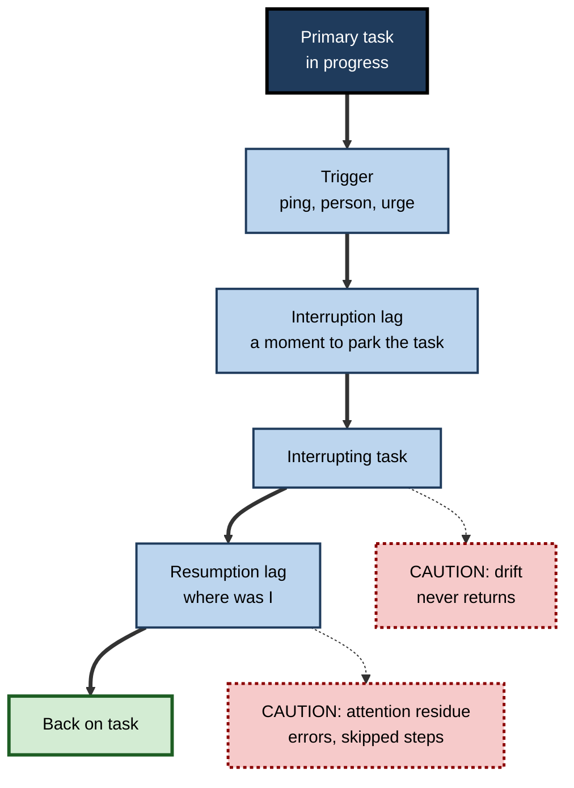
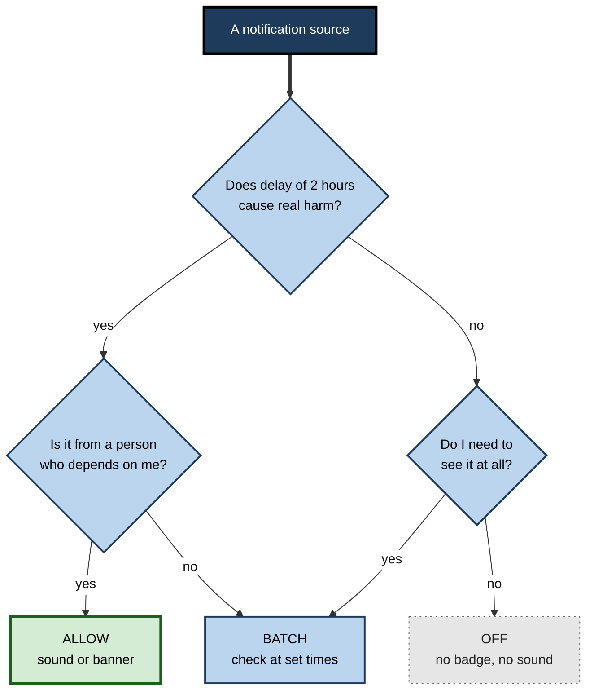

# D.7. Distraction and Digital Interruptions

> **In one sentence:** Distractions pull your attention away from what you meant to do, and interruptions stop your task altogether — and digital tools now deliver both every few minutes, each leaving a cost that lasts after you return.
>
> **Why it matters:** For most knowledge workers, interruptions are the single biggest everyday threat to focused work. Understanding what they really cost, and which countermeasures work, is one of the highest-return attention skills for individuals and teams.
>
> **Level span:** Novice → Expert · **Reading time:** ~19 min · **Builds on:** selective attention; divided attention and multitasking

---

## The Learning Ladder

| Level | Badge | After this level you can... |
|---|---|---|
| 1 | NOVICE | Tell a distraction from an interruption and notice the hidden cost of "just checking". |
| 2 | FOUNDATIONS | Explain resumption lag, attention residue, self-interruption and why notifications capture attention. |
| 3 | PRACTITIONER | Set up a personal interruption-management system: notification triage, batching and resumption notes. |
| 4 | ADVANCED | Use the memory-for-goals model and interruption-timing research, and judge popular statistics critically. |
| 5 | EXPERT / PRO | Design team communication norms, tools and policies that reduce interruption cost without losing responsiveness. |

---

## Level 1 · Novice — The Big Picture

You sit down to write a report. Two minutes in, your phone buzzes. You glance at it — a sale on shoes. You return to the report, but where were you? You reread the last paragraph. Then a chat message arrives. Then you remember you needed to reply to an email, so you "quickly" do that. Twenty minutes later, the report has three new sentences.

Two different things were happening:

- **Distraction** — something pulls your attention away while you are still nominally on the task (a noise, a glance at a notification).
- **Interruption** — the task is actually suspended while you do something else (answering a call, replying to a message), and later you have to resume it.

A helpful analogy: you are building a tall tower of blocks. A distraction is someone bumping the table — the tower wobbles. An interruption is leaving the room — when you come back, you have to remember what you were building and some blocks may have fallen.

You have already experienced this when you returned to a half-written email and had no idea what the next sentence was going to be, or when you picked up your phone to check one thing and found yourself fifteen minutes into something else.

The key idea: **the cost of an interruption is not the seconds it takes — it is the time and quality lost getting back.**

---

## Level 2 · Foundations — Core Concepts

### The real cost of an interruption

When you resume an interrupted task, you pay several costs:

1. **Resumption lag** — the time it takes to get going again, rebuilding where you were.
2. **Errors** — interrupted tasks show more mistakes, especially skipped or repeated steps.
3. **Attention residue** — part of your mind stays on the interrupting task. Sophie Leroy (2009) showed that people who switched away from an unfinished task performed worse on the next task, because thoughts about the first one lingered.
4. **Task drift** — one interruption leads to another, and you may not return to the original task for a long time.

### How fragmented has work become?

Two well-measured data points describe the modern environment:

- Gloria Mark's observational studies of information workers, using computer logging over almost two decades, found the average time spent on one screen before switching fell from about two and a half minutes in the mid-2000s to roughly 47 seconds in recent studies.
- Microsoft's 2025 Work Trend Index, based on aggregated workplace telemetry, reported that during core working hours, employees were interrupted by a meeting, email or chat roughly every two minutes on average.

A widely quoted figure says it takes "23 minutes to refocus" after an interruption. It comes from Mark's field observations of how long it took, on average, to return to an interrupted task — often after doing *other* tasks in between. It is not a laboratory measure of how long it takes to refocus, and it varies widely.

### Self-interruptions

Not all interruptions come from outside. Mark's research and others have found that a large share of switches are **self-interruptions** — you decide to check email, open a news site or pick up your phone without any external prompt. Internal triggers include boredom, difficulty, anxiety and habit. External interruptions also seem to train self-interruption: in environments with frequent pings, people begin checking on their own.

**Figure D.7-1 — The life cycle of an interruption.**

*How to read it:* the thick path is a normal interruption; the dotted arrows are the hidden costs. A short interruption lag (parking the task well) shortens the resumption lag.

### Why notifications are so hard to ignore

- **Salience:** sound, vibration, movement and red badges are designed to capture bottom-up attention.
- **Variable reward:** sometimes a message is important or pleasant, sometimes not. Unpredictable rewards produce strong, persistent checking habits.
- **Social obligation:** a message from a person feels like it requires a reply.
- **Unfinished business:** an unread badge is an open loop that competes for attention.

Even a notification you do not act on has a cost. In a 2015 study by Cary Stothart and colleagues, simply receiving phone notifications during an attention task increased errors, comparable in size to the effect of actually using the phone — probably because the alert triggered task-unrelated thinking.

### Key terms

| Term | Plain meaning |
|---|---|
| **Distraction** | Something that pulls attention away while you remain on the task. |
| **Interruption** | An event that suspends the primary task. |
| **Self-interruption** | Switching away from a task without an external trigger. |
| **Resumption lag** | Time needed to restart an interrupted task. |
| **Attention residue** | Lingering thoughts about a previous task that impair the next one. |
| **Interruption lag** | Time between the trigger and starting the interrupting task — a chance to park your work. |
| **Breakpoint** | A natural boundary in a task, where interruptions cost less. |

---

## Level 3 · Practitioner — Putting It to Work

### A personal interruption-management system — six steps

1. **Triage notifications.** Go through every app. Keep notifications only for things that are both *time-critical* and *from people who need you*. Turn off badges and sounds for everything else.
2. **Batch communication.** Check email and chat at set times (for example, three to five times a day) rather than continuously. Field research by Kostadin Kushlev and Elizabeth Dunn (2015) found people who checked email three times a day reported less daily stress than those who checked whenever they liked.
3. **Signal your state.** Use status messages and calendar blocks so others know when you are focusing and when you will respond.
4. **Use breakpoints.** When you must stop, try to stop at a natural boundary — end of a paragraph, after a test passes.
5. **Park the task.** Before switching, spend 20–30 seconds writing a "where I left off and what's next" note. This shortens the resumption lag and reduces residue.
6. **Catch self-interruptions.** When you feel the urge to check, write the urge down on a scrap list and return to the task. Check the list at the next batch time.

### Worked example — a software developer's afternoon

| | Before | After |
|---|---|---|
| **Set-up** | Chat, email, calendar and phone notifications all on; IDE plus browser with 20 tabs. | Notifications only for on-call pages and direct messages from the manager; chat status set to "focusing until 15:00". |
| **Interruptions** | Constant; checks chat every few minutes even without pings. | Checks chat at 13:00, 15:00, 17:00. |
| **On switching** | Leaves code mid-thought. | Writes a one-line "next: handle null user case in validator" comment before every switch. |
| **Result** | Feature takes three afternoons; two regressions in review. | Feature done in two afternoons; resumption feels faster; no regressions. |

**Figure D.7-2 — Notification triage: what should be allowed to interrupt you?**

*How to read it:* most sources end in BATCH or OFF; only time-critical messages from people who depend on you are allowed to interrupt.

### Common mistakes at this level

- **Relying on willpower with notifications on.** Even unread alerts cost attention.
- **Phone face-down next to you.** Better than face-up, but out of sight and out of reach is better still for demanding tasks.
- **Batching that never happens.** Set the times and keep them; otherwise anxiety drives continuous checking.
- **Switching mid-thought.** Without a parking note, much of the thought is lost.

---

## Level 4 · Advanced — Mechanisms, Models & Evidence

### Memory for goals

Erik Altmann and Gregory Trafton's **memory-for-goals model** (2002) explains why interruptions are costly. Your current goal ("write the paragraph about pricing") is a memory item that must stay highly active to guide behaviour. Activation decays over time and competes with other goals. During an interruption, the original goal decays and the interrupting goal becomes active. Resuming means reactivating the old goal — using cues in the environment and rehearsal. Practical predictions, all supported by research:

- **Longer** interruptions cause longer resumption lags.
- **More complex or similar** interrupting tasks cause more interference.
- **Rehearsing or cueing** the goal before switching (the parking note) speeds resumption.
- **Visible cues** on return (cursor position, highlighted line) help.

### Timing: breakpoints

Research by Shamsi Iqbal, Brian Bailey and others in human–computer interaction showed that interruptions at **coarse breakpoints** (between subtasks) produce lower resumption lag, less frustration and lower physiological workload than interruptions in the middle of a subtask. This led to tools that defer notifications until a natural break.

### The mere presence of a phone: what replicated

In 2017, Adrian Ward and colleagues reported a "brain drain" effect: the mere presence of one's smartphone, even switched off, reduced available cognitive capacity. Later meta-analyses tempered this. A 2023–2024 meta-analysis of 56 studies (about 7,000 participants) found only one significant pooled effect — a small negative effect on working memory capacity — and null effects for other cognitive functions, with notable heterogeneity and low statistical power across the literature. Bottom line: **putting the phone in another room is a sensible low-cost habit, but the effect of mere presence is smaller than first claimed.**

### What about school and workplace phone bans?

Restricting phones is popular policy. Evidence is mixed: some studies associate restrictions with fewer distractions, while a 2025 study of English secondary schools found no clear difference in wellbeing or attainment between schools with restrictive and permissive phone policies, though overall phone and social-media time was associated with worse outcomes. Policy design and actual use matter more than the existence of a rule.

### Evidence summary

| Claim | Status |
|---|---|
| Interruptions increase time and errors | Robust across lab and field |
| Interrupting at breakpoints reduces cost | Well supported |
| Attention residue impairs the next task | Supported; size varies |
| Notifications cost attention even unanswered | Supported in several studies |
| Mere phone presence drains capacity | Small effect on working memory; weaker than first reported |
| "23 minutes to refocus" | Misquoted field average; not a fixed cost |
| Batching email reduces stress | Supported in field experiments; productivity effects less clear |

---

## Level 5 · Expert / Pro — Professional Mastery

### Interruption cost is a team design problem

Most interruptions come from colleagues and systems, so the biggest gains come from **team norms**, not individual heroics.

| Norm | What it looks like |
|---|---|
| **Response-time agreements** | "Chat replies within 2 hours; email within 1 day; urgent issues by phone or page." |
| **Asynchronous by default** | Status updates and FYIs written in shared documents, not meetings or pings. |
| **Protected focus time** | Team-wide meeting-free blocks; calendar and chat show focus state. |
| **Urgent channel discipline** | One clearly defined path for genuine emergencies, so everything else can wait safely. |
| **Message quality** | Complete messages that need no back-and-forth ("no hello" — state the request in the first message). |

### Tooling choices

- Configure collaboration tools so **"do not disturb" is easy and visible**, with scheduled notification digests.
- Use **notification bundling** and quiet hours.
- Build **resumption support**: tools that restore context — recent files, last position, a summary of what changed.
- AI assistants can triage inboxes, summarise threads and draft digests, turning dozens of interruptions into one batch. They can also generate *more* pings (automated updates, agent messages). Every AI integration should have an interruption budget.

### Measuring interruption load

Professionals measure, not guess: calendar fragmentation (number of uninterrupted blocks of 90+ minutes per week), messages received per hour during core hours, after-hours message volume, and self-reported focus. These are tracked at team level, with privacy safeguards, never as individual surveillance.

### Professional scenario

**Role:** Chief of staff at a 300-person software company.
**Situation:** Engagement surveys show "too many interruptions" as the top complaint; telemetry shows few uninterrupted blocks.
**What the pro does:** Runs a six-week pilot in two departments: response-time agreements, an "urgent" channel with a clear definition, default 25- and 50-minute meetings, two focus mornings per week, and AI-generated daily digests replacing several status channels. Measures focus blocks, cycle time, after-hours messaging and survey scores, against two comparison departments. The pilot departments show more focus blocks and lower after-hours messages; the company rolls the norms out with adjustments.

### Ethical limits

Interruption reduction must not become a reason to make people unreachable when they are genuinely needed, nor to monitor individuals' screen activity. Design for both responsiveness and focus, transparently.

---

## Myths vs. Evidence

| Myth | What the evidence shows |
|---|---|
| "A quick check costs a few seconds." | The cost includes resumption lag, errors and attention residue, far beyond the check itself. |
| "It always takes 23 minutes to refocus." | That figure is a field average of time before returning to an interrupted task; it is not a fixed refocusing cost. |
| "If I don't open the notification, it doesn't affect me." | Unanswered notifications still increase errors on attention tasks. |
| "Just having my phone nearby destroys my thinking." | Meta-analyses show a small effect, mainly on working memory; still worth moving it away for demanding work. |
| "Most interruptions come from other people." | A large share are self-interruptions driven by habit, boredom or difficulty. |
| "Faster replies mean better teams." | Constant responsiveness fragments attention; agreed response times protect both focus and reliability. |

## Practitioner Toolkit

**Interruption-management checklist**

- [ ] Every app notification reviewed: allow, batch or off.
- [ ] Communication batch times set and visible in my calendar.
- [ ] Focus state signalled to colleagues.
- [ ] Phone out of sight and reach during demanding work.
- [ ] Parking note written before every switch.
- [ ] Urge list beside me to capture self-interruptions.

**Template — parking note (30 seconds)**

| Field | Example |
|---|---|
| Task | Pricing section of Q4 proposal |
| Where I stopped | Finished tier comparison table |
| Next action | Write rationale for enterprise discount |
| Open question | Confirm minimum seats with sales lead |

## Self-Check

1. **[NOVICE]** What is the difference between a distraction and an interruption?
2. **[NOVICE]** Why is the cost of an interruption larger than its duration?
3. **[FOUNDATIONS]** What is attention residue?
4. **[FOUNDATIONS]** What is a self-interruption, and what triggers it?
5. **[PRACTITIONER]** Describe the notification triage rule.
6. **[PRACTITIONER]** What goes in a parking note and why does it help?
7. **[ADVANCED]** Explain the memory-for-goals model in three sentences.
8. **[ADVANCED]** What did meta-analyses find about the "brain drain" effect of phone presence?
9. **[EXPERT / PRO]** Name four team norms that reduce interruption cost.
10. **[EXPERT / PRO]** How would you measure interruption load without surveilling individuals?

### Answer Key

1. A distraction pulls attention while you stay on the task; an interruption suspends the task.
2. Because of resumption lag, increased errors, attention residue and drift to other tasks.
3. Lingering thoughts about a previous, often unfinished, task that impair performance on the next one.
4. Switching away without an external cue; triggered by boredom, difficulty, anxiety or habit.
5. Allow only time-critical items from people who depend on you; batch other things you need; switch off the rest.
6. Where you stopped, the next action and open questions; it rehearses and externalises the goal, speeding resumption.
7. Current goals are memory items whose activation decays. Interruptions let the goal decay while another becomes active. Resuming requires reactivation, aided by rehearsal and cues.
8. Only a small negative effect on working memory capacity; other functions showed null effects; the literature is heterogeneous and underpowered.
9. Response-time agreements, asynchronous defaults, protected focus time, a defined urgent channel (also complete messages).
10. Aggregated, team-level metrics: uninterrupted blocks per week, messages per hour, after-hours messages, focus surveys.

## Key Takeaways

- **Interruptions cost far more than their duration**: resumption lag, errors, residue, drift.
- Digital work is highly **fragmented** — attention on one screen averages under a minute in recent measurements.
- **Self-interruptions** are a large share; capture urges instead of acting on them.
- **Triage, batch, signal, park**: the core personal system.
- Phone presence effects are **smaller than first claimed**, but moving the phone is still cheap and sensible.
- The biggest gains come from **team norms and tool design**, measured at team level.

## Glossary

| Term | Meaning |
|---|---|
| Attention residue | Lingering thoughts about a prior task that impair the current one. |
| Breakpoint | Natural boundary between subtasks. |
| Distraction | A pull on attention without suspending the task. |
| Interruption | An event that suspends the primary task. |
| Interruption lag | Time between an interruption trigger and switching away. |
| Memory-for-goals model | Model in which goals are memory items whose activation decays. |
| Notification triage | Sorting notification sources into allow, batch or off. |
| Resumption lag | Time to restart an interrupted task. |
| Self-interruption | Switching away without an external trigger. |
| Variable reward | Unpredictable reward that drives persistent checking. |
