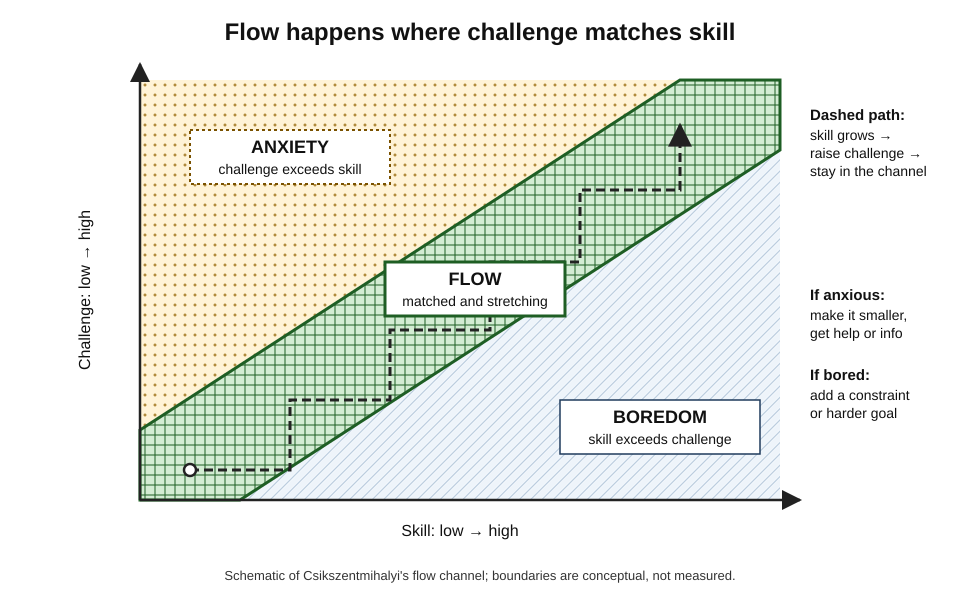
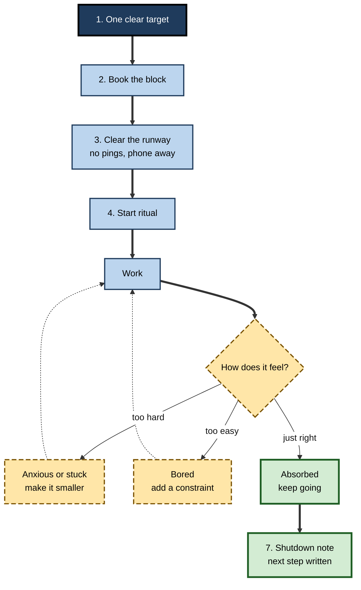
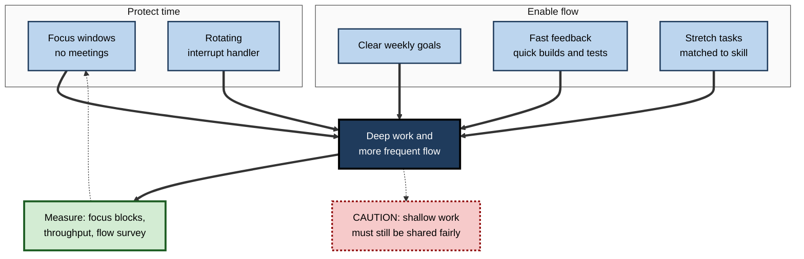

# D.8. Deep Work and Flow State

> **In one sentence:** Deep work is long, undistracted concentration on a demanding task, and flow is the absorbed state — "being in the zone" — that sometimes arises when a challenge matches your skill and nothing breaks your focus.
>
> **Why it matters:** The most valuable professional output — designs, analyses, code, strategy, writing — comes from sustained, high-quality concentration. People and teams who can reliably create the conditions for deep work and flow produce better work in less time, and usually enjoy it more.
>
> **Level span:** Novice → Expert · **Reading time:** ~19 min · **Builds on:** sustained attention; distraction and interruptions

---

## The Learning Ladder

| Level | Badge | After this level you can... |
|---|---|---|
| 1 | NOVICE | Describe deep work and flow and recognise when you have experienced them. |
| 2 | FOUNDATIONS | Name the conditions for flow and the difference between deep and shallow work. |
| 3 | PRACTITIONER | Plan and run deep-work sessions that make flow more likely. |
| 4 | ADVANCED | Evaluate the evidence on flow (measurement, neuroscience, performance links) and on deep-work practices, including what is contested. |
| 5 | EXPERT / PRO | Design team schedules, roles and AI-assisted workflows that protect deep work and support flow at scale. |

---

## Level 1 · Novice — The Big Picture

Remember a time when you were so absorbed in something — a game, a piece of music, a puzzle, a piece of work — that you lost track of time. You were not straining to concentrate; it felt effortless. Hours passed like minutes. That experience is called **flow**, a term coined by psychologist Mihaly Csikszentmihalyi.

**Deep work** is a related but different idea, popularised by computer scientist Cal Newport in 2016: professional activity performed in a state of distraction-free concentration that pushes your abilities to their limit. Deep work is something you *schedule and protect*; flow is something that may *happen* during it.

An analogy: deep work is clearing a runway and lining up the plane; flow is the moment the plane lifts off. You cannot force take-off, but without the runway it is very unlikely.

You have already experienced flow if you have ever been surprised that it was dark outside when you looked up from your work. You have experienced the opposite — **shallow work** — on days filled with emails, quick replies and meetings, where you felt busy all day and produced nothing you are proud of.

The key idea: **you cannot order flow on demand, but you can reliably build the conditions that make it likely.**

---

## Level 2 · Foundations — Core Concepts

### Deep work versus shallow work

| | Deep work | Shallow work |
|---|---|---|
| **Demands** | High concentration, uses your best skills | Low concentration, logistical |
| **Interruptions** | Damaged badly | Barely affected |
| **Value** | Creates new value, hard to replicate | Easy to replicate or delegate |
| **Examples** | Designing an architecture, writing a strategy, complex analysis | Scheduling, routine email, status updates |

Shallow work is not worthless — someone has to do it — but it expands to fill every unprotected hour.

### The conditions for flow

Csikszentmihalyi's research, based on interviews and **experience sampling** (beeping people at random moments to report what they were doing and feeling), identified recurring characteristics. Three are usually treated as *preconditions*:

1. **Clear goals** — you know what you are trying to do next.
2. **Immediate feedback** — you can tell how you are doing as you go.
3. **Challenge–skill balance** — the task stretches you slightly but is achievable.

Others describe the *experience* itself: deep concentration, a merging of action and awareness, a sense of control, loss of self-consciousness, altered sense of time, and the activity feeling rewarding in itself (**autotelic**).

*Figure D.8-1 — The flow channel.* When challenge greatly exceeds skill, people feel anxious; when skill greatly exceeds challenge, they feel bored. Flow occurs in the channel where the two are matched and both are reasonably high. The dashed path shows a learner staying in flow by raising the challenge as skill grows. Schematic of Csikszentmihalyi's model.

### Key terms

| Term | Plain meaning |
|---|---|
| **Deep work** | Distraction-free concentration on cognitively demanding tasks. |
| **Shallow work** | Logistical, low-concentration tasks, often done while distracted. |
| **Flow** | A state of full absorption in an activity, with focused attention and intrinsic enjoyment. |
| **Challenge–skill balance** | The match between how hard a task is and how capable you are. |
| **Autotelic** | Rewarding in itself, done for its own sake. |
| **Experience sampling** | Research method that prompts people at random times to report their current state. |

---

## Level 3 · Practitioner — Putting It to Work

### Running a deep-work session — seven steps

1. **Choose one meaningful target.** "Draft the data-model section", not "work on the project".
2. **Book the block.** Start with 60–90 minutes; extend as your stamina grows. Put it in your calendar as a real appointment.
3. **Prepare the runway.** Gather materials, close everything else, silence notifications, put the phone in another room, tell colleagues when you are reachable.
4. **Use a start ritual.** Same place, same cue (a coffee, a playlist, writing the target on paper). Rituals reduce the friction of starting.
5. **Tune the challenge.** If anxious or stuck, break the task smaller or get the missing information. If bored, add a constraint: a time target, a quality bar, a harder version.
6. **Create feedback.** Run the tests, check progress against an outline, track word or problem count — anything that shows progress during the session.
7. **Close with a shutdown note.** Write where you stopped and the next step, so tomorrow's session starts fast and today's residue fades.

**Figure D.8-2 — The deep-work session cycle.**

*How to read it:* the thick path is a session; dotted arrows show how to adjust challenge to move back toward flow.

### Worked example — a data scientist building a churn model

| | Before | After |
|---|---|---|
| **Schedule** | Model work squeezed between meetings in 30-minute gaps. | Two 2-hour deep blocks on Tuesday and Thursday mornings, calendar-protected. |
| **Session** | Starts by checking Slack; spends the first 15 minutes reloading context. | Starts with yesterday's shutdown note; target written on a sticky note; notebook already open at the right cell. |
| **Challenge** | Swings between stuck (missing data definitions) and bored (re-running cleaning scripts). | Missing definitions gathered in a shallow-work slot beforehand; cleaning automated so sessions focus on modelling choices. |
| **Outcome** | Model takes five weeks; feels like a grind. | Model done in three weeks; she reports several absorbed sessions. |

### Common mistakes at this level

- **Expecting flow every session.** Flow is a bonus, not the measure of success. A focused session without flow still counts.
- **Blocks too short.** Under about 45 minutes, much of the block goes on start-up.
- **No feedback.** Without visible progress, attention drifts.
- **Treating all work as deep.** Batch shallow work deliberately so it does not leak into deep blocks.
- **Over-scheduling deep work.** Most people can sustain only a few hours of truly deep work per day; beyond that, quality drops.

---

## Level 4 · Advanced — Mechanisms, Models & Evidence

### How flow is measured

Flow research uses several methods, each with limits:

| Method | Strength | Limitation |
|---|---|---|
| Experience sampling | Real-life, in-the-moment reports | Interrupting flow to measure it can break it |
| Post-task questionnaires (e.g., Flow Short Scale, Flow State Scale) | Easy, standardised | Retrospective, influenced by outcome |
| Experimental manipulation of difficulty | Causal control over challenge–skill balance | Artificial tasks (games, arithmetic) |
| Physiology and wearables | Objective signals, continuous | No single reliable "flow signature" yet |

Recent work (2025) has explored wearable physiological markers of flow such as heart-rate variability patterns, with promising but early results.

### The neuroscience: promising, not settled

Arne Dietrich's **transient hypofrontality hypothesis** (2004) proposed that flow involves temporarily reduced activity in parts of the prefrontal cortex associated with self-monitoring and explicit control, letting well-practised skills run smoothly. Some EEG and imaging studies — including recent ones in musicians and in game-based tasks — report findings consistent with reduced dorsolateral prefrontal involvement or with changes in alpha and theta activity during flow. A systematic review of the brain basis of flow (2022) found the literature small and heterogeneous, with inconsistent findings across tasks and methods. Other studies emphasise increased engagement of reward and attention networks. **Treat specific neural claims about flow as hypotheses**, not established facts — and be sceptical of products claiming to "hack" flow via the brain.

### Flow and performance

Flow is consistently associated with higher performance and well-being, but much of the evidence is correlational: skilled people doing well may experience more flow, rather than flow causing better performance. The challenge–skill balance itself is well supported as a predictor of engagement. A key nuance from work psychology: flow tends to occur more at work than in passive leisure such as watching television, yet people often report wanting to be elsewhere while working — a "paradox of work" Csikszentmihalyi highlighted.

### The evidence for deep work

"Deep work" is a practitioner concept, not a research construct, and has not been tested as a package. Its components rest on solid evidence: interruptions harm complex tasks; switching carries costs; attention residue lingers; sustained practice builds expertise. Claims such as fixed **90-minute "ultradian" focus cycles** are widely repeated but rest on weak evidence for knowledge work; treat block length as something to calibrate personally.

### Boundary conditions

- **Flow is not always good.** People can experience flow in compulsive gaming or gambling; absorption can crowd out breaks, sleep and broader judgement.
- **Flow can reduce self-monitoring**, which can increase errors in tasks that need careful checking. Review work after a flow session.
- **Novices find flow harder** in complex domains because challenge vastly exceeds skill; structured, scaffolded tasks help.

---

## Level 5 · Expert / Pro — Professional Mastery

### Designing teams for deep work

| Practice | Description |
|---|---|
| **Maker and manager schedules** | Paul Graham's distinction: makers need half-day blocks; managers work in hour slots. Cluster meetings so makers keep long blocks. |
| **Team focus windows** | Shared meeting-free mornings or days. |
| **Role rotation for interruptions** | One "interrupt handler" per day absorbs support questions so others can go deep. |
| **Clear goals per sprint or week** | Flow requires knowing what "next" is; ambiguity breaks it. |
| **Fast feedback loops** | Quick builds, tests, previews and data refreshes keep the flow precondition of immediate feedback. |
| **Right-sized challenge** | Assign stretch tasks matched to skill, with support. |

**Figure D.8-3 — A team system that protects deep work.**

*How to read it:* protected time and flow enablers feed deep work (thick arrows); measurement feeds back into the protections (dotted); the dotted-border box is the fairness risk.

### Flow and learning design

Learning designers apply the flow channel to training: adaptive difficulty, clear micro-goals and immediate feedback. Games-based learning uses it explicitly. The risk is confusing enjoyment with learning; flow during easy practice can coexist with weak long-term retention. Pair flow-friendly practice with effortful retrieval and delayed checks.

### AI and deep work

AI coding and writing assistants can support flow by removing friction (boilerplate, syntax lookups), keeping feedback fast and challenge focused on the interesting parts. They can also break it: waiting for generation, reviewing long suggestions, and chat-based back-and-forth interrupt concentration, and offloading the hard thinking removes the challenge that produces both flow and skill growth. Professionals deliberately choose when AI is in the loop: AI for set-up and clean-up, humans for the deep core — or AI as a sparring partner after a first unaided attempt.

### Professional scenario

**Role:** Engineering director of a 40-person platform team.
**Situation:** Engineers complain that they "never get to code"; calendar analysis shows median longest uninterrupted block under an hour.
**What the pro does:** Introduces no-meeting Wednesday and Thursday mornings, a rotating interrupt handler per squad, and a rule that design reviews happen in written documents first. Speeds up CI so tests return within minutes. Tracks focus blocks per engineer per week, pull requests merged, and a quarterly flow-frequency survey item. After two quarters, focus blocks and self-reported flow both rise; throughput rises modestly; the director presents the results as associations, noting other changes in the period.

### Ethical limits

"Deep work" culture can become a status marker that devalues necessary shallow work — support, coordination, care work — often done by less senior or under-recognised people. Fair teams share shallow work and recognise it.

---

## Myths vs. Evidence

| Myth | What the evidence shows |
|---|---|
| "You can enter flow on command with the right hack." | Flow depends on conditions (goals, feedback, challenge–skill balance); you can make it likely, not guaranteed. |
| "Neuroscience has proven flow shuts down the prefrontal cortex." | Transient hypofrontality is a hypothesis with mixed support; findings are heterogeneous. |
| "Everyone works in 90-minute focus cycles." | Evidence for fixed ultradian focus cycles in knowledge work is weak; calibrate block length personally. |
| "Flow always means better work." | Flow correlates with performance but reduces self-monitoring and can occur in harmful activities. |
| "Deep work is scientifically validated as a method." | Its components are well supported; the package itself is a practitioner framework. |
| "Easy work is the best path to flow." | Flow needs challenge; too-easy tasks produce boredom. |

## Practitioner Toolkit

**Deep-work session checklist**

- [ ] One specific target written down.
- [ ] Block of at least 60 minutes in my calendar.
- [ ] Notifications off, phone in another room, colleagues know when I am reachable.
- [ ] Materials ready; start ritual done.
- [ ] A visible feedback signal (tests, outline, count).
- [ ] Challenge adjusted if anxious or bored.
- [ ] Shutdown note written; work reviewed for errors.

**Template — weekly deep-work plan**

| Day | Deep block | Target | Shallow batch times | Flow? (Y/N) |
|---|---|---|---|---|
| Mon | | | | |
| Tue | | | | |

## Self-Check

1. **[NOVICE]** What is flow, in your own words?
2. **[NOVICE]** How does deep work differ from shallow work?
3. **[FOUNDATIONS]** Name the three preconditions of flow.
4. **[FOUNDATIONS]** What happens when challenge greatly exceeds skill? When skill exceeds challenge?
5. **[PRACTITIONER]** What would you do mid-session if you felt bored?
6. **[ADVANCED]** What is transient hypofrontality, and how strong is the evidence?
7. **[ADVANCED]** Why is the link between flow and performance hard to interpret causally?
8. **[EXPERT / PRO]** Name four team practices that protect deep work.
9. **[EXPERT / PRO]** How can AI assistants both support and break flow?

### Answer Key

1. A state of complete absorption in a challenging activity, with effortless focus and intrinsic enjoyment.
2. Deep work demands high concentration and creates hard-to-replicate value; shallow work is logistical and easy to replicate.
3. Clear goals, immediate feedback, challenge–skill balance.
4. Anxiety; boredom.
5. Add a constraint — a time target, a quality bar or a harder version of the task.
6. The hypothesis that flow involves temporarily reduced prefrontal control activity; some EEG and imaging support, but the literature is small and inconsistent.
7. Most evidence is correlational; skilled, successful performers may experience more flow rather than flow causing success.
8. Maker schedules, team focus windows, rotating interrupt handler, clear goals, fast feedback loops.
9. Support: remove friction and keep feedback fast. Break: waiting, reviewing and chatting interrupt focus; offloading the hard parts removes challenge.

## Key Takeaways

- **Deep work** is protected, undistracted concentration on demanding tasks; **flow** is the absorbed state it can produce.
- Flow needs **clear goals, immediate feedback and challenge matched to skill**.
- You can **build the runway** — block, environment, ritual, feedback — but not force flow.
- Flow neuroscience is **promising but unsettled**; be sceptical of "flow hacks".
- Teams protect deep work through **schedules, roles and fast feedback**, not exhortation.
- Use AI to **remove friction**, not to remove the challenge.

## Glossary

| Term | Meaning |
|---|---|
| Autotelic | Rewarding in itself. |
| Challenge–skill balance | Match between task difficulty and ability; key precondition of flow. |
| Deep work | Distraction-free concentration on demanding tasks. |
| Experience sampling | Random in-the-moment reporting of activity and feelings. |
| Flow | Absorbed state of focused, enjoyable engagement. |
| Maker schedule | Schedule organised in long uninterrupted blocks. |
| Shallow work | Logistical, low-concentration tasks. |
| Shutdown note | End-of-session record of where you stopped and what comes next. |
| Transient hypofrontality | Hypothesis of temporarily reduced prefrontal activity during flow. |
| Ultradian rhythm | Biological cycle shorter than a day; its link to focus blocks is weakly supported. |
