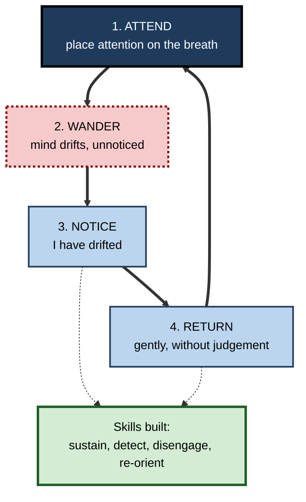
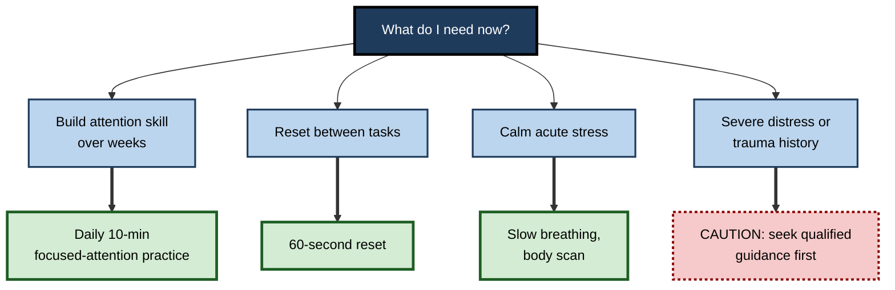

# D.9. Mindfulness for Better Focus

> **In one sentence:** Mindfulness training is practice in paying attention on purpose to the present moment, noticing when your mind has wandered, and bringing it back — a repeatable exercise that can modestly strengthen some parts of attention.
>
> **Why it matters:** Mind wandering and distraction are among the biggest everyday drains on focus and learning. Mindfulness is one of the few attention-training methods with a substantial body of randomised trials, so professionals should know what it reliably does, what it does not, and how to use it without hype.
>
> **Level span:** Novice → Expert · **Reading time:** ~18 min · **Builds on:** sustained attention; mind wandering; distraction

---

## The Learning Ladder

| Level | Badge | After this level you can... |
|---|---|---|
| 1 | NOVICE | Explain what mindfulness is in plain words and do a five-minute breath-focus practice. |
| 2 | FOUNDATIONS | Describe focused-attention and open-monitoring practice and the attention-wandering-noticing-returning cycle. |
| 3 | PRACTITIONER | Build a realistic daily practice and use brief mindful "resets" during work. |
| 4 | ADVANCED | Summarise what meta-analyses show about mindfulness and attention, including effect sizes, control-group problems and which attention components change. |
| 5 | EXPERT / PRO | Evaluate and design workplace mindfulness offerings responsibly, with credible measurement and awareness of limits and risks. |

---

## Level 1 · Novice — The Big Picture

Try this: sit comfortably and pay attention to the feeling of your breath for one minute. Most people find that within a few seconds their mind has jumped to something else — a message, a worry, what to eat. That jump is **mind wandering**. The moment you notice it is the key moment.

**Mindfulness** means paying attention, on purpose, to what is happening right now, without getting caught up in judging it. **Mindfulness training** (often in the form of meditation) is repeated practice of a simple cycle: put attention somewhere, notice when it drifts, and gently bring it back.

An analogy: a puppy on a lead. The puppy wanders off to sniff things. You do not shout at it; you gently bring it back to the path, again and again. Over time, the puppy wanders a little less — and, more importantly, you notice sooner when it has wandered.

You have already experienced something like this when you realised halfway down a page that you had not taken in a word, and went back to reread. Mindfulness practice trains you to notice that drift earlier.

The key idea: **mindfulness is not emptying your mind. It is practising noticing and returning — and every return is a repetition, like lifting a weight.**

---

## Level 2 · Foundations — Core Concepts

### Two main styles of practice

| Style | What you do | Attention skill exercised |
|---|---|---|
| **Focused attention (FA)** | Keep attention on one object (breath, a sound, body sensations); when it wanders, return. | Sustaining focus, detecting distraction, disengaging and re-orienting. |
| **Open monitoring (OM)** | Notice whatever arises — sounds, thoughts, sensations — without following any of it. | Broad awareness, **meta-awareness** (awareness of where your attention is), less reactivity. |

Researchers Antoine Lutz, Richard Davidson and colleagues described this distinction in 2008, and it remains a useful way to understand what different practices train. Many programmes start with focused attention and add open monitoring later.

### The core cycle

**Figure D.9-1 — The focused-attention cycle: every return is a repetition.**

*How to read it:* the thick loop repeats many times per session; the dotted arrows show which attention skills each step exercises. Wandering is expected — the training happens at "notice" and "return".

### Key terms

| Term | Plain meaning |
|---|---|
| **Mindfulness** | Paying attention on purpose to present experience, without judgement. |
| **Mindfulness-based intervention (MBI)** | A structured programme teaching mindfulness, often 8 weeks (e.g., MBSR, MBCT). |
| **MBSR** | Mindfulness-Based Stress Reduction, an 8-week programme developed by Jon Kabat-Zinn from 1979. |
| **Focused attention practice** | Holding attention on one object and returning when it drifts. |
| **Open monitoring practice** | Non-reactive awareness of whatever arises. |
| **Meta-awareness** | Awareness of the current state and direction of your own attention. |
| **Mind wandering** | Attention drifting to task-unrelated thoughts. |

---

## Level 3 · Practitioner — Putting It to Work

### Building a sustainable practice — six steps

1. **Start small.** Five to ten minutes a day is enough to begin. Consistency matters more than length.
2. **Anchor it to an existing habit.** After morning coffee, before opening email, or at the start of a lunch break.
3. **Use focused attention first.** Breath or body sensations as the anchor; count breaths from 1 to 10 if it helps.
4. **Count returns, not "good sessions".** A session with fifty wanderings and fifty returns is fifty repetitions, not a failure.
5. **Add brief resets during work.** Before a deep-work block or after a stressful meeting, take three slow breaths with full attention on them, then name the next task.
6. **Review after four weeks.** Use a simple self-check: do you notice drift sooner in reading or meetings? Has the practice felt sustainable? Adjust.

### The 60-second reset (for use at work)

1. Stop and feel your feet on the floor.
2. Take three breaths, attention fully on the sensation.
3. Notice what is pulling at you — name it silently ("worry about the deadline", "urge to check chat").
4. Choose the next single task and say it to yourself.
5. Begin.

### Worked example — a consultant with scattered client meetings

| | Before | After four weeks |
|---|---|---|
| **Practice** | None; jumps from meeting to meeting. | Ten minutes of breath focus most mornings; 60-second reset before each client meeting. |
| **In meetings** | Mind on the previous call; misses details; asks questions already answered. | Notices drift faster; uses the urge-naming step to set aside the previous call. |
| **Measure** | — | Self-tracked: number of follow-up emails asking for already-given information drops. |
| **Caveat** | | Improvement is real for her, but she also cut back-to-back meetings at the same time, so not all of it is the practice. |

**Figure D.9-2 — Choosing a mindfulness tool for the situation.**

*How to read it:* choose the need, follow the thick arrow; the dotted-border box marks the case where self-guided practice is not the right first step.

### Common mistakes at this level

- **Trying to "clear the mind".** That is not the goal; noticing and returning is.
- **Judging sessions as good or bad.** Busy sessions provide more practice repetitions.
- **Starting too long.** Thirty-minute sessions abandoned after a week achieve less than five minutes kept for months.
- **Using it as a substitute for fixing the environment.** Mindfulness will not cancel out 200 notifications a day.

---

## Level 4 · Advanced — Mechanisms, Models & Evidence

### What meta-analyses show

Mindfulness and attention have been studied in many randomised controlled trials. Key findings from recent syntheses:

- **Small, real average effects.** A meta-analytic review framing mindfulness as attention training (Paul Verhaeghen, 2021) found average effects on attention performance of roughly Hedges' g = 0.29 for intervention studies and about 0.32 for long-term meditators versus non-meditators — small effects by conventional standards. Effects appeared on executive control and inhibition, with less consistent effects on other components.
- **Effects depend on the component.** A 2025 meta-analysis of mindfulness-based interventions for university students found small-to-moderate improvements in the **orienting** component of attention compared with passive controls, but not in alerting, executive attention or mind wandering.
- **Effects depend on the comparison.** Benefits are clearest against passive controls (waitlist, no treatment). Against **active controls** — relaxation, education, other activities with similar time and expectation — effects are usually smaller and sometimes absent. That matters, because part of the passive-control benefit may come from expectation and engagement.
- **Working memory.** A 2025 meta-analysis reported moderate effects on working memory, with larger effects in weaker designs (single-group studies) than in randomised two-group studies — the usual pattern when study quality varies.

Overall: **mindfulness modestly improves some aspects of attention for some people**; it is not a broad cognitive enhancer.

### Mind wandering and reading

One well-known experiment (Michael Mrazek and colleagues, 2013) gave students a two-week mindfulness course versus a nutrition course and found reduced mind wandering and improved reading comprehension on a standardised test. It is often cited, and is promising, but it is a single study; later meta-analytic results on mind wandering are mixed.

### Proposed mechanisms

| Mechanism | Idea | Evidence |
|---|---|---|
| **Meta-awareness training** | Practice speeds detection of drift, shortening off-task episodes. | Plausible and consistent with behavioural data; hard to measure directly. |
| **Disengagement and re-orienting** | Repeated returns train the orienting network. | Consistent with orienting effects in recent meta-analyses. |
| **Reduced reactivity** | Less emotional "grab" from distractions and worries. | Supported in stress and emotion research. |
| **Default mode network changes** | Altered activity in the brain network linked to mind wandering. | Imaging studies suggest changes in experienced meditators; causal and practical significance unclear. |

### Risks and limits

- **Adverse effects** are uncommon but real: some people experience increased anxiety, distressing memories or dissociation during intensive practice. People with trauma histories or serious mental health conditions should practise with qualified guidance.
- **Dose matters but is unclear.** More practice tends to correlate with more benefit, but self-selection confounds this.
- **Publication bias and small samples** affect parts of the literature; larger preregistered trials have tended to find smaller effects.
- **App-based practice** is convenient and has some supporting trials, but engagement typically drops sharply after the first weeks.

---

## Level 5 · Expert / Pro — Professional Mastery

### Evaluating workplace mindfulness programmes

| Question | What a pro looks for |
|---|---|
| What outcome is it for? | Stress and well-being have stronger evidence than "productivity" or "focus". Set expectations accordingly. |
| Who delivers it? | Qualified teachers for structured programmes; screening and opt-out for intensive formats. |
| Is it voluntary? | Mandated mindfulness undermines trust and engagement. |
| Is it paired with work redesign? | Mindfulness cannot offset structurally fragmented work; pair it with interruption and meeting reforms. |
| How is it measured? | Pre/post and follow-up measures, a comparison group where possible, and both self-report and behaviour (for example, focus time, error rates). |

A common critique — sometimes called **"McMindfulness"** — is that organisations use mindfulness to make individuals cope with unhealthy conditions rather than changing the conditions. Credible programmes avoid this by treating mindfulness as one tool alongside better work design.

### Integrating mindfulness into focus routines

Professionals use mindfulness less as a separate activity and more as **micro-practices** embedded in work:

- a 60-second reset before deep work, difficult conversations or presentations;
- noticing and naming the urge to self-interrupt, then returning;
- a brief open-monitoring check at the end of the day to notice unfinished loops and write them down.

### AI-era note

As AI tools generate more streams of content and prompts, the ability to **notice where your attention has gone** — and choose to return — becomes more valuable. Meditation and focus apps increasingly use AI to personalise guidance; personalisation can improve engagement, but the evidence base for AI-personalised practice is still young.

### Professional scenario

**Role:** HR wellbeing lead at a 2,000-person firm.
**Situation:** The executive team wants to "roll out mindfulness to improve focus and productivity".
**What the pro does:** Resets expectations: evidence supports modest effects on stress and some attention components, not large productivity gains. Designs a voluntary 8-week programme with qualified teachers, screening information and opt-out; pairs it with a meeting-free-morning pilot. Evaluates with a waitlist comparison: well-being, a short attention self-report, and team-level focus-time data. Reports results honestly, including dropout and null findings.

---

## Myths vs. Evidence

| Myth | What the evidence shows |
|---|---|
| "Mindfulness means emptying your mind." | It means noticing where attention is and returning it; wandering is part of the practice. |
| "Meditation dramatically boosts focus and IQ." | Average attention effects are small; effects vary by component; no good evidence for IQ gains. |
| "Mindfulness improves every kind of attention." | Recent meta-analyses find gains on some components (e.g., orienting, executive control) but not others. |
| "Mindfulness is risk-free for everyone." | Adverse effects are uncommon but documented, especially with intensive practice. |
| "A mindfulness app fixes a distracting workplace." | Individual practice cannot offset structural interruption; pair it with work redesign. |
| "Any study showing benefits proves it works." | Effects are smaller against active controls; study quality matters. |

## Practitioner Toolkit

**Starting-practice checklist**

- [ ] Five to ten minutes per day, anchored to an existing habit.
- [ ] Focused attention on breath or body as the starting practice.
- [ ] Returns counted as repetitions, not failures.
- [ ] 60-second reset used before at least one demanding task daily.
- [ ] Four-week review scheduled.
- [ ] Qualified guidance sought if practice brings up distress.

**Template — four-week practice log**

| Week | Days practised | Typical length | Drift noticed sooner? (Y/N) | Note |
|---|---|---|---|---|
| 1 | | | | |
| 2 | | | | |
| 3 | | | | |
| 4 | | | | |

## Self-Check

1. **[NOVICE]** What is mindfulness, in plain words?
2. **[NOVICE]** Why is a session full of mind wandering not a failure?
3. **[FOUNDATIONS]** Contrast focused-attention and open-monitoring practice.
4. **[FOUNDATIONS]** What is meta-awareness?
5. **[PRACTITIONER]** Describe the 60-second reset.
6. **[ADVANCED]** Roughly how large are average effects of mindfulness training on attention, and which components seem to change?
7. **[ADVANCED]** Why do effects shrink against active control groups?
8. **[EXPERT / PRO]** What is the "McMindfulness" critique, and how would you design a programme that avoids it?
9. **[EXPERT / PRO]** How would you evaluate a workplace mindfulness programme credibly?

### Answer Key

1. Paying attention on purpose to the present moment, without getting caught up in judging it.
2. Every noticed wandering followed by a return is one repetition of the skill being trained.
3. Focused attention holds one object and returns when drifting; open monitoring notices whatever arises without following it.
4. Awareness of where your attention currently is.
5. Feel your feet, take three attentive breaths, name what is pulling at you, choose the next task, begin.
6. Small on average (roughly g around 0.3 in one major review); gains on orienting and executive control in some analyses, but not consistently on alerting or mind wandering.
7. Active controls match time, attention and expectations, removing non-specific benefits that passive controls do not control for.
8. Using mindfulness to make people cope with bad conditions instead of fixing them; avoid by keeping it voluntary and pairing it with work redesign.
9. Voluntary participation, comparison group, pre/post and follow-up, both well-being and behavioural focus measures, honest reporting of dropout and null results.

## Key Takeaways

- Mindfulness trains a **cycle**: attend, wander, notice, return.
- **Focused attention** builds sustaining and re-orienting; **open monitoring** builds meta-awareness.
- Average effects on attention are **small and component-specific**; strongest against passive controls.
- **Short, consistent** practice beats long, abandoned practice; micro-resets fit into work.
- It is **not risk-free** for everyone and **not a substitute** for fixing distracting work.
- Professionals **set honest expectations** and measure credibly.

## Glossary

| Term | Meaning |
|---|---|
| Active control | Comparison condition matched for time and expectation. |
| Focused attention practice | Meditation holding attention on one object. |
| MBI | Mindfulness-based intervention. |
| MBSR | Mindfulness-Based Stress Reduction, an 8-week programme. |
| McMindfulness | Critique of mindfulness used to make people adapt to poor conditions. |
| Meta-awareness | Awareness of one's current attentional state. |
| Mindfulness | Intentional, non-judging attention to the present. |
| Open monitoring practice | Non-reactive awareness of whatever arises. |
| Orienting | Selecting and shifting to a location or input. |
| Passive control | Comparison group receiving no treatment or waiting. |
