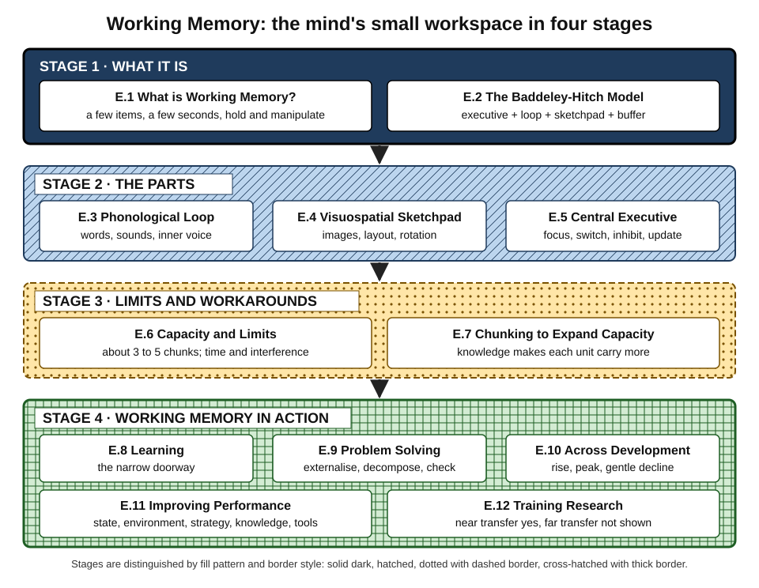
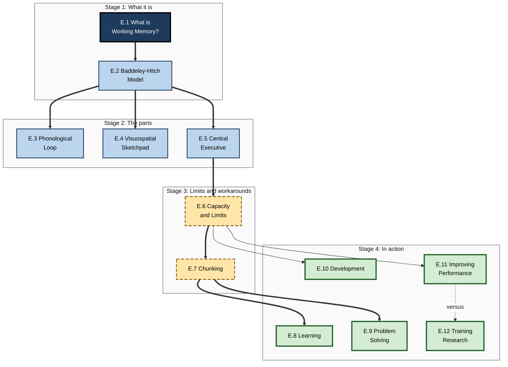
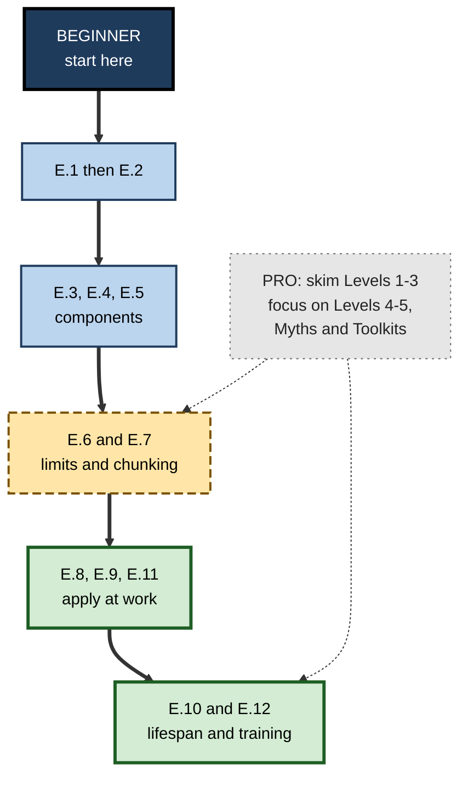

# E. Working Memory

> **What this subtopic is about:** Working memory is the small, short-lived mental workspace where you hold a few pieces of information and do something with them — understand a sentence, compare two options, debug a function, follow an instruction. This subtopic explains what it is, how its parts work, how small it is, how knowledge stretches it, how it shapes learning and problem solving across life, and what does and does not improve it.
>
> **Who it is for:** anyone who learns, teaches, designs, manages or builds tools for other people · **Notes in this subtopic:** 12 · **Level span:** Novice → Expert

---

## Overview

Every piece of thinking passes through a narrow bottleneck. You can hold only about three to five meaningful units in mind at once, for a few seconds, and that space is easily disrupted by noise, interruptions, worry and fatigue. This bottleneck is **working memory**, and it is one of the most studied and best replicated constraints in cognitive science.

The twelve notes move from the basic idea (E.1) and the classic multicomponent model (E.2), through the three working parts — the verbal loop, the visuospatial sketchpad and the central executive (E.3–E.5) — to the limits of capacity and the way chunking gets around them (E.6–E.7). The final five notes show working memory in action: in learning, problem solving, development across the lifespan, everyday performance, and the long research story of working-memory training (E.8–E.12).

*Figure E-1 — Working Memory in four stages.* Stage 1 (solid dark): what it is. Stage 2 (hatched): the parts. Stage 3 (dotted, dashed border): limits and workarounds. Stage 4 (cross-hatched, thick border): working memory in action.

---

## Why It Matters

- **It is the bottleneck of learning.** All new knowledge must pass through working memory before it can be stored. Most failed training overloads it.
- **It is the bottleneck of skilled work.** Reading a dense contract, reviewing code, running an incident, comparing vendors — each is limited by how much can be held at once.
- **It is highly sensitive to conditions organisations control**: interruptions, noise, meeting load, time pressure, sleep and stress.
- **It explains expertise.** Experts do not have bigger working memories; they have better chunks. That insight changes how you train people.
- **It is a magnet for myths.** "Seven plus or minus two", brain-training games and phone-presence effects are all widely repeated and poorly supported.
- **It matters more, not less, with AI.** AI tools can offload storage, but the human still has a small focus of attention — and still needs to own the thinking that builds and checks knowledge.

---

## What You Will Learn

| # | Note | Core question it answers | Primary level |
|---|---|---|---|
| E.1 | What is Working Memory? | What is this mental workspace and how is it different from short- and long-term memory? | Novice |
| E.2 | The Baddeley-Hitch Model | What are the parts of working memory, and why does the model still matter? | Foundations |
| E.3 | Phonological Loop and Verbal Memory | How do we hold words and sounds, and what disrupts them? | Foundations |
| E.4 | Visuospatial Sketchpad | How do we hold images and layouts, and how should visuals be designed? | Foundations |
| E.5 | Central Executive Function | How is attention controlled, and why is switching so costly? | Practitioner |
| E.6 | Working Memory Capacity and Limits | How much can we hold, for how long, and what shrinks it? | Practitioner |
| E.7 | Chunking to Expand Capacity | How do knowledge and patterns let a small workspace carry more? | Practitioner |
| E.8 | Working Memory and Learning | How does working memory shape learning, and how do we design for it? | Practitioner |
| E.9 | Working Memory in Problem Solving | Why do problems overflow working memory, and how do we externalise them? | Advanced |
| E.10 | Working Memory Across Development | How does working memory change from childhood to old age? | Advanced |
| E.11 | Improving Working Memory Performance | What actually improves working-memory performance day to day? | Practitioner |
| E.12 | Working Memory Training Research | Does working-memory training make people smarter? What does the evidence say? | Expert |

---

## Concept Map

**Figure E-2 — How the twelve notes relate.**

*How to read it:* thick arrows are the main conceptual dependencies; the dotted arrow contrasts what improves performance (E.11) with what training research shows (E.12).

---

## Recommended Learning Path

1. **Start with E.1** for the core idea and vocabulary.
2. **Read E.2**, then dip into **E.3, E.4 and E.5** for the components most relevant to your work (verbal for communication roles, visuospatial for design and data, executive for everyone).
3. **Read E.6 and E.7 together**: the limit and the main way around it.
4. **Apply** with E.8 (if you teach or onboard), E.9 (if you solve complex problems) and E.11 (for your own daily work).
5. **Finish with E.10 and E.12** for lifespan perspective and the evidence on training.

**Figure E-3 — Paths through the subtopic.**

*How to read it:* beginners follow the thick path from top to bottom; experienced readers can jump in at the limits and evidence notes (dotted arrows).

A professional who already knows the multicomponent model can skim E.1–E.4 and concentrate on the Level 4–5 sections of E.5–E.12, especially the evidence and myth tables.

---

## The Big Ideas in Brief

**E.1 What is Working Memory?** Working memory holds and manipulates a small amount of information for a few seconds; it is the workspace of thought. It differs from short-term memory (storage only) and long-term memory (vast and lasting). The practical skill is spotting overload and fixing it by externalising, chunking or splitting tasks.

**E.2 The Baddeley-Hitch Model.** Since 1974, the dominant model has described working memory as a team: a central executive directing a phonological loop and a visuospatial sketchpad, with an episodic buffer added in 2000 to bind information. The outline is well supported; details such as the executive and buffer remain debated. Use it as a design heuristic: same-type tasks clash.

**E.3 Phonological Loop and Verbal Memory.** Words and sounds are held in a speech-based store refreshed by an inner voice. Similar sounds, long words and background speech all disrupt it. The loop underpins reading and vocabulary learning; at work, keep verbal items short, distinct, grouped and backed up in writing.

**E.4 Visuospatial Sketchpad.** Visual appearance and spatial layout are held separately from words, with capacity of about three or four simple objects. Change blindness shows how little visual detail people actually retain. Design visuals so viewers never have to carry information between places: direct labels, adjacency, one highlight.

**E.5 Central Executive Function.** The executive focuses, switches, inhibits and updates. Executive functions share a goal-maintenance core. Switching always costs time and accuracy; stress weakens control. The strong "ego depletion" claim failed large replications. Protect executive capacity with batching, focus blocks and checklists.

**E.6 Working Memory Capacity and Limits.** Core capacity is about three to five chunks, not seven items; the exact number depends on what is counted. Limits come from amount, time and interference, and capacity shrinks under anxiety, sleep loss and distraction. Design for about four new chunks at the peak moment.

**E.7 Chunking to Expand Capacity.** Knowledge lets small working memory carry more by grouping details into meaningful units stored in long-term memory. Expertise is largely a chunk library, as chess and digit-span studies show. Chunks are domain-specific and can cause fixation, so experts build in checks.

**E.8 Working Memory and Learning.** New learning must pass through working memory, while prior knowledge makes that doorway effectively wider. Overload looks like inattention. Segmenting, pre-training, worked examples, visible aids, retrieval and spacing help; support must adapt as learners gain knowledge.

**E.9 Working Memory in Problem Solving.** Solving requires holding goal, state, moves and history at once. Problem difficulty depends heavily on representation; diagrams and decomposition make hard problems tractable. Pressure consumes capacity. Externalise information, but keep judgement human.

**E.10 Working Memory Across Development.** Working memory grows through childhood, peaks roughly between twenty and thirty-five, and declines gradually, while knowledge keeps growing and compensates. Ageing affects speed, inhibition and binding most; verbal working memory is relatively resilient. Environmental support helps every age.

**E.11 Improving Working Memory Performance.** Performance improves mainly by managing state (sleep, stress), environment (interruptions, noise), strategy, knowledge and tools. Popular boosters — supplements, bilingual advantage, phone-presence effects — are weak or contested.

**E.12 Working Memory Training Research.** Training improves trained and similar tasks; far transfer to intelligence, schoolwork or job performance is not reliably shown, a conclusion confirmed by 2024–2025 meta-analyses. Evaluate claims for active controls, far outcomes, blinding and follow-up, and practise the target skill instead.

---

## Novice-to-Pro Progression

| Level | What competence looks like here |
|---|---|
| NOVICE | Explains working memory as a small, brief workspace and notices personal overload. |
| FOUNDATIONS | Uses the multicomponent model's vocabulary; knows the capacity limit is about four chunks, not seven items. |
| PRACTITIONER | Redesigns instructions, documents, visuals and lessons to fit within limits; uses externalisation and chunking deliberately. |
| ADVANCED | Explains mechanisms and debates — decay versus interference, slots versus resources, executive models — and judges evidence quality. |
| EXPERT / PRO | Designs team workflows, products, learning programmes and AI use around working-memory limits; advises on training claims; measures outcomes, not satisfaction. |

---

## Where This Shows Up at Work

- **Onboarding and L&D:** segmenting content, pre-teaching vocabulary, job aids, spaced retrieval.
- **Software engineering:** small functions, consistent patterns, side-by-side diffs, interruption-free review time, incident docs.
- **Data and analytics:** dashboards that pass a five-second glance test; comparisons placed together.
- **Product and UX:** recognition over recall, persistent summaries in multi-step flows, stable layouts.
- **Management:** work-in-progress limits, focus blocks, decision logs, written over spoken instructions.
- **Operations and safety:** checklists, readbacks, runbooks, incident scribes.
- **Sales and customer service:** short verbal steps, codes without sound-alikes, written confirmations.
- **AI adoption:** offloading storage to tools while keeping reasoning and verification in human hands.

---

## Capstone Exercises

1. **Load audit of a real artefact.** Pick a dashboard, onboarding page or process document from your work. Run a hold-count at its peak moment, identify which component is overloaded (verbal, visual, executive), and redesign it. Test before and after with a newcomer.
2. **Personal working-memory week.** Run the one-week audit from E.11, implement fixes for your top two causes, and compare a second week.
3. **Chunk library.** For a skill you are building, write ten pattern cards (name, signature, contrasting examples, look-alikes) and practise recognition for two weeks.
4. **Problem-solving board.** Solve a current work problem using the externalise–decompose–check method and board template, then reflect on what changed.
5. **Training-claim review.** Find a cognitive-training product's marketing claims and assess them against the claim checklist in E.12. Write a one-page recommendation for a decision-maker.
6. **Inclusive redesign.** Adapt a piece of training for both early-career and older employees using the age-fit adjustments from E.10.

---

## Key Takeaways

- Working memory is a **small, brief, easily disrupted workspace** — about three to five chunks.
- It has **specialised parts** (verbal, visuospatial) and a **limited executive**; same-type demands clash.
- **Knowledge expands effective capacity** through chunking; expertise is a chunk library.
- **Design within the limit**: externalise, chunk, split, segment and protect focus.
- **Conditions matter**: sleep, stress, noise and interruptions change capacity day to day.
- **Training games do not transfer** broadly; practise the real skill and improve conditions.
- In the AI era, **offload storage, not thinking**.
