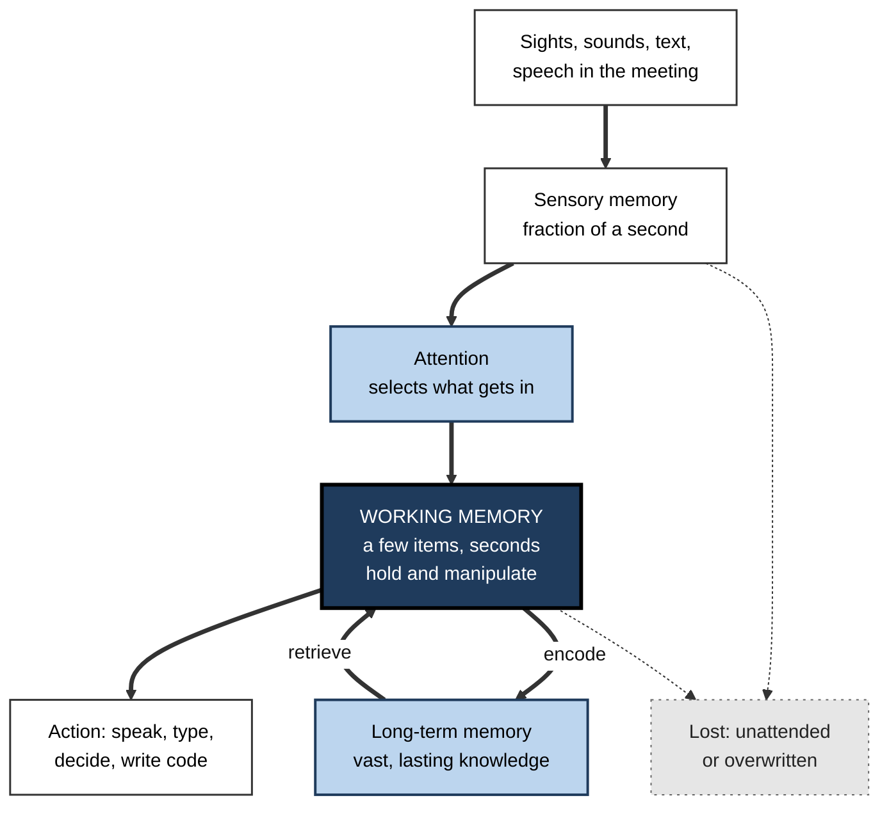
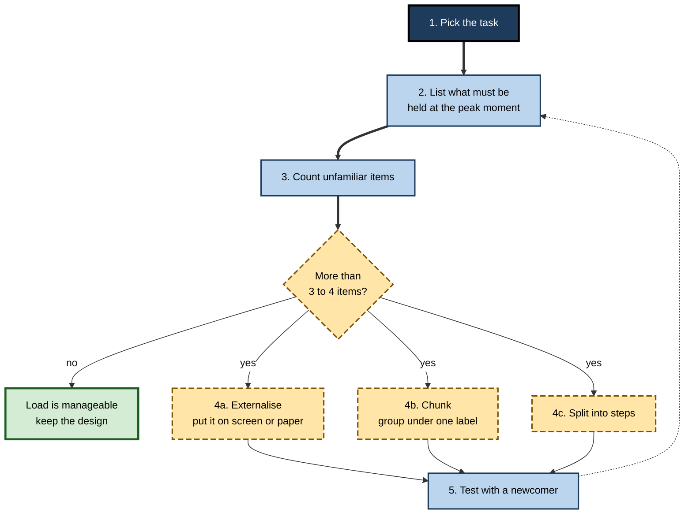

# E.1. What is Working Memory?

> **In one sentence:** Working memory is the small mental workspace where you hold a few pieces of information for a few seconds and do something with them, such as adding two numbers in your head or keeping a question in mind while you search for the answer.
>
> **Why it matters:** Almost every piece of skilled knowledge work — following a design review, debugging, negotiating, reading a dense contract — runs through this narrow workspace. People who understand its limits design their work, their documents and their training so that the workspace is never the bottleneck.
>
> **Level span:** Novice → Expert · **Reading time:** ~15 min · **Builds on:** a basic idea of what memory and attention are

---

## The Learning Ladder

| Level | Badge | After this level you can... |
|---|---|---|
| 1 | NOVICE | Explain working memory in plain words and recognise the moments when yours is full. |
| 2 | FOUNDATIONS | Distinguish working memory from short-term and long-term memory, and name how it is measured. |
| 3 | PRACTITIONER | Spot working-memory overload in a task or document and redesign it to need less holding-in-mind. |
| 4 | ADVANCED | Compare the main scientific models, explain individual differences, and judge the evidence behind common claims. |
| 5 | EXPERT / PRO | Design workflows, tools, training and AI assistance that respect working-memory limits across a team. |

---

## Level 1 · Novice — The Big Picture

Imagine a small kitchen worktop. Your pantry (long-term memory) holds enormous amounts of food, but you can only cook with what fits on the worktop at once. If you pile on too many ingredients, things fall off the edge. **Working memory** is that worktop: a tiny, temporary space where you place the few things you are using right now, combine them, and produce something.

You have already experienced working memory many times:

- Someone tells you a phone number or a one-time code, and you repeat it silently until you have typed it. Stop repeating and it is gone.
- You do a sum such as 47 + 38 in your head. You must hold "47", hold "38", add the units, carry the one, and keep the partial answer while you finish.
- A colleague gives you four instructions in a row in a meeting. You remember the first and the last; the middle ones vanish.
- You walk into a room and forget why you came in. The goal was held in working memory, and something else pushed it out.

Three plain facts sum up the whole topic:

1. **It is small.** Most adults can juggle only a handful of separate things at once.
2. **It is brief.** Without attention or rehearsal, its contents fade or get overwritten within seconds.
3. **It is where thinking happens.** Reasoning, understanding a sentence, planning a reply and solving a problem all use this same workspace.

The good news is that you are not stuck with a tiny worktop for everything. What you already know well lets you pack information into bigger, meaningful bundles, and tools such as paper, whiteboards and checklists act as extra worktops outside your head.

---

## Level 2 · Foundations — Core Concepts

### A working definition

The most widely used definition comes from the British psychologist Alan Baddeley: working memory is **a limited-capacity system for temporarily holding and manipulating information in the service of complex thinking**, such as comprehension, reasoning and learning. Two words carry the meaning:

- **Holding** — keeping information available for a short time (storage).
- **Manipulating** — doing something with it: comparing, updating, reordering, combining (processing).

That second part is what separates working memory from simple **short-term memory**, which mostly means holding information briefly without transforming it, as in repeating a list back in the same order.

### Where it sits in the memory system

In the late 1960s, Richard Atkinson and Richard Shiffrin popularised the **modal model**: information passes from the senses, into a short-term store, and from there into a long-term store. In 1974, Baddeley and Graham Hitch argued that the short-term store is not a passive waiting room but an active workspace with several parts. Their idea of a multi-part working memory is now the textbook starting point.

**Figure E.1-1 — Where working memory sits in the flow of information.**

*How to read it:* thick arrows are the main flow; working memory is the hub that both pulls knowledge out of long-term memory and pushes new learning into it. Dotted arrows show what is lost.

### Three systems compared

| Feature | Sensory memory | Working memory | Long-term memory |
|---|---|---|---|
| How much? | Large, raw | Very small: a few chunks | Practically unlimited |
| How long? | Under a second to a few seconds | Seconds, unless actively maintained | Minutes to a lifetime |
| What form? | Raw sensory trace | Words, images, plans, goals currently in use | Facts, skills, schemas, episodes |
| What you control | Little | Focus, rehearsal, strategy | What you encode and how you retrieve it |
| Work example | Glimpse of a dashboard flashing by | Comparing two numbers on the dashboard | Knowing what "churn rate" means |

### Key terms

| Term | Plain meaning |
|---|---|
| **Working memory** | The limited workspace for holding and manipulating information during thinking. |
| **Short-term memory** | Brief storage without much manipulation; often treated as one part of working memory. |
| **Capacity** | How much working memory can hold at once; usually counted in chunks. |
| **Chunk** | A meaningful unit, such as a word, a familiar acronym or a known pattern, that counts as one item. |
| **Rehearsal** | Repeating information (often silently) to keep it active. |
| **Interference** | New or similar information disrupting what is being held. |
| **Executive control** | The directing of attention: what to hold, what to drop, what to do next. |
| **Span task** | A test where you recall a growing list until you fail; the longest correct list is your "span". |

### How scientists measure it

| Task | What you do | What it mainly taps |
|---|---|---|
| **Digit span (forward)** | Repeat a list of digits in order. | Short-term storage of verbal items. |
| **Digit span (backward)** | Repeat the list in reverse. | Storage plus manipulation. |
| **Complex span** (reading, operation span) | Judge sentences or solve sums while remembering letters or words between them. | Holding information while processing something else — the classic working-memory measure. |
| **Corsi blocks** | Tap a sequence of blocks in the order shown. | Visuospatial short-term memory. |
| **Change detection** | Glance at coloured squares; say whether one changed after a short gap. | Visual working-memory capacity, often estimated as "K" items. |
| **N-back** | Say whether the current item matches the one N steps back. | Updating and familiarity; correlates only modestly with complex span. |

---

## Level 3 · Practitioner — Putting It to Work

The practical skill is to notice when a task asks people to hold too much in mind at once — and then move that load out of the head.

### The Hold-Count method — five steps

1. **Pick one task or artefact.** A meeting agenda, an onboarding page, a dashboard, a function you are reviewing, a set of verbal instructions.
2. **List what must be held at the same time.** Ask: "At the hardest moment, what does the person need to keep in mind that is not in front of them?" Write each item down.
3. **Count unfamiliar items.** Things the person already knows deeply cost little. New names, codes, conditions and intermediate results cost a lot.
4. **Externalise or chunk.** If the count of unfamiliar items exceeds about three or four, put items on the page or screen (externalise), group related items under one meaningful label (chunk), or split the task into steps that each need less holding.
5. **Test with a real person.** Watch someone new do the task. Pauses, re-reading, scrolling back and "wait, what was the second thing?" are the visible signs of overload.

**Figure E.1-2 — Spotting and removing working-memory overload.**

*How to read it:* follow the thick arrows; when the count is too high, choose one or more of the three fixes, then test and loop back.

### Worked example — verbal instructions to a new support agent

| | Before (overloads working memory) | After (respects it) |
|---|---|---|
| **Instruction** | "When a customer calls about billing, check their plan tier, then if they are Enterprise escalate to the account manager unless it's under 500 dollars, in which case refund via the console, but log the ticket code first, and remember the code format changed last week." | A one-screen decision card: three boxes (tier, amount, action) and the new ticket-code format printed on it. |
| **Items held at once** | Six or seven conditions plus a new format. | One or two — the card holds the rest. |
| **Result** | Errors on the middle conditions; repeated questions to the team lead. | Fewer errors; the agent learns the rule by using the card, then stops needing it. |

### Common mistakes at this level

- **Confusing "smart" with "large working memory".** Experts look as if they hold more because their knowledge lets them chunk. Newcomers do not have that yet.
- **Giving long chains of spoken instructions.** Spoken words vanish; anything important belongs in writing.
- **Hiding needed information on another screen, tab or page.** Every switch forces the person to carry information across in their head.
- **Interrupting deep work.** An interruption can wipe the current contents of working memory, and rebuilding them takes time.
- **Treating overload as a motivation problem.** "Concentrate harder" rarely helps once the workspace is full.

---

## Level 4 · Advanced — Mechanisms, Models & Evidence

### Several families of theory

Researchers agree that working memory is limited and central to complex thought; they disagree about its architecture.

| Model family | Core claim | Leading names | Strength | Main critique |
|---|---|---|---|---|
| **Multicomponent** | Separate stores for verbal and visuospatial material, a central executive, and an episodic buffer that binds them. | Baddeley, Hitch, Logie | Explains why verbal and visual tasks interfere less with each other than with themselves. | The executive is loosely specified. |
| **Embedded-processes** | Working memory is the activated part of long-term memory; a narrow focus of attention holds about four chunks. | Cowan | Accounts for the role of knowledge and for a common capacity limit across materials. | Harder to explain domain-specific interference. |
| **Executive-attention** | Individual differences come mainly from the ability to control attention and resist distraction. | Engle, Kane | Explains why complex span predicts reasoning and reading so well. | Debate over how much is storage versus control. |
| **State-based / interference** | Items are represented by bindings; forgetting comes mainly from interference rather than time-based decay. | Oberauer, Lewandowsky | Formal, testable computational models. | Less intuitive for practitioners. |

These are increasingly treated as complementary lenses: a domain-general attentional bottleneck working alongside more specialised verbal and visuospatial resources.

### What the limit really is

George Miller's famous 1956 "seven, plus or minus two" described how many items people can repeat back. Later work that blocked rehearsal and grouping, summarised by Nelson Cowan in 2001, points to a core limit of roughly three to five chunks. A 2024 set of experiments reconciling "four" and "seven" concluded that the number depends on what is being counted — whether the operations performed on the items also take up some of the capacity. Treat the number as a rough planning figure, not a law.

### Brain basis, briefly

Working memory relies on a network linking the **prefrontal cortex** (control, goals) with **parietal** and sensory areas (the representations themselves). The classic view held that items are kept alive by persistent neural firing. More recent work suggests that some information can be held in an "activity-silent" form — stored in short-lived changes in synaptic strength — and reactivated when needed. This debate is open, and it matters mainly to theorists; for practitioners the behavioural limits are what count.

### Individual differences and why they matter

People differ reliably in working-memory capacity, and complex-span scores correlate with reading comprehension, mathematical reasoning, following instructions and fluid intelligence. The correlation with fluid reasoning is strong at the level of underlying abilities but well short of identity: working memory and intelligence are related, not the same thing. Capacity also fluctuates within one person with sleep, stress, anxiety and distraction — which is often more actionable than the stable differences.

### Boundary conditions

- **Expertise changes the picture.** Experts appear to exceed the limit because they use long-term knowledge as an extension of the workspace — a mechanism called **long-term working memory**.
- **Domain matters.** Holding words and holding locations interfere less with each other than two verbal tasks do.
- **Capacity is not the same as performance.** Strategy, knowledge, tools and environment often matter more than raw capacity for real-world outcomes.

---

## Level 5 · Expert / Pro — Professional Mastery

### Designing for the workspace, not the person

Professionals treat working memory as a design constraint, just as an engineer treats memory limits in a device. The question is not "Who has a big working memory?" but "How much holding-in-mind does this task demand, and can we lower it?"

| Domain | High-load design | Working-memory-friendly design |
|---|---|---|
| Software | A function with eight parameters and nested conditionals | Small functions, descriptive names, early returns, typed objects grouping parameters |
| Data and BI | A dashboard requiring mental comparison across tabs | Comparisons placed side by side with the difference already calculated |
| Meetings | Decisions spoken but not written | A live decision log visible to everyone |
| Onboarding | Twenty acronyms in the first hour | A glossary panel and acronyms introduced only when needed |
| Operations | Memorised incident steps | Runbooks and checklists, as in aviation and surgery |

### Working memory and AI assistants

Large language models are sometimes described as having a "context window", and it is tempting to call that their working memory. The analogy is loose: models do not have a human-like attentional bottleneck. The more important professional question is what AI does to *human* working memory. Recent studies show two sides. Offloading routine holding and lookup to a tool can free the workspace for judgement. Unguided reliance, however, has been linked in 2025 research to less reflection and weaker self-monitoring; one small, preliminary 2025 EEG study reported lower engagement when people wrote essays with an AI model. Structured use — forming your own outline first, then using the tool for specific functions and checking its output against your own reasoning — reduced these effects in several studies. The design principle: offload *storage* freely, keep *the thinking you need to learn* in the human workspace.

### Professional scenario

**Role:** Product designer leading a redesign of an internal claims-processing tool.
**Situation:** Claims handlers make frequent errors on step four of a seven-step form, where they must remember a policy number and two dates from step one.
**What the pro does:** Runs a hold-count on each step and finds that step four requires holding five unfamiliar values that are no longer visible. The redesign keeps a persistent summary panel showing step-one values, pre-calculates the date gap, and groups the remaining fields into two labelled chunks. Error rates on step four are tracked before and after, along with time per claim. The designer reports error reduction as the outcome, not satisfaction scores.

### Expert judgement

- **Assume the newcomer's workspace.** Designers and seniors are experts in their own material; they systematically underestimate the load on others.
- **Prefer seeing over remembering.** Every value someone must carry from one place to another is a potential error.
- **Protect the workspace from interruption** during high-load work: incident response, code review, financial close.
- **Measure load indirectly.** Error clusters, time spent re-reading and "can you repeat that?" are good field indicators of overload.

---

## Myths vs. Evidence

| Myth | What the evidence shows |
|---|---|
| "Working memory holds seven things." | Miller's seven described span with rehearsal and grouping; the core limit is usually estimated at three to five chunks, and depends on what is counted. |
| "Working memory and short-term memory are the same." | Short-term memory is mainly storage; working memory adds manipulation and control, and predicts complex thinking better. |
| "A big working memory means a high IQ." | They are strongly related but distinct abilities. |
| "Experts have bigger working memories." | Experts mostly have better chunks and long-term knowledge, not a larger workspace. |
| "Brain-training games will expand it." | Training improves the trained tasks and close relatives; broad gains to reasoning or work performance are not supported. |
| "If I concentrate harder, I can hold more." | Effort helps you use the space well, but it does not remove the limit; externalising works better. |

## Practitioner Toolkit

**Working-memory load checklist for any task or document**

- [ ] I identified the hardest moment and listed what must be held then.
- [ ] Unfamiliar items held at once are three or four at most.
- [ ] Anything needed later is visible, not remembered.
- [ ] Spoken instructions are also written down.
- [ ] Related details are grouped under a meaningful label.
- [ ] People do not have to switch screens to compare values.
- [ ] I tested with someone new and watched for re-reading and pauses.

**Template — hold-count table**

| Step | What must be held | Familiar or new? | Fix (externalise / chunk / split) |
|---|---|---|---|
| | | | |

## Self-Check

1. **[NOVICE]** Using the worktop analogy, what is working memory?
2. **[NOVICE]** Give one everyday example of your working memory overflowing.
3. **[FOUNDATIONS]** What is the difference between short-term memory and working memory?
4. **[FOUNDATIONS]** What does a complex span task measure that a simple digit span does not?
5. **[PRACTITIONER]** What are the three main fixes for a task that overloads working memory?
6. **[ADVANCED]** Why is "seven plus or minus two" considered an overestimate of the core limit?
7. **[ADVANCED]** How do the multicomponent and embedded-processes models differ?
8. **[EXPERT / PRO]** How would you redesign a multi-step form where users must remember values from earlier steps?
9. **[EXPERT / PRO]** What is a good rule for using AI tools without weakening your own thinking?

### Answer Key

1. A small, temporary workspace where you place the few things you are using right now and combine them, separate from the large pantry of long-term memory.
2. Answers vary — for example, forgetting the middle items of spoken instructions, or losing track of a mental sum.
3. Short-term memory mainly holds information briefly; working memory also manipulates it and is guided by attention.
4. The ability to hold information while doing other processing at the same time, which is what complex thinking requires.
5. Externalise (put it on the page or screen), chunk (group under a meaningful label), and split (break into steps).
6. Miller's span tasks allowed rehearsal and grouping; when these are blocked, people hold about three to five chunks.
7. The multicomponent model stresses separate verbal and visuospatial stores plus an executive; the embedded-processes model treats working memory as activated long-term memory with a narrow focus of attention.
8. Keep earlier values visible in a summary panel, pre-calculate derived values, and group fields into a few labelled chunks; then measure errors.
9. Offload storage and lookup freely, but form your own ideas first and check the tool's output against your reasoning when you need to learn or judge.

## Key Takeaways

- Working memory is the **small, brief workspace** where thinking happens.
- It **holds and manipulates**; short-term memory mostly just holds.
- The core limit is roughly **three to five chunks**, not a fixed seven.
- Knowledge lets you **chunk**, which is why experts seem to hold more.
- The best fixes are **externalise, chunk and split** — not "try harder".
- At work, treat working memory as a **design constraint** for documents, tools and processes.
- Use AI to offload **storage**, not the **thinking** you need to own.

## Glossary

| Term | Meaning |
|---|---|
| Activity-silent storage | A proposed way of holding information in temporary synaptic changes rather than constant neural firing. |
| Capacity | The amount working memory can hold at once, usually counted in chunks. |
| Central executive | The control part of the multicomponent model that directs attention. |
| Chunk | A meaningful unit that counts as one item in working memory. |
| Complex span | A task combining remembering with simultaneous processing. |
| Embedded-processes model | Cowan's model: working memory as activated long-term memory with a limited focus of attention. |
| Externalising | Moving information out of the head into notes, screens or tools. |
| Interference | Disruption of held information by other similar or new information. |
| Long-term working memory | Experts' use of well-organised long-term knowledge to extend effective working memory. |
| Modal model | The classic sensory, short-term and long-term store model of memory. |
| Short-term memory | Brief storage of information without much manipulation. |
| Working memory | A limited system for temporarily holding and manipulating information during thinking. |
