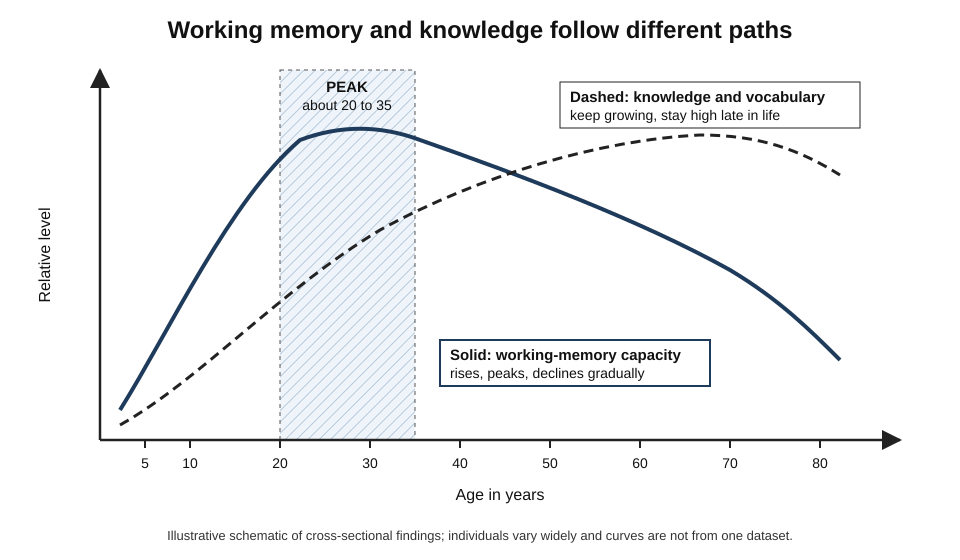
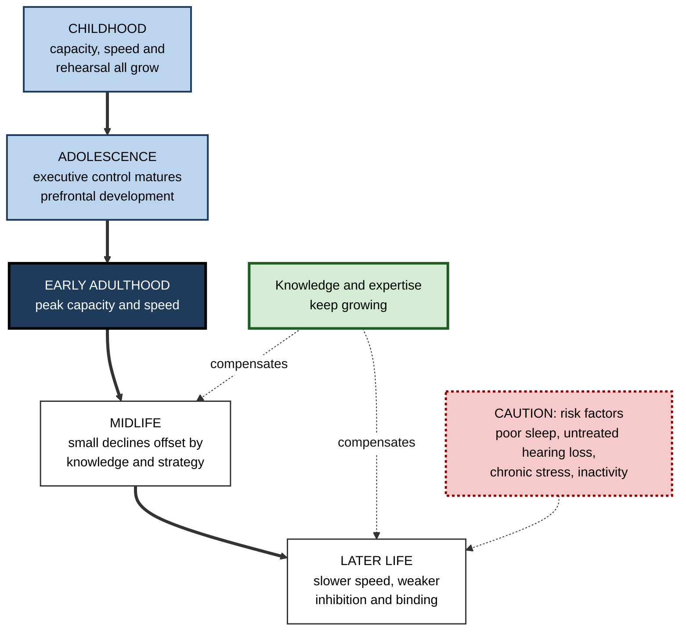
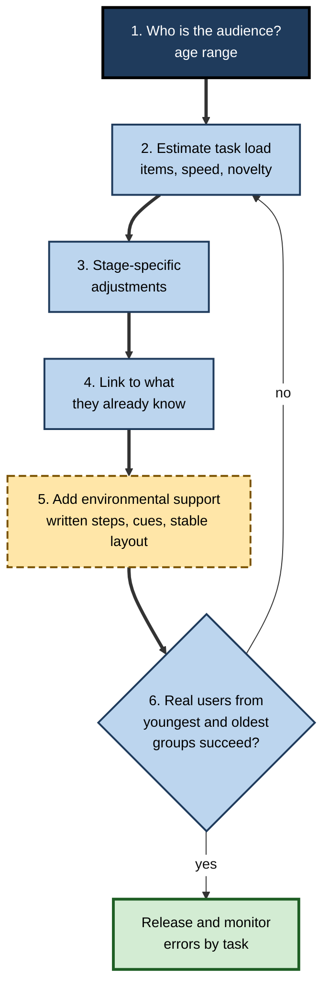

# E.10. Working Memory Across Development

> **In one sentence:** Working memory grows quickly through childhood and adolescence, reaches its peak in early adulthood, and then declines gradually with age — while knowledge and experience keep growing and can make up for much of that decline.
>
> **Why it matters:** Teams, classrooms and customer bases span every age. Knowing how working memory changes across life helps you teach children appropriately, support adolescents and early-career staff, design for older users and colleagues, and avoid ageist assumptions that the evidence does not support.
>
> **Level span:** Novice → Expert · **Reading time:** ~15 min · **Builds on:** working-memory capacity, the central executive and chunking

---

## The Learning Ladder

| Level | Badge | After this level you can... |
|---|---|---|
| 1 | NOVICE | Describe the overall rise-peak-decline shape of working memory across life. |
| 2 | FOUNDATIONS | Explain what changes at each stage and why knowledge follows a different path. |
| 3 | PRACTITIONER | Adapt instructions, training and interfaces for children, adolescents and older adults. |
| 4 | ADVANCED | Explain the mechanisms of development and ageing and what the evidence says about compensation and protective factors. |
| 5 | EXPERT / PRO | Design age-inclusive workplaces, products and learning programmes without stereotyping. |

---

## Level 1 · Novice — The Big Picture

Watch a four-year-old try to follow "Put on your shoes, get your coat, and bring me the blue bag." They often do the first thing and forget the rest. A ten-year-old manages all three. A teenager can hold the instructions and plan a shortcut. A young adult can do it while also talking on the phone. Someone in their seventies may find the triple instruction harder again if it is rushed — but they will likely know exactly where the blue bag is and why it is needed.

Working memory follows a **rise, peak and gentle decline** across life:

- **Childhood**: rapid growth, year by year.
- **Adolescence**: continued improvement, especially in control and planning.
- **Early adulthood**: peak, roughly in the twenties to early thirties.
- **Middle and later adulthood**: gradual decline, faster in late life, with big differences between individuals.

But **knowledge follows a different path**: vocabulary, expertise and general knowledge keep growing through most of adult life. Because knowledge lets people chunk information, older adults often perform very well in their areas of experience.

*Figure E.10-1 — Working memory and knowledge follow different paths.* Solid line: working-memory capacity rises through childhood, peaks in early adulthood and declines gradually. Dashed line: knowledge and vocabulary keep rising and stay high late in life. Shaded band: the typical peak period. Schematic; individuals vary widely.

---

## Level 2 · Foundations — Core Concepts

### What changes at each stage

| Stage | What develops or changes | Everyday sign |
|---|---|---|
| **Infancy** | Infants can track a small number of hidden objects (around three) and begin to hold goals briefly. | A baby searches for a toy hidden a moment ago. |
| **Early childhood (3–6)** | Capacity grows; executive control is weak; children rarely rehearse spontaneously. | Follows one or two instructions; forgets longer ones. |
| **Middle childhood (7–12)** | Spontaneous verbal rehearsal emerges around age seven; children start recoding pictures into words; processing speed increases. | Can follow multi-step classroom instructions and do mental arithmetic. |
| **Adolescence** | Capacity approaches adult levels; executive control (inhibition, shifting, planning) keeps maturing as prefrontal networks develop into the twenties. | Juggles more complex tasks, but control under emotional or social pressure is still developing. |
| **Early adulthood** | Peak working memory and processing speed. | Handles high-load tasks quickly. |
| **Middle age** | Small, gradual declines in speed and capacity, usually offset by knowledge and strategy. | Performance at work typically stable or improving. |
| **Later life** | Larger declines in processing speed, capacity, inhibition and binding; verbal working memory tends to be more resilient than visuospatial. | Harder to keep track of fast, unfamiliar, multi-step tasks; expertise remains strong. |

**Figure E.10-2 — The main drivers at each life stage.**

*How to read it:* the thick path is the typical lifespan sequence; dotted arrows show knowledge compensating and risk factors accelerating decline.

### Key terms

| Term | Plain meaning |
|---|---|
| **Developmental trajectory** | The typical pattern of change in an ability across age. |
| **Processing speed** | How quickly simple mental operations are carried out. |
| **Inhibition deficit** | Reduced ability to suppress irrelevant information, often seen in later life. |
| **Associative or binding deficit** | Greater difficulty remembering links between items (name-face, item-place) than the items alone. |
| **Crystallised knowledge** | Accumulated knowledge and vocabulary. |
| **Cognitive reserve** | Resilience built by education, mentally active work and lifestyle that helps maintain function. |
| **Environmental support** | Cues and aids in the environment that reduce the need for self-initiated memory processes. |

---

## Level 3 · Practitioner — Putting It to Work

### The Age-Fit Design method

1. **Identify the audience's age range** — children, teenagers, mixed adults, older adults.
2. **Estimate the load** of the key task (how much must be held, how fast, how much is new).
3. **Apply stage-specific adjustments** from the table below.
4. **Lean on knowledge** for experienced audiences: connect new material to what they already know.
5. **Add environmental support** — written steps, visible cues, consistent layouts — which helps all ages and especially the young and old.
6. **Test with real users** from the age group; do not rely on designers' intuitions.

**Figure E.10-3 — The age-fit design loop.**

*How to read it:* the thick path is the design sequence; failed user tests loop back to re-estimate the load.

| Audience | Adjustments that help |
|---|---|
| Young children | One or two steps at a time; visual reminders; repeat and check; avoid long verbal sequences. |
| Older children | Teach rehearsal and grouping; written checklists; break projects into stages. |
| Adolescents and early-career staff | External planning tools; explicit goal reminders; support under emotional or social pressure. |
| Adults in midlife | Connect to prior experience; allow pre-reading; protect from interruptions. |
| Older adults | Slower pacing; fewer simultaneous demands; strong cues and consistent layouts; larger text and good audio; time to practise. |

### Worked example — a banking app update for all ages

| | Before | After |
|---|---|---|
| **Flow** | A new five-step transfer flow with icons only, tight time-outs, and a one-time code shown on a previous screen. | Three steps with labelled buttons, generous time-outs, and the code entered on the same screen it appears. |
| **Load for older users** | Remembering the code across screens under time pressure. | Nothing to carry across screens. |
| **Outcome** | Calls to support from older customers spike; younger users also make errors when distracted. | Fewer errors across all ages; support calls fall. |

### Common mistakes

- **Assuming children are small adults.** Young children's working memory and control are genuinely limited.
- **Assuming older adults cannot learn new technology.** They learn well with appropriate pacing and support.
- **Removing cues to make designs "cleaner".** Minimalist interfaces that hide labels increase memory load, especially for older users.
- **Treating age averages as individual destiny.** Variation within any age group is large.

---

## Level 4 · Advanced — Mechanisms, Models & Evidence

### Why working memory grows in childhood

Several mechanisms contribute, and researchers debate their relative weight:

- **Basic capacity increases.** Nelson Cowan and colleagues have argued that growth in core capacity, not only better strategies, contributes to development: even when rehearsal and chunking are controlled, older children hold more.
- **Strategies emerge.** Children start rehearsing spontaneously around age seven and increasingly group and recode information.
- **Processing speed increases**, allowing faster refreshing of what is held.
- **Knowledge grows**, allowing more chunking.
- **Executive control matures**, particularly inhibition and goal maintenance, reflecting prefrontal development that continues into the twenties.

A large body of work by Susan Gathercole and colleagues shows that the structure of working memory — separate verbal and visuospatial stores plus executive control — is in place from about age four, with each component increasing in capacity through childhood.

### Why working memory declines with age

| Account | Core idea | Key names |
|---|---|---|
| **Processing speed** | Slower processing means less can be done before information fades or is disrupted. | Timothy Salthouse |
| **Inhibition deficit** | Reduced ability to suppress irrelevant information clutters working memory. | Lynn Hasher, Rose Zacks |
| **Associative deficit** | Particular difficulty binding items together (names to faces, items to contexts). | Moshe Naveh-Benjamin |
| **Reduced self-initiated processing** | Older adults benefit more from environmental support and cues. | Fergus Craik |

These accounts are complementary. Large cross-sectional studies agree on the general pattern: working memory increases through youth, peaks roughly between twenty and thirty-five, and declines gradually thereafter, more notably in later life. A 2024 cross-sectional study comparing modalities found that verbal working memory was the most resilient to ageing, while visuospatial and tactile working memory declined more steeply — supporting modality-specific assessment of older adults.

### Cross-sectional versus longitudinal caution

Many age comparisons are **cross-sectional** (different people of different ages), which mixes ageing with generational differences in education, health and test familiarity. **Longitudinal** studies following the same people tend to show later and smaller declines in midlife. The gentle midlife slope in the figure reflects this.

### Compensation and protective factors

- **Knowledge and expertise** let older adults chunk domain material; skilled older typists, for instance, compensate for slower reactions by looking further ahead in the text.
- **Cognitive reserve** from education and mentally demanding work is associated with better maintained function.
- **Modifiable risk factors**: poor sleep, physical inactivity, uncontrolled blood pressure and untreated hearing loss are associated with faster cognitive decline. Hearing loss matters directly for working memory because effortful listening consumes capacity; a major trial reported that a hearing intervention slowed cognitive decline in a higher-risk subgroup, but not in the overall sample — a promising but nuanced result.
- **Childhood adversity and chronic stress** are associated with lower working memory in children, which highlights environmental rather than purely biological explanations for some differences.

### Developmental conditions

Working-memory difficulties are common in ADHD, developmental language disorder, dyslexia and dyscalculia. Evidence consistently favours **reducing load and providing aids** over training working memory directly as the main support strategy.

---

## Level 5 · Expert / Pro — Professional Mastery

### Age-inclusive workplaces

Workforces now commonly span five decades of age. Pros design for that range:

| Practice | Benefit |
|---|---|
| Written documentation of processes | Removes reliance on verbal instructions for everyone. |
| Stable tools and layouts; changes introduced with training | Protects learned spatial and procedural memory. |
| Mixed-age pairing | Younger colleagues bring speed and recent methods; older colleagues bring pattern libraries and judgement. |
| Self-paced learning with practice | Accommodates different speeds without lowering standards. |
| Good acoustics and captioning | Reduces listening effort, which competes with working memory. |

### Professional scenario

**Role:** L&D manager rolling out a new ERP system in a manufacturing company with many long-serving staff.
**Situation:** The vendor's training is a fast-paced one-day webinar. Pilot results show older staff struggling and some considering early retirement.
**What the pro does:** Replaces the webinar with short, hands-on sessions in small groups, paced by participants, with laminated quick-reference cards for the five most common transactions. Sessions explicitly connect the new system to the old process staff know well ("this screen replaces the green form"). Peer champions of mixed ages support colleagues on the floor. The manager tracks transaction error rates and help-desk tickets by team, not by age, and finds the gap between age groups largely disappears.

### Designing for children and adolescents

Product teams building education technology for children apply stage-appropriate load: one instruction at a time, visual cues, repetition, and immediate feedback. For adolescents, teams consider still-developing control under emotional or social pressure — relevant to notification design and social features, where distraction costs are high.

### AI-era implications

Voice assistants and AI agents could act as powerful **environmental support** for older adults — reminders, step-by-step guidance, summaries. They can also add load when they speak long responses or require precise phrasing. For children, AI homework helpers raise the risk of bypassing the effortful processing that builds knowledge and strategies. Age-aware AI design keeps outputs short and visible, supports rather than replaces practice, and respects the user's pace.

---

## Myths vs. Evidence

| Myth | What the evidence shows |
|---|---|
| "Your brain peaks at 25 and it's all downhill." | Working memory peaks in early adulthood, but knowledge keeps growing and work performance often stays stable or improves. |
| "Older people can't learn new technology." | They learn effectively with appropriate pacing, practice and support. |
| "Children just need to listen better." | Young children's working memory is genuinely limited; instructions must fit. |
| "Decline is the same for everyone." | Variation is large and influenced by health, hearing, education and activity. |
| "Brain-training games stop cognitive ageing." | Training improves trained tasks; broad protection against decline is not established. |
| "All memory declines equally." | Verbal working memory is often more resilient than visuospatial; knowledge may increase. |

## Practitioner Toolkit

**Age-inclusive design checklist**

- [ ] I know the age range of my audience.
- [ ] Key tasks require holding few new items at once.
- [ ] Instructions are written and visible, not only spoken.
- [ ] Pacing is flexible; time-outs are generous.
- [ ] Layouts are consistent; changes are introduced with support.
- [ ] New material is linked to experience the audience already has.
- [ ] Audio is clear; captions are available.
- [ ] I tested with users from the youngest and oldest groups.

**Template — audience load profile**

| Audience segment | Likely strengths | Likely constraints | Adjustments |
|---|---|---|---|
| | | | |

## Self-Check

1. **[NOVICE]** Describe the general shape of working memory across life.
2. **[NOVICE]** Why can older adults still perform very well at work?
3. **[FOUNDATIONS]** What changes around age seven?
4. **[FOUNDATIONS]** What is the associative or binding deficit?
5. **[PRACTITIONER]** Give three adjustments for older users of an app.
6. **[ADVANCED]** Name two accounts of age-related working-memory decline.
7. **[ADVANCED]** Why can cross-sectional studies exaggerate midlife decline?
8. **[EXPERT / PRO]** How would you roll out a new system to a mixed-age workforce?
9. **[EXPERT / PRO]** What role might hearing play in older adults' working memory?

### Answer Key

1. Rises through childhood and adolescence, peaks in early adulthood, then declines gradually, more in later life.
2. Knowledge and expertise keep growing, allowing chunking and compensation.
3. Spontaneous verbal rehearsal emerges and children begin recoding pictures into words.
4. Greater difficulty remembering links between items, such as names to faces, than the items themselves.
5. Examples: fewer steps, no need to carry values between screens, generous time-outs, clear labels, larger text.
6. Processing speed, inhibition deficit, associative deficit, reduced self-initiated processing.
7. They compare different generations, mixing ageing with differences in education, health and test familiarity.
8. Short paced hands-on sessions, quick-reference aids, links to familiar processes, mixed-age peer support, and outcome tracking.
9. Effortful listening consumes capacity; untreated hearing loss is associated with faster decline, and hearing support may help some groups.

## Key Takeaways

- Working memory **rises, peaks in early adulthood and declines gradually**.
- **Knowledge keeps growing** and compensates for much of the decline.
- Children need **instructions sized to their capacity**; adolescents are still building control.
- Ageing affects **speed, inhibition and binding** most; verbal memory is relatively resilient.
- **Individual variation is large**; health, hearing and activity matter.
- Design with **environmental support** — it helps every age.

## Glossary

| Term | Meaning |
|---|---|
| Associative deficit | Age-related difficulty binding items together. |
| Cognitive reserve | Resilience from education, mental activity and lifestyle. |
| Cross-sectional study | A study comparing different people of different ages at one time. |
| Crystallised knowledge | Accumulated knowledge and vocabulary. |
| Environmental support | External cues that reduce memory demands. |
| Inhibition deficit | Reduced suppression of irrelevant information. |
| Longitudinal study | A study following the same people over time. |
| Processing speed | The speed of simple mental operations. |
| Rehearsal | Repeating information to keep it active. |
