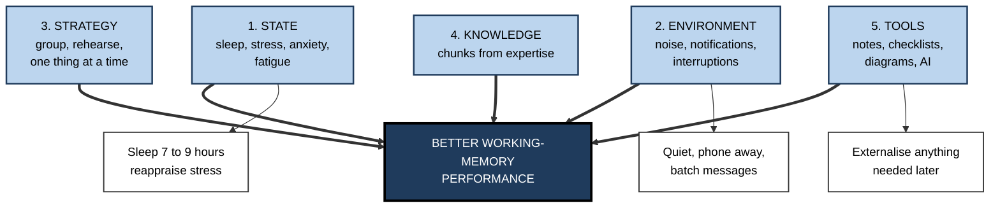
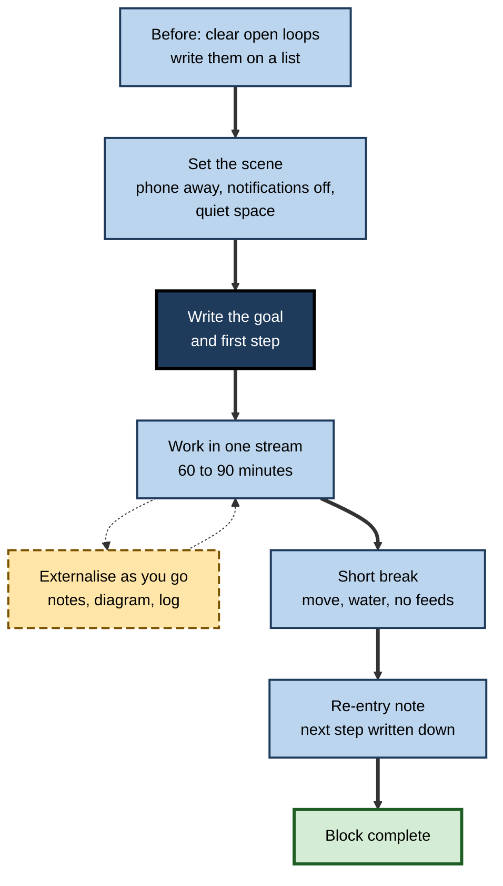

# E.11. Improving Working Memory Performance

> **In one sentence:** You cannot easily make your working memory bigger, but you can make it work much better — by protecting your mental state, removing distractions, using smart strategies, building knowledge and putting information outside your head.
>
> **Why it matters:** The gap between people's best and worst working-memory days is large, and much of it is under their control. Professionals who manage state, environment and tools reliably get more from the same brain, make fewer errors and help their teams do the same.
>
> **Level span:** Novice → Expert · **Reading time:** ~15 min · **Builds on:** working-memory capacity, the central executive and chunking

---

## The Learning Ladder

| Level | Badge | After this level you can... |
|---|---|---|
| 1 | NOVICE | Name the everyday things that make your working memory better or worse. |
| 2 | FOUNDATIONS | Describe the five levers — state, environment, strategy, knowledge and tools — and which have the strongest evidence. |
| 3 | PRACTITIONER | Run a personal working-memory audit and build a routine for high-load work. |
| 4 | ADVANCED | Judge the evidence behind popular claims — exercise, mindfulness, supplements, phones, bilingualism. |
| 5 | EXPERT / PRO | Shape team environments, policies and tools that improve collective working-memory performance. |

---

## Level 1 · Novice — The Big Picture

Think of working memory as the screen of a small laptop. You cannot easily buy a bigger screen. But you can:

- **charge the battery** (sleep, calm, energy);
- **close the pop-ups** (distractions and notifications);
- **arrange the windows sensibly** (strategies like grouping and rehearsing);
- **install better software** (knowledge that turns details into chunks);
- **plug in a second monitor** (notes, checklists, diagrams).

You already know this from experience:

- After a bad night's sleep, you read the same paragraph three times.
- During a stressful week, you forget simple things and lose your train of thought.
- In a quiet room with your phone in another room, you get more done in an hour than in a noisy afternoon of pings.
- Writing a to-do list makes your mind feel lighter.

The big message: **improving working memory performance is mostly about the conditions you work in and how you use the space — not about exercises that try to stretch it.** (Working-memory training is examined separately; its benefits rarely spread beyond the trained tasks.)

---

## Level 2 · Foundations — Core Concepts

### The five levers

**Figure E.11-1 — Five levers for better working-memory performance.**

*How to read it:* five independent levers all feed performance (thick arrows); white boxes give the most practical first action for three of them.

### Strength of evidence by lever

| Lever | Evidence strength | Summary |
|---|---|---|
| **Sleep** | Strong | Sleep deprivation reliably impairs working memory and attention. |
| **Stress and anxiety** | Strong | Acute stress weakens prefrontal control; worry consumes capacity. |
| **Distraction and interruption** | Strong | Interruptions and background speech reliably impair working-memory tasks. |
| **Externalising (notes, aids)** | Strong | Offloading information reliably improves accuracy on complex tasks. |
| **Knowledge and chunking** | Strong | Domain knowledge is the most powerful expander of effective capacity. |
| **Simple strategies** (grouping, rehearsal) | Moderate to strong | Grouping and rehearsal improve span; benefits are task-specific. |
| **Acute exercise** | Moderate, small effects | A bout of moderate exercise produces small, short-lived benefits on executive tasks. |
| **Mindfulness training** | Mixed | Some studies show gains; effects are small and inconsistent across trials. |
| **Caffeine** | Moderate for alertness | Helps when tired; benefits for well-rested people are small. |
| **Supplements and "smart drugs"** | Weak or negative for healthy adults | Little reliable evidence of meaningful working-memory gains. |

### Key terms

| Term | Plain meaning |
|---|---|
| **Cognitive state** | Your current condition — rested, stressed, anxious, tired — that affects mental performance. |
| **Cognitive offloading** | Using external tools to reduce mental demands. |
| **Reappraisal** | Reinterpreting a situation or feeling, for example viewing stress arousal as helpful energy. |
| **Attention residue** | Lingering thoughts about a previous task that reduce focus on the current one. |
| **Rehearsal** | Repeating information to keep it active. |
| **Implementation intention** | A plan in the form "When X happens, I will do Y", which reduces reliance on remembering. |

---

## Level 3 · Practitioner — Putting It to Work

### The personal working-memory audit — one week

1. **Track your bad moments.** For a week, note each time you lose your train of thought, forget a step or re-read something repeatedly. Record the time, task and what was happening.
2. **Tag the cause.** State (tired, stressed), environment (noise, ping), task (too much to hold), or knowledge (unfamiliar material).
3. **Find the top two causes.** Most people find one or two dominate.
4. **Pick one fix per cause** from the table below.
5. **Re-run the audit** for another week and compare.

| Cause | First fix to try |
|---|---|
| Tiredness | Protect sleep before high-load days; schedule hard work earlier. |
| Stress or anxiety | Brief reappraisal ("this arousal is energy for the task"), slow breathing, write worries down before starting. |
| Notifications | Do-not-disturb during focus blocks; phone out of sight. |
| Background speech | Quiet room, sound masking, or noise-cancelling headphones without lyrics. |
| Too much to hold | Write it down: goal, steps, open items; draw relationships. |
| Unfamiliar material | Pre-learn key terms; build a glossary; use worked examples. |

**Figure E.11-2 — A routine for a high-load work block.**

*How to read it:* follow the thick path from setup to finish; the dotted loop shows continuous externalising during the work.

### Worked example — a financial analyst during month-end close

| | Before | After |
|---|---|---|
| **State** | Late nights all week; working on reconciliations at 11 pm. | Reconciliations moved to mornings; late nights limited. |
| **Environment** | Open-plan desk next to the sales team; chat open. | Booked quiet room; chat checked hourly. |
| **Strategy and tools** | Holds account variances in head while switching between spreadsheets. | Variance log with columns for account, amount, explanation, status. |
| **Outcome** | Errors caught in review; rework. | Fewer errors; close completed faster. |

### Common mistakes

- **Buying a fix instead of changing a condition** — supplements and apps rather than sleep and quiet.
- **Trying to "concentrate harder"** in a distracting setting.
- **Keeping a running to-do list in your head.**
- **Doing the hardest thinking at your worst time of day.**
- **Listening to lyrics or podcasts while reading or writing.**

---

## Level 4 · Advanced — Mechanisms, Models & Evidence

### Sleep

Sleep deprivation consistently impairs attention and working memory, and people are poor judges of their own impairment after repeated short nights. Mechanisms include reduced prefrontal function and lapses of attention. Sleep is also central to consolidating what was learned, which is covered elsewhere in this map.

### Stress, anxiety and reappraisal

Acute stress shifts brain function away from flexible prefrontal control toward habit. Worry consumes working memory directly. Two kinds of intervention have evidence: **reappraisal** — interpreting physiological arousal as helpful rather than threatening — has improved performance in several studies; and **expressive writing** about worries before a high-stakes test showed benefits in early studies, though later replications are mixed. Both are cheap and low risk, so they are reasonable to try, but not guaranteed.

### Environment: phones, notifications and noise

- **Interruptions** reliably degrade performance on the interrupted task and increase errors; the cost depends on the interruption's complexity and timing.
- **Background speech** disrupts verbal tasks automatically.
- **The "mere presence" of a smartphone**: a much-cited 2017 study reported that simply having your phone on the desk reduced available working memory. Later direct replications have largely failed to find the effect, so treat it as contested. The broader advice — fewer notifications and fewer checks — rests on stronger evidence about interruptions.

### Exercise, mindfulness and nutrition

- **Acute exercise**: meta-analyses report small positive effects on executive function shortly after moderate exercise. Long-term fitness is associated with better cognitive ageing, though causal effects on working memory in healthy adults are modest.
- **Mindfulness**: some trials report improved working-memory scores and reduced mind-wandering; others find little effect. Effects appear small and depend on programme quality and dose.
- **Nutrition and supplements**: for healthy, well-nourished adults there is little reliable evidence that supplements improve working memory. Correcting genuine deficiencies is a different matter and a medical question.

### The bilingual advantage debate

Earlier studies suggested that bilingual people have stronger executive control and working memory. Large studies and meta-analyses correcting for publication bias have found little or no reliable advantage. Bilingualism has many benefits, but a general working-memory boost is not well supported.

### Strategy: what helps and what does not transfer

Teaching specific strategies — grouping, rehearsal, imagery, recoding into meaningful units — improves performance on tasks where the strategy applies. These gains do not generalise to unrelated tasks. That is not a failure: in work settings, you choose strategies for the tasks you actually do.

---

## Level 5 · Expert / Pro — Professional Mastery

### Team-level levers

| Lever | Team practice |
|---|---|
| State | Sustainable hours; avoid late-night decision meetings; on-call rotations designed for recovery. |
| Environment | Quiet zones, focus hours, notification norms, async defaults. |
| Strategy | Shared templates for problem docs, incident logs, decision records. |
| Knowledge | Pattern libraries, glossaries, deliberate onboarding to core chunks. |
| Tools | Checklists, runbooks, dashboards that put needed information in view, and AI assistants configured to offload storage. |

### Professional scenario

**Role:** Head of operations at a customer-support centre.
**Situation:** Error rates on complex refund cases rise sharply in the afternoon and during peak weeks.
**What the pro does:** Analyses errors by time and case type. Introduces a refund decision checklist embedded in the ticket form, a quiet "complex cases" pod with chat notifications disabled, and scheduling that places complex cases in agents' first half of the shift. Breaks are made non-negotiable during peak weeks. Error rates by hour and case type are tracked, and the afternoon spike shrinks.

### AI tools: offload storage, keep thinking

AI assistants can hold context, summarise long threads and draft checklists, which can relieve working memory. The professional rule: **offload storage and lookup; keep the reasoning you need to own.** Research on generative AI in 2025 found that structured use — forming your own outline first, limiting the tool to specific functions, and checking its output against your reasoning — reduced unhelpful offloading and preserved critical engagement, while unstructured reliance was associated with less reflection.

### Ethics and limits

- Avoid marketing or buying unproven "memory boosters" for staff.
- Respect that some colleagues have conditions (ADHD, anxiety, long COVID, hearing loss) that affect working memory; adjustments such as written instructions, quiet space and flexible pacing are often simple and effective.
- Do not use working-memory performance as a covert performance metric; it fluctuates with conditions the organisation largely controls.

---

## Myths vs. Evidence

| Myth | What the evidence shows |
|---|---|
| "Supplements boost working memory." | Little reliable evidence for healthy adults. |
| "Bilinguals have better working memory." | Large studies find little or no reliable general advantage. |
| "Having your phone nearby drains your brain." | The original finding has largely failed to replicate; notifications and interruptions are the clearer problem. |
| "You can push through on little sleep." | Sleep loss reliably impairs working memory, and people underestimate their impairment. |
| "Music always helps focus." | Lyrics and speech disrupt verbal tasks; steady instrumental sound is less harmful. |
| "Mindfulness reliably boosts working memory." | Results are mixed and effects small. |

## Practitioner Toolkit

**Daily working-memory checklist**

- [ ] Slept enough before high-load work.
- [ ] Open loops written down before starting.
- [ ] Notifications off; phone out of reach during focus blocks.
- [ ] Goal and first step written.
- [ ] Notes, logs and diagrams used as I go.
- [ ] Breaks taken; re-entry note left.
- [ ] Hardest thinking scheduled at my best time.

**Template — weekly audit log**

| Date and time | Task | What went wrong | Cause tag (state, environment, task, knowledge) | Fix to try |
|---|---|---|---|---|
| | | | | |

## Self-Check

1. **[NOVICE]** Name three everyday things that worsen working-memory performance.
2. **[NOVICE]** Why does writing a to-do list make your mind feel lighter?
3. **[FOUNDATIONS]** What are the five levers?
4. **[FOUNDATIONS]** Which levers have the strongest evidence?
5. **[PRACTITIONER]** Describe the one-week audit.
6. **[ADVANCED]** What is the status of the "phone presence" effect?
7. **[ADVANCED]** What does the evidence say about the bilingual advantage?
8. **[EXPERT / PRO]** Give three team practices that improve working-memory performance.
9. **[EXPERT / PRO]** Why should working-memory performance not be used as a hidden performance metric?

### Answer Key

1. Poor sleep, stress, notifications, background speech, multitasking.
2. It externalises open items so they no longer occupy working memory.
3. State, environment, strategy, knowledge, tools.
4. Sleep, stress management, reducing distraction, externalising and building knowledge.
5. Track working-memory failures for a week, tag causes, pick fixes for the top two, then re-audit.
6. Largely failed to replicate; contested.
7. Large studies find little or no reliable general advantage.
8. Examples: focus hours, quiet zones, notification norms, checklists, decision logs, sustainable schedules.
9. It fluctuates with conditions the organisation controls and may disadvantage people with health conditions.

## Key Takeaways

- You improve working memory mainly by **improving conditions and use**, not by stretching it.
- **Sleep, calm and quiet** are the strongest everyday levers.
- **Externalise** anything needed later; **build knowledge** to chunk more.
- Popular boosters — **supplements, phone-free myths, bilingual advantage** — are weak or contested.
- At team level, design **environments and norms** that protect working memory.
- Use AI to **offload storage**, not the thinking you need to own.

## Glossary

| Term | Meaning |
|---|---|
| Attention residue | Lingering thoughts from a previous task that reduce focus. |
| Bilingual advantage | The contested claim that bilinguals have better executive function. |
| Cognitive offloading | Using external tools to reduce mental demands. |
| Cognitive state | Current condition affecting mental performance. |
| Expressive writing | Writing about worries, sometimes used before tests. |
| Implementation intention | An if-then plan that reduces reliance on remembering. |
| Reappraisal | Reinterpreting arousal or a situation in a more helpful way. |
| Sound masking | Steady background sound that reduces speech intelligibility. |
