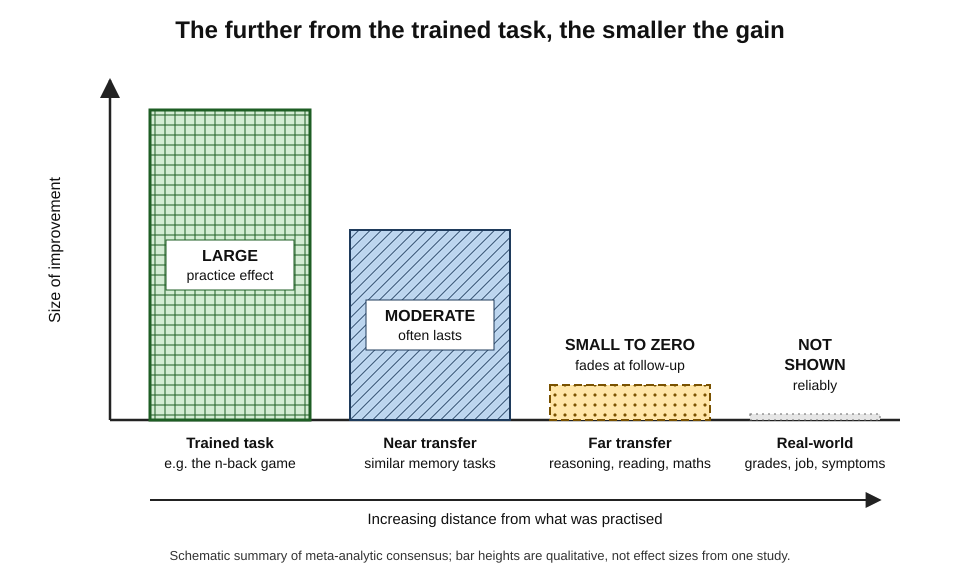
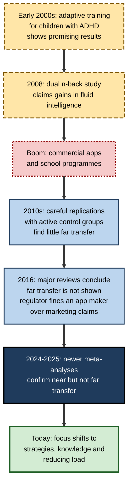
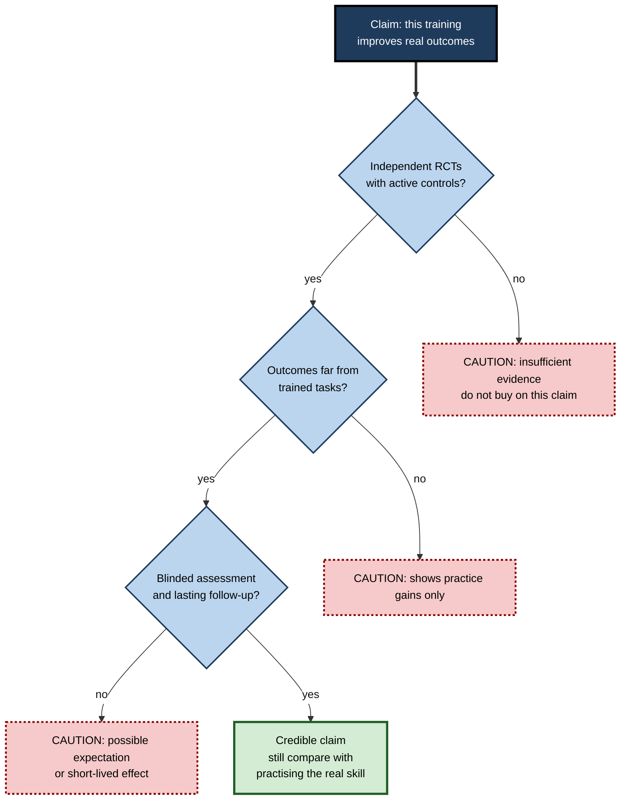

# E.12. Working Memory Training Research

> **In one sentence:** Practising working-memory games makes you better at those games and at very similar tasks, but after two decades of research there is little reliable evidence that it makes you smarter, better at school or better at your job.
>
> **Why it matters:** Brain-training products are marketed to parents, schools, employers and older adults. Professionals who understand the research — and how to read a training study — save money, avoid false promises and invest instead in what actually improves performance.
>
> **Level span:** Novice → Expert · **Reading time:** ~16 min · **Builds on:** working-memory capacity, learning transfer basics

---

## The Learning Ladder

| Level | Badge | After this level you can... |
|---|---|---|
| 1 | NOVICE | Explain the difference between getting better at a game and getting smarter. |
| 2 | FOUNDATIONS | Define near and far transfer and summarise the main research findings. |
| 3 | PRACTITIONER | Evaluate a brain-training product or claim with a simple checklist. |
| 4 | ADVANCED | Explain the methodological issues — control groups, expectations, publication bias — and the current meta-analytic consensus. |
| 5 | EXPERT / PRO | Advise organisations, schools and clients on cognitive training, and design alternatives that work. |

---

## Level 1 · Novice — The Big Picture

Imagine you practise a game where letters flash on screen and you must press a button whenever the current letter matches the one shown two steps earlier. After a few weeks you are much better at it. Does that mean your memory is better *in general* — for names, for meetings, for studying, for solving problems at work?

That is the question working-memory training research has tried to answer since the early 2000s. The answer, after hundreds of studies:

- **Yes**, you get much better at the game you practise.
- **Somewhat**, you also get better at very similar memory tasks.
- **Mostly no**, you do not reliably get better at different abilities such as reasoning, reading, maths, attention in daily life or job performance.

It is like practising free throws in basketball. You become better at free throws, a little better at similar shots, but not better at football or chess.

You may have seen apps promising to "boost your brain", "improve focus" or "keep your mind young". The evidence says to be sceptical: the improvement mostly stays inside the app.

---

## Level 2 · Foundations — Core Concepts

### Near and far transfer

**Transfer** means improvement on something you did not directly practise.

| Type | Definition | Example |
|---|---|---|
| **Trained task** | The exercise you practised. | Getting better at the n-back game. |
| **Near transfer** | Improvement on similar, untrained tasks measuring the same ability. | Better at a different memory-span task. |
| **Far transfer** | Improvement on different abilities. | Better at reasoning puzzles, reading comprehension or maths. |
| **Real-world transfer** | Improvement in everyday outcomes. | Better grades, fewer ADHD symptoms in class, better job performance. |

*Figure E.12-1 — The transfer gradient.* Cross-hatched bar: large gains on the trained task. Hatched bar: moderate gains on similar memory tasks, which often persist. Dotted bar: small to zero gains on different abilities, which tend to fade. Grey sliver: no reliable real-world benefit shown. Schematic summary; heights are qualitative.

### A brief history

**Figure E.12-2 — How the working-memory training story unfolded.**

*How to read it:* time runs top to bottom; dashed boxes are early promising claims, the dotted box is the hype phase, and the thick-bordered box is the current direction.

### Key terms

| Term | Plain meaning |
|---|---|
| **Adaptive training** | Training that gets harder as you improve, keeping you at your limit. |
| **N-back** | A task where you indicate whether the current item matches one N steps back. |
| **Active control group** | A comparison group that does an equally engaging but different activity. |
| **Passive control group** | A comparison group that does nothing (no-contact). |
| **Placebo or expectation effect** | Improvement caused by believing you will improve. |
| **Meta-analysis** | A study that statistically combines many studies. |
| **Second-order meta-analysis** | A study combining the results of several meta-analyses. |
| **Publication bias** | Positive results being more likely to be published than null results. |

---

## Level 3 · Practitioner — Putting It to Work

### The Brain-Training Claim Check

Use this whenever you are asked to approve, buy or recommend a cognitive training product.

1. **What exactly is promised?** Better at the game, or better at school, work or daily life? Only the second matters to buyers.
2. **Where is the evidence?** Independent, peer-reviewed randomised controlled trials — not testimonials or company white papers.
3. **What was the control group?** Passive (no activity) controls exaggerate effects. Look for active controls.
4. **Were outcomes far from the training?** Gains on similar tasks do not show real-world benefit.
5. **Were participants and assessors blind?** Parent and teacher ratings by people who know who was trained are vulnerable to expectation.
6. **Did gains last?** Look for follow-up months later.
7. **Does it compare with alternatives?** Would the same time spent on the real skill (reading, maths, the job task) do more?

**Figure E.12-3 — Evaluating a cognitive-training claim.**

*How to read it:* a claim must pass all three questions to be credible; most commercial claims fail at the first or second.

### Worked example — a school district proposal

| | Proposal | Evidence-based response |
|---|---|---|
| **Offer** | A licence for a working-memory training app for all pupils with learning difficulties, promising better reading and maths. | Request independent trials with active controls and reading or maths outcomes. |
| **Evidence offered** | Company study with no-contact control, gains on app tasks and parent ratings. | Gains are on near tasks; parent ratings are unblinded. Meta-analyses find no reliable effect on reading or maths. |
| **Decision** | — | Spend the budget instead on structured reading interventions and on training teachers to reduce working-memory load in lessons. |

### Common mistakes

- **Confusing practice gains with improved ability.**
- **Trusting testimonials and satisfaction ratings.**
- **Accepting studies with passive control groups.**
- **Ignoring opportunity cost** — the hours could be spent on the real skill.

---

## Level 4 · Advanced — Mechanisms, Models & Evidence

### Key studies and reviews

- **Early adaptive training for ADHD.** Torkel Klingberg and colleagues reported in the early 2000s that adaptive working-memory training improved working memory and some related measures in children with ADHD, leading to the Cogmed programme. Later meta-analyses found that improvements in ADHD symptoms appeared mainly in ratings by people who knew which children had trained, and not reliably in blinded assessments.
- **Dual n-back and intelligence.** In 2008, Susanne Jaeggi and colleagues reported that dual n-back training improved fluid intelligence. Several later studies, including Thomas Redick and colleagues in 2013 using an active control group, found no such transfer.
- **Meta-analyses.** Monica Melby-Lervåg and Charles Hulme (2013), and with Redick in 2016, concluded that training produces near-transfer gains but no convincing far transfer to intelligence, reading or arithmetic, especially when active controls are used. Giovanni Sala and Fernand Gobet's second-order meta-analyses reached similar conclusions across cognitive training more broadly.
- **Consensus reviews.** A 2016 review led by Daniel Simons concluded that brain-training programmes improve performance on trained tasks, less on closely related tasks, and show little evidence of improving everyday cognitive performance. The same year, a US regulator reached a settlement with a major brain-training company over unsupported advertising claims.
- **Recent evidence (2024–2025).** Newer meta-analyses of computerised cognitive training report that benefits are largely restricted to tasks resembling the trained format, with minimal far transfer. A 2024 second-order meta-analysis of n-back training reached the same conclusion: gains on closely related tasks, no supported generalisation to broader cognition. Analyses of training in children likewise find near-transfer gains that persist at follow-up, while far-transfer effects are small, limited and not sustained.

### Why studies disagree

| Issue | Effect on results |
|---|---|
| **Passive control groups** | Inflate apparent effects, because any engaging activity or expectation can improve test scores. |
| **Expectation effects** | One study showed that merely recruiting participants with an advertisement promising cognitive enhancement produced larger gains on intelligence tests than a neutral advertisement, despite identical training. |
| **Small samples** | Produce unstable, often inflated estimates. |
| **Single far-transfer measures** | A gain on one reasoning test may reflect task-specific strategies, not ability change. |
| **Publication bias** | Positive studies are more visible; bias-corrected estimates of far transfer shrink toward zero. |
| **Many outcomes measured** | Reporting the ones that "worked" creates false positives. |

### Why far transfer is so hard

Two explanations are complementary:

1. **Training improves task-specific strategies and skills**, not the underlying capacity. People learn how to do the n-back better — grouping, rhythm, attention tricks — and these strategies do not apply elsewhere.
2. **Far transfer requires shared elements.** Since Edward Thorndike's early twentieth-century work, transfer has been understood to depend on overlap between the trained and target tasks. Reasoning, reading and job tasks rely heavily on knowledge, which working-memory games do not provide.

### Open questions

- **Who benefits?** Some researchers propose that people with lower starting ability gain more ("compensation"); others find people with higher ability gain more ("magnification"). Results are inconsistent.
- **Older adults.** Large trials of cognitive training in older adults show durable gains on trained abilities, with some reports of benefits for everyday functioning and long-term outcomes; these secondary findings are debated and do not establish that working-memory training prevents decline.
- **Combined and strategy-based approaches.** Training that teaches strategies tied to specific target tasks, or that is embedded in academic content, is more promising than generic training — but that starts to look like ordinary skill instruction.

---

## Level 5 · Expert / Pro — Professional Mastery

### Advising organisations

Requests for "brain training", "focus apps" or "cognitive fitness" programmes arrive regularly in HR and L&D. A professional response:

| Request | Evidence-informed alternative |
|---|---|
| "Improve staff focus with a brain-training app." | Reduce interruptions, set notification norms, protect focus time. |
| "Help employees learn faster." | Spaced, retrieval-based training on the actual job skills; worked examples; job aids. |
| "Support staff with ADHD or memory difficulties." | Written instructions, task-management tools, quiet space, flexible pacing. |
| "Keep older employees sharp." | Challenging work, learning opportunities, health support (sleep, hearing), mixed-age teams. |
| "Train decision-making under pressure." | Domain-specific simulation and scenario practice. |

### Professional scenario

**Role:** Chief learning officer at a large professional-services firm.
**Situation:** An executive wants to buy a cognitive training subscription for all staff, citing a vendor's claim of a large improvement in "working memory and productivity".
**What the pro does:** Requests the underlying studies and finds a single vendor-funded study with a passive control group and outcomes measured only on the vendor's own tasks. The CLO briefs the executive on the meta-analytic consensus, then proposes a pilot of interventions with stronger evidence — notification norms, focus blocks, and retrieval-based practice on core analytical skills — with productivity and quality measured against a comparison group. The executive agrees; the pilot's results inform a firm-wide rollout.

### Ethics and communication

- **Do not oversell.** Telling parents or employees that a programme will improve learning or performance without evidence raises ethical and, in some jurisdictions, legal issues around advertising and procurement.
- **Respect hope.** People seek training because they struggle. Offer alternatives that work rather than dismissing the need.
- **Stay current.** The field updates; preregistered, well-controlled trials are the evidence to watch.

### AI-era implications

AI-driven "personalised brain training" apps now adapt difficulty and content in real time. Personalisation does not change the transfer problem: an adaptive game still trains the game. At the same time, AI tutors that adapt *content* — maths, coding, language — embed practice in the target skill itself, which is where transfer happens. The professional principle: **practise the thing you want to get better at, with adaptive support**, rather than practising an abstract memory task in the hope it spreads.

---

## Myths vs. Evidence

| Myth | What the evidence shows |
|---|---|
| "Brain games make you smarter." | Gains stay largely with trained and similar tasks; far transfer to intelligence is not supported. |
| "Working-memory training fixes ADHD." | Symptom improvements appear mainly in unblinded ratings; blinded measures show little effect. |
| "If scores improved, the brain improved." | Score gains may reflect task-specific strategies or expectations. |
| "Training protects against dementia." | Not established; claims from secondary analyses are debated. |
| "More adaptive, AI-personalised training will transfer." | Personalisation does not solve the transfer problem. |
| "Nothing improves working-memory performance." | Conditions, strategies, knowledge and tools reliably improve performance on real tasks. |

## Practitioner Toolkit

**Training-claim checklist**

- [ ] The claimed benefit is a real-world outcome, not a game score.
- [ ] Independent randomised controlled trials exist.
- [ ] Control groups were active, not passive.
- [ ] Outcomes included far tasks and real-world measures.
- [ ] Assessors were blind to group.
- [ ] Gains lasted at follow-up.
- [ ] I compared with spending the same time on the target skill.

**Template — vendor question list**

1. Which independent, peer-reviewed trials support your claim?
2. What did the control group do?
3. Which outcomes improved, and were they measured by blinded assessors?
4. How long did gains last?
5. What were the effect sizes on outcomes unlike your training tasks?

## Self-Check

1. **[NOVICE]** What is the difference between getting better at a game and getting smarter?
2. **[NOVICE]** Which kind of improvement does training reliably produce?
3. **[FOUNDATIONS]** Define near and far transfer.
4. **[FOUNDATIONS]** Why do active control groups matter?
5. **[PRACTITIONER]** List four questions from the claim check.
6. **[ADVANCED]** What did later studies find about the 2008 dual n-back claim?
7. **[ADVANCED]** Give two reasons far transfer is hard to achieve.
8. **[EXPERT / PRO]** How would you respond to a request to buy a brain-training app for staff?
9. **[EXPERT / PRO]** Why does AI personalisation not solve the transfer problem?

### Answer Key

1. Game improvement reflects practice on that task; getting smarter would mean improvement in different abilities and real outcomes.
2. Gains on the trained task and similar tasks.
3. Near: improvement on similar untrained tasks; far: improvement on different abilities.
4. They control for engagement and expectation effects that inflate results with passive controls.
5. Examples: what exactly is promised, where is the independent evidence, what was the control, were outcomes far from training, were assessors blind, did gains last.
6. Studies with active controls, including Redick and colleagues, found no transfer to fluid intelligence.
7. Training mostly builds task-specific strategies; far transfer needs shared elements, and target skills depend on knowledge.
8. Review the evidence, explain the consensus, and propose interventions with stronger evidence, measured against a comparison group.
9. Adaptive games still train the game; transfer depends on practising the target skill.

## Key Takeaways

- Working-memory training improves **trained and similar tasks**.
- **Far transfer** to intelligence, school or work is **not reliably shown**.
- Early positive results often came from **passive controls, expectations or small samples**.
- Recent **2024–2025 meta-analyses** confirm the consensus.
- **Practise the target skill** and improve conditions instead.
- Evaluate claims with **active controls, far outcomes, blinding and follow-up**.

## Glossary

| Term | Meaning |
|---|---|
| Active control group | A comparison group doing an engaging alternative activity. |
| Adaptive training | Training that adjusts difficulty to performance. |
| Compensation hypothesis | Lower-ability people gain more from training. |
| Expectation effect | Improvement driven by belief in the intervention. |
| Far transfer | Improvement on different, untrained abilities. |
| Magnification hypothesis | Higher-ability people gain more from training. |
| Meta-analysis | Statistical combination of many studies. |
| N-back | A task requiring matching items N steps back. |
| Near transfer | Improvement on similar untrained tasks. |
| Passive control group | A comparison group with no activity. |
| Publication bias | Over-representation of positive results in published work. |
| Second-order meta-analysis | A combination of results from several meta-analyses. |
| Transfer | Improvement on tasks not directly practised. |
