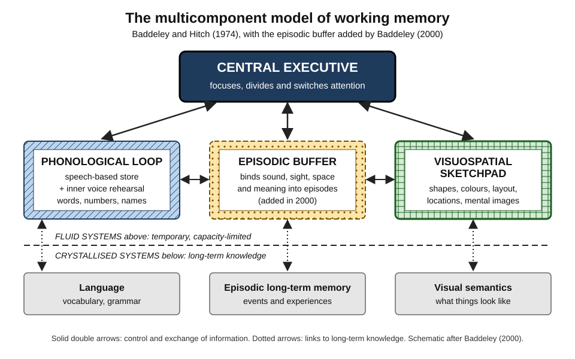
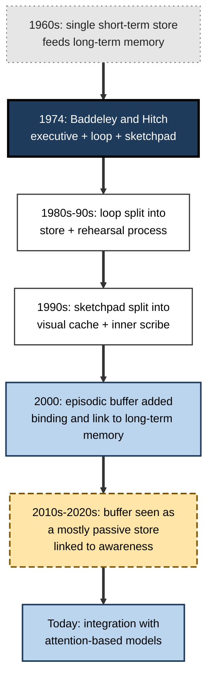
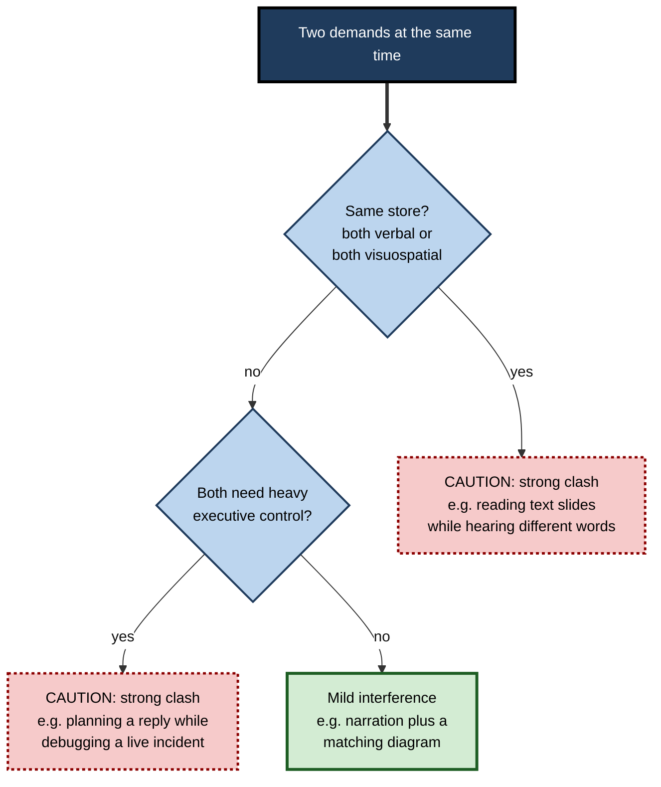

# E.2. The Baddeley-Hitch Model

> **In one sentence:** The Baddeley-Hitch model says working memory is not one box but a small team: an attention "manager" (the central executive) that directs a verbal store (the phonological loop), a visual-spatial store (the visuospatial sketchpad) and, since 2000, a binding store (the episodic buffer).
>
> **Why it matters:** The model is the most widely used map of working memory in education, clinical psychology and user-experience design. Knowing its parts lets you predict which tasks will clash when done together and how to present information so people can actually use it.
>
> **Level span:** Novice → Expert · **Reading time:** ~15 min · **Builds on:** the idea of working memory as a small, temporary workspace

---

## The Learning Ladder

| Level | Badge | After this level you can... |
|---|---|---|
| 1 | NOVICE | Name the four parts of the model and say what each does in everyday terms. |
| 2 | FOUNDATIONS | Explain the evidence that led to the model and use its vocabulary correctly. |
| 3 | PRACTITIONER | Use the model to predict which tasks will interfere with each other and redesign work accordingly. |
| 4 | ADVANCED | Evaluate the model's strengths, its weak points and how it compares with rival theories. |
| 5 | EXPERT / PRO | Apply the model in instructional, interface and workplace design without overselling it. |

---

## Level 1 · Novice — The Big Picture

Picture a small newsroom with one editor and three specialist desks:

- **The editor (central executive)** decides what the team works on, what to ignore and when to switch stories. The editor does not store much; the editor directs.
- **The audio desk (phonological loop)** keeps track of words and sounds — a name you just heard, the digits of a code, the sentence you are about to say.
- **The picture desk (visuospatial sketchpad)** keeps track of shapes, colours and positions — where the exit was on the floor plan, what the chart looked like, how the furniture would fit if you moved it.
- **The layout desk (episodic buffer)** pulls words, images and background knowledge together into a single scene or story — for example, linking a person's face, name and the meeting where you met them.

You have already experienced this split. You can usually listen to a podcast while walking a familiar route, because words and spatial movement use different desks. But try reading an email while someone talks to you, and both compete for the audio desk — you lose track of one or the other. And try doing mental arithmetic while reversing a car into a tight space: the editor is overloaded, so you stop talking.

The big idea: **working memory has separate parts for different kinds of information, plus a limited manager that coordinates them.**

---

## Level 2 · Foundations — Core Concepts

### Where the model came from

In the late 1960s, the dominant view treated short-term memory as a single store that fed long-term memory. Alan Baddeley and Graham Hitch, working in the UK, tested this by giving people a short-term memory load (holding several digits) while they did reasoning, comprehension or learning tasks. If short-term memory were one small store essential for thinking, filling it should have wrecked performance. Instead, people slowed down only modestly and made few extra errors. In 1974 they proposed that short-term storage and processing are handled by a system of several cooperating parts, which they named **working memory**.

Two other kinds of evidence supported the split:

- **Selective interference.** Repeating a word aloud (which occupies the verbal system) disrupts remembering words much more than remembering locations; tracking a moving target does the reverse.
- **Patients with selective damage.** Some people with brain injury had very poor verbal short-term memory yet could still form normal long-term memories, which a single-store pipeline could not explain.

*Figure E.2-1 — The multicomponent model of working memory.* The central executive directs three temporary stores (above the dashed line), which exchange information with long-term knowledge (below the line). Patterns and border styles distinguish the three stores in print.

### The four components

| Component | What it holds or does | Everyday example | Work example |
|---|---|---|---|
| **Central executive** | Directs attention: focusing, dividing, switching; links to long-term memory. Stores little itself. | Deciding to ignore a notification and keep reading. | Keeping the meeting goal in view while the discussion drifts. |
| **Phonological loop** | Holds speech-based information for a couple of seconds; refreshed by silent rehearsal (the "inner voice"). | Repeating a phone number under your breath. | Holding a customer's account number while you type it. |
| **Visuospatial sketchpad** | Holds visual features and spatial layout; supports mental imagery. | Picturing the route from the car park to the office. | Mentally rotating an architecture diagram to see how components connect. |
| **Episodic buffer** | Binds information from the other parts and from long-term memory into integrated multi-feature episodes; linked to conscious awareness. | Remembering a sentence as a meaning, not a string of sounds. | Holding a "picture" of a user journey that combines screens, words and the user's goal. |

### Key terms

| Term | Plain meaning |
|---|---|
| **Multicomponent model** | Any model in which working memory is made of several specialised parts. |
| **Slave or subsidiary systems** | The original name for the loop and sketchpad, which serve the executive. |
| **Dual-task paradigm** | Studying memory by having people do two tasks at once and seeing which pairs interfere. |
| **Articulatory suppression** | Saying something irrelevant aloud ("the, the, the") to block the inner voice. |
| **Binding** | Linking separate features — colour, shape, location, name — into one remembered object or event. |
| **Fluid versus crystallised systems** | Temporary working-memory stores versus stable long-term knowledge. |

**Figure E.2-2 — How the model grew between 1974 and today.**

*How to read it:* top to bottom is time; each box is a revision of the model. The grey box is the older view the model replaced.

---

## Level 3 · Practitioner — Putting It to Work

The most useful practical prediction of the model is **interference by type**: two tasks that need the same component clash; two tasks that need different components clash much less — unless both lean heavily on the central executive.

### The Clash Check — five steps

1. **List the concurrent demands.** What does the person have to do and hold at the same moment? (Listen, read, look at a diagram, track a location, decide.)
2. **Tag each demand by component.** Words and sounds = loop; images and positions = sketchpad; deciding, switching, planning = executive.
3. **Find the same-component pairs.** Two verbal demands at once (reading slides while hearing different words) is a clash. Two executive-heavy demands (deciding and planning in parallel) is the worst clash of all.
4. **Re-pair or sequence.** Pair a verbal stream with a visual one that supports it (narration plus a diagram), or move one demand earlier or later.
5. **Offload the executive.** Checklists, defaults and clear next steps take decisions off the manager's desk.

**Figure E.2-3 — Which pairings clash?**

*How to read it:* answer the two questions in order; dotted-border boxes are pairings to avoid.

### Worked example — a product demo for prospects

| | Before | After |
|---|---|---|
| **Slides** | Dense bullet text the presenter reads aloud while also adding different points. | One annotated screenshot per slide; the presenter talks while pointing. |
| **Components used** | Loop overloaded twice (reading plus listening); executive switching between them. | Loop handles narration; sketchpad handles the screenshot; buffer binds them. |
| **Live configuration** | Presenter asks the audience to remember three settings while showing the next screen. | Settings stay visible in a side panel. |
| **Outcome** | Prospects remember little and ask the same questions again. | Better recall of the key workflow in follow-up calls. |

### Common mistakes

- **Assuming "visual plus verbal" always helps.** It helps when the visual supports the words; decorative or competing visuals add load.
- **Forgetting the executive.** Many workplace clashes are not verbal-versus-visual; they are two decisions at once.
- **Treating the model as a brain map.** The components are functional roles, not neatly separate brain regions.
- **Reading text aloud from slides.** Hearing and reading the same words is redundant; hearing *different* words from those on screen is worse.

---

## Level 4 · Advanced — Mechanisms, Models & Evidence

### What the model gets right

- **Domain-specific interference is real and robust.** Across decades of dual-task research, verbal tasks interfere more with verbal memory and spatial tasks more with spatial memory. This is one of the most replicated patterns in the field.
- **The phonological loop explains specific effects** — similar-sounding lists are harder, long words are harder, and saying something irrelevant aloud removes these effects for visually presented lists. These patterns are covered in the note on the loop.
- **Neuropsychological dissociations** — patients with selective verbal or spatial short-term deficits — fit a multi-part system.
- **Practical reach.** The model gave educators, clinicians and designers a common vocabulary and inspired standardised assessments used with children and adults.

### Where it struggles

| Criticism | Detail | Current status |
|---|---|---|
| **The executive is vague** | Early versions risked a "homunculus" — a little person in the head who does whatever is needed. | Baddeley himself acknowledged this and has tried to break the executive into specific functions such as focusing, dividing and switching attention. |
| **The episodic buffer was underspecified** | Added in 2000 to explain binding and the link to long-term memory, but initially vague. | Later experiments by Baddeley, Allen and Hitch found that binding visual features was not especially demanding of executive attention, and they came to treat the buffer as a largely passive store fed by the other components. |
| **Brain mapping is messy** | Meta-analyses of imaging studies show heavy overlap between verbal and visuospatial working-memory networks. | Overlap may reflect shared attentional and binding processes; the components are best seen as functions rather than places. |
| **Decay versus interference** | The loop was described as fading over about two seconds without rehearsal; many researchers now argue forgetting is mainly due to interference. | Actively debated; both views predict similar workplace advice. |
| **Capacity accounting** | The model does not by itself give a single capacity number. | Attention-based models (Cowan) fill that gap with a limit on the focus of attention. |

### Rival and complementary models

- **Embedded-processes (Cowan):** working memory as the activated portion of long-term memory, with a narrow focus of attention holding roughly four chunks. It explains why knowledge expands effective capacity.
- **Executive-attention (Engle and colleagues):** emphasises individual differences in controlling attention as the key ingredient that predicts reasoning.
- **Multiple-component revisions (Logie and colleagues):** argue for even more specialised components working as a team, with no single central executive.

In recent writing, leading researchers, including Baddeley, Hitch and Logie themselves, have stressed that these frameworks are compatible at a high level: specialised stores plus a general attentional resource. The disagreements are mostly about how much weight to give each.

### Strength of evidence

The core claim — separable verbal and visuospatial resources plus attentional control — is well supported. Specific mechanisms (time-based decay, the exact nature of the buffer, the internal structure of the executive) remain contested. A practitioner should treat the model as a **reliable design heuristic**, not as a literal blueprint of the brain.

---

## Level 5 · Expert / Pro — Professional Mastery

### Where the model is used professionally

| Field | How the model is applied |
|---|---|
| Instructional design | Pair narration with relevant graphics; avoid on-screen text that duplicates or competes with narration; segment complex animations. |
| Assessment and clinical work | Standard batteries assess verbal span, visuospatial span and executive components separately to profile learners and patients. |
| Interface and dashboard design | Use spatial layout and visual grouping so users can hold structure in the sketchpad while reading labels. |
| Safety-critical operations | Avoid verbal radio traffic during tasks that require verbal planning; use visual displays for status, voice for alerts. |
| Software teams | Code review tools that place diffs side by side reduce the need to hold one version in memory while reading the other. |

### Professional scenario

**Role:** Learning experience designer building a compliance module for a global bank.
**Situation:** The existing module shows dense legal text on screen while a narrator reads a different summary. Completion is high but post-module scenario scores are poor.
**What the pro does:** Applies the model. The narrator's words now match a simple decision diagram rather than competing with on-screen text; the full legal text moves to a downloadable reference. Each scenario keeps the key facts visible so the learner's executive is spent on judgement, not recall. The designer measures scenario performance at four weeks rather than completion.

### Expert judgement

- **Use the model to ask better questions**, not to claim brain-region precision. "Which component is overloaded?" is a productive design question.
- **Watch the executive first.** In professional work, the scarcest resource is usually attentional control, not verbal or visual storage.
- **Remember the buffer's lesson.** People remember integrated meaning far better than separate fragments; design so that words, visuals and goals bind into one story.
- **Do not oversell.** The model is a powerful heuristic with open questions; experienced professionals present it that way to stakeholders.

### AI-era implications

AI tools can now generate diagrams to accompany text, transcribe meetings and summarise documents. Used well, they move content from the loop (fleeting speech) into persistent visual form and lighten executive load. Used poorly, they add parallel streams — live captions, chat side panels, suggestions — that compete for the same components. Professionals evaluate each new tool by asking which component it relieves and which it loads.

---

## Myths vs. Evidence

| Myth | What the evidence shows |
|---|---|
| "The four components are four separate brain areas." | They are functional roles; brain networks overlap substantially. |
| "Combining visuals and words always improves learning." | Only when visuals support the words; competing or decorative visuals add load. |
| "The central executive is a store." | In the model it mainly controls attention and stores little. |
| "The episodic buffer is the same as long-term episodic memory." | It is a temporary, limited workspace that binds information, linked to but distinct from long-term memory. |
| "The model has been replaced." | It remains the most widely used framework, now often combined with attention-based models. |
| "Multitasking works if tasks use different senses." | Different stores help, but tasks that both need executive control still clash. |

## Practitioner Toolkit

**Clash-check checklist for a presentation, interface or job aid**

- [ ] I listed what the person must hear, read, see and decide at the same moment.
- [ ] No moment requires reading text while hearing different words.
- [ ] Visuals support the narration rather than decorate or compete with it.
- [ ] Spatial layout groups related information.
- [ ] Decisions are sequenced, not stacked.
- [ ] Key facts stay visible so the executive is free for judgement.

**Template — component load table**

| Moment | Loop (words, sounds) | Sketchpad (images, layout) | Executive (decide, switch) | Fix |
|---|---|---|---|---|
| | | | | |

## Self-Check

1. **[NOVICE]** Name the four components and give an everyday job for each.
2. **[NOVICE]** Why is it easier to walk while listening than to read while listening?
3. **[FOUNDATIONS]** What finding first suggested that short-term memory is not a single store essential for all thinking?
4. **[FOUNDATIONS]** What is articulatory suppression and what does it block?
5. **[PRACTITIONER]** Which pairing clashes more: narration plus a matching diagram, or narration plus different on-screen text? Why?
6. **[ADVANCED]** Why was the episodic buffer added, and how has thinking about it changed?
7. **[ADVANCED]** Give two criticisms of the model and the current response to each.
8. **[EXPERT / PRO]** How would you use the model to redesign an e-learning module with poor scenario scores?
9. **[EXPERT / PRO]** How do you evaluate a new AI meeting tool using the model?

### Answer Key

1. Central executive (directs attention), phonological loop (holds words and sounds), visuospatial sketchpad (holds images and positions), episodic buffer (binds them into episodes).
2. Walking a familiar route and listening use different components; reading and listening both load the verbal system.
3. Holding a digit load during reasoning slowed people only modestly rather than wrecking performance.
4. Saying something irrelevant aloud; it blocks the inner voice that rehearses verbal material and recodes written words into sound.
5. Narration plus different on-screen text clashes more, because both streams compete for the verbal system and force the executive to switch.
6. To explain how verbal, visual and long-term information are bound together and how working memory links to long-term memory; later work treats it as a largely passive store rather than an active binder.
7. Examples: the vague executive (now split into functions); messy brain mapping (components treated as functions); decay versus interference (still debated).
8. Align narration with simple diagrams, move dense reference text out, keep scenario facts visible, and measure delayed scenario performance.
9. Ask which component it relieves (for example, it turns fleeting speech into persistent text) and which it loads (for example, a live side panel competing for reading and attention).

## Key Takeaways

- Working memory is a **team of components**, not a single box.
- The **central executive** directs; the **loop** holds words; the **sketchpad** holds images and space; the **buffer** binds.
- **Same-type tasks clash**; different-type tasks clash less — unless both need the executive.
- The model is **well supported in outline**, contested in details.
- Use it as a **design heuristic**: ask which component is overloaded.
- The executive is usually the **scarcest resource** in professional work.

## Glossary

| Term | Meaning |
|---|---|
| Articulatory suppression | Repeating irrelevant speech to block verbal rehearsal. |
| Binding | Linking separate features into one integrated memory. |
| Central executive | The attentional control component of the model. |
| Dual-task paradigm | Testing interference by having people do two tasks at once. |
| Episodic buffer | A limited store that holds integrated, multi-feature episodes. |
| Homunculus problem | The criticism that a component explains behavior only by acting like a little person inside the head. |
| Inner scribe | The proposed spatial rehearsal part of the sketchpad. |
| Phonological loop | The verbal-auditory store plus silent rehearsal. |
| Visual cache | The proposed passive visual store of the sketchpad. |
| Visuospatial sketchpad | The store for visual and spatial information and imagery. |
