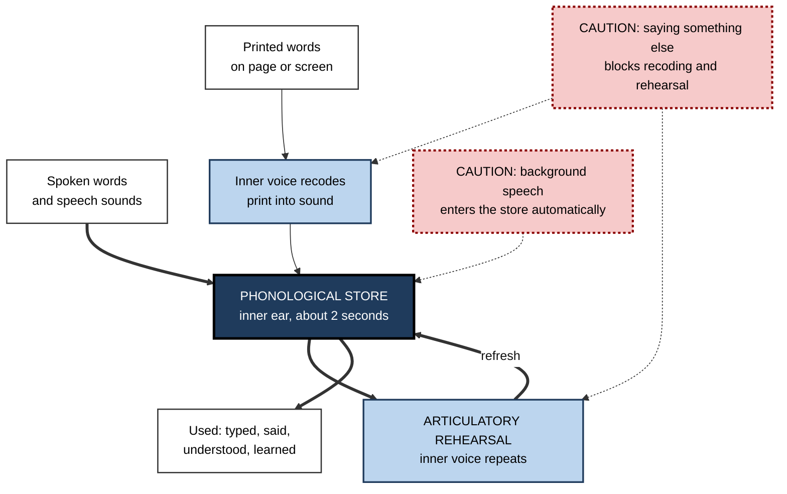
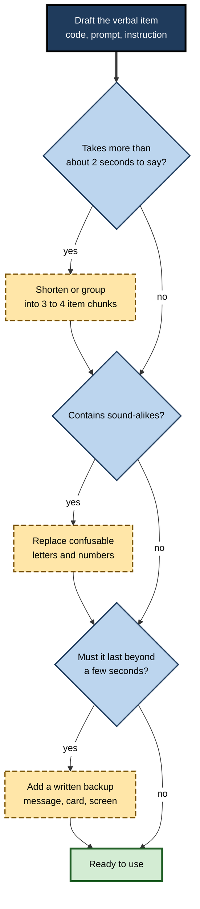

# E.3. Phonological Loop and Verbal Memory

> **In one sentence:** The phonological loop is the part of working memory that holds words and sounds for a couple of seconds and keeps them alive by repeating them with your silent "inner voice".
>
> **Why it matters:** Every spoken instruction, phone call, name, code, voice menu and new word in a foreign language passes through this small, fragile store. Professionals who understand it write clearer instructions, design codes people can actually say and remember, and protect verbal work from noisy environments.
>
> **Level span:** Novice → Expert · **Reading time:** ~14 min · **Builds on:** the multicomponent model of working memory

---

## The Learning Ladder

| Level | Badge | After this level you can... |
|---|---|---|
| 1 | NOVICE | Describe the inner voice and inner ear, and recognise when your verbal memory is struggling. |
| 2 | FOUNDATIONS | Name the loop's two parts and its classic effects: similarity, word length, suppression and irrelevant sound. |
| 3 | PRACTITIONER | Write spoken and written information — instructions, codes, voice prompts — that people can hold in mind reliably. |
| 4 | ADVANCED | Explain the evidence, the contested mechanisms, and the loop's role in reading and language learning. |
| 5 | EXPERT / PRO | Apply loop principles to workplace acoustics, voice interfaces, multilingual teams and AI-era audio. |

---

## Level 1 · Novice — The Big Picture

Think about the last time someone read you a verification code over the phone. You probably repeated it under your breath — "seven, four, two, nine" — until you had typed it. If the person then asked you a question before you finished, the code disappeared.

That is the **phonological loop** at work. It is like a short loop of recording tape: it can play back roughly the last couple of seconds of speech, and your silent inner voice keeps re-recording it so it does not fade. Two parts make it work:

- an **inner ear** that briefly stores sounds and words;
- an **inner voice** that repeats them to refresh the store.

You have already noticed its limits:

- A long, unfamiliar name ("Ngozi Okonjo-Iweala") is harder to hold than a short, familiar one ("Ann Lee").
- Lists of similar-sounding letters (B, D, G, P, T, V) are much easier to confuse than dissimilar ones (K, W, Y, R, Q, L).
- It is hard to read carefully while people near you are chatting, even if you are not listening to them.
- Learning a new word in another language means holding unfamiliar sounds long enough to repeat them.

The headline: **the loop holds about as much speech as you can say in a couple of seconds, and it is easily disrupted by similar sounds and by background speech.**

---

## Level 2 · Foundations — Core Concepts

### The two parts

| Part | Also called | What it does |
|---|---|---|
| **Phonological store** | Inner ear | Holds speech-based traces that fade or are overwritten within a few seconds. Spoken words enter automatically. |
| **Articulatory rehearsal process** | Inner voice | Silently "says" items to refresh them; also converts written words into sound so they can enter the store. |

**Figure E.3-1 — How words get into, and stay in, the phonological loop.**

*How to read it:* speech enters the store directly; print must first be converted by the inner voice. The rehearsal loop keeps items alive. Dotted-border boxes show the two classic disruptors.

### The four classic effects

| Effect | What happens | What it tells us |
|---|---|---|
| **Phonological similarity effect** | Lists of similar-sounding items (man, cat, map, can) are recalled worse than dissimilar ones. Similar *meanings* matter little for immediate recall. | The store is speech-based; similar sounds blur together. |
| **Word length effect** | Lists of long words (university, refrigerator) are recalled worse than short words (sum, wit). | Rehearsal takes time, so fewer long words can be refreshed before they fade or are disrupted. |
| **Articulatory suppression** | Saying "the, the, the" during a task reduces span and removes the similarity and length effects for printed lists. | The inner voice is needed both to rehearse and to bring print into the store. |
| **Irrelevant sound effect** | Background speech — even in a language you do not know — reduces recall of visually presented lists. Changing sounds hurt more than steady ones. | Sounds gain automatic access to the store and disrupt serial order. |

### Key terms

| Term | Plain meaning |
|---|---|
| **Phonological** | To do with the sound structure of speech. |
| **Serial recall** | Recalling items in the exact order presented. |
| **Span** | The longest list someone can repeat correctly. |
| **Nonword repetition** | Repeating made-up words such as "blonterstaping"; a test of the loop independent of vocabulary. |
| **Changing-state sound** | Sound that varies from moment to moment, like speech or melody with lyrics; especially disruptive. |
| **Inner speech** | The silent voice you hear when reading or thinking in words. |

---

## Level 3 · Practitioner — Putting It to Work

### The Say-It-Twice method for verbal information

Use this when writing anything people must hear, say or briefly hold: phone scripts, voice prompts, codes, spoken instructions, presentations.

1. **Read it aloud once at normal speed.** If any single item to be held takes longer than a couple of seconds to say, shorten it or write it down.
2. **Check for sound-alikes.** Avoid codes and labels that differ only in similar-sounding letters or numbers ("B5" versus "D5", "fifteen" versus "fifty").
3. **Group digits and letters.** Present long strings in groups of three or four with pauses: "472 — 913 — 0568", never "4729130568".
4. **Put the action last.** In spoken instructions, give the condition first and the action last, so the action is freshest: "If the light is red, press reset."
5. **Back up speech with something persistent.** Anything that must survive beyond a few seconds goes in writing — a chat message, a card, a confirmation screen.
6. **Protect quiet for verbal work.** Reading, writing and proofreading near conversation degrades accuracy; schedule them away from chatter.

**Figure E.3-2 — Designing a spoken or verbal item people can hold.**

*How to read it:* each question either passes or triggers a fix; dashed boxes are fixes.

### Worked example — a voucher code system

| | Before | After |
|---|---|---|
| **Format** | Ten random characters drawn from the full alphabet and digits: "B8DV0OPT3G". | Eight characters in two groups from a reduced set without sound-alikes or look-alikes: "KWR7-4HXM". |
| **Problems** | B/D/V/P/T and G sound alike; 0 and O look alike; no grouping. | Easy to read aloud in two breaths; few confusable pairs. |
| **Support channel** | Agents ask customers to repeat codes several times; frequent mismatches. | Fewer repeats; codes also sent in writing. |

### Common mistakes

- **Long verbal chains in meetings** — "And then also, remember to…" The middle items are lost.
- **Reading dense slides aloud.** Listeners cannot read and listen to different words at once.
- **Codes with similar sounds** — especially letter sets where many letters share the "ee" sound.
- **Assuming background music is harmless.** Instrumental steady sound is usually mild; lyrics and conversation are the problem for verbal tasks.
- **Teaching new vocabulary only by sight.** Learners need to hear and say new terms to lay down a sound representation.

---

## Level 4 · Advanced — Mechanisms, Models & Evidence

### What is well established

- **Similarity effects** were shown in the 1960s by Reuben Conrad and by Baddeley: immediate recall suffers when items sound alike, whereas long-term learning suffers more when items share meaning. This was an early sign that short-term verbal storage is sound-based.
- **The word length effect** was described by Baddeley, Thomson and Buchanan in 1975, who found that span roughly matched the number of words a person could say in about two seconds.
- **Articulatory suppression** reliably removes the similarity effect for visually presented lists, consistent with the idea that print must be recoded into sound to enter the store.
- **The irrelevant sound effect** is one of the most robust findings in applied cognitive psychology. Dylan Jones and colleagues showed that the key factor is *changing state*: sequences of distinct sounds disrupt the order of items held in memory, regardless of whether you attend to them.

### What is contested

| Issue | The debate |
|---|---|
| **Decay versus interference** | The original loop assumes traces fade in about two seconds unless rehearsed. Interference-based accounts (Oberauer, Lewandowsky and others) argue that forgetting comes from items disrupting each other, not from time. The word length effect turned out to be sensitive to the particular word sets used, and some studies with carefully matched words found smaller or no length effects. |
| **Is the store specifically "phonological"?** | Some researchers argue serial verbal recall reflects speech-planning and motor sequencing rather than a dedicated store. |
| **Order versus item memory** | The loop is especially important for *order*; item identity is supported by long-term language knowledge as well. |

For practice, the contested points matter little: short, distinct, grouped, quiet and written-backup advice follows from either account.

### Language, culture and the loop

- **Digit span depends on how long the digit names are.** Speakers of languages with short digit names (for example, Cantonese and Mandarin) tend to show longer digit spans than speakers of languages with longer digit names, such as Welsh, consistent with a speech-time-limited loop.
- **Vocabulary learning.** Baddeley, Susan Gathercole and Costanza Papagno argued in 1998 that the loop evolved as a **language learning device**: holding unfamiliar sound sequences long enough to build long-term word forms. Children's nonword repetition predicts their vocabulary growth, and poor nonword repetition is a widely used marker of developmental language disorder.
- **Reading.** Beginning readers rely heavily on converting letters into sounds; skilled readers still use inner speech, particularly for difficult text and for holding sentence order while working out meaning.

### Boundary conditions

- **Familiar material is easier.** Long-term knowledge of words supports recall ("redintegration": using what you know to fill in fading traces).
- **Bilinguals** often show smaller spans in their less dominant language, mainly because articulation is slower and long-term support weaker.
- **Sign language** users show parallel effects with sign-based similarity and length, suggesting the loop is about the language format, not just sound.

---

## Level 5 · Expert / Pro — Professional Mastery

### Applications across professions

| Domain | Loop-aware practice |
|---|---|
| Aviation, healthcare, emergency services | Standard phraseology, readback of critical values, phonetic alphabets (Alpha, Bravo...) to avoid sound-alike confusions. |
| Customer service and sales | Short spoken steps, confirmation in writing, codes designed without confusable characters. |
| Voice interfaces and phone menus | Few options per menu, most common choice first or last, options stated as "For billing, say billing" (purpose before action). |
| Workplace design | Quiet zones for reading and writing; sound masking that is steady rather than speech-like; clear norms for open-plan offices. |
| Software and data | Identifiers that are pronounceable and distinct; avoid variable names that differ by one similar-sounding letter. |
| Language and global teams | Speak slower in a shared second language; write down numbers, names and decisions; allow pre-reading. |

### Workplace acoustics

Open-plan offices consistently expose workers to intelligible nearby speech, the most disruptive kind of irrelevant sound for verbal tasks. Experienced workplace designers and managers respond with: dedicated quiet rooms, focus hours, sound masking that reduces speech intelligibility, and norms such as taking calls in booths. Headphones help only if what plays through them is not itself speech or lyrics.

### Professional scenario

**Role:** Operations lead in a hospital pharmacy.
**Situation:** Near-miss reports show that verbal orders for drugs with similar-sounding names are occasionally misheard during busy shifts.
**What the pro does:** Introduces mandatory readback for verbal orders, a "tall-man" lettering scheme on labels to highlight differences in look-alike, sound-alike names, and a rule that verbal orders are confirmed in writing within the shift. The lead tracks near-misses involving sound-alike names over the following quarter.

### AI-era implications

Speech-to-text and AI meeting summaries can turn the most fragile form of information — speech — into persistent text, a genuine aid to the loop. Voice assistants, however, return answers as speech that must be held while acting, and generated audio summaries can run long. Pros keep voice output short, provide on-screen or written follow-ups, and remember that a transcript is not the same as having encoded the content: people still need to attend to and process what matters.

---

## Myths vs. Evidence

| Myth | What the evidence shows |
|---|---|
| "Background chatter only matters if you listen to it." | Irrelevant speech disrupts verbal memory automatically, even when ignored. |
| "Any music helps concentration." | Steady sound is mild; speech and lyrics impair verbal tasks such as reading and writing. |
| "Long codes are fine if they are random." | Length, similar sounds and lack of grouping all raise error rates. |
| "The word length effect proves a strict two-second limit." | The basic effect is real but depends on materials; the mechanism is debated. |
| "Verbal memory is just about hearing." | Print is also recoded into sound, and sign languages show similar effects. |
| "Poor spoken-instruction memory means low intelligence." | It often reflects a specific verbal working-memory limit; writing instructions down removes much of the problem. |

## Practitioner Toolkit

**Verbal clarity checklist**

- [ ] Each spoken item can be said in about two seconds.
- [ ] Long numbers and codes are grouped in threes or fours.
- [ ] No confusable sound-alike letters or numbers.
- [ ] Spoken instructions put the condition first and the action last.
- [ ] Anything that must last is also in writing.
- [ ] Verbal work (reading, writing, proofreading) happens away from conversation.
- [ ] New terms are heard and said aloud, not only read.

**Template — code design rule**

- Character set: digits 2–9 plus letters that do not sound or look alike in the team's main language.
- Length: two groups of three or four, separated by a hyphen.
- Delivery: always shown in writing as well as spoken.

## Self-Check

1. **[NOVICE]** What are the inner ear and the inner voice?
2. **[NOVICE]** Why do you repeat a code under your breath?
3. **[FOUNDATIONS]** Describe the phonological similarity effect.
4. **[FOUNDATIONS]** Why does saying "the, the, the" reduce memory for printed words?
5. **[PRACTITIONER]** Rewrite "4729130568" for reading aloud.
6. **[PRACTITIONER]** Why should spoken instructions put the action last?
7. **[ADVANCED]** Why is the word length effect contested?
8. **[ADVANCED]** How does the loop help with learning new words?
9. **[EXPERT / PRO]** What would you change in an open-plan office to protect verbal work?

### Answer Key

1. The inner ear briefly stores speech-based information; the inner voice silently repeats it to refresh it and converts print into sound.
2. Rehearsal refreshes the fading trace so it survives until you use it.
3. Lists of similar-sounding items are recalled worse than dissimilar ones because their sound traces blur together.
4. It occupies the inner voice, which is needed to recode print into sound and to rehearse.
5. "472 — 913 — 0568", with pauses between groups and a written copy.
6. The most recently heard item is freshest in the loop, so the action is least likely to be lost.
7. Its size depends on the specific words used, and interference accounts explain it without time-based decay.
8. It holds unfamiliar sound sequences long enough to build a long-term memory of the word's form.
9. Quiet rooms or focus hours, sound masking that lowers speech intelligibility, call booths, and norms about conversations near desks.

## Key Takeaways

- The loop is a **speech-based store plus silent rehearsal**.
- It holds roughly **what you can say in a couple of seconds**.
- **Similar sounds, long items and background speech** all weaken it.
- Print enters the loop only via the **inner voice**.
- The loop is central to **reading, vocabulary and second-language learning**.
- At work: **short, distinct, grouped, written backup, and quiet for verbal tasks**.

## Glossary

| Term | Meaning |
|---|---|
| Articulatory rehearsal | Silent repetition that refreshes items in the phonological store. |
| Articulatory suppression | Repeating irrelevant speech to block rehearsal and recoding. |
| Changing-state hypothesis | The idea that varying sound sequences disrupt order memory most. |
| Irrelevant sound effect | Impairment of verbal memory by ignored background sound. |
| Nonword repetition | Repeating made-up words; a test of phonological working memory. |
| Phonological similarity effect | Poorer recall of items that sound alike. |
| Phonological store | The inner ear: brief speech-based storage. |
| Readback | Repeating a critical verbal message back to the sender to confirm it. |
| Redintegration | Using long-term knowledge to reconstruct partially faded traces. |
| Word length effect | Poorer recall of lists of longer words. |
