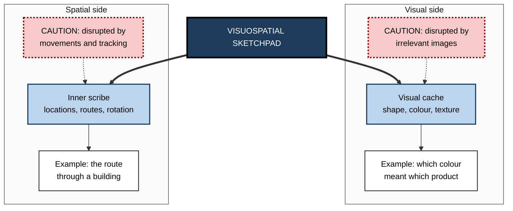
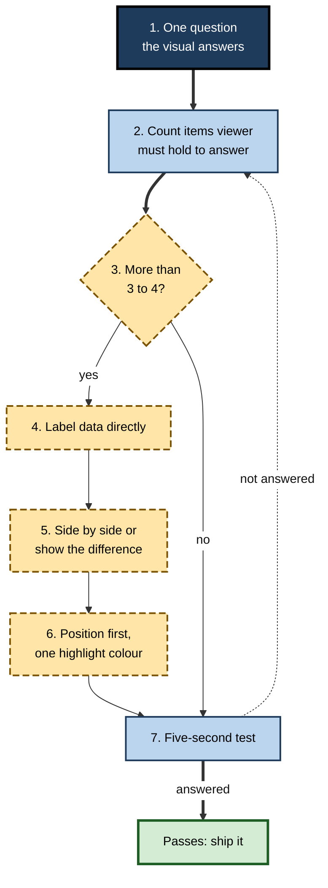

# E.4. Visuospatial Sketchpad

> **In one sentence:** The visuospatial sketchpad is the part of working memory that holds what things look like and where they are, for a few seconds, and lets you picture, move and rotate them in your mind.
>
> **Why it matters:** Reading dashboards, following diagrams, navigating a building, arranging a slide, reasoning about system architecture and driving all depend on this small visual-spatial workspace. Designers, engineers and analysts who respect its limits produce visuals that people can actually take in.
>
> **Level span:** Novice → Expert · **Reading time:** ~14 min · **Builds on:** the multicomponent model of working memory

---

## The Learning Ladder

| Level | Badge | After this level you can... |
|---|---|---|
| 1 | NOVICE | Describe your "mind's eye" and give examples of using it at home and at work. |
| 2 | FOUNDATIONS | Distinguish the visual and spatial parts, and name the classic tasks and capacity findings. |
| 3 | PRACTITIONER | Design charts, diagrams and screens that do not overload visual working memory. |
| 4 | ADVANCED | Explain the evidence, the slots-versus-resources debate and the role of spatial ability in expertise. |
| 5 | EXPERT / PRO | Apply sketchpad principles to visualisation, interface, safety and spatial-skill development. |

---

## Level 1 · Novice — The Big Picture

Close your eyes and picture your kitchen. Where is the fridge? How many steps to the sink? If you moved the table to the other wall, would the door still open? You just used your **visuospatial sketchpad** — a mental drawing board where you can hold a picture, look around it, and move things.

The sketchpad has two closely linked jobs:

- **What it looks like** — colour, shape, texture, a face, the shape of a logo. This is the **visual** side.
- **Where it is and how it moves** — positions, routes, sequences of locations, rotating an object. This is the **spatial** side.

You have already met its limits:

- You glance at a chart, look away to read the legend, look back — and have forgotten which colour meant what.
- You compare two similar photos side by side and miss a difference, because you cannot hold every detail of one while looking at the other.
- You follow a colleague's spoken directions through a large office ("left, second right, past the kitchen, then left") and get lost halfway.
- You can chat while walking a familiar route, but you stop talking when you have to reverse park in a tight space.

The headline: **you can hold only a few visual objects at once, and spatial and visual holding are both fragile.** Good visuals put information where the eye can find it, so the sketchpad does not have to carry it.

---

## Level 2 · Foundations — Core Concepts

### Two subsystems

Robert Logie proposed in 1995 that the sketchpad has two parts:

| Part | What it does | Classic test |
|---|---|---|
| **Visual cache** | Passively holds visual form and colour. | **Visual patterns test**: remember which cells of a grid were filled. |
| **Inner scribe** | Holds and rehearses spatial sequences and movements; supports mental manipulation. | **Corsi block-tapping**: repeat a sequence of tapped blocks in order. |

Evidence for the split comes from people who do well on one test and poorly on the other — including some patients with brain injury — and from interference studies: watching irrelevant pictures disrupts visual memory more, while moving your hands or eyes in a pattern disrupts spatial memory more.

**Figure E.4-1 — The two sides of the sketchpad and what disrupts each.**

*How to read it:* the sketchpad splits into a visual and a spatial side; dotted-border boxes show the kind of activity that disrupts each.

### Classic findings

| Finding | What happens | Why it matters |
|---|---|---|
| **About three or four objects** | In change-detection tasks, people reliably remember the colour or shape of roughly three or four simple objects after a brief glance (Steven Luck and Edward Vogel, 1997). | Visual displays with many separately meaningful elements exceed what can be held. |
| **Mental rotation** | The time to judge whether two shapes match increases with the angle one must be rotated (Roger Shepard and Jacqueline Metzler, 1971). | Mental images behave like pictures being turned, which takes time and effort. |
| **Mental scanning** | Moving attention between points on an imagined map takes longer for longer distances (Stephen Kosslyn). | Images preserve spatial layout. |
| **Brooks matrix task** | Remembering spatially arranged sentences is disrupted by pointing to answers but not by speaking them (Lee Brooks, 1968). | Spatial memory and spatial responding share resources. |
| **Change blindness** | People often fail to notice large changes between two views separated by a brief interruption. | We keep far less visual detail in mind than we feel we do. |

### Key terms

| Term | Plain meaning |
|---|---|
| **Visuospatial** | Combining visual appearance and spatial location. |
| **Mental imagery** | Experiencing a picture-like representation without the object in view. |
| **Change detection** | A task where you judge whether anything changed between two brief displays. |
| **Spatial ability** | Skill at generating, holding and transforming spatial images. |
| **Preattentive features** | Visual properties such as colour or orientation that "pop out" without effort. |
| **Split attention** | Having to hold information from one place while looking for related information elsewhere. |

---

## Level 3 · Practitioner — Putting It to Work

### The Glance Test for visuals

Use this on any chart, dashboard, diagram, slide or screen.

1. **State the one question the visual must answer.** "Which region missed target?" or "Where does the request fail?"
2. **Count the things a viewer must hold to answer it.** Legend colours to map, values to compare across panels, positions to remember after scrolling.
3. **Cut to three or four.** If more must be held, the design fails the glance test.
4. **Place labels on the data.** Direct labels on lines and bars remove the legend look-up loop.
5. **Put comparisons side by side** — or compute the difference and show it.
6. **Use position first, colour second.** Position and length are read most accurately; use a single highlight colour for what matters, with grey for the rest.
7. **Test with a five-second look.** Show the visual for five seconds, hide it, and ask the question. If people cannot answer, redesign.

**Figure E.4-2 — The glance test as a decision path.**

*How to read it:* reduce the hold count until the five-second test passes; the dotted arrow is the redesign loop.

### Worked example — a sales performance dashboard

| | Before | After |
|---|---|---|
| **Layout** | Eight regional line charts on separate tabs, each with a colour legend. | One small-multiples grid with shared axes, direct labels and the target line drawn on every panel. |
| **What the viewer holds** | Colour-to-region mapping, last tab's values, target number. | Nothing: everything needed is visible together. |
| **Question: who missed target?** | About a minute of switching and re-checking. | A few seconds; missed regions highlighted in one accent colour with a text marker. |

### Common mistakes

- **Rainbow legends** with more than a handful of colours.
- **Splitting related information** across slides, tabs, or the top and bottom of a long page.
- **Giving spoken spatial directions** without a map.
- **Animations that change too much at once**, so viewers cannot track what moved.
- **Assuming people "see" everything on screen.** Change blindness shows they hold only a small fraction.

---

## Level 4 · Advanced — Mechanisms, Models & Evidence

### Slots or resources?

How is visual working memory limited? Two families of models have competed since around 2008:

| View | Claim | Supporting evidence | Challenges |
|---|---|---|---|
| **Slots** | A fixed number of discrete slots (about three or four); items beyond that are not stored at all. | Precision plateaus beyond a set size; capacity estimates are stable across many tasks. | Precision drops gradually as more items are added, even below the slot limit. |
| **Resources** | A continuous resource is shared among all items; more items means each is stored less precisely. | Recall error rises smoothly with the number of items. | Some data show items with essentially zero information beyond a limit. |

Hybrid models, in which a limited number of items share a flexible resource, are now common. For practitioners both views converge: **every extra element reduces how precisely the others are remembered**, and beyond a few, many are effectively lost.

### Features and objects

Luck and Vogel's original work suggested that remembering several features of one object (colour plus orientation) costs about the same as remembering one feature. Later studies found that binding features is not completely free, especially when many objects are present. Grouping elements into coherent objects — for instance, a labelled card containing a value and its trend — still makes displays easier to hold.

### Spatial ability and expertise

**Spatial ability** — skill at generating, holding and transforming spatial images — varies widely between people. Large longitudinal studies of talented youth have found that spatial ability predicts later achievement in science, technology, engineering and mathematics beyond verbal and mathematical scores. Spatial skills improve with practice, and meta-analytic evidence indicates the gains are durable and partly transfer to related spatial tasks; whether they transfer broadly to STEM achievement is less certain and still debated.

### Brain basis

Visual working memory engages occipital and parietal regions linked to perception, plus prefrontal control. Neural activity in posterior parietal areas tracks how many items are held and levels off around individual capacity limits — one of the clearer brain-behaviour links in this field. The visual and spatial "sides" map loosely onto ventral ("what") and dorsal ("where") processing streams, but the separation is partial.

### Imagery is not a photograph

Mental images are reconstructions, coloured by knowledge and expectation. People differ widely in the vividness of imagery; some report none at all (**aphantasia**), yet many such people perform normally on spatial working-memory tasks, apparently using non-visual strategies. Vivid imagery is therefore not a requirement for good visuospatial reasoning.

---

## Level 5 · Expert / Pro — Professional Mastery

### Applications

| Domain | Sketchpad-aware practice |
|---|---|
| Data visualisation | Direct labels, small multiples, shared axes, highlight-plus-grey colour schemes, computed differences. |
| Software architecture | Diagrams with few elements per view, consistent placement across diagrams, layered views (context, container, component). |
| Interface design | Stable layouts so users can rely on spatial memory; keep comparison items adjacent; avoid content that jumps when loaded. |
| Driving and operations | Voice or phone conversations, even hands-free, compete for attention during spatially demanding driving; safety policies restrict them. |
| Engineering and design education | Deliberate practice of sketching, mental rotation and cross-sections to build spatial skill. |
| Presentations | One diagram per slide, built up step by step, with the speaker pointing to the current element. |

### Professional scenario

**Role:** Site reliability engineer redesigning an on-call dashboard.
**Situation:** During incidents, engineers flip between five panels to correlate error spikes with deploys and traffic, and they frequently misread which spike came first.
**What the pro does:** Applies the glance test. All three signals go onto one time-aligned view with shared axes and a vertical line marking each deploy, labelled directly. The default view shows only the services in alert; the rest are grey. Time to first correct hypothesis in incident drills is measured before and after.

### Stable layout as a memory aid

Experienced interface designers know that **spatial memory is a gift**: once users learn where things are, they find them without searching. Layout changes — moving menu items, reordering columns, personalised feeds that rearrange — throw that away. Mature teams change layouts rarely, deliberately, and with migration help.

### AI-era implications

Generative tools can now create diagrams, charts and slides in seconds. Speed creates a new risk: visually busy outputs with many colours, decorative icons and overlapping labels. Professionals apply the same glance test to AI-generated visuals as to human-made ones, and use AI to *reduce* visual load — computing differences, suggesting simpler chart types, generating alternative text — rather than to add ornament.

---

## Myths vs. Evidence

| Myth | What the evidence shows |
|---|---|
| "People take in everything visible on the screen." | Visual working memory holds only a few objects; change blindness shows how much is missed. |
| "More colours make charts clearer." | Beyond a handful, colour legends overload memory; direct labels and a single highlight work better. |
| "Hands-free phone calls while driving are safe." | Conversation competes for attention needed for spatial monitoring, even without handling the phone. |
| "Spatial ability is fixed." | It improves with practice, and the gains last; broad transfer is still debated. |
| "You need vivid mental pictures to reason spatially." | People with little or no imagery can perform well on spatial tasks using other strategies. |
| "Visual learners need everything in pictures." | Visual design principles help everyone; matching to a "learning style" does not improve learning. |

## Practitioner Toolkit

**Visual load checklist**

- [ ] The visual answers one stated question.
- [ ] A viewer holds no more than three or four items to answer it.
- [ ] Data are labelled directly; legends are minimal.
- [ ] Comparisons are adjacent or pre-computed.
- [ ] Position and length carry the main message; colour highlights only.
- [ ] Layout is consistent with related views.
- [ ] A five-second glance test with a newcomer passes.

**Template — five-second test record**

| Visual | Question | Shown to | Answered correctly? | Change made |
|---|---|---|---|---|
| | | | | |

## Self-Check

1. **[NOVICE]** What is the difference between the visual and spatial sides of the sketchpad?
2. **[NOVICE]** Why do you forget which colour meant what after looking at a legend?
3. **[FOUNDATIONS]** What do the visual patterns test and Corsi blocks each measure?
4. **[FOUNDATIONS]** What did mental rotation experiments show?
5. **[PRACTITIONER]** Name three ways to reduce the load of a dashboard.
6. **[ADVANCED]** Explain the slots-versus-resources debate in two sentences.
7. **[ADVANCED]** Is vivid imagery needed for spatial reasoning? What is the evidence?
8. **[EXPERT / PRO]** Why should interface layouts change rarely?
9. **[EXPERT / PRO]** How would you review an AI-generated slide deck for visual load?

### Answer Key

1. The visual side holds appearance (colour, shape); the spatial side holds location, route and movement.
2. Visual working memory holds few items and fades quickly while your eyes move between legend and chart.
3. Visual patterns test measures visual form memory; Corsi blocks measure spatial sequence memory.
4. The time to compare shapes increases with the rotation angle, as if images were being turned in the mind.
5. Direct labels, side-by-side comparisons or computed differences, a single highlight colour, fewer elements per view.
6. Slot models say a fixed number of items are stored and others lost; resource models say a shared resource is spread over all items, reducing precision. Hybrids combine both.
7. No; people with aphantasia often perform normally on spatial working-memory tasks using other strategies.
8. Users rely on spatial memory to find things quickly; layout changes erase that learned knowledge.
9. Apply the glance test: one question per slide, few elements, direct labels, minimal colours, no decorative clutter.

## Key Takeaways

- The sketchpad holds **what things look like and where they are**.
- It splits into a **visual cache** and a **spatial inner scribe**.
- Visual working memory holds about **three or four simple objects**.
- **We see less than we think** — change blindness is the proof.
- Design visuals so that **nothing has to be carried in the head**: direct labels, adjacency, one highlight.
- **Spatial skill can be trained**, and stable layouts let users rely on spatial memory.

## Glossary

| Term | Meaning |
|---|---|
| Aphantasia | Little or no voluntary visual mental imagery. |
| Change blindness | Failure to notice changes between views. |
| Change detection | A task measuring how many visual items are retained. |
| Corsi blocks | A spatial span task using tapped block sequences. |
| Inner scribe | The spatial, movement-related part of the sketchpad. |
| Mental rotation | Turning an imagined object to compare it with another. |
| Resource model | View that visual memory is a continuous resource shared among items. |
| Slot model | View that visual memory has a fixed number of discrete slots. |
| Small multiples | A grid of small charts with shared axes for easy comparison. |
| Visual cache | The passive store for visual appearance. |
| Visuospatial sketchpad | The working-memory component for visual and spatial information. |
