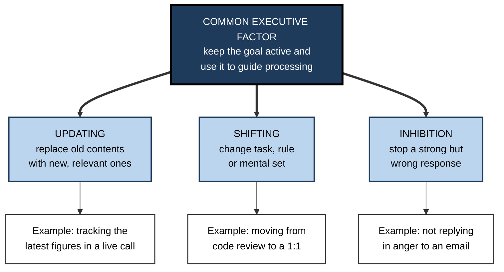
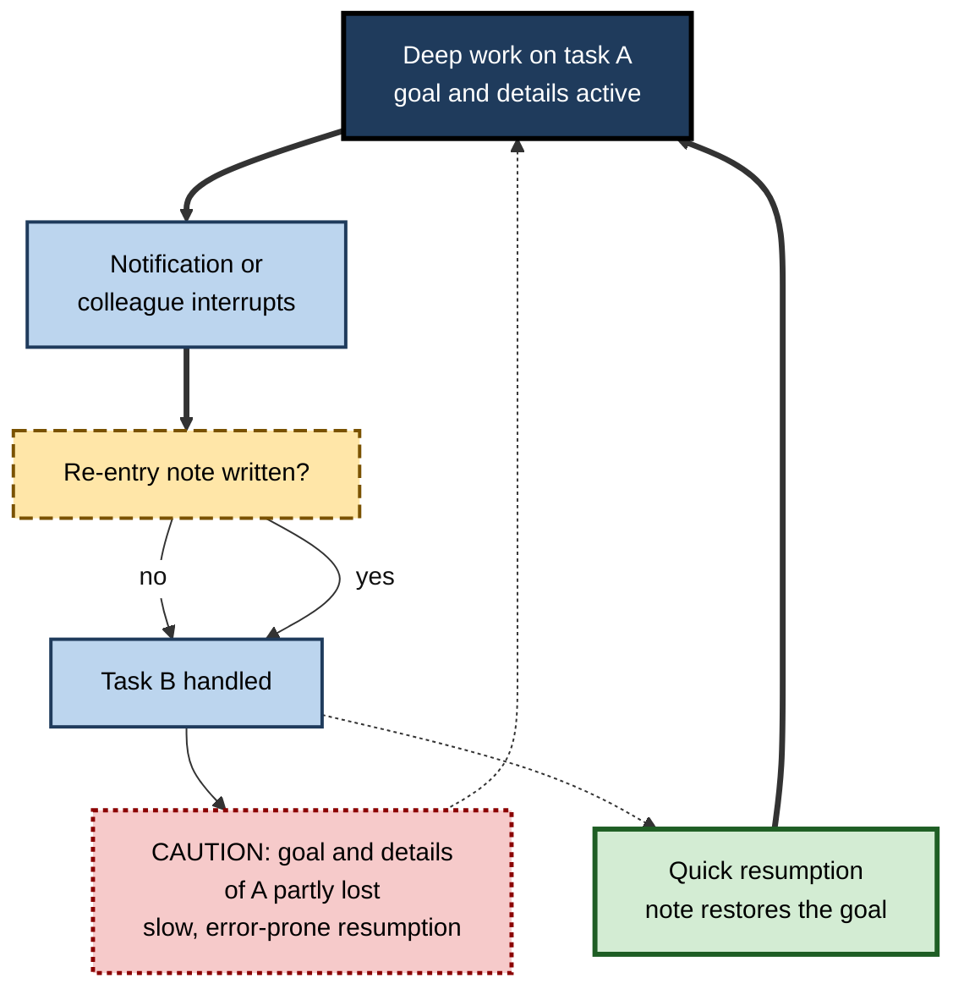

# E.5. Central Executive Function

> **In one sentence:** The central executive is working memory's "manager": it decides what to pay attention to, what to ignore, when to switch tasks and how to coordinate the other parts — but it can only manage a little at a time.
>
> **Why it matters:** Executive control is usually the scarcest resource in knowledge work. Context switching, interruptions, competing priorities and stress all draw on it. Professionals who understand it organise their work, teams and tools so that executive capacity goes to judgement rather than juggling.
>
> **Level span:** Novice → Expert · **Reading time:** ~15 min · **Builds on:** the multicomponent model of working memory

---

## The Learning Ladder

| Level | Badge | After this level you can... |
|---|---|---|
| 1 | NOVICE | Explain what the "manager" of working memory does and notice when yours is overloaded. |
| 2 | FOUNDATIONS | Name the core executive functions — updating, shifting, inhibition — and the classic tasks that measure them. |
| 3 | PRACTITIONER | Reduce switching and interruption costs in your own work and protect executive capacity for hard decisions. |
| 4 | ADVANCED | Explain the main models (supervisory attention, unity and diversity, executive attention) and which popular claims failed to replicate. |
| 5 | EXPERT / PRO | Design team workflows, tools and policies that conserve collective executive capacity. |

---

## Level 1 · Novice — The Big Picture

Picture an air-traffic controller in a small tower. The planes are the pieces of information and tasks in your head. The controller does not carry the planes; the controller decides which one lands next, which one waits, and which radio call to ignore. If too many planes arrive at once, or the radio never stops, mistakes happen — not because the runway is too short, but because the controller cannot keep track.

The **central executive** is that controller. It:

- **focuses** attention on what matters right now;
- **ignores** distractions and stops automatic but wrong responses;
- **switches** between tasks or rules;
- **updates** what is being held as new information arrives;
- **coordinates** the verbal and visual parts of working memory and pulls knowledge from long-term memory.

You have already felt it strain:

- You meant to buy milk on the way home, drove the usual route on autopilot and forgot. The executive did not step in to override habit.
- You answered a quick message in the middle of writing a report and needed several minutes to remember where you were.
- You are tired or anxious, and simple decisions suddenly feel hard.

The headline: **the executive is a controller with limited capacity; every switch, distraction and worry uses some of it.**

---

## Level 2 · Foundations — Core Concepts

### From "little manager" to specific functions

In the original Baddeley-Hitch model the executive was described loosely as an attentional controller. Two later ideas made it more precise:

- **Supervisory attentional system.** Donald Norman and Tim Shallice (1986) proposed that most behaviour is run by routine "scripts" triggered automatically, and that a supervisory system steps in only when routines are not enough — for novel situations, errors, danger, or overriding a strong habit.
- **Unity and diversity of executive functions.** Akira Miyake, Naomi Friedman and colleagues (2000) measured many executive tasks and found three related but separable abilities: **updating** working-memory contents, **shifting** between tasks or rules, and **inhibiting** dominant responses. Later work by Friedman and Miyake found that much of what these share is a **common executive factor** — essentially the ability to maintain goals and use them to bias ongoing processing — with additional factors specific to updating and to shifting.

**Figure E.5-1 — The unity and diversity of executive functions.**

*How to read it:* the three functions share a common core (thick arrows); each also has its own specific part. In later analyses, inhibition was almost entirely explained by the common factor.

### Classic tasks

| Function | Task | What you do |
|---|---|---|
| Inhibition | **Stroop** | Name the ink colour of a word that spells a different colour ("RED" printed in blue). |
| Inhibition | **Antisaccade** | Look away from a sudden flash rather than towards it. |
| Shifting | **Task switching** | Alternate between two rules (odd/even versus higher/lower than five). Switch trials are slower. |
| Updating | **Keep-track / n-back** | Keep the latest item in each category, or say whether the current item matches one N steps back. |
| Coordination | **Dual task** | Do two tasks at once; measure the cost compared with each alone. |

### Key terms

| Term | Plain meaning |
|---|---|
| **Executive functions** | The set of control processes that guide thought and action toward goals. |
| **Switch cost** | The extra time and errors when changing tasks compared with repeating one. |
| **Goal neglect** | Knowing a rule but failing to apply it when it matters. |
| **Prepotent response** | A strong, automatic response that must sometimes be stopped. |
| **Mind-wandering** | Attention drifting to unrelated thoughts during a task. |
| **Prefrontal cortex** | The front part of the brain most associated with executive control. |

---

## Level 3 · Practitioner — Putting It to Work

### The Switch Audit — five steps

1. **Log one normal day.** Every 30 minutes, note what you were doing and how many times you switched (task, tool, conversation).
2. **Classify switches.** Chosen (you decided), triggered (notification or person), or forced (meeting schedule).
3. **Batch the small things.** Group email, chat and approvals into two or three fixed windows.
4. **Protect one block.** Reserve at least one uninterrupted 90-minute block for the task needing the most executive control.
5. **Leave a re-entry note.** Before any interruption or end of block, write one line: "Next I will…". This offloads the goal so the executive can pick it up quickly.

**Figure E.5-2 — What happens to executive capacity during an interruption.**

*How to read it:* without an offloaded goal, resuming task A takes longer and invites errors; a one-line note makes resumption faster.

### Worked example — a data analyst's week

| | Before | After |
|---|---|---|
| **Schedule** | Ad-hoc requests answered immediately in chat; four short gaps between meetings used for modelling work. | Chat checked at 10:00, 13:00 and 16:00; two mornings blocked for modelling; urgent channel defined. |
| **Switches per day** | Dozens, mostly triggered. | Far fewer, mostly chosen. |
| **Outcome** | Model bugs from losing track of assumptions; work spills into evenings. | Fewer errors; requesters adapt quickly to the response windows. |

### Common mistakes

- **Believing you are a good multitasker.** Heavy self-rated multitaskers do not reliably perform better at switching; switching always has a cost.
- **Filling small gaps with deep work.** Ten minutes between meetings is not enough to rebuild a complex task's mental state.
- **Leaving decisions open.** Every open loop ("must remember to…") sits in working memory; write it down.
- **Running hard decisions in the worst state.** Tired, rushed or anxious executive control makes worse judgements.

---

## Level 4 · Advanced — Mechanisms, Models & Evidence

### Why switching costs time

Task-switching research (Robert Rogers and Stephen Monsell, 1995, and many later studies) shows that switching rules slows responses and raises errors. Preparing in advance reduces the cost but does not remove it: a **residual switch cost** remains. Explanations include the time to reconfigure the task set and interference from the previous task's still-active rules. Related work on dual tasks shows a central bottleneck: two decisions cannot be fully processed at the same instant, so one waits.

### Executive attention and individual differences

Randall Engle, Michael Kane and colleagues argue that what makes complex span tasks predict reasoning and comprehension is mostly **executive attention** — the ability to keep goals active and resist interference. People with higher working-memory capacity tend to do better on the antisaccade task, show less goal neglect, and report less mind-wandering during demanding tasks. This is one of the field's well-replicated correlations, though researchers still debate how much is attention control and how much is storage or retrieval from long-term memory.

### Brain basis

Executive control relies heavily on **prefrontal cortex** working with parietal regions in a **frontoparietal control network**. Prefrontal function is sensitive to arousal: Amy Arnsten's work shows that stress chemicals at high levels weaken prefrontal network activity while strengthening more habitual, reflexive circuits. This fits everyday experience: under acute stress, people revert to habits and struggle with flexible reasoning.

### What failed to replicate

| Claim | Status |
|---|---|
| **"Ego depletion"**: self-control draws on a single resource that runs out after use, so one effortful task impairs the next. | Large preregistered multi-lab replications found effects near zero or much smaller than the original literature implied. The strong version is not supported. |
| **"Decision fatigue" from a famous study of parole judges** | The original pattern has been questioned because of how cases were ordered; it is weak evidence for a general depletion effect. |
| **Heavy media multitaskers have worse filtering** | The original finding has had mixed replications; any effect appears small. |
| **Brain training boosts executive function generally** | Training improves trained tasks; broad transfer is not supported. |

What *is* robust: switch costs, interference from distraction, goal neglect under load, and the effects of acute stress and sleep loss on executive performance.

### Boundary conditions

- **Practice automates.** Well-practised skills need less executive control, which is why experts can do more at once within their domain.
- **Motivation and fatigue interact.** Executive performance declines over long sessions partly because motivation to keep investing effort drops; incentives and breaks often restore it, which is one reason the simple "resource runs out" model is doubted.
- **Executive control is not one dial.** A person can be good at updating and weaker at shifting.

---

## Level 5 · Expert / Pro — Professional Mastery

### Designing for collective executive capacity

| Practice | How it protects executive capacity |
|---|---|
| **Work-in-progress limits** (Kanban) | Fewer open tasks means fewer goals to hold and fewer switches. |
| **Focus blocks and meeting-free time** | Long, protected blocks for executive-heavy work. |
| **Asynchronous by default** | Requests queue in writing instead of interrupting. |
| **Explicit urgent channel** | People can ignore everything else safely. |
| **Checklists and runbooks** | Move routine sequencing out of the executive; aviation and surgery use them for this reason. |
| **Decision logs** | Close open loops so they stop occupying working memory. |
| **Defaults** | Reduce the number of choices each person must make. |

### Professional scenario

**Role:** Engineering manager of a platform team.
**Situation:** Engineers report constant interruptions; cycle time is rising and incident follow-ups are forgotten.
**What the pro does:** Introduces a rotating "interrupt shield" role who handles all ad-hoc requests for a week, sets a work-in-progress limit of two items per engineer, moves status updates to written async posts, and adds a decision log to every incident. The manager tracks cycle time, follow-up completion and engineer-reported focus hours. Throughput improves; the shield rotation is kept short so no one person carries the load for long.

### Stress, sleep and leadership

Leaders often make their hardest decisions late, tired and under pressure — exactly when prefrontal control is weakest. Pros build structural protections: sleeping on non-urgent major decisions, using pre-mortems and checklists for high-stakes choices, and pairing decision-makers so one person can hold the goal while the other handles detail.

### AI-era implications

AI assistants can take over routine sequencing (drafting, summarising, scheduling), freeing executive capacity. They can also multiply switching: more notifications, more parallel threads, more half-finished outputs to check. Supervising AI output is itself executive work — holding the goal, spotting errors, inhibiting the urge to accept fluent but wrong answers. Experts limit parallel AI threads, batch reviews, and keep a written goal visible so they can judge outputs against it.

---

## Myths vs. Evidence

| Myth | What the evidence shows |
|---|---|
| "Some people can multitask without cost." | Switching and dual-tasking carry costs for almost everyone; a very small minority show unusually low costs. |
| "Willpower is a fuel tank that empties." | Large replications found little support for strong ego depletion; motivation and beliefs matter. |
| "Brain games improve executive function." | Gains stay with the trained tasks. |
| "Under pressure, people think more clearly." | High stress weakens prefrontal control and pushes people toward habits. |
| "Executive function is one ability." | It has a common core plus distinct updating and shifting components. |
| "Interruptions only cost the seconds they take." | Resuming the interrupted task costs extra time and raises errors. |

## Practitioner Toolkit

**Executive-capacity protection checklist**

- [ ] I know my number of switches on a typical day.
- [ ] Messages are batched into fixed windows.
- [ ] At least one protected focus block per day.
- [ ] I leave a re-entry note before every interruption.
- [ ] Open loops go into a trusted list, not my head.
- [ ] Hard decisions are scheduled when I am rested.
- [ ] Parallel AI threads are limited and reviewed in batches.

**Template — re-entry note**

> Task: ___ · Goal: ___ · Last thing done: ___ · Next step: ___ · Open question: ___

## Self-Check

1. **[NOVICE]** What does the central executive do, in one sentence?
2. **[NOVICE]** Give an example of habit beating your executive.
3. **[FOUNDATIONS]** Name the three executive functions identified by Miyake and colleagues.
4. **[FOUNDATIONS]** What does the Stroop task measure?
5. **[PRACTITIONER]** What is a re-entry note and why does it help?
6. **[ADVANCED]** What is a residual switch cost?
7. **[ADVANCED]** What happened when ego depletion was tested in large replications?
8. **[EXPERT / PRO]** List three team practices that conserve executive capacity.
9. **[EXPERT / PRO]** Why is supervising AI output executive work?

### Answer Key

1. It directs attention: focusing, ignoring distractions, switching and updating, and coordinating the other parts of working memory.
2. Driving home on autopilot and forgetting a planned errand.
3. Updating, shifting and inhibition.
4. Inhibition — suppressing the automatic urge to read the word in order to name the ink colour.
5. A short written statement of the goal and next step; it offloads the goal so resumption is faster and less error-prone.
6. The switching cost that remains even when people have time to prepare for the switch.
7. Effects were near zero or much smaller than originally reported.
8. Work-in-progress limits, async-by-default communication, focus blocks, interrupt-shield rotation, checklists, decision logs.
9. It requires holding the goal, detecting errors and inhibiting acceptance of fluent but wrong answers.

## Key Takeaways

- The executive is a **controller**, not a store, and its capacity is small.
- Executive functions share a **common goal-maintenance core**, plus updating and shifting components.
- **Every switch costs** time and accuracy, even with preparation.
- **Stress and fatigue** weaken executive control and push people toward habit.
- **Ego depletion** in its strong form did not replicate.
- Protect executive capacity with **batching, focus blocks, WIP limits, notes and checklists**.

## Glossary

| Term | Meaning |
|---|---|
| Antisaccade task | Looking away from a sudden visual cue; measures inhibition. |
| Common executive factor | The shared core of executive functions: maintaining and using goals. |
| Ego depletion | The contested claim that self-control draws on a depletable resource. |
| Executive attention | Control of attention to maintain goals amid interference. |
| Frontoparietal network | Brain network linking frontal and parietal areas for control. |
| Goal neglect | Failing to apply a known rule when it matters. |
| Inhibition | Suppressing a dominant but inappropriate response. |
| Shifting | Switching between tasks or mental sets. |
| Supervisory attentional system | Norman and Shallice's controller that overrides routines when needed. |
| Switch cost | Extra time and errors when changing tasks. |
| Updating | Replacing working-memory contents with newer relevant information. |
