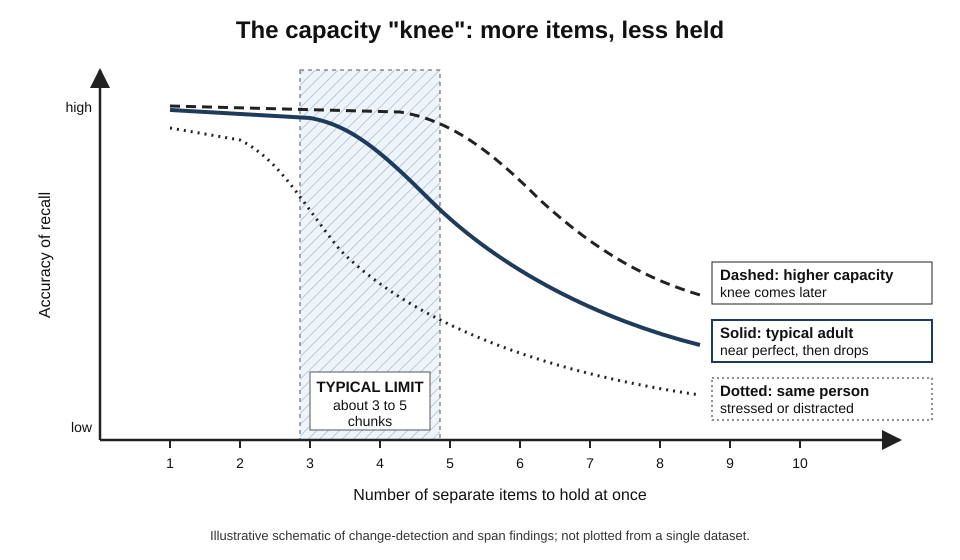
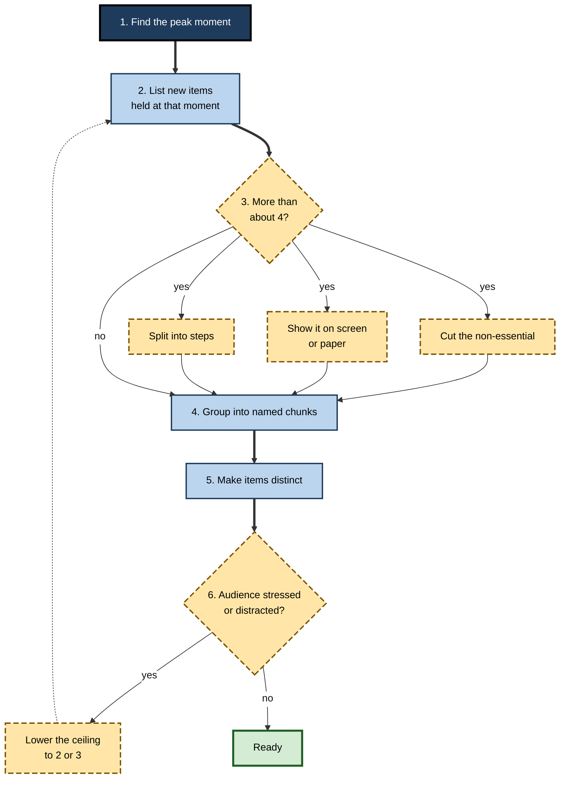

# E.6. Working Memory Capacity and Limits

> **In one sentence:** Working memory can hold only a few meaningful units — roughly three to five "chunks" for most adults — for a short time, and that limit shrinks further when you are stressed, distracted or doing something else at once.
>
> **Why it matters:** The capacity limit is the single most important constraint in how people learn, decide and communicate. Professionals who design within it produce training, documents, interfaces and meetings that work; those who ignore it get errors, confusion and "but I told them".
>
> **Level span:** Novice → Expert · **Reading time:** ~15 min · **Builds on:** what working memory is and its main components

---

## The Learning Ladder

| Level | Badge | After this level you can... |
|---|---|---|
| 1 | NOVICE | Explain that working memory holds only a few things at once and for only a short time. |
| 2 | FOUNDATIONS | Explain why "seven plus or minus two" became "about four chunks", and name the three kinds of limit: amount, time and interference. |
| 3 | PRACTITIONER | Estimate the load of a task and cut it below the limit. |
| 4 | ADVANCED | Explain how capacity is measured, why the number depends on what is counted, and what capacity predicts. |
| 5 | EXPERT / PRO | Use capacity limits in design, assessment, hiring and AI-assisted work, without misusing individual scores. |

---

## Level 1 · Novice — The Big Picture

Imagine juggling. Most people can keep three balls in the air; a few can manage four or five with practice. Add one more and they all drop. Working memory is like that: it can keep a small number of things "in the air" at once. Add one too many and you lose not only the new one but often the others too.

There are three kinds of limit:

1. **How much.** Only a few meaningful units at once.
2. **How long.** Unless you keep attending to them, the units fade or get pushed out within seconds.
3. **How easily disturbed.** New, similar or distracting information knocks out what you were holding.

You have already met these limits:

- A waiter takes an order for six people without writing it down and gets two dishes wrong.
- A colleague shares their screen, flips through ten slides of numbers, then asks "So which option do you prefer?" — and nobody can remember option two.
- You read a long sentence full of unfamiliar terms and, by the end, have forgotten how it started.

The key idea: **the limit is not about intelligence or effort — it is a built-in feature of how human attention works.** The way around it is not to try harder but to reduce what must be held, or to make each unit carry more meaning.

---

## Level 2 · Foundations — Core Concepts

### From seven to four

In 1956, the psychologist George Miller published a famous paper titled "The Magical Number Seven, Plus or Minus Two". He noted that people could repeat back about seven digits or letters. But he also noticed that people grouped items into larger units — **chunks** — and that the limit seemed to apply to chunks rather than raw items.

Later researchers found that span tasks overestimate the core limit because people rehearse silently and group items. When rehearsal and grouping are prevented, the limit drops. In an influential 2001 review, Nelson Cowan concluded that the core capacity of the focus of attention is about **three to five chunks**, often summarised as "about four". A 2024 set of experiments that set the "four" and "seven" camps against each other concluded that both can be right, depending on what is counted — including whether the mental operations being performed on the items take up some of the capacity themselves.

*Figure E.6-1 — The capacity knee.* Solid line: a typical adult stays near perfect for a few items and then drops steadily. Dashed line: a person with higher capacity reaches the knee later. Dotted line: the same person under stress or distraction reaches it earlier. Shaded band: the typical limit of about three to five chunks. Schematic, not a single dataset.

### Three limits, not one

| Limit | What it means | Example |
|---|---|---|
| **Amount** | Only a few chunks are held in an accessible state. | Comparing five pricing tiers in your head fails; comparing two works. |
| **Time** | Without attention, contents become unavailable within seconds. | Forgetting a name moments after an introduction because you were planning your reply. |
| **Interference** | Similar or new information disrupts what is held. | Mixing up two account numbers you heard one after the other. |

**Figure E.6-2 — What eats into working-memory capacity.**

```mermaid
%%{init: {'theme':'base','themeVariables':{'fontFamily':'Arial, Helvetica, sans-serif','fontSize':'15px','primaryColor':'#FFFFFF','primaryTextColor':'#111111','primaryBorderColor':'#222222','lineColor':'#333333','secondaryColor':'#F2F2F2','tertiaryColor':'#FFFFFF','clusterBkg':'#FAFAFA','clusterBorder':'#555555','edgeLabelBackground':'#FFFFFF','titleColor':'#111111'}}}%%
flowchart TD
    classDef core    fill:#1F3B5C,stroke:#000000,stroke-width:3px,color:#FFFFFF
    classDef key     fill:#BCD5EE,stroke:#1F3B5C,stroke-width:2px,color:#000000
    classDef good    fill:#D3ECD3,stroke:#1E5E24,stroke-width:3px,color:#000000
    classDef caution fill:#F6CACA,stroke:#8B0000,stroke-width:2.5px,stroke-dasharray:3 3,color:#000000

    CAP["AVAILABLE CAPACITY<br/>about 3 to 5 chunks"]
    subgraph DRAIN["Drains capacity"]
        D1["CAUTION: worry and anxiety<br/>intrusive thoughts take space"]
        D2["CAUTION: distraction<br/>and interruptions"]
        D3["CAUTION: unfamiliar material<br/>every detail is its own chunk"]
        D4["CAUTION: doing two<br/>demanding things at once"]
    end
    subgraph EXT["Extends effective capacity"]
        E1["Knowledge allows<br/>bigger chunks"]
        E2["External aids:<br/>notes, screens, checklists"]
        E3["Rest, calm,<br/>a single focus"]
    end

    D1 -.-> CAP
    D2 -.-> CAP
    D3 -.-> CAP
    D4 -.-> CAP
    E1 ==> CAP
    E2 ==> CAP
    E3 ==> CAP

    class CAP core
    class D1,D2,D3,D4 caution
    class E1,E2,E3 good
```

*How to read it:* dotted-border boxes on the left reduce what you can hold; thick-bordered boxes on the right increase what you can effectively work with.

### Key terms

| Term | Plain meaning |
|---|---|
| **Capacity** | How many chunks working memory can hold at once. |
| **Chunk** | A unit of information that is meaningful as a whole, such as a familiar word, acronym or pattern. |
| **Focus of attention** | The small set of items currently in the spotlight of awareness. |
| **Span** | The longest list someone can recall correctly. |
| **K estimate** | A formula-based estimate of how many items a person holds in a change-detection task. |
| **Proactive interference** | Older information disrupting the holding or learning of newer information. |
| **Individual differences** | Stable differences between people in capacity. |

---

## Level 3 · Practitioner — Putting It to Work

### The Four-Chunk Rule — a planning heuristic

Treat "about four new chunks at once" as a design ceiling for novices. It is not a law, but it is a safe default.

1. **Identify the peak moment** in your task, presentation or document — the point where the most must be held at once.
2. **List the new items** the audience must hold at that moment. Familiar concepts count much less.
3. **If the list is more than about four, cut.** Remove what is not essential, show what can be shown, or split into steps.
4. **Group the remainder into meaningful chunks** — named options, labelled steps, familiar analogies.
5. **Reduce interference.** Make items distinct: different names, different shapes, different positions.
6. **Check for drains.** Is the audience anxious, distracted, or multitasking? Lower the ceiling further.

**Figure E.6-3 — Applying the four-chunk rule.**

*How to read it:* follow the thick path; when the count is too high, cut, show or split before grouping; for a stressed audience, loop back with a lower ceiling.

### Worked example — a vendor decision presentation

| | Before | After |
|---|---|---|
| **Structure** | Five vendors, each on its own slide, with twelve criteria each; the audience is asked to decide at the end. | One comparison table showing three shortlisted vendors and four decision criteria; detail in an appendix. |
| **Peak load** | Dozens of values across slides. | Three columns times four rows, all visible at once. |
| **Decision quality** | Discussion drifts to the most recent slide; vendor two is forgotten. | Discussion stays on criteria; decision recorded with reasons. |

### Common mistakes

- **Using "seven" as the target.** Seven raw items is far too many for unfamiliar content.
- **Counting slides, not items.** One slide can contain twenty items to hold.
- **Ignoring interference.** Similar product names, similar codes and similar charts are easily confused.
- **Assuming experts' capacity.** Subject experts chunk material that novices cannot.
- **Forgetting state.** Tired, anxious or rushed people have less available capacity.

---

## Level 4 · Advanced — Mechanisms, Models & Evidence

### How capacity is measured

| Method | How it works | What it captures | Caveat |
|---|---|---|---|
| **Simple span** | Recall lists of growing length in order. | Storage plus rehearsal and grouping. | Overestimates the core limit. |
| **Complex span** | Remember items while doing a processing task between them (reading span, operation span). | Storage under processing load; strong predictor of reasoning and comprehension. | Mixes storage and attention control. |
| **Change detection** | Brief array of objects; judge whether one changed. Capacity estimated as K. | Number of visual items held. | Specific to simple visual features. |
| **Running span** | Recall the last few items of a list of unknown length. | Updating and capacity without rehearsal. | Strategy-sensitive. |

### Why is it so small?

There is no settled answer. Proposals include:

- **Interference control.** Holding few items reduces confusion between them.
- **Search efficiency.** Searching a small active set is fast; larger sets would slow retrieval.
- **Binding limits.** Each item must be tied to its context (position, role); bindings interfere beyond a few.
- **Neural constraints.** Some models propose that items are kept separate by rhythmic neural activity, and only a few can be kept apart in each cycle.

The limit is arguably a feature rather than a bug: it forces selection and keeps thinking focused.

### Time and forgetting

Classic studies in 1959 by Lloyd and Margaret Peterson showed rapid forgetting of letter strings over seconds when rehearsal was prevented by counting backwards. Later work showed that much of this forgetting was due to interference from earlier lists rather than pure time-based decay. Whether working-memory contents decay with time at all is still debated; interference is clearly a major factor.

### What capacity predicts

Complex span scores correlate with reading comprehension, following instructions, mathematical reasoning, learning complex skills, and fluid intelligence. At the level of underlying abilities, working-memory capacity and fluid reasoning are strongly related but not identical. Capacity also predicts how well people resist distraction and how often minds wander during demanding tasks. These correlations are robust across many studies, but they do not mean that raising capacity would raise the outcomes — training studies, covered elsewhere, largely fail to show that.

### Capacity is a state as well as a trait

Within-person capacity varies with:

- **Anxiety and worry**, which consume capacity with intrusive thoughts — a key mechanism behind test anxiety and "choking".
- **Sleep loss**, which reliably impairs working-memory performance.
- **Acute stress**, which weakens prefrontal control.
- **Dual-tasking and distraction**, which split the available resource.

For professionals, the state component is often more actionable than the trait.

---

## Level 5 · Expert / Pro — Professional Mastery

### Design applications

| Area | Capacity-aware practice |
|---|---|
| Instructional design | Introduce few new elements at once; build from simple to complex; use worked examples for novices. |
| User experience | Keep needed information visible; avoid making users remember values between screens; use recognition rather than recall. |
| Data communication | Limit comparisons to what can be seen together; compute differences; highlight one message. |
| Operations and safety | Checklists for steps that must not be forgotten; readbacks for critical values. |
| Meetings and decisions | Decide between a few options at a time; keep options visible; record decisions. |

### A word on menus and "seven items"

A popular design myth says navigation menus should have no more than seven items because of Miller's number. Menus are *seen*, not held in memory, so the capacity limit applies differently: users scan visible options. The real issues are scanning time, clear labels and grouping. Capacity limits matter most when people must *remember* across time or screens.

### Using capacity scores responsibly

Working-memory tests are used in clinical, educational and some selection contexts. Professionals should remember that:

- Scores fluctuate with state, so one low score may reflect anxiety, fatigue or unfamiliarity with the test.
- Correlations with job performance exist but are moderate, and job knowledge and experience often matter more.
- Accommodations — written instructions, extra time, external aids — often neutralise capacity differences on real tasks.
- Using capacity tests in hiring raises fairness and adverse-impact questions that need expert review.

### Professional scenario

**Role:** Incident commander during a major outage.
**Situation:** Ten engineers report updates by voice; the commander tries to hold all hypotheses, owners and timelines mentally and loses track of who is doing what.
**What the pro does:** Moves all state into a shared incident document with three sections — current hypothesis, actions with owners, timeline — and assigns a scribe. Updates follow a fixed format. The commander holds only the current decision; everything else is visible. Post-incident review measures time to mitigation and missed actions.

### AI-era implications

AI systems are sometimes said to have "unlimited working memory" because they can process long documents. That makes it tempting to hand people long AI-generated outputs. But the *human reader* still has a four-chunk focus. Pros ask AI tools for short, structured outputs — top three findings, one recommendation, a comparison table — and keep long detail in appendices. They also avoid using AI summaries as a substitute for knowledge they need to chunk themselves, since chunking depends on what is stored in long-term memory.

---

## Myths vs. Evidence

| Myth | What the evidence shows |
|---|---|
| "Everyone can hold seven items." | That figure reflects span with rehearsal and grouping; the core limit is about three to five chunks. |
| "Capacity is fixed for life." | It develops through childhood, declines gradually with age and varies with state; effective capacity grows with knowledge. |
| "Menus should have at most seven items." | Visible menus are scanned, not memorised; the limit applies to what must be remembered. |
| "If you try harder, you can hold more." | Effort helps you use capacity well, but does not remove the limit. |
| "Higher capacity is always better." | It is generally helpful, but some studies suggest that lower working memory can coincide with less fixation in certain creative or insight tasks; this is contested. |
| "Forgetting in seconds is pure decay." | Interference from other information explains much of it. |

## Practitioner Toolkit

**Capacity check for any communication**

- [ ] I found the peak moment of load.
- [ ] No more than about four new chunks at that moment.
- [ ] Items are distinct and named, not similar codes.
- [ ] Anything needed later is visible or written.
- [ ] I adjusted for state: time pressure, anxiety, distraction.
- [ ] Detail lives in an appendix, not in the main flow.

**Template — peak-load table**

| Moment | New items to hold | Count | Cut, show, split or chunk? |
|---|---|---|---|
| | | | |

## Self-Check

1. **[NOVICE]** What are the three limits of working memory?
2. **[NOVICE]** Why did the waiter get the order wrong?
3. **[FOUNDATIONS]** Why do span tasks overestimate core capacity?
4. **[FOUNDATIONS]** What is a chunk?
5. **[PRACTITIONER]** Apply the four-chunk rule to a five-vendor comparison.
6. **[ADVANCED]** Name two ways capacity is measured and what each captures.
7. **[ADVANCED]** Why is pure decay doubted as the cause of rapid forgetting?
8. **[EXPERT / PRO]** Why is the "seven menu items" rule a misapplication?
9. **[EXPERT / PRO]** What cautions apply to using capacity tests in hiring?

### Answer Key

1. Amount (few chunks), time (seconds without attention), interference (disruption by other information).
2. Six orders exceeded what working memory can hold, and similar items interfered.
3. People silently rehearse and group items into chunks, inflating apparent capacity.
4. A meaningful unit that counts as one item, such as a familiar word or pattern.
5. Shortlist to the top three, compare on four key criteria in one visible table, and put the rest in an appendix.
6. Examples: complex span (storage under processing, predicts reasoning); change detection (number of visual items held).
7. Studies showed much of the forgetting came from interference from earlier lists.
8. Menus are visible and scanned, so memory capacity is not the main constraint.
9. Scores vary with state, prediction of job performance is moderate, accommodations change outcomes, and fairness or adverse-impact issues need review.

## Key Takeaways

- Core capacity is about **three to five chunks**, not seven items.
- Limits come from **amount, time and interference**.
- The number depends on **what is counted** — knowledge and operations matter.
- **State matters**: anxiety, stress, sleep loss and distraction shrink capacity.
- Design for **about four new chunks at the peak moment**.
- Use capacity tests **cautiously**; state, knowledge and accommodations matter.

## Glossary

| Term | Meaning |
|---|---|
| Capacity | The number of chunks working memory can hold at once. |
| Change detection | A task estimating how many visual items are retained. |
| Chunk | A meaningful unit counted as one item. |
| Complex span | A storage-plus-processing task measuring working-memory capacity. |
| Decay | Hypothesised loss of information with the passage of time. |
| Focus of attention | The small set of items in conscious attention. |
| Interference | Disruption of held information by other information. |
| K estimate | A capacity estimate derived from hits and false alarms in change detection. |
| Proactive interference | Older information disrupting newer memory. |
| Running span | A task recalling the last few items from a list of unknown length. |
