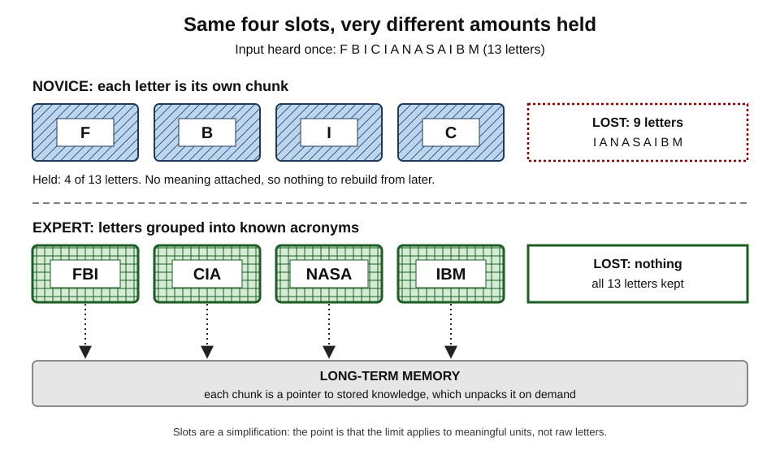
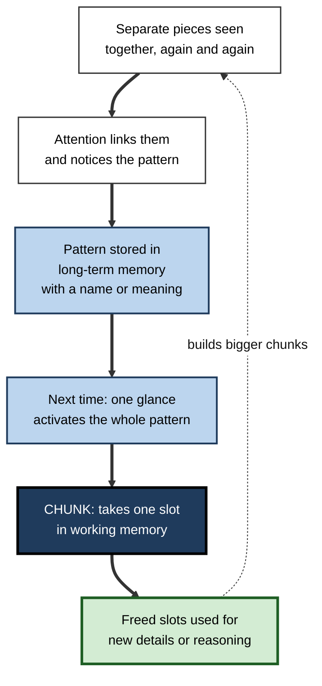
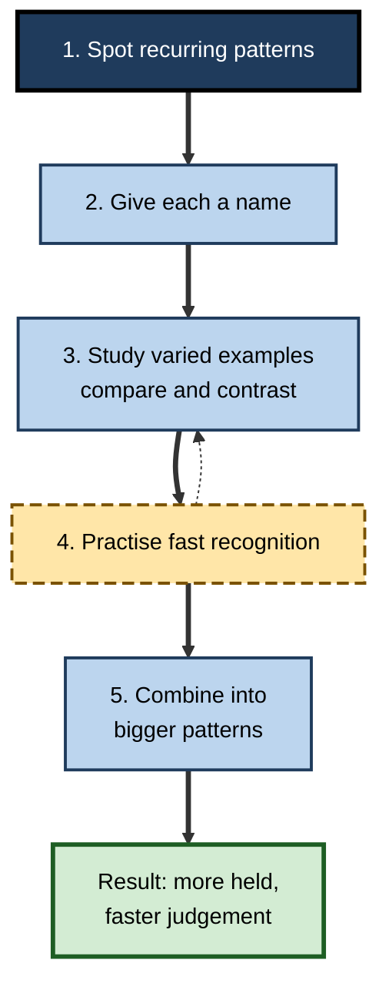

# E.7. Chunking to Expand Capacity

> **In one sentence:** Chunking means grouping small pieces of information into larger meaningful units — like reading "FBI" as one thing instead of three letters — so that the same small working memory can carry much more.
>
> **Why it matters:** Chunking is the main reason experts seem to think faster and hold more than novices. It is how professionals in every field — chess, medicine, software, finance — overcome the fixed limit of working memory, and it is something you can deliberately build in yourself and in others.
>
> **Level span:** Novice → Expert · **Reading time:** ~15 min · **Builds on:** working-memory capacity limits

---

## The Learning Ladder

| Level | Badge | After this level you can... |
|---|---|---|
| 1 | NOVICE | Explain chunking with everyday examples and use simple grouping to remember more. |
| 2 | FOUNDATIONS | Explain why chunks depend on long-term knowledge, and describe the classic chess and digit-span studies. |
| 3 | PRACTITIONER | Build chunks deliberately for a new skill and present information in ready-made chunks for others. |
| 4 | ADVANCED | Explain the mechanisms — compression, long-term working memory, templates — and the limits of chunking. |
| 5 | EXPERT / PRO | Design training, codebases, documents and teams that accelerate chunk formation in others. |

---

## Level 1 · Novice — The Big Picture

Try to remember this list after one reading: **F B I C I A N A S A I B M**. Thirteen letters is far too many for working memory. Now read it again as **FBI — CIA — NASA — IBM**. Suddenly it is easy: four familiar units instead of thirteen separate letters.

That is **chunking**. Your working memory still holds only a few things at once, but each "thing" can be large if it is meaningful to you. A chunk is like a zip file: one small item that unpacks into a lot of content — but only if you have the software (the knowledge) to open it.

*Figure E.7-1 — Same four slots, very different amounts held.* Top row (hatched): a novice holds four single letters and loses nine. Bottom row (cross-hatched, thick border): an expert holds four familiar acronyms and keeps all thirteen letters, because each chunk points to knowledge in long-term memory.

You already chunk all the time:

- You remember phone numbers as groups (area code, then three digits, then four), not as ten separate digits.
- You read whole words, not individual letters.
- A familiar phrase like "once upon a time" costs about as much to hold as one word.
- An experienced driver sees "roundabout with a cyclist on the left" as one situation, while a learner sees a dozen separate things to watch.

The headline: **you cannot make working memory bigger, but you can make each unit carry more — by building knowledge.**

---

## Level 2 · Foundations — Core Concepts

### Chunks live in long-term memory

A chunk only works if your long-term memory already contains the pattern. "NASA" is one chunk for you because you have seen it many times and know what it means. For someone who has never heard of NASA, it is four letters. This is why the same information can be easy for one person and overwhelming for another.

**Figure E.7-2 — How a chunk forms.**

*How to read it:* repeated, attended co-occurrence builds a stored pattern; the pattern then occupies one working-memory slot, freeing the rest. The dotted arrow shows chunks combining into bigger chunks over years of practice.

### The classic evidence

| Study | What happened | Lesson |
|---|---|---|
| **Chess masters** (Adriaan de Groot, 1940s; William Chase and Herbert Simon, 1973) | Shown a real game position for a few seconds, masters reconstructed it far more accurately than novices. With pieces placed randomly, the masters' advantage largely vanished. | Experts do not have bigger working memories; they recognise meaningful patterns. |
| **The digit-span runner** (K. Anders Ericsson, William Chase and Steve Faloon, 1980) | A student, after many months of practice, increased his digit span from about seven to roughly eighty digits by recoding digit groups as running times and ages he knew well. His span for letters stayed ordinary. | Chunking with existing knowledge can multiply effective capacity, but it is specific to the material practised. |
| **Medical diagnosis** | Experienced clinicians recognise clusters of symptoms as "illness scripts" rather than reasoning through each symptom separately. | Professional expertise is largely a library of chunks. |

### Key terms

| Term | Plain meaning |
|---|---|
| **Chunking** | Grouping items into larger meaningful units. |
| **Chunk** | A unit stored in long-term memory that can be held as one item. |
| **Recoding** | Translating raw items into a more meaningful form, such as digits into dates. |
| **Pattern recognition** | Seeing a familiar configuration all at once. |
| **Template** | A large chunk with flexible "slots" for details (from Fernand Gobet and Herbert Simon's template theory). |
| **Long-term working memory** | Experts' use of well-organised long-term knowledge as fast, reliable extra storage during a task. |

---

## Level 3 · Practitioner — Putting It to Work

### Building your own chunks — five steps

1. **Identify the recurring patterns.** In any new field, find the configurations that appear again and again: SQL query shapes, financial statement ratios, negotiation openings, design patterns, chord progressions.
2. **Name each pattern.** A name turns a pattern into a handle you can hold: "N+1 query", "working-capital squeeze", "anchoring opener".
3. **Study many varied examples of each.** Chunks form from repetition with variation. Compare and contrast examples so the core pattern stands out.
4. **Practise recognition under time pressure.** Flash-card style "What pattern is this?" drills, case snippets or code reviews speed recognition.
5. **Combine chunks into bigger ones.** Once small patterns are automatic, practise sequences: "This incident is a cache stampede after a deploy."

**Figure E.7-3 — From pieces to patterns: a learner's chunk-building cycle.**

*How to read it:* the thick path is the cycle; the dotted arrow means returning to more examples when recognition is still slow.

### Presenting ready-made chunks for others

- **Group and label.** Break long lists into labelled groups of three to five.
- **Use structure people already know.** Familiar frameworks (before–after, problem–cause–fix) act as templates.
- **Format numbers for chunking.** "€4.2M" not "4,213,877 euros" when precision is not needed; group long identifiers.
- **Introduce acronyms sparingly.** An acronym is only a chunk once it is learned; a page full of new acronyms is the opposite of chunking.

### Worked example — onboarding to a codebase

| | Before | After |
|---|---|---|
| **Approach** | New engineers read files one by one. | A short guide names the five recurring patterns in the codebase ("handler–service–repository", "event outbox", and so on) with two examples each. |
| **What they hold** | Dozens of unconnected files and functions. | Five named patterns; each new file is recognised as an instance. |
| **Result** | Slow first pull requests; frequent "where does this go?" questions. | Faster orientation; code reviews refer to pattern names. |

### Common mistakes

- **Memorising arbitrary groupings** without meaning — they do not unpack reliably.
- **Assuming your chunks are shared.** Your "obvious" pattern is a dozen pieces for a newcomer.
- **Acronym overload.** Unlearned acronyms add load instead of reducing it.
- **Skipping variety.** Seeing the same example repeatedly builds a narrow chunk that fails on new cases.

---

## Level 4 · Advanced — Mechanisms, Models & Evidence

### Chunking as compression

One way to think about chunking is **compression**: information that contains regularities can be stored in fewer units. Studies by Fabien Mathy, Jacob Feldman and others show that lists with more internal structure are recalled better, and that when compressibility is accounted for, capacity again looks like about three to four chunks. In visual working memory, Timothy Brady and colleagues showed that people can store more items when colours appear in predictable pairs, consistent with learned compression.

### How chunks help working memory

Research by Mirko Thalmann, Alessandra Souza and Klaus Oberauer (2019) found that chunks help in two ways: the chunked material itself is held more efficiently, and capacity is freed for *other*, non-chunked items held at the same time. This supports the idea that a chunk is a compact pointer to long-term memory rather than a bigger box in working memory.

### Long-term working memory and templates

Ericsson and Walter Kintsch (1995) proposed **long-term working memory**: experts encode task information directly into well-organised long-term structures and retrieve it quickly using cues held in working memory. This explains why experts can be interrupted and resume without loss, which pure short-term storage would not allow. Gobet and Simon's **template theory** adds that very large chunks act as templates with variable slots, so experts can fill in details rapidly. Later work found a small expert advantage even for random chess positions, consistent with templates partially matching random configurations.

### Limits of chunking

| Limit | Detail |
|---|---|
| **Domain specificity** | Chunks work only for material that matches stored patterns; the digit-span runner's letter span remained ordinary. |
| **Rigidity** | Strong chunks can cause **Einstellung** — the tendency to apply a familiar solution when a better one exists. Experts sometimes miss novel solutions because they recognise a familiar pattern too quickly. |
| **Mis-chunking** | Grouping by surface features rather than deep structure produces misleading patterns; novices often sort physics problems by objects (inclined planes) while experts sort by principles (conservation of energy). |
| **Time to build** | Large chunk libraries take years of deliberate practice and varied experience. |

### Chunking in language and motor skills

Language users store many multi-word sequences ("as a matter of fact") as single units, which helps fluent speech and comprehension. Motor skills such as typing or playing a piece of music are organised as chunked action sequences: pauses during learning shrink as sequences merge into larger units. These are the same principle applied to perception and action.

---

## Level 5 · Expert / Pro — Professional Mastery

### Accelerating chunk formation in others

| Context | Practice |
|---|---|
| **L&D and onboarding** | Name a small set of core patterns; give varied, contrasting cases; drill recognition before production. |
| **Software engineering** | Consistent architecture patterns, conventional naming, shared idioms and style guides make code chunkable; inconsistency forces readers to process every line. |
| **Medicine, law, consulting** | Case libraries organised by deep structure; teaching "illness scripts" or "issue patterns" explicitly. |
| **Sales and negotiation** | Named objection types and response patterns; call reviews that tag patterns. |
| **Data and finance** | Standard metric definitions and chart conventions so viewers recognise rather than decode. |

### Professional scenario

**Role:** Head of clinical education in an emergency department.
**Situation:** Junior doctors are slow and inconsistent at recognising sepsis in early, atypical presentations.
**What the pro does:** Builds a library of short real cases, organised by underlying pattern rather than presenting complaint. Weekly twenty-minute sessions present mixed cases rapidly; juniors name the pattern before seeing the answer, then compare contrasting cases. Senior clinicians verbalise the chunks they use ("this looks like…because…"). The educator tracks time to recognition in simulations and audit data on early treatment.

### Watching for Einstellung in experts

Experts' greatest asset — fast pattern recognition — is also a risk. Pros build in checks: deliberately asking "What else could this be?", pre-mortems, red-team reviews and diverse teams who chunk differently. In incident response and diagnosis, a structured "differential" step guards against locking onto the first familiar pattern.

### AI-era implications

AI tools can hand learners the answer without the pattern. If a junior analyst always asks an assistant to write the query, they never build the chunks that let them spot when the query is wrong. Yet AI can also accelerate chunking — generating many varied examples of a pattern, quizzing recognition, or explaining which pattern a piece of code follows. Professional practice: use AI to multiply examples and feedback, not to skip the recognition practice that builds chunks. Because judging AI output depends on recognising when something does not fit, chunk libraries are becoming more, not less, valuable.

---

## Myths vs. Evidence

| Myth | What the evidence shows |
|---|---|
| "Experts have bigger working memories." | Experts have richer chunks; their raw capacity is typically ordinary. |
| "Chunking is just a memory trick." | It is the core mechanism of expertise, built from long-term knowledge. |
| "Memory champions have special brains." | Their feats rely on practised strategies and chunking; skills are specific to the practised material. |
| "Any grouping helps." | Groupings must be meaningful and connected to stored knowledge to unpack reliably. |
| "More acronyms make communication efficient." | Only for those who have learned them; otherwise they increase load. |
| "Experts always see the best solution." | Strong chunks can cause Einstellung, blocking better novel solutions. |

## Practitioner Toolkit

**Chunk-building checklist for learning a new skill**

- [ ] I listed the recurring patterns in the field.
- [ ] Each pattern has a name I can use.
- [ ] I have at least five varied examples of each.
- [ ] I practise naming patterns quickly from fresh examples.
- [ ] I compare patterns that look similar but differ in deep structure.
- [ ] I ask "What else could this be?" when a pattern fires.

**Template — pattern card**

| Pattern name | Signature (how to recognise it) | Two contrasting examples | Common look-alike | What to do |
|---|---|---|---|---|
| | | | | |

## Self-Check

1. **[NOVICE]** What is chunking? Give an everyday example.
2. **[NOVICE]** Why is "NASA" one chunk for you but not for everyone?
3. **[FOUNDATIONS]** What did the chess studies with random positions show?
4. **[FOUNDATIONS]** What did the digit-span runner's letter span reveal?
5. **[PRACTITIONER]** Describe the five steps for building chunks in a new field.
6. **[ADVANCED]** How does chunking free capacity for other items?
7. **[ADVANCED]** What is Einstellung, and why is it a risk for experts?
8. **[EXPERT / PRO]** How would you design onboarding to help new hires chunk a codebase?
9. **[EXPERT / PRO]** How should AI be used so it supports rather than replaces chunk formation?

### Answer Key

1. Grouping small pieces into meaningful units, such as remembering a phone number in groups.
2. Chunks depend on stored knowledge; someone who does not know NASA sees four letters.
3. Masters' advantage largely disappeared, showing their skill depends on recognising meaningful patterns, not bigger memory.
4. It stayed ordinary, showing his chunking skill was specific to digits.
5. Spot recurring patterns, name them, study varied examples, practise fast recognition, combine into bigger patterns.
6. The chunk is held compactly as a pointer to long-term memory, leaving capacity for other items.
7. Applying a familiar solution when a better one exists; strong chunks fire quickly and block alternatives.
8. Name a few core patterns with examples, use consistent conventions, and have new hires recognise patterns in real files.
9. Use it to generate varied examples, quiz recognition and explain patterns — not to produce answers the learner never practises recognising.

## Key Takeaways

- Working memory holds a few **chunks**, and chunks can be **large**.
- Chunks are **stored in long-term memory**; knowledge is what expands effective capacity.
- **Expertise is largely a chunk library**, not a bigger working memory.
- Build chunks by **naming patterns and practising recognition on varied examples**.
- Chunks are **domain-specific** and can cause **Einstellung**.
- Present information in **ready-made chunks** for others; avoid unlearned acronyms.

## Glossary

| Term | Meaning |
|---|---|
| Chunk | A meaningful unit stored in long-term memory, held as one item. |
| Chunking | Grouping items into larger meaningful units. |
| Compression | Representing structured information in fewer units. |
| Einstellung | Fixation on a familiar solution that blocks better ones. |
| Illness script | A clinician's stored pattern for a disease presentation. |
| Long-term working memory | Expert use of organised long-term knowledge as fast working storage. |
| Pattern recognition | Recognising a familiar configuration at once. |
| Recoding | Translating raw items into meaningful forms. |
| Template | A large chunk with variable slots for details. |
