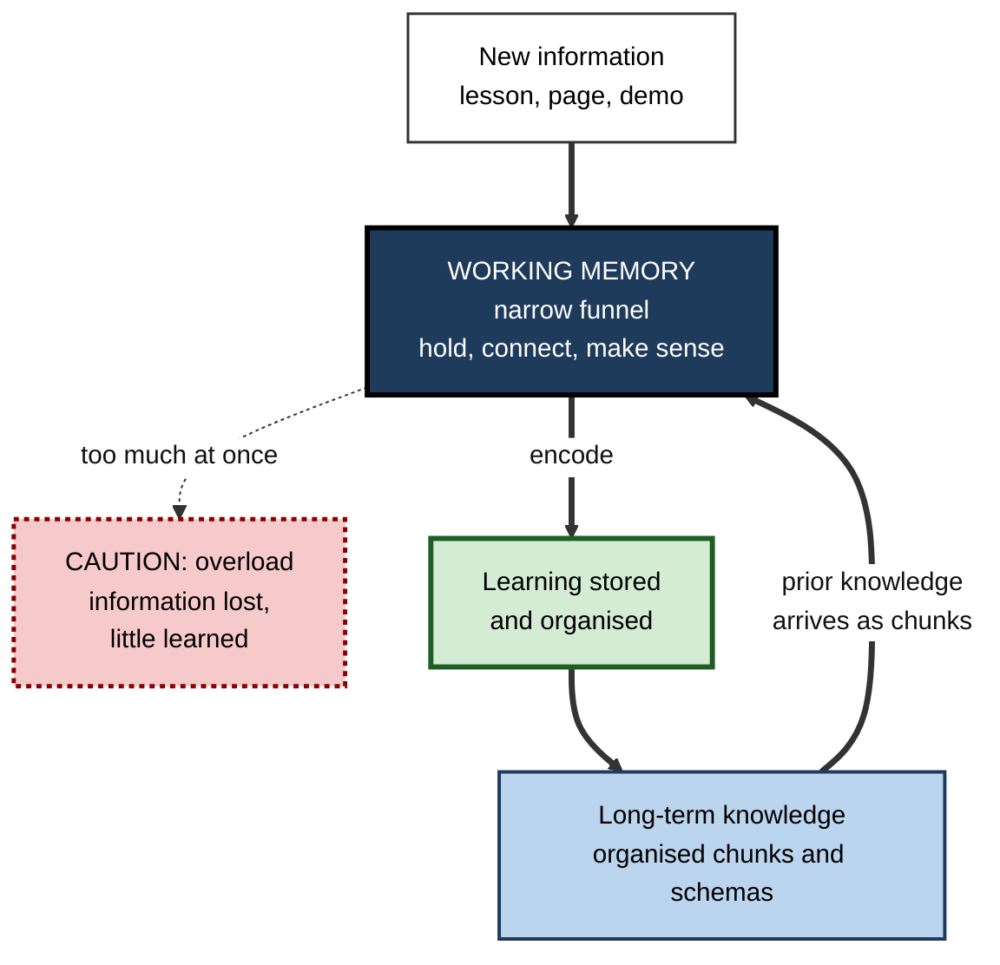
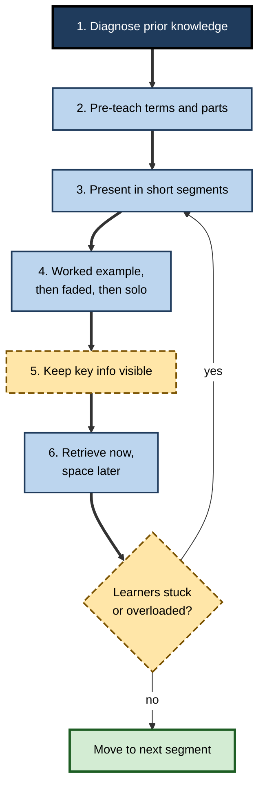

# E.8. Working Memory and Learning

> **In one sentence:** Everything new you learn must squeeze through working memory before it can be stored for the long term, so the size of that "doorway" — and how crowded it is — shapes how fast and how well you learn.
>
> **Why it matters:** Most failed learning — in school, onboarding or upskilling — is not caused by laziness or lack of ability but by instruction that overloads working memory. Knowing how the two interact lets you learn faster yourself and design learning that works for everyone, including people with lower working-memory capacity.
>
> **Level span:** Novice → Expert · **Reading time:** ~15 min · **Builds on:** working-memory capacity and chunking

---

## The Learning Ladder

| Level | Badge | After this level you can... |
|---|---|---|
| 1 | NOVICE | Explain why too much new information at once blocks learning. |
| 2 | FOUNDATIONS | Describe the two-way relationship between working memory and long-term knowledge, and the signs of overload in learners. |
| 3 | PRACTITIONER | Structure your own study and other people's lessons to stay within working-memory limits. |
| 4 | ADVANCED | Explain the evidence linking working memory to reading, maths and learning, and the role of prior knowledge and anxiety. |
| 5 | EXPERT / PRO | Design inclusive learning programmes and AI-assisted learning that adapt to working-memory load. |

---

## Level 1 · Novice — The Big Picture

Imagine pouring water through a funnel into a big jug. The jug (long-term memory) can hold a lot. The funnel (working memory) is narrow. Pour slowly and steadily and the jug fills. Pour too fast and the water overflows — and is wasted.

Learning works the same way. New information must first be held and made sense of in working memory. Only then can it be linked to what you already know and stored. When too much arrives at once — a fast lecture, a dense slide, a page of new terms — most of it overflows before it can be stored.

You have already lived this:

- In your first week at a new job, people told you dozens of names, systems and acronyms, and by Friday you remembered almost none.
- A teacher went through a maths proof too quickly; you followed each step but could not reproduce it afterwards.
- A tutorial video with music, subtitles, pop-up notes and a fast narrator left you feeling busy but not much wiser.

There is a happy twist: **the more you already know, the wider the funnel effectively becomes.** Familiar knowledge forms chunks, so new material connected to it takes up less space. That is why learning gets easier as you progress in a field.

---

## Level 2 · Foundations — Core Concepts

### The two-way street

Working memory and long-term memory constantly exchange information:

- **Working memory → long-term memory.** New information processed in working memory can be encoded for the long term.
- **Long-term memory → working memory.** Stored knowledge is pulled in to interpret new information — and because it arrives as chunks, it costs little capacity.

**Figure E.8-1 — The learning loop between working memory and long-term memory.**

*How to read it:* the thick loop is healthy learning — new learning is stored, and stored knowledge makes the next round easier. The dotted arrow is overload.

### Signs a learner's working memory is overloaded

Research in classrooms by Susan Gathercole, Tracy Alloway and colleagues identified behaviours typical of children with low working memory that apply to adults too:

| Sign | What it looks like at work |
|---|---|
| Losing track of multi-step instructions | Completes the first step of a process and stalls. |
| Losing their place in a task | Re-reads, restarts, skips a step in a checklist they are not using. |
| Failing at tasks that combine holding and processing | Struggles to take notes while listening, or code while following a spoken explanation. |
| Appearing inattentive | Drifts off — often because the material has overflowed, not because of disinterest. |
| Giving up | Disengages after repeated failures that felt like personal shortcomings. |

### Key terms

| Term | Plain meaning |
|---|---|
| **Encoding** | Processing information so it can be stored in long-term memory. |
| **Prior knowledge** | What a learner already knows that relates to new material. |
| **Schema** | An organised structure of knowledge in long-term memory. |
| **Element interactivity** | How many pieces of new information must be considered together to understand something. |
| **Worked example** | A fully solved problem shown step by step. |
| **Expertise reversal effect** | Support that helps novices can hinder more knowledgeable learners. |
| **Scaffolding** | Temporary support that is gradually removed. |

---

## Level 3 · Practitioner — Putting It to Work

### The Narrow-Funnel Lesson Plan — six steps

Use this for teaching others or for structuring your own study.

1. **Find what learners already know** with a short diagnostic question or two. Connect new content to it explicitly.
2. **Pre-teach the vocabulary.** Introduce new terms and components before showing how they interact, so the main lesson is not also a vocabulary lesson.
3. **Present in segments.** Short chunks, each followed by a pause, a question or a small task.
4. **Show, then fade.** Start with worked examples; then partially completed problems; then independent practice.
5. **Keep needed information visible.** Diagrams labelled directly, steps listed on screen, glossary at hand.
6. **Retrieve and space.** End with a no-notes recall question; revisit after a few days.

**Figure E.8-2 — Designing a lesson for limited working memory.**

*How to read it:* the thick path is the lesson flow; if learners show overload, return to smaller segments.

### Worked example — training analysts on a new BI tool

| | Before | After |
|---|---|---|
| **Format** | Three-hour live demo covering twenty features; recording shared afterwards. | Six 30-minute sessions over two weeks; each covers two or three features. |
| **Vocabulary** | Terms introduced in passing during the demo. | One-page glossary sent ahead and reviewed in five minutes. |
| **Practice** | "Try it yourself later." | Each session: one worked example, one guided task, one solo task on the analyst's own data. |
| **Check** | Satisfaction survey. | Short unaided task two weeks later. |
| **Outcome** | Low adoption; support tickets for basics. | Higher unaided success; tickets shift to advanced questions. |

### Common mistakes

- **Teaching at expert speed.** Experts' chunks make content feel simple to them.
- **Mixing new vocabulary with new procedures.** Learners must process both at once.
- **Decorative extras.** Interesting but irrelevant anecdotes, music and animations ("seductive details") can compete for working memory.
- **Keeping full support too long.** Worked examples that help novices can slow learners once they have built schemas.
- **Labelling overloaded learners as unmotivated.**

---

## Level 4 · Advanced — Mechanisms, Models & Evidence

### Working memory predicts learning outcomes

Working-memory capacity is consistently associated with reading comprehension (Meredyth Daneman and Patricia Carpenter's reading span, 1980, was designed for this), mathematical problem solving, vocabulary growth and following instructions. In children, low working memory is a common feature of learning difficulties, and some studies suggest it predicts later academic attainment over and above measures of general ability, although the size of that unique contribution varies across studies.

### Prior knowledge changes the equation

The single biggest moderator is prior knowledge. Because knowledge arrives as chunks, a knowledgeable learner experiences the same material as lower load. This underpins **cognitive load theory** (developed by John Sweller from the late 1980s), which treats working-memory limits as the central constraint in instructional design. It also explains the **expertise reversal effect**: worked examples and heavy guidance help novices, but for learners with relevant knowledge they become redundant and can hinder learning. Good design adapts support to the learner's current knowledge.

### Anxiety and working memory

Worry consumes working memory. **Attentional control theory** (Michael Eysenck and colleagues, 2007) proposes that anxiety reduces the efficiency of executive attention, so anxious learners must work harder to reach the same performance. Studies of maths anxiety and test anxiety show that high-working-memory learners can be the most affected under pressure, because they rely most on working-memory-heavy strategies. Interventions that reduce worry — such as reframing arousal or brief writing about worries before a test — have shown benefits in some studies, but replications are mixed, so treat them as promising rather than established.

### Strategies that work across working-memory levels

Some evidence-based study strategies seem to be robust to differences in capacity. **Retrieval practice** — testing yourself rather than re-reading — improves learning broadly, and one study found that its benefits were, if anything, larger for students with lower working-memory capacity. **Spacing** helps nearly everyone. These strategies shift effort from holding to retrieving, which may be why they are relatively inclusive.

### A contested finding: laptops versus longhand notes

A widely cited 2014 study claimed students who took notes on paper learned more than those using laptops, because handwriting forces summarising. A larger direct replication in 2019 did not find a clear advantage for longhand. The safer conclusion: note-taking that requires processing — summarising, connecting — helps, whatever the medium; verbatim transcription does not.

### Boundary conditions

- Overload depends on **element interactivity**: a list of vocabulary items is high in volume but low in interactivity; understanding a feedback loop in a system is high in both.
- **Desirable difficulties** — challenges that improve long-term learning — are only desirable if working memory can handle them; overloaded learners learn little from extra difficulty.

---

## Level 5 · Expert / Pro — Professional Mastery

### Inclusive design by default

Working-memory-friendly design benefits everyone, and especially people with ADHD, dyslexia, anxiety, or learning in a second language, and anyone learning while tired or stressed. Effective L&D teams build it in by default:

| Design principle | Implementation |
|---|---|
| Segment | Microlearning modules focused on one concept, followed by practice. |
| Pre-train | Glossaries and component overviews before procedural training. |
| Externalise | Job aids, checklists and searchable references, so memory goes to understanding. |
| Fade support | Worked examples first, then hints, then independent practice. |
| Reduce noise | Remove decorative media; align narration with visuals. |
| Space and retrieve | Follow-up quizzes and scenario practice over weeks. |
| Adapt | Diagnostic pre-tests route learners with prior knowledge past basics. |

### Professional scenario

**Role:** Learning lead at a consulting firm.
**Situation:** New hires go through a dense two-week bootcamp covering frameworks, tools and firm processes. Six weeks later, managers report that new hires cannot apply the frameworks on live engagements.
**What the pro does:** Splits the bootcamp into a one-week foundation focused on three core frameworks with worked cases, followed by short weekly sessions during the first engagement. Each framework comes with a one-page job aid. New hires practise with partially solved cases before full cases. The lead measures framework application in engagement deliverables at week eight and compares cohorts.

### AI tutors and working memory

AI tutors can adapt explanations, segment content and provide hints exactly when needed — an excellent fit for working-memory constraints. But field evidence from 2024 and 2025 shows that unrestricted AI help can improve practice scores while lowering unaided performance later, and studies of unguided AI use report reduced reflection and self-monitoring. The design implications are specific: the AI should give hints before answers, require the learner to attempt first, reduce *extraneous* load (formatting, searching) while preserving the *essential* processing that produces learning, and end with unaided retrieval.

### Measuring load in practice

Professionals rarely measure working memory directly. Practical proxies include: error patterns concentrated at high-interaction points, time spent re-watching or re-reading segments, drop-off at specific points in e-learning, and brief self-reports of mental effort. These indicate where to segment, pre-train or externalise.

---

## Myths vs. Evidence

| Myth | What the evidence shows |
|---|---|
| "Struggling learners just need to pay more attention." | Inattention is often a symptom of overload; reducing load helps more than urging focus. |
| "More media makes learning richer." | Irrelevant extras compete for working memory; aligned, minimal media works better. |
| "Strong guidance always helps." | Guidance helps novices but can hinder learners with prior knowledge (expertise reversal). |
| "Handwritten notes are always better than laptop notes." | A large replication did not confirm a clear advantage; processing, not medium, matters. |
| "Low working memory means low potential." | With well-designed instruction and aids, people with lower capacity learn effectively; knowledge eventually reduces load. |
| "Training working memory will fix learning difficulties." | Training produces gains on similar tasks but little transfer to reading or maths; changing instruction is more effective. |

## Practitioner Toolkit

**Lesson design checklist**

- [ ] I checked what learners already know.
- [ ] New terms are introduced before procedures.
- [ ] Content is in short segments with practice after each.
- [ ] Worked examples come first, then fade.
- [ ] Information needed during tasks is visible, not memorised.
- [ ] No decorative media competing for attention.
- [ ] Unaided retrieval at the end and again days later.
- [ ] Support adapts for learners with prior knowledge.

**Template — segment plan**

| Segment | New elements (max 3–4) | Prior knowledge to connect | Worked example | Practice task | Retrieval check |
|---|---|---|---|---|---|
| | | | | | |

## Self-Check

1. **[NOVICE]** Why does too much new information at once block learning?
2. **[NOVICE]** Why does learning get easier the more you know?
3. **[FOUNDATIONS]** List three signs of working-memory overload in a learner.
4. **[FOUNDATIONS]** What is the expertise reversal effect?
5. **[PRACTITIONER]** Why pre-teach vocabulary before a procedure?
6. **[ADVANCED]** How does anxiety interact with working memory?
7. **[ADVANCED]** What happened when the laptop-versus-longhand finding was replicated?
8. **[EXPERT / PRO]** How should an AI tutor be configured to respect working memory without undermining learning?
9. **[EXPERT / PRO]** What practical proxies indicate overload in an e-learning module?

### Answer Key

1. Working memory is the narrow entry point; overflow means information is lost before it can be stored.
2. Prior knowledge arrives as chunks, so related new material takes less capacity.
3. Losing track of multi-step instructions, losing place in tasks, struggling to hold and process at once, appearing inattentive, giving up.
4. Support that helps novices can become redundant and harmful for learners with more knowledge.
5. So learners are not processing new terms and new procedures at the same time.
6. Worry occupies working memory and reduces attentional efficiency, especially under pressure.
7. A larger replication did not find a clear longhand advantage.
8. Hints before answers, learner attempts first, reduce extraneous load while preserving essential processing, finish with unaided retrieval.
9. Error clusters at complex points, repeated re-watching, drop-off points and high self-reported effort.

## Key Takeaways

- Working memory is the **narrow doorway** for all new learning.
- **Prior knowledge widens it** by turning content into chunks.
- Overload looks like **inattention**; reduce load before blaming motivation.
- Use **segmenting, pre-training, worked examples, visible aids, retrieval and spacing**.
- **Adapt support** to knowledge — guidance can reverse its benefit for experts.
- AI tutors should **remove clutter, not the thinking** that produces learning.

## Glossary

| Term | Meaning |
|---|---|
| Attentional control theory | Theory that anxiety impairs efficient executive attention. |
| Cognitive load theory | Instructional design theory centred on working-memory limits. |
| Element interactivity | The number of elements that must be processed together. |
| Encoding | Processing information for long-term storage. |
| Expertise reversal effect | Support that helps novices hinders more expert learners. |
| Reading span | A complex span task combining sentence reading with word recall. |
| Retrieval practice | Learning by recalling information from memory. |
| Scaffolding | Temporary support gradually removed. |
| Schema | An organised structure of knowledge. |
| Seductive details | Interesting but irrelevant material that can impair learning. |
| Worked example | A step-by-step solved problem. |
