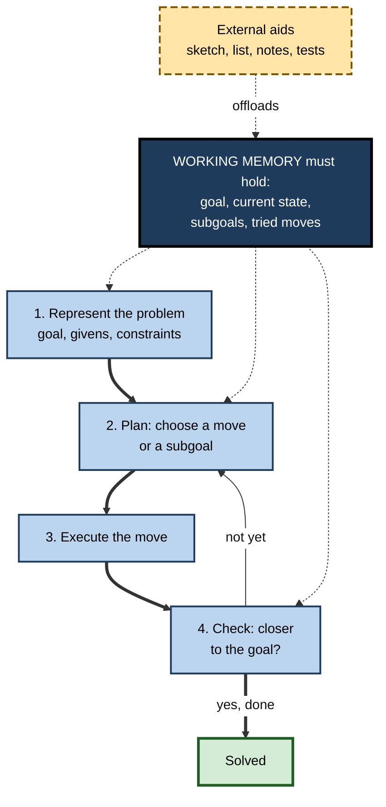
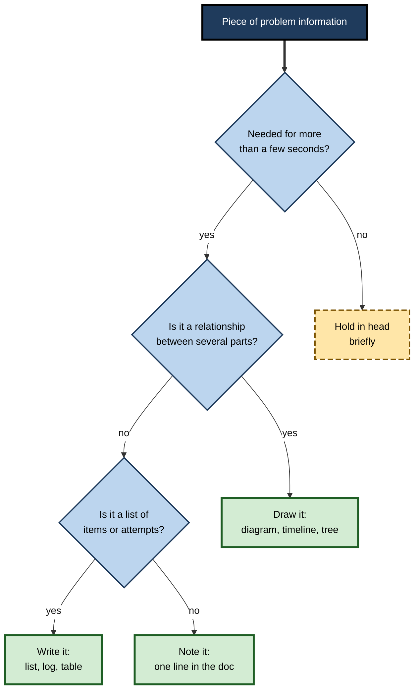

# E.9. Working Memory in Problem Solving

> **In one sentence:** When you solve a problem, working memory has to hold the goal, the current situation, the possible next moves and what you have already tried — all at once — so problems often feel hard not because they need genius but because they overflow this small workspace.
>
> **Why it matters:** Debugging, financial modelling, diagnosing a customer issue, planning a project and negotiating a deal are all problem solving. Professionals who know where the working-memory bottleneck lies use diagrams, notes, decomposition and calm to solve problems that would otherwise defeat them.
>
> **Level span:** Novice → Expert · **Reading time:** ~15 min · **Builds on:** working-memory capacity, the central executive and chunking

---

## The Learning Ladder

| Level | Badge | After this level you can... |
|---|---|---|
| 1 | NOVICE | Explain why problems feel hard when you must keep many things in mind, and use paper to help. |
| 2 | FOUNDATIONS | Describe what working memory holds during problem solving and how novices and experts differ. |
| 3 | PRACTITIONER | Apply a structured externalise–decompose–check method to real work problems. |
| 4 | ADVANCED | Explain the evidence on problem isomorphs, relational complexity, choking under pressure and insight. |
| 5 | EXPERT / PRO | Design team problem-solving practices, tools and AI use that offload working memory without offloading judgement. |

---

## Level 1 · Novice — The Big Picture

Think about planning a dinner party in your head: six guests, two vegetarians, one nut allergy, a small oven, guests arriving at different times, and a budget. Each fact on its own is easy. Together, they are hard — because you keep forgetting one constraint while working on another. Write them on a sheet of paper and the puzzle suddenly becomes manageable.

That is the central truth of this note: **many problems are hard mainly because of how much you have to hold in mind at the same time.** Working memory is where you:

- keep the **goal** in view ("dinner for six under 100 dollars");
- hold the **current state** ("I have chosen the main course");
- consider **possible moves** ("what about a side dish without nuts?");
- remember **what you have tried** and **what is still open**.

If any one of these drops out, you go round in circles, repeat failed attempts or forget a constraint.

You have seen this when:

- you fixed one bug and accidentally broke something you had forgotten about;
- you lost track during a long mental calculation and had to start again;
- a problem that baffled you at your desk became clear when you explained it to a colleague or sketched it on a whiteboard.

---

## Level 2 · Foundations — Core Concepts

### What working memory holds during problem solving

Herbert Simon and Allen Newell described problem solving as a search through a **problem space**: a starting state, a goal state, and the moves that connect them. Working memory holds the parts of that space you are currently using.

**Figure E.9-1 — The problem-solving loop and what it demands of working memory.**

*How to read it:* the thick loop is solving; working memory supports every step (dotted arrows), and external aids relieve it.

### Novice versus expert strategies

| Aspect | Novice | Expert |
|---|---|---|
| **How they see the problem** | Surface features ("a pulley problem", "a timeout error") | Deep structure ("conservation of energy", "resource exhaustion") |
| **Main strategy** | **Means-ends analysis**: compare current state to goal, look for a move to reduce the gap, set subgoals. Heavy on working memory. | **Forward working from recognised patterns**: recognise the type and apply a known solution path. Light on working memory. |
| **Load** | Must hold goal, subgoals, current state and differences at once. | Chunks and schemas carry most of the structure. |
| **Risk** | Overload, circling, forgetting constraints. | Einstellung: applying a familiar solution where it does not fit. |

### Key terms

| Term | Plain meaning |
|---|---|
| **Problem space** | All the states and moves between a problem's start and its goal. |
| **Means-ends analysis** | Repeatedly reducing the difference between current state and goal, setting subgoals as needed. |
| **Subgoal** | An intermediate target on the way to the main goal. |
| **Isomorph** | Two problems with identical structure but different surface stories. |
| **Relational complexity** | How many variables must be related to each other at once. |
| **Externalisation** | Moving problem information out of the head into a visible form. |
| **Choking under pressure** | Performing below your normal level when stakes feel high. |

---

## Level 3 · Practitioner — Putting It to Work

### The Externalise–Decompose–Check method

1. **Write the goal in one line.** Keep it visible the whole time. Many failed solutions solve the wrong problem.
2. **List the givens and constraints.** Everything you know and every limit — on paper, a whiteboard or a document.
3. **Draw it.** A diagram turns relationships you must hold into relationships you can see: a timeline, a flow, a table, a tree.
4. **Decompose.** Break the problem into subproblems small enough to hold one at a time. Write the subgoal stack down.
5. **Log attempts.** A short "tried / result" list prevents repeating failed moves.
6. **Check against the goal and constraints** after each step, not only at the end.
7. **Explain it aloud** to a colleague or even an object (the "rubber duck" technique). Explaining forces you to externalise and often reveals the gap.

**Figure E.9-2 — Deciding where the load should live.**

*How to read it:* only short-lived information stays in the head; relationships are drawn, lists are written, everything else is noted.

### Worked example — debugging an intermittent production error

| | Before | After |
|---|---|---|
| **Approach** | Engineer reads logs and code in many tabs, holding hypotheses mentally. | Engineer opens a debugging doc: goal, symptoms, timeline, hypotheses table, tried-and-result log. |
| **Load** | Six hypotheses, three services and a timeline all in the head; forgets which hypothesis was ruled out. | Hypotheses and timeline visible; one hypothesis tested at a time. |
| **Communication** | Hard to hand over at the end of the day. | Doc is the handover; a colleague continues next morning. |
| **Outcome** | Two days of circling. | Root cause found after a systematic sweep; the doc becomes the post-incident record. |

### Common mistakes

- **Solving in your head out of pride.** Experts use paper for hard problems; novices are the ones who resist.
- **Losing the goal.** Hours spent optimising the wrong thing.
- **Testing several changes at once.** Results become impossible to interpret, adding load.
- **Problem solving under avoidable pressure.** Real urgency is sometimes unavoidable; artificial pressure is not.

---

## Level 4 · Advanced — Mechanisms, Models & Evidence

### Same structure, very different difficulty

In the 1980s, Kenneth Kotovsky, John Hayes and Herbert Simon gave people versions of the Tower of Hanoi puzzle with identical structure but different stories and rule presentations. Some versions took many times longer to solve than others. The main reason was how much working memory the rules demanded: when rules had to be held in mind rather than being built into the physical setup, problems became far harder. This is a powerful demonstration that **difficulty is partly a property of the representation, not just the problem**.

### Diagrams and representation

Jill Larkin and Herbert Simon explained in 1987 why a diagram can be "worth ten thousand words": diagrams group related information by location, so the solver can find relationships by looking rather than by searching memory. Choosing a good representation is often the most valuable problem-solving move.

### Relational complexity

Graeme Halford and colleagues argued that humans can process only a limited number of interacting variables in one step — around four in their experiments with interaction graphs. Problems that require considering more variables at once must be decomposed into steps that each relate fewer variables. This matches everyday experience with multi-factor decisions.

### Working memory and reasoning

Working-memory capacity correlates strongly with fluid reasoning — performance on novel problems such as matrix puzzles. A plausible mechanism is that holding several relations and rule candidates at once is the core demand of these tasks. The correlation does not mean reasoning is *nothing but* working memory: strategy, knowledge and attention control all contribute.

### Pressure, worry and choking

Sian Beilock and colleagues showed that pressure to perform can make people choke on maths problems, and that people with *higher* working-memory capacity are often the most affected, because worry consumes the capacity their preferred strategies rely on. Practised skills that run automatically are less affected by worry but can be disrupted by **over-attention** — consciously monitoring steps that normally run smoothly. These findings are well established in general outline; the specific remedies tested (such as expressive writing before tests) have mixed replication records.

### Insight problems: a mixed picture

For analytic, step-by-step problems, higher working memory reliably helps. For **insight problems** — those solved by a sudden restructuring — the evidence is mixed. Some studies find that working memory helps insight too; others find that a tighter focus can sustain fixation on an unhelpful approach. Taking a break (incubation) helps in some cases. This is an active debate; avoid strong claims either way.

---

## Level 5 · Expert / Pro — Professional Mastery

### Team problem-solving practices that offload working memory

| Practice | Working-memory benefit |
|---|---|
| **Shared problem doc or whiteboard** | Goal, constraints and hypotheses are visible to everyone. |
| **Scribe role** in incident calls and workshops | Frees the lead to think rather than record. |
| **Structured frameworks** (issue trees, five whys, fishbone, hypothesis tables) | Ready-made representations that decompose problems. |
| **Pair programming and pairing on analysis** | One person holds the big picture while the other works in detail. |
| **Timeboxed silent writing before discussion** | Each person externalises before group dynamics take over. |
| **Tests and type checkers** | Hold correctness constraints so engineers do not have to. |

### Professional scenario

**Role:** Senior management consultant leading a pricing diagnostic.
**Situation:** The client team debates revenue decline with dozens of possible causes floating in conversation; meetings end without progress.
**What the pro does:** Builds an issue tree on a shared board: revenue splits into volume and price; each splits again by segment and channel. Every hypothesis gets a box, an owner and a test. Meetings start by reviewing the tree, not by open discussion. Within two weeks the team has tested and eliminated most branches and focused on one segment's discounting practices. The consultant notes that nothing about the client team's intelligence changed — only the representation.

### Pressure management for high-stakes problem solving

Professionals in surgery, aviation, trading and incident response use pre-agreed procedures, checklists and calm, slow communication protocols because acute pressure reduces available working memory. Simulation training under realistic pressure helps make key responses automatic and less vulnerable to worry.

### AI-era implications

AI assistants are powerful externalisation tools: they can keep track of hypotheses, summarise logs, draw diagrams and enumerate cases. They can also take over the *thinking*: proposing a fix you accept without understanding. Research on AI-assisted knowledge work reports confidence rising faster than competence when people rely on generated answers. The professional pattern: use AI to hold and organise information (externalise), but keep the goal, the decomposition and the final judgement in human hands — and verify against the original problem constraints before accepting a solution.

---

## Myths vs. Evidence

| Myth | What the evidence shows |
|---|---|
| "Hard problems are hard because they need special intelligence." | Many are hard mainly because of working-memory load; changing the representation can make them much easier. |
| "Real experts solve it all in their heads." | Experts routinely externalise complex problems; they chunk what is familiar and draw what is not. |
| "Pressure focuses the mind." | Worry under pressure consumes working memory; high-capacity people can be the most affected. |
| "More working memory always helps creativity and insight." | Evidence for insight problems is mixed and contested. |
| "Brainstorming aloud in a group is best." | Silent individual idea writing before discussion often produces more and better ideas. |
| "AI solving it means the problem is solved." | Accepting unverified solutions raises confidence more than correctness. |

## Practitioner Toolkit

**Problem-solving board template**

| Section | Content |
|---|---|
| Goal (one line) | |
| Givens and constraints | |
| Representation (diagram, tree, timeline) | |
| Subgoal stack | |
| Hypotheses (owner, test, status) | |
| Tried / result log | |
| Next step | |

**Checklist before you dive in**

- [ ] Goal written and visible.
- [ ] Constraints listed.
- [ ] At least one diagram drawn.
- [ ] Problem decomposed into holdable subproblems.
- [ ] One change tested at a time.
- [ ] Attempts logged.
- [ ] AI suggestions verified against goal and constraints.

## Self-Check

1. **[NOVICE]** Why did the dinner-party problem get easier on paper?
2. **[NOVICE]** Name four things working memory holds while solving a problem.
3. **[FOUNDATIONS]** What is means-ends analysis and why is it demanding?
4. **[FOUNDATIONS]** How do experts' and novices' strategies differ?
5. **[PRACTITIONER]** Which information should be drawn rather than listed?
6. **[ADVANCED]** What did the Tower of Hanoi isomorph studies show?
7. **[ADVANCED]** Why can high-working-memory people choke more under pressure?
8. **[EXPERT / PRO]** Describe two team practices that offload working memory.
9. **[EXPERT / PRO]** How should AI be used in professional problem solving?

### Answer Key

1. The constraints were externalised, so working memory no longer had to hold them all at once.
2. The goal, the current state, possible next moves and what has been tried (plus subgoals).
3. Repeatedly comparing current state to goal and setting subgoals; it requires holding goal, state, differences and subgoals at once.
4. Novices work backward from the goal using means-ends analysis; experts recognise the problem type and work forward with chunked schemas.
5. Relationships between several parts, such as timelines, flows and dependencies.
6. Problems with identical structure varied hugely in difficulty depending on how much the rules loaded working memory.
7. Worry consumes the working memory their preferred strategies rely on.
8. Examples: shared problem doc, scribe role, issue trees, pairing, silent writing before discussion.
9. Use it to hold and organise information, but keep the goal, decomposition and final judgement human, and verify solutions.

## Key Takeaways

- Problem solving requires holding **goal, state, moves and history** at once.
- Much difficulty comes from **working-memory load and representation**, not raw intelligence.
- **Externalise, decompose and check** — draw relationships, write lists.
- Experts **chunk the familiar and externalise the rest**.
- **Pressure and worry** shrink available capacity.
- Use AI to **externalise information**, not to outsource judgement.

## Glossary

| Term | Meaning |
|---|---|
| Choking under pressure | Underperforming relative to ability when stakes are high. |
| Decomposition | Splitting a problem into smaller subproblems. |
| Externalisation | Moving information out of the head into visible form. |
| Fluid reasoning | Solving novel problems independent of acquired knowledge. |
| Incubation | Setting a problem aside, after which a solution sometimes emerges. |
| Insight problem | A problem typically solved by sudden restructuring. |
| Isomorph | A problem with identical structure but different surface. |
| Issue tree | A hierarchical breakdown of a question into sub-questions. |
| Means-ends analysis | Reducing differences between current state and goal via subgoals. |
| Problem space | The states and moves between start and goal. |
| Relational complexity | The number of variables that must be related at once. |
