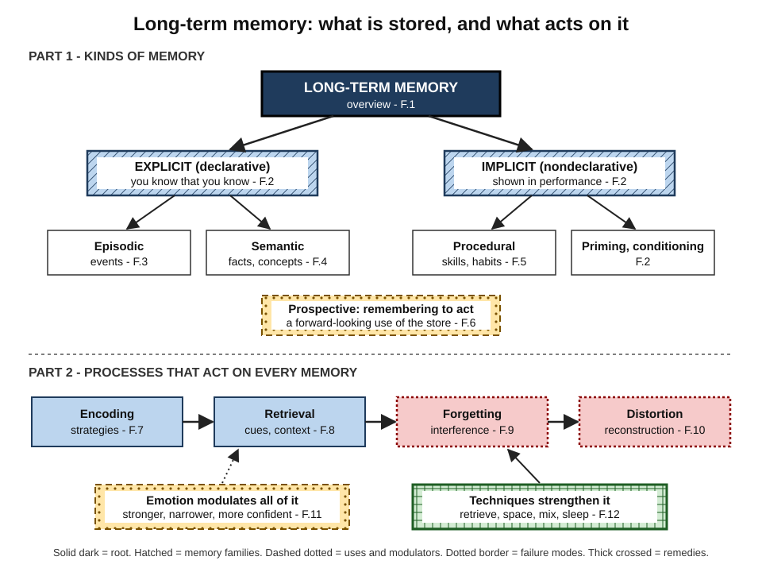
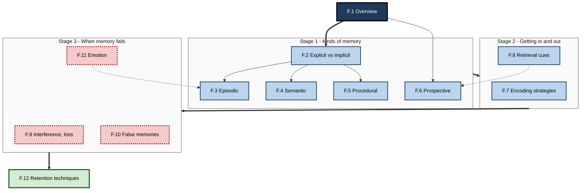
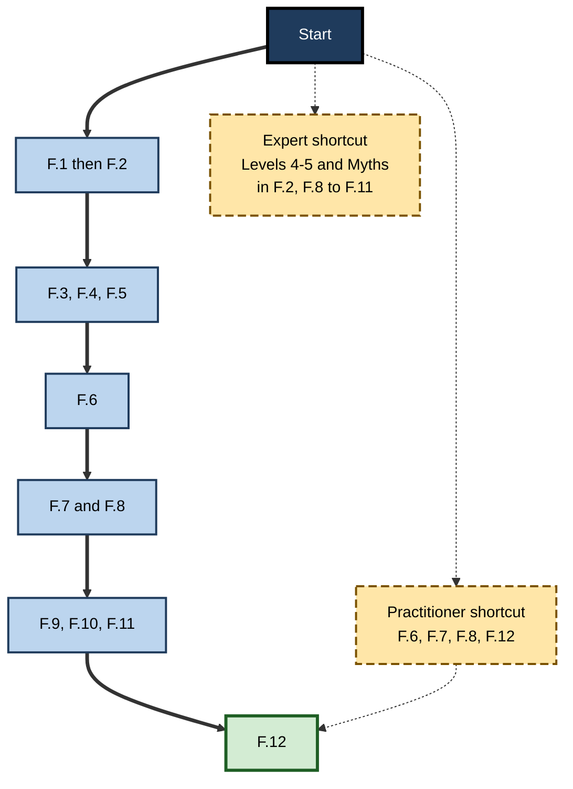

# F. Long-Term Memory

> **What this subtopic is about:** How the brain's lasting store of knowledge, experiences and skills is organised, how information gets in and comes back out, why it is forgotten and distorted, how emotion shapes it, and which techniques reliably make it last.
>
> **Who it is for:** Anyone who learns or helps others learn at work — individual professionals, managers, trainers, L&D and enablement teams, and people designing tools and AI-assisted workflows · **Notes in this subtopic:** 12 · **Level span:** Novice → Expert

---

## Overview

Long-term memory is where everything you have learned lives: the facts and concepts of your field, the story of your career, the skills in your hands, and the habits that run your day. It has no known capacity limit. Its real constraints are elsewhere — in how well information is **encoded**, how reliably it can be **retrieved** when needed, how **similar memories compete**, and how each act of remembering **rebuilds** and sometimes changes the memory.

This subtopic is organised in two parts, shown in Figure F-1. The first part maps the **kinds** of long-term memory: explicit memory (episodic events and semantic knowledge), implicit memory (procedural skills, habits, priming and conditioning), and prospective memory — remembering to act in the future. The second part follows the **processes** that act on every memory: encoding, retrieval by cues and context, interference and forgetting, reconstruction and false memory, the influence of emotion, and the techniques that strengthen retention.

*Figure F-1 — Long-term memory at a glance.* The top half shows the kinds of long-term memory and the note that covers each. The bottom half shows the processes that act on every memory, from encoding to distortion, with emotion as a modulator and retention techniques as the remedy. Box styles, not colours, mark each role: solid dark for the root, hatched for memory families, dashed dotted for uses and modulators, dotted borders for failure modes, thick crossed for remedies.

Throughout, the notes separate what is well established from what is contested. Several famous findings — the divers' context-dependent memory study, social priming, the Zeigarnik effect, the selective sleep boost for emotional memories, some retrieval-induced forgetting variants — have weaker replication records than their popularity suggests, and the notes say so.

---

## Why It Matters

- **Expertise is stored memory.** Fast, sound professional judgement depends on a large, well-organised store of concepts, patterns and skills. You cannot evaluate an AI tool's output in a domain you do not know.
- **Most training is forgotten.** Without retrieval and spacing, much of what people learn in courses fades within weeks. A few well-replicated techniques change that at low cost.
- **Memory fails in predictable ways.** Forgotten follow-ups, old procedures creeping back after a change, confident but wrong accounts of a meeting — each has a known mechanism and a known fix.
- **Memory can be manipulated.** Leading questions, repetition and, increasingly, AI chatbots and summaries can create false memories. Investigations, research and decisions need memory-safe processes.
- **The AI era raises the stakes.** Offloading thinking to tools improves immediate output but can reduce what people encode and retain. Deciding what must live in people's heads is now a core professional design choice.

---

## What You Will Learn

| # | Note | Core question it answers | Primary level |
|---|---|---|---|
| F.1 | Overview of Long-Term Memory | What is long-term memory, how is it organised, and why does it fail? | Novice → Foundations |
| F.2 | Explicit vs. Implicit Memory | What is the difference between knowing that you know and being shaped by the past without awareness? | Foundations |
| F.3 | Episodic Memory: Personal Experiences | How do we remember specific events, and how reliable are those memories? | Foundations → Practitioner |
| F.4 | Semantic Memory: Facts and Concepts | How is general knowledge organised, and how does expertise reshape it? | Foundations → Practitioner |
| F.5 | Procedural Memory: Skills and Habits | How do skills become automatic, habits form, and skills decay? | Practitioner |
| F.6 | Prospective Memory: Future Intentions | Why do we forget to do things, and how do we stop? | Practitioner |
| F.7 | Memory Encoding Strategies | Which ways of processing information make it memorable? | Practitioner |
| F.8 | Retrieval Cues and Context Effects | Why do memories come back in some situations and not others? | Practitioner → Advanced |
| F.9 | Interference and Memory Loss | Why do we forget, and when is forgetting a warning sign? | Practitioner → Advanced |
| F.10 | False Memories and Reconstructive Memory | How do honest people come to remember things that did not happen? | Advanced |
| F.11 | Emotional Influence on Long-Term Memory | How do emotion and stress strengthen, narrow and distort memory? | Advanced |
| F.12 | Techniques to Strengthen Long-Term Retention | Which techniques reliably make learning last? | Practitioner → Expert |

---

## Concept Map

**Figure F-2 — How the twelve notes relate.**

*How to read it:* thick arrows show the main learning sequence through the stages; thin arrows show the memory types branching from F.2; dotted arrows show strong cross-links (emotion shapes episodic memory; cues drive prospective memory).

---

## Recommended Learning Path

1. **Start with F.1** for the map: encoding, storage, retrieval, and the main memory types.
2. **Read F.2**, then **F.3, F.4 and F.5** in order — they unpack the explicit and implicit families.
3. **Read F.6** for remembering to act, which draws on everything above and has immediate practical payoff.
4. **Read F.7 and F.8** together: how information gets in, and how cues get it back out.
5. **Read F.9, F.10 and F.11** as a set on how memory fails — forgetting, distortion and emotion.
6. **Finish with F.12**, which pulls the science into a set of retention techniques and programme designs.

**Beginners** should follow the path in order and focus on Levels 1–3 of each note. **Practitioners** in L&D or management can skim F.1–F.2 and go straight to F.6, F.7, F.8 and F.12 for the most directly usable methods. **Experts** can skim Levels 1–2 and read Levels 4–5, the Myths tables and the contested-evidence sections, especially in F.2, F.8, F.9, F.10 and F.11.

**Figure F-3 — Suggested reading order by profile.**

*How to read it:* the thick path is the full beginner route; dashed-border boxes are shortcuts for readers who already know the basics.

---

## The Big Ideas in Brief

**F.1 Overview of Long-Term Memory.** Long-term memory is a vast, durable store with no known capacity limit; the bottleneck is encoding and retrieval. Every memory passes through encoding, storage and retrieval, and each can fail for different reasons with different fixes. Forgetting is mostly a loss of retrieval strength rather than erasure, and effortful retrieval builds lasting storage strength. In the AI era, experts decide deliberately what must live in people's heads.

**F.2 Explicit vs. Implicit Memory.** Explicit memory can be consciously recalled; implicit memory shows up in faster, biased or more skilled performance without awareness. Expertise shifts knowledge toward the implicit, which is why experts omit steps when explaining. Repetition makes claims feel true. Perceptual and semantic priming are robust; many social priming claims failed to replicate.

**F.3 Episodic Memory: Personal Experiences.** Episodic memory binds what, where, when, who and how it felt into an event you can mentally revisit. It is vivid but perishable, and over time episodes turn into general knowledge. The same system supports imagining the future. At work, capture episodes early, individually and anchored to records.

**F.4 Semantic Memory: Facts and Concepts.** Semantic memory is general knowledge organised as a network of concepts with fuzzy, prototype-based categories. Expertise is largely a dense, well-organised semantic network that lets experts see deep structure. Semantic memory is resilient with age. Teams need shared vocabulary; individuals need core concepts to judge AI answers.

**F.5 Procedural Memory: Skills and Habits.** Skills move from effortful, step-by-step performance to automatic fluency through focused, varied, feedback-rich practice. Habits form from repeated responses in stable contexts — typically over months, not 21 days. Complex, rarely used skills decay, and automation can quietly accelerate decay by removing practice.

**F.6 Prospective Memory: Future Intentions.** Remembering to act is hard because nobody prompts you. Event-based intentions are easier than time-based ones; if-then plans have well-replicated benefits; interruptions are a major cause of dropped tasks. In high-stakes work, systems — checklists, gates, well-placed reminders — should carry the load.

**F.7 Memory Encoding Strategies.** Memory records the processing you did, not the information you saw. Meaning-based processing, elaboration, generation, self-explanation, self-reference and pairing words with visuals produce durable memories; re-reading and highlighting do not. The best encoding matches how the knowledge will be used. AI should prompt your processing, not replace it.

**F.8 Retrieval Cues and Context Effects.** Cues work when they overlap with what was stored and point to one memory rather than many. Context effects are real but often modest and are outshone by strong item cues; the famous divers' study has a weak replication record. Recognition is not recall. Design training and job aids around the cues present at the moment of need.

**F.9 Interference and Memory Loss.** Most everyday forgetting comes from similar memories competing, not from simple decay. Proactive interference (old disrupts new) and retroactive interference (new disrupts old) both grow with similarity. Many forgotten memories are available but inaccessible. Plan change with distinctiveness, contrast, early practice and removal of old cues; distinguish normal lapses from progressive, function-impairing loss.

**F.10 False Memories and Reconstructive Memory.** Each recall rebuilds a memory from fragments, expectations and later information. Misinformation, leading questions, source confusion, imagination and group discussion reliably create distortions. Confidence is not proof. Studies in 2024 and 2025 found that conversational AI can roughly triple false memories compared with controls.

**F.11 Emotional Influence on Long-Term Memory.** Arousal strengthens memory through amygdala-driven consolidation, while narrowing attention to central details and inflating confidence. Flashbulb memories feel photographic but drift like ordinary memories. Stress can enhance consolidation but impairs retrieval. Use stories and stakes to make learning stick; avoid fear and humiliation.

**F.12 Techniques to Strengthen Long-Term Retention.** Retrieval practice, spacing, interleaving, feedback, successive relearning and sleep are the best-evidenced retention techniques. They feel harder than re-reading and cramming but work far better. Boundary conditions matter: retrieval works best with recall formats and feedback. Build retention into workflows and AI tools, and measure delayed, unaided performance.

---

## Novice-to-Pro Progression

| Level | What competence looks like here |
|---|---|
| **NOVICE** | Explains in plain words what long-term memory is, names its main types, and knows that re-reading is weak and testing yourself is strong. |
| **FOUNDATIONS** | Uses the vocabulary correctly — encoding, retrieval cue, interference, episodic, semantic, procedural, prospective — and recognises each in everyday experience. |
| **PRACTITIONER** | Diagnoses memory failures at work as encoding, retrieval, interference or prospective problems; applies encoding strategies, if-then plans, cue design and spaced retrieval to own learning and team routines. |
| **ADVANCED** | Explains mechanisms and models, knows effect sizes and boundary conditions, and separates robust findings from contested ones such as social priming, large context effects and selective emotional consolidation in sleep. |
| **EXPERT / PRO** | Designs training, change programmes, investigations and AI-assisted workflows around memory science; decides what must live in people's heads; measures delayed, unaided performance; and applies the ethics of influencing other people's memories. |

---

## Where This Shows Up at Work

- **Onboarding and enablement.** Concept-first onboarding builds semantic networks; spaced scenario checks and realistic cues make knowledge available on the job (F.4, F.8, F.12).
- **L&D programme design.** Retrieval, spacing and interleaving replace one-off courses; delayed performance replaces satisfaction as the success metric (F.7, F.12).
- **Software engineering and operations.** Incident drills with real alert cues, runbooks titled by symptom, unassisted debugging practice, release checklists against forgotten steps (F.5, F.6, F.8).
- **Change management and migrations.** Interference-aware rollouts with distinct naming, side-by-side contrasts and retirement of old cues (F.9).
- **Knowledge management.** Capturing tacit expertise by observation, early individual incident timelines, decision journals, and well-labelled, versioned documentation (F.2, F.3, F.9).
- **HR, compliance and investigations.** Memory-safe interviewing: separate, early, open-question accounts with records (F.10).
- **User and customer research.** Asking about specific recent episodes rather than general habits (F.3, F.10).
- **High-pressure roles.** Realistic rehearsal, checklists and arousal routines to protect retrieval under stress (F.11).
- **AI adoption.** Hint-first AI tutors, verification of AI meeting recaps, and deciding which skills must stay in people's heads (F.1, F.5, F.10, F.12).

---

## Capstone Exercises

1. **Diagnose a memory failure.** Pick a recent "we forgot" incident in your team. Classify it as an encoding, maintenance, cue, interference or prospective memory failure (F.1, F.6, F.9). Propose one fix that does not rely on people trying harder, implement it, and review after a month.
2. **Redesign a training module.** Take an existing course or onboarding module. Redesign it with a purpose statement, generative activities, real job cues, and a spaced retrieval schedule with recall questions and feedback at days 1, 3, 7 and 21 (F.7, F.8, F.12). Define a delayed, unaided performance measure.
3. **Capture tacit expertise.** Observe an expert performing a real task with think-aloud narration, draft a procedure, and test it with a novice. Record every place the novice stalls and the cues the expert relied on (F.2, F.5).
4. **Run a memory-safe review.** For the next incident, lost deal or project retrospective, collect individual written timelines within 48 hours before any group discussion, anchor them to records, and compare the result with what the group discussion alone would have produced (F.3, F.10).
5. **Plan an interference-aware change.** For an upcoming tool or process change, write the REPLACE plan from F.9: distinct naming, side-by-side contrast, early practice, retirement of old cues, redirects, and a follow-up check after a stressful period.
6. **Decide what stays in the head.** For your role, list twenty pieces of knowledge or skill. Classify each as fluent recall, recognition enough, or look-up fine, and justify the classification by speed, judgement, foundation and volatility (F.1, F.4). Build a personal retention plan for the first column.

---

## Key Takeaways

- Long-term memory has **no known capacity limit**; the bottlenecks are **encoding, retrieval and interference**.
- It comes in **explicit** (episodic, semantic) and **implicit** (procedural, priming, conditioning) forms, plus **prospective** memory for future intentions.
- **What you do with information** while learning — meaning, elaboration, generation — decides what memory records.
- **Cues** bring memories back; design training and tools around the cues present at the moment of need.
- Memory is **reconstructive**: confident memories can be wrong, and questions, retelling and AI recaps can change them.
- **Emotion** strengthens and narrows memory; **stress impairs retrieval**.
- **Retrieval practice, spacing, interleaving and feedback** are the best-evidenced ways to make learning last.
- In the AI era, experts **deliberately choose what must live in people's heads** and protect the practice that keeps it there.
