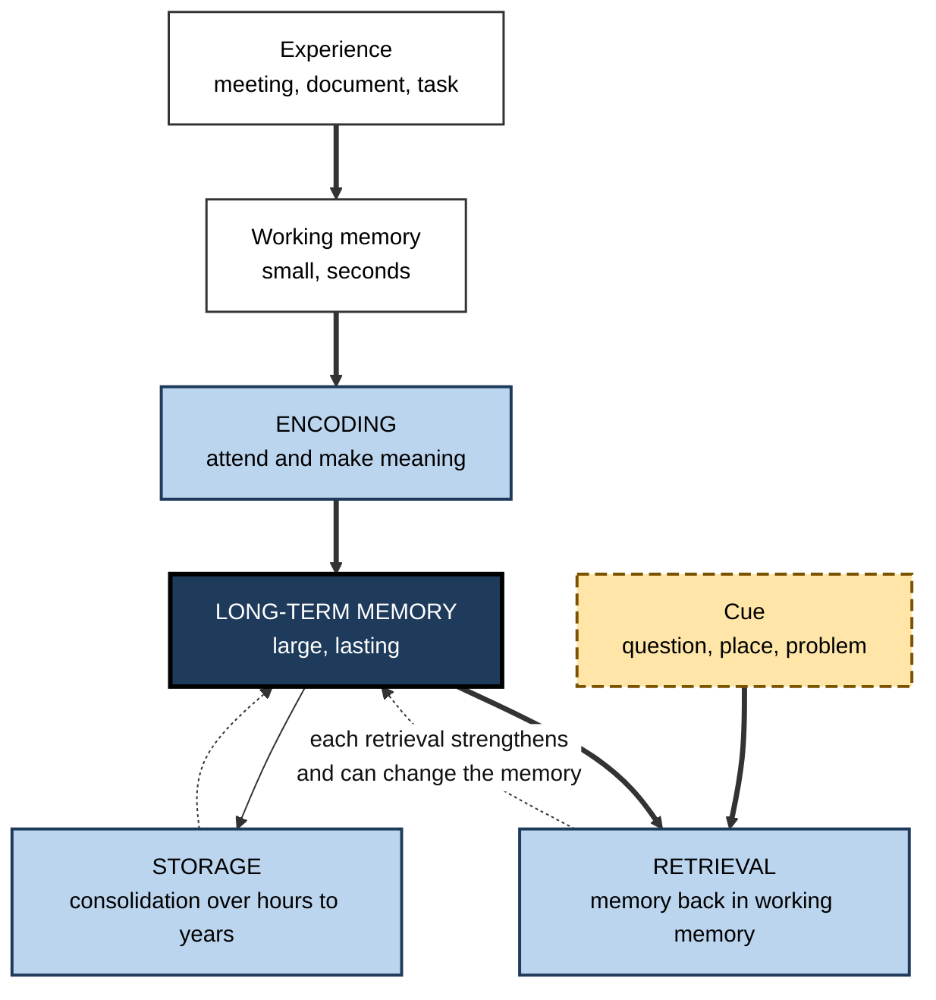
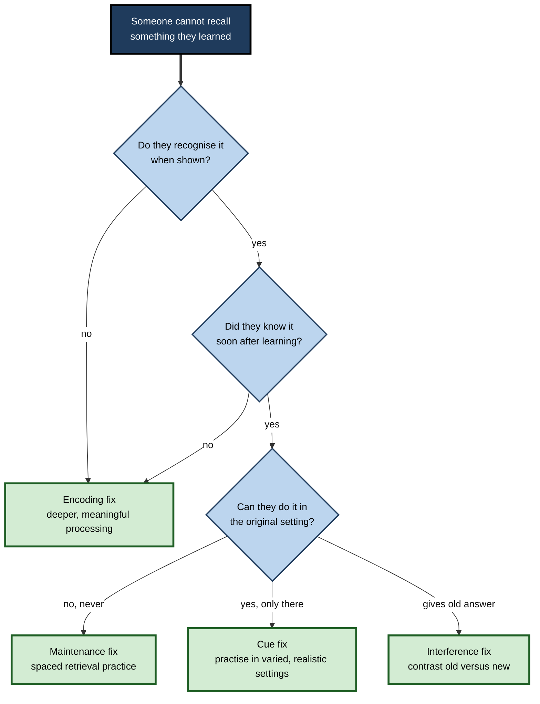

# F.1. Overview of Long-Term Memory

> **In one sentence:** Long-term memory is the brain's lasting store of everything you know and can do — facts, life events, skills and habits — kept for minutes to a lifetime and pulled back out when something reminds you of it.
>
> **Why it matters:** Every expert judgement, every fast decision and every skill you sell at work is drawn from long-term memory. Knowing how it is organised, why it fails and what makes it reliable is the foundation for learning faster and for designing training that sticks.
>
> **Level span:** Novice → Expert · **Reading time:** ~17 min · **Builds on:** the idea that learning is a lasting change caused by experience

---

## The Learning Ladder

| Level | Badge | After this level you can... |
|---|---|---|
| 1 | NOVICE | Explain what long-term memory is and how it differs from holding something "in mind" for a few seconds. |
| 2 | FOUNDATIONS | Name the three memory processes (encoding, storage, retrieval) and the main types of long-term memory. |
| 3 | PRACTITIONER | Diagnose whether a "memory problem" at work is really an encoding, storage or retrieval problem, and pick a fix. |
| 4 | ADVANCED | Explain storage strength versus retrieval strength, the memory-systems debate, and what recent research says about capacity and forgetting. |
| 5 | EXPERT / PRO | Decide what knowledge must live in people's heads versus in tools, and design teams and training around that decision. |

---

## Level 1 · Novice — The Big Picture

Right now you are holding this sentence in mind just long enough to understand it. That brief, fragile holding space is **working memory**. Your name, the route to your office, how to type, what a spreadsheet is, the day you got your first job — those are not being held in mind. They are stored somewhere more permanent and come back when needed. That permanent store is **long-term memory**.

A good analogy is a very large, oddly organised library. Books (memories) go in through a small reading room (working memory). The library itself has no known capacity limit — it never says "full". The real challenge is not space but **finding** a book again. A book shelved carelessly, with no catalogue entry, may as well not exist. A book cross-referenced under many headings is easy to find.

You have already experienced this when:

- A name was "on the tip of your tongue". The memory was stored; you just could not retrieve it at that moment.
- A song from years ago brought back a whole summer you had not thought about in a decade. A cue unlocked a memory you did not know you still had.
- You could still ride a bike after years without one, but could not explain exactly how you balance. Some long-term memories are skills, not facts.

The key beginner idea: **long-term memory is less like a filing cabinet and more like a search engine with cues.** Getting things in matters, but the hard part — and the part you can train — is getting them back out.

---

## Level 2 · Foundations — Core Concepts

### Three processes

Memory researchers describe every memory as passing through three processes:

1. **Encoding** — turning an experience into a form the brain can store. What you pay attention to and how deeply you think about it decide what gets encoded.
2. **Storage** — keeping the encoded information over time. Storage is not passive: memories are stabilised and reorganised after learning, especially during sleep, a process called **consolidation**.
3. **Retrieval** — bringing stored information back into use. Retrieval is driven by **cues**: anything — a question, a smell, a place, a word — that overlaps with how the memory was encoded.

**Figure F.1-1 — Encoding, storage and retrieval.**

*How to read it:* thick arrows are the main path in and back out; dotted arrows show that storage and retrieval both reshape what is stored.

### The main types of long-term memory

The most widely taught map divides long-term memory into two families:

| Family | Also called | You can... | Types | Example |
|---|---|---|---|---|
| **Explicit** | Declarative | consciously report it ("I know that...") | **Episodic** (events), **semantic** (facts and concepts) | Remembering last week's client meeting; knowing what EBITDA means |
| **Implicit** | Nondeclarative | show it only through performance | **Procedural** (skills, habits), **priming**, **conditioning** | Touch-typing; reading a familiar logo faster; feeling uneasy at an alarm tone |

A further category, **prospective memory** — remembering to do things in the future — is not a separate store but a *use* of long-term memory, and it fails in its own characteristic ways.

### Key terms

| Term | Plain meaning |
|---|---|
| **Long-term memory** | The durable store of knowledge, experiences and skills, lasting minutes to a lifetime. |
| **Working memory** | The small, short-lived mental workspace where you hold and manipulate information right now. |
| **Encoding** | Getting information into memory in a usable form. |
| **Consolidation** | The stabilising and reorganising of memories after learning. |
| **Retrieval** | Accessing stored information when you need it. |
| **Retrieval cue** | Anything that helps bring a memory back. |
| **Forgetting** | Failing to retrieve something you once could — often temporary, sometimes lasting. |

---

## Level 3 · Practitioner — Putting It to Work

When someone says "I forgot", the useful question is: **which process failed?** Each failure has a different fix.

### The Encode–Store–Retrieve diagnostic

1. **Was it ever encoded?** If the person was multitasking, skimming, or never had to *use* the information, it may never have entered long-term memory in a usable form. Test: can they recognise it when shown it? If not even recognition works, suspect encoding.
2. **Was it stored and maintained?** Information encoded once and never used again fades in accessibility. Test: could they do it a day after learning but not a month later? Suspect lack of spaced re-use.
3. **Is the cue missing?** If they can do it in one setting (the training sandbox) but not another (production at 2 a.m.), the knowledge is stored but tied to the wrong cues. Suspect retrieval.
4. **Is something competing?** If they confidently give the *old* answer (last year's process, the previous API), suspect interference from similar memories.
5. **Pick the fix.** Encoding problems need deeper, meaningful processing. Maintenance problems need spaced retrieval. Cue problems need practice in realistic, varied conditions. Interference problems need explicit contrast between old and new.

**Figure F.1-2 — Diagnosing a memory failure.**

*How to read it:* answer each question from the top; the thick-bordered box you land in is the most likely fix. Real cases often combine two causes.

### Worked example — a support analyst and the escalation policy

| | Before | After |
|---|---|---|
| **Situation** | New analysts read the 40-page escalation policy on day 2 and sign that they understood it. | Same policy, redesigned learning. |
| **Encoding** | Passive reading, no use. | Analysts classify ten real (anonymised) tickets against the policy and explain each choice. |
| **Maintenance** | None. | Three short scenario quizzes at days 3, 10 and 30. |
| **Cues** | Policy lives in a PDF nobody opens during live work. | A one-page decision tree pinned in the ticketing tool, using the same wording as the training. |
| **Result** | Mis-escalations stay high; "I forgot the rule" is the most common explanation. | Analysts recall the core rules unaided and use the tree for edge cases. |

### Common mistakes

- **Treating memory as recording.** Assuming that exposure (a slide, a reading, a video) equals storage.
- **Blaming storage for retrieval failures.** Most everyday forgetting is a cue or competition problem, not "it was erased".
- **Measuring too early.** End-of-session recall mostly measures working memory and recent activation.
- **One-and-done training.** Without later retrieval, accessibility declines steeply in the first days and weeks.

---

## Level 4 · Advanced — Mechanisms, Models & Evidence

### From the modal model to memory systems

The **multi-store (modal) model** of Atkinson and Shiffrin (1968) pictured information flowing from sensory memory to a short-term store and then, with rehearsal, into a long-term store. It remains a useful first map, but two lines of evidence reshaped it:

- **Levels of processing.** Craik and Lockhart (1972) showed that how *deeply* information is processed — for meaning rather than for sound or appearance — predicts later memory far better than how long it is rehearsed.
- **Dissociations in patients.** Henry Molaison (patient H.M.), studied by Brenda Milner and colleagues after surgery in 1953 removed much of both medial temporal lobes, could no longer form new conscious memories of facts or events, yet steadily improved at a mirror-drawing skill he did not remember practising. This and later cases suggested that long-term memory is not one store but several **memory systems** relying on partly different brain networks.

Larry Squire's influential taxonomy organises those systems as follows; the right-hand column is approximate and simplifies distributed networks.

| System | Content | Main brain contributors (simplified) |
|---|---|---|
| Episodic | Specific personal events | Hippocampus and medial temporal lobe, prefrontal and parietal cortex |
| Semantic | Facts, concepts, word meanings | Distributed cortex, with anterior temporal regions acting as a hub |
| Procedural | Motor and cognitive skills, habits | Basal ganglia, cerebellum, motor cortex |
| Priming | Faster processing of previously met stimuli | Sensory and association cortex |
| Classical conditioning | Learned associations between signals and responses | Amygdala (emotional), cerebellum (motor) |

### The processing view and its challenge

Not everyone accepts separate systems. **Processing accounts** argue that dissociations arise because different tests demand different kinds of processing — the principle of **transfer-appropriate processing** (Morris, Bransford and Franks, 1977): memory is best when the processing at test matches the processing at study. Some researchers also argue that a single memory system with different readouts can mimic apparent dissociations. In practice the fields have converged: memory systems are useful, partly overlapping divisions, and *how* you encode and retrieve matters as much as *which* system holds the memory.

### Capacity and duration

There is no demonstrated upper limit to long-term memory capacity. Duration can be extraordinary: Harry Bahrick's studies of people who learned Spanish at school found that, after an initial decline over the first few years, a substantial portion of vocabulary remained accessible for decades — what he called a **permastore**. Durability depended heavily on how well and how long the material was originally learned and spaced.

### Storage strength versus retrieval strength

Robert and Elizabeth Bjork's **new theory of disuse** (1992) separates two properties of every memory:

- **Storage strength** — how well-learned and interconnected the memory is. It only accumulates.
- **Retrieval strength** — how accessible it is right now. It rises with recent use and falls with disuse and competition.

Two counter-intuitive consequences have been widely supported. First, forgetting is mostly a loss of retrieval strength, not erasure — which is why relearning is faster than original learning (Ebbinghaus called this **savings**). Second, retrieving a memory when retrieval strength is *low* (effortful recall after a delay) builds more storage strength than retrieving it when it is easy. That is the mechanism behind the spacing and testing effects.

### Memory as reconstruction

Retrieval is not playback. Each recall rebuilds the memory from fragments, general knowledge and current context, and the rebuilt version can be stored back. This makes memory efficient and flexible, but also open to distortion — a theme developed in later notes on false memory and emotion.

### What recent research added

- **Extended memory taxonomies.** A 2025 review in a cognition journal argued that human memory should be mapped beyond the brain, including **external memory** held in other people (transactive memory) and in technology. This reframes a practical question: not "is it remembered?" but "where is it remembered, and how reliably can it be retrieved when needed?"
- **AI and offloading.** Studies from 2024–2026 on generative AI report a consistent pattern: offloading thinking to an assistant improves immediate output, but people often remember less of what they produced. An EEG study released in 2025 by an MIT group found weaker engagement and poorer recall of their own essays among participants who wrote with an AI chatbot. These studies are small and early, but they align with decades of evidence that effortful processing drives encoding.
- **Knowledge still matters.** Learning scientists writing in 2025 argued that the AI era raises, not lowers, the value of internal knowledge: you need stored knowledge to understand AI output, judge it, and notice its errors.

---

## Level 5 · Expert / Pro — Professional Mastery

### Deciding what must live in the head

The core expert decision in the AI era is allocation: which knowledge should be in people's long-term memory, and which can safely live in tools?

| Keep in long-term memory when... | Offload to tools when... |
|---|---|
| It is needed fast, under pressure, or without network access (incident response, live client conversations). | It is rarely needed and slow lookup is acceptable. |
| It is needed to **judge** information (spot a wrong number, a bad design, a hallucinated citation). | Accuracy matters more than speed and a trusted source exists. |
| It is the foundation that other learning builds on (core concepts of the domain). | It changes frequently (prices, version-specific syntax, org charts). |
| It enables pattern recognition — experts "see" situations because of stored patterns. | It is long, precise and arbitrary (configuration values, legal text). |

### Designing for memory at organisational scale

- **Map the knowledge.** For a role, list the knowledge and skills in four columns: fluent recall required, recognition sufficient, look-up fine, not needed. Train each column differently.
- **Build retrieval into the work.** Short, spaced, scenario-based checks embedded in the workflow beat long annual courses.
- **Design the cues.** Runbooks, checklists and naming conventions are deliberate retrieval cues. Use the same wording in training and in the tools people use on the job.
- **Measure delayed, unaided performance.** Track how well people perform weeks after training, not completion rates.
- **Treat organisational memory as a system.** Documentation, decision logs and experts' heads are all stores. When a senior person leaves, the organisation loses retrieval paths, not just facts.

### Professional scenario

**Role:** Head of enablement at a software company.
**Situation:** The sales team completed a product certification with a 92% pass rate, yet in recorded calls reps fumble basic technical questions.
**What the pro does:** Diagnoses a retrieval problem: the certification used multiple-choice recognition right after video modules, while calls demand free recall under social pressure. She replaces part of the certification with spaced, spoken "explain it to a customer" drills at weeks 1, 3 and 6, uses real objection phrases as cues, and adds a one-page battle card for rarely needed details. She tracks call-review scores on technical accuracy, not certification pass rates.

### Expert-level judgement

- **Forgetting is a feature.** Memory prioritises what has been useful recently and frequently. If people forget a process, it may be because they rarely need it — consider a job aid instead of more training.
- **Cue design is cheaper than more training.** Many "knowledge gaps" are solved by putting the right prompt at the moment of need.
- **Stored knowledge is the substrate of judgement.** You cannot meaningfully supervise an AI system in a domain you do not know.

---

## Myths vs. Evidence

| Myth | What the evidence shows |
|---|---|
| "Memory works like a video recorder." | Memory is reconstructive; each recall rebuilds the memory and can alter it. |
| "Your memory can get full." | There is no demonstrated capacity limit; the bottleneck is encoding and retrieval, not space. |
| "If I've forgotten it, it is gone." | Much forgetting is retrieval failure; relearning is usually faster (savings), showing traces remain. |
| "We only use 10% of our brains." | Brain imaging shows activity across the whole brain; the claim has no scientific basis. |
| "Repetition is the key to memory." | Meaningful processing and spaced retrieval matter far more than simple repetition. |
| "AI means memorising is obsolete." | Stored knowledge is needed to understand, evaluate and correct AI output. |

## Practitioner Toolkit

**Memory-failure diagnostic checklist**

- [ ] Could the person recognise the information when shown it? (If not: encoding.)
- [ ] Did they know it shortly after learning? (If not: encoding.)
- [ ] Has it been retrieved since, at spaced intervals? (If not: maintenance.)
- [ ] Do training conditions match the real cues of the job? (If not: retrieval cues.)
- [ ] Is there a similar older version competing? (If so: interference.)
- [ ] Would a job aid at the moment of need solve this more cheaply than training?

**Template — role knowledge allocation map**

| Knowledge item | Fluent recall | Recognition enough | Look-up fine | Training method |
|---|---|---|---|---|
| | | | | |

## Self-Check

1. **[NOVICE]** How does long-term memory differ from working memory?
2. **[NOVICE]** What does a tip-of-the-tongue experience show about memory?
3. **[FOUNDATIONS]** Name the three memory processes and describe each in one sentence.
4. **[FOUNDATIONS]** Give one workplace example each of episodic, semantic and procedural memory.
5. **[PRACTITIONER]** A new hire can complete a task in the training sandbox but not in production. Which process most likely failed, and what is the fix?
6. **[ADVANCED]** What is the difference between storage strength and retrieval strength?
7. **[ADVANCED]** What did the case of Henry Molaison suggest about long-term memory?
8. **[EXPERT / PRO]** How would you decide whether a piece of knowledge should be trained to fluency or provided as a job aid?

### Answer Key

1. Working memory holds a few items for seconds while you use them; long-term memory stores vast amounts for minutes to a lifetime.
2. A memory can be stored but temporarily inaccessible — retrieval, not storage, failed.
3. Encoding: getting information in. Storage: maintaining and consolidating it over time. Retrieval: bringing it back into use with the help of cues.
4. Examples: remembering what the client said in Tuesday's meeting (episodic); knowing what a service-level agreement is (semantic); typing a command or running a meeting without thinking (procedural).
5. Retrieval — knowledge is tied to sandbox cues. Practise in varied, realistic conditions and add job cues that match training.
6. Storage strength is how well-learned and connected a memory is and only grows; retrieval strength is how accessible it is now and rises and falls with use.
7. That long-term memory has separable systems: he lost the ability to form new conscious memories but could still learn motor skills.
8. Train to fluency if it is needed fast, under pressure, to judge information, or as a foundation; provide a job aid if it is rarely used, changes often, or is long and arbitrary.

## Key Takeaways

- Long-term memory stores facts, events and skills with **no known capacity limit**; the bottleneck is getting things in well and back out reliably.
- Every memory passes through **encoding, storage and retrieval** — and each can fail for different reasons with different fixes.
- Long-term memory has **explicit** (episodic, semantic) and **implicit** (procedural, priming, conditioning) forms.
- Forgetting is mostly a loss of **retrieval strength**, not erasure; effortful retrieval builds lasting **storage strength**.
- Memory is **reconstructive**, not a recording.
- In the AI era, experts decide deliberately **what must live in the head** — especially knowledge needed to judge and supervise tools.

## Glossary

| Term | Meaning |
|---|---|
| Consolidation | The post-learning process that stabilises and reorganises memories. |
| Declarative memory | Memory you can consciously state; another name for explicit memory. |
| Encoding | Transforming experience into a storable memory. |
| Levels of processing | The idea that deeper, meaning-based processing produces more durable memory. |
| Memory system | A partly separate brain network specialised for a type of memory. |
| Nondeclarative memory | Memory expressed through performance rather than conscious report. |
| Permastore | Very long-lasting retention of well-learned material over decades. |
| Retrieval cue | A stimulus that helps bring a memory to mind. |
| Retrieval strength | How accessible a memory is at a given moment. |
| Savings | Faster relearning of something apparently forgotten. |
| Storage strength | How well-learned and interconnected a memory is. |
| Transactive memory | A group's shared system for knowing who knows what. |
| Transfer-appropriate processing | Memory is best when test processing matches study processing. |
