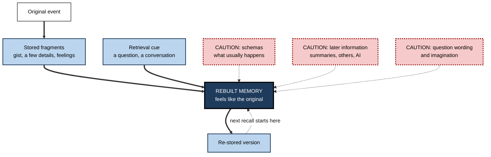
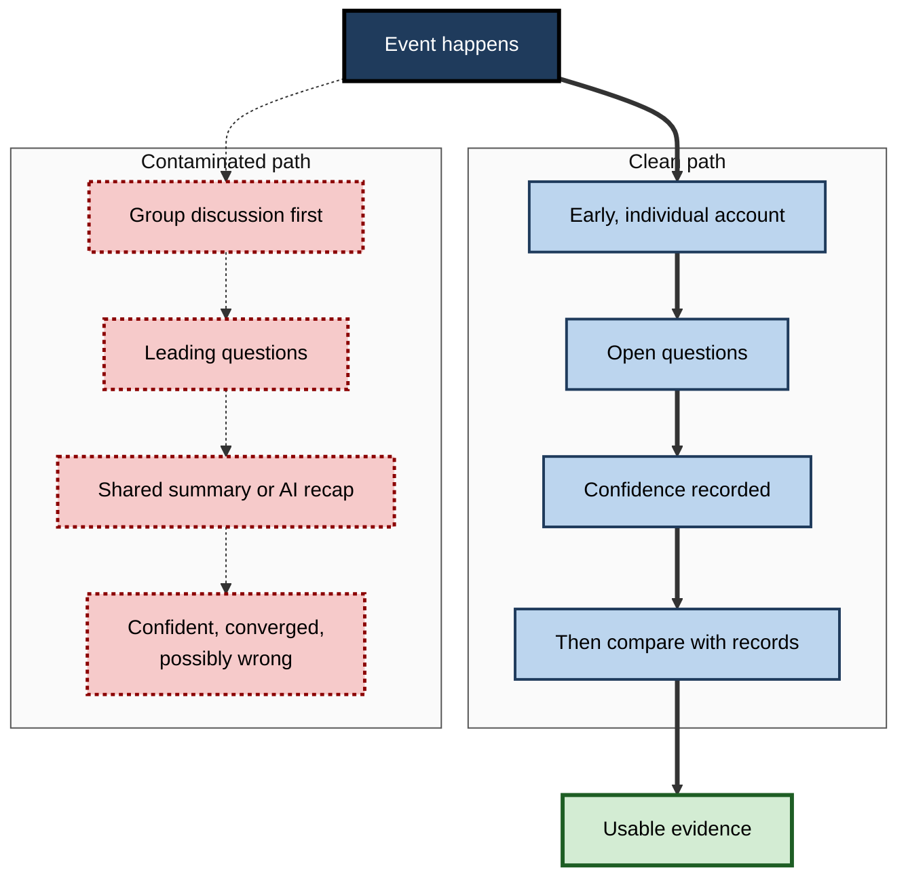

# F.10. False Memories and Reconstructive Memory

> **In one sentence:** Memory does not replay the past like a video; it rebuilds it each time from fragments, expectations and later information — so people can sincerely and confidently remember things that happened differently, or never happened at all.
>
> **Why it matters:** Decisions, investigations, customer research, performance reviews and legal disputes all lean on people's memories. Knowing how memories get distorted — and how questions, retelling and now AI tools can plant errors — protects you from building on false foundations.
>
> **Level span:** Novice → Expert · **Reading time:** ~17 min · **Builds on:** episodic memory and retrieval cues

---

## The Learning Ladder

| Level | Badge | After this level you can... |
|---|---|---|
| 1 | NOVICE | Explain why memory is reconstructive and give examples of honest misremembering. |
| 2 | FOUNDATIONS | Describe the misinformation effect, source confusion, schema-based distortion and memory conformity. |
| 3 | PRACTITIONER | Ask questions and keep records that minimise memory distortion at work. |
| 4 | ADVANCED | Explain the classic experiments, source-monitoring and fuzzy-trace theories, confidence–accuracy findings, and the recovered-memory debate. |
| 5 | EXPERT / PRO | Design investigation, research and decision processes that are robust to false memory, including AI-introduced distortion. |

---

## Level 1 · Novice — The Big Picture

Two colleagues leave the same meeting. One is sure the client "agreed to the timeline". The other is sure the client "said they'd think about it". Neither is lying. Each rebuilt the meeting from what they noticed, what they expected and what they hoped for.

**Reconstructive memory** means that remembering is an act of rebuilding, not playback. Your brain stores fragments — a few vivid details, the gist, how it felt — and fills the gaps with general knowledge and later information whenever you recall. Usually this works well enough. But it means that a memory can change, gain details or even be created from scratch, and still *feel* completely real. A **false memory** is a recollection of an event, or a detail, that did not happen the way it is remembered.

An analogy: remembering is like a palaeontologist rebuilding a dinosaur from a few bones. The skeleton is real; the shape of the animal is partly informed guesswork. If someone hands the palaeontologist a new "bone" from a different animal, it may be fitted in without anyone noticing.

You have already experienced reconstruction when:

- You were certain you had locked the door, and then found it unlocked.
- A family story about your childhood, retold many times, became something you "remember" — though you were too young to recall it.
- You remembered a quote from a film or a brand logo in a way that turned out to be wrong, along with millions of other people.

---

## Level 2 · Foundations — Core Concepts

### How distortions get in

| Source of distortion | What happens | Workplace example |
|---|---|---|
| **Schemas** (expectations) | Gaps filled with what usually happens | Remembering a "standard" contract clause that was not in this contract |
| **Misinformation** | Later information blends into the memory | A manager's summary email changes what attendees remember was said |
| **Leading questions** | The wording of a question shapes the answer and the memory | "How aggressive was the client?" versus "How did the client respond?" |
| **Source confusion** | You remember the content but misattribute where it came from | Remembering an idea as yours that a colleague proposed |
| **Imagination** | Vividly imagining an event makes it feel experienced | Rehearsing how a conversation "probably went" until it feels remembered |
| **Memory conformity** | Discussing with others aligns memories, including errors | Group debrief converges on the most confident person's version |
| **Retelling** | Each retelling reshapes the story for the audience | The incident story gets simpler and more heroic with every telling |

**Figure F.10-1 — How a memory gets rebuilt, and where errors enter.**

*How to read it:* the thick path is normal remembering; dotted-border boxes are the routes by which errors enter, and the dotted loop shows that each recall starts from the last rebuilt version, not the original.

### Key terms

| Term | Plain meaning |
|---|---|
| **Reconstructive memory** | Remembering by rebuilding from fragments, knowledge and context. |
| **False memory** | Remembering something that did not happen, or not as remembered. |
| **Misinformation effect** | Misleading information after an event distorting memory of it. |
| **Source monitoring** | Judging where a memory came from — experience, imagination, someone else. |
| **Memory conformity** | Memories becoming more similar after people discuss an event. |
| **Gist vs. verbatim memory** | Memory for general meaning versus exact details. |
| **Confabulation** | Producing false memories without intent to deceive, especially after some brain injuries. |

---

## Level 3 · Practitioner — Putting It to Work

### Rules for getting accurate memories from people

1. **Ask open questions first.** "Tell me what happened" before "Did the client object to the price?"
2. **Avoid loaded words.** Neutral verbs ("contacted", "responded") rather than loaded ones ("attacked", "agreed").
3. **Collect accounts separately.** Interview or ask for written accounts individually before any group discussion.
4. **Don't feed information.** Avoid sharing others' accounts, your hypothesis or documents before the person gives their own account.
5. **Separate memory from inference.** Ask "Did you see that, or are you concluding it?"
6. **Record confidence at first recall.** Confidence measured early is more informative than confidence after retelling.
7. **Capture early.** Memories are more accurate and less contaminated soon after the event.

**Figure F.10-2 — Clean versus contaminated recall.**

*How to read it:* the left (thick arrows) produces independent, usable accounts; the right (dotted arrows and borders) converges on a shared story that may be wrong.

### Worked example — a harassment complaint investigation

| | Before | After |
|---|---|---|
| **Process** | Manager gathers the team to "talk through what happened". | HR interviews each witness separately within days. |
| **Questions** | "Did you see him shout at her?" | "Tell me what you saw and heard in the meeting." |
| **Information sharing** | Witnesses read the complaint first. | Witnesses give accounts before seeing any documents. |
| **Records** | Notes summarised by the manager. | Verbatim notes; messages and calendar data collected. |
| **Outcome** | Accounts converge; credibility challenged later. | Independent accounts; inconsistencies investigated on evidence. |

### Common mistakes

- Treating confident, detailed testimony as necessarily accurate.
- Reading the summary before giving your own account.
- Letting the most senior person speak first in a debrief.
- Assuming that inconsistencies mean someone is lying — honest memories are often inconsistent.

---

## Level 4 · Advanced — Mechanisms, Models & Evidence

### The classic experiments

- **Bartlett (1932).** British participants retold a Native American folk tale, "The War of the Ghosts". Over retellings it became shorter, more conventional and reshaped to fit their cultural expectations — the founding evidence for schema-driven reconstruction.
- **Loftus and Palmer (1974).** After watching a car crash film, people asked how fast the cars were going when they "smashed into" each other gave higher speed estimates than those asked about cars that "hit" each other — and a week later were more likely to report seeing broken glass that was not there.
- **The misinformation paradigm.** Elizabeth Loftus and many others showed that misleading post-event information is often incorporated into memory. This is among the most replicated findings in cognitive psychology.
- **The DRM paradigm (Roediger and McDermott, 1995).** After hearing words like *bed, rest, tired, dream, pillow*, many people confidently "remember" hearing *sleep*, which was never presented.
- **Rich false memories.** In the "lost in the mall" study (Loftus and Pickrell, 1995), about a quarter of adults came to remember, at least partially, a childhood event that never happened after suggestive interviews. Later studies produced false memories of other events. Rates vary widely by method; a widely publicised 2015 study reporting very high rates of false memories of committing a crime was reanalysed with stricter coding, which suggested a substantially lower rate. The existence of rich false memories is well established; their prevalence is debated.
- **Imagination inflation.** Imagining a childhood event increases confidence that it happened.
- **Memory conformity.** After discussing an event with a co-witness who saw it differently, people often adopt details from the other's account.

### Why it happens: two theories

- **Source-monitoring framework** (Marcia Johnson and colleagues, 1993). Memories do not come labelled with their source. We infer the source from features such as sensory detail and context. When an imagined or suggested event is vivid, or when we are rushed, we misattribute it to experience.
- **Fuzzy-trace theory** (Charles Brainerd and Valerie Reyna). We store **verbatim** traces (exact details) and **gist** traces (meaning) in parallel. Verbatim traces fade faster. As they fade, gist-consistent but false details — like *sleep* in the DRM list — feel familiar and get endorsed.

Reconstruction is the price of a flexible memory system that supports generalisation and imagination. The biological question of whether recalled memories become temporarily modifiable before being re-stored (**reconsolidation**) is covered in the note on memory formation; human reconsolidation findings are mixed.

### Confidence and accuracy

The relationship is subtle. John Wixted and Gary Wells (2017) concluded that for eyewitness identifications, **initial confidence** expressed at the first, fair, uncontaminated test is quite informative: high-confidence initial identifications are relatively accurate, and low-confidence ones are not. But confidence **inflates** with feedback, repetition and retelling, so confidence expressed later — for example, in court — is weakly related to accuracy. Eyewitness misidentification features in a large majority of wrongful convictions later overturned by DNA evidence in the United States.

### Collective false memories

The so-called **Mandela effect** — many people sharing the same false memory, such as a brand logo or film quote — has been studied as a **visual Mandela effect**: research in 2022 found that specific images are consistently misremembered by many people in the same way, likely driven by schemas and the image features themselves rather than by misinformation alone.

### The recovered-memory debate

In the 1990s, the "memory wars" pitted claims that traumatic memories are commonly repressed and later recovered in therapy against experimental evidence that suggestive techniques can create false memories of abuse. The scientific consensus among memory researchers is that people can forget and later remember real events, but that **memories "recovered" through suggestive techniques** — hypnosis, guided imagery, repeated suggestive questioning — are unreliable. Surveys continue to find widespread belief in repression among the public and some clinicians. The topic requires care: real abuse is common, and doubting a technique is not doubting a person.

### AI as a new source of misinformation

Two studies from an MIT group show how conversational AI can distort memory:

- In a 2024 simulated witness-interview study, a generative chatbot asking suggestive questions induced **over three times as many immediate false memories** as a control condition and about 1.7 times as many as a traditional suggestive survey. Participants also held these false memories with high confidence.
- In a 2025 study, chatbot conversations that subtly injected false information about previously read material produced **about three times as many false memories** as controls, and also lowered confidence in true memories.

The mechanism is ordinary misinformation, delivered by a fluent, personalised and trusted source at scale. AI meeting summaries, recaps and "what we agreed" notes are also post-event information: when wrong, they can overwrite participants' memories.

---

## Level 5 · Expert / Pro — Professional Mastery

### Designing memory-robust processes

| Domain | Risk | Professional practice |
|---|---|---|
| **Investigations (HR, compliance, safety)** | Contaminated witness accounts | Separate early interviews, open questions, verbatim records, no sharing of evidence first |
| **Incident reviews** | Converged, simplified stories | Individual timelines before group review, anchored to logs |
| **User and customer research** | Reconstructed opinions about "usual" behavior | Ask about specific recent episodes; observe behavior; avoid leading prompts |
| **Decision-making** | Hindsight and outcome bias rewrite reasoning | Decision journals written at the time |
| **Meetings** | Summary overwrites memory | Read back decisions live; participants correct AI or manager summaries promptly |
| **Hiring** | Interviewers' impressions reconstructed later | Score against criteria immediately after each interview, before discussion |

### Handling AI summaries and records

- Treat AI-generated recaps as **drafts** that participants verify, not as the record.
- Keep primary sources (recordings, logs, chat history) where policy allows, so disputes can be checked.
- Train people to notice when an AI recap "feels right" because it is fluent rather than because it matches what they remember.
- Do not use AI to interview witnesses or complainants in sensitive matters without strict, non-suggestive design and human oversight.

### Professional scenario

**Role:** Customer research lead at a SaaS company.
**Situation:** Survey respondents say they "always" use the reporting feature weekly; usage logs show most open it a few times per quarter.
**What the pro does:** Recognises reconstructive memory and schema-driven self-report — people describe their ideal or typical routine, not their actual behavior. She switches interviews to the "last time" technique ("Tell me about the last time you needed a report — what triggered it, what did you do?"), combines interviews with usage data, and asks product managers to stop treating "always/never" survey answers as behavioral data. Product decisions shift toward the real trigger: monthly board preparation.

### Ethics

Professionals who can shape others' memories — investigators, interviewers, managers, designers of AI systems — have a responsibility not to do so. Suggestive questioning, repeated retelling of a preferred version, or AI tools that confidently fill gaps can harm people's reputations, careers and legal rights.

---

## Myths vs. Evidence

| Myth | What the evidence shows |
|---|---|
| "Memory works like a video recording." | Memory is rebuilt at each recall from fragments, knowledge and later information. |
| "A confident, detailed memory must be accurate." | Confidence and detail can grow with retelling; only initial confidence under clean conditions is fairly informative. |
| "False memories happen only to gullible people." | Everyone is susceptible, including people with exceptional autobiographical memory. |
| "Inconsistent testimony means someone is lying." | Honest memories are often inconsistent; lying is a separate question. |
| "Hypnosis can recover hidden memories accurately." | Hypnosis increases confidence and suggestibility, not accuracy. |
| "AI summaries are neutral records." | AI recaps act as post-event information and, when wrong, can create false memories. |

## Practitioner Toolkit

**Memory-safe interviewing checklist**

- [ ] Interview individually and early.
- [ ] Begin with "Tell me everything you remember."
- [ ] Use neutral wording; avoid assumptions in questions.
- [ ] Do not share other accounts, evidence or hypotheses beforehand.
- [ ] Ask "Did you see that, or infer it?" for key points.
- [ ] Record initial confidence.
- [ ] Keep verbatim notes or recordings.
- [ ] Compare accounts with objective records afterwards.

**Template — memory versus record log**

| Claim | Who remembers it | Confidence at first recall | Source: seen, heard, inferred, told | Corroborating record |
|---|---|---|---|---|
| | | | | |

## Self-Check

1. **[NOVICE]** What does it mean that memory is reconstructive?
2. **[FOUNDATIONS]** Name four ways distortions enter memory.
3. **[FOUNDATIONS]** What is source confusion? Give a workplace example.
4. **[PRACTITIONER]** Rewrite "Did the vendor threaten to cancel?" as a neutral question.
5. **[ADVANCED]** What did Loftus and Palmer (1974) show?
6. **[ADVANCED]** Explain the DRM effect with fuzzy-trace theory.
7. **[ADVANCED]** When is eyewitness confidence informative, and when is it not?
8. **[EXPERT / PRO]** What did 2024–2025 studies find about AI chatbots and false memory, and what follows for workplace use?

### Answer Key

1. Remembering rebuilds the event from stored fragments, knowledge and current context; the result can differ from the original while feeling real.
2. Any four of: schemas, misinformation, leading questions, source confusion, imagination, memory conformity, retelling.
3. Remembering content but misattributing its source — for example, believing an idea was yours when a colleague suggested it.
4. "How did the vendor respond to the proposal?"
5. Question wording ("smashed" versus "hit") changed speed estimates and increased false reports of broken glass a week later.
6. Gist traces (the theme "sleep") persist while verbatim traces fade, so a gist-consistent but unpresented word feels familiar and is falsely remembered.
7. Initial confidence at a fair, uncontaminated first test is fairly informative; later confidence, inflated by feedback and retelling, is not.
8. Suggestive or misinforming chatbots roughly tripled false memories compared with controls; AI recaps and interviews should be treated as potential misinformation, verified by participants and checked against primary records.

## Key Takeaways

- Memory is **reconstructed at each recall**, from fragments, expectations and later information.
- **Misinformation, leading questions, source confusion, imagination and group discussion** reliably create distortions.
- **Confidence is not proof**; only initial confidence under clean conditions is fairly informative.
- Rich false memories of entire events can be created; their **prevalence is debated**, their existence is not.
- **AI chatbots and summaries** can act as powerful misinformation sources.
- Protect important memories with **early, individual, open-question capture and objective records**.

## Glossary

| Term | Meaning |
|---|---|
| Confabulation | Honest production of false memories, often after brain injury. |
| DRM paradigm | A word-list task that reliably produces false recall of an unpresented related word. |
| Fuzzy-trace theory | The view that verbatim and gist traces are stored in parallel and fade at different rates. |
| Imagination inflation | Increased belief that an event happened after imagining it. |
| Leading question | A question whose wording suggests an answer. |
| Mandela effect | A shared false memory held by many people. |
| Memory conformity | Convergence of memories after discussion. |
| Misinformation effect | Distortion of memory by misleading post-event information. |
| Reconstructive memory | Remembering as rebuilding rather than replaying. |
| Recovered memory | A memory reported as returning after a long period of being inaccessible; reliability depends heavily on how it was recovered. |
| Schema | Organised knowledge about what typically happens. |
| Source monitoring | Judging the origin of a memory. |
| Verbatim trace | Memory for exact surface details. |
