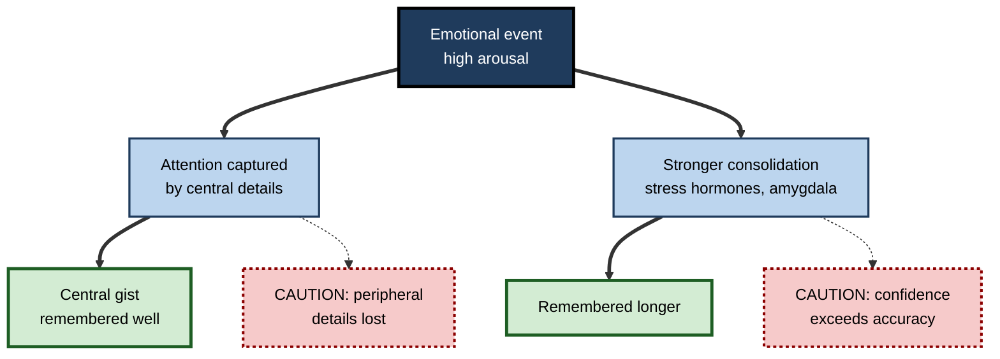
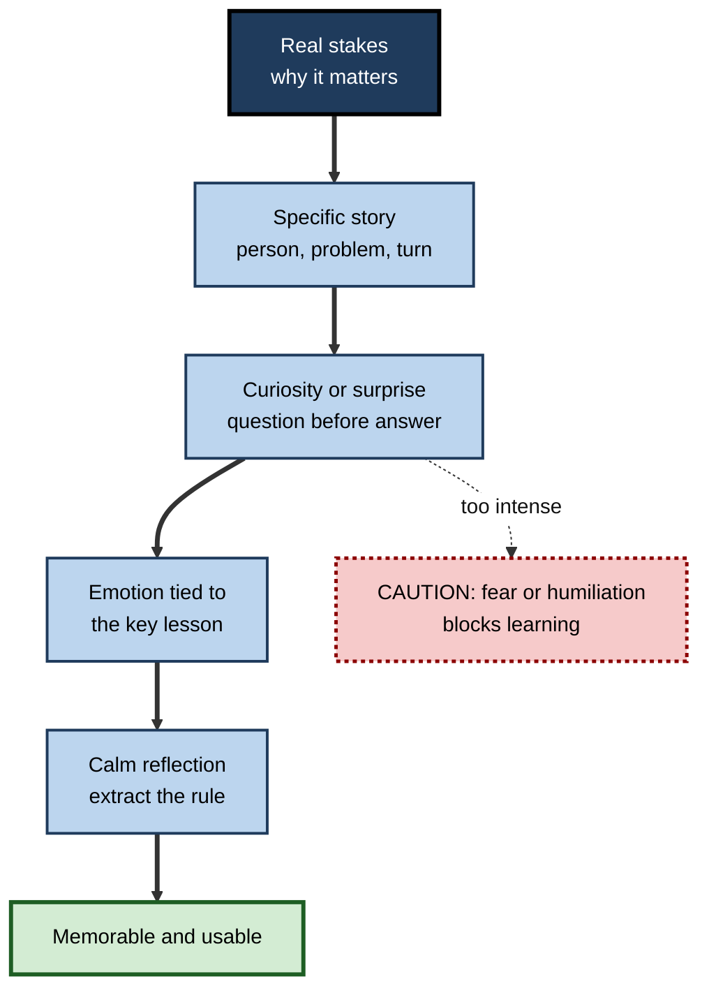
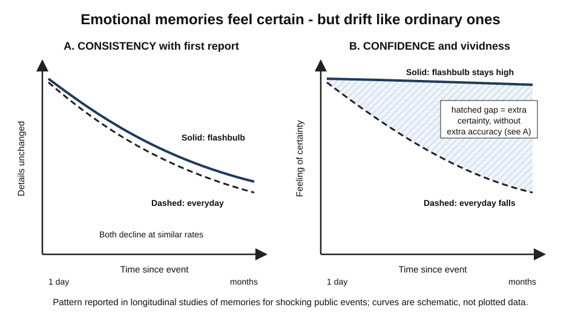

# F.11. Emotional Influence on Long-Term Memory

> **In one sentence:** Emotionally charged experiences tend to be remembered more strongly and vividly than neutral ones — but emotion also narrows what we notice, inflates our confidence, and can either help or harm learning depending on how intense it is and when it happens.
>
> **Why it matters:** Stories, stakes and surprise make training and communication memorable; fear, stress and threat make people forget, freeze or misremember. Professionals who understand emotional memory can design learning that sticks, run high-pressure work more safely, and avoid trusting vivid memories too much.
>
> **Level span:** Novice → Expert · **Reading time:** ~17 min · **Builds on:** encoding, consolidation and reconstructive memory

---

## The Learning Ladder

| Level | Badge | After this level you can... |
|---|---|---|
| 1 | NOVICE | Explain why emotional events are remembered better and give examples. |
| 2 | FOUNDATIONS | Distinguish arousal from valence, and describe emotional enhancement, attentional narrowing and mood effects. |
| 3 | PRACTITIONER | Use emotion responsibly to make learning memorable, and reduce stress-related forgetting at work. |
| 4 | ADVANCED | Explain the amygdala–hippocampus mechanism, stress timing effects, flashbulb memories, and what is contested. |
| 5 | EXPERT / PRO | Design high-stakes training, communications and cultures that use emotion ethically and protect memory under pressure. |

---

## Level 1 · Novice — The Big Picture

Think back over the last few years at work. What comes to mind first? Probably not an ordinary Tuesday. More likely: your first day, a big win, an embarrassing mistake, a tense meeting, a team celebration. **Emotional events stick.** This is called the **emotional enhancement of memory**.

An analogy: your brain has a highlighter pen that it applies automatically. When something matters — it is exciting, frightening, surprising, or important to your goals — the brain highlights it, and highlighted pages are easier to find later. But the highlighter has quirks. It highlights the *central* thing (the angry face, the error message) and leaves the edges faint. And it makes the page feel more certain than it really is.

You have already experienced this when:

- You remember exactly where you were when you heard shocking news, but not what you did the day before.
- In a frightening moment, you remember the threat in detail but not the people or room around it.
- You blanked on something you knew well during a stressful presentation, then remembered it ten minutes later.

---

## Level 2 · Foundations — Core Concepts

### Two dimensions of emotion

Researchers describe emotional experiences along two main dimensions:

| Dimension | Meaning | Examples |
|---|---|---|
| **Arousal** | How activating or intense it is | Calm (low) to excited or alarmed (high) |
| **Valence** | How pleasant or unpleasant it is | Negative (a failure) to positive (a promotion) |

**Arousal** is the main driver of the memory boost: both very positive and very negative high-arousal events tend to be remembered well. Valence matters too: some evidence suggests negative events preserve more accurate detail, while positive ones are remembered with more gist and sometimes more overconfidence.

### Four effects to know

1. **Emotional enhancement.** Emotional events are more likely to be remembered, especially after a delay.
2. **Attentional narrowing.** High arousal focuses attention on central, emotionally important details at the expense of peripheral ones — the **weapon focus** effect is the classic example in eyewitness research.
3. **Confidence inflation.** Emotional memories feel vivid and certain, even when details have changed.
4. **Mood congruence.** Your current mood makes memories of the same tone easier to retrieve.

**Figure F.11-1 — What emotion does to a memory.**

*How to read it:* thick arrows are benefits of emotional encoding; dotted arrows lead to the costs in dotted-border boxes.

### Key terms

| Term | Plain meaning |
|---|---|
| **Emotional enhancement of memory** | Better long-term memory for emotional than neutral events. |
| **Arousal** | The intensity or activation level of an emotional state. |
| **Valence** | Whether an emotion is pleasant or unpleasant. |
| **Amygdala** | A brain structure that detects emotional significance and modulates memory. |
| **Attentional narrowing** | High arousal focusing attention on central details. |
| **Flashbulb memory** | A vivid, confident memory of the circumstances in which you heard shocking news. |
| **Mood-congruent recall** | Easier recall of memories matching your current mood. |

---

## Level 3 · Practitioner — Putting It to Work

### Using emotion to make learning memorable — responsibly

1. **Start with stakes.** Explain why it matters, with a real consequence: the customer who lost data, the near-miss in the plant.
2. **Use stories, not just rules.** A specific story with a person, a problem and a turning point engages emotion and gives memory a structure.
3. **Create curiosity and surprise.** Pose a question or a counter-intuitive result before giving the answer. Surprise signals "this matters".
4. **Keep the emotion attached to the key point.** Emotion enhances the central element. Make sure the central element is the lesson, not a dramatic but irrelevant detail.
5. **Keep arousal moderate for complex learning.** Excitement and challenge help; fear and humiliation consume working memory and make people avoid the topic.
6. **Close safely.** After emotional content, give a calm moment to reflect and extract the lesson.

### Reducing stress-related forgetting

- **Practise under mild pressure.** Rehearse presentations, incident drills and negotiations with realistic stakes so the real thing feels familiar.
- **Use external aids.** Checklists and runbooks compensate for stress-impaired retrieval.
- **Pause before retrieving.** A few slow breaths before answering a hard question can reduce the immediate stress response.
- **Write it down soon.** After a tense event, capture the facts before emotion and retelling reshape them.

**Figure F.11-2 — Designing emotional engagement for learning.**

*How to read it:* the thick path builds moderate, purposeful emotion; the dotted arrow shows what happens when intensity tips into threat.

### Worked example — security awareness training

| | Before | After |
|---|---|---|
| **Format** | Annual 30-minute video of rules and statistics. | Ten-minute session opening with a real (anonymised) story of a colleague who clicked a convincing invoice email. |
| **Emotion** | Boredom; or fear-based messages ("you will be fired"). | Surprise at how convincing the email was; empathy; moderate concern. |
| **Lesson link** | Rules listed at the end. | The story's turning point *is* the lesson: "the sender's domain differed by one letter". |
| **Follow-up** | None. | Short, spaced simulated phishing exercises with immediate, non-shaming feedback. |
| **Result** | Rules forgotten within weeks. | People remember the story and the cue months later. |

### Common mistakes

- **Shock without substance.** Dramatic content that people remember while forgetting the lesson.
- **Fear-based learning cultures.** Mistakes punished harshly make people hide errors and avoid practice.
- **Trusting vividness in disputes.** Treating the most vivid account of a heated meeting as the accurate one.
- **Testing under threat.** Assessments with humiliation risk measure stress tolerance more than knowledge.

---

## Level 4 · Advanced — Mechanisms, Models & Evidence

### The amygdala–hippocampus mechanism

James McGaugh's **modulation hypothesis** is the best-supported account. Emotional arousal triggers release of stress hormones (adrenaline, cortisol) and noradrenaline in the brain. The **amygdala**, acting on noradrenaline, enhances consolidation in the hippocampus and cortex — tagging the event as important so it is stabilised more strongly in the hours after learning. Key evidence:

- Larry Cahill and colleagues (1994) found that the beta-blocker propranolol, which blocks some noradrenaline effects, removed the memory advantage for the emotional part of a story without affecting neutral memory.
- People with selective amygdala damage show reduced emotional enhancement.
- Giving stress hormones shortly after learning can enhance later memory in animals and humans.

### Timing is everything with stress

A large meta-analysis by Grant Shields and colleagues (2017) clarified a confusing literature. In summary:

| When stress occurs | Typical effect on memory |
|---|---|
| **Before or during learning, closely tied to the material** | Can enhance memory for that material |
| **Before learning, but unrelated or separated in time** | Tends to impair encoding |
| **Right after learning (consolidation)** | Tends to enhance memory |
| **Before or during retrieval** | Tends to impair retrieval |

This explains why stress can make a crisis unforgettable yet make you blank in an exam or presentation. The retrieval impairment is one of the most consistent findings and is directly relevant to performance under pressure.

### The inverted U — use with care

The **Yerkes–Dodson law** is often drawn as an inverted U: moderate arousal is best, too little or too much is worse. The original 1908 study involved mice learning discrimination tasks with electric shocks, and the neat curve is a later simplification. The broad idea — that complex tasks suffer at high arousal — is consistent with the evidence, but the curve should not be treated as a precise law.

### Flashbulb memories

Roger Brown and James Kulik (1977) coined **flashbulb memory** for vivid memories of the circumstances in which people learned of shocking public events. They proposed a special mechanism. Longitudinal studies have since shown otherwise:

*Figure F.11-3 — Flashbulb memories: confidence stays high while consistency falls.* Left: consistency of reported details with the first report declines over time for both flashbulb (solid) and everyday (dashed) memories. Right: confidence and vividness stay high for flashbulb memories but fall for everyday memories. The hatched area shows certainty not matched by extra accuracy. Schematic of a well-replicated pattern.

- Ulric Neisser and Nicole Harsch tracked memories of the 1986 Challenger disaster and found many people's later accounts differed substantially from what they had written the day after, while they remained highly confident.
- Jennifer Talarico and David Rubin (2003) compared memories of the September 11 attacks with everyday memories from the same days. Consistency declined similarly for both; only **confidence and vividness** stayed high for the flashbulb memories.
- A 2024 review of longitudinal flashbulb studies concluded that the distinctive feature of flashbulb memories is their **confidence and vividness**, not their accuracy, while noting that methods vary widely across studies.

### Other robust and contested effects

- **Fading affect bias** — the unpleasant emotion attached to negative memories tends to fade faster than the pleasant emotion of positive memories. Well replicated across cultures, weaker in people with depression.
- **Positivity effect in ageing** — older adults tend to attend to and remember relatively more positive information, consistent with Laura Carstensen's socioemotional selectivity theory.
- **Mood-congruent memory in depression** — negative memories become more accessible and autobiographical memories become more general, which can maintain low mood.
- **Selective sleep consolidation of emotional memories** — early studies suggested sleep preferentially strengthens emotional memories; later meta-analyses found this preference weaker and less consistent than first thought. Treat it as **contested**.
- **Intrusive memories after trauma** — research led by Emily Holmes on brief interventions, such as playing a visuospatial game after reminders of trauma, to reduce intrusive memories has shown promising early results in small trials; it is an active research area, not established treatment.

---

## Level 5 · Expert / Pro — Professional Mastery

### Designing for emotion at organisational scale

| Context | Use emotion to... | Guard against... |
|---|---|---|
| **Onboarding** | Connect new joiners to the mission and real customer stories | Overwhelming anxiety; information dumps on day one |
| **Safety and compliance** | Make consequences concrete with real cases | Fear campaigns that cause hiding of incidents |
| **Change communication** | Explain the human reasons for change | Threat framing that triggers resistance and impaired thinking |
| **Leadership development** | Use challenging simulations with real stakes | Humiliation in front of peers |
| **Incident response** | Rehearse under realistic pressure so retrieval holds up | Blame cultures that make people freeze or hide errors |

### Psychological safety and memory

Amy Edmondson's research on **psychological safety** — a shared belief that it is safe to take interpersonal risks — shows that teams learn more when people can admit mistakes. The memory science adds a mechanism: threat raises stress, which impairs retrieval and complex thinking in the moment, and encourages avoidance of the very situations where learning happens. Fear-based environments reduce both reporting and learning.

### High-pressure performance

Professionals who must perform under pressure — surgeons, pilots, incident commanders, trial lawyers, executives in crisis — share three habits that align with the stress-memory evidence: they **rehearse under realistic pressure**, they **externalise critical steps** in checklists, and they **use brief routines** to regulate arousal before retrieval-heavy moments.

### Marketing, persuasion and ethics

Emotional content is used to make messages memorable — in marketing, politics and internal communication. The same mechanisms can make misleading messages stick. Professionals should ask whether emotion is being used to make a *true and important* point memorable, or to bypass judgement.

### Professional scenario

**Role:** Head of clinical education at a hospital.
**Situation:** Junior doctors perform well in calm simulation tests but freeze or forget steps during real cardiac arrests.
**What the pro does:** Recognises stress-impaired retrieval and context mismatch. She introduces unannounced in-situ simulations on the wards with realistic alarms and time pressure, followed by structured, non-blaming debriefs. Algorithm cards are placed on every resuscitation trolley. Before each simulation, teams use a ten-second pause to state roles. Over the following months, observed adherence to the protocol in real events improves, and juniors report feeling "less flooded".

---

## Myths vs. Evidence

| Myth | What the evidence shows |
|---|---|
| "Flashbulb memories are photographically accurate." | They drift like ordinary memories; what stays high is confidence and vividness. |
| "Fear is a great motivator for learning." | Moderate challenge helps; fear and threat impair complex learning and retrieval, and encourage avoidance. |
| "Stress always ruins memory." | Effects depend on timing: stress can enhance encoding of related material and consolidation, but impairs retrieval. |
| "Emotional memories are remembered better in every detail." | Central details are enhanced; peripheral details are often lost. |
| "Yerkes–Dodson is a precise law of performance." | The inverted U is a simplification of a 1908 animal study; the broad idea holds, the precise curve does not. |
| "Sleep always selectively strengthens emotional memories." | Meta-analyses find this effect weaker and less consistent than early studies suggested. |

## Practitioner Toolkit

**Emotion-in-learning design checklist**

- [ ] The session opens with real, specific stakes.
- [ ] A concrete story carries the key lesson.
- [ ] The emotional peak is tied to the central point, not a distraction.
- [ ] Arousal is moderate — challenge, not threat.
- [ ] A calm reflection step extracts the rule.
- [ ] Mistakes during practice are treated as information, not failure.

**Before a high-pressure moment**

1. Have the critical steps written down within reach.
2. Rehearse once under realistic conditions in advance.
3. Take two slow breaths before key retrieval moments.
4. Afterwards, write the facts down before discussing them.

## Self-Check

1. **[NOVICE]** Why do we remember emotional events better than ordinary ones?
2. **[FOUNDATIONS]** What is the difference between arousal and valence, and which drives the memory boost more?
3. **[FOUNDATIONS]** What is attentional narrowing? Give an example.
4. **[PRACTITIONER]** How would you use emotion in a safety briefing without relying on fear?
5. **[ADVANCED]** Describe the role of the amygdala and noradrenaline in emotional memory, with one piece of evidence.
6. **[ADVANCED]** How does the timing of stress change its effect on memory?
7. **[ADVANCED]** What have longitudinal studies shown about flashbulb memories?
8. **[EXPERT / PRO]** Why might a fear-based team culture reduce learning, in memory terms?

### Answer Key

1. Arousal triggers hormones and amygdala activity that strengthen attention and consolidation for the event.
2. Arousal is intensity; valence is pleasantness. Arousal is the main driver of the enhancement.
3. High arousal focusing attention on central, emotionally significant details; for example, remembering a weapon but not the face of the person holding it.
4. Use a specific real story with a clear turning point that carries the lesson, moderate concern and curiosity, then calm reflection and practice.
5. Arousal releases noradrenaline; the amygdala uses it to enhance hippocampal consolidation. Propranolol removed the memory advantage for emotional story content (Cahill and colleagues, 1994).
6. Stress tied to the material during learning or right after can enhance memory; unrelated stress before learning impairs encoding; stress before or during retrieval impairs retrieval.
7. Their details become inconsistent over time at similar rates to everyday memories, but confidence and vividness stay high.
8. Threat raises stress, which impairs retrieval and complex thinking, and encourages hiding mistakes and avoiding practice — reducing the experiences and reflection that learning needs.

## Key Takeaways

- **Arousal** strengthens memory through **amygdala-driven consolidation**.
- Emotion boosts **central details** and **confidence**, not overall accuracy.
- **Flashbulb memories** feel photographic but drift like ordinary memories.
- **Stress timing matters**: it can help consolidation but **impairs retrieval** — the reason people blank under pressure.
- Use **stories, stakes and surprise** to make learning stick; avoid **fear and humiliation**.
- Protect performance under pressure with **realistic rehearsal, checklists and arousal routines**.

## Glossary

| Term | Meaning |
|---|---|
| Amygdala | A brain structure that detects emotional significance and modulates memory consolidation. |
| Arousal | The intensity of an emotional state. |
| Attentional narrowing | Focusing on central details under high arousal. |
| Emotional enhancement of memory | Better long-term memory for emotional events. |
| Fading affect bias | Faster fading of negative than positive emotion attached to memories. |
| Flashbulb memory | A vivid, confident memory of learning about a shocking event. |
| Modulation hypothesis | The view that the amygdala strengthens consolidation of arousing events. |
| Mood-congruent recall | Easier recall of memories that match current mood. |
| Noradrenaline | A neurotransmitter involved in arousal and memory modulation. |
| Positivity effect | Older adults' relative preference for positive information. |
| Psychological safety | A shared belief that a team is safe for interpersonal risk-taking. |
| Valence | Whether an emotion is pleasant or unpleasant. |
| Weapon focus | Attention drawn to a weapon at the expense of other details. |
| Yerkes–Dodson law | The idea that performance is best at moderate arousal, especially for complex tasks. |
