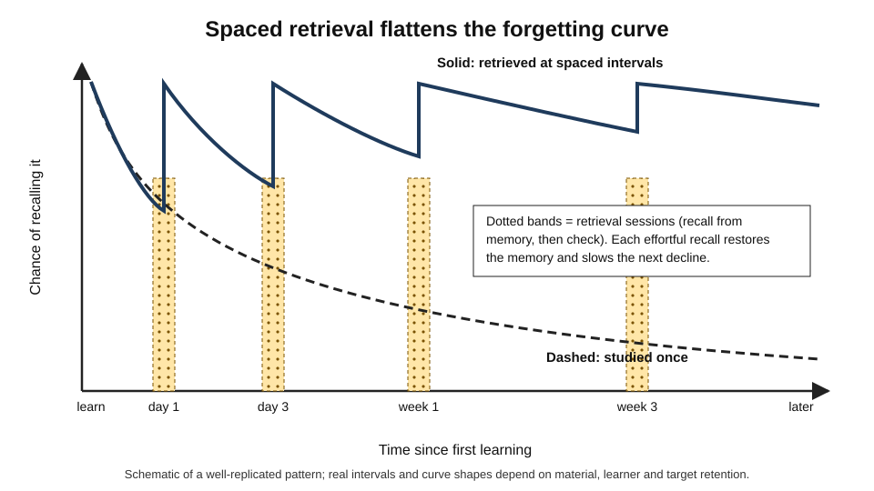
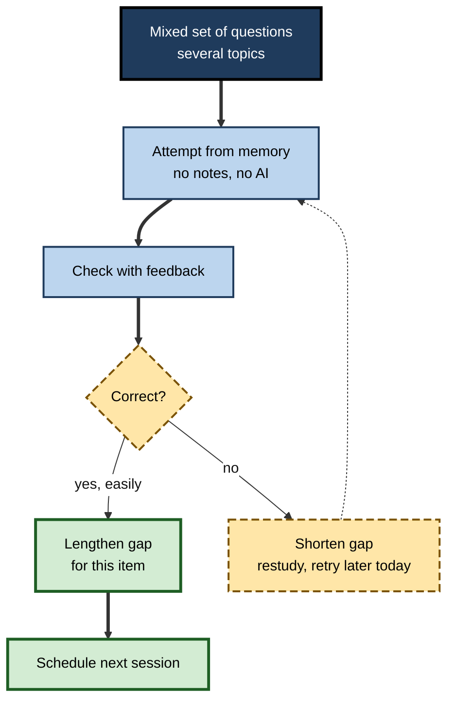
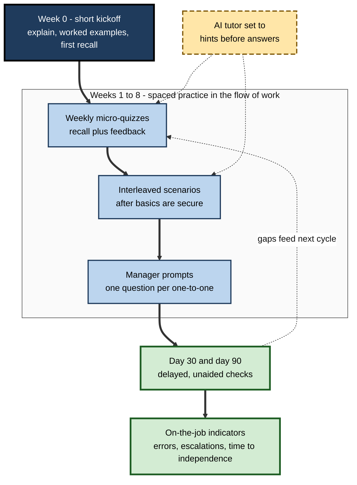

# F.12. Techniques to Strengthen Long-Term Retention

> **In one sentence:** The most reliable ways to keep knowledge for the long term are to practise pulling it out of memory, spread that practice over time, mix related topics, get feedback, and sleep — all of which feel harder than re-reading but work far better.
>
> **Why it matters:** Organisations spend heavily on training that is largely forgotten within weeks. A small set of well-replicated techniques can multiply what people retain, at little extra cost — if they are built into how people learn and work.
>
> **Level span:** Novice → Expert · **Reading time:** ~18 min · **Builds on:** encoding, retrieval cues, interference and storage versus retrieval strength

---

## The Learning Ladder

| Level | Badge | After this level you can... |
|---|---|---|
| 1 | NOVICE | Explain why testing yourself and spacing out study beat re-reading and cramming. |
| 2 | FOUNDATIONS | Name the core retention techniques and what each does to memory. |
| 3 | PRACTITIONER | Build a personal or team retention plan with retrieval, spacing, interleaving and feedback. |
| 4 | ADVANCED | Explain the evidence — effect sizes, boundary conditions, mechanisms — and recent findings from classrooms and workplaces. |
| 5 | EXPERT / PRO | Design retention into L&D programmes, tools and AI-assisted learning, and measure it credibly. |

---

## Level 1 · Novice — The Big Picture

Most people study by re-reading notes, highlighting and cramming before a deadline. It feels productive: the material looks more familiar each time. But familiarity is not the same as being able to recall something when you need it. A week later, much of it is gone.

Two changes make a large difference:

1. **Test yourself instead of re-reading.** Close the notes and try to recall. Trying to remember is not just a check — the act of retrieving strengthens the memory.
2. **Spread it out.** Three short sessions on different days beat one long session, even if the total time is the same.

An analogy: a path through a forest. Walking it many times in one afternoon (cramming) leaves a path that grows over within weeks. Walking it once every few days, just as it starts to fade, keeps it open — and each walk makes it more durable.

You have already experienced this when:

- You remembered a fact better after struggling to recall it in a quiz than after reading it twice.
- You crammed for an exam, passed, and could not recall it a month later.
- You still remember a skill or language you used regularly for years, long after you stopped.

---

## Level 2 · Foundations — Core Concepts

### The core techniques

| Technique | What you do | Why it works |
|---|---|---|
| **Retrieval practice** | Recall from memory: flashcards, practice questions, explaining aloud, writing from memory | Each effortful retrieval strengthens and adds routes to the memory |
| **Spacing** | Spread study and practice over days and weeks | Retrieving after some forgetting is harder and builds more lasting strength |
| **Interleaving** | Mix related problem types or categories within a session | Forces you to discriminate between types and choose methods |
| **Feedback** | Check answers after attempting | Corrects errors and confirms correct answers that felt uncertain |
| **Successive relearning** | Retrieve to a correct criterion, then repeat in later sessions | Combines retrieval, feedback and spacing |
| **Elaboration and self-explanation** | Explain why and how, connect to prior knowledge | Builds a connected network (covered in more depth under encoding) |
| **Sleep** | Get a full night's sleep after learning | Supports consolidation and reduces interference |

### Desirable difficulties

Robert and Elizabeth Bjork called these **desirable difficulties**: conditions that make learning feel slower and harder but improve long-term retention. The difficulty must be one the learner can overcome — impossible tasks do not help.

*Figure F.12-1 — Spaced retrieval flattens the forgetting curve.* Dashed line: material studied once fades steeply. Solid sawtooth: each spaced retrieval (dotted bands) restores the memory, and each subsequent decline is slower, allowing longer gaps. Schematic of a well-replicated pattern.

### Key terms

| Term | Plain meaning |
|---|---|
| **Retrieval practice** | Strengthening memory by recalling it rather than re-reading. |
| **Testing effect** | Better long-term retention after retrieval than after restudy. |
| **Spacing effect** | Better retention when practice is spread over time. |
| **Interleaving** | Mixing related topics or problem types within practice. |
| **Successive relearning** | Repeated sessions of retrieval to criterion, spaced over time. |
| **Desirable difficulty** | A challenge during learning that slows progress now but improves retention. |
| **Spaced repetition system** | Software that schedules reviews at increasing intervals based on performance. |

---

## Level 3 · Practitioner — Putting It to Work

### The Retrieve-Space-Mix plan

1. **Define what must be retained.** List the specific facts, concepts and procedures that must be recalled without help. Not everything deserves this effort.
2. **Turn it into questions.** Write questions that require recall and application, not recognition: "Explain why...", "What would you do if...", "Write the query that...".
3. **First retrieval soon.** Attempt recall within a day of learning, then check answers and correct errors.
4. **Space the next sessions out.** A practical schedule for retention over months: about 1 day, 3 days, 1 week, 3 weeks, then monthly. Lengthen gaps for items you recall easily; shorten them for items you miss.
5. **Retrieve to criterion.** In each session, keep going until you have recalled each item correctly at least once.
6. **Mix it up.** After initial learning, mix related topics and problem types so you must identify which concept or method applies.
7. **Use feedback every time.** Check against the source; note recurring errors.
8. **Protect sleep** around important learning.

**Figure F.12-2 — One retrieval session.**

*How to read it:* thick arrows are the main sequence; missed items loop back (dotted) for another attempt before the session ends.

### Worked example — a sales engineer learning a new product line

| | Before | After |
|---|---|---|
| **Method** | Watches six hours of product videos in two days; re-reads the datasheets. | Watches the videos over a week; after each, writes answers to five customer-style questions from memory. |
| **Later practice** | None until the first customer call. | Ten-minute mixed question sessions on days 3, 7 and 21 using a flashcard app; role-plays objections with a colleague. |
| **Feedback** | None. | Checks each answer against the docs; product team reviews a recorded mock pitch. |
| **One month later** | Needs to look up basic specifications during calls. | Answers common technical questions fluently; looks up only rare details. |

### Common mistakes

- **Re-reading instead of retrieving.** The most common and least effective habit.
- **Recognition-only quizzes.** Multiple choice without feedback can underperform; recall questions work better.
- **Spacing too short.** Reviewing the same day mostly re-activates recent memory.
- **Skipping feedback.** Retrieval without feedback can entrench errors.
- **Stopping once it feels easy.** Ease right after study does not predict retention.

---

## Level 4 · Advanced — Mechanisms, Models & Evidence

### Retrieval practice: the testing effect

Henry Roediger and Jeffrey Karpicke's 2006 studies reignited interest in a century-old finding: students who studied a passage then took recall tests remembered more a week later than students who restudied — even though restudiers predicted they would do better. Meta-analyses since then consistently find a robust testing effect. One large meta-analysis of classroom and lab studies (Adesope and colleagues, 2017) reported a medium overall effect and a medium advantage over re-reading. Effects are larger with **feedback**, **recall formats** and **longer delays**, and hold across ages and many materials.

Boundary conditions matter. A 2024 set of meta-analyses across nine introductory STEM university courses found spaced retrieval generally helped retention, but identified a three-way boundary condition where it did not: **in real classrooms, without feedback, using multiple-choice questions**. The lesson for designers: retrieval works best when recall-based and paired with feedback.

### Spacing

The spacing effect is among the most replicated findings in psychology, from Ebbinghaus onward. Key results:

- Nicholas Cepeda and colleagues' large 2008 study found that the **optimal gap** between study sessions grows with how long you need to remember: for retention over a week, gaps of about a day work well; for retention over a year, gaps of several weeks. As a rough rule, the ideal gap is a modest fraction of the retention interval, and that fraction shrinks as the interval grows. Gaps that are too long cost little compared with gaps that are too short.
- A 2021 meta-analysis by Latimier and colleagues found a large benefit of **spaced** over **massed** retrieval practice.
- A 2025 meta-analysis of spacing and retrieval in mathematics learning found a robust but smaller small-to-medium spacing benefit, illustrating that effects vary by domain and setting.
- An analysis of longitudinal data from more than ten thousand people in naturally occurring **workplace training** found the same pattern seen in the lab: the optimal spacing between retrievals increased with the retention interval.

### Why they work

- **Retrieval** strengthens the retrieved memory and its cue routes, makes the memory more distinct from competitors, and reveals gaps (a **metacognitive** benefit). The **forward testing effect** — retrieving earlier material improves learning of new material — suggests tests also help organise and reset attention.
- **Spacing** works partly because retrieving after some forgetting is effortful (storage strength grows most when retrieval strength is low), partly because spaced sessions encode in varied contexts, and partly because consolidation and sleep occur between sessions.

### Interleaving

Interleaving helps when learners must **discriminate** between similar categories or choose a method: telling painting styles apart, selecting the right statistical test, diagnosing among similar faults. A 2019 meta-analysis by Brunmair and Richter found clear benefits for learning visual categories like paintings and for mathematics, but no benefit or even a cost for learning word lists and some other materials. Interleave **after** initial understanding, and interleave **related** topics where confusion is likely.

### Successive relearning

Katherine Rawson and John Dunlosky's research on **successive relearning** — retrieval practice to a correct-answer criterion, repeated over several spaced sessions — has produced large, durable gains in real courses. It combines the three most powerful levers: retrieval, feedback and spacing.

### Pretesting and errorful generation

Attempting to answer questions **before** learning the material (**pretesting**) improves later learning of the tested content, even when initial answers are wrong — provided correct answers follow. This supports "attempt first, then learn" designs.

### Spaced repetition software

Flashcard programs schedule reviews by algorithm. Older schedulers use fixed multipliers; newer approaches model each learner's memory. The open-source **FSRS** scheduler, integrated into the popular Anki application in 2023, models stability and retrievability per card and lets users set a target retention rate — a direct implementation of storage and retrieval strength ideas. These tools are excellent for discrete facts and vocabulary, less suited to complex skills and understanding.

### AI and retention

Generative AI can produce practice questions, quizzes and feedback at scale; early studies, including 2025 classroom work on AI-generated retrieval questions, are promising but preliminary, and question quality must be checked. The bigger risk runs the other way: AI tools that answer on demand remove retrieval opportunities. A 2025 field experiment with high-school students found unrestricted AI help improved practice performance but lowered later unaided exam performance, while a tutor designed to give hints rather than answers largely avoided the harm.

---

## Level 5 · Expert / Pro — Professional Mastery

### Building retention into L&D programmes

| Old design | Retention-designed alternative |
|---|---|
| One-day workshop | Shorter kickoff plus spaced follow-ups over 4–8 weeks |
| End-of-course multiple-choice quiz | Recall and scenario questions with feedback, repeated at spaced intervals |
| Blocked modules by topic | Interleaved practice once basics are learned |
| Resource library "for reference" | Weekly five-minute retrieval prompts delivered in the flow of work |
| Completion and satisfaction metrics | Delayed, unaided performance at 30 and 90 days |

**Figure F.12-3 — A retention-designed programme over twelve weeks.**

*How to read it:* the thick path is the programme timeline; the dashed-border box is optional AI support; the dotted loop shows delayed checks feeding the next round of practice.

### Practical patterns that scale

- **Spaced micro-quizzes** delivered by chat or email, two to five questions, with immediate feedback.
- **Manager retrieval prompts**: one question in each one-to-one ("Walk me through how you'd handle...").
- **Team "recall standups"** before a launch: each person explains one key element without slides.
- **Deliberate rehearsal for rare skills**: quarterly drills for disaster recovery, crisis communication and safety procedures.
- **AI tutors configured for retrieval**: ask questions first, give hints before answers, and schedule follow-ups.

### Measuring retention credibly

1. Define the knowledge and skills that must be retained.
2. Measure baseline, immediate and **delayed** performance (for example, at 30 and 90 days).
3. Use recall and realistic tasks, not recognition.
4. Compare cohorts with different designs where possible.
5. Link to on-the-job indicators (error rates, time to independence, escalations).

### The learner's perception problem

Learners consistently rate re-reading and massed practice as more effective than retrieval and spacing, because those feel fluent. Retention-designed programmes often receive slightly lower satisfaction ratings. Experts explain the reason in advance ("this will feel harder — that is the point") and report delayed performance, not satisfaction, as the success metric.

### Professional scenario

**Role:** Learning and development lead at a global consultancy.
**Situation:** New analysts attend a two-week bootcamp on financial modelling. Partners report that, three months later, analysts cannot build basic models without templates.
**What the pro does:** Cuts lecture time by a third and adds daily "blank-sheet" exercises in which analysts build model components from memory, with feedback. After the bootcamp, analysts receive a weekly ten-minute mixed problem set for twelve weeks via the collaboration tool, generated with AI and reviewed by experts. The firm's AI assistant is configured to ask what the analyst has tried before suggesting formulas. A 90-day unaided modelling test replaces the end-of-bootcamp quiz. Pass rates on the delayed test rise substantially, and partners report fewer basic errors.

---

## Myths vs. Evidence

| Myth | What the evidence shows |
|---|---|
| "Re-reading and highlighting are effective study methods." | They feel productive but produce weak retention compared with retrieval practice. |
| "Tests are only for measuring learning." | Retrieval itself strengthens memory — the testing effect. |
| "Cramming works if you put in enough hours." | Massed study helps short-term performance but is forgotten quickly; spacing wins long term. |
| "Mixing topics confuses learners." | Interleaving helps for discriminating similar categories after initial learning, though not for all materials. |
| "If it feels easy, I've learned it." | Fluency during study poorly predicts later recall; desirable difficulties feel harder. |
| "AI help always speeds up learning." | Answer-giving AI can raise practice scores while lowering unaided performance later; hint-based designs avoid this. |

## Practitioner Toolkit

**Personal retention checklist**

- [ ] Listed what must be recalled without help.
- [ ] Wrote recall and application questions, not recognition questions.
- [ ] First retrieval within 24 hours.
- [ ] Spaced sessions scheduled (about 1 day, 3 days, 1 week, 3 weeks, monthly).
- [ ] Each item recalled correctly at least once per session.
- [ ] Related topics mixed after initial learning.
- [ ] Feedback checked every time.
- [ ] Slept well after major learning sessions.

**Template — spaced retrieval tracker**

| Item or question | Day 1 | Day 3 | Week 1 | Week 3 | Month 2 | Notes on errors |
|---|---|---|---|---|---|---|
| | | | | | | |

**AI-for-retention prompt rules**

1. "Quiz me with recall questions on [topic]; do not show answers until I respond."
2. "Give me a hint, not the answer, if I'm wrong."
3. "Mix questions from [topic A], [topic B] and [topic C]."
4. "Track which questions I missed and quiz me on them again later."

## Self-Check

1. **[NOVICE]** Why is testing yourself better than re-reading?
2. **[NOVICE]** What is the spacing effect?
3. **[FOUNDATIONS]** What is a desirable difficulty? Give two examples.
4. **[PRACTITIONER]** Design a spaced retrieval schedule for something you must remember for six months.
5. **[PRACTITIONER]** When should you use interleaving, and when not?
6. **[ADVANCED]** What boundary condition did the 2024 STEM course meta-analyses identify for retrieval practice?
7. **[ADVANCED]** How does the optimal spacing gap change with the retention interval?
8. **[EXPERT / PRO]** How would you measure whether a redesigned training programme improved retention?

### Answer Key

1. Retrieval strengthens the memory and its access routes and reveals gaps; re-reading mainly increases familiarity.
2. Retention is better when practice is spread out over time than when it is massed into one session.
3. A challenge that slows learning now but improves long-term retention, which the learner can overcome — for example, retrieval practice, spacing, interleaving.
4. For example: first recall within a day, then about 3 days, 1 week, 3 weeks, 6 weeks, and every 6–8 weeks after, adjusting per item based on errors.
5. After initial understanding, when learners must discriminate between similar categories or select methods; not for initial learning of unfamiliar material or for simple lists where it shows no benefit.
6. Retrieval did not help retention in real classrooms when no feedback was given and multiple-choice questions were used.
7. The optimal gap grows as the retention interval grows, but as a shrinking fraction of it.
8. Measure delayed, unaided performance with recall and realistic tasks at, for example, 30 and 90 days, compare with a previous or parallel cohort, and link to on-the-job indicators.

## Key Takeaways

- **Retrieval practice** — recalling, not re-reading — is the single most effective retention technique.
- **Spacing** beats cramming; the best gaps **grow with how long you need to remember**.
- **Interleave** related topics after initial learning, where discrimination matters.
- **Feedback** and **recall formats** make retrieval work in real settings.
- Effective methods **feel harder**; judge by delayed performance, not fluency or satisfaction.
- Build retention into **workflows and AI tools**: spaced prompts, hint-first tutors, delayed measurement.

## Glossary

| Term | Meaning |
|---|---|
| Desirable difficulty | A learning challenge that slows progress now but improves retention. |
| Forward testing effect | Retrieving earlier material improves learning of new material. |
| FSRS | An open-source scheduling algorithm that models memory stability and retrievability for flashcards. |
| Interleaving | Mixing related topics or problem types within practice. |
| Massed practice | Practice concentrated in one session. |
| Pretesting | Attempting questions before learning the material. |
| Retention interval | The time between learning and when the knowledge is needed. |
| Retrieval practice | Recalling information from memory to strengthen it. |
| Spaced repetition system | Software that schedules reviews at increasing intervals. |
| Spacing effect | Better retention when learning is spread over time. |
| Successive relearning | Retrieval to criterion repeated across spaced sessions. |
| Testing effect | Better retention after retrieval than after restudy. |
