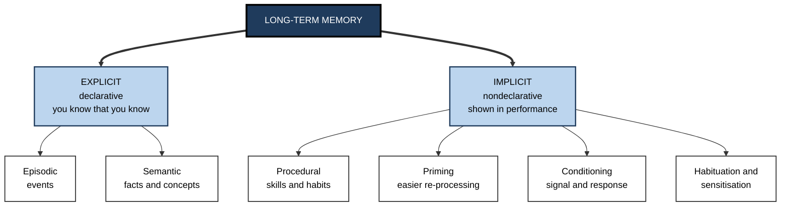
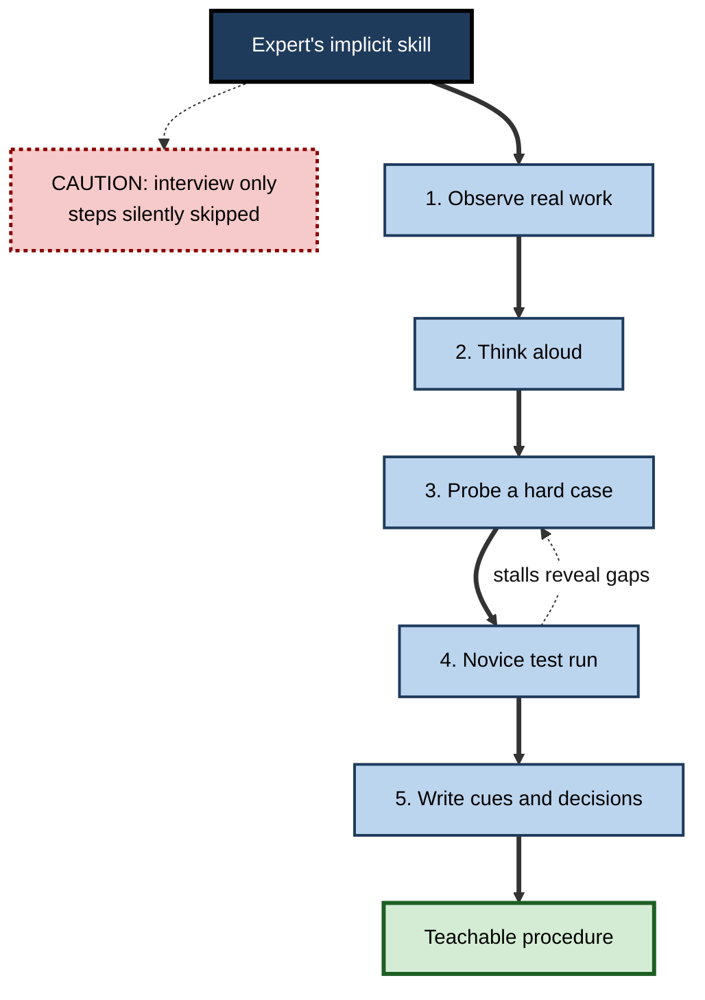

# F.2. Explicit vs. Implicit Memory

> **In one sentence:** Explicit memory is what you know that you know and can put into words; implicit memory is what your past experience does to you without you noticing — the skills, habits, preferences and quick reactions you cannot fully explain.
>
> **Why it matters:** Much of professional expertise is implicit, which is why experts struggle to explain what they do, why written procedures miss steps, and why repeated claims start to feel true. Knowing the difference changes how you capture knowledge, train people and defend against manipulation.
>
> **Level span:** Novice → Expert · **Reading time:** ~17 min · **Builds on:** the main types of long-term memory

---

## The Learning Ladder

| Level | Badge | After this level you can... |
|---|---|---|
| 1 | NOVICE | Tell the difference between remembering something on purpose and being influenced by the past without realising it. |
| 2 | FOUNDATIONS | Define explicit (declarative) and implicit (nondeclarative) memory and name the main forms of each. |
| 3 | PRACTITIONER | Capture an expert's implicit know-how and spot when implicit memory is biasing a decision. |
| 4 | ADVANCED | Explain the dissociation evidence, the single- versus multiple-systems debate, and which "priming" findings failed to replicate. |
| 5 | EXPERT / PRO | Design knowledge transfer, training and communication that work with both kinds of memory, ethically. |

---

## Level 1 · Novice — The Big Picture

Think of two ways your past shows up today.

The first is **on purpose**. Someone asks "What did you have for lunch yesterday?" or "What does ROI stand for?" and you deliberately search your memory and report the answer. You know you are remembering. That is **explicit memory**.

The second is **behind the scenes**. You type your password without thinking of the letters. A brand you have seen a hundred times feels more trustworthy than one you have never seen. You find yourself disliking a colleague's ringtone because it is the same one your old, stressful manager used. In each case the past is shaping you, but you are not consciously recalling it. That is **implicit memory**.

An analogy: explicit memory is the **text** of a book you can read aloud; implicit memory is the **crease in the spine** that makes the book fall open at the page you used most. Both are traces of the past. Only one can be read.

You have already experienced implicit memory when:

- You reached for a light switch in a house you moved out of years ago.
- You could type a phone number on a keypad but could not say it out loud without "typing" it in the air.
- A rumor you heard several times started to feel true, even though you could not remember where you heard it.

---

## Level 2 · Foundations — Core Concepts

### Two families

**Explicit memory** (also **declarative memory**) is memory you can consciously retrieve and describe. It includes:

- **Episodic memory** — personal events tied to a time and place.
- **Semantic memory** — facts, concepts and meanings.

**Implicit memory** (also **nondeclarative memory**) is shown through changes in performance, not through conscious recollection. It includes:

- **Procedural memory** — skills and habits (typing, driving, running a familiar meeting).
- **Priming** — easier or faster processing of something because you met it (or something related) before.
- **Classical conditioning** — learned associations between signals and responses (an alert sound triggering a stress response).
- **Non-associative learning** — **habituation** (responding less to a repeated harmless stimulus, like ignoring office air-conditioning noise) and **sensitisation** (responding more after something intense).

**Figure F.2-1 — The two families of long-term memory.**

*How to read it:* the two mid-tone boxes are the families; white boxes are the forms within each. Real memories often involve both families at once.

### How you test each

| | Explicit memory test | Implicit memory test |
|---|---|---|
| **Instruction** | "Try to remember..." | No mention of memory; just do a task |
| **Example** | Recall or recognise words from a list | Complete word fragments, name pictures quickly, perform a skill |
| **Evidence of memory** | Correct report | Faster, more accurate or biased performance on previously met items |
| **Awareness** | Present | Not required |

### Key terms

| Term | Plain meaning |
|---|---|
| **Explicit (declarative) memory** | Memory you can consciously recall and describe. |
| **Implicit (nondeclarative) memory** | Influence of past experience on performance without conscious recollection. |
| **Priming** | Easier processing of a stimulus because of earlier exposure to it or something related. |
| **Perceptual priming** | Priming based on surface form (how a word or image looks or sounds). |
| **Conceptual priming** | Priming based on meaning (seeing "doctor" speeds "nurse"). |
| **Tacit knowledge** | Know-how that experts use but struggle to articulate. |
| **Illusory truth effect** | Repeated statements feel more true, regardless of accuracy. |

---

## Level 3 · Practitioner — Putting It to Work

### Problem 1: experts cannot tell you everything they know

When skills become automatic, the steps move from explicit to implicit memory. Experts then skip steps when explaining, not out of secrecy but because they no longer consciously notice them. Researchers in **cognitive task analysis** report that experts asked to describe a procedure routinely omit a large share of the decisions they actually make. Procedures written from interviews alone are therefore incomplete.

### A five-step method to capture implicit know-how

1. **Observe, don't just ask.** Watch the expert do the real task, or review a recording, rather than relying on their description.
2. **Think aloud.** Ask them to narrate while working; prompt with "What are you looking at now?" and "What told you to do that?"
3. **Probe critical moments.** Pick a recent hard case and walk through it decision by decision: what cues they noticed, what options they rejected, what would have changed their mind.
4. **Contrast with a novice.** Have a competent newcomer attempt the task with the draft procedure. Every place they stall marks a missing implicit step.
5. **Write cues, not just steps.** Record the signals the expert responds to ("if the error log shows retries climbing faster than traffic, check the connection pool first").

**Figure F.2-2 — Turning implicit expertise into teachable knowledge.**

*How to read it:* the thick path is the method; the dotted-border box is the common shortcut that produces incomplete procedures.

### Problem 2: implicit memory biases judgement

- **Familiarity masquerades as truth.** The **illusory truth effect** — first shown by Hasher and colleagues in 1977 and replicated many times — means statements you have heard before feel more credible. In meetings, the most repeated claim gains weight whether or not it is correct.
- **Familiarity masquerades as quality.** The **mere exposure effect** (Zajonc, 1968) makes familiar options feel more likeable: the incumbent vendor, the tool you already use, the candidate who resembles past hires.
- **Conditioned reactions.** A notification sound associated with crises can raise stress even when the message is trivial.

### Worked example — a design review

| | Before | After |
|---|---|---|
| **Situation** | The lead repeats "the monolith is too slow" in five meetings. By month's end, everyone "knows" it. | Same team. |
| **Check** | None — the claim feels familiar, so it feels true. | Facilitator asks: "What is our evidence, and where did we first hear this?" |
| **Outcome** | Expensive migration approved on a familiar claim. | Profiling shows one slow query; it is fixed in a week. |

### Common mistakes

- Writing procedures only from what experts *say*.
- Treating a strong "gut feeling" as evidence without asking where the familiarity came from.
- Assuming that because someone cannot explain a skill, they do not really have it.

---

## Level 4 · Advanced — Mechanisms, Models & Evidence

### The dissociation evidence

The explicit–implicit distinction (the terms were popularised by Graf and Schacter in 1985) rests on **dissociations** — cases where one kind of memory is impaired and the other spared:

- **Amnesia.** Warrington and Weiskrantz (1970) showed that people with amnesia, who performed poorly at recalling or recognising studied words, showed near-normal benefit when asked to complete word fragments — an implicit test. Henry Molaison improved at mirror drawing without remembering having done it.
- **The reverse pattern.** Some patients with basal ganglia damage, as in Parkinson's or Huntington's disease, can report facts and events but struggle to acquire new procedural skills or habits.
- **Implicit learning in healthy people.** In Arthur Reber's artificial-grammar studies (from 1967), participants learned to classify letter strings as "grammatical" above chance while being unable to state the rules. In sequence-learning tasks, people get faster at a repeating sequence of key presses they do not consciously detect.

### Single versus multiple systems

The **multiple-systems view** reads these dissociations as evidence for separate brain systems — the medial temporal lobe for explicit memory; basal ganglia, cerebellum and sensory cortex for different implicit forms. Critics argue that:

- Implicit tests are often more **reliable** or less sensitive to small differences than explicit tests, which can create apparent dissociations statistically.
- **Single-system computational models**, in which one memory signal drives both explicit and implicit performance, reproduce many dissociation patterns.
- "Implicit" tests can be **contaminated** by explicit strategies, and "unconscious" learning sometimes turns out to involve partial awareness when awareness is measured more sensitively.

The current position is pragmatic: there are real differences between conscious recollection and performance-based memory, and they rely on partly different networks, but the boundary is fuzzier and more interactive than the neat two-box diagram suggests.

### Which priming survived the replication crisis

Priming is not one phenomenon, and its evidence base differs sharply by type:

| Type of priming | Example | Replication status |
|---|---|---|
| **Repetition / perceptual priming** | Faster word-fragment completion for studied words | Robust; decades of replications |
| **Semantic priming** | "Doctor" speeds recognition of "nurse" | Robust in reaction-time tasks; effects are small and short-lived |
| **Illusory truth effect** | Repeated claims rated more true | Robust; persists even when people know the correct answer in many cases |
| **Social / behavioral priming** | Reading words about old age makes people walk more slowly | **Contested.** A 2012 replication found no effect unless experimenters expected one; large replication projects and later analyses suggest many published effects were overestimated |
| **Money, cleanliness and similar "goal" primes** | Incidental money cues change social values | **Largely failed to replicate** in registered replications |

The professional lesson: low-level priming of perception and meaning is real but small and brief. Claims that subtle cues reliably steer complex behavior — in marketing, nudging or "office design that makes people collaborative" — should be treated with scepticism unless backed by preregistered evidence.

### Implicit bias measures

The **Implicit Association Test (IAT)** measures how fast people pair concepts and is often presented as revealing hidden attitudes. Meta-analyses have found its ability to predict individual behavior to be modest, its test–retest reliability limited, and interventions that change IAT scores often not to change behavior. It remains a research tool; using it to diagnose individuals or as the core of diversity training is not supported by the evidence.

---

## Level 5 · Expert / Pro — Professional Mastery

### Designing training for both kinds of memory

| Goal | Memory type | Design that works |
|---|---|---|
| Know the policy, concepts, rationale | Explicit (semantic) | Explanation, examples, retrieval practice, spaced quizzes |
| Remember what happened and why | Explicit (episodic) | After-action reviews, decision logs, case discussions |
| Perform fluently under pressure | Implicit (procedural) | Many varied, realistic repetitions with feedback; simulations |
| Recognise situations at a glance | Implicit (perceptual learning) | Large volumes of labelled cases (radiology images, fraud patterns, code smells) with fast feedback |
| Change a reflexive reaction | Implicit (conditioning, habit) | Change the cue environment; practise the new response repeatedly in context |

### Knowledge management

Organisations hold most of their capability as implicit expertise in people. Good practice includes structured expert interviews and observation before key people leave, pairing and shadowing that let implicit skills transfer by imitation, and decision records that convert implicit judgement into explicit, reviewable reasoning.

### AI-era implications

- **Familiarity from AI outputs.** Reading confident AI-generated text repeatedly creates familiarity, and familiarity breeds credibility. Teams should verify claims at first exposure, not after they feel familiar.
- **Skills built implicitly need practice the tool may remove.** If an assistant always writes the code, the pattern-recognition that lets engineers spot bad code may not develop.
- **Eliciting tacit knowledge.** Teams are using AI assistants to interview experts and draft procedures. The same caution applies: an interview — by human or AI — captures what the expert can say, not everything they do. Observation and novice testing remain essential.

### Ethical limits

Designers can exploit implicit memory: repetition to build false credibility, conditioning to create compulsive checking, familiarity to entrench a vendor. Professional practice draws a line between designing for genuine learning and designing to bypass people's conscious judgement.

### Professional scenario

**Role:** Operations lead in a hospital pharmacy.
**Situation:** A retiring senior pharmacist rarely makes dispensing errors; her written procedure, given to new staff, does not reduce theirs.
**What the pro does:** Arranges two weeks of observation with think-aloud narration during real dispensing, records the visual checks she performs without mentioning them (comparing tablet markings, double-checking look-alike names in a particular order), and has two new pharmacists trial the revised checklist. Their stalls identify three more unstated checks. The final job aid lists the cues she responds to, and new staff practise them on look-alike drug sets until the checks become automatic.

---

## Myths vs. Evidence

| Myth | What the evidence shows |
|---|---|
| "If an expert can't explain it, it isn't real expertise." | Automatic skills shift to implicit memory and become hard to verbalise; this is normal. |
| "Subtle primes reliably control complex behavior." | Many social and behavioral priming findings failed to replicate; robust priming is small and short-lived. |
| "Familiar claims are familiar because they are true." | The illusory truth effect shows repetition alone increases perceived truth. |
| "The IAT reveals your true hidden attitudes." | It predicts individual behavior only modestly and has limited reliability. |
| "Implicit and explicit memory are completely separate." | They interact constantly and rely on partly overlapping networks; the boundary is debated. |
| "Subliminal advertising makes people buy things." | Effects, where found, are small, short-lived and dependent on existing motivation. |

## Practitioner Toolkit

**Tacit-knowledge capture checklist**

- [ ] Observed the expert doing the real task (live or recorded).
- [ ] Collected think-aloud narration at decision points.
- [ ] Walked through at least one recent difficult case decision by decision.
- [ ] Tested the draft procedure on a competent novice and logged stalls.
- [ ] Wrote down cues and thresholds, not just steps.
- [ ] Built practice materials so the new steps become automatic.

**Repetition-bias check for meetings** — before accepting a claim, ask:

1. Where did I first hear this?
2. What is the direct evidence?
3. Would I believe it if I were hearing it for the first time?

## Self-Check

1. **[NOVICE]** Give one example of explicit memory and one of implicit memory from your day.
2. **[FOUNDATIONS]** Name four forms of implicit memory.
3. **[FOUNDATIONS]** How does an implicit memory test differ from an explicit one?
4. **[PRACTITIONER]** Why do procedures written from expert interviews often fail new staff?
5. **[PRACTITIONER]** What is the illusory truth effect and how might it distort a team decision?
6. **[ADVANCED]** What did Warrington and Weiskrantz show about amnesia?
7. **[ADVANCED]** Which kinds of priming are robust and which are contested?
8. **[EXPERT / PRO]** How would you design training for fast recognition of fraud patterns?

### Answer Key

1. Examples: recalling what was decided in this morning's meeting (explicit); typing your password without thinking (implicit).
2. Procedural memory, priming, classical conditioning, and habituation or sensitisation.
3. An explicit test asks you to remember deliberately; an implicit test gives an unrelated task and detects memory through changes in speed, accuracy or bias.
4. Experts' automatic steps are implicit, so they omit them unknowingly; the procedure lacks cues and decisions novices need.
5. Repeated statements feel more true. A repeated but untested claim can gain weight in a team purely through repetition.
6. People with amnesia who could not recall or recognise studied words still showed normal priming on word-fragment completion.
7. Repetition, perceptual and semantic priming and the illusory truth effect are robust; social and behavioral priming is contested, and many such findings failed to replicate.
8. Large volumes of real, labelled cases with immediate feedback, mixed together, building perceptual pattern recognition; plus explicit explanation of key cues.

## Key Takeaways

- **Explicit memory** is consciously recalled; **implicit memory** shows up in performance without awareness.
- Expertise moves knowledge from explicit to implicit, so **experts cannot fully explain what they do** — observe and test, don't just interview.
- **Repetition creates a feeling of truth** — verify claims before they become familiar.
- Basic **perceptual and semantic priming is robust**; dramatic **social priming claims are largely contested**.
- The two families **interact** and the boundary is debated; treat the distinction as a useful map, not a wall.
- Train each kind of memory differently: explanation and retrieval for explicit, varied repetition with feedback for implicit.

## Glossary

| Term | Meaning |
|---|---|
| Artificial grammar learning | A task in which people learn rule-governed letter patterns without being able to state the rules. |
| Classical conditioning | Learning that one signal predicts another, producing an automatic response. |
| Cognitive task analysis | Methods for uncovering the knowledge and decisions behind expert performance. |
| Dissociation | A pattern in which one ability is impaired while another is spared. |
| Explicit memory | Memory that can be consciously retrieved and described. |
| Habituation | Reduced response to a repeated, harmless stimulus. |
| Illusory truth effect | The tendency to rate repeated statements as more true. |
| Implicit Association Test | A reaction-time test of associations between concepts, with limited predictive validity for individuals. |
| Implicit memory | Influence of past experience on performance without conscious recollection. |
| Mere exposure effect | Liking things more simply because they are familiar. |
| Priming | Easier processing of a stimulus due to earlier exposure. |
| Sensitisation | Increased response after an intense or threatening stimulus. |
| Tacit knowledge | Know-how that is used but hard to articulate. |
