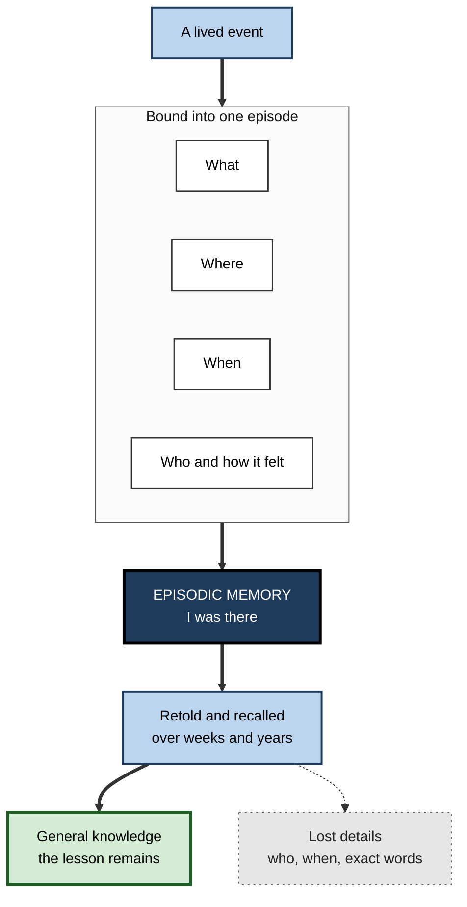

# F.3. Episodic Memory: Personal Experiences

> **In one sentence:** Episodic memory is your memory for specific events you lived through — what happened, where, when and how it felt — which lets you mentally travel back in time and re-experience them.
>
> **Why it matters:** Lessons learned, incident reviews, client histories, witness accounts and your own career stories all depend on episodic memory. It is vivid and persuasive but fades and shifts quickly, so professionals learn to capture it early and treat it with care.
>
> **Level span:** Novice → Expert · **Reading time:** ~16 min · **Builds on:** explicit versus implicit memory

---

## The Learning Ladder

| Level | Badge | After this level you can... |
|---|---|---|
| 1 | NOVICE | Explain what episodic memory is and how it differs from simply knowing a fact. |
| 2 | FOUNDATIONS | Describe its key features — what, where, when, and the sense of reliving — and how episodes turn into general knowledge. |
| 3 | PRACTITIONER | Capture and use episodic memory well at work: debriefs, incident timelines, decision logs. |
| 4 | ADVANCED | Explain the hippocampal basis, constructive simulation, autobiographical memory patterns and individual differences. |
| 5 | EXPERT / PRO | Build organisational practices that convert fragile individual episodes into durable shared learning. |

---

## Level 1 · Novice — The Big Picture

Try two questions. "What is the capital of Japan?" and "What did you do on your last birthday?"

For the first, an answer simply appears: Tokyo. You probably cannot remember when or where you learned it. For the second, something different happens. You *go back*. You see a room, people, maybe a meal; you might feel a flicker of the mood. That act of mentally returning to a moment in your own past is **episodic memory**. The psychologist Endel Tulving, who introduced the idea in 1972, called it **mental time travel**.

An analogy: semantic memory is an encyclopedia; episodic memory is your personal diary — except the diary is rewritten slightly every time you read it, and many pages fade if they are never opened.

You have already experienced episodic memory when:

- You remembered exactly where you were sitting when you got a job offer.
- You returned to a room and remembered what you came in for only when you went back to where you had the thought.
- Two people at the same meeting gave very different accounts of "what was agreed".

---

## Level 2 · Foundations — Core Concepts

### What makes a memory episodic

An episodic memory binds together several elements into a single event:

- **What** happened (content);
- **Where** it happened (spatial context);
- **When** it happened (temporal context, order of events);
- **Who** was involved and **how it felt** (social and emotional context);
- and a sense that **I** was there, re-experiencing it — Tulving called this **autonoetic** ("self-knowing") consciousness.

### From episodes to knowledge

Episodes do not stay episodes forever. With time and repetition, the shared core of many episodes becomes general knowledge, while the specific details fade. This process is called **semanticisation**. You no longer remember each time you were told "always back up before migrating"; you just know it. That is efficient, but it also means the lesson can lose the story that explained *why*.

**Figure F.3-1 — How an event becomes an episodic memory and, over time, general knowledge.**

*How to read it:* an event's parts are bound into one episode; repeated recall distils a general lesson while specifics fade, shown by the dotted arrow to the grey box.

### Key terms

| Term | Plain meaning |
|---|---|
| **Episodic memory** | Memory for specific personal events in their time and place. |
| **Autonoetic consciousness** | The feeling of re-experiencing an event as yourself. |
| **Autobiographical memory** | Your life story — episodes plus personal facts — organised around the self. |
| **Semanticisation** | Gradual transformation of episodes into general knowledge, losing detail. |
| **Source memory** | Remembering where or from whom you learned something. |
| **Recollection vs. familiarity** | Recalling specific details of an encounter versus just sensing you have met something before. |

---

## Level 3 · Practitioner — Putting It to Work

Episodic memory is the raw material of organisational learning — but it is perishable. Details that are sharp on the day are vague in a week and reshaped by later conversations within a month. The practical rule: **capture episodes early, separately and factually.**

### The Early Capture method for incidents and key events

1. **Capture within 24–48 hours.** Ask each participant to write their own timeline before any group discussion, so accounts are not blended.
2. **Anchor to objective records.** Attach logs, timestamps, messages, calendar entries. Episodic memory is weakest on exact *when* and order.
3. **Separate observation from interpretation.** Use two columns: "What I saw or did" and "What I thought it meant".
4. **Mark confidence.** Have people flag what they are sure of versus reconstructing.
5. **Distil the lesson.** In the review meeting, extract the general rule (the semantic lesson) *and* keep the story that explains it.
6. **Store with cues.** Title and tag the record by the situation in which someone will need it ("database failover during peak traffic"), not by date.

**Figure F.3-2 — Early capture keeps episodes useful.**

```mermaid
%%{init: {'theme':'base','themeVariables':{'fontFamily':'Arial, Helvetica, sans-serif','fontSize':'15px','primaryColor':'#FFFFFF','primaryTextColor':'#111111','primaryBorderColor':'#222222','lineColor':'#333333','secondaryColor':'#F2F2F2','tertiaryColor':'#FFFFFF','clusterBkg':'#FAFAFA','clusterBorder':'#555555','edgeLabelBackground':'#FFFFFF','titleColor':'#111111'}}}%%
flowchart TD
    classDef core    fill:#1F3B5C,stroke:#000000,stroke-width:3px,color:#FFFFFF
    classDef key     fill:#BCD5EE,stroke:#1F3B5C,stroke-width:2px,color:#000000
    classDef good    fill:#D3ECD3,stroke:#1E5E24,stroke-width:3px,color:#000000
    classDef caution fill:#F6CACA,stroke:#8B0000,stroke-width:2.5px,stroke-dasharray:3 3,color:#000000

    I["Incident or key event"]
    A["1. Individual timelines<br/>within 48 hours"]
    B["2. Anchor to logs<br/>and timestamps"]
    C["3. Observation vs<br/>interpretation"]
    D["4. Confidence flags"]
    E["5. Group review<br/>lesson plus story"]
    F["6. Store under<br/>situation cues"]
    X["CAUTION: group retelling first<br/>accounts merge and drift"]

    I ==> A ==> B ==> C ==> D ==> E ==> F
    I -.-> X

    class I core
    class A,B,C,D,E key
    class F good
    class X caution
```

*How to read it:* follow the thick path; the dotted-border box shows the common shortcut that contaminates individual accounts.

### Worked example — a lost deal

| | Before | After |
|---|---|---|
| **Debrief timing** | Quarterly review, three months later. | Within two days of the decision. |
| **Format** | Group discussion led by the account director. | Each team member writes a short timeline first, then a group review. |
| **Content** | "The client went with the cheaper vendor." | Timeline shows the client's technical lead stopped attending after week 3; two people independently noted an unanswered security question. |
| **Lesson stored** | "Price matters." | "When a technical stakeholder disengages, escalate unanswered security questions within 48 hours" — stored with the story. |

### Common mistakes

- **Late debriefs.** Waiting until memories have faded and merged.
- **Group-first recall.** The most senior or confident voice reshapes everyone else's memory.
- **Lessons without stories.** Rules detached from episodes are easier to ignore and harder to apply to new cases.
- **Trusting vividness.** A vivid memory feels accurate, but vividness and accuracy are only loosely related.

---

## Level 4 · Advanced — Mechanisms, Models & Evidence

### Brain basis

The **hippocampus** and surrounding medial temporal lobe are central to binding the elements of an event into a retrievable episode. A widely held view is that the hippocampus stores an **index** — a pattern that points to the distributed cortical representations of sights, sounds, people and meanings — and that reactivating part of the pattern (a cue) can reinstate the whole (**pattern completion**). Keeping similar episodes apart, such as yesterday's and today's standup, relies on **pattern separation**. The prefrontal cortex supports strategic search, source monitoring and judging whether a retrieved memory is real. Debate continues over whether the hippocampus remains necessary for old, detailed episodes (**multiple trace** and **trace transformation** theories) or whether old memories become fully independent of it (**standard consolidation theory**); the current weight of evidence suggests vivid, detailed recollection keeps depending on the hippocampus while the gist can become cortical. The biology of consolidation itself belongs to a separate note.

### Remembering the past to imagine the future

People with hippocampal damage often struggle not only to remember the past but to imagine new scenes and future events. Daniel Schacter and Donna Addis's **constructive episodic simulation hypothesis** proposes that episodic memory is built from flexible fragments *because* its main job is to let us simulate possible futures — planning a negotiation, anticipating a stakeholder's reaction. The price of that flexibility is susceptibility to error: the same recombination that enables imagination can produce false memories.

### Patterns in autobiographical memory

- **Childhood amnesia.** Adults recall few or no episodes from before about age three to four.
- **The reminiscence bump.** When older adults recall memories across their lifespan, events from roughly ages 10 to 30 are over-represented — a period of many first experiences and identity formation.
- **Recency.** Recent events are recalled more, consistent with ordinary forgetting.
- **Ageing.** Episodic memory typically declines more with age than semantic memory, which is stable or grows into late adulthood. Older adults' episodic recall tends to contain fewer specific details and more general, semantic content.

### Individual differences

- **Highly superior autobiographical memory (HSAM)**, first described in 2006, is a rare profile in which people can recall a striking number of dated personal events. Importantly, people with HSAM remain susceptible to false memories in laboratory tasks — exceptional retention does not guarantee accuracy.
- **Severely deficient autobiographical memory (SDAM)**, described in 2015, is the opposite: otherwise healthy people who know facts about their lives but cannot re-experience them.

### Recollection and familiarity

**Dual-process models** separate two routes to recognising something: **recollection** (retrieving specific contextual details — "I met her at the Berlin conference, she asked about pricing") and **familiarity** (a contextless sense of "I've seen this before"). Familiarity is fast and survives longer; recollection is slower, more effortful and more affected by ageing and hippocampal damage. Many workplace errors come from acting on familiarity without recollection — such as recognising a name but misattributing who said what.

### AI echo

Researchers building AI agents in 2025 argued that episodic memory — storing specific interaction events with their context — is the missing ingredient for long-running assistants. The analogy is useful in reverse: it highlights that what makes human episodic memory valuable is the binding of content to context, and what makes it fallible is that the binding loosens over time.

---

## Level 5 · Expert / Pro — Professional Mastery

### Organisational practices built on episodic memory

| Practice | What it does with episodic memory | Key design choice |
|---|---|---|
| **Blameless postmortems** | Collect individual episodes of an incident and distil lessons | Individual timelines before group review; anchor to logs |
| **After-action reviews** (military origin) | Compare what was planned with what happened, while fresh | Run immediately; short; focus on what to sustain and improve |
| **Decision journals** | Record reasoning *at the time of the decision* | Prevents hindsight from rewriting memory of what you knew |
| **Case-based teaching** | Use rich episodes to transmit judgement | Keep the story and context, not just the rule |
| **Customer interviews** | Ask about specific recent episodes, not general opinions | "Tell me about the last time you..." yields more accurate detail than "Do you usually...?" |

### Interviewing for episodes

The **cognitive interview**, developed for police witnesses by Fisher and Geiselman, is well supported by research and adapts well to workplace investigations and user research: rebuild the context mentally, report everything without filtering, recall in different orders, and avoid leading questions. Its main effect is more correct detail, with only a small rise in errors.

### Hindsight protection

Once an outcome is known, people's memory of what they predicted shifts toward it (**hindsight bias**). Episodic memory of your past reasoning is unreliable after the fact. Experts write down predictions and reasoning *before* outcomes — in investment committees, product bets, hiring decisions — so later reviews evaluate the decision process, not the luck.

### Professional scenario

**Role:** Site reliability engineering manager.
**Situation:** A major outage happened on Friday. On Monday, the team's shared story is already "the deploy broke the cache". Two engineers privately suspect a configuration change but have gone quiet.
**What the pro does:** Before the review, asks each of the five responders to write an individual timeline anchored to the chat log and dashboard screenshots, marking low-confidence points. The timelines reveal the configuration change preceded the deploy by eight minutes. The review records both the corrected causal chain and the near-miss in shared memory ("we almost concluded the wrong cause"), and the postmortem is titled by symptom so future responders find it by the cues they will see.

### Ethics

Episodic memories of workplace events are used in performance reviews, disciplinary processes and legal disputes. Professionals do not treat confident recollection as proof, avoid suggestive questioning, and rely on contemporaneous records where stakes are high.

---

## Myths vs. Evidence

| Myth | What the evidence shows |
|---|---|
| "Vivid memories are accurate memories." | Vividness and confidence can stay high while details change; accuracy needs corroboration. |
| "People with exceptional memory never misremember." | People with highly superior autobiographical memory still form false memories in lab tasks. |
| "Memories are stored in one place like a file." | Episodes are distributed patterns, reconstructed from an index plus cortical fragments. |
| "A group discussion is the best way to recall what happened." | Group recall blends and distorts accounts; individual recall first preserves independent evidence. |
| "Remembering and imagining are unrelated." | They share brain networks; episodic memory supports imagining the future. |
| "Older people's memory declines across the board." | Episodic detail tends to decline; semantic knowledge is stable or grows. |

## Practitioner Toolkit

**Episode-capture checklist**

- [ ] Captured within 48 hours.
- [ ] Each person wrote their own account before group discussion.
- [ ] Timeline anchored to objective records.
- [ ] Observations separated from interpretations.
- [ ] Confidence marked for key points.
- [ ] General lesson and the supporting story both recorded.
- [ ] Stored under the situation cues someone will search for.

**Template — decision journal entry**

| Date | Decision | Options considered | What I expect to happen and why | Confidence | Review date | Actual outcome |
|---|---|---|---|---|---|---|
| | | | | | | |

## Self-Check

1. **[NOVICE]** What is the difference between remembering *that* Tokyo is Japan's capital and remembering your last birthday?
2. **[FOUNDATIONS]** List the elements that an episodic memory binds together.
3. **[FOUNDATIONS]** What is semanticisation, and what is lost in it?
4. **[PRACTITIONER]** Why should incident participants write individual timelines before a group review?
5. **[ADVANCED]** What role is the hippocampus thought to play in episodic memory?
6. **[ADVANCED]** What does the constructive episodic simulation hypothesis propose?
7. **[ADVANCED]** Distinguish recollection from familiarity with a workplace example.
8. **[EXPERT / PRO]** Why do professionals keep decision journals?

### Answer Key

1. The capital is semantic — a fact without a personal time and place. The birthday is episodic — you mentally re-experience a specific event.
2. What happened, where, when, who was involved, how it felt, plus the sense that you were there.
3. The gradual conversion of episodes into general knowledge; specific details such as who, when and exact words are lost.
4. Group discussion blends and reshapes memories; individual accounts preserve independent evidence and minority observations.
5. It binds the elements of an event and stores an index pointing to cortical details, allowing a cue to reinstate the whole episode.
6. That episodic memory stores flexible fragments so they can be recombined to imagine future events — which also makes it prone to errors.
7. Recollection: remembering that a colleague raised the budget risk in Tuesday's meeting. Familiarity: sensing the budget risk "came up somewhere" without knowing where or who said it.
8. To record reasoning before outcomes are known, protecting decision reviews from hindsight bias.

## Key Takeaways

- Episodic memory is **mental time travel** to specific events — what, where, when, who, and how it felt.
- It is **vivid but perishable**: details fade and drift within days to weeks.
- Over time, episodes become **general knowledge**, losing the story that explains the lesson.
- The hippocampus binds episodes; the same flexible system lets us **imagine the future**, and makes memory error-prone.
- At work: **capture early, individually, anchored to records** — then distil lessons and keep the stories.
- Decision journals and the cognitive interview are **evidence-based tools** for getting reliable episodes.

## Glossary

| Term | Meaning |
|---|---|
| After-action review | A short, structured comparison of what was planned and what happened, done soon after an event. |
| Autobiographical memory | Memory for one's own life, combining episodes and personal facts. |
| Autonoetic consciousness | The self-aware experience of re-living a past event. |
| Childhood amnesia | The scarcity of adult memories from early childhood. |
| Cognitive interview | An evidence-based interviewing method that increases correct recall with few added errors. |
| Constructive episodic simulation | The idea that episodic memory supports imagining the future by recombining past fragments. |
| Dual-process model | The view that recognition draws on recollection and familiarity. |
| Hindsight bias | Remembering your past predictions as closer to the actual outcome than they were. |
| Hippocampus | A medial temporal lobe structure central to forming and retrieving episodic memories. |
| Pattern completion | Reinstating a full memory from a partial cue. |
| Pattern separation | Keeping similar memories distinct. |
| Reminiscence bump | Over-representation of memories from adolescence and early adulthood. |
| Semanticisation | The transformation of episodes into general knowledge over time. |
| Source memory | Memory for where or from whom information came. |
