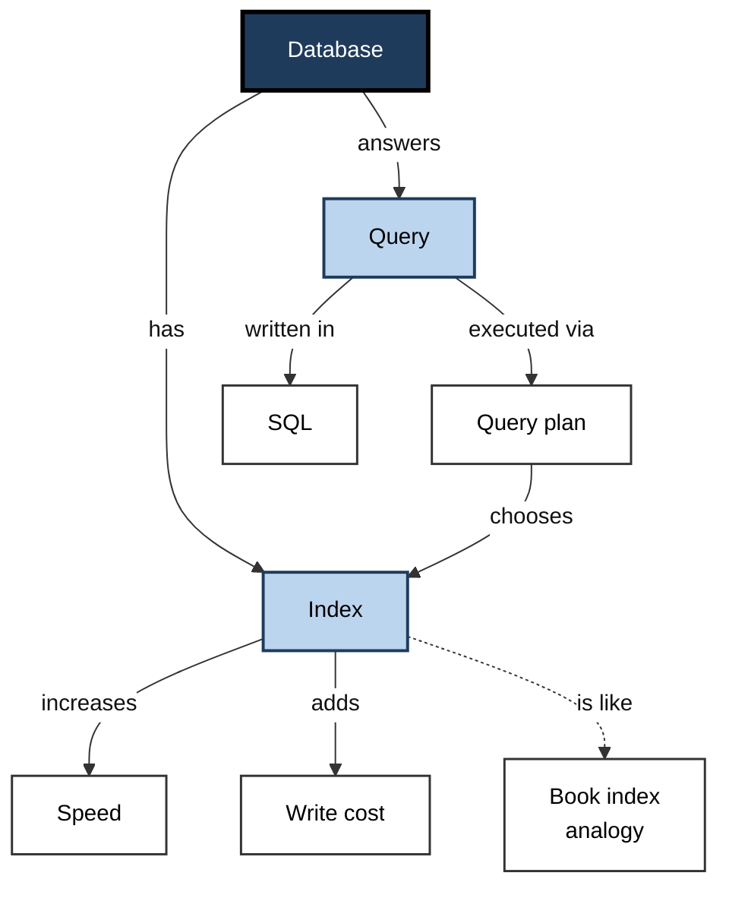
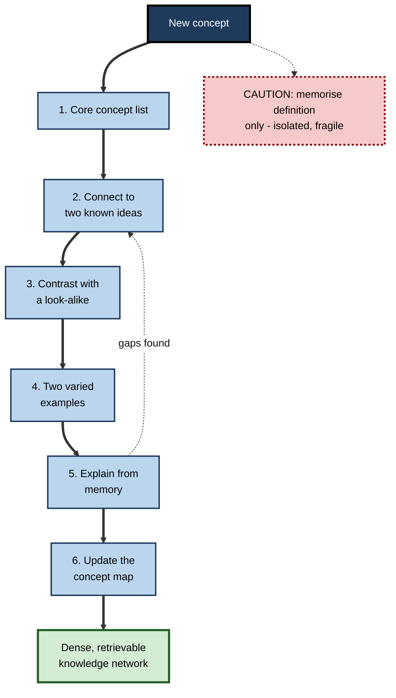

# F.4. Semantic Memory: Facts and Concepts

> **In one sentence:** Semantic memory is your store of general knowledge — facts, word meanings and concepts — that you know without needing to remember when or where you learned it.
>
> **Why it matters:** Domain expertise is, to a large degree, a rich and well-organised semantic memory. How concepts are connected decides how fast you understand new material, spot errors, and reason in your field — including judging the output of AI tools.
>
> **Level span:** Novice → Expert · **Reading time:** ~16 min · **Builds on:** explicit memory and the episodic–semantic distinction

---

## The Learning Ladder

| Level | Badge | After this level you can... |
|---|---|---|
| 1 | NOVICE | Explain what semantic memory is and give examples from daily life and work. |
| 2 | FOUNDATIONS | Describe how concepts are organised as networks and categories, and why connections matter. |
| 3 | PRACTITIONER | Build connected domain knowledge deliberately, using concept maps, contrasts and examples. |
| 4 | ADVANCED | Explain network, prototype and hub-and-spoke models, the brain evidence, and links to AI language models. |
| 5 | EXPERT / PRO | Design shared vocabularies, onboarding and knowledge structures that build expert semantic memory in teams. |

---

## Level 1 · Novice — The Big Picture

You know that a dog is an animal, that water boils when heated, that "invoice" means a request for payment, and that Python is a programming language as well as a snake. You almost certainly cannot remember the moment you learned any of these. They have become part of what you simply *know*. That store of general knowledge is **semantic memory**.

A good analogy is a city map with roads. Each concept is a location; the roads are connections ("a dog is a pet", "a pet needs food", "food costs money"). When you think of one place, nearby places light up and become easier to reach. A beginner's map has a few isolated spots and long, slow detours. An expert's map is dense with short roads, so getting from one idea to a related one is almost instant.

You have already experienced semantic memory when:

- You understood a joke that depended on a word having two meanings.
- You hit a word "on the tip of your tongue" — you knew its meaning, first letter and length, but not the word itself.
- You read an article in your own field quickly but crawled through one in an unfamiliar field, even though both were written equally clearly.

---

## Level 2 · Foundations — Core Concepts

### What semantic memory holds

- **Facts** — "The GDPR came into force in 2018."
- **Concepts and categories** — what makes something a "microservice" or a "liability".
- **Word meanings** — your mental dictionary (the **lexicon**).
- **Relations** — part-of, type-of, causes, opposite-of.
- **Schemas** — packaged knowledge about typical situations, like what happens in a job interview. (Schemas get their own treatment elsewhere; here they matter as a form of organised semantic knowledge.)

### Organised as a network

The most enduring way to picture semantic memory is a **network** in which concepts are nodes and relationships are links. When you think of one concept, activation spreads to linked concepts, making them faster to access — **spreading activation** (Collins and Loftus, 1975). This explains **semantic priming**: reading "doctor" makes "nurse" slightly faster to recognise.

**Figure F.4-1 — A fragment of a semantic network.**

*How to read it:* boxes are concepts; labelled arrows are relationships; the dotted arrow is an analogy link. Activating "index" makes every directly linked concept easier to retrieve.

### Categories and prototypes

Eleanor Rosch's work in the 1970s showed that people do not define most categories by strict rules. Instead, categories have **prototypes** — typical members (a robin is a "better" bird than a penguin) — and fuzzy boundaries. People also prefer a **basic level** of categorisation: "chair" rather than "furniture" or "office swivel chair". Experts shift their basic level downward; a sommelier thinks in grape varieties where others think "red wine".

### Key terms

| Term | Plain meaning |
|---|---|
| **Semantic memory** | General knowledge of facts, concepts and word meanings, independent of when it was learned. |
| **Concept** | A mental representation of a category or idea. |
| **Spreading activation** | Activation of one concept flowing to linked concepts. |
| **Prototype** | The most typical member of a category, used as a mental reference point. |
| **Basic level** | The default level of detail at which people name and think about things. |
| **Lexicon** | Your mental dictionary of words. |
| **Tip-of-the-tongue state** | Knowing a word's meaning and some features but being unable to retrieve it. |

---

## Level 3 · Practitioner — Putting It to Work

The practical lesson: **isolated facts are fragile; connected facts are durable and usable.** Every new link is another road to a concept, so learning that deliberately connects ideas builds semantic memory faster and makes it more retrievable.

### The Connect-Contrast-Apply method for learning a domain

1. **Find the core concepts.** List the 15–30 ideas the domain rests on (for cloud cost management: compute, storage, egress, reserved capacity, tagging...).
2. **Connect.** For each new concept, write how it relates to two concepts you already know ("egress is like a toll charged when data leaves").
3. **Contrast.** Pair look-alike concepts and state the difference precisely (authentication vs. authorisation; revenue vs. bookings). Contrasts sharpen category boundaries.
4. **Exemplify.** Collect at least two varied examples per concept — one typical, one atypical — so you learn the category, not one instance.
5. **Retrieve and explain.** Without notes, explain a concept and its links aloud or in writing. Gaps reveal missing roads.
6. **Map it.** Draw a concept map; revise it monthly as your network grows.

**Figure F.4-2 — Building semantic knowledge deliberately.**

*How to read it:* thick arrows are the method; the dotted feedback arrow returns you to connecting when explanation reveals gaps.

### Worked example — a marketer learning finance terms

| | Before | After |
|---|---|---|
| **Approach** | Glossary of 60 terms, read twice. | 20 core terms; each linked to two known ideas and contrasted with a look-alike. |
| **Example** | "Gross margin: revenue minus cost of goods sold, divided by revenue." | "Gross margin is like the markup left after paying for what you sold — unlike operating margin, which also subtracts salaries and rent." |
| **Check** | Recognises terms on a quiz. | Explains a P&L statement to a colleague a month later. |

### Common mistakes

- Memorising definitions without examples or relations.
- Learning similar terms in separate sessions and never contrasting them.
- Assuming jargon is shared: a team's semantic memory is only as aligned as its vocabulary.
- Using one canonical example, so the concept never generalises.

---

## Level 4 · Advanced — Mechanisms, Models & Evidence

### Three generations of models

| Model | Core idea | Evidence for | Limitations |
|---|---|---|---|
| **Hierarchical network** (Collins and Quillian, 1969) | Concepts in a tree; properties stored at the highest applicable level ("can fly" at "bird") | Verification times sometimes rise with hierarchical distance | Typicality effects violate it: "a robin is a bird" is faster than "a penguin is a bird" |
| **Spreading activation** (Collins and Loftus, 1975) | Flexible network; link strength reflects relatedness | Semantic priming, typicality, associative speed | Very flexible, hard to falsify |
| **Feature and prototype models** | Concepts as bundles of weighted features; categories judged by similarity to prototypes or stored examples (exemplar models) | Fuzzy boundaries, typicality gradients | Struggle with abstract and relational concepts |
| **Distributed / distributional models** | Meaning as patterns over many units, learned from statistical co-occurrence | Predict human similarity judgements and priming; underlie modern language models | Debate over whether co-occurrence alone grounds meaning |

### Brain evidence: the hub-and-spoke model

Semantic knowledge is distributed: the visual features of a concept draw on visual areas, its actions on motor areas, its sounds on auditory areas — the "spokes". Evidence from **semantic dementia**, a condition that progressively erodes conceptual knowledge across all categories and modalities, points to the **anterior temporal lobes** as a cross-modal **hub** that binds these features into coherent concepts. This **hub-and-spoke** model, developed by Karalyn Patterson, Matthew Lambon Ralph and colleagues, is now a leading account, complemented by evidence for **controlled semantic retrieval** in prefrontal and posterior temporal regions — the processes that select the relevant meaning in context (the river "bank" versus the financial one).

### Semantic and episodic interact

The two systems are separable but cooperative. Semantic knowledge guides what you notice and how you encode new episodes; episodes feed semantic knowledge through repetition. Personal semantics — facts about your own life — sit between the two.

### Ageing and expertise

Semantic memory is resilient. Vocabulary and general knowledge typically remain stable or grow well into later adulthood, even as episodic detail and processing speed decline. Retrieval of specific words, especially names, becomes slower, with more tip-of-the-tongue states — an access problem, not a loss of knowledge.

Expertise is in large part semantic reorganisation. Classic studies by Chase and Simon (1973) showed that chess masters recall meaningful board positions far better than novices but lose most of that advantage for random positions: their advantage lies in stored, organised patterns, not a better general memory. Experts also categorise problems by **deep structure** (the principle involved) where novices categorise by **surface features** (what the problem looks like) — shown in physics by Chi and colleagues in 1981.

### Semantic memory and AI language models

Large language models learn **distributional semantics** at vast scale — meaning from the company words keep — and can retrieve facts and relations fluently. This has revived an old debate: is meaning learned from text alone the same as human concepts grounded in perception and action? Two practical points are uncontested. First, language models can produce fluent, plausible but false "facts", so a human needs stored knowledge to catch errors. Second, people who outsource retrieval of facts build fewer connections of their own, and connections are what make knowledge usable for reasoning.

---

## Level 5 · Expert / Pro — Professional Mastery

### Building team semantic memory

Teams share a semantic memory only to the extent they share vocabulary and concepts. Misaligned meanings — "done", "customer", "active user", "incident" — cause expensive errors.

| Practice | Purpose | Example |
|---|---|---|
| **Domain glossary** with contrasts and examples | Align meanings | "Active user: logged in and performed a core action in 28 days. Not: opened the app." |
| **Ubiquitous language** (from domain-driven design) | Same terms in code, docs and conversation | The class is named `Policy` because underwriters say "policy". |
| **Concept-first onboarding** | Build the core network before details | Week 1: the 20 concepts of the business and how they relate. |
| **Worked examples and contrasting cases** | Shift novices from surface to deep features | Pairs of incidents that look alike but have different root causes. |
| **Knowledge graphs and taxonomies** | Externalise the organisation's semantic network for search and AI tools | Tagging documents by concept, not by team or date. |

### Designing for expertise

- **Teach structure explicitly.** Give learners the concept map, not just a sequence of topics.
- **Use varied examples and non-examples.** They define category boundaries.
- **Ask "why" and "how does this relate".** Elaborative questioning builds links.
- **Check concept understanding, not definitions.** "Which of these three scenarios is a data breach under our policy?" beats "Define data breach."

### AI-era decisions

When AI can answer any factual question, which facts should people still learn? A defensible rule: learn the **core concepts and relations** that let you understand, evaluate and question answers; look up **peripheral, volatile or arbitrary details**. Retrieval-augmented AI tools also depend on the organisation's semantic structure — consistent terminology and well-tagged content make AI retrieval more accurate, just as they do human retrieval.

### Professional scenario

**Role:** Product director at a fintech joining from e-commerce.
**Situation:** In week one, she understands every word in meetings but cannot follow the reasoning; risk, credit and compliance terms are used with precise meanings she lacks.
**What the pro does:** Asks the risk lead for the twenty concepts that matter most, builds a concept map, and for each term writes a contrast with its e-commerce false friend ("chargeback" versus "refund"; "exposure" versus "inventory"). She explains the map back to the risk lead, who corrects three links. By week four she can challenge a model assumption in a credit review — the network, not the glossary, made the difference.

---

## Myths vs. Evidence

| Myth | What the evidence shows |
|---|---|
| "Facts don't matter now that we can look everything up." | Stored, connected knowledge is what lets you understand and judge what you look up. |
| "Experts have better memories in general." | Expert memory advantages are largely domain-specific and depend on organised patterns. |
| "Learning a definition means understanding a concept." | Understanding requires examples, contrasts and links to other concepts. |
| "Knowledge declines steadily with age." | Semantic knowledge is stable or grows; word-finding slows, which is an access issue. |
| "Language models store knowledge exactly as humans do." | They learn distributional patterns at scale; whether that matches grounded human concepts is debated. |
| "Categories have clear definitions." | Most everyday and professional categories have fuzzy boundaries and typical members. |

## Practitioner Toolkit

**Concept-learning card (one per concept)**

| Field | Your entry |
|---|---|
| Concept | |
| Plain definition | |
| Links to two known ideas | |
| Contrast with a look-alike | |
| Typical example | |
| Atypical example | |
| Non-example | |
| Explain-from-memory check date | |

**Team vocabulary checklist**

- [ ] Top 20 domain terms defined with examples and non-examples.
- [ ] Same terms used in code, documentation and conversation.
- [ ] Look-alike terms explicitly contrasted.
- [ ] Glossary owned and reviewed quarterly.
- [ ] New joiners explain the concept map back within their first month.

## Self-Check

1. **[NOVICE]** What is semantic memory? Give two examples from your work.
2. **[FOUNDATIONS]** What is spreading activation and what everyday effect does it explain?
3. **[FOUNDATIONS]** What is a prototype?
4. **[PRACTITIONER]** Why does contrasting look-alike concepts help?
5. **[ADVANCED]** What evidence supports the anterior temporal lobes as a semantic hub?
6. **[ADVANCED]** What did Chase and Simon's chess studies reveal about expertise?
7. **[ADVANCED]** How do novices and experts differ in categorising problems?
8. **[EXPERT / PRO]** Which facts should people still learn in an era of AI lookup, and why?

### Answer Key

1. General knowledge of facts, concepts and word meanings. Examples: knowing what churn rate means; knowing that HTTP 404 means "not found".
2. Activation of one concept spreading to linked concepts; it explains semantic priming and why related ideas come to mind together.
3. The most typical member of a category, used as a mental reference point when judging membership.
4. It sharpens category boundaries and prevents confusion between similar ideas, adding precise links.
5. Semantic dementia, which damages these regions, erodes conceptual knowledge across all categories and modalities.
6. Masters' memory advantage depends on meaningful patterns stored in semantic memory, not a better general memory.
7. Novices sort by surface features; experts sort by deep structure — the underlying principle.
8. Core concepts and relations that let you understand, evaluate and question answers; peripheral, volatile or arbitrary details can be looked up.

## Key Takeaways

- Semantic memory is **general knowledge** — facts, concepts, meanings — detached from when you learned it.
- It is organised as a **network**; more connections mean faster, more reliable retrieval.
- Categories have **prototypes and fuzzy boundaries**; examples and contrasts define them.
- Expertise is largely **organised semantic memory** that lets experts see deep structure.
- Semantic memory is **resilient with age**; word-finding slows, knowledge does not.
- In the AI era, people still need **core concepts** to judge machine-generated answers; teams need **shared vocabulary**.

## Glossary

| Term | Meaning |
|---|---|
| Basic level | The default level at which people categorise and name things. |
| Concept map | A diagram of concepts and labelled relationships. |
| Deep structure | The underlying principle of a problem. |
| Distributional semantics | Representing meaning by patterns of word co-occurrence. |
| Exemplar model | A model in which categories are represented by stored examples. |
| Hub-and-spoke model | A model in which anterior temporal lobes bind modality-specific features into concepts. |
| Lexicon | The mental dictionary of words. |
| Prototype | The most typical member of a category. |
| Semantic dementia | A neurodegenerative condition that progressively erodes conceptual knowledge. |
| Semantic memory | General knowledge independent of when and where it was learned. |
| Semantic priming | Faster processing of a word after a related word. |
| Spreading activation | Activation passing from one concept to linked concepts. |
| Surface features | The superficial appearance of a problem. |
| Ubiquitous language | A shared vocabulary used consistently across code, documents and conversation. |
