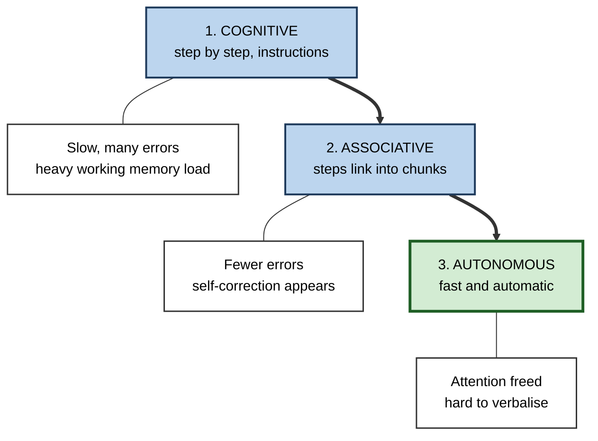
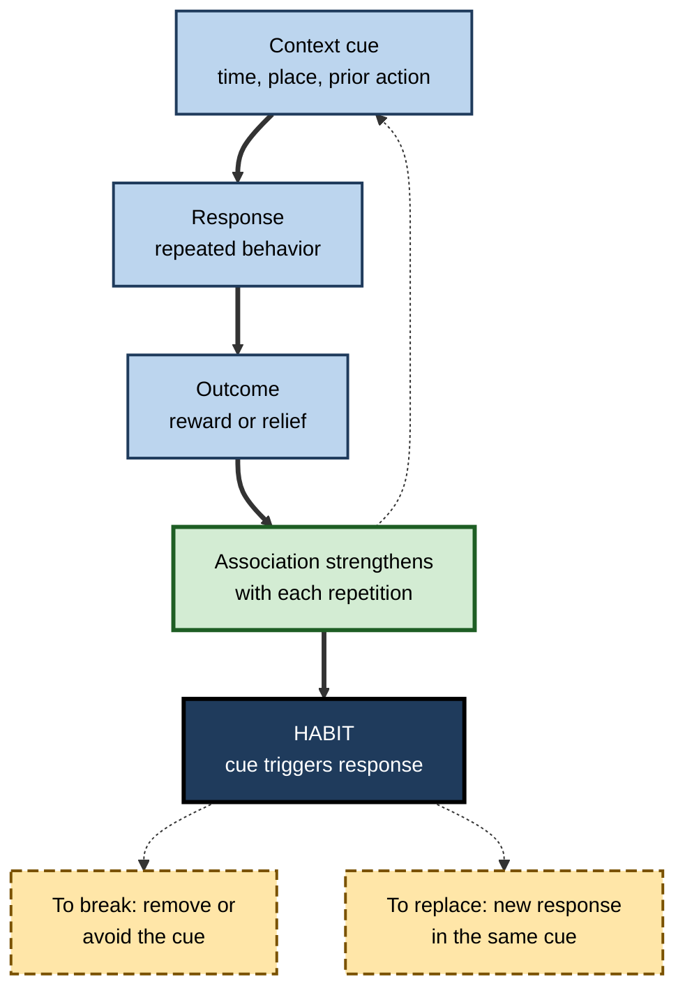

# F.5. Procedural Memory: Skills and Habits

> **In one sentence:** Procedural memory is the "knowing how" that lets you perform skills and habits — typing, driving, debugging, presenting — smoothly and without thinking through each step.
>
> **Why it matters:** Fluent professional performance runs on procedural memory. Understanding how skills become automatic, why they decay, and how habits form and break lets you practise efficiently, train others, and protect skills that automation and AI may quietly erode.
>
> **Level span:** Novice → Expert · **Reading time:** ~17 min · **Builds on:** explicit versus implicit memory

---

## The Learning Ladder

| Level | Badge | After this level you can... |
|---|---|---|
| 1 | NOVICE | Explain what procedural memory is and how "knowing how" differs from "knowing that". |
| 2 | FOUNDATIONS | Describe the three stages of skill learning and the difference between skills and habits. |
| 3 | PRACTITIONER | Plan practice that builds a skill and form or break a workplace habit. |
| 4 | ADVANCED | Explain the brain systems involved, proceduralisation, skill decay, choking under pressure, and the debate over human habits. |
| 5 | EXPERT / PRO | Design skill programmes, protect skills against automation-driven decay, and use habit design ethically. |

---

## Level 1 · Novice — The Big Picture

Think about tying your shoelaces. You can do it in seconds, in the dark, while talking. Now try to explain it in words to someone who has never done it. It is surprisingly hard. The knowledge is real, but it lives in your hands and your timing, not in sentences. That is **procedural memory**: memory for *how* to do things.

The philosopher Gilbert Ryle captured the idea as **knowing how** versus **knowing that**. You can know *that* a bicycle stays up because of steering corrections, and still fall off. Or you can ride perfectly with no idea of the physics.

An analogy: learning a skill is like turning a written recipe into muscle memory. At first you read every line and measure every spoon. After enough repetitions, you cook without the recipe — and if someone asks for it, you have to watch yourself cook to write it down.

You have already experienced procedural memory when:

- You typed a password with ease but had to "type it in the air" to say it aloud.
- You drove home and arrived with no memory of the route — the driving ran on autopilot.
- Your fingers reached for a keyboard shortcut from your old software after switching to a new tool.

The last example points to **habits**: procedural responses triggered automatically by a situation, sometimes even when you no longer want them.

---

## Level 2 · Foundations — Core Concepts

### Skills and habits

| | Skill | Habit |
|---|---|---|
| **What it is** | A learned ability to perform a task well | An automatic response triggered by a context cue |
| **Example** | Writing SQL, giving a presentation, touch-typing | Checking email on opening the laptop; running tests before every commit |
| **Driven by** | A goal you choose to pursue | The cue itself, increasingly independent of the goal |
| **Key property** | Fluency, accuracy, adaptability | Automaticity, low effort, persistence |

Many professional routines are both: a skilled engineer has the *skill* of writing tests and, ideally, the *habit* of doing so.

### Three stages of skill learning

Paul Fitts and Michael Posner's 1967 model remains the most used description:

1. **Cognitive stage** — you think about every step, rely on instructions, make many errors and progress quickly. Working memory is heavily loaded.
2. **Associative stage** — steps link into smooth sequences; errors fall; you detect and correct your own mistakes.
3. **Autonomous stage** — performance is fast, accurate and largely automatic, freeing attention for strategy or other tasks.

**Figure F.5-1 — From effortful steps to automatic skill.**

*How to read it:* the thick arrows show progress through practice; white boxes describe what performance feels like at each stage.

### Key terms

| Term | Plain meaning |
|---|---|
| **Procedural memory** | Memory for how to perform skills and routines. |
| **Automaticity** | Performing with little conscious attention or effort. |
| **Habit** | An automatic response triggered by a familiar context. |
| **Proceduralisation** | Converting step-by-step instructions into fluent procedures. |
| **Deliberate practice** | Focused practice on specific weaknesses with feedback, usually designed by a coach. |
| **Skill decay** | Loss of skill after a period without use. |
| **Choking** | Performance breakdown under pressure. |

---

## Level 3 · Practitioner — Putting It to Work

### Building a skill: the practice design loop

1. **Break the skill into parts.** Separate components that can be practised alone (for presenting: openings, transitions, handling questions).
2. **See a model.** Watch an expert or a worked example, so the cognitive stage has a clear target.
3. **Practise short and focused.** Work on one component at the edge of your ability, not the parts you already do well.
4. **Get fast, specific feedback.** A recording, a reviewer, a test suite, a metric. Without feedback, practice entrenches errors.
5. **Vary the practice.** Change the conditions (different audiences, datasets, problems) so the skill generalises rather than becoming tied to one situation.
6. **Space it.** Several short sessions over days beat one long session, for both skill retention and fatigue.
7. **Integrate.** Recombine the parts in realistic whole tasks.

### Forming a workplace habit

Habits form when the **same response** is repeated in the **same context** until the context alone triggers it.

1. **Choose a stable cue.** A fixed time, place or preceding action ("after I open a pull request...").
2. **Define a tiny, specific response.** "...I re-read my own diff once." Make it easy at first.
3. **Repeat in the same context.** Consistency matters more than intensity.
4. **Reduce friction.** Make the behavior easier (template ready, tool open) and the alternative harder.
5. **Expect weeks to months.** In Phillippa Lally and colleagues' 2010 study, the median time to reach automaticity for a simple daily behavior was about 66 days, with a very wide range between people and behaviors. Later reviews confirm that habit formation commonly takes around two months or more and varies widely. Missing a single day did not derail the process.

**Figure F.5-2 — How a habit loop forms and how to break one.**

*How to read it:* the thick loop shows repetition building a habit; dashed-border boxes are the two evidence-based ways to change one.

### Worked example — code review habit

| | Before | After |
|---|---|---|
| **Goal** | "Review my own code more carefully." | Cue: opening a pull request. Response: read the diff once top to bottom before requesting review. |
| **Support** | Good intentions. | Pull-request template includes a "self-reviewed" checkbox. |
| **Duration** | Forgotten after a week. | Done consistently; automatic within a couple of months. |
| **Result** | Reviewers keep finding trivial issues. | Trivial review comments drop; reviewers focus on design. |

### Common mistakes

- **Practising what you are already good at.** Comfortable repetition feels productive but adds little.
- **No feedback.** Practice without feedback can automate mistakes.
- **Blocked, unvaried practice** produces skills tied to one context.
- **Relying on motivation for habits.** Habits run on cues and repetition, not willpower.
- **Fighting a bad habit in the same environment.** Changing the cue is usually easier than resisting it.

---

## Level 4 · Advanced — Mechanisms, Models & Evidence

### Brain systems

Procedural learning relies heavily on loops between the cortex and the **basal ganglia** (especially the striatum), and on the **cerebellum**, which fine-tunes timing and error correction. As skills become automatic, control shifts from associative regions of the striatum, linked to goal-directed action, toward sensorimotor regions linked to habitual action. Dopamine signals that report better-or-worse-than-expected outcomes help stamp in successful actions. Patients with amnesia can learn new motor skills, while patients with basal ganglia disorders can show the reverse pattern — key evidence that procedural memory is partly separate from explicit memory.

### Proceduralisation in cognitive skills

John Anderson's ACT-R theory describes how cognitive skills — algebra, programming, diagnosis — move from **declarative** knowledge (rules you look up or recall) to **procedural** knowledge (condition–action rules that fire automatically). The **power law of practice** describes how speed improves quickly at first and then ever more slowly with further practice. This is why a few weeks of practice can transform a novice, while experts need targeted, effortful practice to keep improving.

### How much does practice explain?

Anders Ericsson's 1993 work made **deliberate practice** famous and was popularised as a "10,000-hour rule" that Ericsson himself disputed. A 2014 meta-analysis by Macnamara, Hambrick and Oswald found deliberate practice explained a meaningful but modest share of performance differences, larger in predictable activities like games and music and smaller in professions. Practice matters a great deal; it is not the whole story. Starting knowledge, working memory, coaching quality and opportunity also matter.

### Skill decay

Skills fade with disuse. Meta-analytic work on training retention has found that decay is greater with longer periods of non-use, and that cognitive and procedurally complex skills — especially those with many steps that must be done in order, like emergency procedures — decay faster than continuous motor skills like cycling. **Overlearning** (practising beyond first success) and spaced refreshers slow decay. This matters for rare, high-stakes tasks: disaster recovery, CPR, manual flying, incident command.

### Automation and deskilling

When automation performs a skill, people practise it less. Aviation research has documented erosion of manual flying and cognitive flight skills among pilots who rely heavily on automation, and regulators encourage regular manual practice. The same logic applies to AI coding assistants, spreadsheet automation and navigation apps: performance is maintained by the tool while the underlying procedural skill may decay. Evidence for AI-specific deskilling is still emerging and mixed, but the mechanism — less practice, less skill — is well established.

### Choking under pressure

Sian Beilock and colleagues found that pressure can make skilled performers worse through two routes: **explicit monitoring** (paying step-by-step attention to an automated skill, disrupting it) and **distraction** (worries consuming working memory needed for effortful tasks). Experts tend to choke via the first; novices via the second. Practising under mild pressure and using pre-performance routines helps.

### The human habit debate

Animal research distinguishes **goal-directed** actions, which stop when the outcome is no longer valued, from **habits**, which continue anyway. Demonstrating the same overtraining-driven habits cleanly in human laboratory studies has proven surprisingly difficult, and some well-known findings have not replicated. Field research on everyday habits, by Wendy Wood and colleagues, nonetheless finds that a large share of daily behavior is repeated in stable contexts and that habits predict behavior when intentions change. The current view: habits are real and important in daily life, but the lab mechanisms in humans are still being worked out.

---

## Level 5 · Expert / Pro — Professional Mastery

### Designing skill programmes

| Design element | Why | Example |
|---|---|---|
| **Worked examples, then faded guidance** | Supports the cognitive stage without overload | Show three solved queries, then partially solved, then blank |
| **Deliberate practice on weak components** | Practice where improvement is possible | Sales reps drill only the objection they handle worst |
| **Simulation and rehearsal** | Practise rare, high-stakes skills safely | Game days for outages; mock negotiations |
| **Spaced refreshers for rare skills** | Counter decay | Quarterly disaster-recovery drills |
| **Feedback built into tools** | Fast correction | Linters, test suites, call-scoring rubrics |

### Protecting skills in the age of AI

- **Identify critical skills that tools perform.** Which skills must people retain to supervise the tool, take over when it fails, or spot its errors?
- **Schedule unassisted practice.** "Manual mode" exercises — debugging without the assistant, writing a first draft alone, mental estimation before using a model.
- **Make novices do the reps.** The cognitive and associative stages require effortful practice. Tools that skip these stages for novices risk producing people who cannot perform without them.
- **Measure unassisted performance periodically**, as aviation does with manual flying checks.

### Habit design at work — and its ethics

Organisations shape habits through defaults, templates, checklists and tool design. Used well, this makes good practice automatic (secure defaults, pre-commit hooks, meeting agendas). Used badly, it creates compulsive behaviors (constant notification checking). A professional test: would the person endorse the habit if they understood how it was designed?

### Professional scenario

**Role:** Engineering director at a company that adopted AI coding assistants a year ago.
**Situation:** Throughput is up, but the on-call team reports that junior engineers struggle to debug production issues without the assistant, and several could not trace a memory leak manually.
**What the pro does:** Defines three critical skills that must stay in people's heads: reading stack traces, reasoning about concurrency, and profiling. Introduces monthly "unassisted debugging" exercises on recorded incidents, pairs juniors with seniors on live incidents, and requires juniors to write a hypothesis before asking the assistant. She tracks time-to-diagnosis in drills, not lines of code produced.

---

## Myths vs. Evidence

| Myth | What the evidence shows |
|---|---|
| "It takes 21 days to form a habit." | A key study found a median of about 66 days, with very large individual differences; reviews confirm wide ranges. |
| "10,000 hours makes anyone an expert." | Deliberate practice matters, but explains only part of performance differences, and the number was a popularisation. |
| "Practice makes perfect." | Practice without feedback can make errors permanent; well-designed practice makes progress. |
| "Once learned, skills never fade." | Continuous motor skills are durable, but complex procedural and cognitive skills decay without use. |
| "Thinking carefully about each step always improves performance." | For automated skills, step-by-step monitoring under pressure can cause choking. |
| "Habits are just a lack of willpower." | Habits are cue-driven; changing the context is more effective than relying on willpower. |

## Practitioner Toolkit

**Skill-practice plan template**

| Skill component | Current weakness | Practice task | Feedback source | Sessions planned | Unassisted check date |
|---|---|---|---|---|---|
| | | | | | |

**Habit design checklist**

- [ ] Specific cue chosen (time, place or prior action).
- [ ] Response small and clearly defined.
- [ ] Friction reduced for the new behavior and increased for the old one.
- [ ] Repetition tracked daily for at least two months.
- [ ] A missed day is followed by resuming, not quitting.

**Critical-skill protection checklist (for teams using automation or AI)**

- [ ] Skills needed to supervise and override tools identified.
- [ ] Regular unassisted practice scheduled.
- [ ] Novices required to attempt before using assistance.
- [ ] Unassisted performance measured periodically.

## Self-Check

1. **[NOVICE]** What is the difference between knowing how and knowing that?
2. **[FOUNDATIONS]** Name and describe the three stages of skill learning.
3. **[FOUNDATIONS]** How does a habit differ from a skill?
4. **[PRACTITIONER]** Why does varied practice help skills generalise?
5. **[PRACTITIONER]** What did Lally and colleagues find about habit formation?
6. **[ADVANCED]** Which brain structures are central to procedural memory?
7. **[ADVANCED]** Why might an expert choke under pressure?
8. **[ADVANCED]** Which kinds of skills decay fastest?
9. **[EXPERT / PRO]** How would you protect critical skills in a team that relies on AI tools?

### Answer Key

1. Knowing how is the ability to perform a skill; knowing that is factual knowledge you can state.
2. Cognitive (step by step, effortful), associative (steps link, errors fall), autonomous (fast, automatic, attention freed).
3. A skill is an ability used in pursuit of a goal; a habit is an automatic response triggered by a context cue, increasingly independent of the goal.
4. It ties the skill to the underlying principles rather than to one set of conditions, so it transfers to new situations.
5. Reaching automaticity took a median of about 66 days, with very wide variation; missing a single day did not derail it.
6. The basal ganglia (especially striatum) and the cerebellum, working with motor and other cortex.
7. Explicit monitoring — paying step-by-step attention to an automated skill disrupts it.
8. Complex cognitive and procedural skills with many ordered steps, especially when rarely used.
9. Identify critical skills, schedule unassisted practice, require attempts before assistance, and measure unassisted performance.

## Key Takeaways

- Procedural memory stores **how** to do things; it is fast, durable and hard to put into words.
- Skills pass through **cognitive, associative and autonomous** stages.
- **Habits** form through repeated responses in stable contexts — typically over **months**, not 21 days.
- Good practice is **focused, varied, spaced and fed back**; practice without feedback entrenches errors.
- Complex, rarely used skills **decay**; automation and AI can quietly accelerate decay by removing practice.
- Protect critical skills with **unassisted practice and measurement**.

## Glossary

| Term | Meaning |
|---|---|
| ACT-R | A cognitive architecture describing how declarative knowledge becomes procedural. |
| Automaticity | Performance requiring little attention or effort. |
| Basal ganglia | Deep brain structures central to action selection, skill and habit learning. |
| Cerebellum | A brain structure that fine-tunes movement timing and error correction. |
| Choking | Performance failure under pressure. |
| Deliberate practice | Effortful practice on specific weaknesses with feedback. |
| Explicit monitoring | Conscious attention to the steps of an automated skill. |
| Goal-directed action | Behavior controlled by its expected outcome. |
| Habit | A response automatically triggered by a context cue. |
| Overlearning | Continuing practice after first reaching criterion. |
| Power law of practice | Rapid early improvement that slows with further practice. |
| Proceduralisation | Conversion of declarative rules into automatic procedures. |
| Skill decay | Loss of skill through disuse. |
