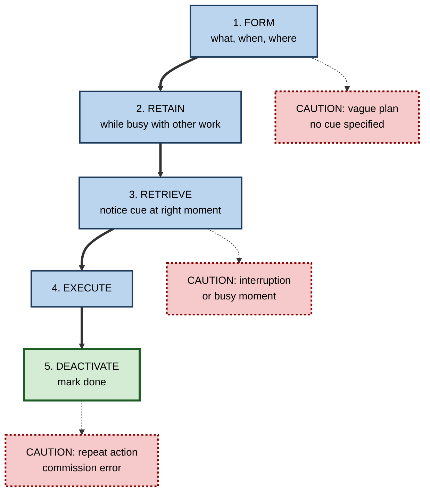
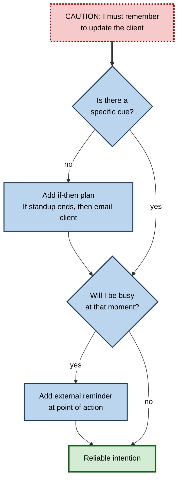

# F.6. Prospective Memory: Future Intentions

> **In one sentence:** Prospective memory is remembering to do something at the right moment in the future — send the file after the meeting, call the client at 3 p.m., remove the test flag before release.
>
> **Why it matters:** A large share of everyday and workplace memory failures are not forgetting *what* you know but forgetting *to act*. In aviation, medicine and software operations, missed intentions cause serious incidents. The fixes — good cues, if-then plans and reminders — are simple and well-evidenced.
>
> **Level span:** Novice → Expert · **Reading time:** ~16 min · **Builds on:** the idea of retrieval cues

---

## The Learning Ladder

| Level | Badge | After this level you can... |
|---|---|---|
| 1 | NOVICE | Explain what prospective memory is and recognise its everyday failures. |
| 2 | FOUNDATIONS | Distinguish event-based from time-based intentions and describe the phases of an intention. |
| 3 | PRACTITIONER | Use if-then plans, cue design and reminders to stop dropping tasks. |
| 4 | ADVANCED | Explain monitoring versus spontaneous retrieval, interruptions, ageing effects and the evidence behind implementation intentions. |
| 5 | EXPERT / PRO | Design systems, checklists and tools that protect teams from prospective memory failures. |

---

## Level 1 · Novice — The Big Picture

Most memory you think about looks backward: remembering a name, a fact, an event. **Prospective memory** looks forward. It is remembering to carry out an intention at the right time: buying milk on the way home, taking medicine with breakfast, mentioning a risk at the end of a meeting.

What makes it tricky is that **nobody asks you**. With ordinary memory, a question ("What's her name?") prompts you to search. With prospective memory, you have to remember *by yourself*, at the right moment, usually while busy with something else.

An analogy: an intention is like a sticky note you put in your head. The note does not help unless something makes you look at it at the right moment. Prospective memory is mostly about **arranging for that something to happen**.

You have already experienced this when:

- You walked past the shop and only remembered the milk when you got home.
- You meant to mention an issue at the end of a call and remembered just after hanging up.
- You forgot to attach the file you said you were attaching.

---

## Level 2 · Foundations — Core Concepts

### Two kinds of intention

| Type | Triggered by | Example | Typical failure |
|---|---|---|---|
| **Event-based** | An event or cue in the environment | "When I see Priya, tell her about the budget." | Cue is missed while busy |
| **Time-based** | A clock time or elapsed time | "At 3 p.m., call the supplier." | Forgetting to check the time |
| **Activity-based** | Finishing or starting an activity | "After the meeting, send the notes." | Moving straight to the next activity |

Event-based intentions are usually easier because the environment supplies a cue. Time-based intentions depend on you to self-start and to check the clock.

### Phases of an intention

1. **Form the intention** — decide what to do and when or where.
2. **Retain it** — keep it stored while you do other things (the **retention interval**).
3. **Retrieve it** — notice the cue and remember the intention at the right moment.
4. **Execute it** — actually carry it out.
5. **Deactivate it** — mark it done, so you do not repeat it.

**Figure F.6-1 — The life cycle of an intention and where it fails.**

*How to read it:* the thick path is a successful intention; dotted-border boxes show the typical failure at each phase.

### Key terms

| Term | Plain meaning |
|---|---|
| **Prospective memory** | Remembering to perform an intended action in the future. |
| **Retrospective memory** | Remembering past information — the "what" of the intention. |
| **Event-based intention** | Triggered by an event or cue. |
| **Time-based intention** | Triggered by a time or elapsed duration. |
| **Ongoing task** | The work you are busy with while an intention waits. |
| **Implementation intention** | An if-then plan: "If situation X, then I will do Y." |
| **Commission error** | Carrying out an intention again when it is no longer needed. |

---

## Level 3 · Practitioner — Putting It to Work

The research-backed principle: **don't rely on remembering to remember.** Turn time-based intentions into event-based ones, make cues specific and distinctive, and use external reminders that arrive at the moment of action.

### The CUE method for reliable intentions

1. **Convert time to event.** "Call the supplier at 3 p.m." becomes "When my 3 p.m. alarm rings, call the supplier" — the alarm is the event.
2. **Use an if-then plan.** Phrase intentions as "If [specific cue], then I will [specific action]". Picture the cue happening.
3. **Externalise at the point of action.** Put the reminder where the action happens: a sticky note on the laptop, a comment in the code, a calendar item with the dial-in, an item in the deployment checklist.
4. **Make cues distinctive.** A reminder that looks like every other notification will be ignored. Use specific wording, placement or timing.
5. **Protect against interruptions.** When interrupted mid-task, leave a visible marker of what remains ("NEXT: remove debug flag").
6. **Close the loop.** Tick or delete the item when done to prevent repeats.

**Figure F.6-2 — Turning a fragile intention into a reliable one.**

*How to read it:* start from a vague intention at the top; each question adds a safeguard until you reach the thick-bordered reliable intention.

### Worked example — the release flag

| | Before | After |
|---|---|---|
| **Intention** | "Remember to turn off the debug logging before release." | "If I open the release checklist, then I check debug logging." |
| **Support** | Memory alone. | Item added to the release checklist; a code comment `TODO-RELEASE` that the CI pipeline flags. |
| **Interruption** | Pulled into an incident mid-task; forgets. | Pipeline blocks release until the flag is cleared. |
| **Result** | Debug logs leak sensitive data in production. | No reliance on remembering. |

### Common mistakes

- **Vague intentions.** "I'll deal with it later" names no cue.
- **Reminders far from the action.** A to-do list you only read on Mondays cannot trigger Wednesday's action.
- **Too many indistinct reminders.** Notification overload teaches you to ignore them.
- **Trusting yourself after interruptions.** Interruptions are the top cause of dropped intentions in safety-critical work.

---

## Level 4 · Advanced — Mechanisms, Models & Evidence

### How intentions get retrieved

Mark McDaniel and Gilles Einstein's **multiprocess framework** (2000) proposes two routes:

- **Strategic monitoring** — actively checking the environment for the cue. Reliable but costly: it slows the ongoing task and drains attention.
- **Spontaneous retrieval** — the cue triggers the intention automatically, with little cost, provided the cue is **focal** (processed as part of what you are already doing) and strongly associated with the intention.

Rebekah Smith's **preparatory attentional and memory processes** theory argues that some resource-demanding preparation is always needed. Experiments measuring slowing of the ongoing task show that monitoring costs are common, but that spontaneous retrieval also occurs, especially for focal, distinctive cues. The practical upshot: **design focal, distinctive cues** so people do not have to monitor.

### Why implementation intentions work

Peter Gollwitzer's **implementation intentions** — if-then plans — link a specific cue to a specific response in memory, making the cue more accessible and the response more automatic when it appears. Meta-analyses have found medium effects on prospective memory in healthy young adults, with combined verbal and imagery plans performing somewhat better, and medium-to-large effects in older adults. A 2024 meta-analysis covering over 600 tests of implementation intentions across behaviors confirmed broad benefits and examined which plan components matter. Effects are smaller for complex goals that need ongoing motivation rather than a single triggered action.

### Interruptions and deferred tasks

Studies of pilots, nurses and other professionals — notably the work of Key Dismukes and colleagues in aviation — show that many errors come from deferred or interrupted tasks: a checklist item postponed until "after this call", then never resumed. Interruptions break the cue chain that would normally trigger the next step. Resumption cues, such as leaving a hand on the checklist item or a visible marker, reduce these errors.

### Ageing

In the laboratory, older adults often perform worse on prospective memory tasks, especially time-based ones that demand self-initiated monitoring. In everyday life, however, older adults often perform as well or better — the **age-prospective memory paradox** — likely because they use more external reminders, have more structured routines and are more motivated to remember.

### Unfinished tasks

The **Zeigarnik effect** — the claim, from Bluma Zeigarnik's 1920s studies, that people remember unfinished tasks better than finished ones — is widely cited in productivity writing. Its replication record is weak. Recent meta-analytic work did not find a reliable general memory advantage for unfinished tasks, though people do show a tendency to resume interrupted tasks. Treat claims about "open loops occupying the mind" as plausible but not settled; the reliable, evidence-based advice is to externalise intentions in a trusted system.

### Commission errors

Once an intention is completed, it should be deactivated. People sometimes perform it again (re-sending an email, double-dosing medication), especially when the cue reappears and working memory is loaded. A 2024 study found that forming a new intention can reduce such commission errors, suggesting that explicitly "closing" or replacing an intention helps.

### Offloading intentions

Research on **intention offloading** — setting reminders in external tools — shows that offloading reliably improves prospective memory performance. People tend to under-use reminders when they are overconfident in their memory, and over-use them when they are underconfident. Offloading also frees working memory, which can help other tasks.

---

## Level 5 · Expert / Pro — Professional Mastery

### System design against prospective memory failure

| Domain | Typical failure | Design countermeasure |
|---|---|---|
| **Aviation** | Missed checklist item after interruption | Read-do checklists, explicit resumption points, crew cross-checks |
| **Healthcare** | Medication not given, surgical item left in patient | Electronic medication administration alerts, surgical counts, time-outs |
| **Software operations** | Feature flag left on, certificate expiry missed | Pipeline gates, automated expiry alerts, release checklists |
| **Consulting and sales** | Follow-up not sent after meeting | Templates that create follow-up tasks when notes are saved |
| **Management** | Promised feedback never delivered | Calendar-scheduled one-to-one agenda with action carry-over |

Principles that generalise:

- **Put the cue in the workflow, not in someone's head.**
- **Make the system block or prompt at the point of action** where stakes are high.
- **Design for interruptions**: assume people will be interrupted and give them resumption cues.
- **Avoid alert fatigue**: fewer, more specific alerts beat many generic ones.

### AI-era implications

AI assistants increasingly act as prospective memory aids: summarising meetings into action items, nudging about commitments, scheduling follow-ups. Benefits are real, but three cautions apply. First, extracted action items can be wrong or incomplete; owners should confirm them. Second, delegating all intentions to a tool can mean nobody owns the commitment. Third, too many automated nudges recreate alert fatigue.

### Professional scenario

**Role:** Engagement manager at a consulting firm.
**Situation:** Clients complain that promised follow-ups — data requests, revised slides — arrive late or not at all. Consultants say they "just forgot" amid back-to-back meetings.
**What the pro does:** Introduces a rule that every client meeting ends with a two-minute read-back of actions with owners and dates, captured live in the shared tracker. The AI meeting summary is reconciled against the read-back, not used alone. Each action creates a dated task in the owner's calendar. Missed follow-ups fall sharply, and the client's perception of reliability improves — without anyone "trying harder to remember".

---

## Myths vs. Evidence

| Myth | What the evidence shows |
|---|---|
| "Forgetting to do things means you have a bad memory." | Prospective memory failures are common in everyone; they reflect cue and attention demands. |
| "Writing it down somewhere is enough." | Reminders work when they appear at the right moment and place. |
| "Unfinished tasks are automatically remembered better." | The Zeigarnik memory advantage has a weak replication record. |
| "Older adults always forget intentions more." | In daily life, older adults often do as well or better, partly through better use of reminders. |
| "Trying harder to remember is the fix." | Specific if-then plans and external cues outperform effort alone. |
| "More reminders are always better." | Alert overload leads to reminders being ignored. |

## Practitioner Toolkit

**Intention checklist**

- [ ] Intention has a specific cue (event, not just a time).
- [ ] Written as "If ___, then I will ___."
- [ ] Reminder placed at the point of action.
- [ ] Reminder is distinctive, not lost among routine alerts.
- [ ] Resumption marker used when interrupted.
- [ ] Item closed when done.

**Template — end-of-meeting action read-back**

| Action | Owner | If-then trigger | Due | Reminder location | Done |
|---|---|---|---|---|---|
| | | | | | |

## Self-Check

1. **[NOVICE]** What is prospective memory and why is it harder than answering a question?
2. **[FOUNDATIONS]** What is the difference between event-based and time-based intentions?
3. **[FOUNDATIONS]** Name the five phases of an intention.
4. **[PRACTITIONER]** Rewrite "I'll update the dashboard later" as an implementation intention.
5. **[PRACTITIONER]** Why are interruptions dangerous for prospective memory?
6. **[ADVANCED]** What are the two retrieval routes in the multiprocess framework?
7. **[ADVANCED]** What is the age-prospective memory paradox?
8. **[EXPERT / PRO]** How would you reduce missed follow-ups in a client-facing team?

### Answer Key

1. Remembering to act at the right future moment; it is hard because nobody prompts you — you must self-initiate retrieval while busy.
2. Event-based intentions are triggered by a cue in the environment; time-based depend on you checking the time.
3. Form, retain, retrieve, execute, deactivate.
4. For example: "If I close the weekly metrics email, then I update the dashboard."
5. They break the chain of cues that would trigger the next step, so deferred actions are not resumed.
6. Strategic monitoring (actively checking for the cue) and spontaneous retrieval (the cue automatically triggers the intention).
7. Older adults do worse on lab tasks but often as well or better in everyday life.
8. Capture actions with owners during the meeting, create dated tasks at the point of action, reconcile AI summaries against a read-back, and avoid generic alert overload.

## Key Takeaways

- Prospective memory is **remembering to act** — without anyone asking you.
- **Event-based** intentions are easier than **time-based**; convert time to events.
- **If-then plans** reliably improve follow-through.
- **Interruptions** are a leading cause of dropped intentions; use resumption cues.
- **External reminders at the point of action** beat trying harder.
- In high-stakes work, **design the system** — checklists, gates, alerts — so safety does not depend on remembering.

## Glossary

| Term | Meaning |
|---|---|
| Age-prospective memory paradox | Older adults' lab deficits alongside good everyday prospective memory. |
| Alert fatigue | Desensitisation to frequent alerts, leading to ignored warnings. |
| Commission error | Repeating an intention that has already been completed. |
| Event-based intention | An intention triggered by a cue. |
| Focal cue | A cue processed as part of the ongoing task. |
| Implementation intention | An if-then plan linking a cue to an action. |
| Intention offloading | Using external tools to remember intentions. |
| Multiprocess framework | The view that intentions are retrieved by monitoring or spontaneously. |
| Ongoing task | The activity you are busy with while an intention waits. |
| Prospective memory | Remembering to carry out future intentions. |
| Resumption cue | A marker that helps you return to an interrupted task. |
| Strategic monitoring | Actively checking for a prospective memory cue. |
| Time-based intention | An intention triggered by a time or duration. |
| Zeigarnik effect | The contested claim that unfinished tasks are better remembered. |
