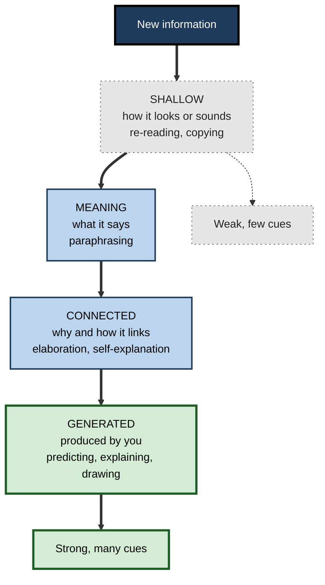
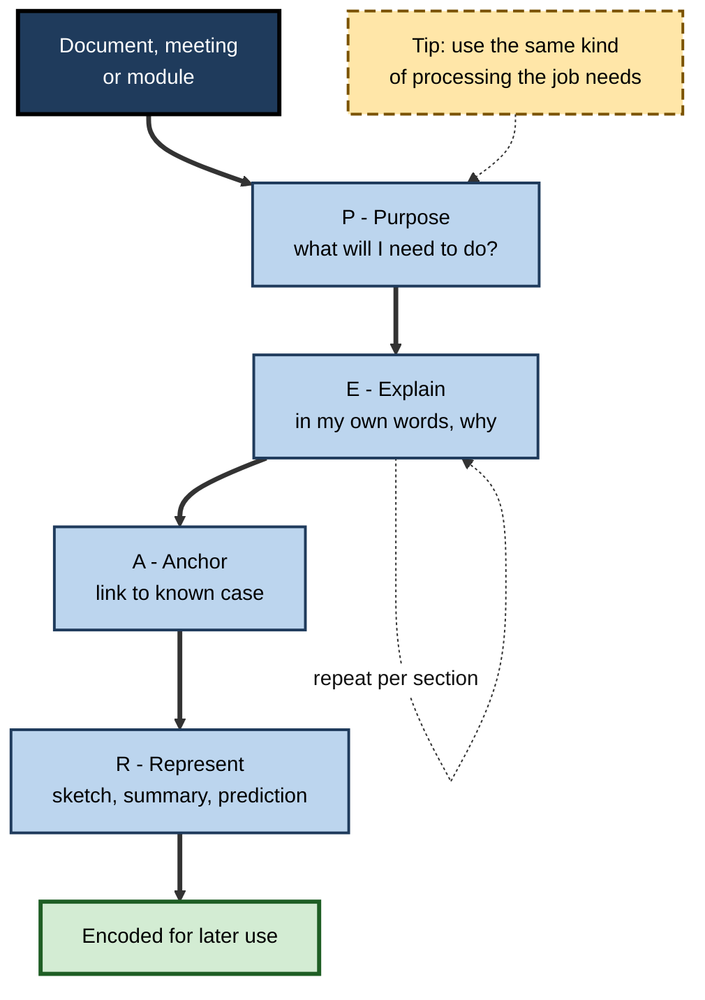

# F.7. Memory Encoding Strategies

> **In one sentence:** Encoding strategies are ways of processing information while you take it in — thinking about its meaning, linking it to what you know, generating, explaining, picturing or organising it — so that it is stored in a form you can find again later.
>
> **Why it matters:** Two people can read the same document for the same time and remember very different amounts. The difference is mostly *how* they processed it. Good encoding is the cheapest memory improvement available, and it shapes every meeting, training session and document you design.
>
> **Level span:** Novice → Expert · **Reading time:** ~17 min · **Builds on:** encoding, storage and retrieval

---

## The Learning Ladder

| Level | Badge | After this level you can... |
|---|---|---|
| 1 | NOVICE | Explain why thinking about meaning beats repeating something over and over. |
| 2 | FOUNDATIONS | Name the main evidence-based encoding strategies and what each does. |
| 3 | PRACTITIONER | Choose and apply the right strategy for a reading, meeting or training task. |
| 4 | ADVANCED | Explain levels of processing, transfer-appropriate processing, distinctiveness, and which popular claims are contested. |
| 5 | EXPERT / PRO | Design materials and sessions that make good encoding happen for others, including with AI tools. |

---

## Level 1 · Novice — The Big Picture

Imagine reading the same paragraph twice. The first time, you skim it while thinking about lunch. The second time, you stop and ask, "Why would that be true? Where have I seen this at work?" A week later, you will remember far more from the second reading. The words were the same; what you **did with them in your head** was different.

**Encoding** is the moment information goes into memory. The key insight is that memory keeps a record of the *processing* you did, not of the information itself. If you only processed how the words looked, that is all memory has. If you processed what they meant and connected them to your life, memory has many more hooks.

An analogy: putting a book into a huge library. If you drop it on the nearest shelf, you will never find it again. If you catalogue it under its subject, link it to related books and note why it matters, it can be found from many starting points.

You have already experienced this when:

- You remembered a colleague's name better after learning they grew up in the same city as you.
- You remembered a concept better after explaining it to someone than after reading it.
- You could not recall a single bullet point from a slide deck you "watched" while answering emails.

---

## Level 2 · Foundations — Core Concepts

### The core strategies

| Strategy | What you do | Why it helps | Work example |
|---|---|---|---|
| **Meaning-focused (deep) processing** | Think about what it means and why | Creates rich, meaning-based traces | Ask "what problem does this policy solve?" |
| **Elaboration** | Add detail, causes, examples, links to prior knowledge | Multiplies retrieval routes | Relate a new API pattern to one you know |
| **Self-explanation / elaborative interrogation** | Explain each step to yourself; ask "why?" | Reveals gaps, builds causal links | Explain why each line of a worked example is there |
| **Generation** | Produce the answer or idea rather than reading it | Effortful production strengthens memory | Predict the next step before reading it |
| **Self-reference** | Relate the material to yourself | The self is a rich, well-organised knowledge structure | "When would I have used this last month?" |
| **Dual coding** | Combine words with a visual | Two linked codes, two routes | Sketch the architecture while reading the design doc |
| **Organisation and chunking** | Group items into meaningful categories | Structure aids retrieval | Group 20 risks into five themes |
| **Mnemonics** | Use imagery, places or acronyms | Attach arbitrary items to strong structures | Method of loci for a speech's key points |

**Figure F.7-1 — From shallow to deep encoding.**

*How to read it:* moving down means deeper, more active processing; the sparse-dotted grey boxes mark weak encoding, the thick-bordered boxes strong encoding.

### Key terms

| Term | Plain meaning |
|---|---|
| **Encoding** | Processing information so it enters long-term memory. |
| **Levels of processing** | The idea that deeper, meaning-based processing produces stronger memories. |
| **Elaboration** | Adding connections and detail to new information. |
| **Generation effect** | Better memory for information you produce than for information you read. |
| **Self-reference effect** | Better memory for information related to yourself. |
| **Dual coding** | Representing information both verbally and visually. |
| **Distinctiveness** | How much a memory stands out from similar ones. |
| **Transfer-appropriate processing** | Memory is best when the processing at study matches the processing at test. |

---

## Level 3 · Practitioner — Putting It to Work

### The PEAR routine for any important input

Use it for a technical document, a meeting, a course module or a client briefing.

1. **Purpose** — Before starting, write the question you need answered or the task you must perform afterwards. This sets what deep processing should focus on, and aligns encoding with later use.
2. **Explain** — Every few paragraphs or minutes, pause and explain the main point in your own words, including *why* it is true.
3. **Anchor** — Link it to something you know: an earlier project, a familiar analogy, a contrasting case.
4. **Represent** — Produce something: a sketch, a short summary from memory, a prediction, a question for the author.

**Figure F.7-2 — The PEAR encoding routine.**

*How to read it:* the thick path runs once per input; the dotted loop shows Explain repeating per section; the dashed box is a guiding tip.

### Worked example — reading an architecture decision record

| | Before | After (PEAR) |
|---|---|---|
| **Purpose** | None; reads because it was shared. | "I need to judge whether our service can adopt this event bus." |
| **Processing** | Reads top to bottom, highlights phrases. | Pauses after each section to explain the trade-off and why it was chosen. |
| **Anchoring** | None. | "This is like the queue we used for billing, but with replay." |
| **Representing** | None. | Sketches the data flow from memory; writes two questions for the author. |
| **A week later** | "It was about Kafka, I think." | Can explain the decision, its main trade-off and how it affects her service. |

### Choosing a strategy

| If the material is... | Prefer... |
|---|---|
| Concepts and principles | Self-explanation, elaboration, contrasting examples |
| Processes and systems | Dual coding: draw it; then explain the drawing |
| Arbitrary lists, codes, names | Mnemonics, chunking, self-reference |
| A skill | Generation: attempt before seeing the solution, then compare |
| A meeting | Purpose plus a closing summary in your own words |

### Common mistakes

- **Highlighting and re-reading** as the main strategy — both feel productive but involve little deep processing.
- **Verbatim note-taking** — transcribing without paraphrasing processes words, not meaning.
- **Multitasking** — divided attention at encoding sharply reduces later memory; it is one of the most reliable findings in memory research.
- **Mismatched processing** — memorising definitions when the job will require applying concepts to cases.

---

## Level 4 · Advanced — Mechanisms, Models & Evidence

### Levels of processing and its limits

Fergus Craik and Robert Lockhart's 1972 **levels-of-processing** framework, supported by Craik and Tulving's 1975 experiments, showed that judging a word's meaning ("Is it a type of fish?") produced far better later memory than judging its appearance ("Is it in capital letters?") or sound ("Does it rhyme with...?"). Two refinements followed:

- **"Depth" is hard to measure independently**, which made the original framework somewhat circular. Later work replaced it with more specific ideas: elaboration and distinctiveness.
- **Transfer-appropriate processing** (Morris, Bransford and Franks, 1977): when the test asked about rhymes, rhyme-based encoding beat meaning-based encoding. The best encoding is the one that matches how memory will be used. For professionals, that usually means meaning and application, but not always — learning a language's pronunciation needs sound-based processing.

### Elaboration, distinctiveness and organisation

Modern accounts explain encoding benefits through two complementary processes (associated with Reed Hunt and colleagues): **relational processing** — noticing what items have in common, which supports organisation and generating retrieval routes — and **item-specific processing** — noticing what makes each item distinct, which helps discriminate it from look-alikes at retrieval. The strongest strategies tend to combine both: grouping concepts into a structure *and* contrasting them.

### A family of "production" effects

Several well-replicated effects share a core: actively producing information beats passively receiving it.

| Effect | Finding | Status |
|---|---|---|
| **Generation effect** (Slamecka and Graf, 1978) | Words generated from cues are remembered better than words read | Robust; benefit depends on the test and on generating the right thing |
| **Self-reference effect** | Relating items to oneself boosts memory | Robust in meta-analyses |
| **Production effect** (MacLeod and colleagues, 2010) | Reading aloud beats reading silently | Robust within mixed lists; smaller when everything is read aloud |
| **Drawing effect** (Wammes, Meade and Fernandes, 2016) | Drawing items beats writing them | Replicated; works without artistic skill |
| **Enactment effect** | Performing an action phrase beats hearing it | Robust |
| **Survival processing** (Nairne, 2007) | Rating relevance to survival boosts memory | Replicated, though its evolutionary interpretation is debated |

### Evidence ratings of common strategies

John Dunlosky and colleagues' influential 2013 review rated learning techniques by utility. **Practice testing** and **distributed practice** were rated high; **elaborative interrogation**, **self-explanation** and **interleaved practice** moderate; **summarisation**, **highlighting**, **keyword mnemonics**, **imagery for text** and **re-reading** low — mainly because benefits were narrow or inconsistent across materials and learners, not because they never work. Later research has strengthened the case for self-explanation and generative activities when learners have enough prior knowledge to do them well.

### Contested and nuanced claims

- **Longhand versus laptop notes.** A 2014 study suggested longhand note-taking produced better conceptual learning because it forces summarising. Later replications and syntheses found the advantage small or inconsistent. The defensible conclusion: *how* you take notes (paraphrasing versus transcribing) matters more than the device.
- **Mnemonic champions.** Memory athletes use the method of loci and other techniques rather than unusual brains. A 2017 study found that six weeks of method-of-loci training in ordinary people produced large gains on list recall and shifted brain connectivity toward patterns seen in memory athletes. However, mnemonics excel for arbitrary lists, not for understanding concepts.
- **Learning styles.** Matching encoding to a preferred "visual" or "auditory" style has no supporting evidence; dual coding benefits everyone.

### Encoding and AI

Generative AI makes it easy to skip encoding: an assistant summarises the document, drafts the analysis, writes the code. Early studies in 2024–2026 consistently report that people remember less of content they produced with heavy AI assistance, and a 2025 EEG study reported lower engagement and poorer recall of their own essays among participants writing with a chatbot. These studies are small and recent, but the mechanism is well established: whatever processing you do not do, memory cannot record.

---

## Level 5 · Expert / Pro — Professional Mastery

### Designing for good encoding in others

| Design lever | How to apply it |
|---|---|
| **Set a purpose** | Open sessions with the decision or task learners will need to perform. |
| **Build in generation** | Ask learners to predict, attempt or explain before revealing answers. |
| **Pair words and visuals** | Use diagrams that carry meaning, with explanation spoken or adjacent — not decorative images. |
| **Use contrasting cases** | Present near-identical examples that differ on the key principle. |
| **Remove competing demands** | No parallel chat, no dense slides read aloud; protect attention. |
| **Close with production** | End with learners summarising in their own words or applying to their own case. |
| **Match the processing to the job** | If the job requires diagnosis, train diagnosis, not definitions. |

### AI as an encoding coach, not an encoding substitute

Effective setups make the learner do the processing and the AI respond:

- Learner writes a summary from memory; AI points out omissions and errors.
- AI asks "why" and "what would happen if" questions about the material.
- AI generates contrasting cases and the learner classifies them.
- AI summaries are read *after* the learner's own attempt, not instead of it.

### Meetings and documents

- **Documents:** lead with the purpose and the key claim; use headings that are questions or claims; include one diagram that captures the structure.
- **Meetings:** state the decision needed up front; end with a spoken read-back of decisions by participants, not the facilitator.

### Professional scenario

**Role:** Instructional designer building compliance training on anti-bribery rules for a global sales force.
**Situation:** The previous course was 45 minutes of slides plus a recognition quiz; investigations show employees could not identify risky situations.
**What the pro does:** Rebuilds the course around twelve short scenarios drawn from real regions and roles. Learners first decide whether each scenario is acceptable and explain why (generation and self-explanation), then see expert reasoning. Pairs of near-identical scenarios — a modest client dinner versus a lavish trip for a government official's family — teach the boundary. Learners finish by writing how the rule applies to one upcoming deal (self-reference). Delayed scenario-based checks show far better identification of risk than the old course.

---

## Myths vs. Evidence

| Myth | What the evidence shows |
|---|---|
| "Repetition is the best way to memorise." | Rote repetition is weak; meaning-based, elaborative and generative processing is far stronger. |
| "Highlighting helps you learn." | Highlighting alone shows little benefit; it often replaces real processing. |
| "Longhand notes are always better than laptop notes." | Effects are small and inconsistent; paraphrasing versus transcribing matters more. |
| "You should encode in your learning style." | No evidence supports style matching; dual coding helps everyone. |
| "Mnemonics are tricks for memory athletes only." | Ordinary people gain large benefits for arbitrary lists after brief training. |
| "Reading an AI summary is as good as reading the source." | Summaries reduce your own processing; your memory records what you process. |

## Practitioner Toolkit

**Before, during, after checklist**

- [ ] Before: I wrote what I will need to do with this.
- [ ] During: I paused to explain points in my own words, including why.
- [ ] During: I linked each key idea to something I already know.
- [ ] During: I sketched structures and processes.
- [ ] After: I wrote a summary or prediction from memory, then checked it.
- [ ] I avoided multitasking while taking in the material.

**Elaborative questions to ask of anything**

1. Why is this true?
2. How does this relate to what I already know?
3. What is a good example, and what would be a non-example?
4. How is this different from the thing it is most often confused with?
5. When will I need this, and what will I do with it?

## Self-Check

1. **[NOVICE]** Why does thinking about meaning help memory more than re-reading?
2. **[FOUNDATIONS]** Name five evidence-based encoding strategies.
3. **[FOUNDATIONS]** What is the generation effect?
4. **[PRACTITIONER]** Which strategy would you use for learning a system architecture, and why?
5. **[PRACTITIONER]** Why does multitasking harm encoding?
6. **[ADVANCED]** What is transfer-appropriate processing, and how does it refine levels of processing?
7. **[ADVANCED]** Which strategies were rated low utility by Dunlosky and colleagues, and why?
8. **[EXPERT / PRO]** How would you use an AI assistant so it supports, rather than replaces, encoding?

### Answer Key

1. Memory records the processing done; meaning-based processing creates richer, more connected traces with more retrieval routes.
2. Any five of: deep processing, elaboration, self-explanation, generation, self-reference, dual coding, organisation and chunking, mnemonics.
3. Information you produce yourself is remembered better than information you simply read.
4. Dual coding — draw the architecture while reading, then explain the drawing — because it creates linked verbal and visual representations of structure.
5. Divided attention reduces the processing available for encoding, producing weaker memories.
6. Memory is best when processing at study matches processing at test; "deep" is not always best — the right processing depends on how memory will be used.
7. Summarisation, highlighting, keyword mnemonics, imagery for text and re-reading — because benefits were narrow or inconsistent, not absent.
8. Do the processing first (summarise, explain, attempt), then use the AI to critique, question and generate contrasting cases.

## Key Takeaways

- Memory records **the processing you did**, not the information you saw.
- **Meaning, elaboration, generation, self-reference and visuals** produce durable memories; re-reading and highlighting produce weak ones.
- The best encoding **matches how you will use the knowledge**.
- Combine **organisation** (what items share) with **distinctiveness** (how they differ).
- Some popular claims — longhand superiority, learning styles — are **contested or unsupported**.
- **AI should prompt your processing, not replace it**; what you do not process, you will not remember.

## Glossary

| Term | Meaning |
|---|---|
| Distinctiveness | How much a memory stands out from similar ones. |
| Drawing effect | Better memory for items drawn than for items written. |
| Dual coding | Representing information in both verbal and visual form. |
| Elaboration | Enriching new information with details and connections. |
| Elaborative interrogation | Asking and answering "why" questions about material. |
| Generation effect | Better memory for self-produced information. |
| Item-specific processing | Focusing on what makes an item unique. |
| Levels of processing | The framework linking deeper processing with better memory. |
| Method of loci | A mnemonic that places items along a familiar imagined route. |
| Production effect | Better memory for words read aloud than read silently. |
| Relational processing | Focusing on what items have in common. |
| Self-explanation | Explaining material or steps to oneself while learning. |
| Self-reference effect | Better memory for information related to oneself. |
| Transfer-appropriate processing | Memory is best when study processing matches test processing. |
