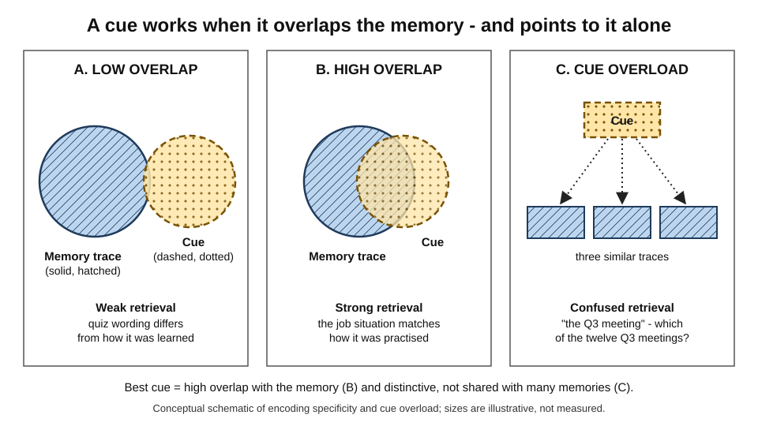
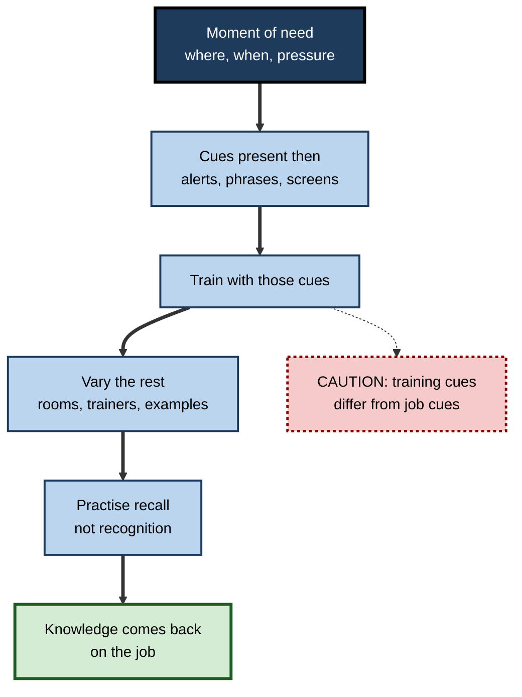
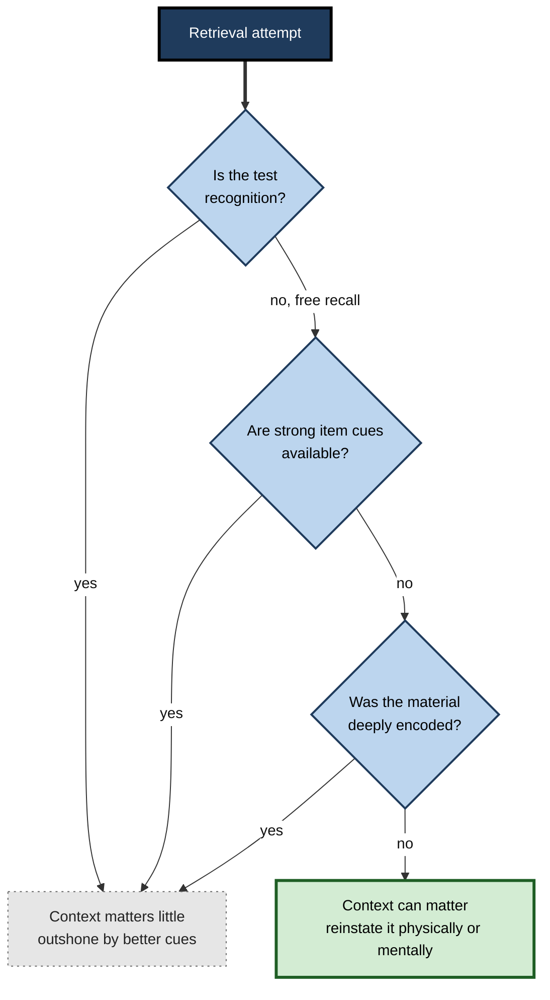

# F.8. Retrieval Cues and Context Effects

> **In one sentence:** A retrieval cue is anything that helps bring a memory back, and cues work best when they match how the memory was stored — including the place, mood and way of thinking you were in when you learned it.
>
> **Why it matters:** Knowledge that is "in there" but cannot be found when needed is useless at work. Understanding cues explains why people perform in training but freeze in real situations, why some documentation is never found, and how to design training, interviews and tools so that memories come back on demand.
>
> **Level span:** Novice → Expert · **Reading time:** ~16 min · **Builds on:** encoding, storage and retrieval

---

## The Learning Ladder

| Level | Badge | After this level you can... |
|---|---|---|
| 1 | NOVICE | Explain what a retrieval cue is and why memories return in some places and not others. |
| 2 | FOUNDATIONS | Describe encoding specificity, context-dependent, state-dependent and mood-congruent memory. |
| 3 | PRACTITIONER | Use cue design and context reinstatement to remember better and to help others recall. |
| 4 | ADVANCED | Weigh the real size of context effects, the replication record, outshining, cue overload and the cognitive interview evidence. |
| 5 | EXPERT / PRO | Design training, job aids and knowledge systems around the cues people will have at the moment of need. |

---

## Level 1 · Novice — The Big Picture

You walk into the kitchen and forget why you came. You go back to your desk — and remember: the coffee mug. Nothing was wrong with your memory. The intention was linked to the desk and the thought you had there; the kitchen did not provide the right **cue**.

A **retrieval cue** is anything that helps bring a memory to mind: a question, a word, a smell, a face, a place, a feeling. Memories are not retrieved by searching every shelf; they are retrieved by cues that point to them. If the cue matches something stored *with* the memory, the memory comes back. If not, it stays hidden, even though it is still there.

An analogy: memories are like files on a computer that can only be found by search, not by browsing folders. Search works when your search words match words in the file. Learning stored the file with certain "keywords" — where you were, how you felt, what you were thinking. Retrieval works when your current situation supplies some of the same keywords.

You have already experienced this when:

- Returning to an old school or office brought back memories you had not thought of in years.
- You knew an answer at your desk but blanked on it in a high-pressure meeting.
- A colleague's single question ("Wasn't that the week of the server move?") suddenly unlocked a whole sequence of events.

---

## Level 2 · Foundations — Core Concepts

### The encoding specificity principle

Endel Tulving and Donald Thomson's **encoding specificity principle** (1973) states that a cue helps retrieval to the extent that it was encoded with the memory. What matters is not how "strong" a cue seems in general, but how much it **overlaps** with what was stored. A related idea is **transfer-appropriate processing**: memory is best when the way you think at retrieval matches the way you thought at learning.

*Figure F.8-1 — Why some retrieval cues work and others fail.* Hatched circles with solid borders are memory traces; dotted fills with dashed borders are cues. Retrieval is strong when cue and trace overlap heavily (panel B) and weak when they barely overlap (A) or when one cue points to many similar memories (C). Schematic only.

### Kinds of context

| Context type | What is stored with the memory | Classic demonstration | Everyday example |
|---|---|---|---|
| **Environmental** | Place, sounds, surroundings | Divers who learned words underwater or on land (Godden and Baddeley, 1975) | Remembering a conversation when you return to the room |
| **State-dependent** | Internal physical state (alcohol, caffeine, arousal) | Information learned in one drug state recalled better in the same state | Remembering a late-night idea only when tired again |
| **Mood-dependent** | Emotional state at learning | Mood at learning matching mood at recall | Remembering a stressful project more when stressed |
| **Mood-congruent** | Emotional *content* matching current mood | Sad mood makes sad memories easier to retrieve (Bower, 1981) | Recalling past failures when anxious before a review |
| **Cognitive / task** | Way of thinking, task set, language | Bilinguals recall memories more easily in the language they happened in | Remembering a procedure only when using the same tool |

### Recall versus recognition

**Recall** — producing a memory with few cues ("What were the three risks?") — is harder than **recognition** — identifying it when shown ("Was this one of the risks?"). Recognition provides the strongest possible cue: the item itself. This is why multiple-choice quizzes overestimate what people can produce on the job.

### Key terms

| Term | Plain meaning |
|---|---|
| **Retrieval cue** | A stimulus that helps bring a memory to mind. |
| **Encoding specificity** | Cues work when they match what was stored with the memory. |
| **Context-dependent memory** | Better recall when the learning environment is reinstated. |
| **State-dependent memory** | Better recall when the internal state at learning is reinstated. |
| **Mood-congruent memory** | Easier recall of memories whose emotional tone matches current mood. |
| **Context reinstatement** | Returning to, or mentally recreating, the learning context. |
| **Cue overload** | A cue linked to many memories becomes less effective for each. |
| **Tip-of-the-tongue** | Feeling sure you know something but being unable to retrieve it now. |

---

## Level 3 · Practitioner — Putting It to Work

### When you cannot remember: the RECALL routine

1. **Reinstate the context mentally.** Picture where you were, who was there, what you were doing and feeling. Mental reinstatement works surprisingly well even when you cannot physically return.
2. **Explore related cues.** Think of neighbouring facts: the week, the project, the tool, the person.
3. **Change the angle.** Try a different order (backwards in time) or a different perspective (what would the client have seen?).
4. **Allow partial retrieval.** Write down fragments — first letter, rough number, location on a slide. Partial information often cues the rest.
5. **Let it go briefly.** Tip-of-the-tongue states often resolve when you move on; the search continues unconsciously and cues encountered later can trigger the answer.
6. **Log the cue.** When it comes back, note what triggered it; that cue will work again.

### Designing training for the cues people will have

1. **Identify the moment of need.** Where, when and under what conditions will people need this knowledge?
2. **List the cues present then.** What will they see, hear or be asked? (An alert message, a customer phrase, a dashboard pattern.)
3. **Train with those cues.** Use the same screens, phrases, documents and pressure levels in practice.
4. **Vary non-essential context.** Practise in several settings so the knowledge is not tied to one room, tool or trainer.
5. **Practise recall, not just recognition.** Require people to produce answers from the real cues.

**Figure F.8-2 — Training for the moment of need.**

*How to read it:* the thick path aligns training cues with job cues; the dotted-border box is the common gap that makes trained knowledge vanish under real conditions.

### Worked example — customer escalation calls

| | Before | After |
|---|---|---|
| **Training** | Classroom slides; written quiz on the de-escalation steps. | Recorded real call openings ("I want to speak to your manager") played as cues; agents respond aloud. |
| **Context** | Quiet room, no time pressure. | Headset, timed, background noise, in several rooms. |
| **Test** | Multiple choice. | Live role-play with novel angry-customer scripts. |
| **On the job** | Agents freeze; "I knew it in training." | Agents begin the de-escalation script automatically when they hear the trigger phrases. |

### Common mistakes

- Testing with recognition and assuming people can recall.
- Training in a context that never occurs on the job.
- Writing documentation with internal jargon nobody will search for.
- Interviewing witnesses or stakeholders with narrow, leading questions instead of reinstating context.

---

## Level 4 · Advanced — Mechanisms, Models & Evidence

### How big are context effects really?

The divers study is famous for a dramatic result: words learned underwater were better recalled underwater, and words learned on land better recalled on land. The broader evidence is more modest:

- A widely cited meta-analysis by Steven Smith and Edward Vela (2001) found environmental context effects to be **reliable but small to moderate** on average, roughly a quarter of a standard deviation in free recall.
- A 2021 replication of the divers study by Jaap Murre did **not** reproduce the original pattern. A later reanalysis, correcting analysis errors, found a small context interaction that reached statistical significance, but the result remained far weaker than the original. The divers study is best taught as a classic demonstration, not as proof of a large effect.
- Context effects are **larger for free recall** and **small or absent for recognition**, because recognition provides strong item cues.

### Outshining and overshadowing

Smith's **outshining hypothesis** explains when context matters: environmental context helps only when better cues are absent. If you have strong item cues — a good question, a well-organised outline, the item itself — they "outshine" the room. Likewise, if learners processed the material deeply, context contributes less. Practically: **do not rely on matching the room; build strong item cues.**

**Figure F.8-3 — When does context matter?**

*How to read it:* start at the top; context effects are most likely in the thick-bordered box — free recall, weak item cues and shallow encoding. The grey box covers most well-designed workplace situations.

### Cue overload

Michael Watkins's **cue-overload principle**: a cue's effectiveness falls as the number of memories linked to it rises. "The Monday meeting" cues nothing specific after fifty Monday meetings. Distinctive cues — "the meeting where finance challenged the forecast" — work. This is also a mechanism of interference.

### Variable context improves transfer

A 1978 experiment by Smith, Glenberg and Bjork found that studying the same material in two different rooms improved recall in a new room compared with studying twice in one room. Varied learning contexts tie knowledge to the material rather than to the setting — a principle with wide support in skill training.

### State and mood

State-dependent effects are clearest for substances that alter brain state, and are generally strongest in free recall. **Mood-dependent memory** (mood at learning matching mood at recall) has proved hard to replicate consistently, while **mood-congruent memory** (current mood favouring same-tone memories) is more robust and is important in depression, where negative memories become easier to access and feed low mood.

### The cognitive interview

Ronald Fisher and Edward Geiselman developed the **cognitive interview** from retrieval research: mentally reinstate context, report everything, recall in different orders, and change perspective. Meta-analyses (notably Memon and colleagues, 2010) found it produces a large increase in correctly recalled details with only a small increase in errors. It is used by police in several countries and adapts well to incident reviews, audits and user research.

### Retrieval changes memory

Retrieval is not a neutral readout. Successfully retrieving a memory strengthens it and makes it easier to retrieve again (the basis of retrieval practice), and can also make it temporarily open to updating. Retrieving some items can make related, unretrieved items temporarily harder to recall — a phenomenon covered in the note on interference.

---

## Level 5 · Expert / Pro — Professional Mastery

### Cue engineering at organisational scale

| Area | Cue design principle | Example |
|---|---|---|
| **Training** | Train with the real job cues; vary the rest | Incident drills use real alert text and dashboards |
| **Job aids** | Place cues at the moment of need | Runbook link inside the alert itself |
| **Documentation** | Title and tag by the words people will search when stuck | "Payment fails with error 402" rather than "Billing service overview v3" |
| **Naming** | Distinctive names reduce cue overload | "Project Falcon" over "Q3 initiative" |
| **Interviews and reviews** | Reinstate context before asking questions | Start a postmortem by replaying the timeline |
| **Assessment** | Use recall and realistic cues | Scenario questions instead of definition recognition |

### Search, AI and the cue problem

Enterprise search and retrieval-augmented AI are, in effect, external retrieval systems that face the same problem as human memory: they find what overlaps with the query. Teams that write documents with the vocabulary users actually use, and that tag content by situation, get better results from both people and AI tools. The human side remains: people need enough stored knowledge to formulate a good query and to recognise a good answer.

### Assessment that predicts performance

Recognition-based certification overestimates job readiness because it supplies the cue. Professionals design assessment around **free recall in realistic contexts**: explain to a customer, diagnose from a log, decide from a case.

### Professional scenario

**Role:** Learning lead for a cloud operations team.
**Situation:** Engineers ace the incident-response course but, during real outages at night, forget the escalation path and communication steps.
**What the pro does:** Diagnoses a cue mismatch: training used slide titles as cues; real incidents present alerts, a pager and a noisy chat channel. She rebuilds quarterly drills using real alert payloads, delivered by pager at varied times, with the chat channel active. The runbook link is embedded in each alert. She also renames runbooks by symptom. Within two drill cycles, time to correct escalation falls, and engineers report that the steps "just come to mind" when the alert appears.

### Ethical notes

Context and mood shape what people recall. Interviewers in HR investigations, audits and research must avoid creating moods or contexts that bias recall, and must not treat a person's failure to recall in a stressful setting as evidence of dishonesty.

---

## Myths vs. Evidence

| Myth | What the evidence shows |
|---|---|
| "Study in the exam room and you'll ace it." | Environmental context effects are real but modest, and vanish when strong item cues exist. |
| "The divers study proves context has huge effects." | A 2021 replication did not reproduce the original pattern; meta-analytic effects are small to moderate. |
| "If you can recognise it, you know it." | Recognition supplies the cue; recall is the harder and more job-relevant test. |
| "Forgetting means the memory is gone." | Many memories return with the right cue. |
| "Mood at learning must match mood at recall." | Mood-dependent effects are inconsistent; mood-congruent effects are more reliable. |
| "Better recall in interviews comes from pressing harder." | Context reinstatement and open reporting outperform pressure, which can increase errors. |

## Practitioner Toolkit

**Cue design checklist for training and documentation**

- [ ] Moment of need identified (place, time, pressure).
- [ ] Real job cues listed and used in practice.
- [ ] Non-essential context varied across sessions.
- [ ] Assessment uses recall from realistic cues.
- [ ] Job aids placed where the cue appears.
- [ ] Documents titled with the words people search when stuck.
- [ ] Names distinctive enough to avoid cue overload.

**Context reinstatement prompt (for interviews and personal recall)**

1. Picture where you were and what you could see and hear.
2. Who was there? What were you doing just before?
3. How were you feeling?
4. Tell me everything, even details that seem unimportant.
5. Now go through it in reverse order.

## Self-Check

1. **[NOVICE]** Why might you forget something in one place and remember it in another?
2. **[FOUNDATIONS]** State the encoding specificity principle.
3. **[FOUNDATIONS]** What is the difference between mood-dependent and mood-congruent memory?
4. **[PRACTITIONER]** Why do multiple-choice certifications overestimate job readiness?
5. **[ADVANCED]** What did the 2021 replication of the divers study find, and what is the meta-analytic picture?
6. **[ADVANCED]** Explain the outshining hypothesis.
7. **[ADVANCED]** What is cue overload, and how does it apply to naming at work?
8. **[EXPERT / PRO]** How would you redesign incident-response training to work at 3 a.m.?

### Answer Key

1. The memory was stored with cues from the original place; returning supplies those cues.
2. A cue helps retrieval to the extent that it overlaps with what was encoded with the memory.
3. Mood-dependent: matching mood at learning and recall helps (inconsistent evidence). Mood-congruent: current mood makes same-tone memories easier to recall (more robust).
4. Recognition supplies the item as a cue; the job usually requires recall from different cues.
5. It did not reproduce the original pattern, though a reanalysis found a small significant interaction; meta-analyses find context effects reliable but small to moderate.
6. Environmental context helps only when better cues are absent; strong item cues outshine context.
7. A cue linked to many memories loses effectiveness for each; generic names like "the weekly sync" cue nothing specific, so use distinctive names.
8. Use real alert cues, deliver drills at varied times and conditions, embed runbook links in alerts, require recall rather than recognition, and title runbooks by symptom.

## Key Takeaways

- Retrieval depends on **cues that overlap with what was stored**.
- Context effects (place, state, mood) are **real but often modest** — and **outshone by strong item cues**.
- The famous divers result has a **weak replication record**; teach it as a demonstration.
- **Recognition is not recall**; test the way the job demands.
- **Distinctive cues beat overloaded ones** — in naming, documentation and interviews.
- Design training and job aids around **the cues present at the moment of need**, and vary the rest.

## Glossary

| Term | Meaning |
|---|---|
| Cognitive interview | An interview method based on context reinstatement and open reporting. |
| Context reinstatement | Physically or mentally recreating the learning context. |
| Context-dependent memory | Better recall when the learning environment matches the recall environment. |
| Cue overload | Reduced cue effectiveness when one cue is linked to many memories. |
| Encoding specificity | Cues are effective to the extent they were encoded with the memory. |
| Free recall | Producing items from memory in any order without specific cues. |
| Mood-congruent memory | Easier recall of memories matching current mood. |
| Mood-dependent memory | Better recall when mood at recall matches mood at learning. |
| Outshining hypothesis | Context cues matter only when stronger cues are absent. |
| Recall | Producing information from memory. |
| Recognition | Identifying information as previously encountered. |
| Retrieval cue | A stimulus that helps bring a memory to mind. |
| State-dependent memory | Better recall when internal state matches state at learning. |
| Tip-of-the-tongue state | Temporary inability to retrieve something you are sure you know. |
