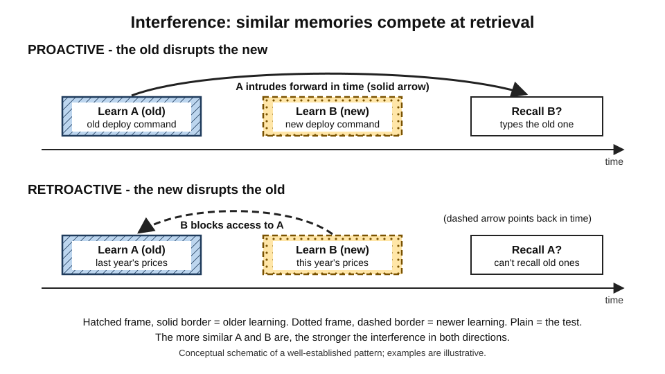
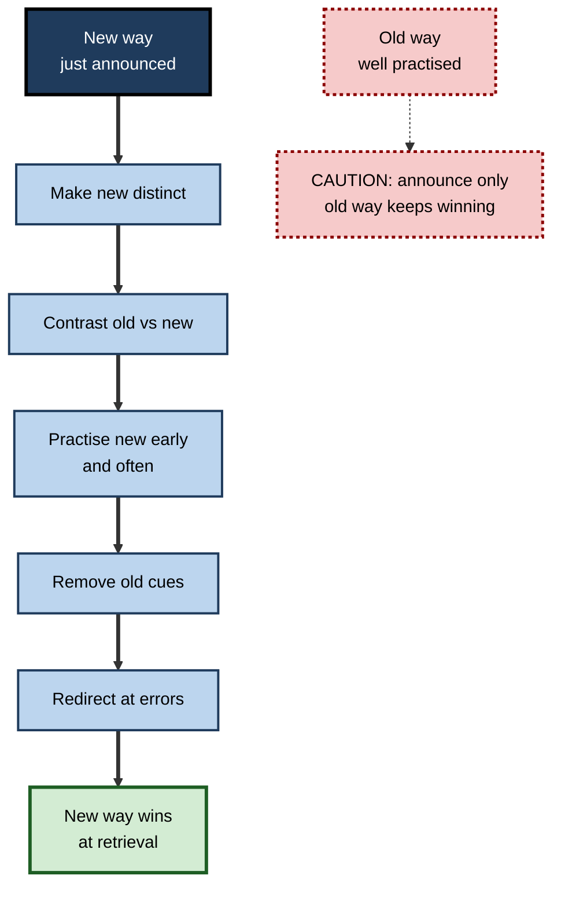

# F.9. Interference and Memory Loss

> **In one sentence:** Most everyday forgetting happens not because memories simply fade away, but because similar memories compete with each other — and only a small part of memory loss comes from injury or disease.
>
> **Why it matters:** System migrations, process changes, rebrands, new pricing and reorganisations all create competing memories. Professionals who understand interference can plan changes so that people stop using the old way, and can tell normal forgetting apart from warning signs that need medical attention.
>
> **Level span:** Novice → Expert · **Reading time:** ~17 min · **Builds on:** retrieval cues and storage versus retrieval strength

---

## The Learning Ladder

| Level | Badge | After this level you can... |
|---|---|---|
| 1 | NOVICE | Explain why you forget things and why similar things get mixed up. |
| 2 | FOUNDATIONS | Distinguish decay from interference, proactive from retroactive interference, and availability from accessibility. |
| 3 | PRACTITIONER | Plan a change so the new way replaces the old one with minimal confusion. |
| 4 | ADVANCED | Explain the forgetting curve, retrieval-induced and motivated forgetting, sleep, the adaptive view of forgetting and the replication record. |
| 5 | EXPERT / PRO | Manage organisational change, knowledge decay and normal versus clinical memory loss responsibly. |

---

## Level 1 · Novice — The Big Picture

You park in a different spot at the office car park every day. Tonight, you walk confidently to... yesterday's spot. Your memory of today's spot did not disappear; it was crowded out by dozens of nearly identical memories of other days. That crowding is **interference**, and it is the main reason we forget.

An analogy: imagine shouting a friend's name in a quiet park — they hear you immediately. Now shout the same name in a stadium where a hundred people share that name. The signal is still there, but it competes with many similar ones. Memories that look alike drown each other out.

The other kind of forgetting people imagine is **decay** — memories fading like ink in the sun. Time does play a role, but research since the early twentieth century has shown that *what happens during that time*, especially learning similar things, matters more.

You have already experienced interference when:

- You wrote last year's date on a form in January.
- You kept reaching for the old menu location after a software update.
- You called a new colleague by the name of the person who had their job before.

---

## Level 2 · Foundations — Core Concepts

### Decay versus interference

| | Decay | Interference |
|---|---|---|
| **Idea** | Memories weaken with time alone | Memories are disrupted by other, similar memories |
| **Prediction** | Same forgetting no matter what you do in between | More forgetting if you learn similar material in between |
| **Status** | Hard to test cleanly; a minor factor for long-term memory | Strong, consistent evidence; main cause of everyday forgetting |

A classic 1924 study by Jenkins and Dallenbach found people forgot less over a period of sleep than over the same time awake — consistent with interference (and, as later research showed, with sleep's role in consolidation) rather than pure decay.

### Two directions of interference

*Figure F.9-1 — Proactive and retroactive interference.* Top: old learning intrudes forward on new learning (proactive). Bottom: new learning blocks access to older learning (retroactive). Boxes with a hatched frame and solid border are older learning, boxes with a dotted frame and dashed border are newer learning, plain boxes are the memory test. The solid arrow points forward in time; the dashed arrow points back.

- **Proactive interference** — old learning disrupts recall of new learning. You keep typing your old password.
- **Retroactive interference** — new learning disrupts recall of old learning. After learning this year's prices, you can no longer recall last year's.

Both grow with **similarity**: two nearly identical procedures interfere far more than two very different ones.

### Gone or just hidden?

Endel Tulving and Zena Pearlstone (1966) distinguished **availability** (is the memory stored?) from **accessibility** (can it be retrieved now?). Many "forgotten" memories are available but inaccessible; the right cue brings them back. Hermann Ebbinghaus's discovery of **savings** — relearning a forgotten list takes less time than learning it the first time — showed that traces persist even when recall fails.

**Figure F.9-2 — Why a memory is not retrieved.**

```mermaid
%%{init: {'theme':'base','themeVariables':{'fontFamily':'Arial, Helvetica, sans-serif','fontSize':'15px','primaryColor':'#FFFFFF','primaryTextColor':'#111111','primaryBorderColor':'#222222','lineColor':'#333333','secondaryColor':'#F2F2F2','tertiaryColor':'#FFFFFF','clusterBkg':'#FAFAFA','clusterBorder':'#555555','edgeLabelBackground':'#FFFFFF','titleColor':'#111111'}}}%%
flowchart TD
    classDef core    fill:#1F3B5C,stroke:#000000,stroke-width:3px,color:#FFFFFF
    classDef key     fill:#BCD5EE,stroke:#1F3B5C,stroke-width:2px,color:#000000
    classDef detail  fill:#FFFFFF,stroke:#333333,stroke-width:1.5px,color:#000000
    classDef caution fill:#F6CACA,stroke:#8B0000,stroke-width:2.5px,stroke-dasharray:3 3,color:#000000
    classDef muted   fill:#E6E6E6,stroke:#666666,stroke-width:1px,stroke-dasharray:2 4,color:#222222

    F["Can't recall it"]
    N["Never encoded<br/>attention elsewhere"]
    I["Interference<br/>similar memories compete"]
    C["Cue mismatch<br/>wrong context or question"]
    D["Disuse<br/>retrieval strength faded"]
    M["Motivated<br/>suppressed or avoided"]
    B["Brain injury or disease<br/>amnesia, dementia"]

    F ==> I
    F ==> C
    F ==> D
    F --> N
    F -.-> M
    F -.-> B

    class F core
    class I,C,D key
    class N detail
    class M muted
    class B caution
```

*How to read it:* thick arrows are the most common everyday causes; the plain arrow is a failure before storage; dotted arrows are less common causes. The dotted-border box is the clinical route that needs professional assessment.

### Key terms

| Term | Plain meaning |
|---|---|
| **Interference** | Disruption of a memory by other, similar memories. |
| **Proactive interference** | Older memories disrupting newer ones. |
| **Retroactive interference** | Newer memories disrupting older ones. |
| **Decay** | Weakening of memory with the passage of time alone. |
| **Availability vs. accessibility** | Whether a memory is stored versus whether it can be retrieved now. |
| **Savings** | Faster relearning of something forgotten. |
| **Amnesia** | Serious memory loss from brain injury or disease. |

---

## Level 3 · Practitioner — Putting It to Work

Every change at work — a new tool, process, price list, org chart or brand — creates interference. People do not "refuse to change"; their well-practised old memories keep winning the competition.

### The REPLACE method for introducing a new way

1. **Reduce similarity where it does not matter.** Give the new process a distinct name, look and location so it is not confused with the old one.
2. **Explicitly contrast old and new.** Show them side by side: "Before: X. Now: Y. Why it changed: Z." Contrasting helps people discriminate the two memories.
3. **Practise the new way many times early.** Retrieval strength of the new memory must overtake years of practice with the old.
4. **Lock or remove the old cues.** Retire old forms, redirect old links, disable old commands, update templates.
5. **Add a catch at the point of error.** If the old way is used, show a gentle redirect ("This has moved — here's the new path").
6. **Check later, not just on launch day.** Proactive interference often reappears under stress or after a break.

**Figure F.9-3 — Planning a change that sticks.**

*How to read it:* the thick path shows the steps that let a new memory beat an established one; without them, the old way keeps winning.

### Worked example — migrating to a new expense tool

| | Before | After (REPLACE) |
|---|---|---|
| **Launch** | Email announcing the new tool; old tool still works "for now". | New tool given a distinct name and icon; old tool read-only from day one. |
| **Learning** | Recorded demo. | Side-by-side "old vs. new" card; each employee submits one practice claim in week one. |
| **Errors** | Claims keep arriving in the old tool for months. | Old tool link redirects to the new one with a one-line explanation. |
| **Check** | None. | Spot checks after quarter-end, when old habits tend to return. |

### Common mistakes

- Keeping the old and new systems both available indefinitely.
- Making the new process look almost identical to the old one, maximising confusion.
- Assuming one training session can override years of practice.
- Interpreting interference errors as resistance or carelessness.

---

## Level 4 · Advanced — Mechanisms, Models & Evidence

### The forgetting curve

Ebbinghaus (1885), testing himself on nonsense syllables, found that forgetting is rapid at first and then slows — the **forgetting curve**. A 2015 replication by Murre and Dros reproduced the basic shape. Two later laws refine it: **Jost's law** (of two memories of equal strength, the older one fades more slowly) and the observation that forgetting is best described by a power-like function rather than steady loss. The exact percentages often quoted for the forgetting curve come from nonsense syllables learned by one man; meaningful, well-learned material is forgotten far more slowly.

### Interference mechanisms

- **Competition.** At retrieval, a cue activates all associated memories; the strongest wins. Similar memories sharing cues compete most (the **cue-overload** principle).
- **Release from proactive interference.** Delos Wickens's experiments (1972) showed that when the category of new material changes, proactive interference drops sharply — strong evidence that similarity drives it.
- **Response competition and unlearning.** Classic interference theory proposed both competition and the weakening (unlearning) of old associations as new ones form.

### Retrieval-induced forgetting

Michael Anderson, Robert Bjork and Elizabeth Bjork (1994) found that practising retrieval of some items in a category (for example, some fruits from a studied list) made other, unpractised items from the same category *harder* to recall later — **retrieval-induced forgetting**. The basic effect has been replicated many times, including with emotional material in 2024. Its explanation is contested: the original **inhibition** account (the brain actively suppresses competitors) versus **competition and context** accounts. Some specific findings — such as variants claiming especially strong forgetting in arithmetic and recent claims that exercise modulates the effect — have failed direct replications. Practical implication: in meetings or reviews that rehearse only some points, the unrehearsed related points may become harder to recall.

### Motivated forgetting

Anderson and Green (2001) introduced the **think/no-think** paradigm: repeatedly suppressing retrieval of a memory when its cue appears led to poorer later recall. Replications have been mixed — some failures, some successes — with meta-analytic estimates suggesting a real but modest effect that varies across people and conditions. **Directed forgetting** (being told to forget an item) reliably reduces later recall in the lab. None of this supports the popular idea that traumatic memories are routinely "repressed" and later recovered intact — a separate, contested claim discussed under false memory.

### Forgetting as adaptive

John Anderson and Lael Schooler (1991) showed that the probability of needing a piece of information in the environment (for example, words in newspaper headlines) falls over time in the same way human memory accessibility falls — suggesting memory is tuned to keep available what is likely to be needed. Neuroscientists Blake Richards and Paul Frankland (2017) argued that forgetting helps memory generalise and adapt by clearing outdated details. Forgetting the old office layout is a feature, not a bug.

### Sleep and interference

Sleep after learning protects memories partly by removing the interference of waking experience and partly through active consolidation. The detailed mechanisms are covered elsewhere; the practical point is that learning before sleep, and not cramming similar material in between, reduces interference.

### Clinical memory loss

| Type | What is lost | Example cause |
|---|---|---|
| **Anterograde amnesia** | Ability to form new long-term memories | Medial temporal lobe damage, some infections |
| **Retrograde amnesia** | Memories from before an injury, often recent ones most (Ribot's gradient) | Head injury, some dementias |
| **Transient global amnesia** | Sudden, temporary inability to form new memories, usually resolving within a day | Cause not fully understood |
| **Dementia** (e.g. Alzheimer's) | Progressive loss, typically beginning with new episodic learning | Neurodegeneration |

Normal ageing slows retrieval and reduces episodic detail, and word-finding becomes harder, but does not cause the progressive, function-impairing loss of dementia. Signs that warrant medical assessment include repeating the same questions within short periods, getting lost in familiar places, and memory problems that interfere with daily functioning or are noticed by others.

---

## Level 5 · Expert / Pro — Professional Mastery

### Managing interference in organisations

| Situation | Interference risk | Professional response |
|---|---|---|
| **System migration** | Old commands, URLs, screens intrude | Decommission or redirect old interfaces; distinct naming; early practice |
| **Process change** | Old steps reappear under pressure | Side-by-side contrast; updated checklists; retire old documents |
| **Reorganisation** | Old reporting lines and names | Updated directories and chat channels; announce with "from X to Y" language |
| **Versioned products** | Customers and staff mix versions | Version-specific docs with clear labels; deprecate old docs |
| **Similar procedures** | Mixing up two near-identical runbooks | Make differences visually salient; use distinct names and checklists |

### Knowledge decay in organisations

Teams lose access to knowledge through people leaving, documentation drift and similar-but-different content. Good practice: version and archive old content clearly so it does not compete in search; mark superseded documents prominently; and record "what changed and why" so retrieval of the old version comes with its correction.

### AI-era implications

AI assistants trained or grounded on older documentation can reproduce outdated procedures — a kind of organisational proactive interference. Removing or labelling superseded documents protects both human and AI retrieval. Heavy reliance on tools also means people practise less, which lowers retrieval strength; when the tool fails, recall is weaker than people expect.

### Professional scenario

**Role:** Product operations manager at a bank migrating 4,000 staff to a new customer-relationship system.
**Situation:** Six weeks after go-live, staff still enter data in the old system, which remains "read-only except for notes", and support tickets reveal confusion between two similar case-type codes.
**What the pro does:** Makes the old system fully read-only, redirects its home page to the new one, and renames the two confusing case types with clearly distinct labels. She sends a one-page "old versus new" card, runs fifteen-minute practice sessions per team, and schedules a check after the next month-end close, when stress tends to trigger old habits. Errors drop sharply within a month.

### Ethics and care

When an employee shows memory problems, managers should avoid amateur diagnosis. The professional response is to focus on work impacts, offer support and accommodations, and encourage medical advice where appropriate, respecting privacy.

---

## Myths vs. Evidence

| Myth | What the evidence shows |
|---|---|
| "Memories simply fade with time." | Interference from similar memories explains most everyday forgetting. |
| "If I can't recall it, it's gone." | Many memories are available but inaccessible; cues and relearning reveal them. |
| "Forgetting is always a failure." | Forgetting helps keep relevant information accessible and supports generalisation. |
| "Ebbinghaus showed we forget 70% in a day." | That was nonsense syllables learned by one person; meaningful material is retained far better. |
| "People can deliberately erase memories." | Suppression can reduce later recall modestly, but effects are variable and not erasure. |
| "Memory complaints in older adults mean dementia." | Slower retrieval and word-finding difficulty are normal; dementia involves progressive, function-impairing loss. |

## Practitioner Toolkit

**Change-introduction checklist (interference-aware)**

- [ ] New process or tool has a distinct name and look.
- [ ] Side-by-side "old vs. new, and why" contrast provided.
- [ ] Everyone practises the new way early, several times.
- [ ] Old cues retired: forms, links, templates, commands.
- [ ] Errors using the old way are redirected with a clear message.
- [ ] Follow-up check scheduled after a stressful period or break.
- [ ] Superseded documents archived and labelled.

**Personal anti-interference habits**

- Study clearly different subjects back to back rather than very similar ones.
- When learning something that replaces an old habit, say the contrast aloud.
- Sleep after important learning; avoid similar material straight after.

## Self-Check

1. **[NOVICE]** Why do you sometimes walk to yesterday's parking spot?
2. **[FOUNDATIONS]** What is the difference between proactive and retroactive interference? Give a work example of each.
3. **[FOUNDATIONS]** What is the difference between availability and accessibility?
4. **[PRACTITIONER]** Why should an old system be retired rather than left available during a migration?
5. **[ADVANCED]** What is retrieval-induced forgetting, and what is debated about it?
6. **[ADVANCED]** What does release from proactive interference show?
7. **[ADVANCED]** Why might forgetting be adaptive?
8. **[EXPERT / PRO]** Which signs distinguish normal memory lapses from those warranting medical assessment?

### Answer Key

1. Many similar memories of parking compete; older, well-practised ones can win at retrieval (proactive interference).
2. Proactive: old learning disrupts new — typing the old deploy command. Retroactive: new learning disrupts old — after learning new prices, failing to recall last year's.
3. Availability means the memory is stored; accessibility means it can be retrieved now. Many memories are available but not accessible.
4. Its cues keep the old memory active and competitive; removing them lets the new memory win.
5. Practising retrieval of some items makes related unpractised items harder to recall. The mechanism — active inhibition versus competition — is debated, and some variants failed to replicate.
6. When the category of new material changes, proactive interference drops — showing that similarity drives interference.
7. It keeps likely-needed information accessible, clears outdated details and supports generalisation.
8. Repeating questions in short periods, getting lost in familiar places, and memory problems that disrupt daily functioning or are noticed by others.

## Key Takeaways

- Most forgetting is **interference** between similar memories, not simple decay.
- **Proactive**: old disrupts new. **Retroactive**: new disrupts old. Both grow with **similarity**.
- Many forgotten memories are **available but inaccessible** — cues and relearning reveal them.
- Forgetting is partly **adaptive**: memory keeps likely-needed information accessible.
- Plan change to beat interference: **distinctiveness, contrast, early practice, removal of old cues**.
- Normal age-related lapses differ from **progressive, function-impairing** memory loss, which needs professional assessment.

## Glossary

| Term | Meaning |
|---|---|
| Accessibility | Whether a stored memory can be retrieved now. |
| Anterograde amnesia | Inability to form new long-term memories. |
| Availability | Whether a memory is stored. |
| Decay | Weakening of memory with time alone. |
| Directed forgetting | Reduced recall of items one is instructed to forget. |
| Forgetting curve | Rapid early forgetting that slows over time. |
| Jost's law | Of two equally strong memories, the older fades more slowly. |
| Proactive interference | Older memories disrupting newer ones. |
| Release from proactive interference | Reduced interference when the category of material changes. |
| Retrieval-induced forgetting | Reduced recall of unpractised items related to practised ones. |
| Retroactive interference | Newer memories disrupting older ones. |
| Retrograde amnesia | Loss of memories formed before an injury or illness onset. |
| Ribot's gradient | Older memories being more resistant to loss than recent ones. |
| Savings | Faster relearning of forgotten material. |
| Think/no-think paradigm | A task testing whether suppressing retrieval reduces later recall. |
