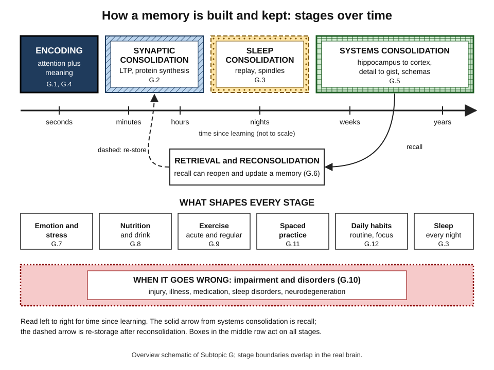
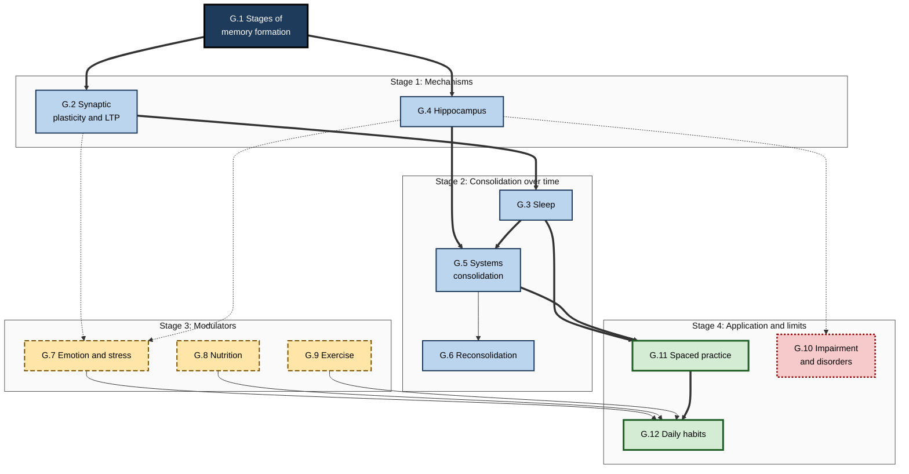
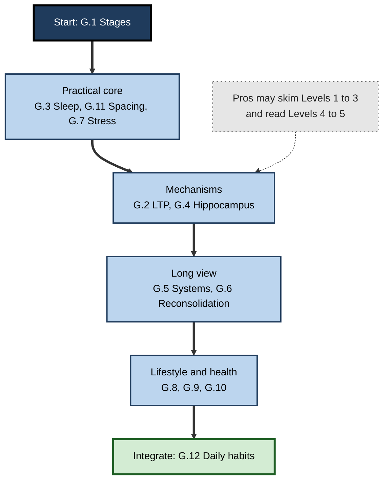

# G. Memory Formation & Consolidation

> **What this subtopic is about:** How the brain turns a passing experience into a lasting memory — from the first seconds of encoding, through the strengthening of synapses and overnight replay during sleep, to the slow reorganisation of memories over years — and how emotion, stress, nutrition, exercise, spacing and daily habits shape that process, and what happens when it goes wrong.
>
> **Who it is for:** Anyone who learns for a living — students, professionals, managers, L&D and HR specialists, product builders — who wants the science behind "why things stick" · **Notes in this subtopic:** 12 · **Level span:** Novice → Expert

---

## Overview

A memory is not recorded in an instant. It is built in stages and keeps changing long after the learning event. Within seconds, attention and meaning decide what gets **encoded**. Over minutes to hours, the connections between the neurons involved are chemically and structurally strengthened — **synaptic consolidation**, with long-term potentiation as its best-studied mechanism. Over the following nights, **sleep** replays and reorganises the day's learning. Over weeks to years, **systems consolidation** gradually shifts memories from depending on the hippocampus toward networks in the cortex, trading vivid detail for durable gist woven into what you already know. And whenever a memory is recalled, it can be **reconsolidated** — reopened, updated and stored again.

This subtopic follows that life cycle, then turns to the everyday factors that modulate it — emotion and stress, nutrition, exercise, spaced practice and daily habits — and to memory impairment and disorders. It is the biology-and-mechanism layer of learning science: it explains *why* well-known study and training practices work, and where popular claims overreach.

*Figure G-1 — How a memory is built and kept: stages over time.* Top row: the four formation stages on a time axis from seconds to years (dark box, hatched, dotted and cross-hatched patterns distinguish them). Middle: retrieval can reopen a memory for reconsolidation (solid arrow is recall; dashed arrow is re-storage). Bottom rows: the everyday factors that act on every stage, and the disorders that can disrupt them.

---

## Why It Matters

- **Most learning is lost after the event.** Training budgets are spent on encoding — the workshop, the course, the video — while the stages that determine retention happen afterwards, often unprotected.
- **The cheapest levers are biological.** Sleep, spacing, movement and stress timing are free or nearly free, and have some of the strongest evidence in the field.
- **Claims about "the brain" are everywhere.** Products and programmes promise to "boost LTP", "erase bad memories" or "sharpen memory" with supplements. Mechanism knowledge lets professionals filter hype.
- **Memory health is a workforce issue.** Sleep loss, chronic stress, brain injury, long COVID, ADHD and dementia affect colleagues and customers. Understanding them supports humane, inclusive workplaces.
- **AI changes what must be remembered.** With instant retrieval tools, the professional question becomes which knowledge must complete every consolidation stage inside a person's head.

---

## What You Will Learn

| # | Note | Core question it answers | Primary level |
|---|---|---|---|
| G.1 | Stages of Memory Formation | What are the stages a memory passes through, and how do I tell which one is failing? | Novice → Practitioner |
| G.2 | Synaptic Plasticity and LTP | How do connections between neurons change to store a memory? | Foundations → Advanced |
| G.3 | Sleep and Memory Consolidation | What does sleep do for memory, and how should I plan around it? | Novice → Advanced |
| G.4 | The Role of the Hippocampus | What does the hippocampus do, and why is it so central to new memories? | Foundations → Advanced |
| G.5 | Systems Consolidation Over Time | How do memories reorganise over months and years? | Practitioner → Expert |
| G.6 | Reconsolidation: Updating Memories | How can recall reopen a memory for updating — and how reliable is that evidence? | Practitioner → Expert |
| G.7 | Emotion, Stress, and Memory Formation | When does stress help memory, and when does it hurt? | Novice → Advanced |
| G.8 | Nutrition and Memory Health | What does diet really do for memory, and which claims hold up? | Novice → Practitioner |
| G.9 | Exercise Effects on Memory | How much does exercise help memory, and through which pathways? | Novice → Advanced |
| G.10 | Memory Impairment and Disorders | What causes memory impairment, and how should I respond at work? (Educational, not medical advice.) | Foundations → Expert |
| G.11 | Spaced Practice for Consolidation | Why does spreading practice out work so well, and how do I schedule it? | Novice → Expert |
| G.12 | Optimizing Daily Habits for Memory | Which everyday routines most improve what I learn and keep? | Novice → Expert |

---

## Concept Map

**Figure G-2 — How the twelve notes fit together.**

*How to read it:* thick arrows are the main conceptual dependencies; thin arrows are supporting links; dotted arrows show where mechanisms explain modulators or disorders. Long-dash boxes are modulators, thick-bordered light boxes are applications, the dotted-border box is the disorders note.

---

## Recommended Learning Path

1. **Start with G.1** — the map of stages that every other note refers back to.
2. **Read G.3 (sleep) and G.11 (spacing) next** if you want practical gains quickly; both are highly actionable and strongly evidenced.
3. **Read G.7 (emotion and stress)** — essential for anyone who learns, presents or is assessed under pressure.
4. **Go into the mechanisms: G.2 (LTP) and G.4 (hippocampus)**, which explain why the practical notes work.
5. **Then the long view: G.5 (systems consolidation) and G.6 (reconsolidation)** — the most debated science in the subtopic.
6. **Lifestyle modulators: G.8 (nutrition) and G.9 (exercise)**, read with an eye for evidence quality.
7. **G.10 (impairment and disorders)** for understanding, supporting others and inclusive design — educational, not medical advice.
8. **Finish with G.12 (daily habits)**, which integrates everything into a routine.

**Figure G-3 — Paths through the subtopic.**

*How to read it:* beginners follow the thick path top to bottom; experienced readers can enter at the mechanisms (dotted arrow) and focus on the Advanced and Expert levels of each note.

---

## The Big Ideas in Brief

**G.1 Stages of Memory Formation.** Memories pass through encoding, synaptic consolidation, systems consolidation, storage and retrieval, and each stage can fail independently. Diagnosing the weak link — did it never get in, did it not settle, or can it not be accessed? — points to the right fix. Engram research in animals shows memories are distributed, dynamic and competitively allocated.

**G.2 Synaptic Plasticity and LTP.** Memories are stored largely as changes in synapse strength. NMDA receptors detect coincident activity and trigger long-term potentiation; early LTP fades unless protein synthesis creates late LTP. Synaptic and behavioural tagging explain how weak memories can be rescued by nearby strong events. Causal evidence linking LTP to memory is now substantial.

**G.3 Sleep and Memory Consolidation.** Sleep before learning supports encoding; sleep after learning consolidates. In NREM sleep, slow oscillations, spindles and hippocampal ripples coordinate replay that moves memories toward the cortex. Partial sleep loss appears nearly as harmful as total loss, and cueing during sleep (targeted memory reactivation) can modestly boost specific memories.

**G.4 The Role of the Hippocampus.** The hippocampus binds the elements of an episode and stores an index to them; separates similar memories and completes partial ones; and maps space, time and concepts. The case of H.M. showed it is essential for new declarative memories but not for skills. It is sensitive to stress, sleep loss, ageing and Alzheimer's disease.

**G.5 Systems Consolidation Over Time.** Over months and years, memories reorganise toward the cortex; gist survives while detail fades. Theories disagree about whether vivid remote episodes ever leave the hippocampus. Prior knowledge (schemas) speeds consolidation — the hidden advantage of experts — and complementary learning systems explain why slow integration prevents new learning from overwriting old.

**G.6 Reconsolidation: Updating Memories.** Recall with a prediction error can make a memory temporarily changeable before it is re-stored. Animal evidence is strong; human results are inconsistent, and a corrected meta-analysis found no reliable propranolol effect on traumatic memories. The practical routine — recall the old, show the mismatch, practise the new — is a sound way to update procedures.

**G.7 Emotion, Stress, and Memory Formation.** Arousal hormones acting through the amygdala strengthen memory for emotionally significant events. Timing decides the effect: stress around learning can help, stress before recall hurts, and chronic stress impairs. Emotion boosts confidence more than accuracy, and pressure makes people fall back on habits.

**G.8 Nutrition and Memory Health.** Food affects memory on two clocks: today's energy, hydration, caffeine and alcohol, and decades of vascular and metabolic health. Mediterranean-style patterns are associated with lower dementia risk, but the MIND diet trial was null against an active control. Most supplements disappoint; a multivitamin showed modest benefits in older adults. Educational, not medical advice.

**G.9 Exercise Effects on Memory.** Regular exercise produces small-to-moderate cognitive benefits and small memory benefits on average, across many exercise types, with larger effects in young people. Acute effects are small and debated. Mechanisms include arousal, BDNF, blood flow, sleep and vascular health. Physical inactivity is a modifiable dementia risk factor.

**G.10 Memory Impairment and Disorders.** Memory impairment ranges from everyday lapses and reversible medical causes to amnesia, brain injury and neurodegenerative disease. Diagnosis is changing with blood biomarkers, and anti-amyloid drugs offer modest slowing with real risks. Fourteen modifiable factors may account for an estimated 45 percent of dementia at population level. The note is educational, not medical advice, and focuses on humane responses at work.

**G.11 Spaced Practice for Consolidation.** Spacing is one of psychology's most robust effects. Gaps allow consolidation and sleep between sessions, and effortful recall at each session strengthens memory. Optimal gaps scale with how long you need the knowledge; adaptive schedules work best. Spaced programmes beat event-based training on delayed outcomes.

**G.12 Optimizing Daily Habits for Memory.** Everyday routines — regular sleep, focused learning, movement, post-learning pauses, brief daily recall, stress management — compound into large differences. Habits interact, take weeks to months to form, and are easier when team norms make them the default.

---

## Novice-to-Pro Progression

| Level | What competence looks like here |
|---|---|
| **NOVICE** | Knows that memories form in stages, that sleep and spacing help, that stress can help or hurt, and that occasional forgetting is normal. |
| **FOUNDATIONS** | Uses the vocabulary correctly — encoding, consolidation, LTP, hippocampus, NREM, systems consolidation, reconsolidation — and links each habit to the stage it supports. |
| **PRACTITIONER** | Plans their own learning around sleep, spacing and stress timing; diagnoses which stage is failing; supports a colleague with memory concerns appropriately. |
| **ADVANCED** | Explains mechanisms and models, knows the strength and limits of the evidence, and identifies contested findings (reconsolidation in humans, glymphatic clearance, acute exercise effects, adult neurogenesis). |
| **EXPERT / PRO** | Designs programmes, products and team norms that protect every stage of memory formation; measures delayed outcomes; filters neuroscience hype; handles health-related topics ethically. |

---

## Where This Shows Up at Work

- **Onboarding and upskilling**: spreading content across weeks, protecting sleep, and checking retention after delays.
- **Sales and product enablement**: launch events followed by spaced retrieval nudges.
- **High-stakes operations**: incident response, aviation, healthcare and safety training that trains habits under realistic pressure and debriefs calmly.
- **Change management**: updating procedures with recall-then-correct routines rather than announcement emails.
- **Knowledge management**: capturing precise details externally because gist survives and detail fades.
- **People policies**: off-hours norms, focus time, flexible scheduling, inclusive support for memory impairment.
- **Product design**: learning apps that schedule spaced reviews, respect quiet hours, and avoid unproven brain claims.
- **Personal effectiveness**: routines that make learning on the job stick.

---

## Capstone Exercises

1. **Diagnose a forgetting failure.** Pick something important you recently forgot. Use the stage diagnosis from G.1 to identify the weak link, then design a fix using G.3, G.7 and G.11.
2. **Redesign a training event.** Take a one- or two-day course you know. Redesign it as a spaced programme over six to eight weeks, with sleep between sessions, a calm debrief after any high-pressure exercise, and delayed retention checks. Define the metrics you would report.
3. **Run a two-week habit experiment.** Introduce two habits from G.12 (for example a fixed wake time and an evening three-point recall). Track them and do a delayed recall test on material learned in week one.
4. **Evaluate a brain-health claim.** Find a product claiming to improve memory. Apply the evidence questions from G.2 and G.8 and write a 200-word verdict.
5. **Write an update plan.** For a process change in your organisation, write a ten-minute recall–surprise–replace session following G.6, plus follow-up checks.
6. **Draft a supportive-workplace guide.** Using G.10, write one page for managers on responding to memory concerns, emphasising privacy, adjustments and the fact that it is not medical advice.

---

## Key Takeaways

- Memories are **built in stages** — encoding, synaptic consolidation, sleep-dependent consolidation, systems consolidation — and **remade at retrieval**.
- **LTP and the hippocampus** are the core mechanisms; **sleep** is where much consolidation happens.
- **Memories reorganise for years**: gist survives, detail fades, schemas speed integration.
- **Timing matters** for stress, sleep and spacing; the hours and nights after learning are part of learning.
- **Spaced retrieval and sleep** are the highest-return, best-evidenced levers.
- Lifestyle factors (**exercise, diet, stress, social connection**) matter mostly through long-term brain health; most supplement claims do not hold up.
- Several findings are **contested** — human reconsolidation, glymphatic clearance, acute exercise effects, adult neurogenesis — and should be presented as such.
- Memory impairment deserves **humane, informed responses**; this subtopic is educational, not medical advice.
