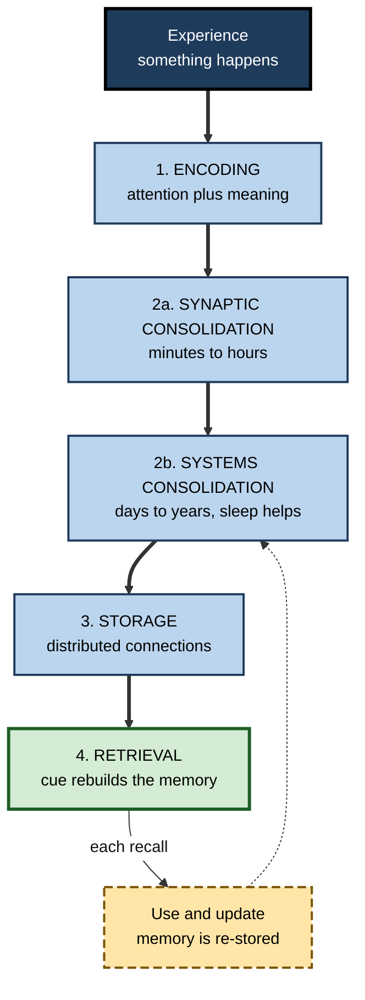
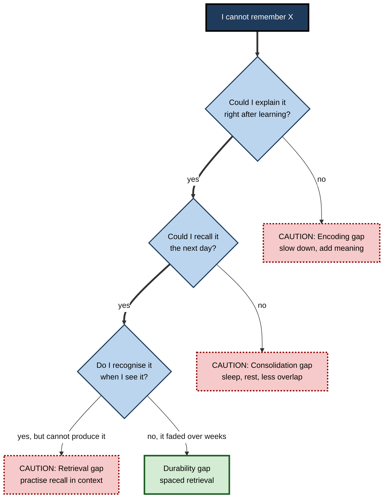

# G.1. Stages of Memory Formation

> **In one sentence:** A memory is not recorded in one instant like a photo; it is built in stages — taken in (encoding), made stable over hours to years (consolidation), kept (storage), and pulled back out when needed (retrieval) — and each stage can succeed or fail on its own.
>
> **Why it matters:** When you know which stage is failing, you can fix the right thing. A new hire who "forgets everything from onboarding" may have an encoding problem, a consolidation problem or a retrieval problem, and each one needs a different remedy.
>
> **Level span:** Novice → Expert · **Reading time:** ~17 min · **Builds on:** the idea that learning is a lasting change caused by experience

---

## The Learning Ladder

| Level | Badge | After this level you can... |
|---|---|---|
| 1 | NOVICE | Describe the life of a memory in plain words: in, settle, keep, out. |
| 2 | FOUNDATIONS | Name and define encoding, consolidation, storage and retrieval, and the two kinds of consolidation. |
| 3 | PRACTITIONER | Diagnose which stage is the weak link when you or a colleague cannot remember something. |
| 4 | ADVANCED | Explain the time course of consolidation, the engram idea, and why retrieval itself changes memory. |
| 5 | EXPERT / PRO | Design training and knowledge processes that support every stage, and measure them separately. |

---

## Level 1 · Novice — The Big Picture

Imagine pouring fresh concrete for a garden path. When it is wet, it takes any shape you press into it, but it is also easy to smudge. Over the next hours it hardens, and over the following weeks it cures until it is very hard to change. A new memory is a lot like that. At first it is fragile and easily disturbed. With time — and especially with sleep — it **settles** into a more durable form.

The life of a memory has four simple steps:

1. **In** — you notice something and your brain turns it into a pattern of activity. (This is called **encoding**, meaning converting an experience into a form the brain can keep.)
2. **Settle** — over the following hours, nights and even years, the brain strengthens and reorganises that pattern. (This is **consolidation**, meaning the process that turns a fragile new memory into a stable one.)
3. **Keep** — the memory is held in the brain until needed. (This is **storage**.)
4. **Out** — you bring it back to mind. (This is **retrieval**.)

You have already experienced each step failing:

- You were introduced to someone while checking your phone and never caught their name. **Encoding failed** — it never got in.
- You learned something late in a long day, slept badly, and by morning it was hazy. **Consolidation was weak** — it got in but did not settle.
- You *know* you know a colleague's name, it is "on the tip of your tongue", and it pops up an hour later. **Retrieval failed for a while** — the memory was there all along.

The beginner's takeaway: **remembering is a chain, and a chain breaks at its weakest link.**

---

## Level 2 · Foundations — Core Concepts

### The four stages

Psychologists and neuroscientists agree on a basic sequence, even though the boundaries between stages are blurry in the real brain.

| Stage | What happens | Typical time scale | Everyday failure |
|---|---|---|---|
| **Encoding** | Attention selects information; the brain builds an initial representation and links it to what you already know. | Milliseconds to seconds | "I never really heard it." |
| **Synaptic (cellular) consolidation** | Connections between the neurons involved are chemically and structurally strengthened. | Minutes to hours (roughly the first day) | A blow to the head or an anaesthetic erases the last few minutes. |
| **Systems consolidation** | The memory is gradually reorganised from depending on the hippocampus to being supported more by networks in the neocortex (the brain's outer layer). | Days to years | Recent memories are more vulnerable to hippocampal damage than old ones. |
| **Storage** | The memory persists as a pattern of altered connections across many neurons. | Indefinite | Gradual decay or overwriting by similar memories. |
| **Retrieval** | A cue reactivates the stored pattern, which is reconstructed in awareness. | Milliseconds to seconds | Tip-of-the-tongue; blanking under stress. |

**Figure G.1-1 — The life cycle of a memory.**

*How to read it:* follow the thick arrows from experience to retrieval; the dotted arrow shows that every retrieval feeds back into consolidation, so remembering changes the memory.

### Key Terms

| Term | Plain meaning |
|---|---|
| **Encoding** | Turning an experience into a brain representation that can be kept. |
| **Consolidation** | The time-dependent stabilisation of a new memory. The term goes back to German psychologists Georg Müller and Alfons Pilzecker around 1900. |
| **Synaptic consolidation** | Strengthening of specific connections (synapses) between neurons within hours of learning. |
| **Systems consolidation** | Slow reorganisation of a memory across brain regions, especially from hippocampus toward neocortex. |
| **Storage** | The persistence of a memory over time. |
| **Retrieval** | Reactivating and reconstructing a stored memory. |
| **Engram** | The physical trace of a memory in the brain — the set of cells and connections that changed. |
| **Retrograde amnesia** | Loss of memories formed *before* an injury or event. |
| **Anterograde amnesia** | Inability to form new lasting memories *after* an injury or event. |

### Encoding is not the same as attention

Attention is the gatekeeper (what gets in at all), but encoding quality depends on *what you do* with the information. Linking a new idea to something you already understand, explaining it in your own words, or picturing it creates a richer trace than simply reading it. Detailed encoding strategies belong to the study of long-term memory and study skills; here the point is only that a strong memory begins with an effortful, meaningful first pass.

---

## Level 3 · Practitioner — Putting It to Work

### The Weak-Link Diagnosis — a five-step method

When something "will not stick", ask stage-by-stage questions before choosing a fix.

1. **Check encoding.** Right after the learning event, can you explain the key point in your own words? If not, the information never got in properly. *Fix:* reduce distraction, slow down, connect it to prior knowledge, generate an example.
2. **Check early consolidation.** Could you recall it an hour later but not the next day? Look at what happened in between: sleep loss, heavy alcohol, a flood of similar new material. *Fix:* protect sleep, add a short quiet pause after learning, avoid stacking similar topics back-to-back.
3. **Check durability.** Could you recall it the next day but not after two weeks? Consolidation needs repeated reactivation. *Fix:* spaced retrieval practice.
4. **Check retrieval.** Do you recognise it when you see it, but cannot produce it when asked? The memory exists; the access route is weak. *Fix:* practise recall (not re-reading) in situations that resemble where you will need it.
5. **Check interference.** Do you mix it up with something similar? *Fix:* study the two side by side and name the differences explicitly.

**Figure G.1-2 — Which stage is failing?**

*How to read it:* answer the questions top to bottom; the first "no" points to the weak stage and its fix.

### Worked example — a consultant learning a client's product catalogue

| | Before | After |
|---|---|---|
| **Encoding** | Skims a 90-slide deck on a train while answering messages. | Reads the deck in two focused 25-minute blocks, writing a one-line summary per product family. |
| **Consolidation** | Learns it at midnight before the workshop, sleeps five hours. | Reads it two evenings before; sleeps normally both nights. |
| **Retrieval** | Re-reads the deck in the taxi. | Closes the deck and lists every product family from memory, then checks. |
| **Result in the workshop** | Confuses two similar product lines in front of the client. | Answers fluently; looks up only one pricing detail. |

### Common mistakes

- **Treating all forgetting as the same.** "I have a bad memory" hides which stage is weak.
- **Ignoring the hours after learning.** What you do immediately after — and the night after — is part of how memory forms.
- **Confusing recognition with recall.** Recognising slides is easy; producing the content is the real test.
- **Fixing retrieval with more input.** Re-reading adds encoding opportunities but does little to train the access route.

---

## Level 4 · Advanced — Mechanisms, Models & Evidence

### The time course of consolidation

The classic evidence for consolidation comes from **retrograde amnesia** after brain injury, electroconvulsive therapy or certain drugs: recent memories are lost while older ones survive. This **temporal gradient** was described in the nineteenth century by Théodule Ribot ("Ribot's law") and has been reproduced many times in animals by disrupting the brain at different delays after learning. Disruption within minutes to hours blocks memory; the same disruption days later does not.

Neuroscience now distinguishes two overlapping processes:

- **Synaptic consolidation** depends on new gene expression and protein synthesis in the neurons that were active during learning. Block protein synthesis in an animal shortly after training and short-term memory is intact but long-term memory fails. This is the basis of the distinction between early and late phases of synaptic strengthening.
- **Systems consolidation** depends on repeated reactivation — "replay" — of the memory, much of it during sleep, through which the hippocampus and neocortex gradually reorganise the memory.

### The engram

The word **engram** was coined by Richard Semon in 1904. For most of the twentieth century it was a hypothesis; Karl Lashley famously failed to find a single location for a memory in rat cortex. Since the 2010s, genetic tagging methods in mice have allowed researchers to label the specific neurons active during learning and later reactivate or silence them. Reactivating tagged cells can trigger the memory; silencing them can block it. Reviews by Sheena Josselyn and Susumu Tonegawa summarise this body of work. Key findings that shape the modern picture:

- **Allocation is competitive.** Neurons that happen to be more excitable at the moment of learning are more likely to join the engram. A transcription factor called CREB raises excitability and biases this selection.
- **Engrams are dynamic.** Studies in 2023–2025 found that engram membership changes within hours: neurons are added and pruned during consolidation, which appears to make memories more selective and distinct.
- **Forgetting can be active.** A 2025 mouse study reported a distinct ensemble of cells in the dentate gyrus that promotes forgetting, and a broader view now treats much natural forgetting as reduced *access* to an engram rather than its erasure.

These are animal findings; the human brain is assumed to work on the same principles, but the details are inferred rather than directly observed.

### Retrieval is a stage that writes as well as reads

Retrieval is not passive playback. Each time a memory is recalled, it is reconstructed and can be strengthened, updated or distorted, then stored again. Two consequences matter here:

1. **Retrieval strengthens memory** more than re-exposure does — the basis of retrieval practice.
2. **Recalled memories can be modified** — the basis of reconsolidation research and of false-memory effects.

### Models in brief

| Model | What it says about stages | Limitation |
|---|---|---|
| **Multi-store (Atkinson–Shiffrin, 1968)** | Sensory → short-term → long-term stores, with rehearsal moving items along. | Too linear; rehearsal alone is a weak encoder. |
| **Levels of processing (Craik and Lockhart, 1972)** | Deeper, meaning-based processing at encoding gives more durable memories. | "Depth" is hard to measure independently. |
| **Standard consolidation theory** | Memories begin hippocampus-dependent and become neocortex-dependent over time. | Detailed episodic memories may always need the hippocampus. |
| **Complementary learning systems** | A fast-learning hippocampus and a slow-learning neocortex work together so new learning does not overwrite old knowledge. | A computational framework; many details still debated. |

### Boundary conditions and open debates

- The four stages overlap; encoding and early consolidation, for example, are not cleanly separable in time.
- "Storage" is not a separate warehouse; the same networks that encode and retrieve also store.
- Whether memories are ever truly erased, or only become inaccessible, is still debated. Animal studies that "rescued" apparently lost memories by stimulating engram cells suggest that some forgetting is a retrieval failure.

---

## Level 5 · Expert / Pro — Professional Mastery

### Designing learning that respects every stage

Most corporate learning is designed as a single encoding event: a workshop, a module, a video. Professionals who understand memory formation design across the whole life cycle.

| Stage | Weak design | Strong design |
|---|---|---|
| Encoding | Dense slides, multitasking participants | Fewer key ideas, worked examples, learners generate explanations |
| Synaptic consolidation | Back-to-back modules on similar topics | Short breaks between modules; dissimilar topics adjacent |
| Systems consolidation | Everything in one day | Content spread across days so sleep falls between sessions |
| Retrieval | Final quiz with notes open | Delayed, closed-book recall in realistic scenarios |
| Updating | No follow-up | Planned refreshers and "what changed" briefings |

### Measuring the stages separately

A mature evaluation plan separates the stages so the fix can be targeted:

- **Immediate free recall or explanation** — a proxy for encoding quality.
- **Next-day recall** — sensitive to consolidation, including sleep.
- **Recall after two to four weeks** — durability.
- **Recognition versus recall gap** — a large gap signals weak retrieval routes.

### Professional scenario

**Role:** Learning and development (L&D) lead at a software company.
**Situation:** A two-day security-awareness bootcamp scores well on the end-of-day quiz, but a phishing simulation a month later shows little behaviour change.
**What the pro does:** Diagnoses a durability and retrieval gap, not an encoding gap: the end-of-day quiz was measuring what was still active the same afternoon. The lead splits the bootcamp into four short sessions over two weeks, ends each with a closed-book scenario, and adds monthly two-minute retrieval prompts embedded in the team chat tool. The month-later simulation is kept as the primary metric.

### AI-era implications

When a search engine or AI assistant can retrieve facts instantly, people tend to encode less deeply — they remember *where* to find information rather than the information itself. This is often efficient. The professional question is which knowledge must complete all four stages inside a person's head: knowledge needed for fast judgement, for spotting errors in tool output, and for situations where tools are unavailable. Everything else can safely be stored externally.

### Ethical limits

Memory-stage language can be misused to blame individuals ("they just don't retain things"). Fatigue, workload, shift patterns and poor instructional design all damage consolidation. A pro looks at the system before the person.

---

## Myths vs. Evidence

| Myth | What the evidence shows |
|---|---|
| "Memory works like a video recorder." | Memories are encoded selectively, consolidated over time and reconstructed at retrieval; they change with each recall. |
| "If I understood it in the moment, it is stored." | Understanding helps encoding, but without consolidation and later retrieval much is lost within days. |
| "Once a memory is consolidated, it is fixed forever." | Retrieved memories can become modifiable again and are updated or distorted. |
| "Forgetting means the memory is gone." | Much forgetting appears to be loss of access; cues can recover memories thought lost. |
| "Each memory lives in one spot in the brain." | Memories are distributed across networks; the engram is a set of cells and connections in several regions. |

## Practitioner Toolkit

**Stage checklist for any important learning**

- [ ] Encoding: I studied in a focused block and explained the idea in my own words.
- [ ] Consolidation: I left a short quiet gap afterwards and slept normally that night.
- [ ] Durability: I scheduled at least two spaced recall attempts.
- [ ] Retrieval: I practised producing the knowledge, not just recognising it.
- [ ] Interference: I compared it explicitly with anything similar.

**Template — weak-link log**

| What I forgot | Could explain right after? | Recalled next day? | Recognised but not recalled? | Weak stage | Fix |
|---|---|---|---|---|---|
| | | | | | |

## Self-Check

1. **[NOVICE]** Name the four basic stages in the life of a memory.
2. **[NOVICE]** You never caught a person's name because you were distracted. Which stage failed?
3. **[FOUNDATIONS]** What is the difference between synaptic and systems consolidation?
4. **[FOUNDATIONS]** Define anterograde and retrograde amnesia.
5. **[PRACTITIONER]** A colleague recognises every slide but cannot explain the content. Which stage is weak and what would you advise?
6. **[ADVANCED]** What does Ribot's temporal gradient tell us about consolidation?
7. **[ADVANCED]** What does "engram allocation is competitive" mean?
8. **[EXPERT / PRO]** How would you measure encoding, consolidation and retrieval separately in a training programme?

### Answer Key

1. Encoding, consolidation, storage, retrieval.
2. Encoding.
3. Synaptic consolidation stabilises connections within hours through protein synthesis; systems consolidation reorganises the memory across brain regions over days to years.
4. Anterograde: cannot form new lasting memories after an event. Retrograde: loses memories formed before the event.
5. Retrieval. Practise free recall and explanation without the slides, ideally in realistic contexts.
6. Recent memories are more vulnerable to disruption than older ones, implying memories become more stable over time.
7. Neurons compete to join a memory trace; those more excitable at learning time are more likely to be recruited.
8. Immediate free recall for encoding, next-day recall for consolidation, recall after weeks for durability, and the gap between recognition and recall for retrieval strength.

## Key Takeaways

- A memory is built in **stages**: encoding, consolidation (synaptic then systems), storage and retrieval.
- Each stage can fail independently; **diagnose the weak link** before choosing a fix.
- New memories are **fragile for hours** and keep reorganising for much longer, with sleep playing a major role.
- The **engram** is a distributed, dynamic set of cells, now studied directly in animals.
- **Retrieval rewrites memory** — it both strengthens and can alter what is stored.
- Professionals design and measure learning **across the whole life cycle**, not just the first exposure.

## Glossary

| Term | Meaning |
|---|---|
| Anterograde amnesia | Inability to form new lasting memories after an injury or event. |
| Complementary learning systems | Framework in which a fast hippocampal system and a slow neocortical system cooperate. |
| Consolidation | Time-dependent stabilisation of a new memory. |
| CREB | A protein that switches on genes needed for long-term memory and raises neuron excitability. |
| Encoding | Converting an experience into a stored representation. |
| Engram | The physical trace of a memory in the brain. |
| Protein synthesis | The cell's manufacture of new proteins, required for long-lasting synaptic change. |
| Retrieval | Reactivating and reconstructing a stored memory. |
| Retrograde amnesia | Loss of memories formed before an injury or event. |
| Ribot's law | The observation that recent memories are more vulnerable to brain injury than older ones. |
| Storage | Persistence of a memory over time. |
| Systems consolidation | Gradual reorganisation of memory from hippocampus-dependent toward neocortex-supported. |
